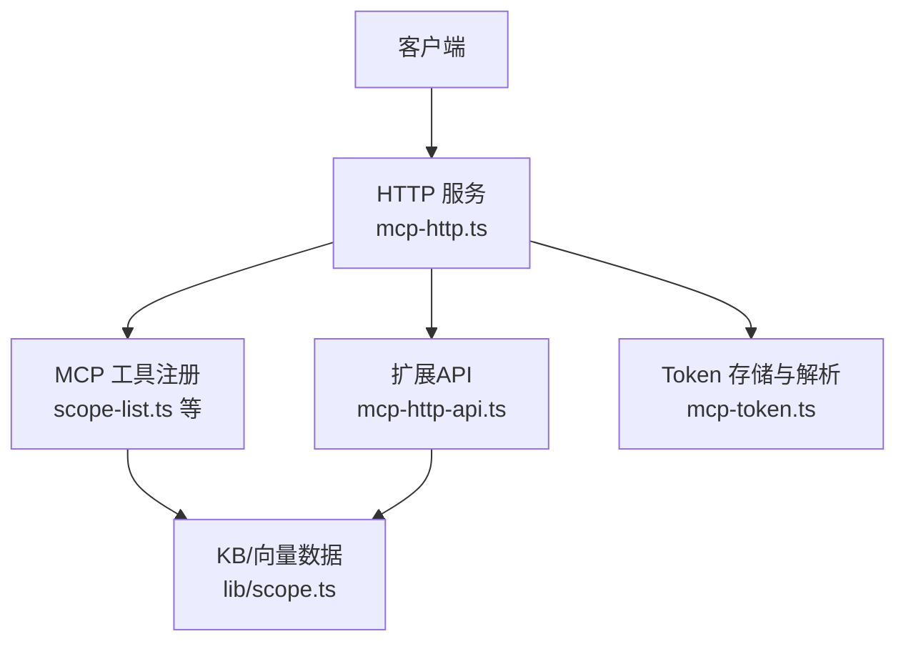
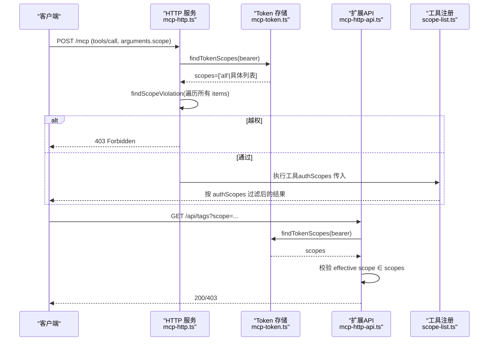
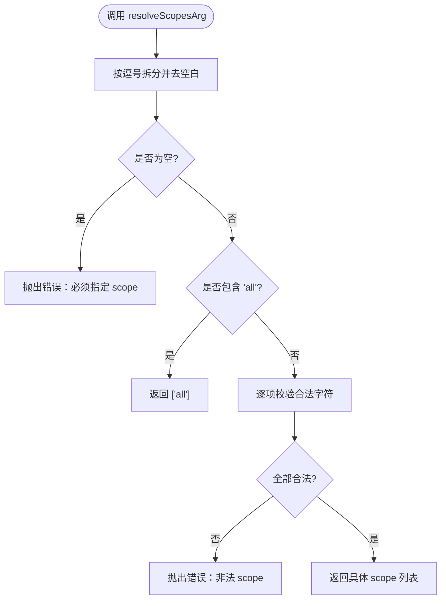
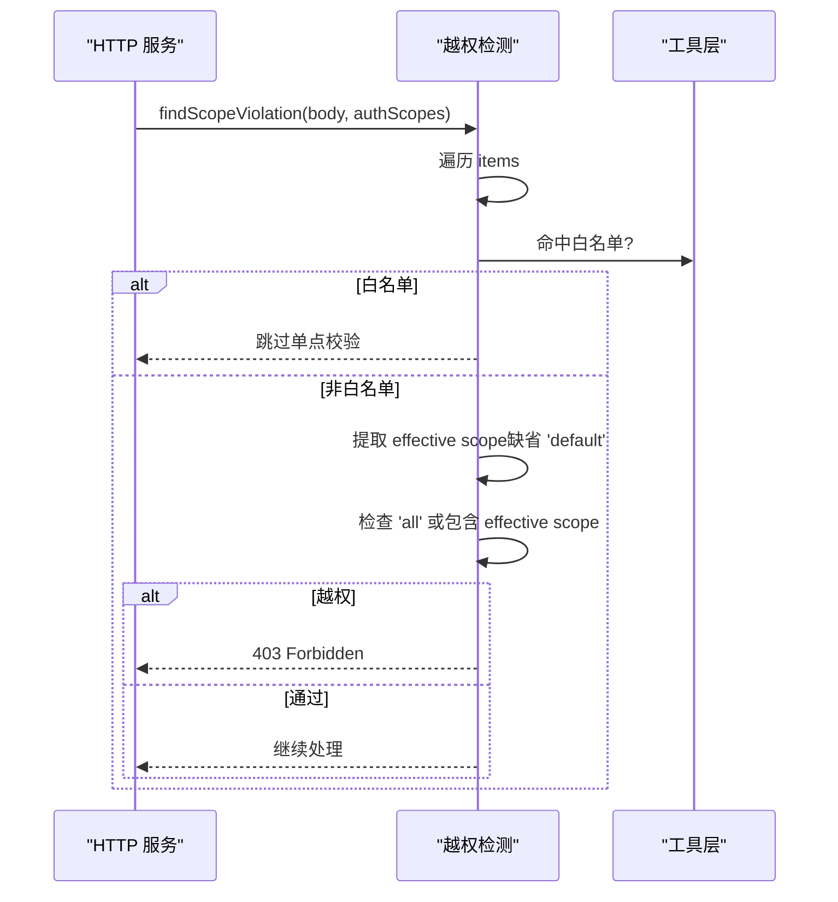
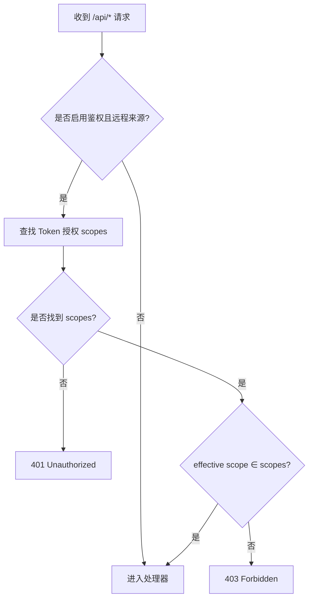
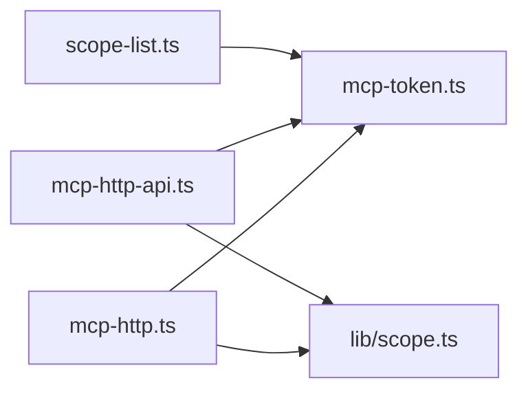

# Scope授权模型

<cite>
**本文引用的文件**
- [src/lib/scope.ts](file://src/lib/scope.ts)
- [src/scope.ts](file://src/scope.ts)
- [src/lib/mcp-token.ts](file://src/lib/mcp-token.ts)
- [src/lib/mcp-http.ts](file://src/lib/mcp-http.ts)
- [src/lib/mcp-http-api.ts](file://src/lib/mcp-http-api.ts)
- [src/lib/mcp-tools/scope-list.ts](file://src/lib/mcp-tools/scope-list.ts)
- [test/mcp-token.test.ts](file://test/mcp-token.test.ts)
- [test/scope-isolation.test.ts](file://test/scope-isolation.test.ts)
- [test/scope-doc.test.ts](file://test/scope-doc.test.ts)
</cite>

## 目录
1. [简介](#简介)
2. [项目结构](#项目结构)
3. [核心组件](#核心组件)
4. [架构总览](#架构总览)
5. [详细组件分析](#详细组件分析)
6. [依赖关系分析](#依赖关系分析)
7. [性能与可扩展性](#性能与可扩展性)
8. [故障排查指南](#故障排查指南)
9. [结论](#结论)
10. [附录：配置示例与最佳实践](#附录配置示例与最佳实践)

## 简介
本文件系统性说明 MCP（Model Context Protocol）在该项目中的 RBAC（基于角色的访问控制）实现，聚焦于 Scope 授权模型。内容涵盖：
- Scope 的概念、命名规范与校验规则
- 'all' 保留字的作用机制与 Scope 集合解析逻辑
- HTTP 层与 API 层的 Scope 授权检查算法与优先级
- 不同场景下的 Scope 配置示例（单个、多个、全部）
- Scope 冲突解决与权限继承的最佳实践
- 错误处理与调试方法

## 项目结构
Scope 授权能力由“存储/解析 + HTTP 鉴权 + 工具层过滤”三层协作完成：
- 存储与解析：mcp-token.ts 负责多 Token 存储、scope 集合解析与查找
- HTTP 鉴权：mcp-http.ts 负责 Bearer Token 校验、tools/call 的 scope 越权拦截
- API 鉴权：mcp-http-api.ts 对 /api/* 的 query/body scope 做越权校验
- 工具层过滤：scope-list.ts 等枚举类工具按 authScopes 过滤输出，避免泄露未授权 scope
- 数据隔离：lib/scope.ts 提供 KB 路径构造与校验；CLI scope 管理命令在 src/scope.ts

**图表来源**
- [src/lib/mcp-http.ts:454-526](file://src/lib/mcp-http.ts#L454-L526)
- [src/lib/mcp-http-api.ts:216-272](file://src/lib/mcp-http-api.ts#L216-L272)
- [src/lib/mcp-token.ts:245-259](file://src/lib/mcp-token.ts#L245-L259)
- [src/lib/mcp-tools/scope-list.ts:11-41](file://src/lib/mcp-tools/scope-list.ts#L11-L41)
- [src/lib/scope.ts:30-53](file://src/lib/scope.ts#L30-L53)

**章节来源**
- [src/lib/mcp-http.ts:454-526](file://src/lib/mcp-http.ts#L454-L526)
- [src/lib/mcp-http-api.ts:216-272](file://src/lib/mcp-http-api.ts#L216-L272)
- [src/lib/mcp-token.ts:245-259](file://src/lib/mcp-token.ts#L245-L259)
- [src/lib/mcp-tools/scope-list.ts:11-41](file://src/lib/mcp-tools/scope-list.ts#L11-L41)
- [src/lib/scope.ts:30-53](file://src/lib/scope.ts#L30-L53)

## 核心组件
- 多 Token 存储与解析（mcp-token.ts）
  - TokenRecord：id/token/scopes/createdAt
  - resolveScopesArg：支持单个、逗号分隔、'all' 归一化
  - findTokenScopes：常量时间比较查找授权 scope 集合
  - isScopeAuthorized：授权判定（null 免鉴权，['all'] 通配）
- HTTP 鉴权与越权拦截（mcp-http.ts）
  - 非回环绑定强制 Bearer Token 鉴权
  - tools/call 统一提取 arguments.scope 并做越权校验
  - 白名单 SCOPE_LESS_TOOLS：ki_scope_list、ki_manage_index_list 跳过单点 scope 校验，交由工具层按 authScopes 过滤
- API 鉴权（mcp-http-api.ts）
  - /api/tags、/api/doc/list 的 query scope 校验
  - /api/import/upload、/api/import/run 的 body scope 校验
  - 缺省 effective scope = 'default'，防止不传 scope 绕过授权
- 工具层过滤（scope-list.ts）
  - 按当前会话 authScopes 过滤返回 scope 列表，避免泄露未授权 scope
- 数据隔离（lib/scope.ts）
  - validateScope：仅允许字母、数字、连字符、下划线
  - getKbDir/getGroupIndexPath/getRelationsCachePath：构造 scope 相关路径

**章节来源**
- [src/lib/mcp-token.ts:25-50](file://src/lib/mcp-token.ts#L25-L50)
- [src/lib/mcp-token.ts:76-95](file://src/lib/mcp-token.ts#L76-L95)
- [src/lib/mcp-token.ts:245-259](file://src/lib/mcp-token.ts#L245-L259)
- [src/lib/mcp-http.ts:100-138](file://src/lib/mcp-http.ts#L100-L138)
- [src/lib/mcp-http.ts:454-526](file://src/lib/mcp-http.ts#L454-L526)
- [src/lib/mcp-http-api.ts:216-272](file://src/lib/mcp-http-api.ts#L216-L272)
- [src/lib/mcp-tools/scope-list.ts:11-41](file://src/lib/mcp-tools/scope-list.ts#L11-L41)
- [src/lib/scope.ts:30-53](file://src/lib/scope.ts#L30-L53)

## 架构总览
RBAC 在 MCP 的实现以“请求到达 → 鉴权 → 解析授权集合 → 逐条校验 scope → 工具层过滤输出”为主线。

**图表来源**
- [src/lib/mcp-http.ts:454-526](file://src/lib/mcp-http.ts#L454-L526)
- [src/lib/mcp-token.ts:245-259](file://src/lib/mcp-token.ts#L245-L259)
- [src/lib/mcp-http-api.ts:216-272](file://src/lib/mcp-http-api.ts#L216-L272)
- [src/lib/mcp-tools/scope-list.ts:11-41](file://src/lib/mcp-tools/scope-list.ts#L11-L41)

## 详细组件分析

### 组件A：Token 存储与 Scope 解析（mcp-token.ts）
- 设计要点
  - 每个 Token 记录包含授权 scope 集合，支持 ['all'] 或具体列表
  - resolveScopesArg 将用户输入归一化为数组，含 'all' 时直接归一为 ['all']
  - findTokenScopes 使用常量时间比较，避免时序侧信道
  - listTokensStrict 保护损坏文件，写操作拒绝覆盖，避免数据丢失
- 复杂度
  - findTokenScopes：O(n)，n 为 Token 记录数；每次比较为常量时间
  - resolveScopesArg：O(k)，k 为逗号分隔项数量
- 优化建议
  - 当 Token 数量增长到较大规模时，可考虑索引化 token→scopes 映射以提升查找性能
  - 保持原子写与严格读，确保高可用与一致性

**图表来源**
- [src/lib/mcp-token.ts:76-95](file://src/lib/mcp-token.ts#L76-L95)

**章节来源**
- [src/lib/mcp-token.ts:25-50](file://src/lib/mcp-token.ts#L25-L50)
- [src/lib/mcp-token.ts:76-95](file://src/lib/mcp-token.ts#L76-L95)
- [src/lib/mcp-token.ts:97-147](file://src/lib/mcp-token.ts#L97-L147)
- [src/lib/mcp-token.ts:183-201](file://src/lib/mcp-token.ts#L183-L201)
- [src/lib/mcp-token.ts:207-222](file://src/lib/mcp-token.ts#L207-L222)
- [src/lib/mcp-token.ts:228-238](file://src/lib/mcp-token.ts#L228-L238)
- [src/lib/mcp-token.ts:245-259](file://src/lib/mcp-token.ts#L245-L259)

### 组件B：HTTP 层 Scope 越权校验（mcp-http.ts）
- 设计要点
  - 非回环绑定启用鉴权，本地回环免鉴权
  - 全权临时 Token（--token/KI_MCP_TOKEN）→ ['all']
  - 多 Token 存储 → 查 scopes
  - findScopeViolation 遍历 batch 全部项，任一越权即 403
  - 白名单 SCOPE_LESS_TOOLS：ki_scope_list、ki_manage_index_list 跳过单点 scope 校验，交由工具层按 authScopes 过滤
  - 缺失/非法 arguments 视为 {scope='default'}，参与校验，防止绕过
- 优先级规则
  - 先鉴权（Bearer），再解析 scopes，再逐条校验 scope
  - 白名单工具优先放行，再由工具层过滤
- 错误处理
  - 越权日志记录（服务端 stderr），响应体脱敏（不下发 scope 名）

**图表来源**
- [src/lib/mcp-http.ts:100-138](file://src/lib/mcp-http.ts#L100-L138)
- [src/lib/mcp-http.ts:454-526](file://src/lib/mcp-http.ts#L454-L526)

**章节来源**
- [src/lib/mcp-http.ts:100-138](file://src/lib/mcp-http.ts#L100-L138)
- [src/lib/mcp-http.ts:454-526](file://src/lib/mcp-http.ts#L454-L526)

### 组件C：API 层 Scope 校验（mcp-http-api.ts）
- 设计要点
  - /api/tags、/api/doc/list：query scope 有效值缺省为 'default'
  - /api/import/upload、/api/import/run：body scope 必填或有效值缺省为 'default'
  - 越权拒绝：服务端记日志，响应体脱敏
- 优先级规则
  - 先鉴权，再解析 effective scope，再做越权校验

**图表来源**
- [src/lib/mcp-http-api.ts:216-272](file://src/lib/mcp-http-api.ts#L216-L272)

**章节来源**
- [src/lib/mcp-http-api.ts:216-272](file://src/lib/mcp-http-api.ts#L216-L272)

### 组件D：工具层过滤（scope-list.ts）
- 设计要点
  - ki_scope_list 无 scope 参数，属于白名单工具
  - 返回结果按 authScopes 过滤，避免泄露未授权 scope
- 优先级规则
  - HTTP 层放行后，工具层按授权集合过滤输出

**章节来源**
- [src/lib/mcp-tools/scope-list.ts:11-41](file://src/lib/mcp-tools/scope-list.ts#L11-L41)

### 组件E：数据隔离与路径构造（lib/scope.ts）
- 设计要点
  - validateScope：仅允许字母、数字、连字符、下划线
  - getKbDir：优先 config.scopes[scope].kbDir，否则 fallback 到 dataDir/{scope}
  - 列出已初始化 scope：扫描 dataDir 中带有 relations-cache.json 的目录
- 物理隔离验证
  - 测试覆盖相同 Group/Relation 在不同 scope 独立存储，跨 scope 不串读/串写/串删

**章节来源**
- [src/lib/scope.ts:30-53](file://src/lib/scope.ts#L30-L53)
- [src/lib/scope.ts:174-198](file://src/lib/scope.ts#L174-L198)
- [test/scope-isolation.test.ts:50-153](file://test/scope-isolation.test.ts#L50-L153)

## 依赖关系分析
- mcp-http.ts 依赖 mcp-token.ts（findTokenScopes、ALL_SCOPES）
- mcp-http-api.ts 依赖 mcp-token.ts（findTokenScopes、ALL_SCOPES）
- scope-list.ts 依赖 mcp-token.ts（isScopeAuthorized）
- lib/scope.ts 被 CLI 与多处业务模块引用，提供路径构造与校验

**图表来源**
- [src/lib/mcp-http.ts:25-26](file://src/lib/mcp-http.ts#L25-L26)
- [src/lib/mcp-http-api.ts:23-28](file://src/lib/mcp-http-api.ts#L23-L28)
- [src/lib/mcp-tools/scope-list.ts:2-4](file://src/lib/mcp-tools/scope-list.ts#L2-L4)

**章节来源**
- [src/lib/mcp-http.ts:25-26](file://src/lib/mcp-http.ts#L25-L26)
- [src/lib/mcp-http-api.ts:23-28](file://src/lib/mcp-http-api.ts#L23-L28)
- [src/lib/mcp-tools/scope-list.ts:2-4](file://src/lib/mcp-tools/scope-list.ts#L2-L4)

## 性能与可扩展性
- 查找性能
  - findTokenScopes：O(n) 线性遍历，使用常量时间比较，适合中小规模 Token 集
  - 若 Token 数量增长，可引入哈希索引或数据库后端提升查找效率
- 批处理安全
  - findScopeViolation 遍历全部 items，避免 batch 首项合法后续越权绕过
- 资源回收
  - 空闲会话定期回收，防止内存泄漏
- 可扩展性
  - 白名单机制便于新增无 scope 参数的枚举工具，但需同步维护清单
  - 工具层过滤与 HTTP 层校验分离，便于扩展新的授权策略

[本节为通用指导，无需特定文件来源]

## 故障排查指南
- 常见错误
  - 401 Unauthorized：缺少或无效 Bearer Token
  - 403 Forbidden：effective scope 不在授权集合内
  - Token 存储损坏：listTokensStrict 抛错，写操作拒绝覆盖
- 排查步骤
  - 检查客户端 Authorization: Bearer 是否与 ki mcp token list 输出一致
  - 查看服务端 stderr 日志（鉴权失败与 scope 越权拦截）
  - 确认 /healthz 的 authFailures 计数
  - 检查 Token 存储文件权限与完整性（~/.ki/mcp-tokens.json）
- 调试技巧
  - 使用 --status 查看实例状态与托管 Token 数量
  - 对白名单工具（ki_scope_list、ki_manage_index_list）确认工具层过滤是否正确

**章节来源**
- [src/lib/mcp-http.ts:358-372](file://src/lib/mcp-http.ts#L358-L372)
- [src/lib/mcp-http.ts:454-526](file://src/lib/mcp-http.ts#L454-L526)
- [src/lib/mcp-http-api.ts:130-143](file://src/lib/mcp-http-api.ts#L130-L143)
- [src/lib/mcp-token.ts:136-147](file://src/lib/mcp-token.ts#L136-L147)
- [test/mcp-token.test.ts:222-263](file://test/mcp-token.test.ts#L222-L263)

## 结论
本项目在 MCP 中实现了以 Scope 为核心的 RBAC 授权模型：
- 通过多 Token 存储与解析，支持单个、多个与 'all' 三种授权模式
- HTTP 层统一拦截 tools/call 的 scope 参数，结合白名单机制保障安全边界
- API 层对 query/body scope 做等效校验，缺省 effective scope = 'default'
- 工具层按 authScopes 过滤输出，避免信息泄露
- 数据隔离通过 validateScope 与路径构造保证，测试覆盖跨 scope 独立性

该设计兼顾安全性、可维护性与可扩展性，适用于多租户、多项目隔离场景。

[本节为总结，无需特定文件来源]

## 附录：配置示例与最佳实践

### Scope 命名规范与校验
- 仅允许字母、数字、连字符、下划线
- 禁止路径遍历字符
- 校验入口：validateScope（lib/scope.ts）

**章节来源**
- [src/lib/scope.ts:30-43](file://src/lib/scope.ts#L30-L43)

### 'all' 保留字与作用机制
- 'all' 表示授权全部 scope
- 解析：resolveScopesArg 含 'all' 时归一化为 ['all']
- 判定：isScopeAuthorized 对 ['all'] 通配全部

**章节来源**
- [src/lib/mcp-token.ts:40-50](file://src/lib/mcp-token.ts#L40-L50)
- [src/lib/mcp-token.ts:76-95](file://src/lib/mcp-token.ts#L76-L95)

### Scope 集合解析逻辑
- 支持单个、多个（逗号分隔）、'all'
- 含 'all' 时忽略其余冗余值
- 非法 scope 立即报错

**章节来源**
- [src/lib/mcp-token.ts:76-95](file://src/lib/mcp-token.ts#L76-L95)
- [test/mcp-token.test.ts:68-92](file://test/mcp-token.test.ts#L68-L92)

### Scope 授权检查算法与优先级
- 非回环绑定启用鉴权，本地回环免鉴权
- 全权临时 Token → ['all']；多 Token 存储 → 查 scopes
- tools/call 统一提取 arguments.scope，缺省 'default'
- 白名单工具跳过单点校验，交由工具层过滤
- 任一越权即 403

**章节来源**
- [src/lib/mcp-http.ts:454-526](file://src/lib/mcp-http.ts#L454-L526)
- [src/lib/mcp-http.ts:100-138](file://src/lib/mcp-http.ts#L100-L138)

### 配置示例
- 单个 Scope：创建 Token 时指定单一 scope
- 多个 Scope：创建 Token 时指定逗号分隔的多个 scope
- 全部授权：创建 Token 时指定 'all'

**章节来源**
- [test/mcp-token.test.ts:68-92](file://test/mcp-token.test.ts#L68-L92)
- [test/mcp-token.test.ts:187-190](file://test/mcp-token.test.ts#L187-L190)

### 冲突解决与权限继承最佳实践
- 冲突解决
  - 白名单工具（ki_scope_list、ki_manage_index_list）由工具层按 authScopes 过滤，避免越权
  - 缺失 arguments 视为 {scope='default'}，防止绕过授权
- 权限继承
  - 当前设计为“按 Token 授权集合精确匹配”，无隐式继承
  - 如需继承，可在 Token 创建时显式包含父级 scope

**章节来源**
- [src/lib/mcp-http.ts:100-138](file://src/lib/mcp-http.ts#L100-L138)
- [src/lib/mcp-tools/scope-list.ts:11-41](file://src/lib/mcp-tools/scope-list.ts#L11-L41)

### 错误处理与调试方法
- 错误类型
  - EMPTY_SCOPE、INVALID_SCOPE（lib/scope.ts）
  - MCP_TOKEN_CORRUPT（mcp-token.ts）
  - TOKEN_NOT_FOUND（mcp-token.ts）
- 调试方法
  - 查看 /healthz 的 authFailures
  - 检查服务端 stderr 日志
  - 使用 ki mcp --status 诊断实例与 Token 数量

**章节来源**
- [src/lib/scope.ts:14-24](file://src/lib/scope.ts#L14-L24)
- [src/lib/mcp-token.ts:136-147](file://src/lib/mcp-token.ts#L136-L147)
- [src/lib/mcp-token.ts:207-222](file://src/lib/mcp-token.ts#L207-L222)
- [src/lib/mcp-http.ts:358-372](file://src/lib/mcp-http.ts#L358-L372)