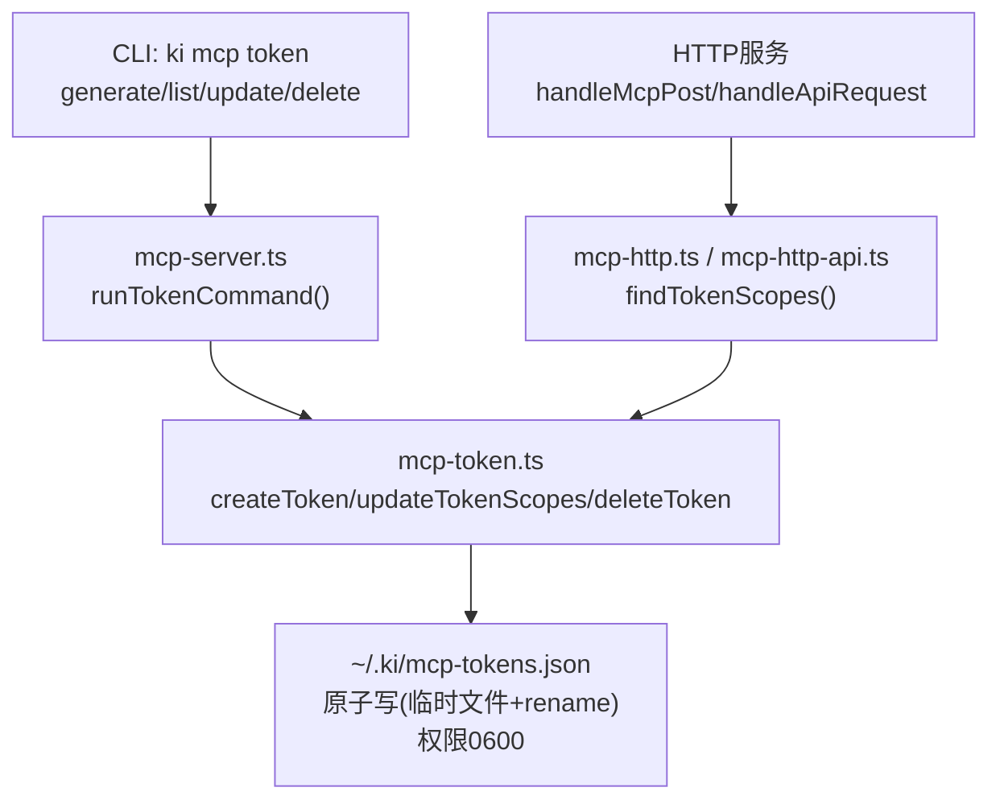
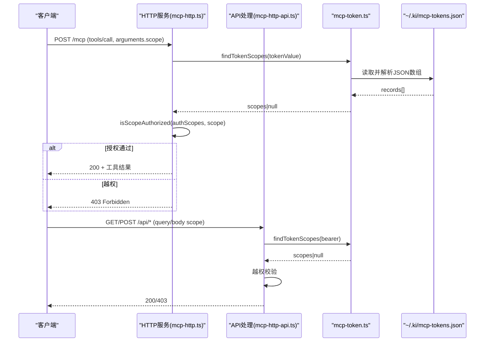
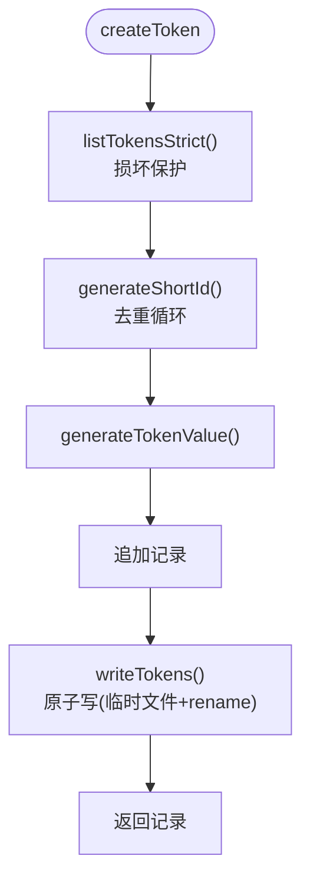
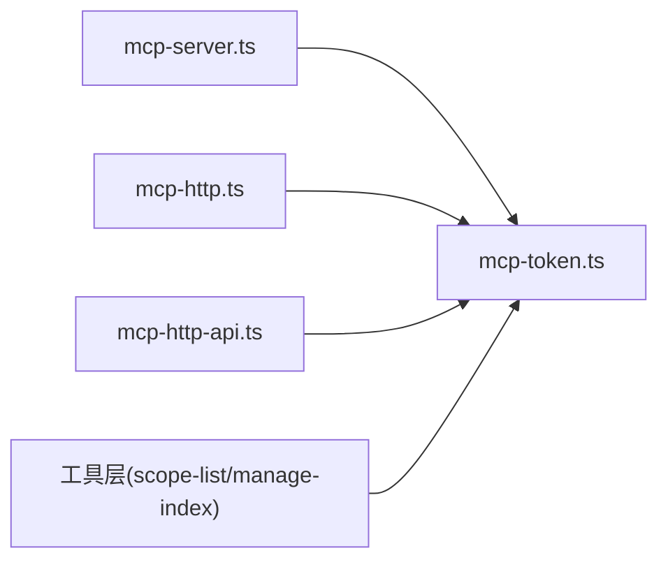

# Token管理机制

<cite>
**本文引用的文件**
- [src/lib/mcp-token.ts](file://src/lib/mcp-token.ts)
- [src/mcp-server.ts](file://src/mcp-server.ts)
- [src/lib/mcp-http.ts](file://src/lib/mcp-http.ts)
- [src/lib/mcp-http-api.ts](file://src/lib/mcp-http-api.ts)
- [test/mcp-token.test.ts](file://test/mcp-token.test.ts)
- [AGENTS.md](file://AGENTS.md)
</cite>

## 目录
1. [简介](#简介)
2. [项目结构](#项目结构)
3. [核心组件](#核心组件)
4. [架构总览](#架构总览)
5. [详细组件分析](#详细组件分析)
6. [依赖关系分析](#依赖关系分析)
7. [性能与安全性考量](#性能与安全性考量)
8. [故障排查指南](#故障排查指南)
9. [结论](#结论)
10. [附录：CLI命令与API接口](#附录cli命令与api接口)

## 简介
本文件系统性说明多Token存储与授权机制，覆盖数据结构、短ID生成、安全值生成、生命周期管理（创建/更新/删除/查询）、存储文件格式与权限、原子写入、时序安全比较与防侧信道措施，以及CLI命令与API集成方式。同时给出Token损坏恢复与数据迁移建议。

## 项目结构
Token管理相关代码集中在以下位置：
- 核心实现：src/lib/mcp-token.ts
- CLI入口与子命令：src/mcp-server.ts
- HTTP鉴权与越权校验：src/lib/mcp-http.ts、src/lib/mcp-http-api.ts
- 单元测试：test/mcp-token.test.ts
- 需求与变更记录：AGENTS.md

图表来源
- [src/mcp-server.ts:227-351](file://src/mcp-server.ts#L227-L351)
- [src/lib/mcp-token.ts:156-201](file://src/lib/mcp-token.ts#L156-L201)
- [src/lib/mcp-http.ts:327-501](file://src/lib/mcp-http.ts#L327-L501)
- [src/lib/mcp-http-api.ts:216-238](file://src/lib/mcp-http-api.ts#L216-L238)

章节来源
- [src/lib/mcp-token.ts:1-265](file://src/lib/mcp-token.ts#L1-L265)
- [src/mcp-server.ts:227-351](file://src/mcp-server.ts#L227-L351)
- [src/lib/mcp-http.ts:327-501](file://src/lib/mcp-http.ts#L327-L501)
- [src/lib/mcp-http-api.ts:216-238](file://src/lib/mcp-http-api.ts#L216-L238)
- [test/mcp-token.test.ts:1-270](file://test/mcp-token.test.ts#L1-L270)
- [AGENTS.md:92-136](file://AGENTS.md#L92-L136)

## 核心组件
- TokenRecord：单条Token记录，包含id、token明文、scopes、createdAt。
- 短ID生成：基于密码学随机字节映射到无易混淆字符的字母表，长度固定为8位。
- Token值生成：使用密码学安全的随机源生成32字节熵，base64url编码输出。
- Scope解析与授权：支持单个、多个逗号分隔、all保留字；授权判定函数isScopeAuthorized用于工具层过滤。
- 存储读写：listTokensStrict用于写操作与CLI list，防止损坏文件被静默覆盖；listTokens用于鉴权路径fail-closed。
- 原子写入：先写同目录临时文件（0600），再rename覆盖目标，避免半写损坏。
- 常量时间比较：findTokenScopes遍历所有记录并使用timingSafeEqual进行比对，避免时序侧信道泄露匹配位置。

章节来源
- [src/lib/mcp-token.ts:26-35](file://src/lib/mcp-token.ts#L26-L35)
- [src/lib/mcp-token.ts:52-68](file://src/lib/mcp-token.ts#L52-L68)
- [src/lib/mcp-token.ts:76-95](file://src/lib/mcp-token.ts#L76-L95)
- [src/lib/mcp-token.ts:98-147](file://src/lib/mcp-token.ts#L98-L147)
- [src/lib/mcp-token.ts:156-176](file://src/lib/mcp-token.ts#L156-L176)
- [src/lib/mcp-token.ts:245-259](file://src/lib/mcp-token.ts#L245-L259)

## 架构总览
多Token架构将“鉴权”从“单Token全局比对”升级为“按Token明文查授权scope集合”，并在HTTP层统一拦截tools/call与/api/*请求做越权校验。

图表来源
- [src/lib/mcp-http.ts:327-501](file://src/lib/mcp-http.ts#L327-L501)
- [src/lib/mcp-http-api.ts:216-238](file://src/lib/mcp-http-api.ts#L216-L238)
- [src/lib/mcp-token.ts:245-259](file://src/lib/mcp-token.ts#L245-L259)

## 详细组件分析

### TokenRecord数据结构
- id：8位短ID，唯一标识，供update/delete使用。
- token：明文（32字节熵，base64url）。
- scopes：授权scope集合，['all']表示全部；否则为具体scope列表。
- createdAt：ISO 8601创建时间。

章节来源
- [src/lib/mcp-token.ts:26-35](file://src/lib/mcp-token.ts#L26-L35)

### 短ID生成算法
- 使用密码学安全随机源生成8字节。
- 映射到去除了易混淆字符（如0/O/1/l/I）的字母表，确保可读性与可输入性。
- 冲突检测在createToken中通过Set去重循环保证。

章节来源
- [src/lib/mcp-token.ts:52-68](file://src/lib/mcp-token.ts#L52-L68)
- [src/lib/mcp-token.ts:183-201](file://src/lib/mcp-token.ts#L183-L201)

### Token值的安全生成机制
- 使用crypto.randomBytes(32)生成强随机熵。
- base64url编码输出，长度约43字符，具备足够抗碰撞能力。
- 测试验证多次生成互不相同且符合正则格式。

章节来源
- [src/lib/mcp-token.ts:55-58](file://src/lib/mcp-token.ts#L55-L58)
- [test/mcp-token.test.ts:43-53](file://test/mcp-token.test.ts#L43-L53)

### 完整生命周期管理

#### 创建(createToken)
- 严格读取：若存储文件损坏则拒绝覆盖写回，抛出MCP_TOKEN_CORRUPT。
- 生成唯一短ID与强随机Token值，追加记录后原子写回。
- 返回完整记录（含id、token明文、scopes、createdAt）。

图表来源
- [src/lib/mcp-token.ts:183-201](file://src/lib/mcp-token.ts#L183-L201)
- [src/lib/mcp-token.ts:156-176](file://src/lib/mcp-token.ts#L156-L176)

章节来源
- [src/lib/mcp-token.ts:183-201](file://src/lib/mcp-token.ts#L183-L201)

#### 更新(updateTokenScopes)
- 严格读取存储文件，按id查找目标记录。
- 不存在则抛出TOKEN_NOT_FOUND。
- 更新scopes后原子写回。

章节来源
- [src/lib/mcp-token.ts:207-222](file://src/lib/mcp-token.ts#L207-L222)

#### 删除(deleteToken)
- 严格读取存储文件，按id查找并移除记录。
- 不存在则抛出TOKEN_NOT_FOUND。
- 原子写回剩余记录。

章节来源
- [src/lib/mcp-token.ts:228-238](file://src/lib/mcp-token.ts#L228-L238)

#### 查询(listTokens/findTokenScopes/tokenCount)
- listTokens：宽松读取，损坏时返回空数组（鉴权fail-closed）。
- listTokensStrict：严格读取，损坏抛错（写操作与CLI list使用）。
- findTokenScopes：按Token明文遍历记录，使用常量时间比较，命中返回scopes，未命中返回undefined。
- tokenCount：统计记录数量，不含明文。

章节来源
- [src/lib/mcp-token.ts:128-147](file://src/lib/mcp-token.ts#L128-L147)
- [src/lib/mcp-token.ts:245-264](file://src/lib/mcp-token.ts#L245-L264)

### 存储文件格式、权限与原子写入
- 文件路径：~/.ki/mcp-tokens.json（与mcp-http.lock同目录）。
- 文件格式：JSON数组，元素为TokenRecord对象。
- 权限设置：目录0700，文件0600，仅属主可读写。
- 原子写入：先写同目录临时文件（带进程PID与随机后缀），再rename覆盖目标；异常时清理残留.tmp。

章节来源
- [src/lib/mcp-token.ts:20-23](file://src/lib/mcp-token.ts#L20-L23)
- [src/lib/mcp-token.ts:156-176](file://src/lib/mcp-token.ts#L156-L176)
- [test/mcp-token.test.ts:94-178](file://test/mcp-token.test.ts#L94-L178)

### 时序安全比较与防侧信道攻击
- findTokenScopes对每条记录的token明文使用crypto.timingSafeEqual进行常量时间比较。
- 即使长度不同也会跳过比较，避免分支泄露。
- 该设计防止通过响应时间推断匹配位置或提前终止。

章节来源
- [src/lib/mcp-token.ts:245-259](file://src/lib/mcp-token.ts#L245-L259)

### 授权判定与工具层过滤
- isScopeAuthorized：null表示免鉴权；['all']表示全部；否则检查是否包含目标scope。
- 工具层（如scope-list、manage-index）根据authScopes过滤返回结果，避免枚举泄露。

章节来源
- [src/lib/mcp-token.ts:47-50](file://src/lib/mcp-token.ts#L47-L50)
- [src/lib/mcp-tools/scope-list.ts:26](file://src/lib/mcp-tools/scope-list.ts#L26)
- [src/lib/mcp-tools/manage-index.ts:57](file://src/lib/mcp-tools/manage-index.ts#L57)

## 依赖关系分析
- mcp-server.ts调用mcp-token.ts提供CLI命令（generate/list/update/delete）。
- mcp-http.ts与mcp-http-api.ts在HTTP层调用findTokenScopes进行鉴权与越权校验。
- 测试用例覆盖生成、解析、CRUD、原子写、损坏保护等关键路径。

图表来源
- [src/mcp-server.ts:227-351](file://src/mcp-server.ts#L227-L351)
- [src/lib/mcp-http.ts:327-501](file://src/lib/mcp-http.ts#L327-L501)
- [src/lib/mcp-http-api.ts:216-238](file://src/lib/mcp-http-api.ts#L216-L238)
- [src/lib/mcp-tools/scope-list.ts:26](file://src/lib/mcp-tools/scope-list.ts#L26)
- [src/lib/mcp-tools/manage-index.ts:57](file://src/lib/mcp-tools/manage-index.ts#L57)

章节来源
- [src/mcp-server.ts:227-351](file://src/mcp-server.ts#L227-L351)
- [src/lib/mcp-http.ts:327-501](file://src/lib/mcp-http.ts#L327-L501)
- [src/lib/mcp-http-api.ts:216-238](file://src/lib/mcp-http-api.ts#L216-L238)

## 性能与安全性考量
- 性能：
  - 存储文件较小，遍历开销可接受；高频场景可考虑缓存scopes（进程级）。
  - 原子写减少I/O竞争风险，但并发“读-改-写”仍可能丢更新（低频运维可接受）。
- 安全性：
  - 强随机Token值与短ID降低预测与碰撞风险。
  - 常量时间比较防止时序侧信道。
  - 文件权限0600限制非授权用户访问。
  - 损坏保护避免静默失效与覆盖丢失。

章节来源
- [src/lib/mcp-token.ts:156-176](file://src/lib/mcp-token.ts#L156-L176)
- [src/lib/mcp-token.ts:245-259](file://src/lib/mcp-token.ts#L245-L259)
- [AGENTS.md:122-136](file://AGENTS.md#L122-L136)

## 故障排查指南
- 文件损坏：
  - 现象：CLI list或写操作报错MCP_TOKEN_CORRUPT。
  - 处理：检查~/.ki/mcp-tokens.json内容完整性；必要时备份后重建。
- Token不存在：
  - 现象：update/delete报TOKEN_NOT_FOUND。
  - 处理：使用ki mcp token list确认有效id。
- 鉴权失败：
  - 现象：HTTP请求返回401/403。
  - 处理：核对Authorization头与ki mcp token list输出一致；检查scope授权。

章节来源
- [src/lib/mcp-token.ts:136-147](file://src/lib/mcp-token.ts#L136-L147)
- [src/lib/mcp-token.ts:215-234](file://src/lib/mcp-token.ts#L215-L234)
- [test/mcp-token.test.ts:222-263](file://test/mcp-token.test.ts#L222-L263)

## 结论
多Token机制通过结构化存储、强随机值生成、原子写入与常量时间比较，提供了安全、可靠、易用的授权管理能力。结合HTTP层的统一越权校验与工具层过滤，实现了细粒度RBAC控制。建议在高频场景中引入进程级缓存以提升性能，并在高并发环境下评估文件锁以消除写冲突窗口。

## 附录：CLI命令与API接口

### CLI命令示例
- 生成Token（必须指定scope）：
  - ki mcp token generate --scope team-a
  - ki mcp token generate --scope team-a,team-b
  - ki mcp token generate --scope all
- 列出所有Token（含明文与授权scope）：
  - ki mcp token list
- 修改授权scope：
  - ki mcp token update <id> --scope team-a,team-b
- 删除Token（立即失效）：
  - ki mcp token delete <id>

章节来源
- [src/mcp-server.ts:84-107](file://src/mcp-server.ts#L84-L107)
- [src/mcp-server.ts:227-351](file://src/mcp-server.ts#L227-L351)

### API接口鉴权流程
- HTTP模式：
  - tools/call：在handleMcpPost中读取arguments.scope，结合findTokenScopes返回的scopes进行越权校验。
  - /api/*：在handleApiRequest中读取Bearer令牌，调用findTokenScopes进行鉴权，并对query/body中的scope做越权校验。
- 回环绑定：
  - 默认禁用鉴权；如需鉴权请绑定非回环地址。

章节来源
- [src/lib/mcp-http.ts:327-501](file://src/lib/mcp-http.ts#L327-L501)
- [src/lib/mcp-http-api.ts:216-238](file://src/lib/mcp-http-api.ts#L216-L238)

### Token损坏恢复与数据迁移
- 损坏恢复：
  - 若~/.ki/mcp-tokens.json损坏，CLI写操作会拒绝覆盖（MCP_TOKEN_CORRUPT），防止数据丢失。
  - 建议备份当前文件，人工修复JSON结构后重试。
- 数据迁移：
  - 旧版单行文本~/.ki/mcp-token已不兼容，需手动迁移至新格式JSON数组。
  - 迁移步骤：
    1. 导出旧Token值。
    2. 构造新的TokenRecord对象（id、token、scopes、createdAt）。
    3. 写入~/.ki/mcp-tokens.json（权限0600）。
    4. 验证ki mcp token list输出正确。

章节来源
- [src/lib/mcp-token.ts:9-13](file://src/lib/mcp-token.ts#L9-L13)
- [src/lib/mcp-token.ts:136-147](file://src/lib/mcp-token.ts#L136-L147)
- [AGENTS.md:92-98](file://AGENTS.md#L92-L98)