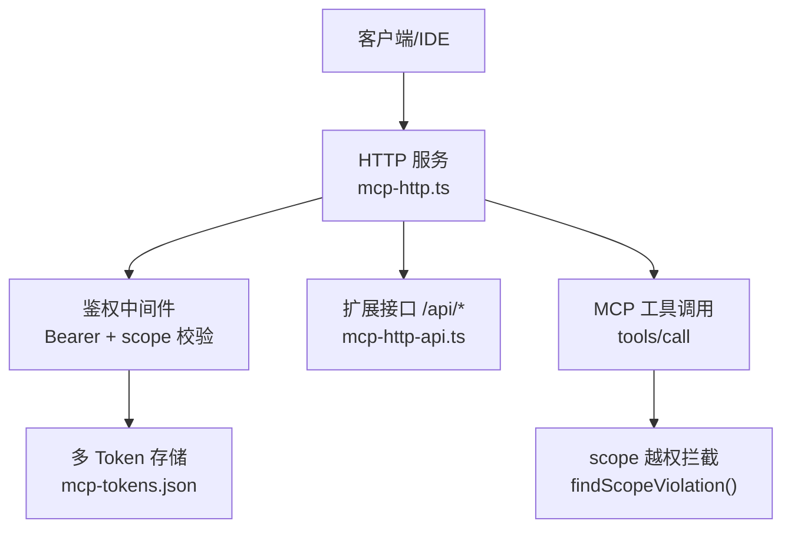
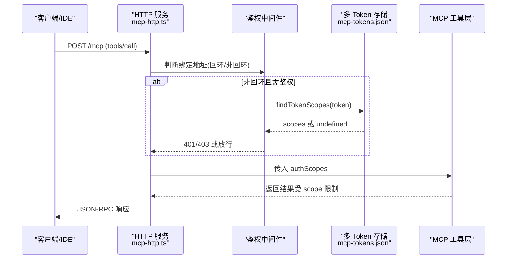
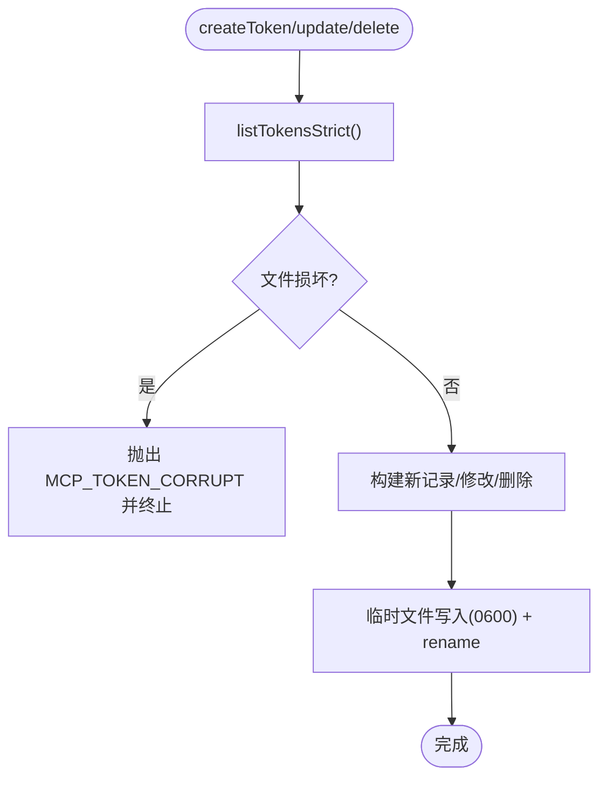
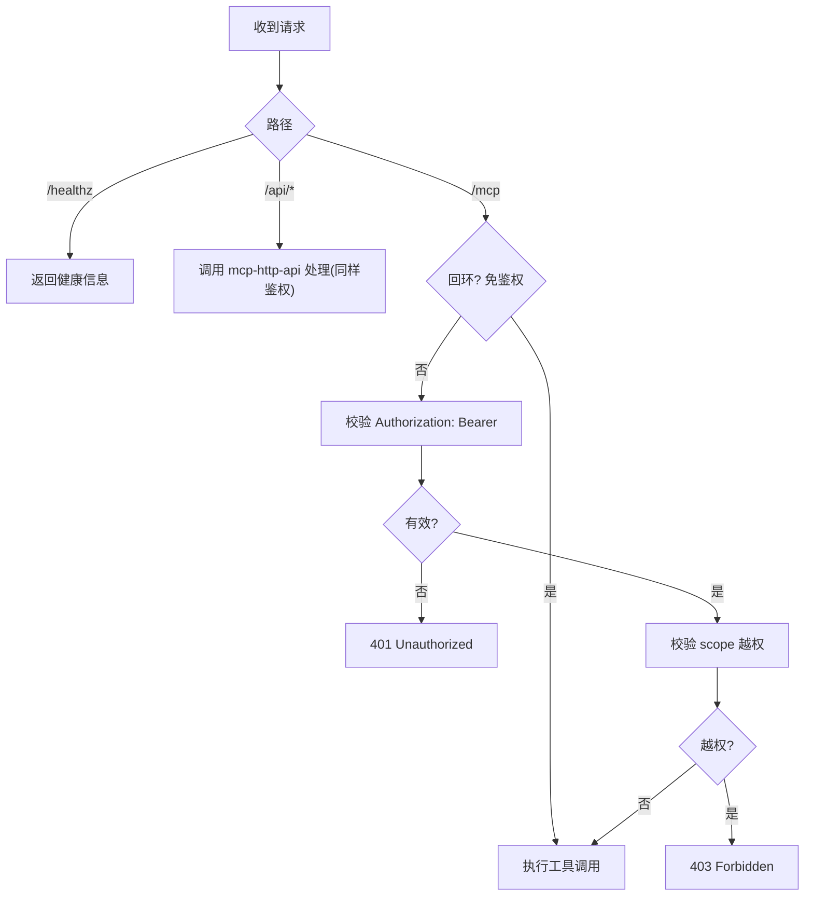
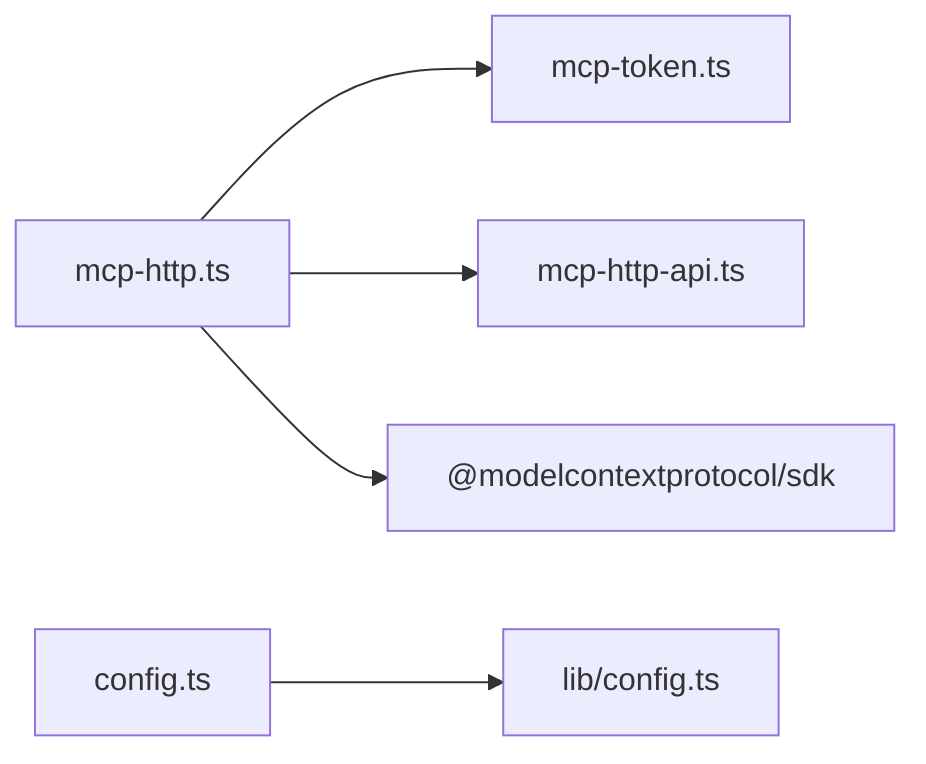

# 安全最佳实践

<cite>
**本文引用的文件**
- [src/lib/mcp-token.ts](file://src/lib/mcp-token.ts)
- [src/lib/mcp-http.ts](file://src/lib/mcp-http.ts)
- [src/config.ts](file://src/config.ts)
- [docs/mcp-http.md](file://docs/mcp-http.md)
- [docs/cli.md](file://docs/cli.md)
- [test/mcp-token.test.ts](file://test/mcp-token.test.ts)
</cite>

## 目录
1. [简介](#简介)
2. [项目结构](#项目结构)
3. [核心组件](#核心组件)
4. [架构总览](#架构总览)
5. [详细组件分析](#详细组件分析)
6. [依赖关系分析](#依赖关系分析)
7. [性能与安全权衡](#性能与安全权衡)
8. [故障排查与恢复](#故障排查与恢复)
9. [结论](#结论)
10. [附录：生产环境安全检查清单](#附录生产环境安全检查清单)

## 简介
本指南面向生产环境，聚焦 kisearch（ki）的安全配置、敏感信息保护、文件权限、部署加固、监控告警、事件响应与漏洞修复。内容基于代码库中 MCP HTTP 鉴权、多 Token 存储、配置模板与环境变量引用等实现，给出可操作的检查项与加固建议。

## 项目结构
与生产安全直接相关的核心位置：
- 鉴权与 Token 管理：src/lib/mcp-token.ts（多 Token 存储、RBAC scope、原子写、常量时间比较）
- HTTP 服务与条件鉴权：src/lib/mcp-http.ts（回环免鉴权、非回环强制 Bearer、会话上限、空闲回收、DNS rebinding 保护）
- 配置模板与环境变量：src/config.ts（生成 .ki/config.yaml，支持 ${VAR} 引用 embedding.apiKey）
- 用户文档与命令说明：docs/mcp-http.md、docs/cli.md（默认绑定、Token 来源优先级、/api/* 鉴权规则）
- 测试用例：test/mcp-token.test.ts（损坏文件保护、严格模式、路径约定）

图表来源
- [src/lib/mcp-http.ts:454-526](file://src/lib/mcp-http.ts#L454-L526)
- [src/lib/mcp-token.ts:245-259](file://src/lib/mcp-token.ts#L245-L259)

章节来源
- [src/lib/mcp-http.ts:1-120](file://src/lib/mcp-http.ts#L1-L120)
- [src/lib/mcp-token.ts:1-120](file://src/lib/mcp-token.ts#L1-L120)
- [docs/mcp-http.md:132-146](file://docs/mcp-http.md#L132-L146)

## 核心组件
- 多 Token 存储与 RBAC
  - 存储位置：~/.ki/mcp-tokens.json（仅属主读写，0600；目录 0700）
  - 记录字段：id、token（强随机）、scopes（'all' 或具体列表）、createdAt
  - 写入策略：临时文件 + rename 原子写，避免半写损坏扩散
  - 读取策略：宽松 listTokens（鉴权失败时 fail-closed），严格 listTokensStrict（写操作拒绝覆盖损坏文件）
  - 比较策略：常量时间比较 timingSafeEqual，防时序侧信道
- HTTP 服务与条件鉴权
  - 默认监听 127.0.0.1:7423（secure by default）
  - 回环地址免鉴权；非回环地址强制 Bearer Token
  - Token 来源优先级：--token/KI_MCP_TOKEN > ~/.ki/mcp-tokens.json
  - scope 越权拦截：对 tools/call 的 arguments.scope（缺省 'default'）做授权集合校验；枚举工具白名单由工具层按 authScopes 过滤
  - 会话防护：最大并发会话数、空闲超时回收、DNS rebinding 保护（allowedHosts）
- 配置与环境变量
  - config init 生成 .ki/config.yaml，embedding.apiKey 支持 ${VAR_NAME} 引用环境变量，避免明文落盘
  - 路径展开：$HOME、~、相对路径解析
  - doctor 诊断：API Key 是否解析成功、向量维度匹配等

章节来源
- [src/lib/mcp-token.ts:20-122](file://src/lib/mcp-token.ts#L20-L122)
- [src/lib/mcp-token.ts:149-176](file://src/lib/mcp-token.ts#L149-L176)
- [src/lib/mcp-token.ts:245-259](file://src/lib/mcp-token.ts#L245-L259)
- [src/lib/mcp-http.ts:36-80](file://src/lib/mcp-http.ts#L36-L80)
- [src/lib/mcp-http.ts:454-526](file://src/lib/mcp-http.ts#L454-L526)
- [src/config.ts:66-119](file://src/config.ts#L66-L119)
- [docs/cli.md:1164-1213](file://docs/cli.md#L1164-L1213)

## 架构总览
下图展示生产环境下请求从客户端到鉴权、再到工具调用的完整链路，以及关键安全控制点。

图表来源
- [src/lib/mcp-http.ts:454-526](file://src/lib/mcp-http.ts#L454-L526)
- [src/lib/mcp-token.ts:245-259](file://src/lib/mcp-token.ts#L245-L259)

## 详细组件分析

### 多 Token 存储与 RBAC（mcp-token.ts）
- 设计要点
  - 强随机 Token：32 字节熵，base64url
  - 短 ID：去除易混淆字符，唯一性循环保证
  - 原子写：临时文件 + rename，权限 0600，目录 0700
  - 损坏保护：区分 ENOENT 与损坏，严格模式拒绝覆盖
  - 常量时间比较：timingSafeEqual
- 复杂度
  - 查找 Token：O(n)，n 为记录数（低频运维场景可接受）
  - 写入：一次 I/O + rename，近似 O(1)
- 优化建议
  - 若 Token 数量增长显著，可引入索引（如 id→index 映射）以加速更新/删除
  - 考虑在高并发写场景引入文件锁（当前为低频运维操作暂不引入）

图表来源
- [src/lib/mcp-token.ts:124-176](file://src/lib/mcp-token.ts#L124-L176)
- [src/lib/mcp-token.ts:183-238](file://src/lib/mcp-token.ts#L183-L238)

章节来源
- [src/lib/mcp-token.ts:20-122](file://src/lib/mcp-token.ts#L20-L122)
- [src/lib/mcp-token.ts:149-176](file://src/lib/mcp-token.ts#L149-L176)
- [src/lib/mcp-token.ts:183-238](file://src/lib/mcp-token.ts#L183-L238)
- [test/mcp-token.test.ts:222-269](file://test/mcp-token.test.ts#L222-L269)

### HTTP 服务与条件鉴权（mcp-http.ts）
- 默认行为
  - 默认监听 127.0.0.1:7423，回环免鉴权
  - 非回环绑定强制 Bearer Token，未携带返回 401
- 会话与资源保护
  - 最大会话数 DEFAULT_MAX_SESSIONS（默认 256）
  - 空闲会话回收（默认 30 分钟）
  - DNS rebinding 保护（allowedHosts）
- 越权拦截
  - 对 tools/call 的 arguments.scope（缺省 'default'）进行授权集合校验
  - 枚举工具（ki_scope_list、ki_manage_index_list）跳过单点校验，交由工具层按 authScopes 过滤
- 健康与状态
  - /healthz 免鉴权，输出 pid/version/authFailures
  - printHttpStatus 汇总 lock、stdio 实例、managedTokens.count

图表来源
- [src/lib/mcp-http.ts:418-499](file://src/lib/mcp-http.ts#L418-L499)
- [src/lib/mcp-http.ts:501-577](file://src/lib/mcp-http.ts#L501-L577)

章节来源
- [src/lib/mcp-http.ts:36-80](file://src/lib/mcp-http.ts#L36-L80)
- [src/lib/mcp-http.ts:454-526](file://src/lib/mcp-http.ts#L454-L526)
- [docs/mcp-http.md:132-146](file://docs/mcp-http.md#L132-L146)

### 配置与环境变量（config.ts）
- 生成 .ki/config.yaml，包含 dataDir、backupDir、vectorDir、embedding、scopeMode、scopes 示例
- embedding.apiKey 支持 ${VAR_NAME} 引用环境变量，避免明文入库
- 路径展开：$HOME、~、相对路径
- 幂等初始化：已存在且不传 --force 则提示 existed

章节来源
- [src/config.ts:66-119](file://src/config.ts#L66-L119)
- [src/config.ts:128-177](file://src/config.ts#L128-L177)
- [docs/cli.md:1164-1213](file://docs/cli.md#L1164-L1213)

## 依赖关系分析
- 模块耦合
  - mcp-http.ts 依赖 mcp-token.ts 进行 Token 查询与计数
  - mcp-http.ts 延迟加载 mcp-http-api.ts，减少初始化依赖链
  - config.ts 提供配置模板，运行时通过 lib/config.ts 解析
- 外部依赖
  - Node.js http、crypto、fs、os、path
  - @modelcontextprotocol/sdk（StreamableHTTPServerTransport）
- 潜在风险
  - 多 Token 存储读-改-写并发可能丢更新（原子写消除半写损坏，但无文件锁）
  - 枚举工具若新增无 scope 参数工具，需同步加入 SCOPE_LESS_TOOLS 白名单并在工具层按 authScopes 过滤

图表来源
- [src/lib/mcp-http.ts:29-34](file://src/lib/mcp-http.ts#L29-L34)
- [src/lib/mcp-http.ts:22-27](file://src/lib/mcp-http.ts#L22-L27)
- [src/config.ts:12-16](file://src/config.ts#L12-L16)

章节来源
- [src/lib/mcp-http.ts:29-34](file://src/lib/mcp-http.ts#L29-L34)
- [src/lib/mcp-token.ts:1-18](file://src/lib/mcp-token.ts#L1-L18)
- [src/config.ts:12-16](file://src/config.ts#L12-L16)

## 性能与安全权衡
- 会话上限与内存占用：DEFAULT_MAX_SESSIONS=256，防止会话无界增长耗尽内存
- 空闲回收：默认 30 分钟，降低僵尸会话带来的资源泄漏
- Token 查找：线性扫描 O(n)，适合低频运维；若规模扩大可引入索引
- 原子写：牺牲少量 I/O 换取数据一致性，避免损坏扩散
- 常量时间比较：增加微小 CPU 开销，但显著提升抗时序攻击能力

[本节为通用指导，无需特定文件来源]

## 故障排查与恢复
- 常见错误与定位
  - 401 Unauthorized：非回环绑定下缺少或无效 Bearer Token；核对客户端 Authorization 头与 ki mcp token list 输出一致
  - 403 Forbidden：Token 有效但 scope 不在授权范围；使用 ki mcp token update 调整授权
  - 端口占用/权限不足：EADDRINUSE/EACCES；更换端口或提升权限
  - 文件损坏：MCP_TOKEN_CORRUPT；检查 ~/.ki/mcp-tokens.json 完整性
- 恢复步骤
  - 清理残留 lock：ki mcp stop
  - 重启服务：ki mcp restart（仅 HTTP 模式）
  - 重建向量库：rebuild-vector（当向量库损坏时）
  - 诊断：ki doctor 检查配置、密钥、连通性

章节来源
- [docs/mcp-http.md:224-233](file://docs/mcp-http.md#L224-L233)
- [src/lib/mcp-http.ts:609-630](file://src/lib/mcp-http.ts#L609-L630)
- [src/lib/mcp-token.ts:132-147](file://src/lib/mcp-token.ts#L132-L147)

## 结论
kisearch 在生产环境中提供了完善的安全基线：默认回环绑定、条件鉴权、多 Token RBAC、原子写与损坏保护、会话上限与空闲回收、DNS rebinding 保护。结合环境变量引用与最小授权原则，可在 Docker、Kubernetes 与传统服务器部署中安全运行。建议配合反向代理 TLS、防火墙收敛、日志审计与告警机制，形成端到端的安全闭环。

[本节为总结，无需特定文件来源]

## 附录：生产环境安全检查清单

### 一、生产环境安全配置清单
- 网络暴露面
  - 默认绑定 127.0.0.1；如需远程访问，显式设置 --host 0.0.0.0 并启用鉴权
  - 前置 TLS 反向代理（Nginx/Caddy），HTTP 服务仅处理明文
  - 使用 --allowed-hosts 限定 Host 头，缓解 DNS rebinding
- 鉴权与授权
  - 非回环绑定必须携带 Authorization: Bearer <token>
  - 优先使用 ki mcp token generate --scope <...> 托管 Token，遵循最小授权
  - 定期审查 ~/.ki/mcp-tokens.json 中的 Token 与 scope 集合
- 配置与密钥
  - embedding.apiKey 使用 ${VAR_NAME} 引用环境变量，避免明文入库
  - 使用 ki config init 生成模板，按需修改 dataDir/backupDir/vectorDir
  - 运行前执行 ki doctor 验证配置与连通性
- 会话与资源
  - 合理设置 maxSessions 与 sessionIdleMs，防止资源耗尽
  - 监控 /healthz 的 authFailures 指标，及时发现异常登录尝试

章节来源
- [docs/mcp-http.md:132-146](file://docs/mcp-http.md#L132-L146)
- [docs/mcp-http.md:243-260](file://docs/mcp-http.md#L243-L260)
- [src/lib/mcp-http.ts:46-53](file://src/lib/mcp-http.ts#L46-L53)
- [src/config.ts:66-119](file://src/config.ts#L66-L119)

### 二、环境变量配置与敏感信息保护
- 推荐做法
  - embedding.apiKey 通过 ${VAR_NAME} 引用环境变量，不在配置文件中明文存储
  - KI_MCP_TOKEN 作为全权临时 Token，仅在必要时使用，并尽快撤销
  - 避免在 shell 历史、日志、错误响应中泄露 Token 明文
- 回退策略
  - 系统不做隐式回退至固定环境变量名，需在配置中显式声明
  - 若需兼容旧版 SILICONFLOW_API_KEY，显式写入 apiKey: ${SILICONFLOW_API_KEY}

章节来源
- [docs/cli.md:1164-1213](file://docs/cli.md#L1164-L1213)
- [docs/mcp-http.md:132-146](file://docs/mcp-http.md#L132-L146)

### 三、文件权限最佳实践
- ~/.ki 目录
  - 目录权限：0700（仅属主可读写执行）
  - 配置文件：.ki/config.yaml 建议 0600
- mcp-tokens.json
  - 文件权限：0600（仅属主可读写）
  - 写入策略：原子写（临时文件 + rename），避免半写损坏
  - 损坏保护：严格模式拒绝覆盖，防止数据丢失
- 其他文件
  - mcp-http.lock：仅供排查，写失败不阻塞启动
  - 导入上传目录：~/.ki/import-uploads/<uploadId>/，受控路径，防止路径穿越

章节来源
- [src/lib/mcp-token.ts:149-176](file://src/lib/mcp-token.ts#L149-L176)
- [src/lib/mcp-token.ts:20-23](file://src/lib/mcp-token.ts#L20-L23)
- [docs/mcp-http.md:84-90](file://docs/mcp-http.md#L84-L90)

### 四、不同部署场景的安全加固建议
- Docker 容器化部署
  - 使用只读根文件系统，仅挂载必要目录（如 ~/.ki）
  - 通过环境变量注入敏感信息（embedding.apiKey、KI_MCP_TOKEN）
  - 限制容器资源（CPU/内存），启用健康检查
  - 使用非 root 用户运行进程
- Kubernetes 集群部署
  - 使用 Secret 管理敏感信息，避免明文 PodSpec
  - 配置 NetworkPolicy 限制入站/出站流量
  - 使用 PodSecurityPolicy/PSA 限制特权容器
  - 通过 Ingress 暴露服务，启用 TLS 与 Host 白名单
- 传统服务器部署
  - 使用 systemd 管理进程，配置 Restart=always
  - 配置防火墙规则，仅开放必要端口
  - 启用审计日志（auditd），监控异常登录与文件变更
  - 定期备份 ~/.ki 目录与向量库

[本节为通用指导，无需特定文件来源]

### 五、安全监控与告警配置
- 异常登录检测
  - 监控 /healthz 的 authFailures 指标，设置阈值告警
  - 记录服务端 stderr 中的鉴权失败日志，集中收集与分析
- Token 滥用监控
  - 定期检查 ~/.ki/mcp-tokens.json 中的 Token 数量与创建时间
  - 对频繁失败的 Token 进行吊销或收敛 scope
- 访问日志分析
  - 收集 HTTP 请求日志（源 IP、User-Agent、路径、状态码）
  - 分析异常模式（如批量 401/403、大体积请求体）

章节来源
- [src/lib/mcp-http.ts:358-372](file://src/lib/mcp-http.ts#L358-L372)
- [src/lib/mcp-http.ts:632-670](file://src/lib/mcp-http.ts#L632-L670)

### 六、安全事件响应流程与故障恢复程序
- 事件分类
  - 认证失败激增：可能是 Token 泄露或配置错误
  - 越权访问：scope 配置不当或客户端误用
  - 文件损坏：mcp-tokens.json 损坏导致鉴权失效
- 响应步骤
  - 立即吊销可疑 Token：ki mcp token delete <id>
  - 收敛权限：ki mcp token update <id> --scope <...>
  - 恢复文件：备份后重建 ~/.ki/mcp-tokens.json
  - 重启服务：ki mcp restart
- 恢复验证
  - 执行 ki mcp --status 确认实例健康
  - 检查 /healthz 返回的 authFailures 是否下降

章节来源
- [docs/mcp-http.md:224-233](file://docs/mcp-http.md#L224-L233)
- [src/lib/mcp-token.ts:132-147](file://src/lib/mcp-token.ts#L132-L147)

### 七、常见安全威胁与防护措施
- 威胁：Token 泄露
  - 防护：使用强随机 Token、最小授权 scope、定期轮换、及时吊销
- 威胁：越权访问
  - 防护：严格 scope 校验、枚举工具按 authScopes 过滤、禁止回环绑定下误以为已鉴权
- 威胁：文件损坏
  - 防护：原子写、损坏保护、严格模式拒绝覆盖
- 威胁：会话耗尽
  - 防护：会话上限、空闲回收、监控 authFailures
- 威胁：DNS rebinding
  - 防护：启用 allowedHosts，限制 Host 头

章节来源
- [src/lib/mcp-token.ts:149-176](file://src/lib/mcp-token.ts#L149-L176)
- [src/lib/mcp-http.ts:100-138](file://src/lib/mcp-http.ts#L100-L138)
- [docs/mcp-http.md:243-260](file://docs/mcp-http.md#L243-L260)