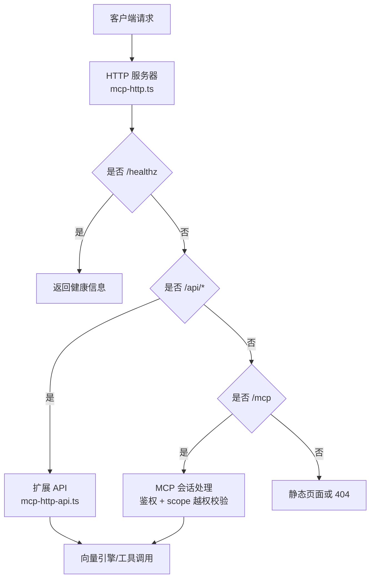
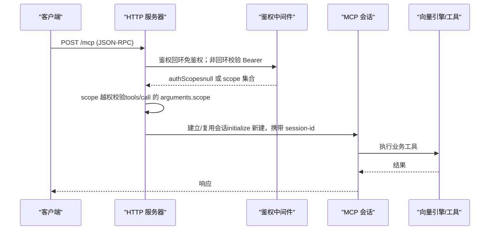
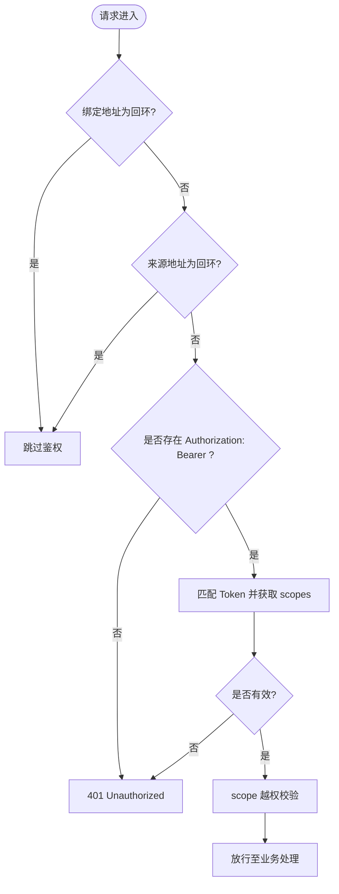
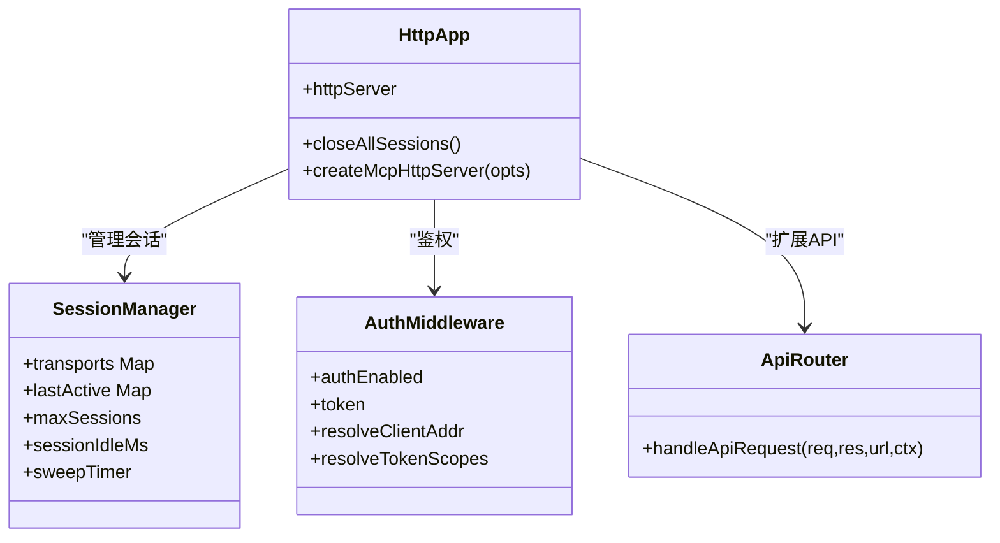
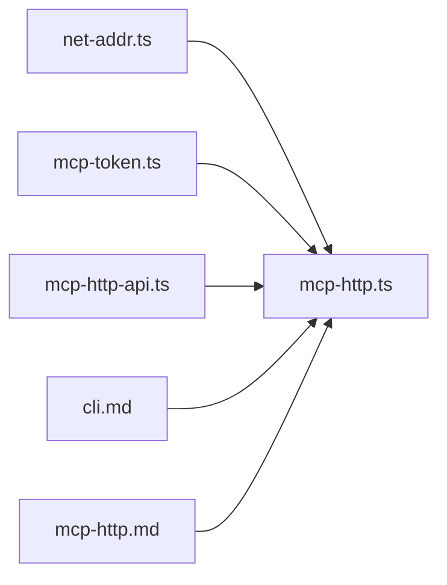

# 网络访问控制

<cite>
**本文引用的文件**
- [mcp-http.ts](file://src/lib/mcp-http.ts)
- [mcp-http-api.ts](file://src/lib/mcp-http-api.ts)
- [net-addr.ts](file://src/lib/net-addr.ts)
- [mcp-token.ts](file://src/lib/mcp-token.ts)
- [cli.md](file://docs/cli.md)
- [mcp-http.md](file://docs/mcp-http.md)
</cite>

## 目录
1. [简介](#简介)
2. [项目结构](#项目结构)
3. [核心组件](#核心组件)
4. [架构总览](#架构总览)
5. [详细组件分析](#详细组件分析)
6. [依赖关系分析](#依赖关系分析)
7. [性能与可用性](#性能与可用性)
8. [部署环境最佳实践](#部署环境最佳实践)
9. [防火墙、反向代理与负载均衡集成](#防火墙反向代理与负载均衡集成)
10. [常见问题排查](#常见问题排查)
11. [安全加固与合规要求](#安全加固与合规要求)
12. [监控与审计日志](#监控与审计日志)
13. [结论](#结论)

## 简介
本文件聚焦 MCP HTTP 模式的网络访问控制策略，覆盖以下目标：
- 回环地址免鉴权、远程地址强制鉴权的实现原理与边界
- HTTP 模式下 MCP 服务器的监听配置与会话处理流程
- 不同部署环境的网络配置差异（本地开发、内网、公网）
- 防火墙、反向代理、负载均衡的集成要点
- 常见网络访问问题的定位与修复
- 安全加固建议、合规性要求与可观测性（监控/审计）

## 项目结构
围绕网络访问控制的核心代码集中在以下模块：
- 网络地址判定：用于区分“本地回环来源”和“远程来源”，决定鉴权开关
- MCP HTTP 服务：构建 HTTP 服务器、会话管理、鉴权中间件、静态页面与扩展 API
- 多 Token 存储与 RBAC：Token 生成、持久化、按 scope 授权校验
- CLI 文档：HTTP 模式参数、启动守卫、单例守护、状态诊断等

图表来源
- [mcp-http.ts:394-599](file://src/lib/mcp-http.ts#L394-L599)
- [mcp-http-api.ts:216-272](file://src/lib/mcp-http-api.ts#L216-L272)

章节来源
- [mcp-http.ts:1-810](file://src/lib/mcp-http.ts#L1-L810)
- [mcp-http-api.ts:1-565](file://src/lib/mcp-http-api.ts#L1-L565)
- [net-addr.ts:1-35](file://src/lib/net-addr.ts#L1-L35)
- [mcp-token.ts:1-265](file://src/lib/mcp-token.ts#L1-L265)
- [cli.md:914-1044](file://docs/cli.md#L914-L1044)
- [mcp-http.md:1-273](file://docs/mcp-http.md#L1-L273)

## 核心组件
- 网络地址判定
  - isLoopbackHost：判断绑定地址是否为回环（决定是否启用鉴权）
  - isLoopbackAddr：判断请求来源 remoteAddress 是否为回环（远程来源需鉴权）
- MCP HTTP 服务
  - createMcpHttpServer：创建 http.Server，注册路由与健康端点
  - handleRequest：统一鉴权入口（/healthz 免鉴权；/api/* 与 /mcp 遵循相同鉴权策略）
  - handleMcpPost：解析 JSON-RPC，执行 scope 越权校验，建立/复用会话
  - 空闲会话回收与上限保护
- 多 Token 存储与 RBAC
  - findTokenScopes：按 Token 明文查找授权 scope 集合
  - ALL_SCOPES：通配全部 scope
  - 原子写与损坏保护：保证存储安全与一致性
- 扩展 API（/api/*）
  - 健康报告、文档列表、导入上传/运行/状态查询
  - 与 /mcp 一致的鉴权与 scope 越权校验

章节来源
- [net-addr.ts:6-34](file://src/lib/net-addr.ts#L6-L34)
- [mcp-http.ts:340-607](file://src/lib/mcp-http.ts#L340-L607)
- [mcp-token.ts:20-50, 245-264:20-50](file://src/lib/mcp-token.ts#L20-L50)
- [mcp-http-api.ts:216-272](file://src/lib/mcp-http-api.ts#L216-L272)

## 架构总览
MCP HTTP 服务以 Node.js 内置 http.Server 提供 Streamable HTTP 传输。鉴权策略由“绑定地址 + 请求来源地址”共同决定：
- 绑定为回环地址：免鉴权（仅本机访问）
- 绑定为非回环地址：强制 Bearer Token，并基于 Token 的 scope 做 RBAC 校验
- /healthz 始终免鉴权，供探活与运维诊断
- /api/* 与 /mcp 共享同一鉴权与 scope 越权逻辑

图表来源
- [mcp-http.ts:412-577](file://src/lib/mcp-http.ts#L412-L577)
- [mcp-token.ts:245-259](file://src/lib/mcp-token.ts#L245-L259)

章节来源
- [mcp-http.ts:412-577](file://src/lib/mcp-http.ts#L412-L577)
- [mcp-token.ts:245-259](file://src/lib/mcp-token.ts#L245-L259)

## 详细组件分析

### 回环地址免鉴权与远程地址强制鉴权
- 绑定地址判定
  - 若 host 为 127.0.0.1 / ::1 / localhost，则 authEnabled=false，跳过鉴权
  - 否则 authEnabled=true，必须提供 Bearer Token
- 请求来源判定
  - 即使绑定了非回环地址，来自回环来源的请求（如本机测试）仍可能免鉴权（由 resolveClientAddr 注入）
  - 远程来源（非 127.x、非 ::1、非 IPv4 映射到 127.x）必须通过鉴权
- Token 校验
  - 支持进程级临时全权 Token（--token/KI_MCP_TOKEN），优先级高于多 Token 存储
  - 多 Token 存储：~/.ki/mcp-tokens.json，按明文匹配（常量时间比较）获取授权 scope 集合

图表来源
- [mcp-http.ts:454-487](file://src/lib/mcp-http.ts#L454-L487)
- [net-addr.ts:6-34](file://src/lib/net-addr.ts#L6-L34)
- [mcp-token.ts:245-259](file://src/lib/mcp-token.ts#L245-L259)

章节来源
- [mcp-http.ts:454-487](file://src/lib/mcp-http.ts#L454-L487)
- [net-addr.ts:6-34](file://src/lib/net-addr.ts#L6-L34)
- [mcp-token.ts:245-259](file://src/lib/mcp-token.ts#L245-L259)

### HTTP 模式下 MCP 服务器的监听配置与会话处理
- 监听地址与端口
  - 默认 127.0.0.1:7423，可通过 --host/--port 调整
  - 对外监听建议使用 0.0.0.0，并强制 Token
- 会话模型
  - initialize 新建 transport + McpServer，共享模块级 engine
  - mcp-session-id 标识会话，支持 GET/DELETE 管理
  - 会话上限与空闲回收，防止资源耗尽
- DNS rebinding 保护
  - 可选 allowedHosts 白名单，限制 Host 头，缓解 DNS rebinding 攻击

图表来源
- [mcp-http.ts:340-607](file://src/lib/mcp-http.ts#L340-L607)
- [mcp-http-api.ts:216-272](file://src/lib/mcp-http-api.ts#L216-L272)

章节来源
- [mcp-http.ts:340-607](file://src/lib/mcp-http.ts#L340-L607)
- [mcp-http-api.ts:216-272](file://src/lib/mcp-http-api.ts#L216-L272)

### 多 Token 存储与 RBAC 授权
- Token 记录结构
  - id（短 ID）、token（明文）、scopes（授权 scope 集合）、createdAt
- 存储安全
  - 文件权限 0600，目录 0700
  - 原子写（临时文件 + rename），损坏保护（严格读取）
- 授权语义
  - 'all' 表示全部 scope
  - 工具层对无 scope 参数的枚举工具按授权集合过滤输出，避免泄露未授权 scope

章节来源
- [mcp-token.ts:20-50, 156-176, 245-264:20-50](file://src/lib/mcp-token.ts#L20-L50)
- [mcp-token.ts:156-176](file://src/lib/mcp-token.ts#L156-L176)
- [mcp-token.ts:245-264](file://src/lib/mcp-token.ts#L245-L264)

### 扩展 API（/api/*）的安全与功能
- 健康报告：/api/health（含 zvec 探活，超时保护）
- 文档列表：/api/doc/list（支持 q/group/tag/limit 过滤，缓存优化）
- 导入能力：/api/import/upload/run/status（受控目录、大小限制、路径穿越防护）
- 鉴权与 scope 越权校验与 /mcp 一致

章节来源
- [mcp-http-api.ts:216-272, 276-369, 371-565:216-565](file://src/lib/mcp-http-api.ts#L216-L565)

## 依赖关系分析
- 网络地址判定依赖 net-addr.ts
- MCP HTTP 服务依赖 mcp-token.ts（RBAC）与 mcp-http-api.ts（扩展 API）
- CLI 文档提供参数说明与启动守卫行为

图表来源
- [mcp-http.ts:1-810](file://src/lib/mcp-http.ts#L1-L810)
- [mcp-http-api.ts:1-565](file://src/lib/mcp-http-api.ts#L1-L565)
- [net-addr.ts:1-35](file://src/lib/net-addr.ts#L1-L35)
- [mcp-token.ts:1-265](file://src/lib/mcp-token.ts#L1-L265)
- [cli.md:914-1044](file://docs/cli.md#L914-L1044)
- [mcp-http.md:1-273](file://docs/mcp-http.md#L1-L273)

章节来源
- [mcp-http.ts:1-810](file://src/lib/mcp-http.ts#L1-L810)
- [mcp-http-api.ts:1-565](file://src/lib/mcp-http-api.ts#L1-L565)
- [net-addr.ts:1-35](file://src/lib/net-addr.ts#L1-L35)
- [mcp-token.ts:1-265](file://src/lib/mcp-token.ts#L1-L265)
- [cli.md:914-1044](file://docs/cli.md#L914-L1044)
- [mcp-http.md:1-273](file://docs/mcp-http.md#L1-L273)

## 性能与可用性
- 会话上限：默认 256，超出返回 503，防止内存耗尽
- 空闲回收：默认 30 分钟，后台定时清理残留会话
- 优雅退出：SIGINT/SIGTERM 触发关闭所有会话、释放向量库锁、删除 lock 文件，带 5 秒兜底超时
- 健康检查：/healthz 免鉴权，便于探活与诊断

章节来源
- [mcp-http.ts:381-392, 536-547, 734-766:381-392](file://src/lib/mcp-http.ts#L381-L392)
- [mcp-http.ts:536-547](file://src/lib/mcp-http.ts#L536-L547)
- [mcp-http.ts:734-766](file://src/lib/mcp-http.ts#L734-L766)

## 部署环境最佳实践
- 本地开发
  - 使用默认 127.0.0.1:7423，免鉴权，开箱即用
  - 可开启 --web 提供前端页面
- 内网部署
  - 绑定 0.0.0.0，强制 Token，配合防火墙收敛来源 IP
  - 可使用 --allowed-hosts 限定 Host 头，缓解 DNS rebinding
- 公网暴露
  - 前置 TLS 反向代理（Nginx/Caddy），终结 TLS
  - 结合 WAF/限流/访问控制策略
  - 最小授权 scope，定期轮换 Token

章节来源
- [cli.md:936-947](file://docs/cli.md#L936-L947)
- [mcp-http.md:132-146, 243-260:132-146](file://docs/mcp-http.md#L132-L146)
- [mcp-http.md:243-260](file://docs/mcp-http.md#L243-L260)

## 防火墙、反向代理与负载均衡集成
- 防火墙规则
  - 仅开放必要端口（默认 7423）
  - 限制来源 IP（内网/特定 CIDR）
- 反向代理（Nginx/Caddy）
  - 终止 TLS，转发到后端 HTTP 服务
  - 设置正确的 Host 头，必要时启用 allowedHosts
  - 配置限流、连接数限制、请求体大小限制
- 负载均衡器
  - 保持会话亲和（sticky session）或使用共享会话后端
  - 健康检查指向 /healthz
  - 注意 keep-alive 与长连接（SSE）的超时配置

[本节为通用集成指导，不直接分析具体文件]

## 常见问题排查
- 401 Unauthorized
  - 原因：缺少或无效 Bearer Token
  - 排查：核对客户端 Authorization 头与 ki mcp token list 输出；确认 --token/KI_MCP_TOKEN 生效
- 403 Forbidden
  - 原因：scope 越权
  - 排查：确认请求 scope 在 Token 授权范围内；必要时更新 scope
- 端口占用
  - 原因：EADDRINUSE
  - 排查：使用 --status 探活；若非 ki 进程占用，更换端口或结束冲突进程
- 无法绑定地址
  - 原因：EADDRNOTAVAIL/ENOTFOUND
  - 排查：确认 host 为合法 IP 或可解析主机名；本机用 127.0.0.1，对外用 0.0.0.0

章节来源
- [mcp-http.ts:609-630](file://src/lib/mcp-http.ts#L609-L630)
- [mcp-http.ts:454-487](file://src/lib/mcp-http.ts#L454-L487)
- [mcp-http.ts:511-526](file://src/lib/mcp-http.ts#L511-L526)

## 安全加固与合规要求
- 最小授权原则
  - 使用 scope 精确授权，避免 'all'
  - 定期审查与轮换 Token
- 传输安全
  - 公网暴露必须使用 TLS（反向代理终结）
  - 禁止明文 Token 写入配置文件
- 访问控制
  - 结合防火墙与安全组收敛来源 IP
  - 启用 DNS rebinding 保护（allowedHosts）
- 合规性
  - 审计日志：记录鉴权失败与越权拦截
  - 数据保护：Token 明文落盘权限 0600，目录 0700
  - 可观测性：/healthz 暴露鉴权失败计数，便于告警

章节来源
- [mcp-token.ts:156-176](file://src/lib/mcp-token.ts#L156-L176)
- [mcp-http.ts:358-372](file://src/lib/mcp-http.ts#L358-L372)
- [mcp-http.md:243-260](file://docs/mcp-http.md#L243-L260)

## 监控与审计日志
- 鉴权失败日志
  - 服务端 stderr 记录鉴权失败次数与原因（限流防刷屏）
  - /healthz 返回 authFailures，便于外部监控采集
- 越权拦截日志
  - 记录请求来源与被拒 scope（响应体脱敏，避免枚举探测）
- 健康与状态
  - /healthz 返回 pid/version/host/port/authFailures
  - --status 输出实例全貌（lock、stdioInstances、managedTokens.count）

章节来源
- [mcp-http.ts:358-372, 418-428, 511-526, 632-670:358-372](file://src/lib/mcp-http.ts#L358-L372)
- [mcp-http.ts:418-428](file://src/lib/mcp-http.ts#L418-L428)
- [mcp-http.ts:511-526](file://src/lib/mcp-http.ts#L511-L526)
- [mcp-http.ts:632-670](file://src/lib/mcp-http.ts#L632-L670)

## 结论
本项目实现了“回环免鉴权、远程强制鉴权”的网络访问控制策略，并通过多 Token 存储与 RBAC 实现细粒度授权。MCP HTTP 服务提供健壮的会话管理、健康检查与扩展 API，适用于本地开发、内网与公网多种部署场景。结合防火墙、反向代理与负载均衡的最佳实践，可有效提升安全性与可用性。建议在生产环境中启用 TLS、最小授权、审计日志与监控告警，确保合规与可观测性。