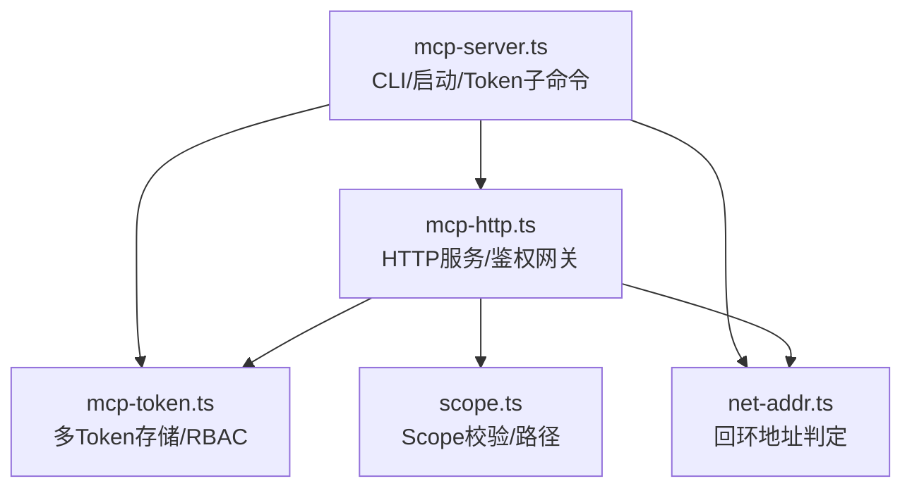
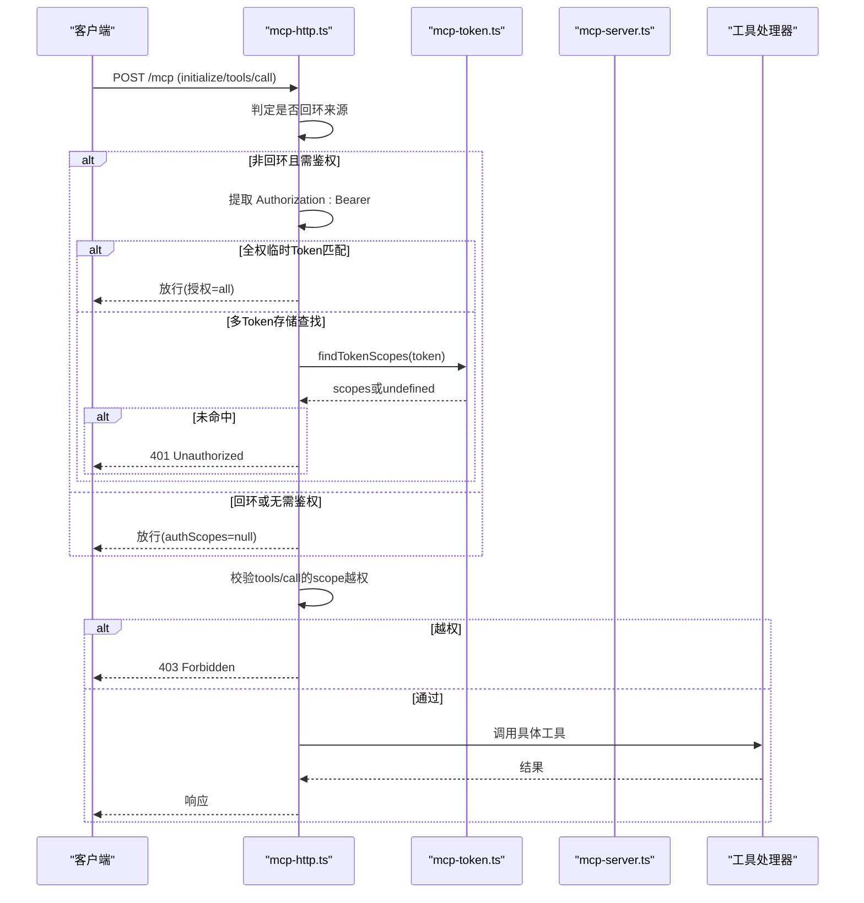
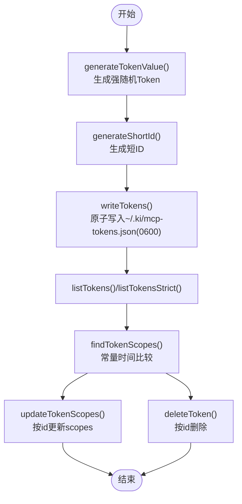
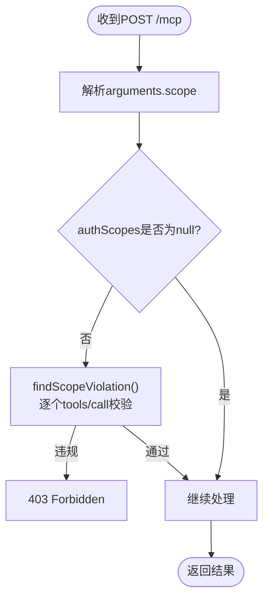
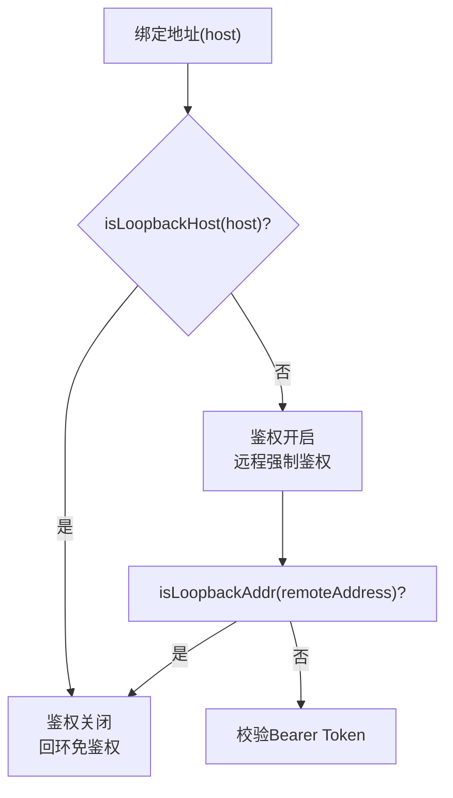
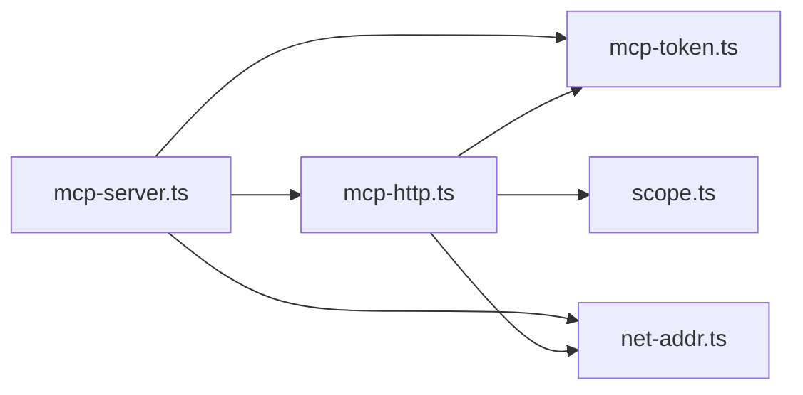

# 鉴权与安全配置

<cite>
**本文引用的文件**
- [src/lib/mcp-token.ts](file://src/lib/mcp-token.ts)
- [src/lib/mcp-http.ts](file://src/lib/mcp-http.ts)
- [src/mcp-server.ts](file://src/mcp-server.ts)
- [src/lib/net-addr.ts](file://src/lib/net-addr.ts)
- [src/lib/scope.ts](file://src/lib/scope.ts)
- [test/mcp-token.test.ts](file://test/mcp-token.test.ts)
</cite>

## 目录
1. [简介](#简介)
2. [项目结构](#项目结构)
3. [核心组件](#核心组件)
4. [架构总览](#架构总览)
5. [详细组件分析](#详细组件分析)
6. [依赖关系分析](#依赖关系分析)
7. [性能与可用性](#性能与可用性)
8. [故障排查指南](#故障排查指南)
9. [结论](#结论)
10. [附录：配置示例与安全清单](#附录配置示例与安全清单)

## 简介
本文件面向部署与运维人员，系统化说明 MCP HTTP 模式的鉴权与安全配置。内容覆盖 Token 生成、验证、更新、删除的完整生命周期；多 Token 存储机制与 Scope 授权模型；回环地址免鉴权与远程地址强制鉴权策略；不同部署场景的安全最佳实践（环境变量、文件权限、网络访问控制）；常见问题排查方法与防护措施；以及可直接落地的配置示例与安全检查清单。

## 项目结构
与鉴权相关的关键代码分布在以下模块：
- Token 存储与 RBAC 授权：src/lib/mcp-token.ts
- HTTP 传输、会话管理、鉴权网关：src/lib/mcp-http.ts
- CLI 入口、Token 子命令、启动参数解析：src/mcp-server.ts
- 回环地址判定工具：src/lib/net-addr.ts
- Scope 校验与路径构造：src/lib/scope.ts
- 单元测试（覆盖 Token 生成、存储、权限判断等）：test/mcp-token.test.ts

图表来源
- [src/mcp-server.ts:24-47](file://src/mcp-server.ts#L24-L47)
- [src/lib/mcp-http.ts:24-27](file://src/lib/mcp-http.ts#L24-L27)
- [src/lib/mcp-token.ts:15-23](file://src/lib/mcp-token.ts#L15-L23)
- [src/lib/net-addr.ts:6-10](file://src/lib/net-addr.ts#L6-L10)
- [src/lib/scope.ts:7-12](file://src/lib/scope.ts#L7-L12)

章节来源
- [src/mcp-server.ts:24-47](file://src/mcp-server.ts#L24-L47)
- [src/lib/mcp-http.ts:24-27](file://src/lib/mcp-http.ts#L24-L27)
- [src/lib/mcp-token.ts:15-23](file://src/lib/mcp-token.ts#L15-L23)
- [src/lib/net-addr.ts:6-10](file://src/lib/net-addr.ts#L6-L10)
- [src/lib/scope.ts:7-12](file://src/lib/scope.ts#L7-L12)

## 核心组件
- Token 存储与 RBAC
  - 多 Token 存储于 ~/.ki/mcp-tokens.json（JSON 数组），每条记录包含短 ID、明文 Token、授权 scope 集合、创建时间。
  - 提供 generate/list/update/delete/find 等能力，支持 'all' 通配全部 scope。
  - 写操作采用原子写入（临时文件 + rename）并设置 0600 权限，读损坏保护避免静默覆盖。
- HTTP 鉴权网关
  - 默认监听 127.0.0.1:7423，回环绑定免鉴权；非回环绑定强制要求 Bearer Token。
  - 支持全权临时 Token（--token/KI_MCP_TOKEN）与多 Token 存储两种模式。
  - 对 tools/call 请求进行 scope 越权拦截，白名单枚举工具由工具层按授权过滤。
- 回环地址判定
  - isLoopbackHost/isLoopbackAddr 统一处理 IPv4/IPv6/映射地址，决定鉴权开关与来源豁免。
- Scope 校验
  - 严格校验 scope 字符集，防止路径穿越；为数据隔离提供基础。

章节来源
- [src/lib/mcp-token.ts:20-50](file://src/lib/mcp-token.ts#L20-L50)
- [src/lib/mcp-token.ts:97-176](file://src/lib/mcp-token.ts#L97-L176)
- [src/lib/mcp-token.ts:183-264](file://src/lib/mcp-token.ts#L183-L264)
- [src/lib/mcp-http.ts:36-50](file://src/lib/mcp-http.ts#L36-L50)
- [src/lib/mcp-http.ts:454-487](file://src/lib/mcp-http.ts#L454-L487)
- [src/lib/net-addr.ts:6-34](file://src/lib/net-addr.ts#L6-L34)
- [src/lib/scope.ts:11-43](file://src/lib/scope.ts#L11-L43)

## 架构总览
MCP HTTP 服务在启动时根据绑定地址决定是否启用鉴权；请求进入后先走 /healthz 与 /api/* 路由，再进入 /mcp 鉴权流程。鉴权通过后，针对每个 tools/call 进行 scope 越权校验，最终交由工具处理器执行。

图表来源
- [src/lib/mcp-http.ts:454-526](file://src/lib/mcp-http.ts#L454-L526)
- [src/lib/mcp-token.ts:245-259](file://src/lib/mcp-token.ts#L245-L259)
- [src/mcp-server.ts:687-698](file://src/mcp-server.ts#L687-L698)

## 详细组件分析

### Token 生命周期管理（生成/验证/更新/删除）
- 生成
  - 使用密码学强随机值生成 Token 明文（32 字节熵，base64url）。
  - 短 ID 用于后续 update/delete，避免暴露长 Token。
  - 写入 ~/.ki/mcp-tokens.json，权限 0600，目录 0700。
- 验证
  - 非回环来源请求携带 Authorization: Bearer。
  - 优先匹配全权临时 Token（--token/KI_MCP_TOKEN），否则查多 Token 存储。
  - 使用常量时间比较避免时序侧信道。
- 更新
  - 按短 ID 修改授权 scope 集合，立即生效。
- 删除
  - 按短 ID 删除 Token，立即失效；已建立会话不受影响但新请求拒绝。

图表来源
- [src/lib/mcp-token.ts:55-68](file://src/lib/mcp-token.ts#L55-L68)
- [src/lib/mcp-token.ts:156-176](file://src/lib/mcp-token.ts#L156-L176)
- [src/lib/mcp-token.ts:183-238](file://src/lib/mcp-token.ts#L183-L238)
- [src/lib/mcp-token.ts:245-259](file://src/lib/mcp-token.ts#L245-L259)

章节来源
- [src/lib/mcp-token.ts:55-68](file://src/lib/mcp-token.ts#L55-L68)
- [src/lib/mcp-token.ts:156-176](file://src/lib/mcp-token.ts#L156-L176)
- [src/lib/mcp-token.ts:183-238](file://src/lib/mcp-token.ts#L183-L238)
- [src/lib/mcp-token.ts:245-259](file://src/lib/mcp-token.ts#L245-L259)
- [test/mcp-token.test.ts:43-53](file://test/mcp-token.test.ts#L43-L53)
- [test/mcp-token.test.ts:207-240](file://test/mcp-token.test.ts#L207-L240)

### Scope 授权模型与越权防护
- Scope 集合
  - 支持单个 scope、多个逗号分隔、'all' 通配全部。
  - 非法 scope 会被拒绝（仅允许字母、数字、连字符、下划线）。
- 越权拦截
  - 对所有 tools/call 请求中的 arguments.scope 进行集中校验。
  - 白名单枚举工具（如 ki_scope_list、ki_manage_index_list）跳过此处校验，由工具层按 authScopes 过滤输出。
  - 越权返回 403，服务端记录日志但不泄露具体 scope。

图表来源
- [src/lib/mcp-http.ts:100-138](file://src/lib/mcp-http.ts#L100-L138)
- [src/lib/mcp-http.ts:508-526](file://src/lib/mcp-http.ts#L508-L526)
- [src/lib/scope.ts:11-43](file://src/lib/scope.ts#L11-L43)

章节来源
- [src/lib/mcp-http.ts:100-138](file://src/lib/mcp-http.ts#L100-L138)
- [src/lib/mcp-http.ts:508-526](file://src/lib/mcp-http.ts#L508-L526)
- [src/lib/scope.ts:11-43](file://src/lib/scope.ts#L11-L43)

### 回环地址免鉴权与远程地址强制鉴权
- 绑定地址判定
  - 默认 127.0.0.1，回环绑定禁用鉴权；非回环绑定必须可鉴权。
- 来源地址判定
  - 基于 req.socket.remoteAddress 判定本地回环来源（含 IPv4/IPv6/映射地址）。
- 启动期提示
  - 若回环绑定时传入 Token，会明确提示“鉴权已禁用”，避免安全误判。

图表来源
- [src/lib/net-addr.ts:6-34](file://src/lib/net-addr.ts#L6-L34)
- [src/lib/mcp-http.ts:454-487](file://src/lib/mcp-http.ts#L454-L487)
- [src/mcp-server.ts:174-211](file://src/mcp-server.ts#L174-L211)

章节来源
- [src/lib/net-addr.ts:6-34](file://src/lib/net-addr.ts#L6-L34)
- [src/lib/mcp-http.ts:454-487](file://src/lib/mcp-http.ts#L454-L487)
- [src/mcp-server.ts:174-211](file://src/mcp-server.ts#L174-L211)

### 多 Token 存储机制
- 存储位置
  - ~/.ki/mcp-tokens.json（JSON 数组），权限 0600，目录 0700。
- 数据结构
  - id（短 ID）、token（明文）、scopes（字符串数组）、createdAt（ISO 时间）。
- 读写策略
  - 读取失败（不存在）视为空列表；读取失败（权限/IO错误）视为损坏，严格模式下抛错。
  - 写操作原子化（临时文件+rename），失败清理残留临时文件。
- 查询与统计
  - findTokenScopes 遍历所有记录做常量时间比较；tokenCount 仅计数不暴露明文。

章节来源
- [src/lib/mcp-token.ts:20-35](file://src/lib/mcp-token.ts#L20-L35)
- [src/lib/mcp-token.ts:97-176](file://src/lib/mcp-token.ts#L97-L176)
- [src/lib/mcp-token.ts:245-264](file://src/lib/mcp-token.ts#L245-L264)
- [test/mcp-token.test.ts:222-240](file://test/mcp-token.test.ts#L222-L240)

## 依赖关系分析
- mcp-server.ts 负责 CLI 参数解析、Token 子命令分发、HTTP 服务启动守卫与预检。
- mcp-http.ts 实现 HTTP 服务、会话管理、鉴权网关、静态页面与 /healthz。
- mcp-token.ts 提供 Token 生命周期管理与 RBAC 授权。
- net-addr.ts 提供回环地址判定。
- scope.ts 提供 scope 校验与 KB 路径构造。

图表来源
- [src/mcp-server.ts:24-47](file://src/mcp-server.ts#L24-L47)
- [src/lib/mcp-http.ts:24-27](file://src/lib/mcp-http.ts#L24-L27)
- [src/lib/mcp-token.ts:15-23](file://src/lib/mcp-token.ts#L15-L23)
- [src/lib/net-addr.ts:6-10](file://src/lib/net-addr.ts#L6-L10)
- [src/lib/scope.ts:7-12](file://src/lib/scope.ts#L7-L12)

章节来源
- [src/mcp-server.ts:24-47](file://src/mcp-server.ts#L24-L47)
- [src/lib/mcp-http.ts:24-27](file://src/lib/mcp-http.ts#L24-L27)
- [src/lib/mcp-token.ts:15-23](file://src/lib/mcp-token.ts#L15-L23)
- [src/lib/net-addr.ts:6-10](file://src/lib/net-addr.ts#L6-L10)
- [src/lib/scope.ts:7-12](file://src/lib/scope.ts#L7-L12)

## 性能与可用性
- 会话上限与空闲回收
  - 默认最大并发会话 256，空闲超时 30 分钟，定期清扫释放资源。
- 鉴权失败限流日志
  - 鉴权失败日志限频输出，避免重试风暴刷屏。
- 向量库锁与进程复用
  - HTTP 单例作为唯一持锁者，避免多 IDE 锁冲突；空闲自动释放锁，错开共享。

章节来源
- [src/lib/mcp-http.ts:46-53](file://src/lib/mcp-http.ts#L46-L53)
- [src/lib/mcp-http.ts:358-372](file://src/lib/mcp-http.ts#L358-L372)
- [src/lib/mcp-http.ts:536-547](file://src/lib/mcp-http.ts#L536-L547)
- [src/mcp-server.ts:683-685](file://src/mcp-server.ts#L683-L685)

## 故障排查指南
- 常见错误与定位
  - 401 Unauthorized：缺少或无效 Bearer Token；检查客户端 Authorization 头与托管 Token 存储一致性。
  - 403 Forbidden：scope 越权；检查 Token 授权 scope 与请求 scope 是否匹配。
  - 端口占用/权限不足：查看 listen 错误描述，更换端口或提升权限。
  - 配置文件损坏：严格模式下抛出 MCP_TOKEN_CORRUPT，需人工修复文件。
- 诊断命令
  - ki mcp --status：查看实例健康、lock、stdio 实例、托管 Token 数量。
  - ki mcp token list：列出所有 Token（含明文与授权 scope）。
  - ki mcp token delete <id>：立即吊销指定 Token。
- 日志与指标
  - 服务端 stderr 输出鉴权失败次数与原因；/healthz 返回 authFailures 累计。

章节来源
- [src/lib/mcp-http.ts:454-487](file://src/lib/mcp-http.ts#L454-L487)
- [src/lib/mcp-http.ts:609-630](file://src/lib/mcp-http.ts#L609-L630)
- [src/lib/mcp-http.ts:632-670](file://src/lib/mcp-http.ts#L632-L670)
- [src/lib/mcp-token.ts:132-147](file://src/lib/mcp-token.ts#L132-L147)
- [src/mcp-server.ts:227-351](file://src/mcp-server.ts#L227-L351)

## 结论
本方案以“默认安全”为原则：回环绑定免鉴权便于本机开发，非回环绑定强制鉴权保障远程访问安全。通过多 Token 存储与 Scope RBAC 实现细粒度授权，结合原子写入、常量时间比较、越权拦截与日志观测，形成完整的鉴权闭环。配合合理的部署配置与环境变量管理，可在多种场景下稳定运行。

## 附录：配置示例与安全清单

### 环境变量与命令行选项
- KI_MCP_TOKEN：进程级全权临时 Token（优先级高于多 Token 存储）。
- KI_WEB_DIR：显式覆盖前端静态目录（可选）。
- 命令行
  - --http：启用 HTTP 模式。
  - --host/--port：绑定地址与端口（默认 127.0.0.1:7423）。
  - --allowed-hosts：DNS rebinding 保护白名单（可选）。
  - --web：同时提供前端静态页面（可选）。

章节来源
- [src/mcp-server.ts:98-107](file://src/mcp-server.ts#L98-L107)
- [src/mcp-server.ts:164-211](file://src/mcp-server.ts#L164-L211)
- [src/lib/mcp-http.ts:793-800](file://src/lib/mcp-http.ts#L793-L800)

### 文件权限与存储
- Token 存储文件
  - 路径：~/.ki/mcp-tokens.json
  - 权限：0600（仅属主可读写）
  - 目录：~/.ki（0700）
- HTTP lock 文件
  - 路径：~/.ki/mcp-http.lock（仅供排查）

章节来源
- [src/lib/mcp-token.ts:20-23](file://src/lib/mcp-token.ts#L20-L23)
- [src/lib/mcp-token.ts:156-176](file://src/lib/mcp-token.ts#L156-L176)
- [src/lib/mcp-http.ts:58-61](file://src/lib/mcp-http.ts#L58-L61)

### 网络访问控制
- 本机开发：默认 127.0.0.1:7423，免鉴权。
- 跨机共享：显式绑定 0.0.0.0 或其他 IP，并配置鉴权（--token 或多 Token 存储）。
- DNS rebinding 保护：配置 allowedHosts 白名单。

章节来源
- [src/lib/mcp-http.ts:36-44](file://src/lib/mcp-http.ts#L36-L44)
- [src/lib/mcp-http.ts:548-553](file://src/lib/mcp-http.ts#L548-L553)
- [src/mcp-server.ts:186-211](file://src/mcp-server.ts#L186-L211)

### 安全配置最佳实践
- 生产环境
  - 绑定非回环地址时必须配置鉴权（推荐多 Token 存储）。
  - 限制 allowedHosts，避免 DNS rebinding。
  - 使用环境变量注入 Token，避免命令行历史泄露。
  - 定期审计 Token 列表，及时删除不再使用的 Token。
- 开发环境
  - 保持默认回环绑定，利用免鉴权快速调试。
  - 如需跨进程共享，使用 HTTP 单例模式避免锁冲突。

章节来源
- [src/mcp-server.ts:174-211](file://src/mcp-server.ts#L174-L211)
- [src/lib/mcp-http.ts:454-487](file://src/lib/mcp-http.ts#L454-L487)

### 安全检查清单
- 绑定地址与鉴权
  - 非回环绑定是否启用了鉴权？
  - 回环绑定时是否误传了 Token（应提示禁用）？
- Token 管理
  - 是否通过 ki mcp token generate 创建 Token？
  - 是否设置了合适的 scope（避免过度授权）？
  - 是否定期清理过期/无用 Token？
- 文件权限
  - ~/.ki/mcp-tokens.json 是否为 0600？
  - ~/.ki 目录是否为 0700？
- 网络与 Host
  - 是否配置 allowedHosts 白名单？
  - 是否限制了公网暴露？
- 监控与日志
  - 是否关注 /healthz 的 authFailures？
  - 是否检查服务端 stderr 的鉴权失败日志？

章节来源
- [src/lib/mcp-token.ts:156-176](file://src/lib/mcp-token.ts#L156-L176)
- [src/lib/mcp-http.ts:418-428](file://src/lib/mcp-http.ts#L418-L428)
- [src/lib/mcp-http.ts:632-670](file://src/lib/mcp-http.ts#L632-L670)
- [src/mcp-server.ts:227-351](file://src/mcp-server.ts#L227-L351)