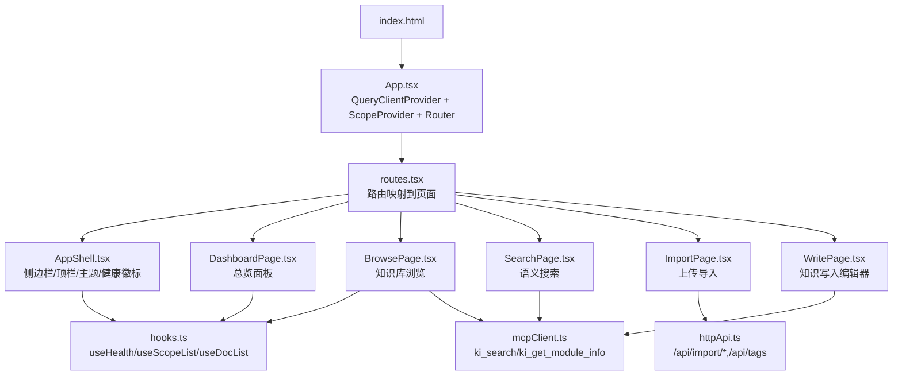
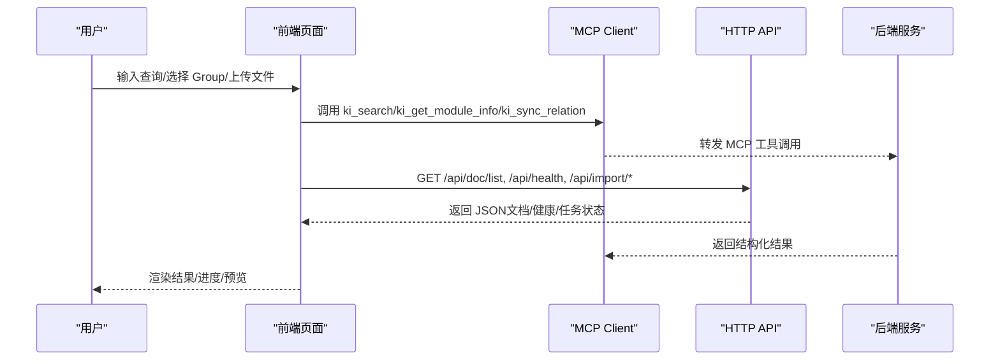
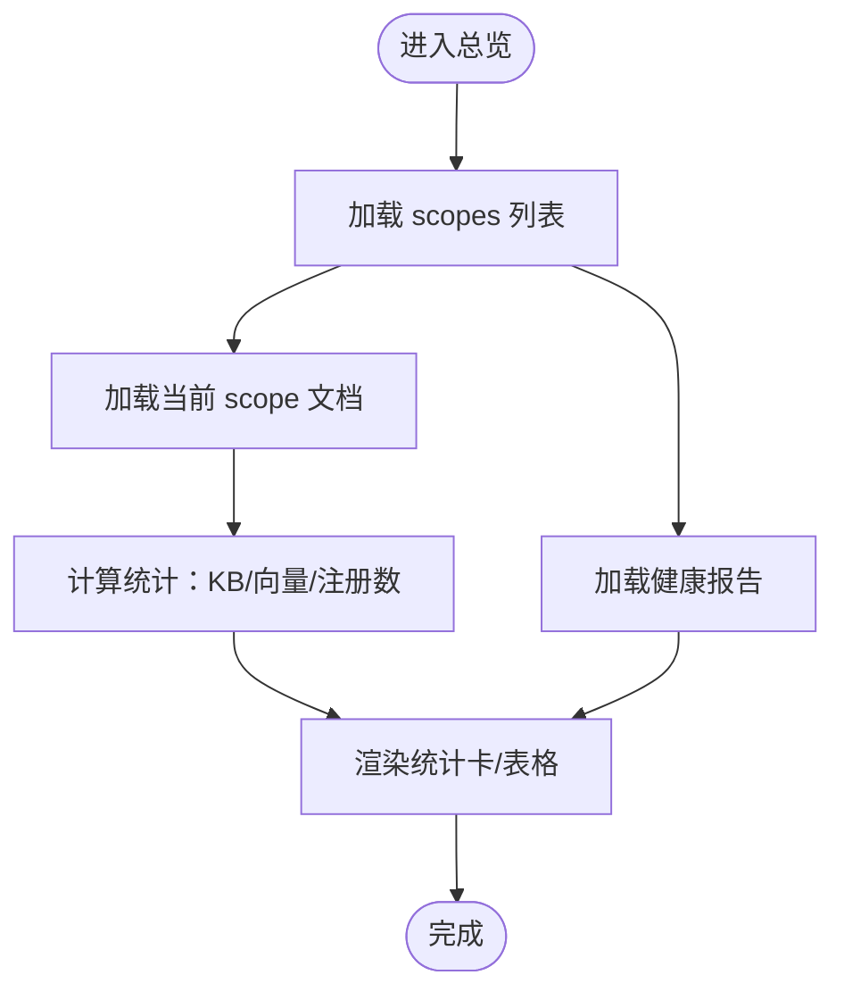
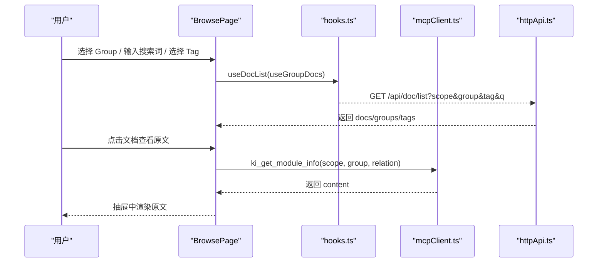
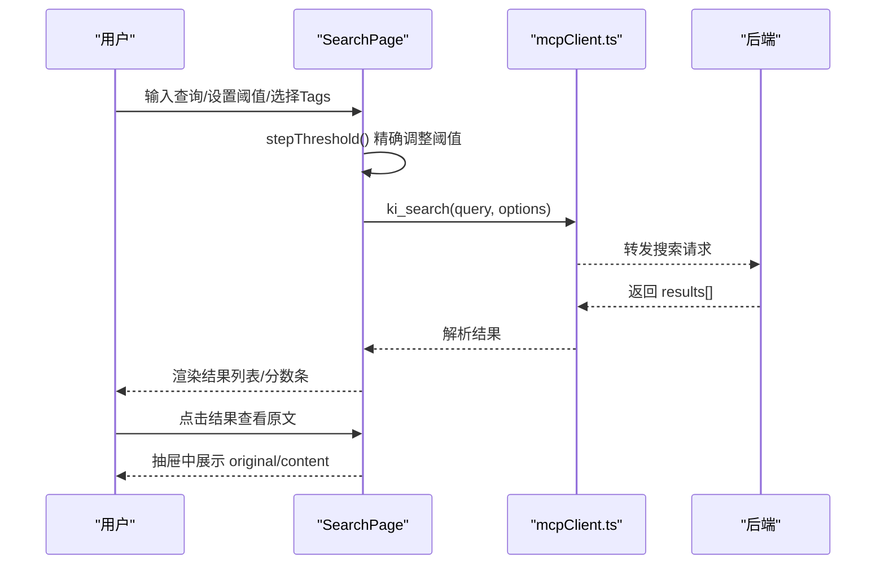
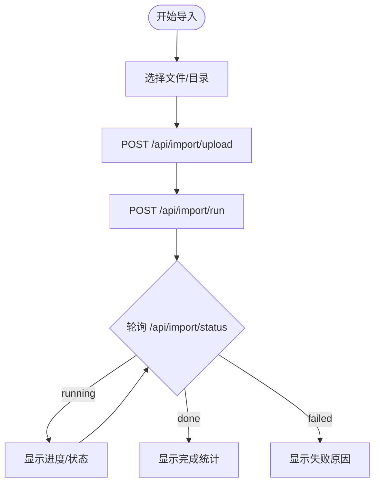
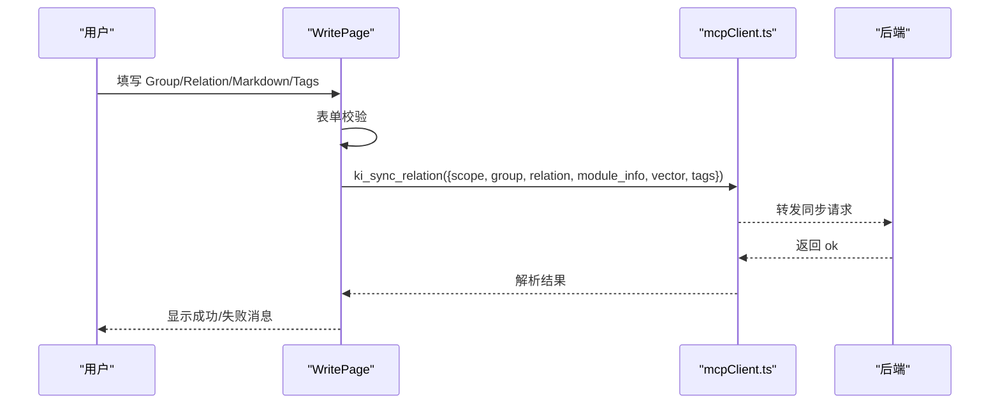
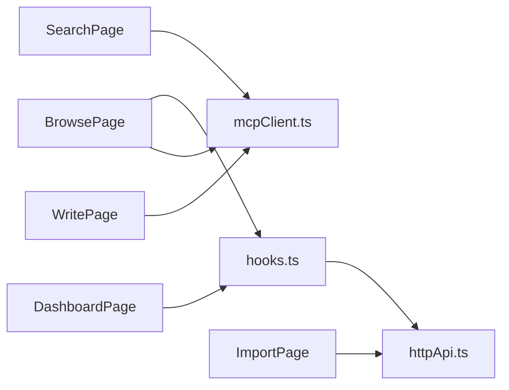

# Web 前端使用

<cite>
**本文引用的文件**
- [web/package.json](file://web/package.json)
- [web/vite.config.ts](file://web/vite.config.ts)
- [web/index.html](file://web/index.html)
- [web/src/App.tsx](file://web/src/App.tsx)
- [web/src/router/routes.tsx](file://web/src/router/routes.tsx)
- [web/src/layouts/AppShell.tsx](file://web/src/layouts/AppShell.tsx)
- [web/src/pages/DashboardPage.tsx](file://web/src/pages/DashboardPage.tsx)
- [web/src/pages/BrowsePage.tsx](file://web/src/pages/BrowsePage.tsx)
- [web/src/pages/SearchPage.tsx](file://web/src/pages/SearchPage.tsx)
- [web/src/pages/ImportPage.tsx](file://web/src/pages/ImportPage.tsx)
- [web/src/pages/WritePage.tsx](file://web/src/pages/WritePage.tsx)
- [web/src/lib/hooks.ts](file://web/src/lib/hooks.ts)
- [web/src/api/httpApi.ts](file://web/src/api/httpApi.ts)
- [web/src/api/mcpClient.ts](file://web/src/api/mcpClient.ts)
- [web/src/styles/ki.css](file://web/src/styles/ki.css)
</cite>

## 更新摘要
**变更内容**
- 更新了语义搜索页面的阈值控制功能说明
- 新增精确滑块和步进按钮的交互描述
- 更新了阈值范围配置（0~0.2）和步进精度（0.005）
- 增强了搜索结果筛选功能的详细说明

## 目录
1. [简介](#简介)
2. [项目结构](#项目结构)
3. [核心组件](#核心组件)
4. [架构总览](#架构总览)
5. [详细页面说明](#详细页面说明)
6. [依赖关系分析](#依赖关系分析)
7. [性能与体验优化](#性能与体验优化)
8. [构建与部署](#构建与部署)
9. [自定义配置与样式定制](#自定义配置与样式定制)
10. [常见问题排查](#常见问题排查)
11. [用户反馈收集](#用户反馈收集)
12. [结论](#结论)

## 简介
本指南面向使用 ki 知识库 Web 前端的用户与实施人员，系统介绍内置可视化界面的五个页面功能：总览面板（Scope/KB/向量状态监控）、知识库浏览（Group 树导航 + 文档列表）、语义搜索界面、上传导入工具、知识写入编辑器。内容覆盖界面交互操作、实时状态监控、数据可视化展示，并提供前端构建部署、自定义配置、样式定制方法以及常见问题排查与反馈渠道。

## 项目结构
Web 前端基于 React + Vite + TypeScript，采用 TanStack Query 进行数据缓存与请求管理，通过 MCP SDK 与后端 ki mcp --http 通信，同时封装 /api/* HTTP 接口用于健康检查、文档列表、导入任务等能力。

图表来源
- [web/index.html:1-14](file://web/index.html#L1-L14)
- [web/src/App.tsx:1-33](file://web/src/App.tsx#L1-L33)
- [web/src/router/routes.tsx:1-22](file://web/src/router/routes.tsx#L1-L22)
- [web/src/layouts/AppShell.tsx:1-170](file://web/src/layouts/AppShell.tsx#L1-L170)
- [web/src/pages/DashboardPage.tsx:1-227](file://web/src/pages/DashboardPage.tsx#L1-L227)
- [web/src/pages/BrowsePage.tsx:1-411](file://web/src/pages/BrowsePage.tsx#L1-L411)
- [web/src/pages/SearchPage.tsx:1-276](file://web/src/pages/SearchPage.tsx#L1-L276)
- [web/src/pages/ImportPage.tsx:1-503](file://web/src/pages/ImportPage.tsx#L1-L503)
- [web/src/pages/WritePage.tsx:1-325](file://web/src/pages/WritePage.tsx#L1-L325)
- [web/src/lib/hooks.ts:1-53](file://web/src/lib/hooks.ts#L1-L53)
- [web/src/api/httpApi.ts:1-189](file://web/src/api/httpApi.ts#L1-L189)
- [web/src/api/mcpClient.ts:1-179](file://web/src/api/mcpClient.ts#L1-L179)

章节来源
- [web/package.json:1-30](file://web/package.json#L1-L30)
- [web/vite.config.ts:1-30](file://web/vite.config.ts#L1-L30)
- [web/src/App.tsx:1-33](file://web/src/App.tsx#L1-L33)
- [web/src/router/routes.tsx:1-22](file://web/src/router/routes.tsx#L1-L22)

## 核心组件
- 应用壳层 AppShell：提供侧边导航、顶栏（Scope 选择、服务健康徽标）、全局 Ctrl/Cmd+F 聚焦应用内搜索框、主题切换。
- 路由与页面：统一入口 App.tsx 挂载 QueryClient 与 ScopeProvider，routes.tsx 将路径映射到五个页面。
- 数据层：
  - hooks.ts 封装 useHealth、useScopeList、useDocList、useGroupDocs，配合 TanStack Query 缓存与重试策略。
  - httpApi.ts 封装 /api/* 接口（健康、文档列表、导入任务、标签）。
  - mcpClient.ts 封装 MCP 工具调用（ki_scope_list、ki_search、ki_get_module_info、ki_sync_relation），支持会话失效自动重连。
- 样式：ki.css 定义主题色板、布局、组件样式，支持明暗主题。

章节来源
- [web/src/layouts/AppShell.tsx:1-170](file://web/src/layouts/AppShell.tsx#L1-L170)
- [web/src/lib/hooks.ts:1-53](file://web/src/lib/hooks.ts#L1-L53)
- [web/src/api/httpApi.ts:1-189](file://web/src/api/httpApi.ts#L1-L189)
- [web/src/api/mcpClient.ts:1-179](file://web/src/api/mcpClient.ts#L1-L179)
- [web/src/styles/ki.css:1-977](file://web/src/styles/ki.css#L1-L977)

## 架构总览
前端通过两条通道获取数据：
- MCP 通道：浏览器端使用 StreamableHTTPClientTransport 连接 /mcp，调用 ki_search、ki_get_module_info、ki_sync_relation 等工具。
- HTTP 通道：直接 fetch /api/* 获取健康、文档列表、导入任务进度、标签等。

图表来源
- [web/src/api/mcpClient.ts:48-179](file://web/src/api/mcpClient.ts#L48-L179)
- [web/src/api/httpApi.ts:93-189](file://web/src/api/httpApi.ts#L93-L189)
- [web/src/pages/SearchPage.tsx:60-90](file://web/src/pages/SearchPage.tsx#L60-L90)
- [web/src/pages/ImportPage.tsx:170-228](file://web/src/pages/ImportPage.tsx#L170-L228)

## 详细页面说明

### 总览面板（scope/KB/向量状态监控）
- 功能要点
  - 统计卡：Scopes 数量、KB 文档总数、向量层启用数、注册数。
  - 当前 scope 概览：文档数、Groups 数、KB/向量层开关状态。
  - Scopes 表格：按 scope 展示 KB/RAG 层状态与文档数。
  - 健康状态：汇总 pass/warn/fail 项，逐项展示名称与详情。
- 交互与数据流
  - 使用 useScopeList 拉取所有 scope；useDocList(scope) 获取当前 scope 文档；useHealth 获取健康报告。
  - 切换顶栏 Scope 后，当前 scope 概览实时更新。
- 可视化
  - 卡片式指标、表格化 scope 列表、健康条目列表。

图表来源
- [web/src/pages/DashboardPage.tsx:67-227](file://web/src/pages/DashboardPage.tsx#L67-L227)
- [web/src/lib/hooks.ts:13-41](file://web/src/lib/hooks.ts#L13-L41)

章节来源
- [web/src/pages/DashboardPage.tsx:1-227](file://web/src/pages/DashboardPage.tsx#L1-L227)
- [web/src/lib/hooks.ts:1-53](file://web/src/lib/hooks.ts#L1-L53)

### 知识库浏览（Group 树导航 + 文档列表）
- 功能要点
  - 左侧 Group 递归树：从后端 groups 列表构建层级树，默认展开一级，叶子节点显示文档数。
  - 右侧文档列表：选中 group 时加载该 group 完整文档；支持文件名/路径模糊搜索与 tag 过滤。
  - 原文查看：点击文档打开抽屉，调用 ki_get_module_info 展示原文。
- 交互与数据流
  - useDocList(scope) 获取全量文档与 groups；useGroupDocs(scope, group, tag) 获取指定 group 的完整文档。
  - 全局搜索触发 getDocList(scope, {q, tag}) 并缓存结果。
  - 支持"展开全部/折叠全部"、刷新按钮（使 QueryClient 失效重新拉取）。
- 可视化
  - 双栏布局：左树右表；空态提示；骨架屏加载。

图表来源
- [web/src/pages/BrowsePage.tsx:86-411](file://web/src/pages/BrowsePage.tsx#L86-L411)
- [web/src/lib/hooks.ts:33-53](file://web/src/lib/hooks.ts#L33-L53)
- [web/src/api/httpApi.ts:119-130](file://web/src/api/httpApi.ts#L119-L130)
- [web/src/api/mcpClient.ts:142-148](file://web/src/api/mcpClient.ts#L142-L148)

章节来源
- [web/src/pages/BrowsePage.tsx:1-411](file://web/src/pages/BrowsePage.tsx#L1-L411)
- [web/src/lib/hooks.ts:1-53](file://web/src/lib/hooks.ts#L1-L53)
- [web/src/api/httpApi.ts:1-189](file://web/src/api/httpApi.ts#L1-L189)
- [web/src/api/mcpClient.ts:1-179](file://web/src/api/mcpClient.ts#L1-L179)

### 语义搜索界面
- 功能要点
  - 自然语言查询，支持 tags 过滤、阈值 threshold、结果数量 limit。
  - **增强的阈值控制**：精确滑块范围优化至 0~0.2，步进精度提升至 0.005，新增 +/- 步进按钮实现精细调节。
  - 结果展示：命中文档名、Group 路径、片段内容、分数条、向量标识 memoryId。
  - 原文定位：点击结果打开抽屉，传入 original 或调用 ki_get_module_info。
- 交互与数据流
  - 调用 ki_search(query, {scope, tags, threshold, limit, include_original:true})。
  - **阈值控制机制**：通过 THRESHOLD_MAX (0.2)、THRESHOLD_STEP (0.005) 常量定义范围，stepThreshold 函数确保数值精度和边界控制。
  - 错误处理：当后端返回 ok=false 时，展示业务错误信息。
- 可视化
  - 搜索表单、Tag 多选芯片、**增强的阈值滑块控件**、结果列表与分数条。

**更新** 阈值控制功能已大幅增强，提供更精确的检索质量调节能力。

图表来源
- [web/src/pages/SearchPage.tsx:13-22](file://web/src/pages/SearchPage.tsx#L13-L22)
- [web/src/pages/SearchPage.tsx:148-174](file://web/src/pages/SearchPage.tsx#L148-L174)
- [web/src/pages/SearchPage.tsx:60-90](file://web/src/pages/SearchPage.tsx#L60-L90)
- [web/src/api/mcpClient.ts:128-140](file://web/src/api/mcpClient.ts#L128-L140)

章节来源
- [web/src/pages/SearchPage.tsx:1-276](file://web/src/pages/SearchPage.tsx#L1-L276)
- [web/src/api/mcpClient.ts:1-179](file://web/src/api/mcpClient.ts#L1-L179)

### 上传导入工具
- 功能要点
  - 拖拽/选择文件或目录，生成文件清单。
  - 可选 Group 路径前缀、切分参数（chunk size/overlap）、向量化开关、标签（本次导入生效）。
  - 上传后触发导入任务，轮询 /api/import/status 获取进度与结果。
- 交互与数据流
  - 读取文件文本 → base64 编码 → POST /api/import/upload。
  - 调用 /api/import/run 启动导入，携带 scope、uploadId、group、chunkSize、chunkOverlap、vector、tags。
  - 每 2 秒轮询 /api/import/status?jobId，根据 state 更新 UI（running/done/failed）。
- 可视化
  - 拖拽区、文件清单、高级选项折叠面板、向量化开关、进度条与结果摘要。

图表来源
- [web/src/pages/ImportPage.tsx:170-228](file://web/src/pages/ImportPage.tsx#L170-L228)
- [web/src/pages/ImportPage.tsx:91-116](file://web/src/pages/ImportPage.tsx#L91-L116)
- [web/src/api/httpApi.ts:132-168](file://web/src/api/httpApi.ts#L132-L168)

章节来源
- [web/src/pages/ImportPage.tsx:1-503](file://web/src/pages/ImportPage.tsx#L1-L503)
- [web/src/api/httpApi.ts:1-189](file://web/src/api/httpApi.ts#L1-L189)

### 知识写入编辑器
- 功能要点
  - 填写 Group、Relation、Markdown 正文，可选 Tags、向量化开关。
  - 提交调用 ki_sync_relation，写入 relations-cache、本地 KB，可选向量层。
  - 支持 Markdown 预览与编辑模式切换。
- 交互与数据流
  - 校验 Group/Relation 格式，提交后调用 MCP 工具 ki_sync_relation。
  - 成功后清空表单并显示成功提示；失败则展示错误信息。
- 可视化
  - 表单区域、组合式标签选择器、预览/编辑切换、保存/清空按钮、结果提示。

图表来源
- [web/src/pages/WritePage.tsx:62-92](file://web/src/pages/WritePage.tsx#L62-L92)
- [web/src/api/mcpClient.ts:162-178](file://web/src/api/mcpClient.ts#L162-L178)

章节来源
- [web/src/pages/WritePage.tsx:1-325](file://web/src/pages/WritePage.tsx#L1-L325)
- [web/src/api/mcpClient.ts:1-179](file://web/src/api/mcpClient.ts#L1-L179)

## 依赖关系分析
- 页面依赖
  - DashboardPage：依赖 hooks.ts（useHealth、useScopeList、useDocList）。
  - BrowsePage：依赖 hooks.ts（useDocList、useGroupDocs）与 mcpClient.ts（ki_get_module_info）。
  - SearchPage：依赖 mcpClient.ts（ki_search）。
  - ImportPage：依赖 httpApi.ts（uploadFiles、runImport、getImportStatus、fetchTags）。
  - WritePage：依赖 mcpClient.ts（ki_sync_relation）。
- 数据源
  - MCP：ki_scope_list、ki_search、ki_get_module_info、ki_sync_relation。
  - HTTP：/api/health、/api/doc/list、/api/import/*、/api/tags。

图表来源
- [web/src/pages/DashboardPage.tsx:1-227](file://web/src/pages/DashboardPage.tsx#L1-L227)
- [web/src/pages/BrowsePage.tsx:1-411](file://web/src/pages/BrowsePage.tsx#L1-L411)
- [web/src/pages/SearchPage.tsx:1-276](file://web/src/pages/SearchPage.tsx#L1-L276)
- [web/src/pages/ImportPage.tsx:1-503](file://web/src/pages/ImportPage.tsx#L1-L503)
- [web/src/pages/WritePage.tsx:1-325](file://web/src/pages/WritePage.tsx#L1-L325)
- [web/src/lib/hooks.ts:1-53](file://web/src/lib/hooks.ts#L1-L53)
- [web/src/api/httpApi.ts:1-189](file://web/src/api/httpApi.ts#L1-L189)
- [web/src/api/mcpClient.ts:1-179](file://web/src/api/mcpClient.ts#L1-L179)

章节来源
- [web/src/lib/hooks.ts:1-53](file://web/src/lib/hooks.ts#L1-L53)
- [web/src/api/httpApi.ts:1-189](file://web/src/api/httpApi.ts#L1-L189)
- [web/src/api/mcpClient.ts:1-179](file://web/src/api/mcpClient.ts#L1-L179)

## 性能与体验优化
- 数据缓存与去抖
  - 使用 TanStack Query 对 health/scope/doc 列表进行缓存与重试控制，减少重复请求。
  - 搜索与 group 文档查询使用独立 queryKey，避免相互干扰。
- 网络与并发
  - 导入任务轮询间隔为 2 秒，避免频繁请求；在途请求计数用于禁用重复刷新。
- 渲染优化
  - Group 树仅在 groups 变化时重建，activeGroup 切换不触发重建树，提升交互流畅度。
  - 使用骨架屏与空态提示改善加载与无数据体验。
- 可访问性
  - 关键输入控件具备 aria-label/aria-invalid，键盘快捷键 Ctrl/Cmd+F 聚焦应用内搜索框。
- **阈值控制优化**
  - 精确的阈值范围（0~0.2）匹配实际检索分数量级，避免无效的大范围调节。
  - 高精度步进（0.005）支持精细调优，stepThreshold 函数确保数值精度和边界安全。

[本节为通用指导，无需具体文件引用]

## 构建与部署
- 开发环境
  - 安装依赖：npm install（位于 web 目录）。
  - 启动开发服务器：npm run dev，Vite 监听 5173，代理 /api、/mcp、/healthz 到本机 7423。
- 生产构建
  - 构建产物输出至 web/dist，由 ki mcp --http --web 静态服务提供。
  - 构建命令：npm run build。
- 运行方式
  - 确保后端 ki mcp --http 已启动并暴露 /api 与 /mcp。
  - 浏览器访问前端地址（开发 5173，生产由后端托管 dist）。

章节来源
- [web/package.json:1-30](file://web/package.json#L1-L30)
- [web/vite.config.ts:1-30](file://web/vite.config.ts#L1-L30)
- [web/index.html:1-14](file://web/index.html#L1-L14)

## 自定义配置与样式定制
- 主题与样式
  - 修改 web/src/styles/ki.css 中的 CSS 变量以调整颜色、间距、圆角、字体等。
  - 支持明暗主题切换，通过 data-theme="dark" 切换深色模式。
  - **新增样式**：ki-step-btn、ki-threshold-val 等阈值控制相关样式类。
- 路由与页面扩展
  - 在 web/src/router/routes.tsx 中添加新路由与页面组件。
  - 在 web/src/layouts/AppShell.tsx 的 NAV_MAIN 中添加导航项。
- 代理与服务端口
  - 在 web/vite.config.ts 中调整 server.proxy 目标地址与端口，适配不同后端部署。
- 别名与构建目标
  - 使用 @ 别名指向 src 目录；构建目标 es2022，关闭 sourcemap 以提升体积。

章节来源
- [web/src/styles/ki.css:1-977](file://web/src/styles/ki.css#L1-L977)
- [web/src/router/routes.tsx:1-22](file://web/src/router/routes.tsx#L1-L22)
- [web/src/layouts/AppShell.tsx:12-18](file://web/src/layouts/AppShell.tsx#L12-L18)
- [web/vite.config.ts:1-30](file://web/vite.config.ts#L1-L30)

## 常见问题排查
- 服务健康异常
  - 现象：顶栏服务徽标显示"未就绪"或"健康异常"。
  - 排查：检查 /api/health 是否可达；确认后端 ki mcp --http 正常启动。
  - 参考：useHealth 与 ServiceBadge 逻辑。
- 搜索无结果
  - 现象：语义搜索结果为空。
  - 排查：确认向量库可用；**降低 threshold 值**（当前范围为 0~0.2）；调整 tags 过滤；检查是否有向量数据。
  - 参考：SearchPage 的 ki_search 调用与错误处理。
- 导入失败
  - 现象：导入任务状态为 failed。
  - 排查：检查 /api/import/status 返回 error；确认上传文件有效；校验 group 路径格式。
  - 参考：ImportPage 的上传与轮询流程。
- 会话失效
  - 现象：MCP 调用报错或中断。
  - 排查：mcpClient 会自动重建客户端并重试一次；若仍失败，检查后端 MCP 服务状态。
  - 参考：mcpClient 的重连机制。
- 样式错乱
  - 现象：主题或布局异常。
  - 排查：确认 ki.css 正确引入；检查浏览器控制台 CSS 错误；验证 data-theme 属性。
  - 参考：AppShell 的主题切换逻辑与 ki.css 变量。
- **阈值控制问题**
  - 现象：阈值滑块无法调节或步进按钮无效。
  - 排查：检查 THRESHOLD_MAX 和 THRESHOLD_STEP 常量配置；确认 stepThreshold 函数正常工作；验证按钮禁用状态逻辑。
  - 参考：SearchPage.tsx 中的阈值控制逻辑。

章节来源
- [web/src/layouts/AppShell.tsx:39-64](file://web/src/layouts/AppShell.tsx#L39-L64)
- [web/src/pages/SearchPage.tsx:13-22](file://web/src/pages/SearchPage.tsx#L13-L22)
- [web/src/pages/SearchPage.tsx:148-174](file://web/src/pages/SearchPage.tsx#L148-L174)
- [web/src/pages/ImportPage.tsx:91-116](file://web/src/pages/ImportPage.tsx#L91-L116)
- [web/src/api/mcpClient.ts:72-77](file://web/src/api/mcpClient.ts#L72-L77)
- [web/src/styles/ki.css:909-920](file://web/src/styles/ki.css#L909-L920)

## 用户反馈收集
- 建议渠道
  - 通过页面侧边栏 GitHub 链接提交问题与建议。
  - 在问题描述中附上浏览器控制台日志、网络请求截图与复现步骤。
- 反馈模板
  - 环境信息：操作系统、浏览器版本、前端版本（sidebar 版本号）。
  - 操作步骤：如何复现问题。
  - 期望行为与实际行为对比。
  - 相关截图或录屏。

[本节为通用指导，无需具体文件引用]

## 结论
本指南系统化介绍了 ki 知识库 Web 前端的五个核心页面及其交互、数据流与可视化展示方式，提供了构建部署、样式定制与常见问题排查方法。通过 MCP 与 HTTP 双通道，前端实现了高效的数据获取与良好的用户体验。**特别地，语义搜索页面的阈值控制功能已得到显著增强，提供更精确的检索质量调节能力**。建议在实际使用中结合团队规范进行样式与路由定制，并通过反馈渠道持续改进产品。

[本节为总结性内容，无需具体文件引用]