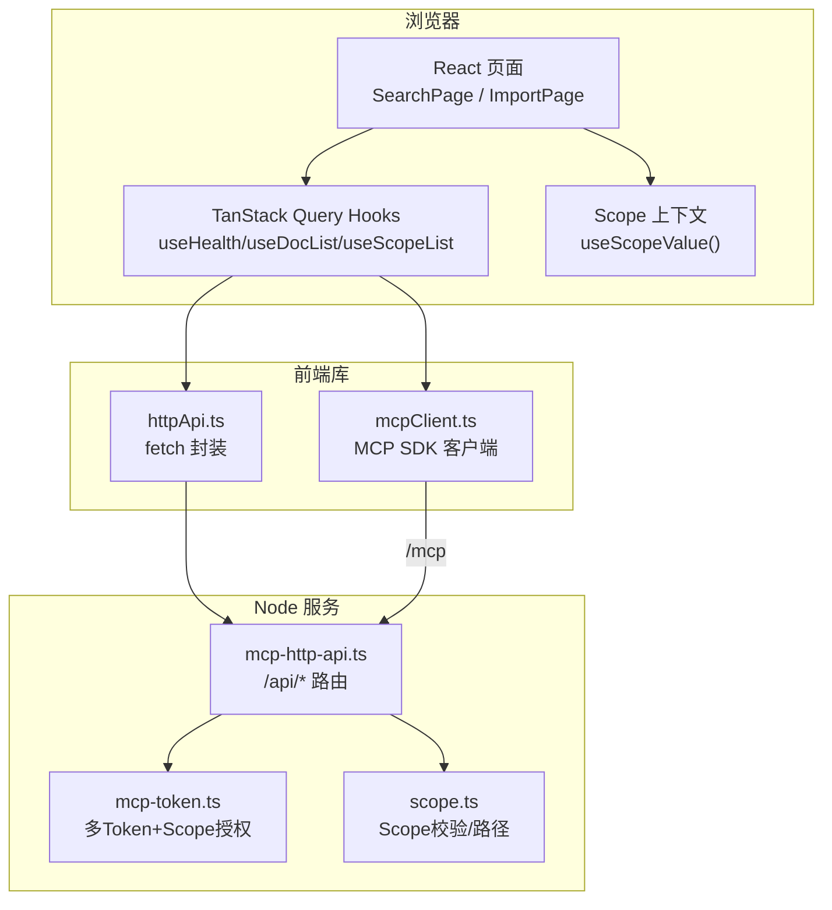
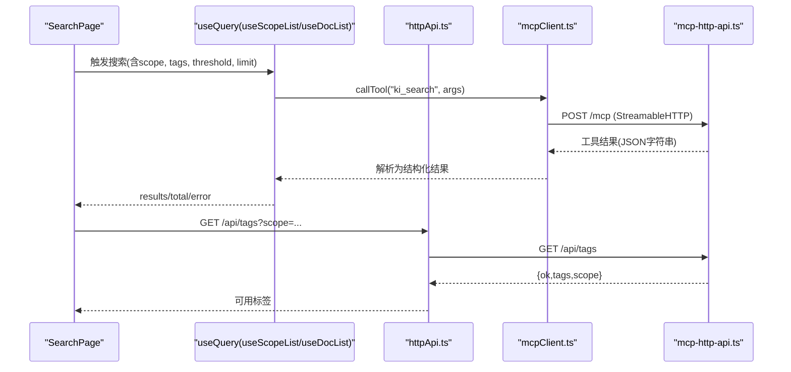
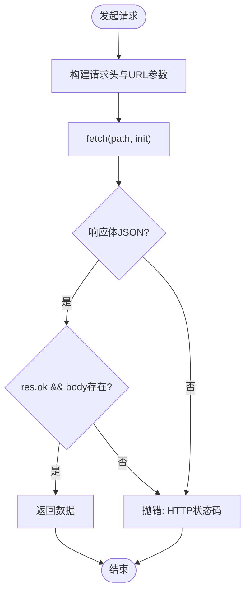
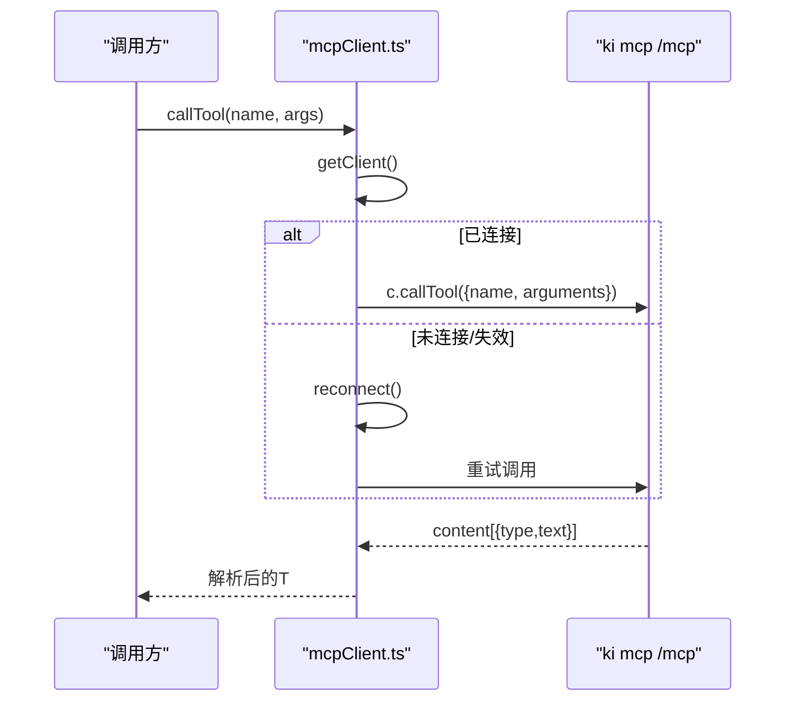
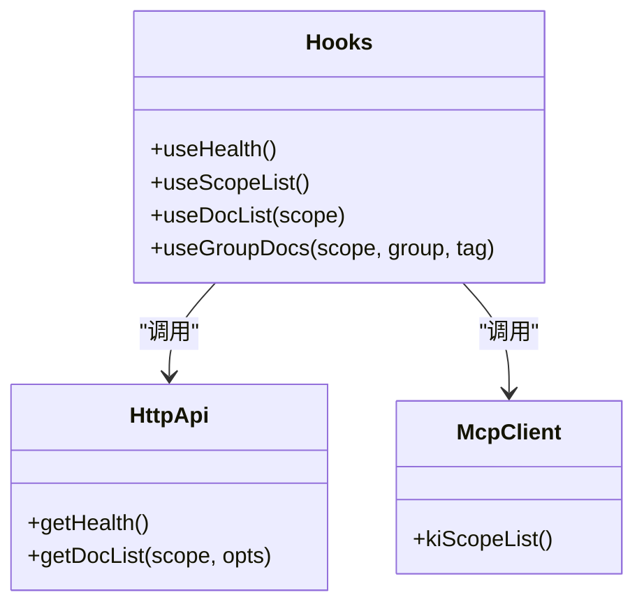
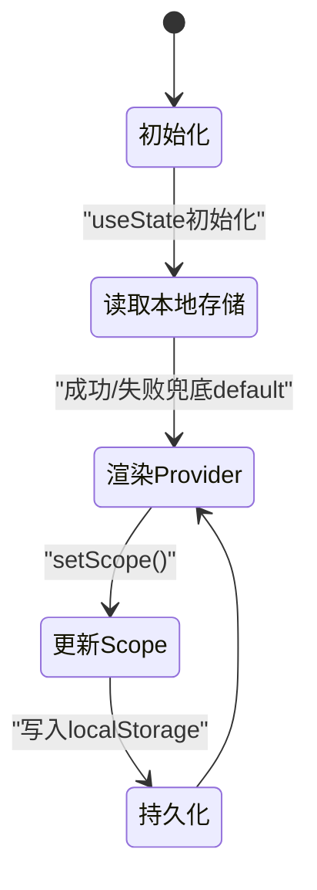
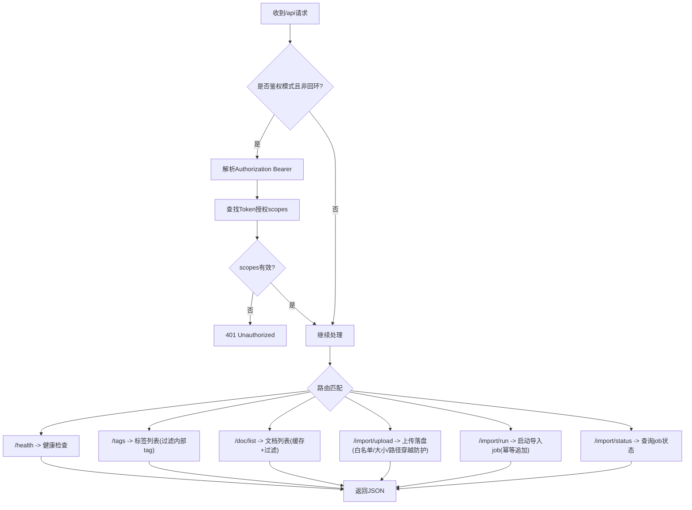
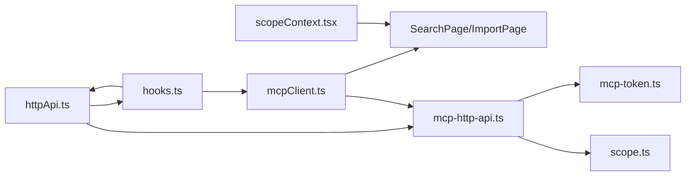

# API集成与数据交互

<cite>
**本文引用的文件**
- [web/src/api/httpApi.ts](file://web/src/api/httpApi.ts)
- [web/src/api/mcpClient.ts](file://web/src/api/mcpClient.ts)
- [web/src/lib/hooks.ts](file://web/src/lib/hooks.ts)
- [web/src/lib/scopeContext.tsx](file://web/src/lib/scopeContext.tsx)
- [src/lib/mcp-http-api.ts](file://src/lib/mcp-http-api.ts)
- [src/lib/mcp-token.ts](file://src/lib/mcp-token.ts)
- [src/lib/scope.ts](file://src/lib/scope.ts)
- [docs/mcp-http.md](file://docs/mcp-http.md)
- [web/src/pages/SearchPage.tsx](file://web/src/pages/SearchPage.tsx)
- [web/src/pages/ImportPage.tsx](file://web/src/pages/ImportPage.tsx)
- [web/src/components/ScopeSelect.tsx](file://web/src/components/ScopeSelect.tsx)
</cite>

## 目录
1. [简介](#简介)
2. [项目结构](#项目结构)
3. [核心组件](#核心组件)
4. [架构总览](#架构总览)
5. [详细组件分析](#详细组件分析)
6. [依赖关系分析](#依赖关系分析)
7. [性能考量](#性能考量)
8. [故障排查指南](#故障排查指南)
9. [结论](#结论)
10. [附录：API契约与最佳实践](#附录api契约与最佳实践)

## 简介
本文件面向前后端集成，系统性说明 HTTP API 与 MCP 客户端的使用方式、认证机制、请求封装、错误处理、数据获取/提交/实时更新模式、Hooks 使用与自定义 Hook 开发指南、Scope 上下文的状态管理与数据隔离原理，并给出常见集成场景的代码示例路径与排障方法。

## 项目结构
前端通过两类通道与后端交互：
- HTTP API：基于同源 fetch 的 REST 风格接口，用于健康检查、文档列表、标签、导入上传与异步任务状态查询等。
- MCP 客户端：基于 Model Context Protocol SDK 的 StreamableHTTP 传输，调用 ki mcp 工具（如搜索、模块信息读取、存储、同步关系等）。

后端在 ki mcp --http 模式下提供 /mcp 协议服务，并通过扩展路由 /api/* 补齐可视化能力。鉴权策略与 /mcp 一致：回环地址免鉴权，非回环强制 Bearer Token；同时支持多 Token + scope 授权（RBAC）。

图表来源
- [web/src/pages/SearchPage.tsx:1-251](file://web/src/pages/SearchPage.tsx#L1-L251)
- [web/src/pages/ImportPage.tsx:1-503](file://web/src/pages/ImportPage.tsx#L1-L503)
- [web/src/lib/hooks.ts:1-53](file://web/src/lib/hooks.ts#L1-L53)
- [web/src/api/httpApi.ts:1-189](file://web/src/api/httpApi.ts#L1-L189)
- [web/src/api/mcpClient.ts:1-175](file://web/src/api/mcpClient.ts#L1-L175)
- [src/lib/mcp-http-api.ts:1-565](file://src/lib/mcp-http-api.ts#L1-L565)
- [src/lib/mcp-token.ts:1-265](file://src/lib/mcp-token.ts#L1-L265)
- [src/lib/scope.ts:1-230](file://src/lib/scope.ts#L1-L230)

章节来源
- [docs/mcp-http.md:72-103](file://docs/mcp-http.md#L72-L103)
- [docs/mcp-http.md:132-145](file://docs/mcp-http.md#L132-L145)

## 核心组件
- HTTP API 封装：统一 fetch 包装、类型定义、业务方法（健康检查、文档列表、标签、导入上传/运行/状态）。
- MCP 客户端：单例连接、会话重建、工具调用封装（搜索、模块信息、存储、同步关系）。
- Hooks：基于 TanStack Query 的数据获取与缓存（健康、Scope 列表、文档列表、分组文档）。
- Scope 上下文：全局 Scope 选择与持久化（localStorage），跨页面共享。
- 后端路由：/api/* 鉴权、越权校验、文档列表缓存、导入任务管理。
- 认证与授权：多 Token 存储、scope 授权集合、常量时间比较、回环/非回环差异化鉴权。

章节来源
- [web/src/api/httpApi.ts:93-189](file://web/src/api/httpApi.ts#L93-L189)
- [web/src/api/mcpClient.ts:48-175](file://web/src/api/mcpClient.ts#L48-L175)
- [web/src/lib/hooks.ts:1-53](file://web/src/lib/hooks.ts#L1-L53)
- [web/src/lib/scopeContext.tsx:1-56](file://web/src/lib/scopeContext.tsx#L1-L56)
- [src/lib/mcp-http-api.ts:216-272](file://src/lib/mcp-http-api.ts#L216-L272)
- [src/lib/mcp-token.ts:1-265](file://src/lib/mcp-token.ts#L1-L265)

## 架构总览
下图展示一次“语义搜索”的端到端流程：前端页面通过 Hooks 调用 MCP 客户端，经 /mcp 协议调用后端工具，返回搜索结果；同时可结合 HTTP API 获取可用标签进行过滤。

图表来源
- [web/src/pages/SearchPage.tsx:49-79](file://web/src/pages/SearchPage.tsx#L49-L79)
- [web/src/api/mcpClient.ts:83-109](file://web/src/api/mcpClient.ts#L83-L109)
- [src/lib/mcp-http-api.ts:216-272](file://src/lib/mcp-http-api.ts#L216-L272)
- [src/lib/mcp-http-api.ts:290-304](file://src/lib/mcp-http-api.ts#L290-L304)

## 详细组件分析

### HTTP API 封装与错误处理
- 基础请求封装：统一设置 Content-Type，解析 JSON，非 JSON 或响应失败时抛出错误，错误消息优先取 body.error，否则 HTTP 状态码。
- 业务方法：
  - getHealth：健康检查，避免频繁探活。
  - getDocList：支持 q/group/tag 过滤，默认分页上限 500，带 groups/tags 元数据。
  - uploadFiles：上传 base64 内容到受控目录，返回 uploadId。
  - runImport：触发导入，返回 jobId。
  - getImportStatus：轮询导入进度/结果。
  - fetchTags：获取当前 scope 的可用标签（排除内部保留 tag）。

图表来源
- [web/src/api/httpApi.ts:95-111](file://web/src/api/httpApi.ts#L95-L111)
- [web/src/api/httpApi.ts:115-189](file://web/src/api/httpApi.ts#L115-L189)

章节来源
- [web/src/api/httpApi.ts:93-189](file://web/src/api/httpApi.ts#L93-L189)

### MCP 客户端与会话管理
- 单例连接：首次连接创建 StreamableHTTPClientTransport，复用 Client 实例。
- 会话失效重建：捕获异常后清理 client/connecting，重新连接并重试一次。
- 工具调用封装：callTool 将 content[0].text 解析为 JSON，兼容直接对象返回。
- 业务工具：
  - kiScopeList：列出可用 scope。
  - kiSearch：语义搜索，支持 scope/tags/threshold/limit。
  - kiGetModuleInfo：获取模块信息。
  - kiStore：存储文本（可选 tags）。
  - kiSyncRelation：同步关系（可选 vector/tags）。

图表来源
- [web/src/api/mcpClient.ts:53-109](file://web/src/api/mcpClient.ts#L53-L109)
- [web/src/api/mcpClient.ts:120-175](file://web/src/api/mcpClient.ts#L120-L175)

章节来源
- [web/src/api/mcpClient.ts:48-175](file://web/src/api/mcpClient.ts#L48-L175)

### Hooks 与数据获取模式
- useHealth：仅加载时查一次，staleTime 60s，避免频繁触发 zvec 探活。
- useScopeList：缓存 30s，重试 1 次。
- useDocList：按 scope 拉取全量文档，文件名/路径过滤由前端内存完成。
- useGroupDocs：指定 group 的完整文档列表（不受 500 条限制），可选 tag 过滤。

图表来源
- [web/src/lib/hooks.ts:13-53](file://web/src/lib/hooks.ts#L13-L53)
- [web/src/api/httpApi.ts:115-189](file://web/src/api/httpApi.ts#L115-L189)
- [web/src/api/mcpClient.ts:120-122](file://web/src/api/mcpClient.ts#L120-L122)

章节来源
- [web/src/lib/hooks.ts:1-53](file://web/src/lib/hooks.ts#L1-L53)

### Scope 上下文与数据隔离
- ScopeProvider：维护全局 scope，持久化到 localStorage，提供 setScope。
- useScope/useScopeValue：消费上下文，供页面/组件读取当前 scope。
- 数据隔离：所有 API 调用均携带 scope（query/body），后端根据 scope 解析与 RBAC 校验，确保不同 scope 的数据隔离。

图表来源
- [web/src/lib/scopeContext.tsx:24-47](file://web/src/lib/scopeContext.tsx#L24-L47)
- [web/src/components/ScopeSelect.tsx:8-31](file://web/src/components/ScopeSelect.tsx#L8-L31)

章节来源
- [web/src/lib/scopeContext.tsx:1-56](file://web/src/lib/scopeContext.tsx#L1-L56)
- [web/src/components/ScopeSelect.tsx:1-32](file://web/src/components/ScopeSelect.tsx#L1-L32)

### 后端路由与认证授权
- 鉴权策略：
  - 回环地址免鉴权；非回环强制 Bearer Token。
  - Token 匹配采用常量时间比较，防时序侧信道。
  - 解析 Token 对应授权 scope 集合（'all' 通配全部）。
- 越权校验：对 /api/tags 与 /api/doc/list 的 query scope，以及 /api/import/upload/run 的 body scope，进行 RBAC 校验；越权返回 403。
- 文档列表缓存：按 scope 缓存 relations-cache 构建的文档列表，减少重复 IO。
- 导入任务：内存 Map 管理 job，支持进度轮询与结果查询。

图表来源
- [src/lib/mcp-http-api.ts:216-272](file://src/lib/mcp-http-api.ts#L216-L272)
- [src/lib/mcp-http-api.ts:274-369](file://src/lib/mcp-http-api.ts#L274-L369)
- [src/lib/mcp-http-api.ts:371-565](file://src/lib/mcp-http-api.ts#L371-L565)
- [src/lib/mcp-token.ts:122-133](file://src/lib/mcp-token.ts#L122-L133)

章节来源
- [src/lib/mcp-http-api.ts:1-565](file://src/lib/mcp-http-api.ts#L1-L565)
- [src/lib/mcp-token.ts:1-265](file://src/lib/mcp-token.ts#L1-L265)
- [src/lib/scope.ts:1-230](file://src/lib/scope.ts#L1-L230)

### 典型集成场景与代码示例路径
- 语义搜索（MCP）：
  - 页面：SearchPage 调用 kiSearch，支持 tags/threshold/limit。
  - 参考路径：[web/src/pages/SearchPage.tsx:49-79](file://web/src/pages/SearchPage.tsx#L49-L79)
- 文档浏览与分组（HTTP）：
  - 使用 useDocList/useGroupDocs 拉取文档列表与分组树。
  - 参考路径：[web/src/lib/hooks.ts:33-53](file://web/src/lib/hooks.ts#L33-L53)
- 上传导入（HTTP）：
  - 页面：ImportPage 实现拖拽/选择文件 → uploadFiles → runImport → 轮询 getImportStatus。
  - 参考路径：[web/src/pages/ImportPage.tsx:170-228](file://web/src/pages/ImportPage.tsx#L170-L228)
- Scope 切换：
  - 组件：ScopeSelect 使用 useScope/useScopeList 切换当前 scope。
  - 参考路径：[web/src/components/ScopeSelect.tsx:8-31](file://web/src/components/ScopeSelect.tsx#L8-L31)

章节来源
- [web/src/pages/SearchPage.tsx:1-251](file://web/src/pages/SearchPage.tsx#L1-L251)
- [web/src/pages/ImportPage.tsx:1-503](file://web/src/pages/ImportPage.tsx#L1-L503)
- [web/src/components/ScopeSelect.tsx:1-32](file://web/src/components/ScopeSelect.tsx#L1-L32)

## 依赖关系分析
- 前端依赖：
  - httpApi.ts 被 hooks.ts 与页面组件引用，提供 REST 能力。
  - mcpClient.ts 被页面组件引用，提供 MCP 工具调用。
  - scopeContext.tsx 被页面与组件引用，提供全局 scope。
- 后端依赖：
  - mcp-http-api.ts 依赖 config、net-addr、mcp-token、health-check、import、tag、scope 等模块。
  - mcp-token.ts 提供多 Token 存储与 scope 授权逻辑。
  - scope.ts 提供 scope 校验与路径构造。

图表来源
- [web/src/lib/hooks.ts:1-53](file://web/src/lib/hooks.ts#L1-L53)
- [web/src/api/httpApi.ts:1-189](file://web/src/api/httpApi.ts#L1-L189)
- [web/src/api/mcpClient.ts:1-175](file://web/src/api/mcpClient.ts#L1-L175)
- [src/lib/mcp-http-api.ts:1-565](file://src/lib/mcp-http-api.ts#L1-L565)
- [src/lib/mcp-token.ts:1-265](file://src/lib/mcp-token.ts#L1-L265)
- [src/lib/scope.ts:1-230](file://src/lib/scope.ts#L1-L230)

章节来源
- [web/src/lib/hooks.ts:1-53](file://web/src/lib/hooks.ts#L1-L53)
- [web/src/api/httpApi.ts:1-189](file://web/src/api/httpApi.ts#L1-L189)
- [web/src/api/mcpClient.ts:1-175](file://web/src/api/mcpClient.ts#L1-L175)
- [src/lib/mcp-http-api.ts:1-565](file://src/lib/mcp-http-api.ts#L1-L565)

## 性能考量
- 缓存策略：
  - useHealth staleTime 60s，避免频繁触发 zvec 探活。
  - useScopeList/useDocList staleTime 30s，减少重复请求。
  - 后端 /api/doc/list 按 scope 缓存 relations-cache 构建结果，降低 IO。
- 分页与限制：
  - /api/doc/list 默认分页上限 500，搜索场景放宽至 2000。
  - 指定 group 时返回该组全部文档，避免截断影响 Group 树。
- 资源控制：
  - 上传文件大小上限 1MB，请求体上限 16MB。
  - 导入任务内存 Map 限制最大数量与 TTL，防止无界增长。
- 网络优化：
  - 同源 fetch 与 MCP StreamableHTTP 避免 CORS 开销。
  - 会话空闲回收与上限控制，防止资源泄漏。

章节来源
- [web/src/lib/hooks.ts:13-53](file://web/src/lib/hooks.ts#L13-L53)
- [src/lib/mcp-http-api.ts:33-42](file://src/lib/mcp-http-api.ts#L33-L42)
- [src/lib/mcp-http-api.ts:154-199](file://src/lib/mcp-http-api.ts#L154-L199)
- [src/lib/mcp-http-api.ts:306-369](file://src/lib/mcp-http-api.ts#L306-L369)
- [src/lib/mcp-http-api.ts:49-86](file://src/lib/mcp-http-api.ts#L49-L86)

## 故障排查指南
- 401 Unauthorized：
  - 非回环绑定需携带 Authorization: Bearer <token>。
  - 检查 Token 是否与服务器存储一致（常量时间比较）。
  - 参考路径：[src/lib/mcp-http-api.ts:222-245](file://src/lib/mcp-http-api.ts#L222-L245)
- 403 Forbidden（越权）：
  - 请求 scope 不在 Token 授权范围内。
  - 检查 /api/tags 与 /api/doc/list 的 query scope，以及 /api/import/upload/run 的 body scope。
  - 参考路径：[src/lib/mcp-http-api.ts:249-258](file://src/lib/mcp-http-api.ts#L249-L258)
- 导入失败：
  - 检查文件扩展名白名单（.md/.markdown/.mdx）、大小上限、路径穿越防护。
  - 确认 uploadId 存在且在受控目录内。
  - 参考路径：[src/lib/mcp-http-api.ts:371-450](file://src/lib/mcp-http-api.ts#L371-L450)
- 会话失效：
  - MCP 客户端自动重建连接并重试一次。
  - 参考路径：[web/src/api/mcpClient.ts:95-109](file://web/src/api/mcpClient.ts#L95-L109)
- 健康检查超时：
  - /api/health 包含 zvec 探活，默认 10s 超时。
  - 参考路径：[src/lib/mcp-http-api.ts:274-288](file://src/lib/mcp-http-api.ts#L274-L288)

章节来源
- [src/lib/mcp-http-api.ts:216-272](file://src/lib/mcp-http-api.ts#L216-L272)
- [src/lib/mcp-http-api.ts:371-565](file://src/lib/mcp-http-api.ts#L371-L565)
- [web/src/api/mcpClient.ts:95-109](file://web/src/api/mcpClient.ts#L95-L109)

## 结论
本项目通过 HTTP API 与 MCP 客户端双通道实现前后端集成，具备完善的认证授权、错误处理、缓存与性能优化机制。Scope 上下文确保数据隔离，Hooks 简化数据获取与状态管理。建议在生产环境启用非回环绑定与 Token 鉴权，结合反向代理 TLS 终止，遵循最小权限原则配置 scope 授权。

## 附录：API契约与最佳实践

### HTTP API 契约
- GET /api/health：健康报告（含 zvec 探活，10s 超时）。
- GET /api/tags?scope=...：标签列表（排除内部保留 tag）。
- GET /api/doc/list?scope=&q=&group=&tag=&limit=...：文档列表（默认 500，搜索放宽至 2000）。
- POST /api/import/upload：上传文件（base64 内容，白名单扩展名，大小上限 1MB）。
- POST /api/import/run：触发导入（幂等追加，返回 jobId）。
- GET /api/import/status?jobId=...：查询导入进度/结果。

章节来源
- [docs/mcp-http.md:92-103](file://docs/mcp-http.md#L92-L103)
- [src/lib/mcp-http-api.ts:216-272](file://src/lib/mcp-http-api.ts#L216-L272)

### 认证与授权最佳实践
- 回环地址免鉴权，非回环强制 Bearer Token。
- 使用 ki mcp token generate --scope <scope> 生成最小权限 Token。
- 定期审计 Token 列表，及时吊销泄露 Token。
- 参考路径：[docs/mcp-http.md:132-145](file://docs/mcp-http.md#L132-L145)

### 请求封装与错误处理最佳实践
- 统一使用 httpApi.ts 的 req 封装，避免重复错误处理。
- 对 MCP 调用捕获异常并触发 reconnect 重试。
- 对导入任务轮询设置合理间隔与超时，避免频繁请求。
- 参考路径：[web/src/api/httpApi.ts:95-111](file://web/src/api/httpApi.ts#L95-L111)
- 参考路径：[web/src/api/mcpClient.ts:95-109](file://web/src/api/mcpClient.ts#L95-L109)
- 参考路径：[web/src/pages/ImportPage.tsx:91-116](file://web/src/pages/ImportPage.tsx#L91-L116)

### 自定义 Hook 开发指南
- 使用 TanStack Query 的 useQuery 封装数据获取，设置合理的 staleTime 与 retry。
- 将 scope 作为 queryKey 的一部分，确保缓存隔离。
- 对于复杂逻辑，组合多个 hooks 并提供统一的错误处理与状态管理。
- 参考路径：[web/src/lib/hooks.ts:13-53](file://web/src/lib/hooks.ts#L13-L53)

### 常见集成场景示例路径
- 语义搜索：[web/src/pages/SearchPage.tsx:49-79](file://web/src/pages/SearchPage.tsx#L49-L79)
- 文档浏览：[web/src/lib/hooks.ts:33-53](file://web/src/lib/hooks.ts#L33-L53)
- 上传导入：[web/src/pages/ImportPage.tsx:170-228](file://web/src/pages/ImportPage.tsx#L170-L228)
- Scope 切换：[web/src/components/ScopeSelect.tsx:8-31](file://web/src/components/ScopeSelect.tsx#L8-L31)