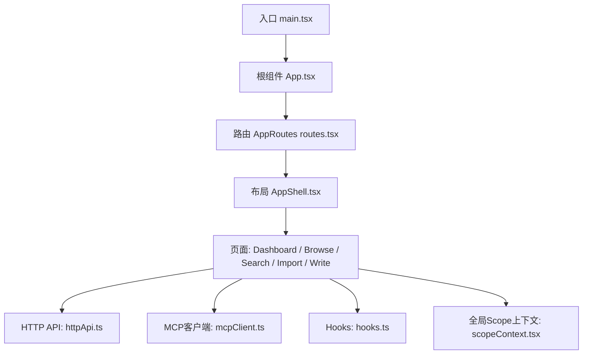
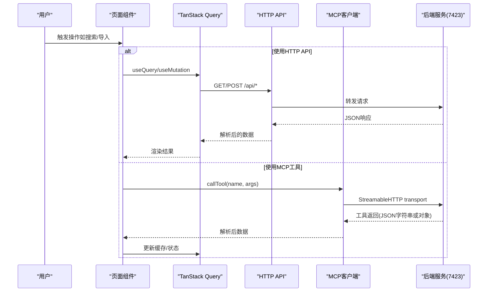
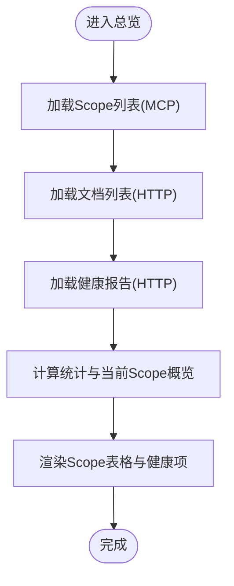
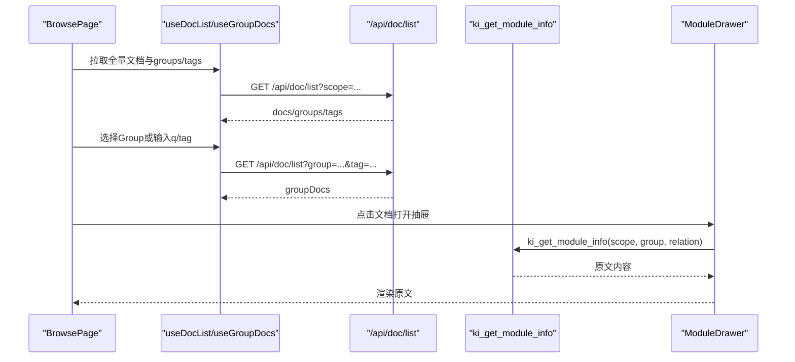
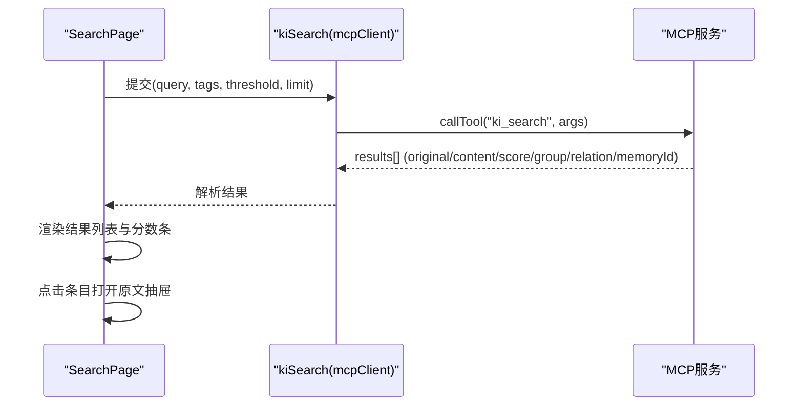
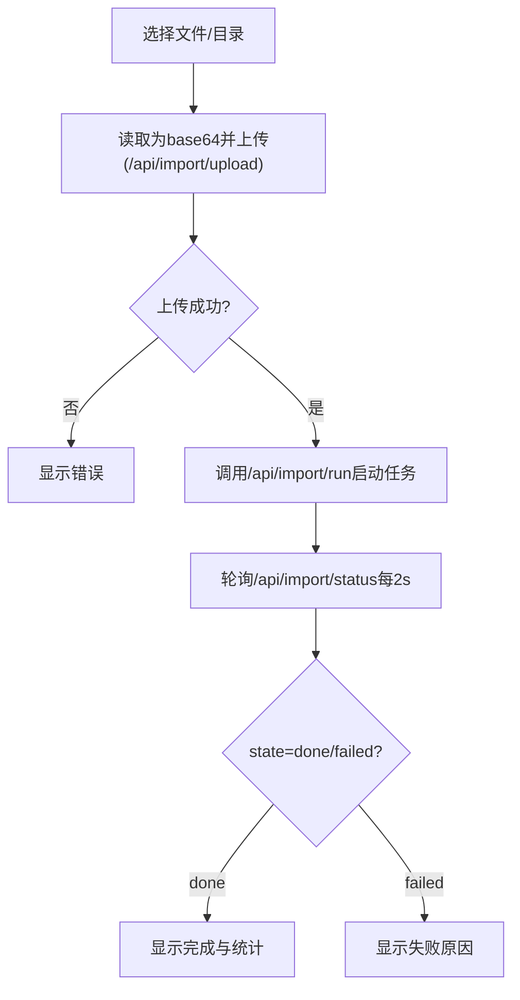
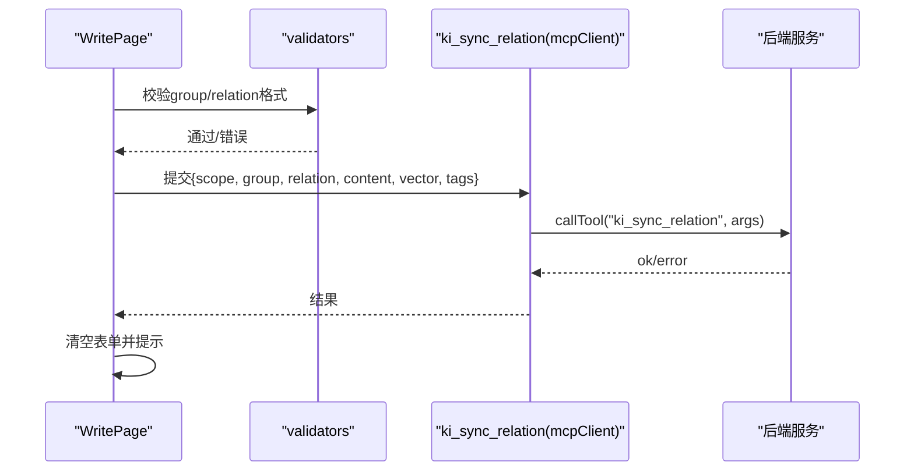
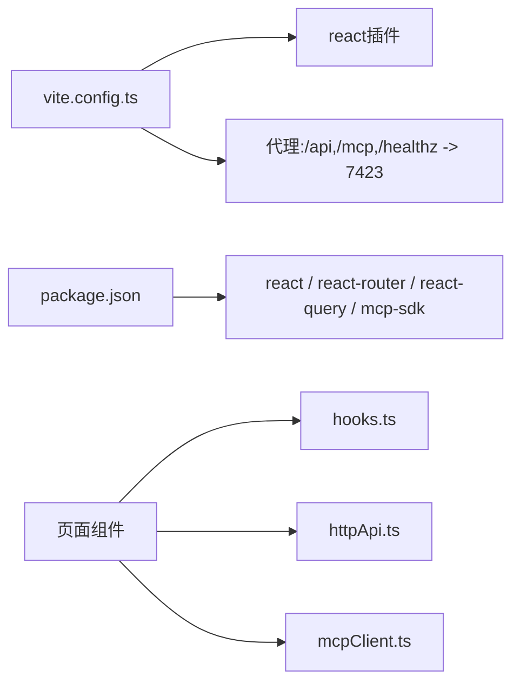

# Web前端界面

<cite>
**本文引用的文件**
- [web/package.json](file://web/package.json)
- [web/vite.config.ts](file://web/vite.config.ts)
- [web/src/main.tsx](file://web/src/main.tsx)
- [web/src/App.tsx](file://web/src/App.tsx)
- [web/src/router/routes.tsx](file://web/src/router/routes.tsx)
- [web/src/layouts/AppShell.tsx](file://web/src/layouts/AppShell.tsx)
- [web/src/pages/DashboardPage.tsx](file://web/src/pages/DashboardPage.tsx)
- [web/src/pages/BrowsePage.tsx](file://web/src/pages/BrowsePage.tsx)
- [web/src/pages/SearchPage.tsx](file://web/src/pages/SearchPage.tsx)
- [web/src/pages/ImportPage.tsx](file://web/src/pages/ImportPage.tsx)
- [web/src/pages/WritePage.tsx](file://web/src/pages/WritePage.tsx)
- [web/src/api/httpApi.ts](file://web/src/api/httpApi.ts)
- [web/src/api/mcpClient.ts](file://web/src/api/mcpClient.ts)
- [web/src/lib/hooks.ts](file://web/src/lib/hooks.ts)
- [web/src/lib/scopeContext.tsx](file://web/src/lib/scopeContext.tsx)
</cite>

## 目录
1. [简介](#简介)
2. [项目结构](#项目结构)
3. [核心组件](#核心组件)
4. [架构总览](#架构总览)
5. [详细组件分析](#详细组件分析)
6. [依赖关系分析](#依赖关系分析)
7. [性能考虑](#性能考虑)
8. [故障排查指南](#故障排查指南)
9. [结论](#结论)
10. [附录](#附录)

## 简介
本文件面向Web前端界面的使用与扩展，覆盖内置React应用的功能模块：总览页面、知识库浏览、语义搜索、上传导入、知识写入等。文档同时说明前后端API集成方式（HTTP API与MCP工具）、数据交互流程、组件架构与状态管理、定制扩展指南、部署配置与性能优化建议，以及与MCP服务的集成和实时数据更新机制。

## 项目结构
前端采用Vite + React + TypeScript工程组织，路由基于react-router-dom，数据请求通过@tanstack/react-query进行缓存与重试控制，MCP通信通过@modelcontextprotocol/sdk的StreamableHTTPClientTransport直连后端MCP服务。

**图表来源**
- [web/src/main.tsx:1-15](file://web/src/main.tsx#L1-L15)
- [web/src/App.tsx:1-33](file://web/src/App.tsx#L1-L33)
- [web/src/router/routes.tsx:1-22](file://web/src/router/routes.tsx#L1-L22)
- [web/src/layouts/AppShell.tsx:1-170](file://web/src/layouts/AppShell.tsx#L1-L170)
- [web/src/api/httpApi.ts:1-189](file://web/src/api/httpApi.ts#L1-L189)
- [web/src/api/mcpClient.ts:1-175](file://web/src/api/mcpClient.ts#L1-L175)
- [web/src/lib/hooks.ts:1-53](file://web/src/lib/hooks.ts#L1-L53)
- [web/src/lib/scopeContext.tsx:1-56](file://web/src/lib/scopeContext.tsx#L1-L56)

**章节来源**
- [web/package.json:1-30](file://web/package.json#L1-L30)
- [web/vite.config.ts:1-30](file://web/vite.config.ts#L1-L30)
- [web/src/main.tsx:1-15](file://web/src/main.tsx#L1-L15)
- [web/src/App.tsx:1-33](file://web/src/App.tsx#L1-L33)
- [web/src/router/routes.tsx:1-22](file://web/src/router/routes.tsx#L1-L22)

## 核心组件
- 应用壳层与导航：AppShell提供侧边栏导航、主题切换、服务健康徽章、全局快捷键（Ctrl/Cmd+F聚焦应用内搜索框）。
- 路由与页面：routes定义五个主页面（总览、浏览、搜索、导入、写入），统一挂载在AppShell下。
- 数据层：httpApi封装HTTP接口；mcpClient封装MCP工具调用；hooks封装TanStack Query查询。
- 状态管理：scopeContext维护当前Scope并持久化到localStorage；QueryClient负责缓存与重试策略。

**章节来源**
- [web/src/layouts/AppShell.tsx:1-170](file://web/src/layouts/AppShell.tsx#L1-L170)
- [web/src/router/routes.tsx:1-22](file://web/src/router/routes.tsx#L1-L22)
- [web/src/api/httpApi.ts:1-189](file://web/src/api/httpApi.ts#L1-L189)
- [web/src/api/mcpClient.ts:1-175](file://web/src/api/mcpClient.ts#L1-L175)
- [web/src/lib/hooks.ts:1-53](file://web/src/lib/hooks.ts#L1-L53)
- [web/src/lib/scopeContext.tsx:1-56](file://web/src/lib/scopeContext.tsx#L1-L56)

## 架构总览
前端通过两条通道与后端交互：
- HTTP API：用于健康检查、文档列表、导入任务、标签列表等。
- MCP工具：用于Scope列表、语义搜索、模块信息获取、关系同步写入等。

**图表来源**
- [web/src/api/httpApi.ts:95-189](file://web/src/api/httpApi.ts#L95-L189)
- [web/src/api/mcpClient.ts:53-109](file://web/src/api/mcpClient.ts#L53-L109)
- [web/src/lib/hooks.ts:14-52](file://web/src/lib/hooks.ts#L14-L52)
- [web/vite.config.ts:14-23](file://web/vite.config.ts#L14-L23)

## 详细组件分析

### 总览页面（Dashboard）
- 功能：展示服务健康横幅、统计卡片（Scopes数量、KB文档数、向量层状态、注册情况）、当前Scope概览、所有Scope列表与健康项明细。
- 数据源：
  - Scope列表：通过MCP工具ki_scope_list获取。
  - 文档总数与Group树：通过HTTP接口/api/doc/list获取groups与tags。
  - 健康报告：通过HTTP接口/api/health获取。
- 交互：切换Scope时自动刷新当前Scope文档与统计。

**图表来源**
- [web/src/pages/DashboardPage.tsx:67-227](file://web/src/pages/DashboardPage.tsx#L67-L227)
- [web/src/lib/hooks.ts:23-41](file://web/src/lib/hooks.ts#L23-L41)
- [web/src/api/httpApi.ts:115-130](file://web/src/api/httpApi.ts#L115-L130)
- [web/src/api/mcpClient.ts:120-122](file://web/src/api/mcpClient.ts#L120-L122)

**章节来源**
- [web/src/pages/DashboardPage.tsx:1-227](file://web/src/pages/DashboardPage.tsx#L1-L227)

### 知识库浏览（Browse）
- 功能：左侧Group递归树（支持展开/折叠、默认一级展开），右侧文档列表（支持文件名/路径模糊搜索、Tag过滤），点击文档打开原文抽屉。
- 数据源：
  - 全量文档与Group树：/api/doc/list（含groups与tags字段）。
  - 指定Group完整文档：/api/doc/list?group=...（不受分页截断影响）。
  - 原文内容：MCP工具ki_get_module_info。
- 交互：选择Group或输入搜索词时分别触发不同查询；搜索结果优先于当前Group文档显示。

**图表来源**
- [web/src/pages/BrowsePage.tsx:86-399](file://web/src/pages/BrowsePage.tsx#L86-L399)
- [web/src/lib/hooks.ts:33-52](file://web/src/lib/hooks.ts#L33-L52)
- [web/src/api/httpApi.ts:119-130](file://web/src/api/httpApi.ts#L119-L130)
- [web/src/api/mcpClient.ts:138-144](file://web/src/api/mcpClient.ts#L138-L144)

**章节来源**
- [web/src/pages/BrowsePage.tsx:1-400](file://web/src/pages/BrowsePage.tsx#L1-L400)

### 语义搜索（Search）
- 功能：自然语言查询，支持阈值与Limit调节、Tag多选过滤；结果展示命中分数、原文片段、Group路径、向量标识。
- 数据源：MCP工具ki_search（include_original=true），可传入scope、tags、threshold、limit。
- 交互：提交表单后发起搜索，错误时提示“搜索失败”，空结果给出调整建议。

**图表来源**
- [web/src/pages/SearchPage.tsx:26-251](file://web/src/pages/SearchPage.tsx#L26-L251)
- [web/src/api/mcpClient.ts:124-136](file://web/src/api/mcpClient.ts#L124-L136)

**章节来源**
- [web/src/pages/SearchPage.tsx:1-251](file://web/src/pages/SearchPage.tsx#L1-L251)

### 上传导入（Import）
- 功能：拖拽或选择文件/目录，设置Group路径、切分参数、向量化开关、Tags；上传后触发导入任务并轮询进度。
- 数据源：
  - 上传：/api/import/upload（base64编码的文件内容）。
  - 启动导入：/api/import/run（携带uploadId、group、chunkSize、chunkOverlap、vector、tags）。
  - 进度：/api/import/status?jobId=...（每2秒轮询）。
  - Tag列表：/api/tags?scope=...。
- 交互：阶段状态机idle→uploading→importing→done/failed；完成后跳转到搜索验证。

**图表来源**
- [web/src/pages/ImportPage.tsx:21-503](file://web/src/pages/ImportPage.tsx#L21-L503)
- [web/src/api/httpApi.ts:132-168](file://web/src/api/httpApi.ts#L132-L168)

**章节来源**
- [web/src/pages/ImportPage.tsx:1-503](file://web/src/pages/ImportPage.tsx#L1-L503)

### 知识写入（Write）
- 功能：填写Group、Relation、Markdown正文，可选Tags与向量化开关；提交后通过MCP工具ki_sync_relation写入relations-cache与本地KB，并可写向量层。
- 数据源：MCP工具ki_sync_relation（包含scope、group、relation、module_info、vector、tags）。
- 交互：表单校验通过后提交，成功后清空表单并显示结果；失败时显示错误。

**图表来源**
- [web/src/pages/WritePage.tsx:17-325](file://web/src/pages/WritePage.tsx#L17-L325)
- [web/src/api/mcpClient.ts:158-174](file://web/src/api/mcpClient.ts#L158-L174)

**章节来源**
- [web/src/pages/WritePage.tsx:1-325](file://web/src/pages/WritePage.tsx#L1-L325)

## 依赖关系分析
- 构建与开发：
  - Vite插件：@vitejs/plugin-react。
  - 别名：'@'指向src目录。
  - 开发代理：/api、/mcp、/healthz转发至本机7423端口。
  - 构建目标：es2022，输出dist。
- 运行时依赖：
  - React 18、react-router-dom 7、@tanstack/react-query 5、marked、mermaid。
  - MCP SDK：@modelcontextprotocol/sdk（StreamableHTTPClientTransport）。

**图表来源**
- [web/vite.config.ts:1-30](file://web/vite.config.ts#L1-L30)
- [web/package.json:1-30](file://web/package.json#L1-L30)
- [web/src/lib/hooks.ts:1-53](file://web/src/lib/hooks.ts#L1-L53)
- [web/src/api/httpApi.ts:1-189](file://web/src/api/httpApi.ts#L1-L189)
- [web/src/api/mcpClient.ts:1-175](file://web/src/api/mcpClient.ts#L1-L175)

**章节来源**
- [web/vite.config.ts:1-30](file://web/vite.config.ts#L1-L30)
- [web/package.json:1-30](file://web/package.json#L1-L30)

## 性能考虑
- 缓存与重试：
  - QueryClient默认queries重试1次，窗口失焦不refetch；各hook设置staleTime（如30s/60s）减少重复请求。
- 网络优化：
  - 浏览页按Group精确拉取完整文档，避免分页截断带来的多次请求。
  - 搜索页对全局q查询启用staleTime与retry限制，降低频繁输入导致的压力。
- 渲染优化：
  - Group树仅在groups变化时重建，避免activeGroup变化导致重建树与折叠抖动。
  - 浏览页禁用外层滚动，双栏各自滚动提升交互体验。
- 构建优化：
  - 关闭sourcemap，目标es2022，减小产物体积。
- 实时性权衡：
  - 健康检查仅加载一次（staleTime=60s），避免频繁探测向量库。

[本节为通用性能建议，无需特定文件引用]

## 故障排查指南
- 服务不可用：
  - 顶部服务徽章显示“MCP HTTP未就绪”或“健康异常”，检查后端是否运行在7423端口及健康检查是否通过。
- 会话失效：
  - MCP客户端在callTool捕获异常后自动reconnect并重试一次，若仍失败需检查后端MCP服务状态。
- 导入失败：
  - 轮询status返回error或job.state=failed时，显示具体错误信息；确认上传成功且后端任务可用。
- 搜索失败：
  - 当后端返回ok=false时，显示error字段；检查向量库锁定或服务可用性。
- 标签问题：
  - 标签下拉为空时，确认/api/tags已正确返回；注意保留内部tag（ki-search/ki-relation/ki-path）会被排除。

**章节来源**
- [web/src/layouts/AppShell.tsx:39-64](file://web/src/layouts/AppShell.tsx#L39-L64)
- [web/src/api/mcpClient.ts:72-109](file://web/src/api/mcpClient.ts#L72-L109)
- [web/src/pages/ImportPage.tsx:91-116](file://web/src/pages/ImportPage.tsx#L91-L116)
- [web/src/pages/SearchPage.tsx:49-79](file://web/src/pages/SearchPage.tsx#L49-L79)
- [web/src/api/httpApi.ts:184-189](file://web/src/api/httpApi.ts#L184-L189)

## 结论
该Web前端以清晰的模块化设计实现了知识库的总览、浏览、语义搜索、导入与写入能力。通过HTTP API与MCP工具的双通道集成，兼顾了结构化数据与检索能力。借助TanStack Query与合理的缓存策略，保证了良好的用户体验与性能。后续可按本文档的扩展指南新增页面、复用hooks与组件、对接新MCP工具或HTTP接口，实现功能持续演进。

## 附录

### 使用指南（快速上手）
- 启动后端MCP服务（监听7423端口）。
- 安装依赖并启动开发服务器：npm run dev（Vite默认5173端口，自动代理/api与/mcp到7423）。
- 访问浏览器，使用顶栏切换Scope，依次体验总览、浏览、搜索、导入、写入。

**章节来源**
- [web/vite.config.ts:14-23](file://web/vite.config.ts#L14-L23)
- [web/package.json:6-10](file://web/package.json#L6-L10)

### 前后端API集成与数据流
- HTTP API：
  - /api/health：健康检查。
  - /api/doc/list：文档列表与Group树、tags。
  - /api/import/upload、/api/import/run、/api/import/status：导入任务。
  - /api/tags：标签列表。
- MCP工具：
  - ki_scope_list：Scope列表。
  - ki_search：语义搜索（支持tags、threshold、limit）。
  - ki_get_module_info：获取模块原文。
  - ki_store、ki_sync_relation：写入KB与向量层。

**章节来源**
- [web/src/api/httpApi.ts:115-189](file://web/src/api/httpApi.ts#L115-L189)
- [web/src/api/mcpClient.ts:120-174](file://web/src/api/mcpClient.ts#L120-L174)

### 组件架构与状态管理
- 根组件提供QueryClientProvider与ScopeProvider，确保全局缓存与Scope上下文。
- 页面通过hooks封装查询逻辑，结合useScopeValue获取当前Scope。
- 布局组件处理导航、主题、服务状态与快捷键。

**章节来源**
- [web/src/App.tsx:11-29](file://web/src/App.tsx#L11-L29)
- [web/src/lib/scopeContext.tsx:24-55](file://web/src/lib/scopeContext.tsx#L24-L55)
- [web/src/layouts/AppShell.tsx:66-169](file://web/src/layouts/AppShell.tsx#L66-L169)

### 定制与扩展指南
- 新增页面：
  - 在router/routes.tsx中添加Route与对应页面组件。
  - 在AppShell的NAV_MAIN中添加导航项。
- 新增数据源：
  - 在httpApi.ts中封装新的接口函数，并在hooks.ts中提供useXxx查询。
  - 如需MCP工具，在mcpClient.ts中封装callTool调用。
- 复用组件：
  - 使用GroupPathSelect进行Group选择，MarkdownPreview进行预览，ModuleDrawer查看原文。
- 样式定制：
  - 修改styles/ki.css或使用CSS变量（如--ki-color-*）统一主题。

**章节来源**
- [web/src/router/routes.tsx:9-21](file://web/src/router/routes.tsx#L9-L21)
- [web/src/layouts/AppShell.tsx:12-18](file://web/src/layouts/AppShell.tsx#L12-L18)
- [web/src/api/httpApi.ts:95-189](file://web/src/api/httpApi.ts#L95-L189)
- [web/src/api/mcpClient.ts:83-109](file://web/src/api/mcpClient.ts#L83-L109)

### 部署配置
- 构建产物：vite build输出至web/dist，由ki mcp --http --web静态服务提供。
- 开发模式：Vite代理/api与/mcp到本机7423，便于本地调试。
- 环境变量：无额外环境变量，依赖后端服务地址与端口。

**章节来源**
- [web/vite.config.ts:5-29](file://web/vite.config.ts#L5-L29)

### 与MCP服务的集成与实时数据更新
- 集成方式：
  - 通过StreamableHTTPClientTransport连接/mcp端点，调用ki_*工具。
  - 自动会话重建：callTool捕获异常后reconnect并重试。
- 实时数据更新：
  - 导入任务通过轮询/api/import/status获取进度与结果。
  - 其他数据通过TanStack Query缓存与staleTime控制刷新频率。

**章节来源**
- [web/src/api/mcpClient.ts:53-109](file://web/src/api/mcpClient.ts#L53-L109)
- [web/src/pages/ImportPage.tsx:91-116](file://web/src/pages/ImportPage.tsx#L91-L116)
- [web/src/lib/hooks.ts:14-52](file://web/src/lib/hooks.ts#L14-L52)