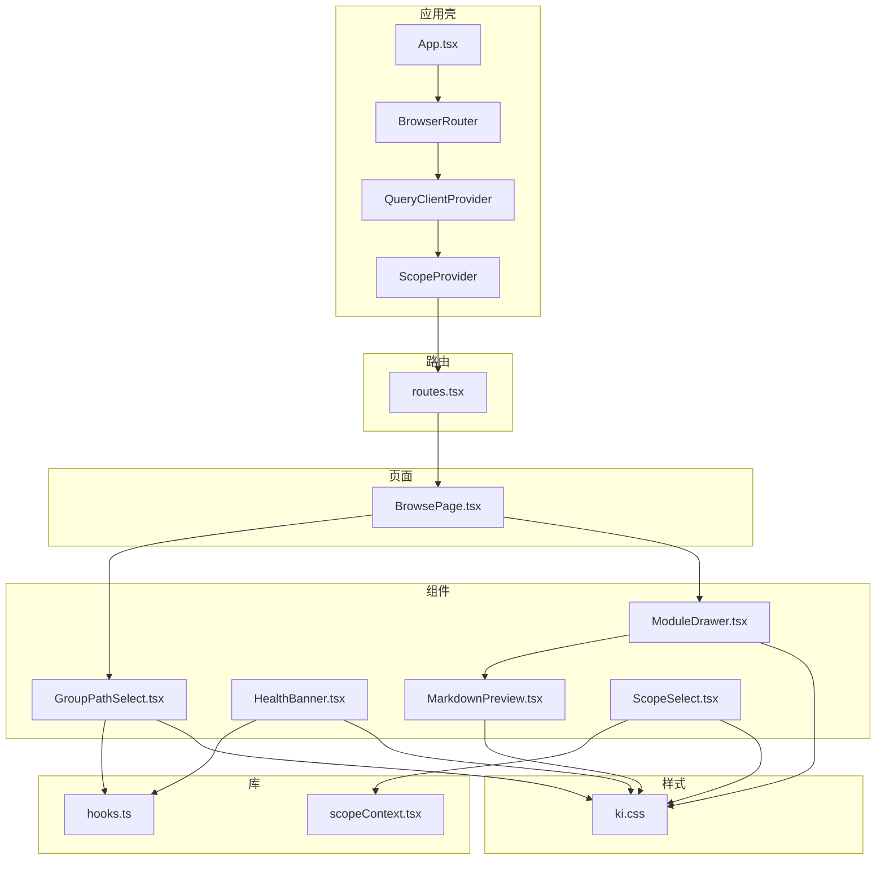
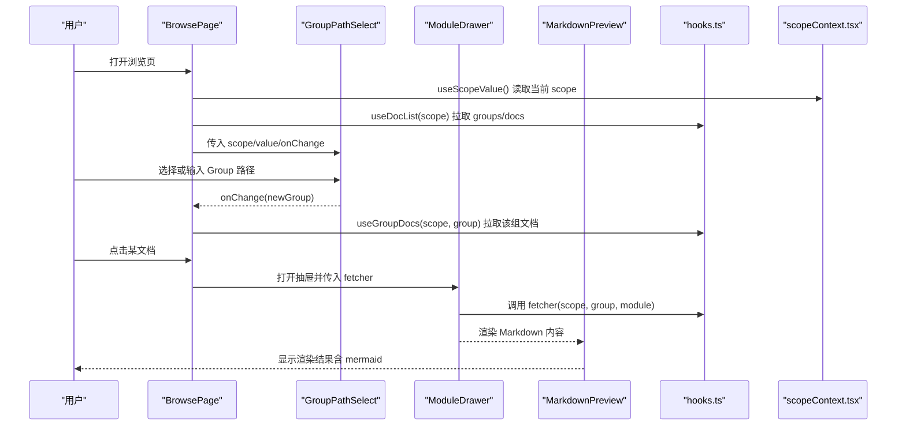
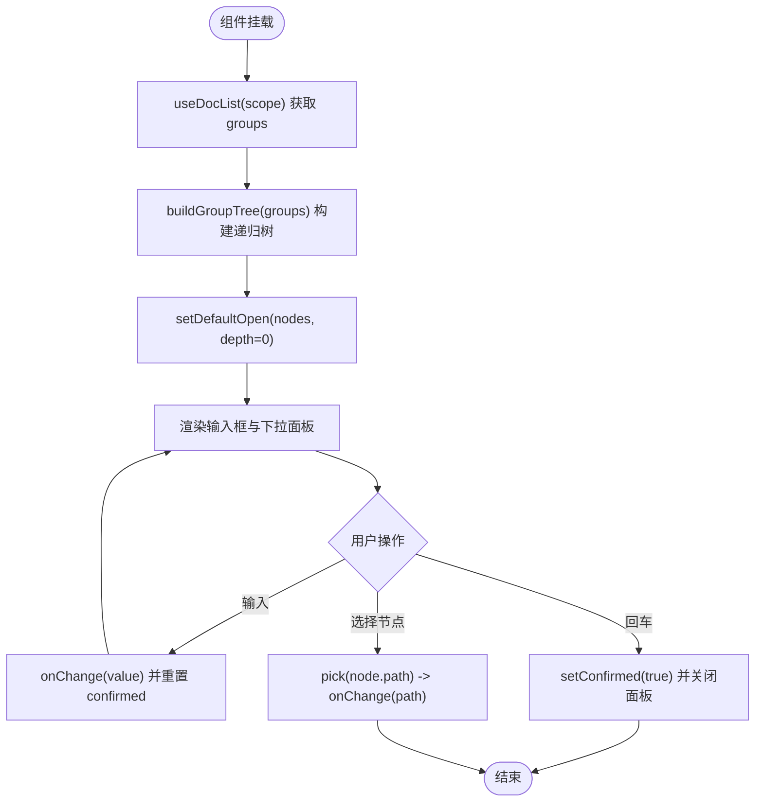
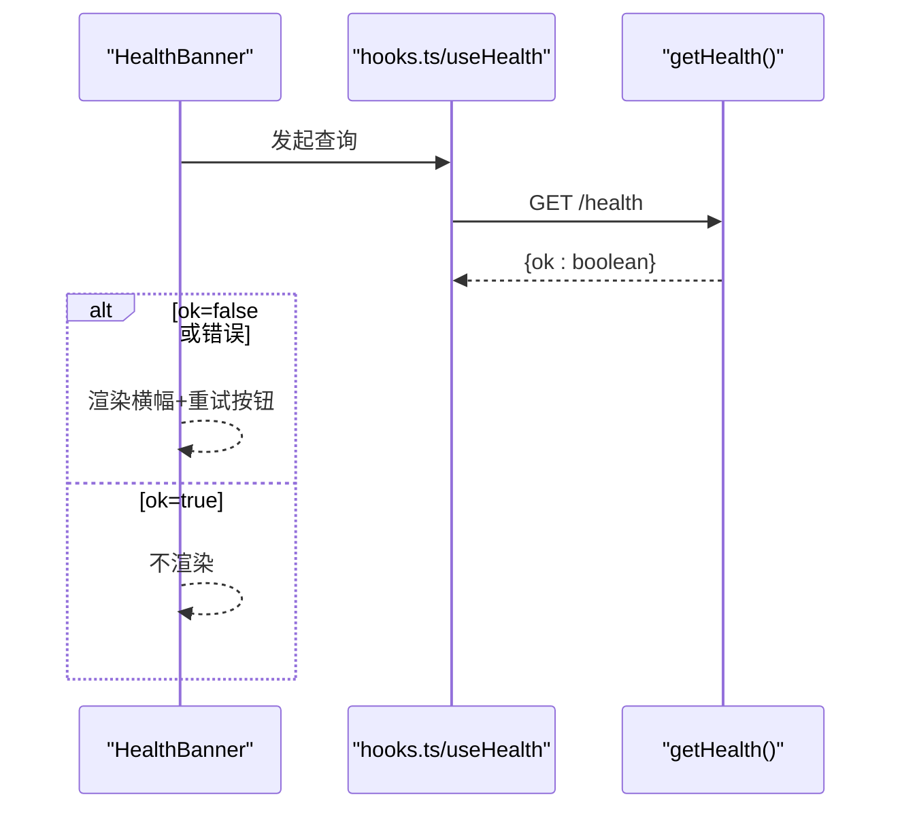
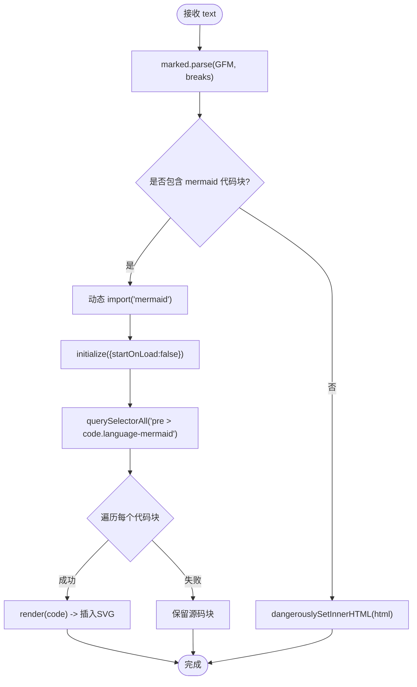
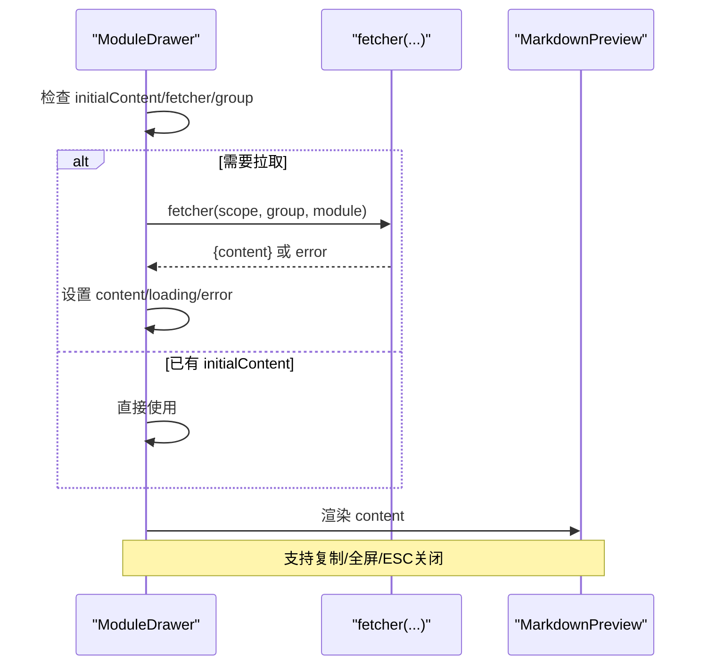
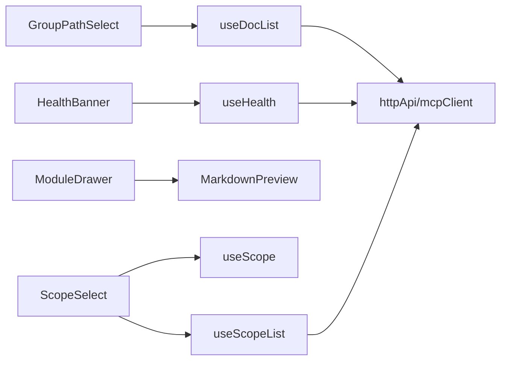
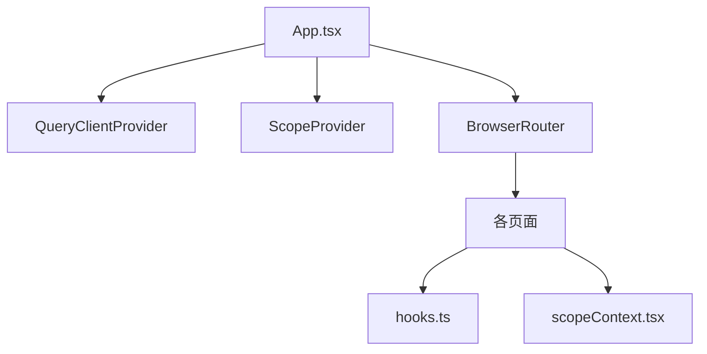

# 组件开发与定制

<cite>
**本文引用的文件**
- [GroupPathSelect.tsx](file://web/src/components/GroupPathSelect.tsx)
- [HealthBanner.tsx](file://web/src/components/HealthBanner.tsx)
- [MarkdownPreview.tsx](file://web/src/components/MarkdownPreview.tsx)
- [ModuleDrawer.tsx](file://web/src/components/ModuleDrawer.tsx)
- [ScopeSelect.tsx](file://web/src/components/ScopeSelect.tsx)
- [hooks.ts](file://web/src/lib/hooks.ts)
- [scopeContext.tsx](file://web/src/lib/scopeContext.tsx)
- [ki.css](file://web/src/styles/ki.css)
- [routes.tsx](file://web/src/router/routes.tsx)
- [App.tsx](file://web/src/App.tsx)
- [BrowsePage.tsx](file://web/src/pages/BrowsePage.tsx)
</cite>

## 目录
1. [简介](#简介)
2. [项目结构](#项目结构)
3. [核心组件](#核心组件)
4. [架构总览](#架构总览)
5. [详细组件分析](#详细组件分析)
6. [依赖关系分析](#依赖关系分析)
7. [性能与可访问性](#性能与可访问性)
8. [主题定制与样式覆盖](#主题定制与样式覆盖)
9. [自定义组件开发指南](#自定义组件开发指南)
10. [测试与调试最佳实践](#测试与调试最佳实践)
11. [与路由和状态管理的集成](#与路由和状态管理的集成)
12. [故障排查](#故障排查)
13. [结论](#结论)

## 简介
本文件面向前端开发者，系统化说明知识库 Web 前端的现有组件能力、接口规范、复用模式与扩展方式。重点覆盖以下组件：GroupPathSelect、HealthBanner、MarkdownPreview、ModuleDrawer、ScopeSelect。文档同时给出主题定制、样式覆盖、自定义组件开发、测试与调试、以及与 React Router 和状态管理（React Query + Scope Context）的集成方法。

## 项目结构
Web 前端采用“页面-组件-库”分层组织：
- 页面层：页面级容器与业务编排（如 BrowsePage）
- 组件层：通用 UI 组件（GroupPathSelect、HealthBanner、MarkdownPreview、ModuleDrawer、ScopeSelect）
- 库层：数据获取 hooks、全局上下文、API 客户端
- 样式层：统一设计令牌与组件样式（ki.css）
- 路由层：基于 react-router-dom 的路由配置

图表来源
- [App.tsx:1-33](file://web/src/App.tsx#L1-L33)
- [routes.tsx:1-22](file://web/src/router/routes.tsx#L1-L22)
- [BrowsePage.tsx:1-400](file://web/src/pages/BrowsePage.tsx#L1-L400)
- [GroupPathSelect.tsx:1-236](file://web/src/components/GroupPathSelect.tsx#L1-L236)
- [HealthBanner.tsx:1-32](file://web/src/components/HealthBanner.tsx#L1-L32)
- [MarkdownPreview.tsx:1-71](file://web/src/components/MarkdownPreview.tsx#L1-L71)
- [ModuleDrawer.tsx:1-174](file://web/src/components/ModuleDrawer.tsx#L1-L174)
- [ScopeSelect.tsx:1-32](file://web/src/components/ScopeSelect.tsx#L1-L32)
- [hooks.ts:1-53](file://web/src/lib/hooks.ts#L1-L53)
- [scopeContext.tsx:1-56](file://web/src/lib/scopeContext.tsx#L1-L56)
- [ki.css:1-966](file://web/src/styles/ki.css#L1-L966)

章节来源
- [App.tsx:1-33](file://web/src/App.tsx#L1-L33)
- [routes.tsx:1-22](file://web/src/router/routes.tsx#L1-L22)

## 核心组件
- GroupPathSelect：Group 路径选择器，支持从当前 scope 的 groups 构建递归树，下拉选择或手动输入新建；提供确认态、错误提示、占位与提示文案等。
- HealthBanner：服务健康横幅，检测 MCP HTTP 服务是否就绪，未就绪时展示指引与重试按钮。
- MarkdownPreview：Markdown 渲染组件，支持 GFM 语法与 mermaid 图表动态加载与渲染，内置安全策略丢弃原始 HTML。
- ModuleDrawer：原文查看抽屉，右侧滑出，支持复制、全屏、ESC 关闭、骨架屏与错误态。
- ScopeSelect：全局 scope 选择器，读取并切换当前 scope，持久化到 localStorage。

章节来源
- [GroupPathSelect.tsx:1-236](file://web/src/components/GroupPathSelect.tsx#L1-L236)
- [HealthBanner.tsx:1-32](file://web/src/components/HealthBanner.tsx#L1-L32)
- [MarkdownPreview.tsx:1-71](file://web/src/components/MarkdownPreview.tsx#L1-L71)
- [ModuleDrawer.tsx:1-174](file://web/src/components/ModuleDrawer.tsx#L1-L174)
- [ScopeSelect.tsx:1-32](file://web/src/components/ScopeSelect.tsx#L1-L32)

## 架构总览
整体采用“React + React Router + React Query + 自定义 Context”的组合：
- React Query 负责数据获取与缓存（useDocList、useScopeList、useHealth）。
- ScopeContext 提供跨页面共享的 scope 状态，并持久化到 localStorage。
- 组件通过 hooks 订阅数据，页面编排交互逻辑，组件专注 UI 与事件处理。
- 样式通过 ki.css 的设计令牌统一管理，支持明暗主题切换。

图表来源
- [BrowsePage.tsx:86-399](file://web/src/pages/BrowsePage.tsx#L86-L399)
- [GroupPathSelect.tsx:120-236](file://web/src/components/GroupPathSelect.tsx#L120-L236)
- [ModuleDrawer.tsx:8-174](file://web/src/components/ModuleDrawer.tsx#L8-L174)
- [MarkdownPreview.tsx:27-71](file://web/src/components/MarkdownPreview.tsx#L27-L71)
- [hooks.ts:13-53](file://web/src/lib/hooks.ts#L13-L53)
- [scopeContext.tsx:14-56](file://web/src/lib/scopeContext.tsx#L14-L56)

## 详细组件分析

### GroupPathSelect
- 功能：基于当前 scope 的 groups 构建递归树，支持下拉选择已有路径或输入新建；回车确认后标记已确认；支持错误提示与提示文案。
- Props
  - scope: string — 当前 scope
  - value: string — 当前选中或输入的 Group 路径
  - onChange: (v: string) => void — 值变更回调
  - placeholder?: string — 占位文本
  - hint?: string — 底部提示
  - newLabel?: string — 底部新建提示文案（可选）
  - error?: string | null — 校验错误文案
- 事件与行为
  - 聚焦展开面板，点击外部关闭
  - 回车确认：关闭面板并标记已确认
  - 输入变更重置确认态
  - 根据是否在树中区分“新建/已有”状态
- 数据流
  - 使用 useDocList(scope) 获取 groups，构建递归树并默认展开一层
  - 选择节点触发 onChange，更新父组件 state
- 复杂度
  - 构建树 O(n)，其中 n 为 groups 数量
  - 查找路径是否存在 O(k)，k 为树节点数（最坏情况遍历）
- 可访问性
  - 输入框具备 aria-invalid 属性用于错误态
- 样式
  - 使用 ki-combobox、ki-form-input--new/--confirmed/--error 等类名

图表来源
- [GroupPathSelect.tsx:17-53](file://web/src/components/GroupPathSelect.tsx#L17-L53)
- [GroupPathSelect.tsx:132-236](file://web/src/components/GroupPathSelect.tsx#L132-L236)

章节来源
- [GroupPathSelect.tsx:1-236](file://web/src/components/GroupPathSelect.tsx#L1-L236)

### HealthBanner
- 功能：检测 MCP HTTP 服务健康状态，未就绪时展示横幅与重试按钮。
- Props：无
- 事件与行为
  - 使用 useHealth() 查询健康状态
  - 加载中不渲染，错误或未就绪时渲染横幅
  - 点击重试触发 refetch
- 数据流
  - 通过 @/lib/hooks 的 useHealth 调用 getHealth
- 样式
  - 使用 ki-banner 及其子元素类名

图表来源
- [HealthBanner.tsx:1-32](file://web/src/components/HealthBanner.tsx#L1-L32)
- [hooks.ts:13-21](file://web/src/lib/hooks.ts#L13-L21)

章节来源
- [HealthBanner.tsx:1-32](file://web/src/components/HealthBanner.tsx#L1-L32)

### MarkdownPreview
- 功能：将 Markdown 渲染为 HTML，支持 GFM；仅当存在 mermaid 代码块时动态加载 mermaid 并渲染图表；丢弃原始 HTML 防止注入。
- Props
  - text: string — Markdown 源文本
- 事件与行为
  - 首次渲染生成 HTML，扫描 language-mermaid 代码块
  - 动态 import('mermaid')，初始化后逐个渲染为 SVG 并替换原代码块
  - 渲染失败保留源码块
- 安全性
  - 通过 marked.Renderer 覆盖 html 输出为空字符串，避免 XSS
- 性能
  - 仅在包含 mermaid 代码块时才加载大体积模块，减少首屏开销

图表来源
- [MarkdownPreview.tsx:12-71](file://web/src/components/MarkdownPreview.tsx#L12-L71)

章节来源
- [MarkdownPreview.tsx:1-71](file://web/src/components/MarkdownPreview.tsx#L1-L71)

### ModuleDrawer
- 功能：右侧滑出抽屉，查看原文；支持复制、全屏、ESC 关闭、骨架屏与错误态。
- Props
  - scope: string
  - module: string
  - group?: string
  - initialContent?: string
  - onClose: () => void
  - fetcher?: (scope, group, relation) => Promise<{ content? }>
- 事件与行为
  - 挂载时若未提供 initialContent 且存在 fetcher 与 group，则调用 fetcher 获取内容
  - 复制优先使用 Clipboard API，失败回退 execCommand
  - ESC 键关闭并恢复 body 滚动
  - 全屏切换增加/移除全屏样式类
- 数据流
  - 通过 props.fetcher 获取内容，内部维护 loading/error/content 状态
- 样式
  - 使用 ki-drawer、ki-drawer__head/body/foot 等类名

图表来源
- [ModuleDrawer.tsx:8-174](file://web/src/components/ModuleDrawer.tsx#L8-L174)
- [MarkdownPreview.tsx:27-71](file://web/src/components/MarkdownPreview.tsx#L27-L71)

章节来源
- [ModuleDrawer.tsx:1-174](file://web/src/components/ModuleDrawer.tsx#L1-L174)

### ScopeSelect
- 功能：全局 scope 选择器，读取并切换当前 scope，持久化到 localStorage。
- Props：无
- 事件与行为
  - 使用 useScope() 获取当前 scope 与 setScope
  - 使用 useScopeList() 获取可用 scope 列表
  - 选择项时调用 setScope 并持久化
- 样式
  - 使用 ki-form-select

章节来源
- [ScopeSelect.tsx:1-32](file://web/src/components/ScopeSelect.tsx#L1-L32)
- [scopeContext.tsx:14-56](file://web/src/lib/scopeContext.tsx#L14-L56)
- [hooks.ts:23-31](file://web/src/lib/hooks.ts#L23-L31)

## 依赖关系分析
- 组件与 hooks
  - GroupPathSelect 依赖 useDocList(scope)
  - HealthBanner 依赖 useHealth()
  - ModuleDrawer 依赖 MarkdownPreview 与外部 fetcher
  - ScopeSelect 依赖 useScope() 与 useScopeList()
- 组件与样式
  - 所有组件均通过 ki.* 类名与 ki.css 中的设计令牌保持一致风格
- 组件与路由/上下文
  - 页面通过 BrowserRouter 与 AppRoutes 组织
  - ScopeContext 提供全局 scope，被多个页面与组件消费

图表来源
- [GroupPathSelect.tsx:120-236](file://web/src/components/GroupPathSelect.tsx#L120-L236)
- [HealthBanner.tsx:1-32](file://web/src/components/HealthBanner.tsx#L1-L32)
- [ModuleDrawer.tsx:8-174](file://web/src/components/ModuleDrawer.tsx#L8-L174)
- [MarkdownPreview.tsx:27-71](file://web/src/components/MarkdownPreview.tsx#L27-L71)
- [ScopeSelect.tsx:1-32](file://web/src/components/ScopeSelect.tsx#L1-L32)
- [hooks.ts:13-53](file://web/src/lib/hooks.ts#L13-L53)

章节来源
- [hooks.ts:13-53](file://web/src/lib/hooks.ts#L13-L53)
- [scopeContext.tsx:14-56](file://web/src/lib/scopeContext.tsx#L14-L56)

## 性能与可访问性
- 性能
  - MarkdownPreview 仅在检测到 mermaid 代码块时动态加载 mermaid，避免首屏冗余
  - GroupPathSelect 使用内存构建树，适合中小规模 groups；如需大规模可考虑虚拟滚动或分页
  - 使用 React Query 的 staleTime 与 retry 控制请求频率与重试次数
- 可访问性
  - GroupPathSelect 输入框在错误态设置 aria-invalid
  - ModuleDrawer 提供 aria-label 与键盘 ESC 关闭
  - 建议为关键交互补充 role、aria-* 与焦点管理

[本节为通用指导，无需具体文件引用]

## 主题定制与样式覆盖
- 设计令牌
  - 颜色、间距、圆角、字体、阴影、动效等通过 :root 下的 --ki-* 变量定义
  - 支持明暗主题：通过 [data-theme="dark"] 覆盖变量实现主题切换
- 覆盖方式
  - 直接修改 ki.css 中的变量以全局调整主题
  - 在页面或组件内使用 CSS 变量进行局部覆盖
  - 使用组件提供的类名（如 ki-form-input--new/--confirmed/--error）组合不同状态样式
- 注意事项
  - 保持语义化类名不变，便于后续升级
  - 避免内联样式覆盖过多，优先使用设计令牌

章节来源
- [ki.css:8-92](file://web/src/styles/ki.css#L8-L92)
- [ki.css:390-440](file://web/src/styles/ki.css#L390-L440)
- [ki.css:702-800](file://web/src/styles/ki.css#L702-L800)

## 自定义组件开发指南
- 组件职责单一
  - 只关注自身 UI 与交互，复杂逻辑下沉到 hooks 或页面
- 接口设计
  - 使用明确的 props 类型定义，必要时提供可选参数
  - 对外暴露必要的事件回调（如 onChange、onClose）
- 数据获取
  - 通过 hooks.ts 中的 useDocList、useScopeList、useHealth 等统一数据获取
  - 避免在组件内直接调用 API，保持可测试性
- 样式规范
  - 使用 ki.* 类名与设计令牌，确保一致风格
  - 新增样式需遵循命名约定与模块化
- 可访问性
  - 为表单控件添加合适的 aria-* 属性
  - 支持键盘导航与焦点管理
- 示例参考
  - 参考 GroupPathSelect 的输入与下拉组合模式
  - 参考 ModuleDrawer 的抽屉交互与状态管理

[本节为通用指导，无需具体文件引用]

## 测试与调试最佳实践
- 单元测试
  - 对纯函数（如 buildGroupTree、renderMarkdownHtml）编写断言
  - 使用 React Testing Library 模拟组件交互（输入、点击、键盘事件）
- 集成测试
  - 使用 React Query 的 TestProvider 模拟数据
  - 模拟 fetcher 返回以验证 ModuleDrawer 的数据流
- 调试技巧
  - 利用浏览器 DevTools 观察 DOM 类名变化（如 ki-combobox__panel--open）
  - 通过 console.log 或断点检查状态（如 confirmed、loading、error）
  - 对于 mermaid 渲染问题，检查 language-mermaid 代码块与网络请求

[本节为通用指导，无需具体文件引用]

## 与路由和状态管理的集成
- 路由
  - 使用 react-router-dom 的 BrowserRouter 与 Routes/Route 组织页面
  - 页面组件通过 props 或 context 获取路由信息（当前项目主要使用 Context）
- 状态管理
  - React Query：集中管理异步数据（useDocList、useScopeList、useHealth），提供缓存与重试策略
  - ScopeContext：提供全局 scope 状态，持久化到 localStorage，跨页面共享
- 集成要点
  - 在 App.tsx 中包裹 QueryClientProvider、ScopeProvider、BrowserRouter
  - 页面与组件通过 hooks 与 context 消费状态，避免 prop drilling

图表来源
- [App.tsx:1-33](file://web/src/App.tsx#L1-L33)
- [routes.tsx:1-22](file://web/src/router/routes.tsx#L1-L22)

章节来源
- [App.tsx:1-33](file://web/src/App.tsx#L1-L33)
- [routes.tsx:1-22](file://web/src/router/routes.tsx#L1-L22)
- [scopeContext.tsx:14-56](file://web/src/lib/scopeContext.tsx#L14-L56)
- [hooks.ts:13-53](file://web/src/lib/hooks.ts#L13-L53)

## 故障排查
- 服务未就绪
  - 现象：HealthBanner 显示警告横幅
  - 处理：启动 MCP HTTP 服务后点击重试
- Markdown 渲染异常
  - 现象：mermaid 图表未渲染
  - 处理：检查代码块语言是否为 language-mermaid，确认动态加载成功
- 抽屉复制失败
  - 现象：复制失败提示
  - 处理：在非安全上下文下回退到 execCommand；仍失败则提示手动复制
- Group 路径选择无效
  - 现象：输入后无法确认或状态不正确
  - 处理：检查 value 与 tree 中路径匹配逻辑，确认回车确认与 onChange 调用

章节来源
- [HealthBanner.tsx:1-32](file://web/src/components/HealthBanner.tsx#L1-L32)
- [MarkdownPreview.tsx:33-67](file://web/src/components/MarkdownPreview.tsx#L33-L67)
- [ModuleDrawer.tsx:46-70](file://web/src/components/ModuleDrawer.tsx#L46-L70)
- [GroupPathSelect.tsx:167-180](file://web/src/components/GroupPathSelect.tsx#L167-L180)

## 结论
本项目的前端组件体系以 React 为核心，结合 React Router 与 React Query，形成清晰的分层与职责划分。现有组件提供了 Group 路径选择、服务健康提示、Markdown 预览、原文查看与全局 scope 选择等关键能力。通过统一的设计令牌与样式规范，实现了良好的主题定制与可扩展性。建议在新增组件时遵循单一职责、明确接口、使用 hooks 管理数据、遵循样式规范与可访问性要求，以提升可维护性与用户体验。