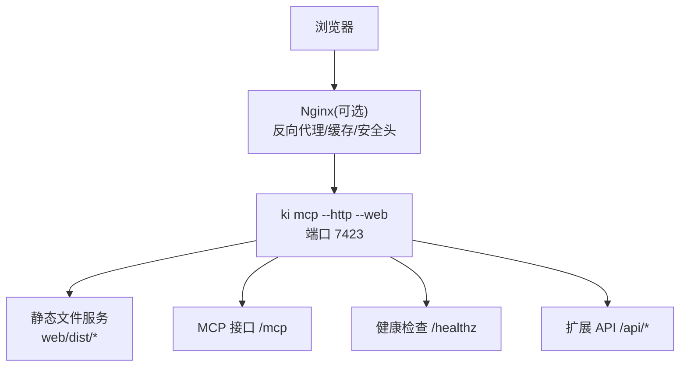
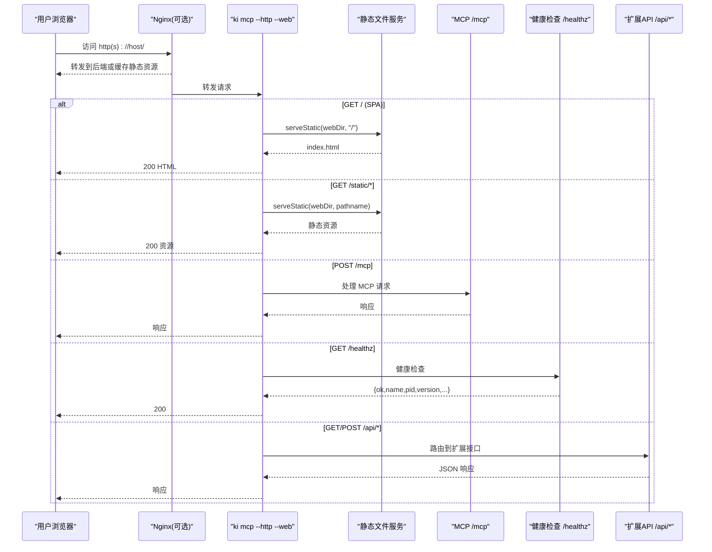
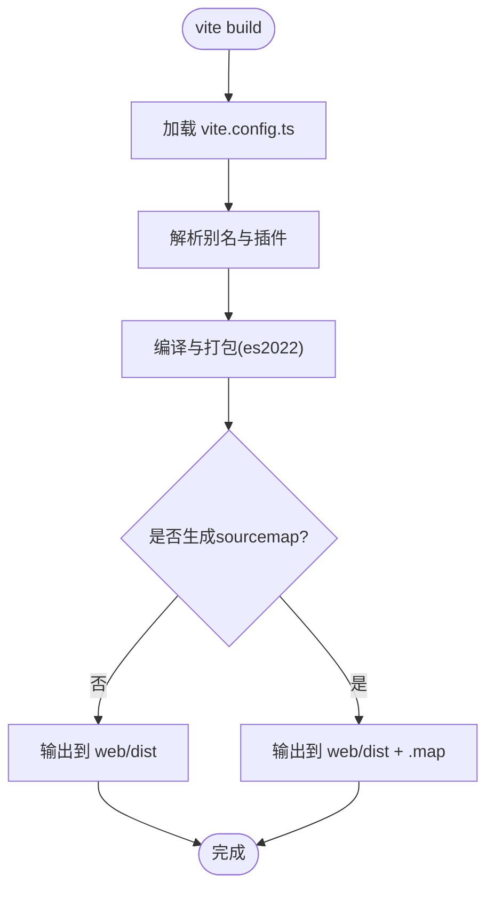
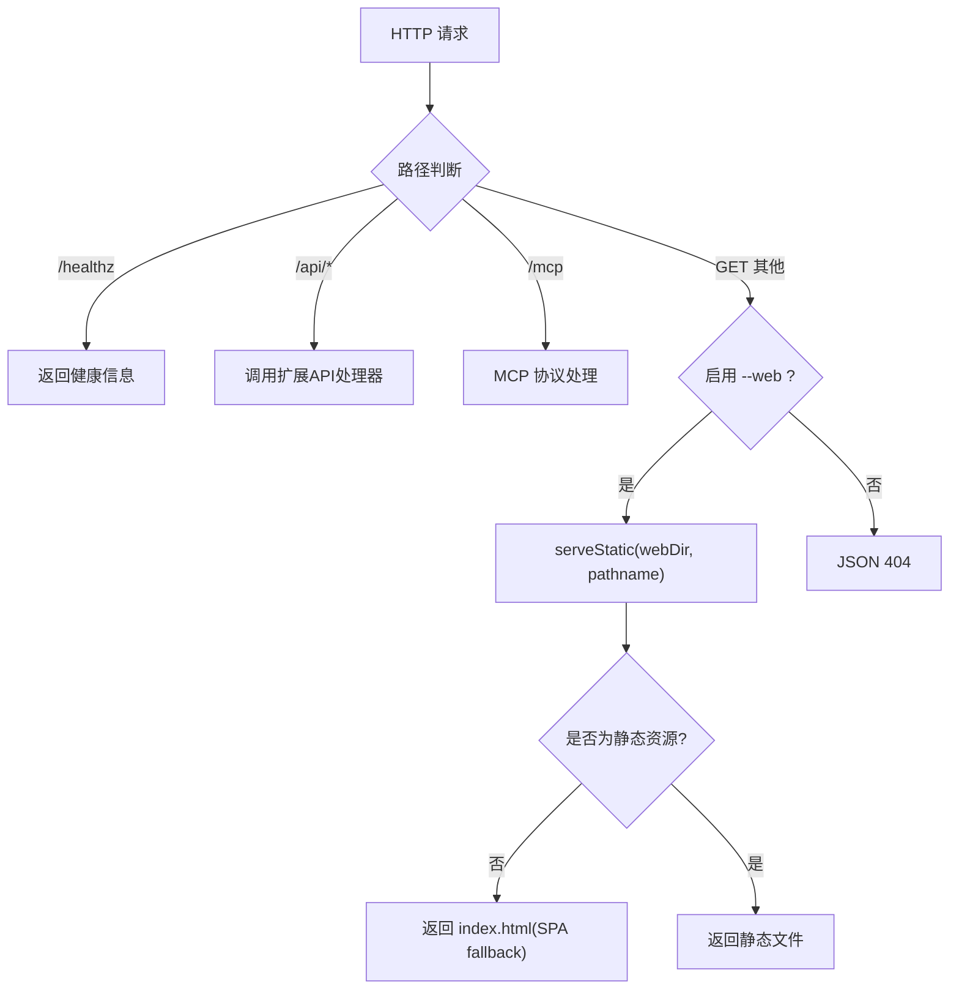
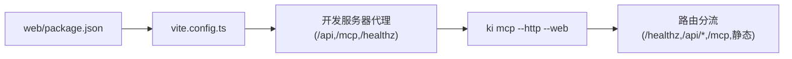

# 部署与配置

<cite>
**本文引用的文件**
- [web/vite.config.ts](file://web/vite.config.ts)
- [web/package.json](file://web/package.json)
- [web/index.html](file://web/index.html)
- [web/src/main.tsx](file://web/src/main.tsx)
- [web/src/App.tsx](file://web/src/App.tsx)
- [src/mcp-server.ts](file://src/mcp-server.ts)
- [src/lib/mcp-http.ts](file://src/lib/mcp-http.ts)
- [docs/cli.md](file://docs/cli.md)
</cite>

## 目录
1. [简介](#简介)
2. [项目结构](#项目结构)
3. [核心组件](#核心组件)
4. [架构总览](#架构总览)
5. [详细组件分析](#详细组件分析)
6. [依赖关系分析](#依赖关系分析)
7. [性能考虑](#性能考虑)
8. [故障排查指南](#故障排查指南)
9. [结论](#结论)
10. [附录](#附录)

## 简介
本文件面向生产环境下的 Web 前端部署与配置，覆盖 Vite 构建与环境变量、后端静态服务集成、Docker 容器化、Nginx 反向代理与静态资源优化、跨域与安全策略、性能监控与错误收集、常见问题排查与优化建议。该前端为独立 Vite 工程，构建产物位于 web/dist；后端通过 ki mcp --http --web 提供静态页面与 MCP/健康检查接口，默认同源访问以避免 CORS。

## 项目结构
- 前端工程位于 web 目录：
  - 入口 HTML：web/index.html
  - 构建配置：web/vite.config.ts（插件、别名、开发服务器代理、构建输出）
  - 包管理：web/package.json（脚本、依赖、开发依赖）
  - 应用根：web/src/main.tsx、web/src/App.tsx（React 启动、查询客户端与路由）
- 后端 HTTP 服务与静态页面能力：
  - 命令行入口与参数解析：src/mcp-server.ts
  - HTTP 路由与静态文件服务：src/lib/mcp-http.ts
- CLI 参考与配置优先级说明：docs/cli.md

图表来源
- [src/lib/mcp-http.ts:418-451](file://src/lib/mcp-http.ts#L418-L451)
- [src/mcp-server.ts:137-200](file://src/mcp-server.ts#L137-L200)

章节来源
- [web/vite.config.ts:1-30](file://web/vite.config.ts#L1-L30)
- [web/package.json:1-30](file://web/package.json#L1-L30)
- [web/index.html:1-14](file://web/index.html#L1-L14)
- [web/src/main.tsx:1-15](file://web/src/main.tsx#L1-L15)
- [web/src/App.tsx:1-33](file://web/src/App.tsx#L1-L33)
- [src/mcp-server.ts:137-200](file://src/mcp-server.ts#L137-L200)
- [src/lib/mcp-http.ts:418-451](file://src/lib/mcp-http.ts#L418-L451)
- [docs/cli.md:1-20](file://docs/cli.md#L1-L20)

## 核心组件
- Vite 构建与开发服务器
  - 插件：React
  - 路径别名：@ → src
  - 开发代理：/api、/mcp、/healthz → 本机 7423
  - 构建目标：es2022，关闭 sourcemap，输出到 dist
- 前端应用
  - React 根渲染、QueryClient 初始化、路由与 ScopeProvider
- 后端静态服务与路由
  - /healthz：免鉴权健康检查
  - /api/*：扩展接口（导入/健康/文档列表等），返回 JSON，不 fallback 到静态页
  - /mcp：MCP 协议端点
  - GET 其他路径：当启用 --web 时提供静态文件服务，并支持 SPA fallback

章节来源
- [web/vite.config.ts:7-28](file://web/vite.config.ts#L7-L28)
- [web/src/App.tsx:11-29](file://web/src/App.tsx#L11-L29)
- [src/lib/mcp-http.ts:418-451](file://src/lib/mcp-http.ts#L418-L451)

## 架构总览
下图展示从浏览器到后端的请求链路，包括 Nginx（可选）、ki mcp 静态服务、MCP 与 API 路由分流。

图表来源
- [src/lib/mcp-http.ts:418-451](file://src/lib/mcp-http.ts#L418-L451)
- [src/mcp-server.ts:137-200](file://src/mcp-server.ts#L137-L200)

## 详细组件分析

### Vite 构建与开发服务器
- 插件与别名：使用 React 插件，设置 @ 指向 src，便于统一导入。
- 开发服务器：
  - 监听 127.0.0.1:5173，严格端口模式
  - 将 /api、/mcp、/healthz 代理到本机 7423（ki mcp --http）
- 构建：
  - 输出目录 dist
  - 关闭 sourcemap
  - 目标 es2022

图表来源
- [web/vite.config.ts:7-28](file://web/vite.config.ts#L7-L28)

章节来源
- [web/vite.config.ts:7-28](file://web/vite.config.ts#L7-L28)
- [web/package.json:6-11](file://web/package.json#L6-L11)

### 后端静态服务与路由分流
- 路由规则：
  - /healthz：返回进程信息、版本、绑定地址、鉴权失败计数等
  - /api/*：调用扩展 API 处理器，未匹配返回 JSON 404（避免前端 JSON.parse 崩溃）
  - /mcp：MCP 协议端点
  - 其他 GET：若启用 --web，则提供静态文件服务，并对非静态资源进行 SPA fallback 到 index.html
- 安全与鉴权：
  - 非回环绑定时需鉴权（Bearer Token），本地回环来源可豁免
  - 支持 allowedHosts 白名单防护 DNS Rebinding
  - 会话空闲回收与最大会话数控制

图表来源
- [src/lib/mcp-http.ts:418-451](file://src/lib/mcp-http.ts#L418-L451)

章节来源
- [src/lib/mcp-http.ts:303-331](file://src/lib/mcp-http.ts#L303-L331)
- [src/lib/mcp-http.ts:418-451](file://src/lib/mcp-http.ts#L418-L451)
- [src/mcp-server.ts:137-200](file://src/mcp-server.ts#L137-L200)

### 前端应用与运行时
- React 根渲染：在 #root 挂载 App
- QueryClient：默认重试次数与窗口聚焦行为
- 路由与上下文：BrowserRouter、ScopeProvider

章节来源
- [web/src/main.tsx:1-15](file://web/src/main.tsx#L1-L15)
- [web/src/App.tsx:1-33](file://web/src/App.tsx#L1-L33)

## 依赖关系分析
- 前端依赖：React、React Router、TanStack Query、Markdown/Mermaid 渲染库等
- 构建工具：Vite 5、TypeScript、React 插件
- 后端依赖：MCP SDK、Node.js HTTP 服务、文件系统静态服务

图表来源
- [web/package.json:12-28](file://web/package.json#L12-L28)
- [web/vite.config.ts:14-22](file://web/vite.config.ts#L14-L22)
- [src/lib/mcp-http.ts:418-451](file://src/lib/mcp-http.ts#L418-L451)

章节来源
- [web/package.json:1-30](file://web/package.json#L1-L30)
- [web/vite.config.ts:1-30](file://web/vite.config.ts#L1-L30)
- [src/lib/mcp-http.ts:418-451](file://src/lib/mcp-http.ts#L418-L451)

## 性能考虑
- 构建优化
  - 目标 es2022，减少兼容代码体积
  - 关闭 sourcemap，减小产物体积
  - 合理拆分与懒加载（按需引入页面与组件）
- 静态资源优化
  - 开启 gzip/brotli 压缩（Nginx）
  - 长缓存与版本号命名（Vite 默认已对构建产物加哈希）
  - 图片与字体使用现代格式与合适尺寸
- 网络与缓存
  - Nginx 层设置 Cache-Control、ETag
  - 对大资源使用 CDN 或边缘缓存
- 服务端会话与资源
  - 限制最大会话数与会话空闲超时，避免资源泄漏
  - 定期清理空闲会话传输对象

[本节为通用指导，无需具体文件分析]

## 故障排查指南
- 无法访问前端页面
  - 确认已执行构建并存在 web/dist
  - 确认后端以 --web 模式启动，且 webDir 指向 web/dist
  - 检查 /healthz 是否正常返回
- 跨域问题
  - 推荐由 ki mcp --http --web 提供静态页面，前后端同源，天然规避 CORS
  - 若必须跨源，需在网关或后端显式配置 CORS（当前实现无内置 CORS 头）
- 鉴权失败
  - 非回环绑定需携带正确的 Bearer Token
  - 可通过 /healthz 中的 authFailures 字段观察鉴权失败次数
  - 注意 Token 大小写与完整复制
- 路由 404
  - /api/* 未匹配会返回 JSON 404，不会 fallback 到 index.html
  - 其他 GET 路径在 --web 模式下会 fallback 到 index.html
- 静态资源 404
  - 检查路径是否正确、是否存在于 web/dist
  - 确认 MIME 类型映射正确

章节来源
- [src/lib/mcp-http.ts:418-451](file://src/lib/mcp-http.ts#L418-L451)
- [src/mcp-server.ts:174-200](file://src/mcp-server.ts#L174-L200)

## 结论
本项目采用“Vite 构建 + 后端静态服务”的轻量部署方案。通过 ki mcp --http --web 在同一端口提供静态页面与 MCP/健康检查接口，天然规避跨域问题，简化运维。生产环境建议结合 Nginx 做反向代理、缓存与安全加固，并通过 /healthz 与鉴权日志进行可观测性建设。

[本节为总结性内容，无需具体文件分析]

## 附录

### 一、Vite 构建与环境变量
- 构建命令
  - 开发：npm run dev（启动开发服务器，代理 /api、/mcp、/healthz 到本机 7423）
  - 构建：npm run build（类型检查 + Vite 构建，输出到 web/dist）
  - 预览：npm run preview（本地预览构建产物）
- 环境变量
  - 当前前端工程未读取自定义环境变量；如需接入，可在 vite.config.ts 中通过 import.meta.env 注入并在构建期替换
  - 后端鉴权相关环境变量：KI_MCP_TOKEN（用于临时全权 Token）
- 构建产物
  - 输出目录：web/dist
  - 目标：es2022，关闭 sourcemap

章节来源
- [web/package.json:6-11](file://web/package.json#L6-L11)
- [web/vite.config.ts:14-28](file://web/vite.config.ts#L14-L28)
- [src/mcp-server.ts:164-180](file://src/mcp-server.ts#L164-L180)

### 二、生产环境部署步骤与最佳实践
- 构建前端
  - 安装依赖并执行 npm run build，确保 web/dist 存在
- 启动后端服务
  - 使用 ki mcp --http --web 启动，默认 127.0.0.1:7423
  - 如需对外暴露，请配合反向代理并启用鉴权（非回环绑定必须鉴权）
- 反向代理（Nginx）
  - 将 / 与 /static/* 指向后端静态资源
  - 将 /mcp 与 /api/* 透传到后端
  - 开启 gzip/brotli、Cache-Control、安全头（X-Frame-Options、CSP 等）
- 安全策略
  - 非回环绑定必须配置鉴权（Token）
  - 配置 allowedHosts 白名单，防止 DNS Rebinding
  - 仅开放必要端口，限制来源 IP
- 可观测性
  - 定期轮询 /healthz 获取 pid、version、authFailures 等
  - 集中采集 stderr 日志，关注鉴权失败与异常堆栈

章节来源
- [src/mcp-server.ts:137-200](file://src/mcp-server.ts#L137-L200)
- [src/lib/mcp-http.ts:418-451](file://src/lib/mcp-http.ts#L418-L451)

### 三、Docker 容器化部署
- 镜像选择
  - Node.js 镜像用于构建前端
  - 运行阶段可使用精简镜像承载 Nginx 与 ki 二进制
- 构建阶段
  - 安装依赖并执行 npm run build，产出 web/dist
- 运行阶段
  - 将 web/dist 复制到 Nginx 静态目录
  - 启动 ki mcp --http --web，并将 / 与 /api/*、/mcp 通过 Nginx 反向代理
- 配置与环境
  - 通过环境变量注入 KI_MCP_TOKEN
  - 通过配置文件或命令行参数调整 host/port/allowed-hosts
- 健康检查
  - 使用 /healthz 作为健康检查端点

[本节为通用指导，无需具体文件分析]

### 四、Nginx 反向代理与静态资源优化
- 反向代理
  - 将 /mcp 与 /api/* 代理到后端 7423
  - 将 / 与静态资源交由 Nginx 直接提供（提升性能）
- 缓存策略
  - 静态资源设置长期缓存与版本号
  - HTML 不缓存或短缓存
- 压缩与安全
  - 启用 gzip/brotli
  - 设置安全头（X-Content-Type-Options、X-Frame-Options、Referrer-Policy、CSP 等）
- 限流与访问控制
  - 对 /mcp 与 /api/* 进行速率限制与来源 IP 白名单

[本节为通用指导，无需具体文件分析]

### 五、跨域与安全策略
- 跨域
  - 推荐同源部署（前端由 ki mcp --http --web 提供），避免 CORS
  - 如必须跨源，需在网关或后端增加 CORS 响应头（当前实现未内置）
- 鉴权
  - 非回环绑定必须鉴权，推荐使用 Bearer Token
  - 支持临时全权 Token（环境变量 KI_MCP_TOKEN）或多 Token 存储
- 域名保护
  - 配置 allowedHosts 白名单，防止 DNS Rebinding
- 最小权限
  - 仅暴露必要端口与路径，限制来源 IP

章节来源
- [src/mcp-server.ts:174-200](file://src/mcp-server.ts#L174-L200)
- [src/lib/mcp-http.ts:303-331](file://src/lib/mcp-http.ts#L303-L331)

### 六、性能监控与错误收集
- 健康检查
  - 轮询 /healthz，记录 ok、pid、version、authFailures、host/port
- 日志
  - 集中采集 stderr，关注鉴权失败与异常堆栈
- 指标
  - 统计 /api/* 与 /mcp 的请求量、延迟、错误率
  - 监控静态资源命中率与带宽占用
- 错误上报
  - 前端可接入错误上报 SDK（如 Sentry），上报未捕获异常与 Promise 拒绝
  - 后端将关键错误写入 stderr，便于日志系统采集

[本节为通用指导，无需具体文件分析]

### 七、常见问题排查
- 构建失败
  - 检查 TypeScript 类型检查是否通过（npm run typecheck）
  - 检查依赖版本与 Node 版本兼容性
- 页面空白或路由 404
  - 确认 web/dist 存在且包含 index.html
  - 确认后端以 --web 模式启动
  - 检查 Nginx 是否正确代理 / 与静态资源
- 接口不可用
  - 检查 /healthz 是否返回正常
  - 检查鉴权 Token 是否正确
  - 检查 allowedHosts 是否放行当前 Host
- 性能问题
  - 检查静态资源是否被缓存与压缩
  - 检查会话空闲回收与最大会话数配置
  - 检查后端负载与资源使用

章节来源
- [web/package.json:6-11](file://web/package.json#L6-L11)
- [src/lib/mcp-http.ts:418-451](file://src/lib/mcp-http.ts#L418-L451)
- [src/mcp-server.ts:174-200](file://src/mcp-server.ts#L174-L200)

### 八、CLI 与配置参考
- 首次使用
  - 运行 ki config init 生成配置文件模板
- 配置优先级
  - 命令行 --config > 配置文件路径 > 内置默认值
- 常用命令
  - scan-kb import 导入知识库
  - search/store/sync-relation 等工具命令
- 注意事项
  - 环境变量 KI_DATA_DIR 不再作为运行时配置来源
  - 校验配置与依赖：ki doctor

章节来源
- [docs/cli.md:1-20](file://docs/cli.md#L1-L20)