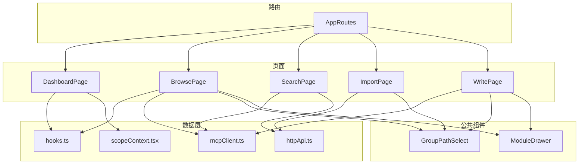
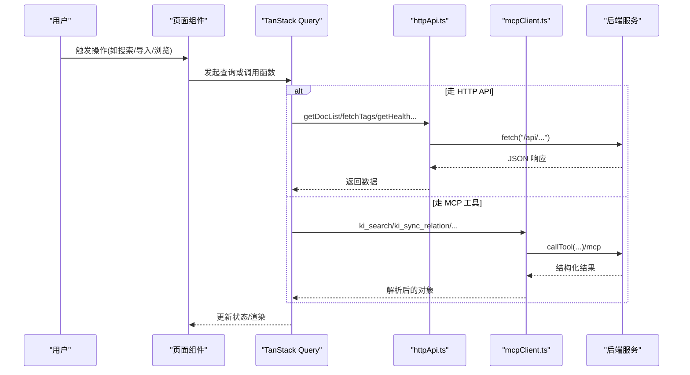
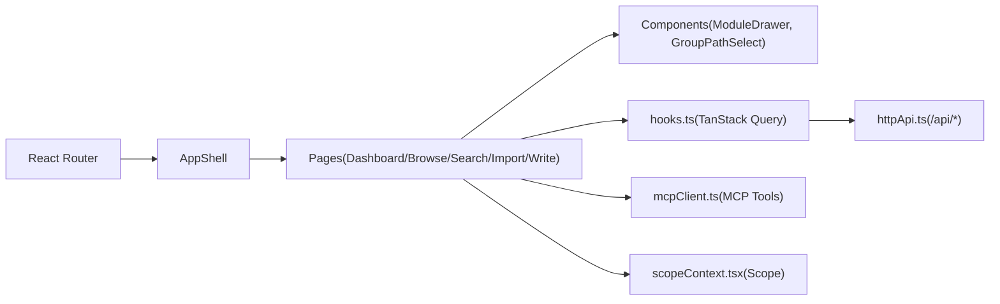
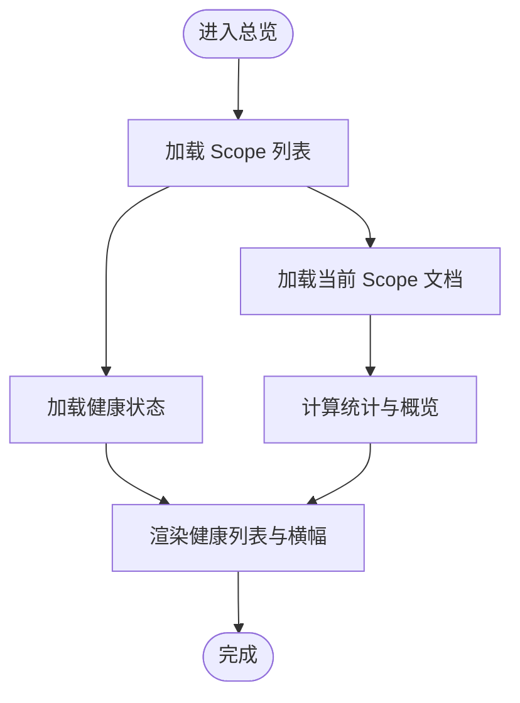
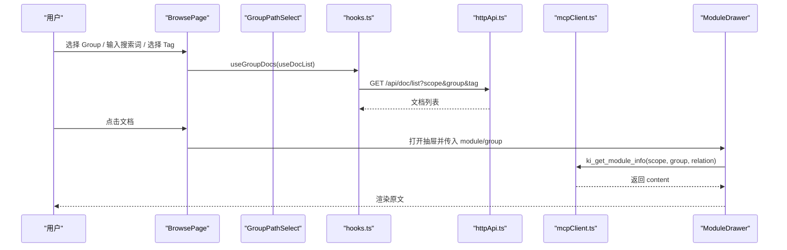
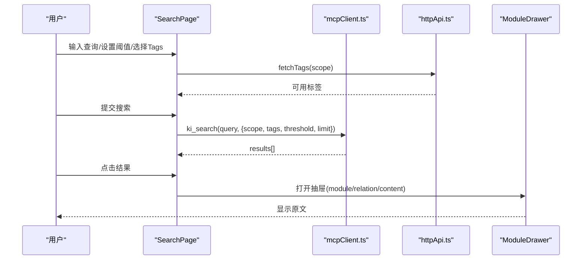
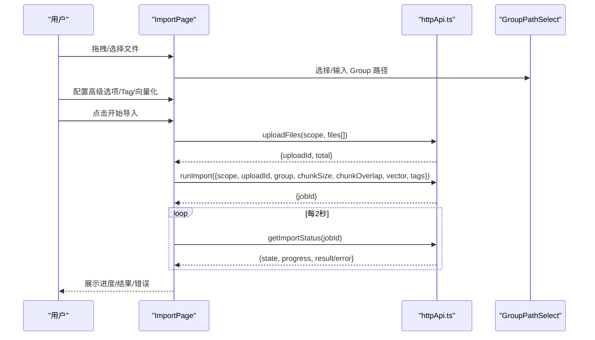
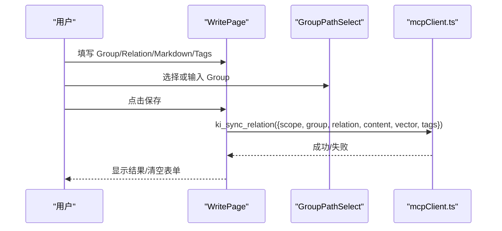
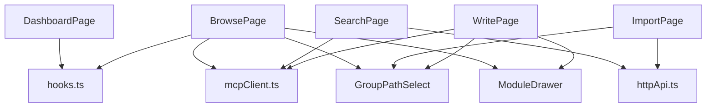

# 页面功能说明

<cite>
**本文引用的文件**
- [routes.tsx](file://web/src/router/routes.tsx)
- [DashboardPage.tsx](file://web/src/pages/DashboardPage.tsx)
- [BrowsePage.tsx](file://web/src/pages/BrowsePage.tsx)
- [SearchPage.tsx](file://web/src/pages/SearchPage.tsx)
- [ImportPage.tsx](file://web/src/pages/ImportPage.tsx)
- [WritePage.tsx](file://web/src/pages/WritePage.tsx)
- [ModuleDrawer.tsx](file://web/src/components/ModuleDrawer.tsx)
- [GroupPathSelect.tsx](file://web/src/components/GroupPathSelect.tsx)
- [mcpClient.ts](file://web/src/api/mcpClient.ts)
- [httpApi.ts](file://web/src/api/httpApi.ts)
- [hooks.ts](file://web/src/lib/hooks.ts)
- [scopeContext.tsx](file://web/src/lib/scopeContext.tsx)
</cite>

## 目录
1. [简介](#简介)
2. [项目结构](#项目结构)
3. [核心组件与数据流](#核心组件与数据流)
4. [架构总览](#架构总览)
5. [页面详解](#页面详解)
6. [依赖关系分析](#依赖关系分析)
7. [性能与可用性](#性能与可用性)
8. [故障排查](#故障排查)
9. [结论](#结论)
10. [附录：使用示例与最佳实践](#附录使用示例与最佳实践)

## 简介
本仓库的 Web 前端提供知识库管理的一站式界面，包含五大页面：
- 总览仪表盘（Dashboard）：展示服务健康、Scope 统计、当前 Scope 概览。
- 知识库浏览（Browse）：左侧 Group 树导航 + 右侧文档列表 + 原文抽屉查看。
- 语义搜索（Search）：向量+BM25 混合检索，支持阈值、限制、Tag 过滤，结果可定位原文。
- 导入（Import）：拖拽/选择文件或目录，上传后异步导入，支持切分参数、向量化开关、进度轮询。
- 写入（Write）：通过 sync-relation 直接写入 KB 与可选向量层，支持 Markdown 预览与 Tag 标注。

所有页面共享全局 Scope 上下文，并通过 MCP 工具与 HTTP API 与后端交互。

## 项目结构
前端采用 React + React Router + TanStack Query 组织路由与数据请求；页面按功能拆分到 pages，通用能力封装在 components、api、lib。

图表来源
- [routes.tsx:1-22](file://web/src/router/routes.tsx#L1-L22)
- [DashboardPage.tsx:1-227](file://web/src/pages/DashboardPage.tsx#L1-L227)
- [BrowsePage.tsx:1-400](file://web/src/pages/BrowsePage.tsx#L1-L400)
- [SearchPage.tsx:1-251](file://web/src/pages/SearchPage.tsx#L1-L251)
- [ImportPage.tsx:1-503](file://web/src/pages/ImportPage.tsx#L1-L503)
- [WritePage.tsx:1-325](file://web/src/pages/WritePage.tsx#L1-L325)
- [ModuleDrawer.tsx:1-174](file://web/src/components/ModuleDrawer.tsx#L1-L174)
- [GroupPathSelect.tsx:1-236](file://web/src/components/GroupPathSelect.tsx#L1-L236)
- [hooks.ts:1-53](file://web/src/lib/hooks.ts#L1-L53)
- [mcpClient.ts:1-175](file://web/src/api/mcpClient.ts#L1-L175)
- [httpApi.ts:1-189](file://web/src/api/httpApi.ts#L1-L189)
- [scopeContext.tsx:1-56](file://web/src/lib/scopeContext.tsx#L1-L56)

章节来源
- [routes.tsx:1-22](file://web/src/router/routes.tsx#L1-L22)

## 核心组件与数据流
- 全局 Scope：通过 Context 提供并持久化到 localStorage，所有页面通过 useScopeValue 获取当前 scope。
- 数据获取：统一通过 hooks.ts 封装的 TanStack Query hooks，缓存策略避免重复请求。
- 通信通道：
  - MCP 工具：ki_search、ki_get_module_info、ki_sync_relation、ki_store、ki_scope_list 等，经 StreamableHTTPClientTransport 调用 /mcp。
  - HTTP API：/api/doc/list、/api/import/upload、/api/import/run、/api/import/status、/api/tags、/api/health 等。

图表来源
- [hooks.ts:1-53](file://web/src/lib/hooks.ts#L1-L53)
- [httpApi.ts:95-189](file://web/src/api/httpApi.ts#L95-L189)
- [mcpClient.ts:53-175](file://web/src/api/mcpClient.ts#L53-L175)

章节来源
- [scopeContext.tsx:1-56](file://web/src/lib/scopeContext.tsx#L1-L56)
- [hooks.ts:1-53](file://web/src/lib/hooks.ts#L1-L53)
- [mcpClient.ts:1-175](file://web/src/api/mcpClient.ts#L1-L175)
- [httpApi.ts:1-189](file://web/src/api/httpApi.ts#L1-L189)

## 架构总览
- 路由层：React Router 定义根路由与子路由，统一包裹 AppShell。
- 页面层：各 Page 负责 UI 与交互，组合通用组件与数据钩子。
- 组件层：ModuleDrawer 用于原文查看，GroupPathSelect 用于 Group 路径选择。
- 数据层：hooks.ts 封装查询；mcpClient.ts 封装 MCP 工具；httpApi.ts 封装 REST 接口。
- 状态层：scopeContext 提供跨页面共享的 Scope。

图表来源
- [routes.tsx:1-22](file://web/src/router/routes.tsx#L1-L22)
- [hooks.ts:1-53](file://web/src/lib/hooks.ts#L1-L53)
- [httpApi.ts:1-189](file://web/src/api/httpApi.ts#L1-L189)
- [mcpClient.ts:1-175](file://web/src/api/mcpClient.ts#L1-L175)
- [scopeContext.tsx:1-56](file://web/src/lib/scopeContext.tsx#L1-L56)

## 页面详解

### DashboardPage（总览仪表盘）
- 核心功能
  - 显示服务健康横幅与健康列表（pass/warn/fail）。
  - 统计卡片：Scopes 数量、KB 文档总数、向量层数量、注册数量。
  - 当前 Scope 概览：文档数、Groups 数、KB/向量层状态。
  - Scopes 表格：每个 Scope 的层状态与文档数。
- 数据流
  - 使用 useScopeList 获取所有 Scope 元信息。
  - 使用 useHealth 获取健康报告。
  - 使用 useDocList(scope) 获取当前 Scope 文档列表以计算 Groups 数。
- 交互流程
  - 切换顶部 Scope 时，useDocList 自动刷新当前 Scope 概览。
  - 无数据时引导前往导入页。

图表来源
- [DashboardPage.tsx:67-227](file://web/src/pages/DashboardPage.tsx#L67-L227)
- [hooks.ts:14-41](file://web/src/lib/hooks.ts#L14-L41)

章节来源
- [DashboardPage.tsx:1-227](file://web/src/pages/DashboardPage.tsx#L1-L227)
- [hooks.ts:14-41](file://web/src/lib/hooks.ts#L14-L41)

### BrowsePage（知识库浏览）
- 核心功能
  - 左侧递归 Group 树：支持展开/折叠全部、默认展开一级。
  - 右侧文档列表：支持文件名/路径模糊搜索、Tag 过滤、选择 Group 精确查看。
  - 原文查看：点击文档打开 ModuleDrawer 查看原文。
- 数据流
  - useDocList(scope) 获取全量文档与 groups、tags。
  - useGroupDocs(scope, group, tag) 获取指定 Group 完整文档（不受分页截断影响）。
  - 全局搜索使用自定义 query 调用 getDocList(scope, {q, tag})。
- 交互流程
  - 点击父目录仅展开/折叠；点击叶子 Group 选中并拉取该组文档。
  - 输入搜索词触发后端 q 参数搜索，结果覆盖当前列表。
  - 选择 Tag 下拉进行 KB 层 tag 过滤。

图表来源
- [BrowsePage.tsx:86-400](file://web/src/pages/BrowsePage.tsx#L86-L400)
- [GroupPathSelect.tsx:120-236](file://web/src/components/GroupPathSelect.tsx#L120-L236)
- [hooks.ts:33-53](file://web/src/lib/hooks.ts#L33-L53)
- [httpApi.ts:119-130](file://web/src/api/httpApi.ts#L119-L130)
- [mcpClient.ts:138-144](file://web/src/api/mcpClient.ts#L138-L144)
- [ModuleDrawer.tsx:18-44](file://web/src/components/ModuleDrawer.tsx#L18-L44)

章节来源
- [BrowsePage.tsx:1-400](file://web/src/pages/BrowsePage.tsx#L1-L400)
- [GroupPathSelect.tsx:1-236](file://web/src/components/GroupPathSelect.tsx#L1-L236)
- [hooks.ts:33-53](file://web/src/lib/hooks.ts#L33-L53)
- [httpApi.ts:119-130](file://web/src/api/httpApi.ts#L119-L130)
- [mcpClient.ts:138-144](file://web/src/api/mcpClient.ts#L138-L144)
- [ModuleDrawer.tsx:1-174](file://web/src/components/ModuleDrawer.tsx#L1-L174)

### SearchPage（语义搜索）
- 核心功能
  - 自然语言查询，支持阈值调节、结果条数限制、Tag 多选过滤。
  - 结果展示：命中分数、Group/Relation、原文片段、向量标识。
  - 点击结果打开 ModuleDrawer 查看原文。
- 数据流
  - 调用 ki_search（include_original: true），根据 selectedTags 决定过滤范围。
  - 首次加载通过 fetchTags 获取可用标签列表。
- 交互流程
  - 提交表单触发搜索，loading 态禁用按钮。
  - 错误处理：后端业务错误（如向量库锁定）会显示错误提示。

图表来源
- [SearchPage.tsx:26-251](file://web/src/pages/SearchPage.tsx#L26-L251)
- [mcpClient.ts:124-136](file://web/src/api/mcpClient.ts#L124-L136)
- [httpApi.ts:184-188](file://web/src/api/httpApi.ts#L184-L188)
- [ModuleDrawer.tsx:18-44](file://web/src/components/ModuleDrawer.tsx#L18-L44)

章节来源
- [SearchPage.tsx:1-251](file://web/src/pages/SearchPage.tsx#L1-L251)
- [mcpClient.ts:124-136](file://web/src/api/mcpClient.ts#L124-L136)
- [httpApi.ts:184-188](file://web/src/api/httpApi.ts#L184-L188)
- [ModuleDrawer.tsx:1-174](file://web/src/components/ModuleDrawer.tsx#L1-L174)

### ImportPage（外部导入）
- 核心功能
  - 拖拽/选择文件或目录，支持 .md/.markdown/.mdx，单文件 ≤ 1MB。
  - 高级选项：Chunk Size、Chunk Overlap、向量化开关。
  - 异步导入：上传 → 触发导入 → 轮询状态 → 展示进度与结果。
  - Tag 标注：对整批导入文件生效，支持已有标签选择与新建。
- 数据流
  - uploadFiles 将文件内容 base64 编码后上传，返回 uploadId。
  - runImport 启动导入任务，getImportStatus 每 2s 轮询直至 done/failed。
  - GroupPathSelect 校验 Group 路径格式。
- 交互流程
  - 选择文件/目录后显示清单，可移除。
  - 开始导入后进入 importing 阶段，完成后跳转“前往搜索验证”。

图表来源
- [ImportPage.tsx:21-503](file://web/src/pages/ImportPage.tsx#L21-L503)
- [httpApi.ts:132-168](file://web/src/api/httpApi.ts#L132-L168)
- [GroupPathSelect.tsx:120-236](file://web/src/components/GroupPathSelect.tsx#L120-L236)

章节来源
- [ImportPage.tsx:1-503](file://web/src/pages/ImportPage.tsx#L1-L503)
- [httpApi.ts:132-168](file://web/src/api/httpApi.ts#L132-L168)
- [GroupPathSelect.tsx:1-236](file://web/src/components/GroupPathSelect.tsx#L1-L236)

### WritePage（知识写入）
- 核心功能
  - 通过 ki_sync_relation 写入 KB（relations-cache + local KB），可选向量化。
  - Markdown 编辑器与实时预览。
  - Tag 标注：支持选择已有标签或新建，写入时携带。
- 数据流
  - 提交前进行 Group/Relation 格式校验。
  - 调用 ki_sync_relation 成功后清空表单并提示结果。
- 交互流程
  - 填写 Group、Relation、Markdown 正文，选择 Tags，决定是否向量化。
  - 保存后显示成功消息；失败则显示错误。

图表来源
- [WritePage.tsx:17-325](file://web/src/pages/WritePage.tsx#L17-L325)
- [mcpClient.ts:158-174](file://web/src/api/mcpClient.ts#L158-L174)
- [GroupPathSelect.tsx:120-236](file://web/src/components/GroupPathSelect.tsx#L120-L236)

章节来源
- [WritePage.tsx:1-325](file://web/src/pages/WritePage.tsx#L1-L325)
- [mcpClient.ts:158-174](file://web/src/api/mcpClient.ts#L158-L174)
- [GroupPathSelect.tsx:1-236](file://web/src/components/GroupPathSelect.tsx#L1-L236)

## 依赖关系分析
- 页面与数据源耦合度低：通过 hooks.ts 抽象数据获取，页面只关注 UI 与交互。
- 组件复用度高：ModuleDrawer、GroupPathSelect 被多个页面复用，降低重复实现。
- 外部依赖：
  - @tanstack/react-query：缓存与重试控制。
  - @modelcontextprotocol/sdk：浏览器端 MCP 客户端。
  - React Router：路由与导航。
- 潜在循环依赖：未发现明显循环引用，页面依赖组件与数据层，组件不反向依赖页面。

图表来源
- [BrowsePage.tsx:1-400](file://web/src/pages/BrowsePage.tsx#L1-L400)
- [SearchPage.tsx:1-251](file://web/src/pages/SearchPage.tsx#L1-L251)
- [ImportPage.tsx:1-503](file://web/src/pages/ImportPage.tsx#L1-L503)
- [WritePage.tsx:1-325](file://web/src/pages/WritePage.tsx#L1-L325)
- [hooks.ts:1-53](file://web/src/lib/hooks.ts#L1-L53)
- [mcpClient.ts:1-175](file://web/src/api/mcpClient.ts#L1-L175)
- [httpApi.ts:1-189](file://web/src/api/httpApi.ts#L1-L189)
- [GroupPathSelect.tsx:1-236](file://web/src/components/GroupPathSelect.tsx#L1-L236)
- [ModuleDrawer.tsx:1-174](file://web/src/components/ModuleDrawer.tsx#L1-L174)

章节来源
- [BrowsePage.tsx:1-400](file://web/src/pages/BrowsePage.tsx#L1-L400)
- [SearchPage.tsx:1-251](file://web/src/pages/SearchPage.tsx#L1-L251)
- [ImportPage.tsx:1-503](file://web/src/pages/ImportPage.tsx#L1-L503)
- [WritePage.tsx:1-325](file://web/src/pages/WritePage.tsx#L1-L325)
- [hooks.ts:1-53](file://web/src/lib/hooks.ts#L1-L53)
- [mcpClient.ts:1-175](file://web/src/api/mcpClient.ts#L1-L175)
- [httpApi.ts:1-189](file://web/src/api/httpApi.ts#L1-L189)
- [GroupPathSelect.tsx:1-236](file://web/src/components/GroupPathSelect.tsx#L1-L236)
- [ModuleDrawer.tsx:1-174](file://web/src/components/ModuleDrawer.tsx#L1-L174)

## 性能与可用性
- 数据缓存：TanStack Query 的 staleTime 与 retry 策略减少重复请求，提升首屏与交互流畅性。
- 分组优化：Browse 中 useGroupDocs 针对单个 Group 拉取完整文档，避免 500 条分页截断影响。
- 搜索优化：Search 支持 threshold 与 limit 控制，减少不必要的数据传输。
- 导入体验：Import 使用异步任务与轮询，避免阻塞 UI；大文件上传采用 base64 文本传输，注意大小限制。
- 可用性：
  - 空状态与骨架屏提升感知速度。
  - 错误提示清晰，支持 ESC 关闭抽屉、复制失败回退。
  - GroupPathSelect 支持新建与已有路径选择，降低误输成本。

[本节为通用指导，无需具体文件引用]

## 故障排查
- 搜索失败：检查网络与后端服务状态，确认向量库是否锁定；查看 SearchPage 的错误提示区域。
- 导入失败：确认文件类型与大小限制；检查 Group 路径格式；查看轮询状态与错误信息。
- 原文无法加载：ModuleDrawer 可能未找到 content；检查 Group/Relation 是否正确；尝试重新拉取。
- 标签不可用：确保已导入或写入带标签的内容；检查 /api/tags 返回。

章节来源
- [SearchPage.tsx:49-79](file://web/src/pages/SearchPage.tsx#L49-L79)
- [ImportPage.tsx:91-116](file://web/src/pages/ImportPage.tsx#L91-L116)
- [ModuleDrawer.tsx:33-44](file://web/src/components/ModuleDrawer.tsx#L33-L44)
- [httpApi.ts:184-188](file://web/src/api/httpApi.ts#L184-L188)

## 结论
本前端以清晰的页面职责划分、统一的上下文与数据层设计，实现了知识库的总览、浏览、搜索、导入与写入闭环。通过组件复用与缓存策略，兼顾了性能与用户体验。后续可扩展更多筛选维度、批量操作与导出能力。

[本节为总结，无需具体文件引用]

## 附录：使用示例与最佳实践
- 总览仪表盘
  - 首次进入查看服务健康与 Scope 统计；切换 Scope 即时刷新当前概览。
  - 若无知识库，点击“上传文档”跳转到导入页。
- 知识库浏览
  - 左侧选择 Group 快速定位文档；使用文件名/路径搜索与 Tag 过滤缩小范围。
  - 点击文档打开原文抽屉，必要时全屏查看与复制。
- 语义搜索
  - 输入自然语言查询，适当调整阈值与 Limit；选择 Tag 精准过滤。
  - 结果点击定位原文，结合 Group/Relation 理解上下文。
- 导入
  - 推荐先选择 Group 路径再上传，便于归档；合理设置 Chunk 参数平衡检索质量与性能。
  - 开启向量化后可立即在搜索页验证；失败时查看轮询错误并修正。
- 写入
  - 使用 GroupPathSelect 选择或新建 Group；Relation 在同组内唯一。
  - 建议开启向量化以便语义检索；添加合适 Tag 便于后续过滤。

章节来源
- [DashboardPage.tsx:170-181](file://web/src/pages/DashboardPage.tsx#L170-L181)
- [BrowsePage.tsx:320-351](file://web/src/pages/BrowsePage.tsx#L320-L351)
- [SearchPage.tsx:116-158](file://web/src/pages/SearchPage.tsx#L116-L158)
- [ImportPage.tsx:271-280](file://web/src/pages/ImportPage.tsx#L271-L280)
- [WritePage.tsx:138-165](file://web/src/pages/WritePage.tsx#L138-L165)