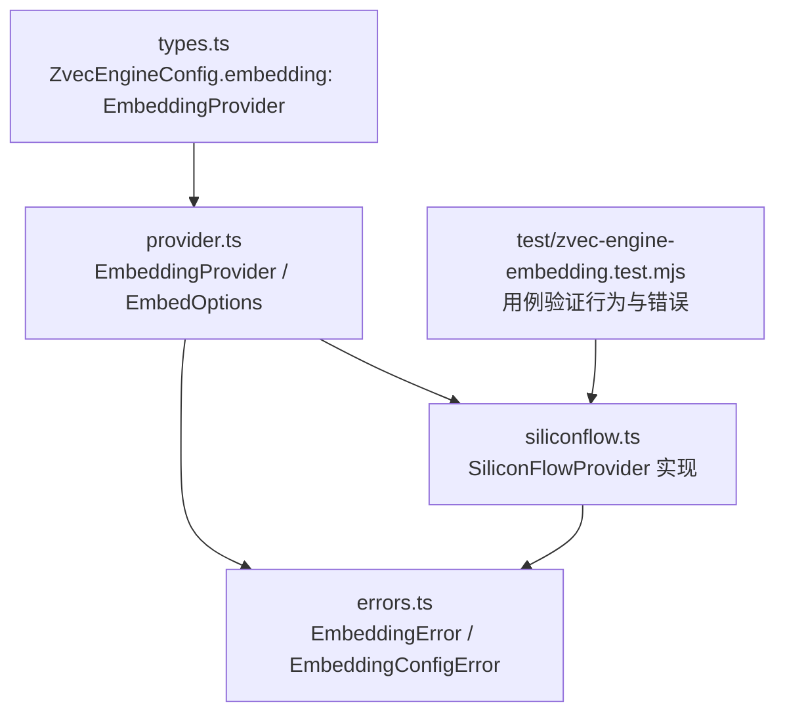
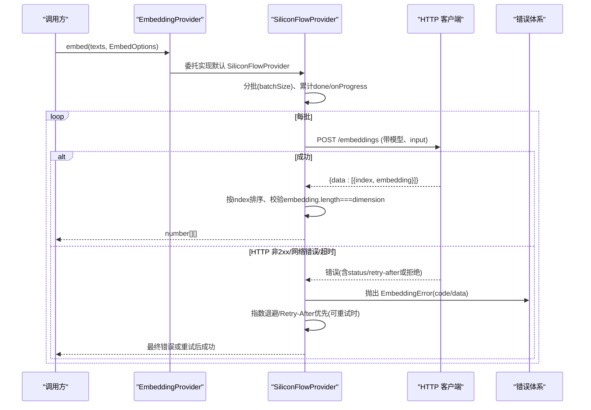
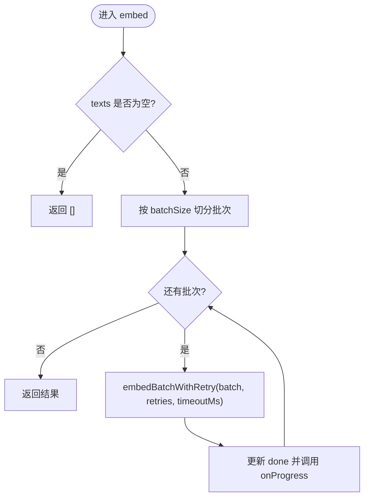
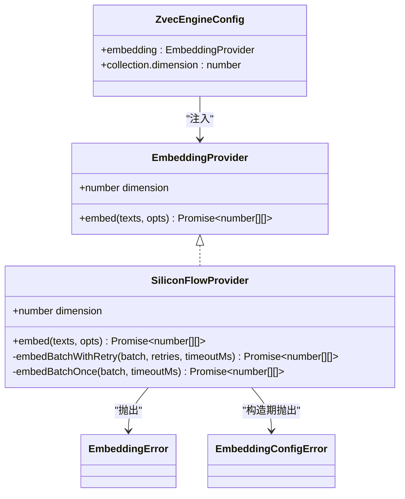

# EmbeddingProvider接口定义

<cite>
**本文引用的文件**
- [src/zvec-engine/embedding/provider.ts](file://src/zvec-engine/embedding/provider.ts)
- [src/zvec-engine/embedding/siliconflow.ts](file://src/zvec-engine/embedding/siliconflow.ts)
- [src/zvec-engine/errors.ts](file://src/zvec-engine/errors.ts)
- [src/zvec-engine/types.ts](file://src/zvec-engine/types.ts)
- [test/zvec-engine-embedding.test.mjs](file://test/zvec-engine-embedding.test.mjs)
</cite>

## 目录
1. [简介](#简介)
2. [项目结构](#项目结构)
3. [核心组件](#核心组件)
4. [架构总览](#架构总览)
5. [详细组件分析](#详细组件分析)
6. [依赖关系分析](#依赖关系分析)
7. [性能考虑](#性能考虑)
8. [故障排查指南](#故障排查指南)
9. [结论](#结论)
10. [附录：实现示例与最佳实践](#附录：实现示例与最佳实践)

## 简介
本文件围绕 EmbeddingProvider 抽象接口进行系统化说明，涵盖设计理念、embed() 方法契约、EmbedOptions 配置项（retries、batchSize、timeoutMs、onProgress）的使用方式、dimension 属性与 ZvecEngineConfig.collection.dimension 的关联约束、错误处理机制（尤其是 EmbeddingError 的抛出时机与携带信息），并提供基于 SiliconFlowProvider 的实现参考与最佳实践建议。

## 项目结构
与 EmbeddingProvider 直接相关的代码位于 zvec-engine 子模块中：
- provider.ts：定义 EmbeddingProvider 接口与 EmbedOptions 类型
- siliconflow.ts：提供 EmbeddingProvider 的具体实现（SiliconFlowProvider）
- errors.ts：定义 EmbeddingError、EmbeddingConfigError 等异常类型
- types.ts：定义 ZvecEngineConfig，其中 embedding 字段要求传入 EmbeddingProvider，且 collection.dimension 需与 Provider 的 dimension 一致
- test/zvec-engine-embedding.test.mjs：对 EmbeddingProvider 行为与错误路径的测试用例

图表来源
- [src/zvec-engine/types.ts:41-53](file://src/zvec-engine/types.ts#L41-L53)
- [src/zvec-engine/embedding/provider.ts:9-28](file://src/zvec-engine/embedding/provider.ts#L9-L28)
- [src/zvec-engine/embedding/siliconflow.ts:43-202](file://src/zvec-engine/embedding/siliconflow.ts#L43-L202)
- [src/zvec-engine/errors.ts:56-62](file://src/zvec-engine/errors.ts#L56-L62)
- [test/zvec-engine-embedding.test.mjs:85-197](file://test/zvec-engine-embedding.test.mjs#L85-L197)

章节来源
- [src/zvec-engine/types.ts:41-53](file://src/zvec-engine/types.ts#L41-L53)
- [src/zvec-engine/embedding/provider.ts:9-28](file://src/zvec-engine/embedding/provider.ts#L9-L28)
- [src/zvec-engine/embedding/siliconflow.ts:43-202](file://src/zvec-engine/embedding/siliconflow.ts#L43-L202)
- [src/zvec-engine/errors.ts:56-62](file://src/zvec-engine/errors.ts#L56-L62)
- [test/zvec-engine-embedding.test.mjs:85-197](file://test/zvec-engine-embedding.test.mjs#L85-L197)

## 核心组件
- EmbeddingProvider 接口：定义维度属性 dimension 与 embed(texts, opts?) 方法契约
- EmbedOptions 配置：retries、batchSize、timeoutMs、onProgress
- SiliconFlowProvider：OpenAI 兼容的 EmbeddingProvider 参考实现，包含重试、分批、超时、进度回调、维度校验与错误分类
- 错误体系：EmbeddingError（运行时错误）、EmbeddingConfigError（构造期配置错误）

章节来源
- [src/zvec-engine/embedding/provider.ts:9-28](file://src/zvec-engine/embedding/provider.ts#L9-L28)
- [src/zvec-engine/embedding/siliconflow.ts:43-202](file://src/zvec-engine/embedding/siliconflow.ts#L43-L202)
- [src/zvec-engine/errors.ts:56-62](file://src/zvec-engine/errors.ts#L56-L62)

## 架构总览
EmbeddingProvider 作为向量嵌入能力的抽象，被 ZvecEngineConfig.embedding 注入使用。调用方通过 embed() 将文本批量转换为向量，返回结果长度与输入 texts 一致，每条向量长度为 dimension。实现层负责网络请求、重试、超时、进度上报以及响应数据的顺序对齐与维度校验。

图表来源
- [src/zvec-engine/embedding/siliconflow.ts:77-202](file://src/zvec-engine/embedding/siliconflow.ts#L77-L202)
- [src/zvec-engine/errors.ts:56-62](file://src/zvec-engine/errors.ts#L56-L62)
- [test/zvec-engine-embedding.test.mjs:107-197](file://test/zvec-engine-embedding.test.mjs#L107-L197)

## 详细组件分析

### EmbeddingProvider 接口设计
- 设计理念
  - 解耦：上层引擎不关心具体嵌入服务实现，仅依赖统一接口
  - 可替换：不同后端（如 OpenAI 兼容、私有部署）均可实现该接口
  - 可观测：通过 onProgress 暴露批次完成进度
  - 健壮性：通过 EmbedOptions 控制重试、分批、超时，降低外部依赖不稳定影响
- 关键成员
  - dimension：只读属性，必须与 ZvecEngineConfig.collection.dimension 严格相等，保证向量维度一致性
  - embed(texts, opts?)：将字符串数组转为二维数字数组；返回长度等于 texts 长度，每个向量长度为 dimension；小批失败时抛出 EmbeddingError，并携带该批范围信息

章节来源
- [src/zvec-engine/embedding/provider.ts:9-28](file://src/zvec-engine/embedding/provider.ts#L9-L28)
- [src/zvec-engine/types.ts:41-53](file://src/zvec-engine/types.ts#L41-L53)

### EmbedOptions 配置详解
- retries：失败重试次数，默认值由实现决定（参考实现为 3）。用于应对临时性错误（如 5xx、429、网络抖动）
- batchSize：分批大小，默认值由实现决定（参考实现为 64）。避免触发服务端限流，失败粒度以“小批”为单位
- timeoutMs：单批请求超时时间，默认值由实现决定（参考实现为 30000ms）。超过后将抛出 EmbeddingError(code=TIMEOUT)
- onProgress(done, total)：进度回调，在每批完成后调用；若回调抛错会被静默捕获，不影响主流程

章节来源
- [src/zvec-engine/embedding/provider.ts:9-18](file://src/zvec-engine/embedding/provider.ts#L9-L18)
- [src/zvec-engine/embedding/siliconflow.ts:77-102](file://src/zvec-engine/embedding/siliconflow.ts#L77-L102)
- [test/zvec-engine-embedding.test.mjs:85-97](file://test/zvec-engine-embedding.test.mjs#L85-L97)

### dimension 属性与集合维度的关联
- 作用：确保嵌入向量与集合 schema 的维度一致，避免写入或检索阶段出现维度不匹配错误
- 约束：EmbeddingProvider.dimension 必须等于 ZvecEngineConfig.collection.dimension；不一致将在后续写入或检索时被检测并报错
- 参考实现：SiliconFlowProvider 在构造时设置 dimension，并在响应解析时对每条 embedding 的长度进行校验，不符则抛出 EmbeddingError(nonRetryable=true)

章节来源
- [src/zvec-engine/embedding/provider.ts:20-22](file://src/zvec-engine/embedding/provider.ts#L20-L22)
- [src/zvec-engine/types.ts:41-53](file://src/zvec-engine/types.ts#L41-L53)
- [src/zvec-engine/embedding/siliconflow.ts:58-74](file://src/zvec-engine/embedding/siliconflow.ts#L58-L74)
- [src/zvec-engine/embedding/siliconflow.ts:170-184](file://src/zvec-engine/embedding/siliconflow.ts#L170-L184)

### 错误处理机制
- 错误类型
  - EmbeddingConfigError：构造期配置错误（如缺少 apiKey、baseURL 非 https、dimension 非法）
  - EmbeddingError：运行期错误（HTTP 状态码、网络错误、超时、响应结构异常、维度不匹配等）
- 抛出时机
  - 构造期：参数校验失败立即抛出 EmbeddingConfigError
  - 请求期：HTTP 非 2xx、网络错误、AbortError（超时）均抛出 EmbeddingError，并附带 code 与 data
  - 响应期：data 数量不匹配、embedding 非数组、embedding 维度不匹配抛出 EmbeddingError(nonRetryable=true)
- 可重试策略
  - 可重试：5xx、429（优先使用 Retry-After）、NETWORK、TIMEOUT
  - 不可重试：4xx（非 429）、响应结构错误、维度不匹配（nonRetryable=true）
- 错误数据结构
  - code：错误类别标识（如 HTTP_401、TIMEOUT、NETWORK）
  - data：附加信息（如 status、nonRetryable、retryAfterMs、expectedDim、actualDim）

章节来源
- [src/zvec-engine/errors.ts:56-62](file://src/zvec-engine/errors.ts#L56-L62)
- [src/zvec-engine/embedding/siliconflow.ts:130-202](file://src/zvec-engine/embedding/siliconflow.ts#L130-L202)
- [test/zvec-engine-embedding.test.mjs:107-197](file://test/zvec-engine-embedding.test.mjs#L107-L197)

### 实现参考：SiliconFlowProvider
- 能力要点
  - 支持 OpenAI 兼容 /embeddings 端点
  - 自动分批、进度回调、指数退避与 Retry-After 优先
  - 响应乱序按 index 排序对齐
  - 严格校验 embedding 维度与数量
- 关键流程
  - embed：循环分批，逐批调用 embedBatchWithRetry，累计 done 并调用 onProgress
  - embedBatchWithRetry：最多尝试 retries+1 次，遇到可重试错误等待退避后重试
  - embedBatchOnce：发起 HTTP 请求，处理超时 AbortController，解析响应并校验

图表来源
- [src/zvec-engine/embedding/siliconflow.ts:77-102](file://src/zvec-engine/embedding/siliconflow.ts#L77-L102)
- [src/zvec-engine/embedding/siliconflow.ts:104-128](file://src/zvec-engine/embedding/siliconflow.ts#L104-L128)

章节来源
- [src/zvec-engine/embedding/siliconflow.ts:43-202](file://src/zvec-engine/embedding/siliconflow.ts#L43-L202)
- [test/zvec-engine-embedding.test.mjs:85-197](file://test/zvec-engine-embedding.test.mjs#L85-L197)

## 依赖关系分析
- EmbeddingProvider 被 ZvecEngineConfig.embedding 注入，形成“引擎—提供者”松耦合关系
- SiliconFlowProvider 依赖错误体系（EmbeddingError/EmbeddingConfigError）进行结构化错误上报
- 测试通过 mock fetch 覆盖正常路径、重试路径、超时与维度不匹配等异常路径

图表来源
- [src/zvec-engine/embedding/provider.ts:20-28](file://src/zvec-engine/embedding/provider.ts#L20-L28)
- [src/zvec-engine/embedding/siliconflow.ts:43-202](file://src/zvec-engine/embedding/siliconflow.ts#L43-L202)
- [src/zvec-engine/errors.ts:56-62](file://src/zvec-engine/errors.ts#L56-L62)
- [src/zvec-engine/types.ts:41-53](file://src/zvec-engine/types.ts#L41-L53)

章节来源
- [src/zvec-engine/types.ts:41-53](file://src/zvec-engine/types.ts#L41-L53)
- [src/zvec-engine/embedding/provider.ts:20-28](file://src/zvec-engine/embedding/provider.ts#L20-L28)
- [src/zvec-engine/embedding/siliconflow.ts:43-202](file://src/zvec-engine/embedding/siliconflow.ts#L43-L202)
- [src/zvec-engine/errors.ts:56-62](file://src/zvec-engine/errors.ts#L56-L62)

## 性能考虑
- 分批大小（batchSize）：合理设置可平衡吞吐与限流风险；过大易触发限流，过小增加往返开销
- 重试策略（retries）：针对临时性错误（5xx、429、网络错误）启用指数退避与 Retry-After 优先，减少瞬时失败影响
- 超时控制（timeoutMs）：防止长尾请求阻塞；超时将被识别为 TIMEOUT 错误并可重试
- 进度回调（onProgress）：便于上层展示进度与中断控制；回调内部异常不应影响主流程

[本节为通用性能指导，不直接分析具体文件]

## 故障排查指南
- 构造期错误（EmbeddingConfigError）
  - 现象：创建 Provider 即抛错
  - 常见原因：缺少 apiKey、baseURL 非 https、dimension 非正整数
  - 处理：检查环境变量与配置项
- 运行期错误（EmbeddingError）
  - 超时（TIMEOUT）：检查 timeoutMs 与服务端响应耗时
  - 网络错误（NETWORK）：检查网络连通性与代理配置
  - 维度不匹配：确认 EmbeddingProvider.dimension 与 ZvecEngineConfig.collection.dimension 一致
  - 响应结构异常：检查服务端返回 data 数量与 embedding 字段类型
- 重试与退避
  - 429 优先使用 Retry-After；其他情况采用指数退避
  - 4xx（非 429）与结构错误标记为非重试（nonRetryable=true）

章节来源
- [src/zvec-engine/embedding/siliconflow.ts:130-202](file://src/zvec-engine/embedding/siliconflow.ts#L130-L202)
- [test/zvec-engine-embedding.test.mjs:107-197](file://test/zvec-engine-embedding.test.mjs#L107-L197)

## 结论
EmbeddingProvider 提供了统一的文本到向量转换抽象，配合 EmbedOptions 实现了可控的重试、分批、超时与进度反馈。dimension 属性与集合维度强绑定，保障数据一致性。SiliconFlowProvider 展示了生产可用的实现范式，包括稳健的错误分类、退避策略与响应校验。遵循本文的最佳实践，可在不同后端间平滑切换，同时保持高可用与可观测性。

[本节为总结性内容，不直接分析具体文件]

## 附录：实现示例与最佳实践

### 最小实现示例（概念性）
- 步骤
  - 定义一个类实现 EmbeddingProvider，声明 readonly dimension
  - 实现 embed(texts, opts?)：按 batchSize 分批，调用 onProgress 上报进度，处理超时与重试，返回与 texts 等长的二维数组
  - 对响应进行维度校验，不符合则抛出 EmbeddingError(nonRetryable=true)
- 参考路径
  - 接口定义：[src/zvec-engine/embedding/provider.ts:9-28](file://src/zvec-engine/embedding/provider.ts#L9-L28)
  - 参考实现：[src/zvec-engine/embedding/siliconflow.ts:77-202](file://src/zvec-engine/embedding/siliconflow.ts#L77-L202)

### 最佳实践清单
- 配置维度一致性：确保 EmbeddingProvider.dimension 与 ZvecEngineConfig.collection.dimension 完全一致
- 合理设置分批与超时：根据服务端限流与延迟特性调整 batchSize 与 timeoutMs
- 利用重试与退避：对 5xx、429、网络错误启用重试；对 4xx（非 429）与结构错误不重试
- 进度上报：onProgress 中避免重计算与副作用，捕获异常以保证稳定性
- 错误诊断：记录 EmbeddingError.code 与 data，便于定位问题根因

[本节为通用实践指导，不直接分析具体文件]