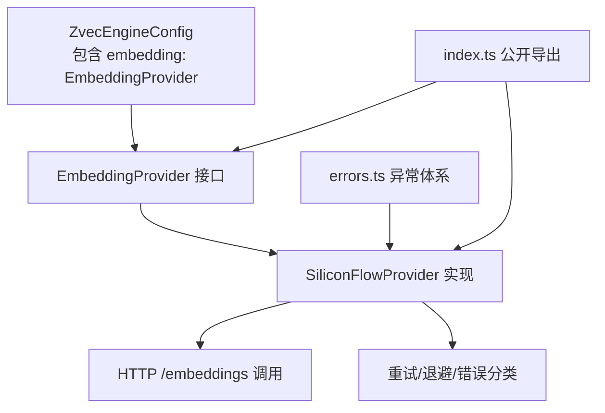
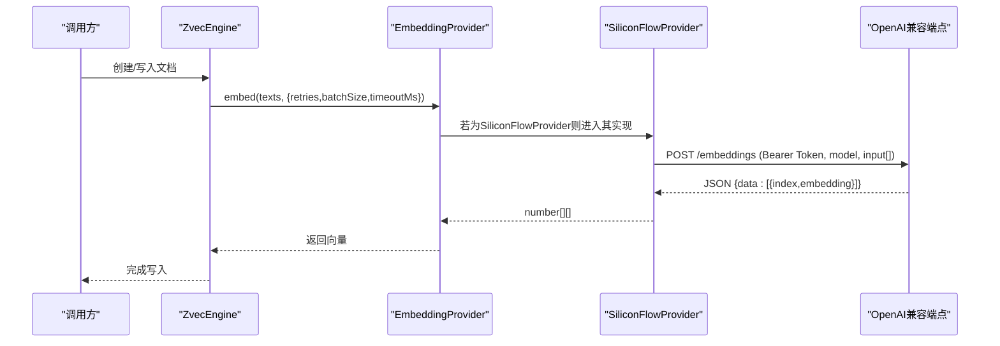
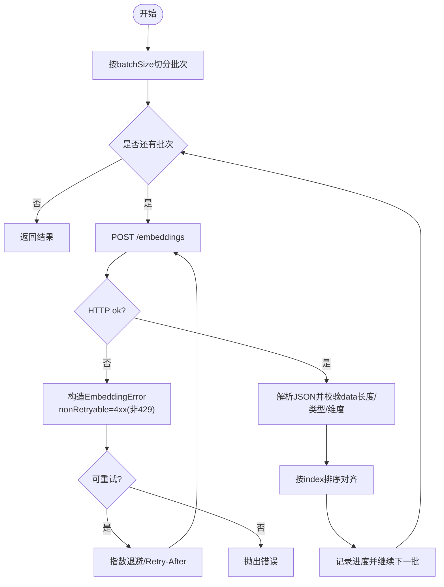
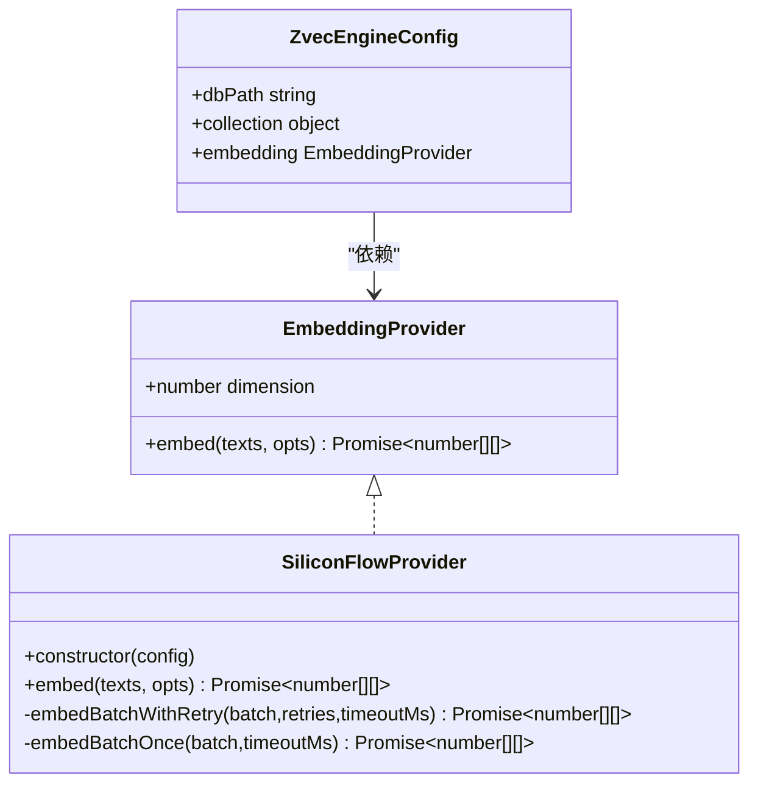

# Embedding提供商架构

<cite>
**本文引用的文件**
- [src/zvec-engine/embedding/provider.ts](file://src/zvec-engine/embedding/provider.ts)
- [src/zvec-engine/embedding/siliconflow.ts](file://src/zvec-engine/embedding/siliconflow.ts)
- [src/zvec-engine/errors.ts](file://src/zvec-engine/errors.ts)
- [src/zvec-engine/types.ts](file://src/zvec-engine/types.ts)
- [src/zvec-engine/index.ts](file://src/zvec-engine/index.ts)
- [src/config.ts](file://src/config.ts)
- [test/e2e/zvec-engine-e2e.network.mjs](file://test/e2e/zvec-engine-e2e.network.mjs)
- [test/zvec-engine-embedding.test.mjs](file://test/zvec-engine-embedding.test.mjs)
</cite>

## 目录
1. [简介](#简介)
2. [项目结构](#项目结构)
3. [核心组件](#核心组件)
4. [架构总览](#架构总览)
5. [详细组件分析](#详细组件分析)
6. [依赖关系分析](#依赖关系分析)
7. [性能与并发](#性能与并发)
8. [故障排查指南](#故障排查指南)
9. [结论](#结论)
10. [附录：配置示例与最佳实践](#附录：配置示例与最佳实践)

## 简介
本文件系统性阐述 Embedding 提供商的抽象设计与插件化架构，重点解析 SiliconFlowProvider 的实现原理（HTTP 请求、批量嵌入、重试与错误恢复），并给出配置选项说明（API 密钥、超时、批大小）、自定义提供商开发指南、不同提供商的配置示例与性能对比建议，以及提供商选择策略与故障转移机制的实现要点。

## 项目结构
Embedding 相关代码集中在 zvec-engine 子模块中，采用“接口 + 具体实现”的插件化组织方式：
- 抽象层：EmbeddingProvider 接口定义统一的 embed 能力与参数约定。
- 实现层：SiliconFlowProvider 提供基于 OpenAI 兼容端点的 HTTP 调用实现。
- 类型与异常：types.ts 定义引擎配置中的 embedding 字段；errors.ts 提供类型化异常，便于上层统一处理。
- 门面导出：index.ts 将 Provider 与类型暴露给外部使用。
- 配置模板：config.ts 生成 YAML 模板，包含 embedding 段（provider/baseURL/model/dimension/apiKey）。

图表来源
- [src/zvec-engine/types.ts:41-53](file://src/zvec-engine/types.ts#L41-L53)
- [src/zvec-engine/embedding/provider.ts:9-28](file://src/zvec-engine/embedding/provider.ts#L9-L28)
- [src/zvec-engine/embedding/siliconflow.ts:43-102](file://src/zvec-engine/embedding/siliconflow.ts#L43-L102)
- [src/zvec-engine/errors.ts:56-62](file://src/zvec-engine/errors.ts#L56-L62)
- [src/zvec-engine/index.ts:43-45](file://src/zvec-engine/index.ts#L43-L45)

章节来源
- [src/zvec-engine/types.ts:41-53](file://src/zvec-engine/types.ts#L41-L53)
- [src/zvec-engine/embedding/provider.ts:9-28](file://src/zvec-engine/embedding/provider.ts#L9-L28)
- [src/zvec-engine/embedding/siliconflow.ts:43-102](file://src/zvec-engine/embedding/siliconflow.ts#L43-L102)
- [src/zvec-engine/errors.ts:56-62](file://src/zvec-engine/errors.ts#L56-L62)
- [src/zvec-engine/index.ts:43-45](file://src/zvec-engine/index.ts#L43-L45)
- [src/config.ts:88-99](file://src/config.ts#L88-L99)

## 核心组件
- EmbeddingProvider 接口
  - dimension：输出向量维度，必须与集合配置一致。
  - embed(texts, opts)：将文本数组转为向量二维数组；支持 retries、batchSize、timeoutMs、onProgress 等选项；小批失败抛 EmbeddingError（携带该批范围信息）。
- SiliconFlowProvider
  - 构造时校验 apiKey、dimension、baseURL（https 前缀）；默认 baseURL 与 model、dimension。
  - embed 分批串行调用后端，每批可重试；支持进度回调。
  - embedBatchOnce 封装单次 HTTP 调用，含超时控制、响应体校验、维度校验、顺序对齐。
  - 重试策略：指数退避优先读取 Retry-After；4xx（非 429）不重试；网络错误与 5xx/429 可重试。
- 错误体系
  - EmbeddingError/EmbeddingConfigError 继承 ZvecEngineError，携带 code/data，便于跨线程序列化与上层区分处理。

章节来源
- [src/zvec-engine/embedding/provider.ts:9-28](file://src/zvec-engine/embedding/provider.ts#L9-L28)
- [src/zvec-engine/embedding/siliconflow.ts:16-75](file://src/zvec-engine/embedding/siliconflow.ts#L16-L75)
- [src/zvec-engine/embedding/siliconflow.ts:77-128](file://src/zvec-engine/embedding/siliconflow.ts#L77-L128)
- [src/zvec-engine/embedding/siliconflow.ts:130-202](file://src/zvec-engine/embedding/siliconflow.ts#L130-L202)
- [src/zvec-engine/errors.ts:56-62](file://src/zvec-engine/errors.ts#L56-L62)

## 架构总览
Embedding 提供商通过接口解耦上层引擎与下游服务，SiliconFlowProvider 作为参考实现，遵循 OpenAI 兼容 /embeddings 协议。引擎在创建时注入 EmbeddingProvider，后续写入流程由引擎调度 provider 进行批量向量化。

图表来源
- [src/zvec-engine/types.ts:41-53](file://src/zvec-engine/types.ts#L41-L53)
- [src/zvec-engine/embedding/provider.ts:20-28](file://src/zvec-engine/embedding/provider.ts#L20-L28)
- [src/zvec-engine/embedding/siliconflow.ts:130-184](file://src/zvec-engine/embedding/siliconflow.ts#L130-L184)

## 详细组件分析

### EmbeddingProvider 抽象设计
- 目标：以最小契约暴露“文本→向量”的能力，屏蔽底层差异。
- 关键约束：
  - dimension 必须与集合维度一致，否则上层会报维度不匹配。
  - 返回长度与 texts 一致，每条向量长度为 dimension。
  - 小批失败抛 EmbeddingError，携带批次范围以便上层定位。
- 扩展性：新增提供商只需实现接口，无需改动引擎。

章节来源
- [src/zvec-engine/embedding/provider.ts:9-28](file://src/zvec-engine/embedding/provider.ts#L9-L28)
- [src/zvec-engine/types.ts:41-53](file://src/zvec-engine/types.ts#L41-L53)

### SiliconFlowProvider 实现原理
- HTTP 请求处理
  - 构造 Authorization 头（Bearer token），Content-Type application/json。
  - 请求体包含 model 与 input（当前批次文本）。
  - 使用 AbortController 实现超时控制。
- 批量嵌入
  - 按 batchSize 切分，逐批串行调用，避免触发限流。
  - 支持 onProgress 回调上报进度。
- 重试机制
  - 指数退避：基础退避 1s，最大 8s；优先使用响应头 Retry-After（秒或日期）。
  - 可重试条件：5xx、429、网络错误；不可重试：4xx（非 429）、响应结构错误、维度不匹配。
  - 非可重试错误直接抛出，避免无效重试。
- 错误恢复
  - 对响应 data 长度、embedding 类型与维度进行严格校验。
  - 对 index 排序以保证与输入顺序一致。
  - 超时与网络错误包装为 EmbeddingError 并标记可重试。

图表来源
- [src/zvec-engine/embedding/siliconflow.ts:77-128](file://src/zvec-engine/embedding/siliconflow.ts#L77-L128)
- [src/zvec-engine/embedding/siliconflow.ts:130-202](file://src/zvec-engine/embedding/siliconflow.ts#L130-L202)

章节来源
- [src/zvec-engine/embedding/siliconflow.ts:16-75](file://src/zvec-engine/embedding/siliconflow.ts#L16-L75)
- [src/zvec-engine/embedding/siliconflow.ts:77-128](file://src/zvec-engine/embedding/siliconflow.ts#L77-L128)
- [src/zvec-engine/embedding/siliconflow.ts:130-202](file://src/zvec-engine/embedding/siliconflow.ts#L130-L202)

### 提供商配置选项
- API 密钥设置
  - 支持构造函数传入 apiKey 或从环境变量 SILICONFLOW_API_KEY 读取；缺失则抛出配置错误。
  - 配置模板支持明文或 ${VAR_NAME} 引用环境变量。
- 超时配置
  - 通过 EmbedOptions.timeoutMs 控制单批请求超时；默认 30000ms。
- 并发控制
  - 批间串行以避免触发提供商限流；可通过调整 batchSize 平衡吞吐与稳定性。
- 其他
  - baseURL 必须以 https:// 开头；model 与 dimension 可配置，dimension 需与集合维度一致。

章节来源
- [src/zvec-engine/embedding/siliconflow.ts:16-75](file://src/zvec-engine/embedding/siliconflow.ts#L16-L75)
- [src/zvec-engine/embedding/provider.ts:9-18](file://src/zvec-engine/embedding/provider.ts#L9-L18)
- [src/config.ts:88-99](file://src/config.ts#L88-L99)

### 自定义 Embedding 提供商开发指南
- 接口要求
  - 实现 EmbeddingProvider：提供 dimension 与 embed(texts, opts)。
  - 遵守返回长度与维度约束；小批失败抛 EmbeddingError，并尽量标注 nonRetryable。
- 最佳实践
  - 使用 AbortController 实现超时；合理设置 batch size 避免限流。
  - 对响应做严格校验（数据长度、embedding 类型、维度）。
  - 实现幂等与重试：仅对可重试错误（网络/5xx/429）重试，利用 Retry-After。
  - 提供 onProgress 回调，便于上层观测进度。
  - 通过 fetchImpl 注入 mock，便于单元测试。

章节来源
- [src/zvec-engine/embedding/provider.ts:9-28](file://src/zvec-engine/embedding/provider.ts#L9-L28)
- [src/zvec-engine/embedding/siliconflow.ts:16-75](file://src/zvec-engine/embedding/siliconflow.ts#L16-L75)
- [src/zvec-engine/errors.ts:56-62](file://src/zvec-engine/errors.ts#L56-L62)

### 不同提供商的配置示例与性能对比
- 配置示例
  - SiliconFlow：baseURL 指向 OpenAI 兼容端点，model 指定模型名，dimension 与集合维度一致，apiKey 通过环境变量注入。
  - 其他 OpenAI 兼容提供商：替换 baseURL 与 model，保持 dimension 一致即可。
- 性能对比建议
  - 关注提供商 QPS/TPS 限制与延迟；通过 batchSize 与 retries 调优。
  - 结合 onProgress 监控吞吐；在高延迟场景适当增大 timeoutMs。
  - 对比不同模型的维度与质量，确保与检索效果匹配。

章节来源
- [src/config.ts:88-99](file://src/config.ts#L88-L99)
- [test/e2e/zvec-engine-e2e.network.mjs:106-137](file://test/e2e/zvec-engine-e2e.network.mjs#L106-L137)

### 提供商选择策略与故障转移机制
- 选择策略
  - 根据业务需求（延迟、成本、质量）选择提供商；通过 baseURL 与 model 灵活切换。
  - 在配置层集中管理提供商参数，便于热更新与灰度。
- 故障转移
  - 当前 SiliconFlowProvider 内部已实现按错误的可重试性进行重试与退避。
  - 更高层的故障转移（如主备提供商切换）可在调用侧实现：捕获 EmbeddingError，判断错误码后切换到备用提供商并重试。
  - 建议在应用层维护提供商健康状态与权重，动态选择。

章节来源
- [src/zvec-engine/embedding/siliconflow.ts:104-128](file://src/zvec-engine/embedding/siliconflow.ts#L104-L128)
- [src/zvec-engine/errors.ts:56-62](file://src/zvec-engine/errors.ts#L56-L62)

## 依赖关系分析
- 类型依赖
  - ZvecEngineConfig.embedding 类型为 EmbeddingProvider，使引擎与提供商解耦。
- 异常依赖
  - SiliconFlowProvider 抛出 EmbeddingError/EmbeddingConfigError，上层可据此区分配置错误与运行时错误。
- 导出依赖
  - index.ts 将 Provider 与类型公开，便于外部集成与测试。

图表来源
- [src/zvec-engine/embedding/provider.ts:20-28](file://src/zvec-engine/embedding/provider.ts#L20-L28)
- [src/zvec-engine/embedding/siliconflow.ts:43-102](file://src/zvec-engine/embedding/siliconflow.ts#L43-L102)
- [src/zvec-engine/types.ts:41-53](file://src/zvec-engine/types.ts#L41-L53)

章节来源
- [src/zvec-engine/types.ts:41-53](file://src/zvec-engine/types.ts#L41-L53)
- [src/zvec-engine/embedding/provider.ts:20-28](file://src/zvec-engine/embedding/provider.ts#L20-L28)
- [src/zvec-engine/embedding/siliconflow.ts:43-102](file://src/zvec-engine/embedding/siliconflow.ts#L43-L102)

## 性能与并发
- 批大小（batchSize）
  - 默认 64；过大可能触发限流，过小降低吞吐。建议根据提供商限制与网络状况调优。
- 超时（timeoutMs）
  - 默认 30000ms；高延迟环境可适当增大，但需权衡整体耗时。
- 重试与退避
  - 指数退避上限 8s；优先使用 Retry-After；4xx（非 429）不重试，避免无效消耗。
- 进度回调（onProgress）
  - 用于观测处理进度，便于前端展示或日志记录。

章节来源
- [src/zvec-engine/embedding/siliconflow.ts:30-33](file://src/zvec-engine/embedding/siliconflow.ts#L30-L33)
- [src/zvec-engine/embedding/siliconflow.ts:77-102](file://src/zvec-engine/embedding/siliconflow.ts#L77-L102)
- [src/zvec-engine/embedding/siliconflow.ts:104-128](file://src/zvec-engine/embedding/siliconflow.ts#L104-L128)

## 故障排查指南
- 常见错误与处理
  - 缺少 apiKey：构造时抛出 EmbeddingConfigError；检查环境变量或配置。
  - 维度不匹配：响应维度与配置不一致，抛出 EmbeddingError；核对集合 dimension 与模型输出。
  - 4xx（非 429）：不可重试，检查权限、模型名称或参数。
  - 429 限流：可重试，关注 Retry-After 与退避；必要时降低 batchSize。
  - 超时：AbortError 包装为 EmbeddingError；增大 timeoutMs 或优化网络。
- 调试建议
  - 使用 onProgress 观察进度与瓶颈。
  - 通过 fetchImpl 注入 mock，复现特定错误路径。
  - 查看错误码与 data 字段，快速定位问题类型。

章节来源
- [src/zvec-engine/embedding/siliconflow.ts:51-75](file://src/zvec-engine/embedding/siliconflow.ts#L51-L75)
- [src/zvec-engine/embedding/siliconflow.ts:147-202](file://src/zvec-engine/embedding/siliconflow.ts#L147-L202)
- [test/zvec-engine-embedding.test.mjs:119-142](file://test/zvec-engine-embedding.test.mjs#L119-L142)

## 结论
本架构通过 EmbeddingProvider 接口实现了提供商的插件化与解耦，SiliconFlowProvider 提供了健壮的 HTTP 调用、批量处理、重试与错误恢复能力。配置层支持灵活的密钥、超时与批大小设置，便于在不同环境中稳定运行。上层可在此基础上实现更复杂的提供商选择与故障转移策略，以满足多样化业务需求。

## 附录：配置示例与最佳实践
- 配置示例
  - 在 .ki/config.yaml 的 embedding 段中设置 provider、baseURL、model、dimension、apiKey（推荐环境变量引用）。
  - 端到端测试通过环境变量注入 apiKey、baseURL、model、dimension，验证真实联网场景。
- 最佳实践
  - 始终校验 dimension 与集合一致。
  - 合理设置 batchSize 与 timeoutMs，结合 onProgress 监控。
  - 对 429 与网络错误启用重试，对 4xx（非 429）立即失败。
  - 使用 fetchImpl 注入 mock，完善单元测试覆盖。

章节来源
- [src/config.ts:88-99](file://src/config.ts#L88-L99)
- [test/e2e/zvec-engine-e2e.network.mjs:106-137](file://test/e2e/zvec-engine-e2e.network.mjs#L106-L137)
- [test/zvec-engine-embedding.test.mjs:1-44](file://test/zvec-engine-embedding.test.mjs#L1-44)