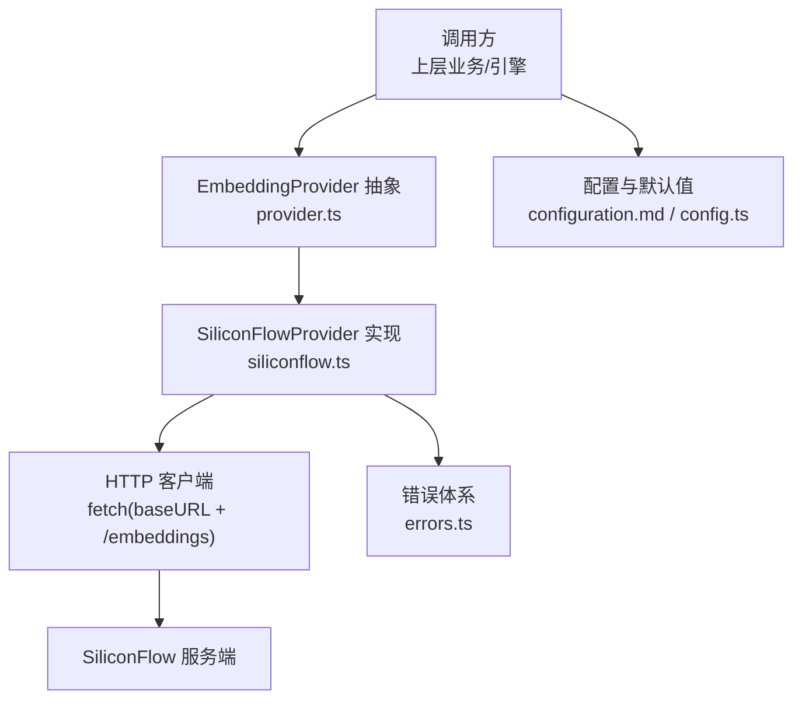
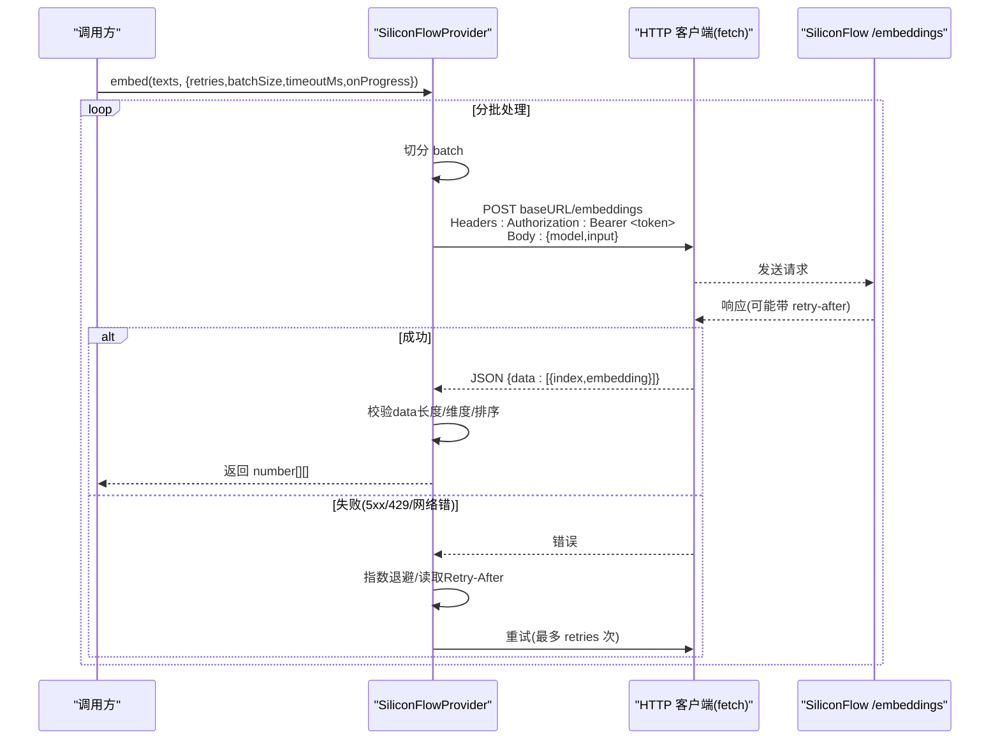
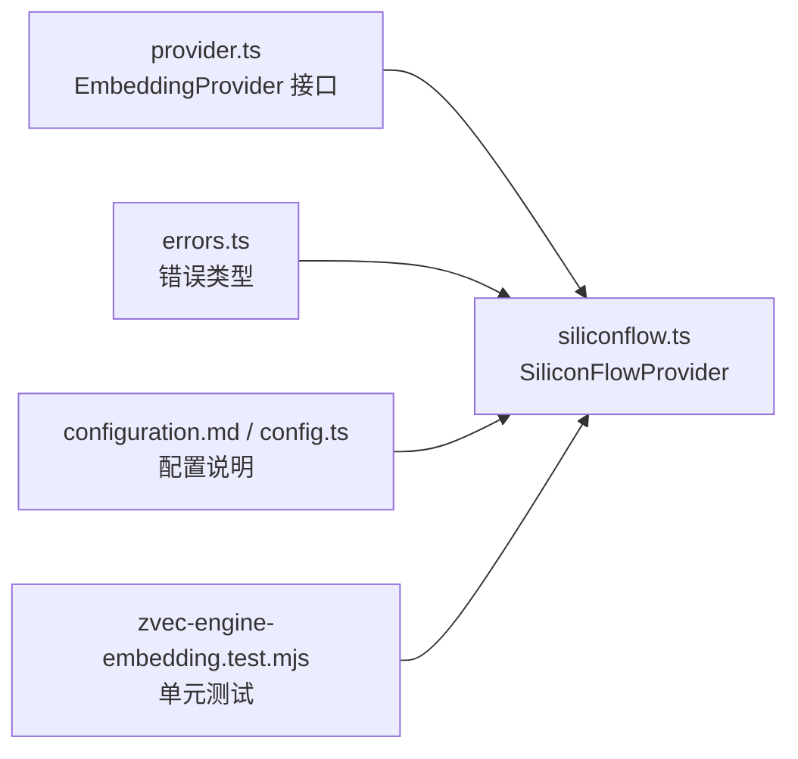

# HTTP通信协议

<cite>
**本文引用的文件**
- [siliconflow.ts](file://src/zvec-engine/embedding/siliconflow.ts)
- [provider.ts](file://src/zvec-engine/embedding/provider.ts)
- [errors.ts](file://src/zvec-engine/errors.ts)
- [configuration.md](file://docs/configuration.md)
- [config.ts](file://src/config.ts)
- [zvec-engine-embedding.test.mjs](file://test/zvec-engine-embedding.test.mjs)
- [zvec-engine-e2e.network.mjs](file://test/e2e/zvec-engine-e2e.network.mjs)
</cite>

## 目录
1. [简介](#简介)
2. [项目结构](#项目结构)
3. [核心组件](#核心组件)
4. [架构总览](#架构总览)
5. [详细组件分析](#详细组件分析)
6. [依赖关系分析](#依赖关系分析)
7. [性能考虑](#性能考虑)
8. [故障排查指南](#故障排查指南)
9. [结论](#结论)
10. [附录：HTTP请求与响应示例](#附录http请求与响应示例)

## 简介
本文件面向SiliconFlow的OpenAI兼容/embeddings接口调用，基于仓库中SiliconFlowProvider的实现，系统化说明请求构建、认证方式、超时控制、重试策略、响应校验、安全最佳实践以及网络调试建议。目标是帮助读者在不直接阅读源码的情况下，也能正确集成并稳定使用SiliconFlow向量嵌入能力。

## 项目结构
与SiliconFlow HTTP通信相关的核心代码集中在zvec-engine/embedding子模块，配合错误类型定义、配置文档与端到端测试用例共同构成完整链路。

图示来源
- [provider.ts:9-28](file://src/zvec-engine/embedding/provider.ts#L9-L28)
- [siliconflow.ts:16-75](file://src/zvec-engine/embedding/siliconflow.ts#L16-L75)
- [errors.ts:56-61](file://src/zvec-engine/errors.ts#L56-L61)
- [configuration.md:67-88](file://docs/configuration.md#L67-L88)
- [config.ts:88-104](file://src/config.ts#L88-L104)

章节来源
- [provider.ts:9-28](file://src/zvec-engine/embedding/provider.ts#L9-L28)
- [siliconflow.ts:16-75](file://src/zvec-engine/embedding/siliconflow.ts#L16-L75)
- [configuration.md:67-88](file://docs/configuration.md#L67-L88)
- [config.ts:88-104](file://src/config.ts#L88-L104)

## 核心组件
- EmbeddingProvider 抽象：定义 embed(texts, opts) 契约，包含 retries、batchSize、timeoutMs、onProgress 等选项，用于统一接入不同提供商。
- SiliconFlowProvider：具体实现OpenAI兼容的/embeddings调用，负责：
  - 构造请求体（model、input）
  - 设置Authorization头（Bearer Token）
  - 超时控制（AbortController）
  - 批处理与进度回调
  - 重试策略（指数退避 + Retry-After）
  - 响应校验（data长度、维度一致性、乱序对齐）
- 错误体系：EmbeddingError/EmbeddingConfigError等结构化异常，携带code与data便于上层区分可重试/不可重试错误。

章节来源
- [provider.ts:9-28](file://src/zvec-engine/embedding/provider.ts#L9-L28)
- [siliconflow.ts:77-202](file://src/zvec-engine/embedding/siliconflow.ts#L77-L202)
- [errors.ts:56-61](file://src/zvec-engine/errors.ts#L56-L61)

## 架构总览
SiliconFlowProvider通过标准HTTP POST到/baseURL/embeddings，使用Bearer Token鉴权，返回OpenAI兼容的{ data: [{ index, embedding }] }结构。调用方按批次提交文本，Provider内部进行重试、超时、排序与维度校验后返回二维数组。

图示来源
- [siliconflow.ts:130-202](file://src/zvec-engine/embedding/siliconflow.ts#L130-L202)
- [siliconflow.ts:104-128](file://src/zvec-engine/embedding/siliconflow.ts#L104-L128)
- [provider.ts:9-28](file://src/zvec-engine/embedding/provider.ts#L9-L28)

## 详细组件分析

### 认证机制与安全性
- 认证方式：在请求头中注入 Authorization: Bearer ${apiKey}。
- 密钥来源：优先从构造函数参数传入；否则读取环境变量 SILICONFLOW_API_KEY；两者均缺失则抛出配置错误。
- HTTPS强制：baseURL必须以https://开头，否则构造时即报错，避免明文传输风险。
- 安全建议：
  - 使用环境变量引用apiKey，不要将密钥明文写入配置文件。
  - 生产环境仅允许HTTPS访问。
  - 最小权限原则：为API Key限定必要范围。
  - 日志脱敏：避免打印完整Token或敏感字段。

章节来源
- [siliconflow.ts:51-75](file://src/zvec-engine/embedding/siliconflow.ts#L51-L75)
- [siliconflow.ts:134-145](file://src/zvec-engine/embedding/siliconflow.ts#L134-L145)
- [configuration.md:67-88](file://docs/configuration.md#L67-L88)
- [config.ts:88-104](file://src/config.ts#L88-L104)

### 请求体JSON结构
- model：字符串，指定使用的模型名称（如 Qwen/Qwen3-Embedding-8B）。
- input：字符串数组，待嵌入的文本列表。
- 注意：不显式传递dimensions参数，由服务端根据模型决定，客户端通过响应维度校验保证一致性。

章节来源
- [siliconflow.ts:134-145](file://src/zvec-engine/embedding/siliconflow.ts#L134-L145)
- [siliconflow.ts:16-28](file://src/zvec-engine/embedding/siliconflow.ts#L16-L28)

### 响应数据校验
- data数组长度校验：必须等于本次提交的batch长度，否则抛出EmbeddingError（不可重试）。
- 维度校验：每个item.embedding.length必须等于配置的dimension，否则抛出EmbeddingError（不可重试）。
- 顺序对齐：响应可能乱序，按index排序后再映射回输入顺序，确保结果与输入一一对应。
- 非数组或空embedding：视为结构错误，抛出EmbeddingError（不可重试）。

章节来源
- [siliconflow.ts:159-184](file://src/zvec-engine/embedding/siliconflow.ts#L159-L184)
- [zvec-engine-embedding.test.mjs:155-187](file://test/zvec-engine-embedding.test.mjs#L155-L187)

### 超时控制与AbortController
- 单批超时：每批请求创建AbortController，并在timeoutMs毫秒后触发abort，导致fetch拒绝并抛出AbortError。
- 超时错误分类：TIMEOUT，标记为非致命（nonRetryable=false），支持按重试策略重试。
- 资源清理：finally中清除定时器，防止内存泄漏。

章节来源
- [siliconflow.ts:130-145](file://src/zvec-engine/embedding/siliconflow.ts#L130-L145)
- [siliconflow.ts:185-202](file://src/zvec-engine/embedding/siliconflow.ts#L185-L202)
- [zvec-engine-embedding.test.mjs:144-153](file://test/zvec-engine-embedding.test.mjs#L144-L153)

### 重试策略与退避
- 可重试场景：
  - HTTP 5xx：服务器错误，可重试。
  - HTTP 429：限流，尊重Retry-After头。
  - 网络错误（fetch reject）：可重试。
- 不可重试场景：
  - 其他4xx（如401/400/404等）：直接抛错。
  - 响应结构错误（data长度不符、维度不符、embedding非数组）：直接抛错。
- 退避策略：
  - 优先读取Retry-After（秒数或HTTP日期格式），计算等待时间。
  - 若未提供Retry-After，采用指数退避（上限8秒）。
  - 每次重试前sleep等待。

章节来源
- [siliconflow.ts:104-128](file://src/zvec-engine/embedding/siliconflow.ts#L104-L128)
- [siliconflow.ts:147-157](file://src/zvec-engine/embedding/siliconflow.ts#L147-L157)
- [siliconflow.ts:215-225](file://src/zvec-engine/embedding/siliconflow.ts#L215-L225)
- [zvec-engine-embedding.test.mjs:107-142](file://test/zvec-engine-embedding.test.mjs#L107-L142)
- [zvec-engine-embedding.test.mjs:199-218](file://test/zvec-engine-embedding.test.mjs#L199-L218)

### 批处理与进度回调
- 分批大小：默认64条/批，可通过opts.batchSize调整，避免触发限流。
- 进度回调：每批完成后调用onProgress(done, total)，便于前端或日志记录进度。
- 空输入优化：texts为空时直接返回空数组，不调用网络。

章节来源
- [siliconflow.ts:77-102](file://src/zvec-engine/embedding/siliconflow.ts#L77-L102)
- [zvec-engine-embedding.test.mjs:85-105](file://test/zvec-engine-embedding.test.mjs#L85-L105)

### 错误模型与可观测性
- EmbeddingError：承载HTTP状态码、网络错误、超时、响应结构错误等，附带code与data（含nonRetryable、retryAfterMs、expectedDim/actualDim等）。
- EmbeddingConfigError：配置错误（缺少apiKey、baseURL非HTTPS、dimension非法）。
- 上层可按code分类处理：TIMEOUT/NETWORK可重试；HTTP_4xx（除429）与结构错误不可重试。

章节来源
- [errors.ts:56-61](file://src/zvec-engine/errors.ts#L56-L61)
- [siliconflow.ts:147-198](file://src/zvec-engine/embedding/siliconflow.ts#L147-L198)
- [zvec-engine-embedding.test.mjs:134-197](file://test/zvec-engine-embedding.test.mjs#L134-L197)

## 依赖关系分析
- siliconflow.ts依赖provider.ts定义的EmbeddingProvider接口与EmbedOptions。
- errors.ts提供统一的错误类型，供siliconflow.ts抛出结构化异常。
- configuration.md与config.ts提供配置项说明与默认值，指导用户如何正确设置baseURL、model、dimension与apiKey。
- 测试用例覆盖关键路径：正常流程、超时、维度不一致、data长度不一致、乱序对齐、网络错误、Retry-After处理等。

图示来源
- [provider.ts:9-28](file://src/zvec-engine/embedding/provider.ts#L9-L28)
- [siliconflow.ts:13-28](file://src/zvec-engine/embedding/siliconflow.ts#L13-L28)
- [errors.ts:56-61](file://src/zvec-engine/errors.ts#L56-L61)
- [configuration.md:67-88](file://docs/configuration.md#L67-L88)
- [config.ts:88-104](file://src/config.ts#L88-L104)
- [zvec-engine-embedding.test.mjs:1-224](file://test/zvec-engine-embedding.test.mjs#L1-224)

章节来源
- [provider.ts:9-28](file://src/zvec-engine/embedding/provider.ts#L9-L28)
- [siliconflow.ts:13-28](file://src/zvec-engine/embedding/siliconflow.ts#L13-L28)
- [errors.ts:56-61](file://src/zvec-engine/errors.ts#L56-L61)
- [configuration.md:67-88](file://docs/configuration.md#L67-L88)
- [config.ts:88-104](file://src/config.ts#L88-L104)
- [zvec-engine-embedding.test.mjs:1-224](file://test/zvec-engine-embedding.test.mjs#L1-224)

## 性能考虑
- 批大小：默认64条/批，可根据服务端限流策略调优。过大易触发限流，过小影响吞吐。
- 超时：默认30秒/批，可根据网络质量与服务端响应时间调整。
- 重试：指数退避+Retry-After优先，避免雪崩；对4xx（非429）与结构错误不重试，减少无效请求。
- 进度回调：onProgress可用于前端展示或监控指标上报。
- 维度一致性：dimension需与集合配置一致，避免后续检索/存储错误。

[本节为通用性能建议，不直接分析具体文件]

## 故障排查指南
- 401/403：检查apiKey是否正确、是否过期、权限是否足够。
- 429：关注Retry-After头，合理降低请求频率或增大batch间隔。
- 超时：检查网络质量、服务端负载；适当增大timeoutMs或减小batchSize。
- 维度不匹配：确认dimension与集合配置一致；检查模型是否变更。
- data长度不符：检查服务端是否丢包或并发问题；确认输入与响应数量一致。
- 乱序响应：已按index排序对齐，若仍异常，检查index是否连续且唯一。
- 网络错误：检查DNS、代理、防火墙；必要时启用抓包工具定位。

章节来源
- [zvec-engine-embedding.test.mjs:107-197](file://test/zvec-engine-embedding.test.mjs#L107-L197)
- [siliconflow.ts:147-198](file://src/zvec-engine/embedding/siliconflow.ts#L147-L198)

## 结论
SiliconFlowProvider以OpenAI兼容的/embeddings接口为基础，提供了健壮的认证、超时、重试、响应校验与批处理能力。通过严格的HTTPS强制、结构化错误与可观测性设计，能够在生产环境中稳定运行。建议结合业务规模调优批大小与超时，并遵循安全最佳实践保护密钥与通信通道。

[本节为总结性内容，不直接分析具体文件]

## 附录：HTTP请求与响应示例

### 成功场景
- 请求方法：POST
- 路径：/v1/embeddings（baseURL通常为 https://api.siliconflow.cn/v1）
- 头部：
  - Authorization: Bearer ${SILICONFLOW_API_KEY}
  - Content-Type: application/json
- 请求体：
  - model: 字符串（如 Qwen/Qwen3-Embedding-8B）
  - input: 字符串数组（待嵌入文本）
- 响应体：
  - data: 数组，每项包含 index（序号）与 embedding（数值数组，长度为配置的dimension）

章节来源
- [siliconflow.ts:134-145](file://src/zvec-engine/embedding/siliconflow.ts#L134-L145)
- [siliconflow.ts:159-184](file://src/zvec-engine/embedding/siliconflow.ts#L159-L184)
- [zvec-engine-e2e.network.mjs:46-59](file://test/e2e/zvec-engine-e2e.network.mjs#L46-L59)

### 失败场景
- HTTP 4xx（非429）：直接抛错，不可重试（如401未授权、400参数错误）。
- HTTP 429：限流，尊重Retry-After头进行退避重试。
- HTTP 5xx：服务器错误，指数退避重试。
- 网络错误：如DNS解析失败、连接超时等，标记为NETWORK，可重试。
- 超时：AbortController触发，标记为TIMEOUT，可重试。
- 响应结构错误：data长度不符、embedding非数组、维度不匹配，标记为不可重试。

章节来源
- [siliconflow.ts:147-198](file://src/zvec-engine/embedding/siliconflow.ts#L147-L198)
- [zvec-engine-embedding.test.mjs:107-197](file://test/zvec-engine-embedding.test.mjs#L107-L197)

### 网络调试与抓包建议
- 使用浏览器开发者工具的Network面板或curl命令验证基础连通性与鉴权。
- 使用Wireshark/tcpdump抓取TCP层流量，观察TLS握手与HTTP报文。
- 在应用层开启日志输出（注意脱敏），记录请求URL、头部、响应状态码与耗时。
- 针对429与超时问题，重点观察Retry-After头与响应时间分布。
- 通过mock fetch替换真实网络，复现边界条件（如乱序响应、维度不匹配）。

[本节为通用调试建议，不直接分析具体文件]