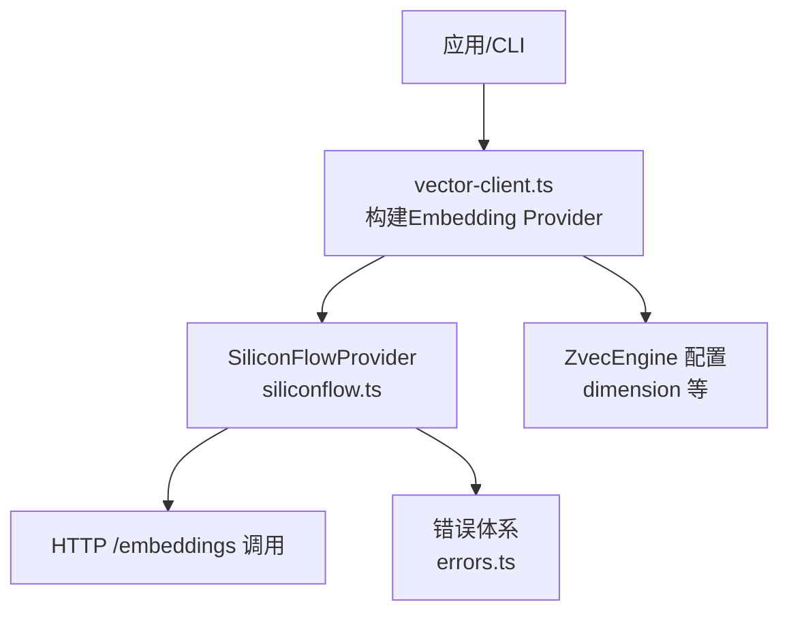
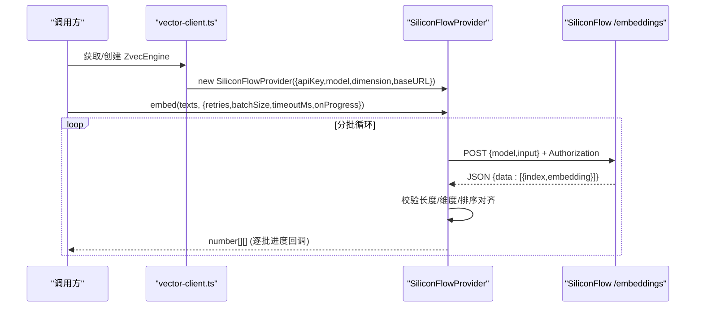
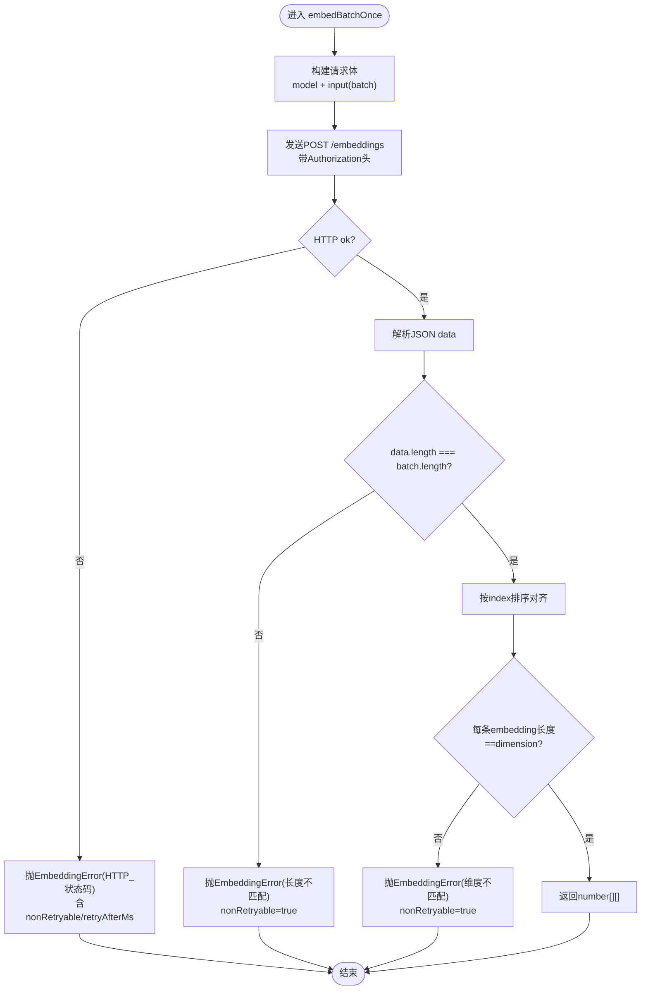
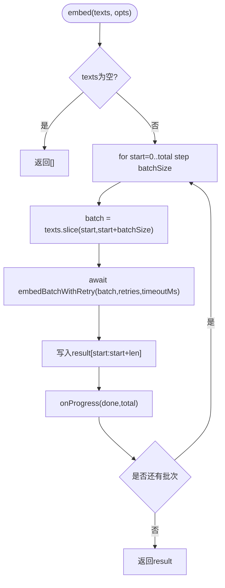
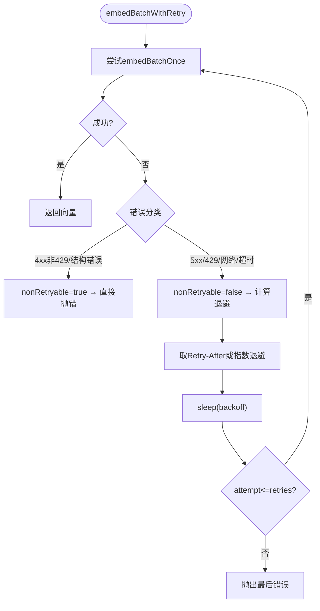
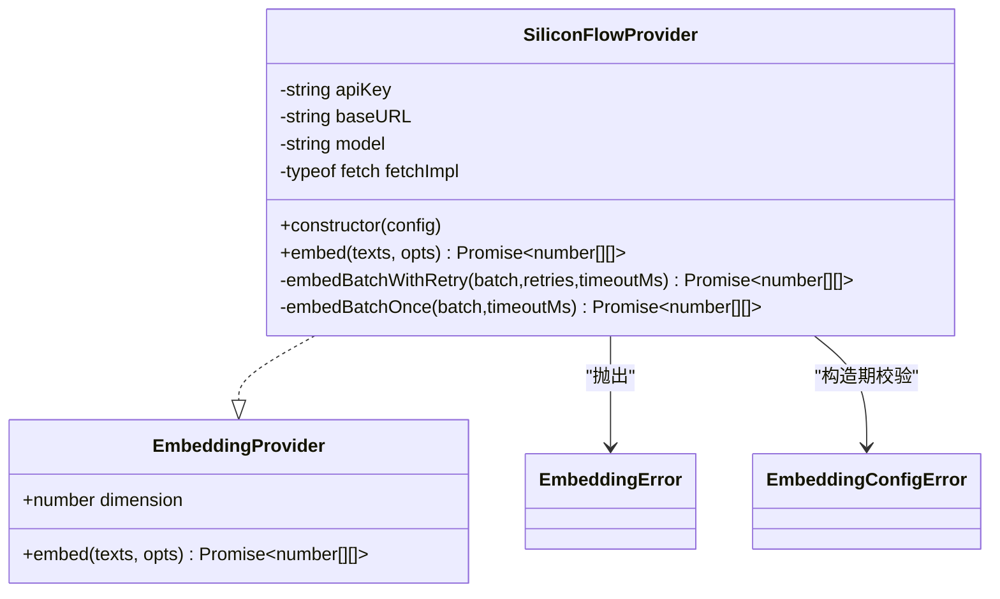

# SiliconFlow提供商实现

<cite>
**本文引用的文件**
- [siliconflow.ts](file://src/zvec-engine/embedding/siliconflow.ts)
- [provider.ts](file://src/zvec-engine/embedding/provider.ts)
- [errors.ts](file://src/zvec-engine/errors.ts)
- [vector-client.ts](file://src/lib/vector-client.ts)
- [config.ts](file://src/config.ts)
- [zvec-engine-embedding.test.mjs](file://test/zvec-engine-embedding.test.mjs)
</cite>

## 目录
1. [简介](#简介)
2. [项目结构](#项目结构)
3. [核心组件](#核心组件)
4. [架构总览](#架构总览)
5. [详细组件分析](#详细组件分析)
6. [依赖关系分析](#依赖关系分析)
7. [性能考量](#性能考量)
8. [故障排查指南](#故障排查指南)
9. [结论](#结论)
10. [附录：配置与使用示例](#附录配置与使用示例)

## 简介
本文件面向SiliconFlowEmbeddingProvider（在代码中为 SiliconFlowProvider）的实现文档，系统性说明其工作原理、HTTP请求构建、API调用流程、响应解析、批量嵌入处理机制（文本分块、并发控制、结果聚合）、重试策略与错误恢复（网络异常、API限流应对）、配置参数设置方式（API密钥、模型选择、端点配置），并提供完整的配置示例、使用模式、性能优化建议与故障排查指南。

## 项目结构
SiliconFlowProvider位于向量引擎的embedding子模块中，遵循统一的EmbeddingProvider抽象接口，并通过工程化的错误体系对外暴露类型化异常。上层通过vector-client从配置加载并构造该Provider，再注入到ZvecEngine中使用。

图表来源
- [vector-client.ts:247-265](file://src/lib/vector-client.ts#L247-L265)
- [siliconflow.ts:43-75](file://src/zvec-engine/embedding/siliconflow.ts#L43-L75)
- [errors.ts:56-61](file://src/zvec-engine/errors.ts#L56-L61)

章节来源
- [siliconflow.ts:1-234](file://src/zvec-engine/embedding/siliconflow.ts#L1-L234)
- [provider.ts:1-29](file://src/zvec-engine/embedding/provider.ts#L1-L29)
- [vector-client.ts:247-265](file://src/lib/vector-client.ts#L247-L265)
- [config.ts:90-100](file://src/config.ts#L90-L100)
- [errors.ts:1-99](file://src/zvec-engine/errors.ts#L1-L99)

## 核心组件
- EmbeddingProvider 抽象：定义 embed(texts, opts) 契约，统一维度约束与批失败语义。
- SiliconFlowProvider：OpenAI兼容的SiliconFlow /embeddings 客户端，内置批处理、超时、重试、响应校验与对齐。
- 错误体系：EmbeddingError/EmbeddingConfigError 等类型化异常，携带 code/data，便于上层分类处理。

章节来源
- [provider.ts:9-28](file://src/zvec-engine/embedding/provider.ts#L9-L28)
- [siliconflow.ts:43-102](file://src/zvec-engine/embedding/siliconflow.ts#L43-L102)
- [errors.ts:56-61](file://src/zvec-engine/errors.ts#L56-L61)

## 架构总览
SiliconFlowProvider作为可插拔的EmbeddingProvider，被vector-client从配置中读取apiKey/baseURL/model/dimension后实例化，并在ZvecEngine创建或打开时注入。Provider内部将输入文本按批次提交至SiliconFlow的OpenAI兼容端点，对响应进行严格校验与顺序对齐，返回与输入一一对应的向量数组。

图表来源
- [vector-client.ts:247-265](file://src/lib/vector-client.ts#L247-L265)
- [siliconflow.ts:77-102](file://src/zvec-engine/embedding/siliconflow.ts#L77-L102)
- [siliconflow.ts:130-202](file://src/zvec-engine/embedding/siliconflow.ts#L130-L202)

## 详细组件分析

### HTTP请求构建与API调用流程
- 端点与鉴权：POST {baseURL}/embeddings，Authorization: Bearer {apiKey}，Content-Type: application/json。
- 请求体：包含 model 与 input（当前批次的字符串数组）。
- 超时控制：使用AbortController，默认30秒；超时抛出TIMEOUT错误，标记为可重试。
- 响应处理：非2xx状态码封装为EmbeddingError，附带status、nonRetryable、retryAfterMs等信息；成功响应解析JSON data数组，校验长度与元素embedding类型。

图表来源
- [siliconflow.ts:130-202](file://src/zvec-engine/embedding/siliconflow.ts#L130-L202)

章节来源
- [siliconflow.ts:130-202](file://src/zvec-engine/embedding/siliconflow.ts#L130-L202)

### 批量嵌入处理机制
- 文本分块：embed方法按batchSize切分texts，默认64条/批；空输入直接返回空数组，不调用网络。
- 批间串行：为避免触发服务端限流，批次之间串行执行。
- 进度回调：每批完成后调用onProgress(done,total)，便于前端或日志展示。
- 结果聚合：维护result数组，按起始偏移写入对应向量，保证顺序一致。

图表来源
- [siliconflow.ts:77-102](file://src/zvec-engine/embedding/siliconflow.ts#L77-L102)

章节来源
- [siliconflow.ts:77-102](file://src/zvec-engine/embedding/siliconflow.ts#L77-L102)

### 重试策略与错误恢复
- 可重试条件：5xx、429、网络错误、超时（TIMEOUT/NEXTWORK）均标记为非不可重试（nonRetryable=false），支持指数退避。
- 不可重试条件：4xx且非429、响应结构错误（长度/维度不符）标记为nonRetryable=true，立即抛出。
- 退避策略：优先读取响应头Retry-After（支持秒数与HTTP日期格式），否则采用指数退避（上限8秒）。
- 最大重试次数：由opts.retries控制，默认3次；达到上限仍失败则抛出最后一次错误。

图表来源
- [siliconflow.ts:104-128](file://src/zvec-engine/embedding/siliconflow.ts#L104-L128)
- [siliconflow.ts:130-202](file://src/zvec-engine/embedding/siliconflow.ts#L130-L202)

章节来源
- [siliconflow.ts:104-128](file://src/zvec-engine/embedding/siliconflow.ts#L104-L128)
- [siliconflow.ts:130-202](file://src/zvec-engine/embedding/siliconflow.ts#L130-L202)

### 响应解析与顺序对齐
- 数据校验：确保data为数组且长度等于输入batch长度；每个元素的embedding必须为数组。
- 维度校验：每条embedding长度必须等于配置的dimension，否则抛出维度不匹配错误。
- 顺序对齐：按response中的index字段排序，防御provider乱序返回，保证输出顺序与输入一致。

章节来源
- [siliconflow.ts:159-184](file://src/zvec-engine/embedding/siliconflow.ts#L159-L184)

### 配置参数与初始化
- apiKey：可从构造函数传入或环境变量SILICONFLOW_API_KEY读取；缺失则抛出EmbeddingConfigError。
- baseURL：默认https://api.siliconflow.cn/v1；必须以https://开头，末尾斜杠会被去除。
- model：默认Qwen/Qwen3-Embedding-8B。
- dimension：默认4096；必须为正整数，用于后续向量维度一致性校验。
- fetchImpl：测试时可注入mock fetch以断网验证。

章节来源
- [siliconflow.ts:16-75](file://src/zvec-engine/embedding/siliconflow.ts#L16-L75)
- [vector-client.ts:247-265](file://src/lib/vector-client.ts#L247-L265)
- [config.ts:90-100](file://src/config.ts#L90-L100)

## 依赖关系分析
- 与EmbeddingProvider接口的耦合：实现embed契约，提供dimension属性。
- 与错误体系的耦合：所有异常均为ZvecEngineError派生，携带code/data，便于跨线程序列化与上层分类处理。
- 与上层集成：vector-client负责从配置加载并构造Provider，注入到ZvecEngine的create/open流程中。

图表来源
- [provider.ts:9-28](file://src/zvec-engine/embedding/provider.ts#L9-L28)
- [siliconflow.ts:43-102](file://src/zvec-engine/embedding/siliconflow.ts#L43-L102)
- [errors.ts:56-61](file://src/zvec-engine/errors.ts#L56-L61)

章节来源
- [provider.ts:9-28](file://src/zvec-engine/embedding/provider.ts#L9-L28)
- [siliconflow.ts:43-102](file://src/zvec-engine/embedding/siliconflow.ts#L43-L102)
- [errors.ts:56-61](file://src/zvec-engine/errors.ts#L56-L61)

## 性能考量
- 批大小：默认64条/批，避免单次过大导致限流或超时；可根据实际吞吐调整。
- 批间串行：防止并发触发限流；在高QPS场景下保持稳定性。
- 超时控制：默认30秒/批，可按网络质量调优；超时属于可重试错误。
- 进度回调：通过onProgress实时反馈完成进度，便于监控与中断恢复。
- 维度一致性：在Provider层强制校验，避免下游存储不一致导致的昂贵重建。

[本节为通用性能指导，不直接分析具体文件]

## 故障排查指南
- 缺少API密钥：构造时抛出EmbeddingConfigError，检查配置文件或环境变量SILICONFLOW_API_KEY。
- baseURL非HTTPS：构造时抛出EmbeddingConfigError，需改为https开头的地址。
- 维度不匹配：响应embedding长度与配置dimension不一致，检查模型与集合维度配置。
- 响应长度不匹配：data数组长度与输入batch不一致，通常为服务端异常，记录请求上下文并重试。
- 4xx非429：如401未授权，不会重试，检查密钥与权限。
- 429限流：优先读取Retry-After，若未提供则指数退避；可适当降低batchSize或增加retries。
- 网络错误/超时：NETWORK/TIMEOUT错误可重试；检查网络连通性与超时阈值。

章节来源
- [siliconflow.ts:51-75](file://src/zvec-engine/embedding/siliconflow.ts#L51-L75)
- [siliconflow.ts:147-202](file://src/zvec-engine/embedding/siliconflow.ts#L147-L202)
- [zvec-engine-embedding.test.mjs:54-200](file://test/zvec-engine-embedding.test.mjs#L54-L200)

## 结论
SiliconFlowProvider实现了稳定、可观测、可重试的OpenAI兼容嵌入服务客户端。通过严格的配置校验、批处理与响应对齐、完善的错误分类与重试策略，能够在生产环境中可靠地完成大规模文本向量化任务。结合vector-client的配置注入与ZvecEngine的使用流程，用户只需关注业务文本与配置即可高效构建知识库。

[本节为总结性内容，不直接分析具体文件]

## 附录：配置与使用示例

### 配置项说明
- provider：固定为siliconflow（OpenAI兼容）。
- baseURL：SiliconFlow端点，默认https://api.siliconflow.cn/v1。
- model：模型名称，默认Qwen/Qwen3-Embedding-8B。
- dimension：向量维度，默认4096，必须与集合维度一致。
- apiKey：必填，支持明文或环境变量引用（推荐后者）。

章节来源
- [config.ts:90-100](file://src/config.ts#L90-L100)

### 使用模式
- 通过vector-client自动构建Provider并注入ZvecEngine，无需手动管理生命周期。
- 调用embed时可通过opts控制retries、batchSize、timeoutMs与onProgress。
- 建议在批量导入时设置合理的batchSize与超时，配合onProgress观察进度。

章节来源
- [vector-client.ts:247-265](file://src/lib/vector-client.ts#L247-L265)
- [provider.ts:9-18](file://src/zvec-engine/embedding/provider.ts#L9-L18)

### 性能优化建议
- 根据网络与限流情况调整batchSize（默认64）与retries（默认3）。
- 合理设置timeoutMs（默认30000ms），在网络不稳定时适当增大。
- 使用onProgress记录进度，便于中断后恢复与监控告警。
- 确保dimension与模型一致，避免维度不匹配导致的失败与重建。

[本节为通用优化建议，不直接分析具体文件]

### 端到端测试参考
- 单元测试覆盖缺密钥、环境变量读取、HTTPS校验、维度校验、分批与进度回调、5xx重试、429限流、4xx不重试、超时、维度不匹配、长度不匹配、乱序对齐、网络错误、Retry-After日期格式等场景。
- 真实联网E2E测试从环境变量读取API密钥与模型，跳过无密钥环境。

章节来源
- [zvec-engine-embedding.test.mjs:1-200](file://test/zvec-engine-embedding.test.mjs#L1-L200)