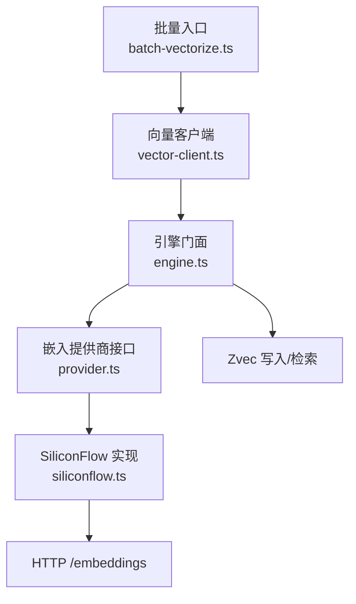
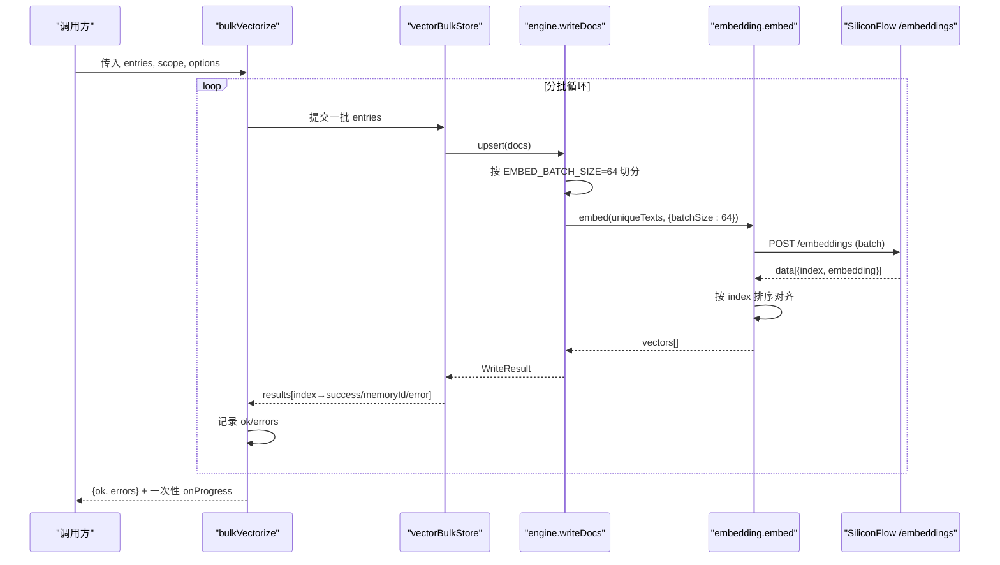
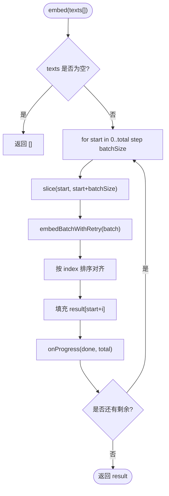
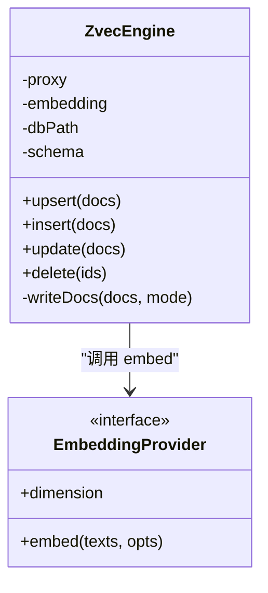
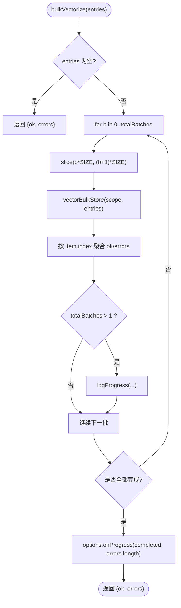
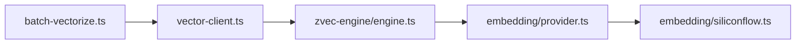

# 批量嵌入处理

<cite>
**本文引用的文件**
- [src/lib/batch-vectorize.ts](file://src/lib/batch-vectorize.ts)
- [src/zvec-engine/embedding/siliconflow.ts](file://src/zvec-engine/embedding/siliconflow.ts)
- [src/zvec-engine/embedding/provider.ts](file://src/zvec-engine/embedding/provider.ts)
- [src/zvec-engine/engine.ts](file://src/zvec-engine/engine.ts)
- [src/lib/vector-client.ts](file://src/lib/vector-client.ts)
- [src/lib/progress.ts](file://src/lib/progress.ts)
</cite>

## 目录
1. [简介](#简介)
2. [项目结构](#项目结构)
3. [核心组件](#核心组件)
4. [架构总览](#架构总览)
5. [详细组件分析](#详细组件分析)
6. [依赖关系分析](#依赖关系分析)
7. [性能考量](#性能考量)
8. [故障排查指南](#故障排查指南)
9. [结论](#结论)
10. [附录：配置与最佳实践](#附录配置与最佳实践)

## 简介
本文聚焦 SiliconFlow 批量嵌入处理的实现与优化，覆盖以下关键点：
- embed 方法的实现原理、文本分块策略与批大小控制
- 默认批大小 64 的选择依据与性能权衡
- 批间串行执行机制，避免触发 API 限流的设计决策
- 进度回调 onProgress 的使用方法与最佳实践
- 结果聚合算法与按 index 排序对齐输入顺序的防御性编程
- 内存管理与大数据集处理策略
- 不同场景下的批量处理配置建议（小批量快速处理 vs 大批量高效处理）
- 性能调优建议与监控指标

## 项目结构
本功能涉及三层协作：
- 上层批量编排：batch-vectorize.ts 负责将待向量化条目分批提交到向量存储层
- 引擎写入与嵌入调度：engine.ts 在写入前按固定小批切分并调用 EmbeddingProvider
- 提供商实现：siliconflow.ts 提供 SiliconFlow 兼容的 /embeddings 调用，含重试、超时、进度回调与结果排序

图表来源
- [src/lib/batch-vectorize.ts:129-182](file://src/lib/batch-vectorize.ts#L129-L182)
- [src/zvec-engine/engine.ts:330-449](file://src/zvec-engine/engine.ts#L330-L449)
- [src/zvec-engine/embedding/siliconflow.ts:77-102](file://src/zvec-engine/embedding/siliconflow.ts#L77-L102)
- [src/zvec-engine/embedding/provider.ts:9-28](file://src/zvec-engine/embedding/provider.ts#L9-L28)

章节来源
- [src/lib/batch-vectorize.ts:1-183](file://src/lib/batch-vectorize.ts#L1-L183)
- [src/zvec-engine/engine.ts:1-569](file://src/zvec-engine/engine.ts#L1-L569)
- [src/zvec-engine/embedding/siliconflow.ts:1-234](file://src/zvec-engine/embedding/siliconflow.ts#L1-L234)
- [src/zvec-engine/embedding/provider.ts:1-29](file://src/zvec-engine/embedding/provider.ts#L1-L29)
- [src/lib/vector-client.ts:547-590](file://src/lib/vector-client.ts#L547-L590)

## 核心组件
- 批量向量化（bulkVectorize）：将 entries 按固定批次切片，逐批调用 vectorBulkStore；每批完成后输出进度；最终汇总成功/失败并一次性回调 onProgress
- 引擎写入（engine.writeDocs）：对需要嵌入的文档按 EMBED_BATCH_SIZE=64 切分，调用 embedding.embed；批内去重减少重复 HTTP 调用；失败项标记为 EMBEDDING_FAILED 并跳过写入
- SiliconFlow Provider（embed）：按 batchSize 切分文本，逐批调用 /embeddings；支持指数退避重试、超时、onProgress；返回结果按 index 排序以对齐输入顺序
- 向量客户端（vectorBulkStore）：构造 doc id（基于 text+scope+tag），组装字段后调用 engine.upsert；返回逐项结果（index→success/memoryId/error）

章节来源
- [src/lib/batch-vectorize.ts:129-182](file://src/lib/batch-vectorize.ts#L129-L182)
- [src/zvec-engine/engine.ts:330-449](file://src/zvec-engine/engine.ts#L330-L449)
- [src/zvec-engine/embedding/siliconflow.ts:77-102](file://src/zvec-engine/embedding/siliconflow.ts#L77-L102)
- [src/lib/vector-client.ts:547-590](file://src/lib/vector-client.ts#L547-L590)

## 架构总览
整体流程如下：
- 上层 bulkVectorize 将 entries 切分为多批（VECTORIZE_BATCH_SIZE=200），逐批调用 vectorBulkStore
- vectorBulkStore 生成 doc id 并调用 engine.upsert
- engine.writeDocs 将需嵌入的文档按 EMBED_BATCH_SIZE=64 切分，调用 embedding.embed
- siliconflow.embed 按 batchSize 切分文本，逐批请求 /embeddings，支持重试与超时，并在每批完成后触发 onProgress
- 返回结果经排序对齐后回写至 result[start+i]，保证顺序一致

图表来源
- [src/lib/batch-vectorize.ts:129-182](file://src/lib/batch-vectorize.ts#L129-L182)
- [src/zvec-engine/engine.ts:330-449](file://src/zvec-engine/engine.ts#L330-L449)
- [src/zvec-engine/embedding/siliconflow.ts:77-102](file://src/zvec-engine/embedding/siliconflow.ts#L77-L102)
- [src/lib/vector-client.ts:547-590](file://src/lib/vector-client.ts#L547-L590)

## 详细组件分析

### SiliconFlow 嵌入实现（siliconflow.ts）
- 批大小与默认值
  - DEFAULT_BATCH_SIZE = 64，作为单次 HTTP 请求的文本数量上限
  - 通过 EmbedOptions.batchSize 可覆盖默认值
- 批间串行与限流防护
  - embed 外层 for 循环按 batchSize 推进，await 每批完成后再进入下一批，天然串行
  - 结合指数退避与 Retry-After 解析，遇到 429/5xx/网络错误自动重试，非 429 的 4xx 不重试
- 超时与健壮性
  - 单批请求使用 AbortController 设置 timeoutMs（默认 30000ms）
  - 响应长度校验、维度校验、embedding 类型校验，异常携带 nonRetryable 标记
- 结果对齐
  - 对 provider 返回的 data 按 index 升序排序，再映射为与输入一一对应的向量数组，防止乱序导致错位
- 进度回调
  - 每批完成后调用 onProgress(done, total)，便于上层展示进度或持久化中间状态

图表来源
- [src/zvec-engine/embedding/siliconflow.ts:77-102](file://src/zvec-engine/embedding/siliconflow.ts#L77-L102)
- [src/zvec-engine/embedding/siliconflow.ts:130-202](file://src/zvec-engine/embedding/siliconflow.ts#L130-L202)

章节来源
- [src/zvec-engine/embedding/siliconflow.ts:1-234](file://src/zvec-engine/embedding/siliconflow.ts#L1-L234)
- [src/zvec-engine/embedding/provider.ts:9-28](file://src/zvec-engine/embedding/provider.ts#L9-L28)

### 引擎写入与嵌入调度（engine.ts）
- 写入前切分与去重
  - needsEmbed 列表按 EMBED_BATCH_SIZE=64 切分
  - 批内按 text 去重，避免同一文本多次 HTTP 调用（如多 tag 场景）
- 失败粒度
  - 某批 embed 失败仅将该批 doc 标记为 EMBEDDING_FAILED，不影响其他批次与 noEmbed 组
- 维度与字段校验
  - 向量维度必须等于 collection.dimension
  - fields 白名单校验，非法字段直接报错
- 写入 worker
  - 将 Float32Array 向量与 fields 发送至 worker 进行 upsert/insert/update/delete

图表来源
- [src/zvec-engine/engine.ts:68-93](file://src/zvec-engine/engine.ts#L68-L93)
- [src/zvec-engine/engine.ts:330-449](file://src/zvec-engine/engine.ts#L330-L449)
- [src/zvec-engine/embedding/provider.ts:20-28](file://src/zvec-engine/embedding/provider.ts#L20-L28)

章节来源
- [src/zvec-engine/engine.ts:330-449](file://src/zvec-engine/engine.ts#L330-L449)

### 批量向量化入口（batch-vectorize.ts）
- 分批大小
  - VECTORIZE_BATCH_SIZE = 200，用于上层 bulkVectorize 的分批提交，避免一次性提交全部条目无中间态
- 批间进度反馈
  - 多批时通过 logProgress 输出批次进度，单批场景不刷屏
- 结果聚合
  - 根据 item.index 反查 slice 中的 entry，将 success 的 memoryId 写入 ok Map，失败项加入 errors
- 一次性 onProgress
  - 全部批次完成后，将 completed 列表与 failedCount 一次性回调给调用方，便于增量保存进度

图表来源
- [src/lib/batch-vectorize.ts:129-182](file://src/lib/batch-vectorize.ts#L129-L182)

章节来源
- [src/lib/batch-vectorize.ts:1-183](file://src/lib/batch-vectorize.ts#L1-L183)

### 向量客户端（vector-client.ts）
- 批量存储
  - vectorBulkStore 将 entries 转换为 docs（id=sha256(text+scope+tag)），调用 engine.upsert
  - 将 WriteResult.errors 映射为 index→error，形成 BulkStoreItemResult 列表
- 单条存储
  - vectorStore 同样生成 doc id 并 upsert，适合增量 modify/add

章节来源
- [src/lib/vector-client.ts:547-590](file://src/lib/vector-client.ts#L547-L590)
- [src/lib/vector-client.ts:513-542](file://src/lib/vector-client.ts#L513-L542)

## 依赖关系分析
- batch-vectorize.ts 依赖 vector-client.ts 提供的 vectorBulkStore/vectorStore/vectorDelete
- vector-client.ts 依赖 zvec-engine 的 ZvecEngine（通过 dist 加载），内部构建 SiliconFlowProvider
- engine.ts 依赖 EmbeddingProvider 接口，实际由 SiliconFlowProvider 实现
- siliconflow.ts 依赖 HTTP fetch 与自定义错误类型，实现重试、超时、进度回调与结果排序

图表来源
- [src/lib/batch-vectorize.ts:17-19](file://src/lib/batch-vectorize.ts#L17-L19)
- [src/lib/vector-client.ts:21-31](file://src/lib/vector-client.ts#L21-L31)
- [src/zvec-engine/engine.ts:27-30](file://src/zvec-engine/engine.ts#L27-L30)
- [src/zvec-engine/embedding/siliconflow.ts:13-15](file://src/zvec-engine/embedding/siliconflow.ts#L13-L15)

章节来源
- [src/lib/batch-vectorize.ts:1-183](file://src/lib/batch-vectorize.ts#L1-L183)
- [src/lib/vector-client.ts:1-754](file://src/lib/vector-client.ts#L1-L754)
- [src/zvec-engine/engine.ts:1-569](file://src/zvec-engine/engine.ts#L1-L569)
- [src/zvec-engine/embedding/siliconflow.ts:1-234](file://src/zvec-engine/embedding/siliconflow.ts#L1-L234)

## 性能考量
- 批大小选择
  - SiliconFlow 默认 batchSize=64：平衡单次请求体积与失败粒度，避免过大请求触发限流或超时
  - 引擎写入 EMBED_BATCH_SIZE=64：与 provider 默认对齐，使一次失败恰好对应一次 HTTP 调用，提升定位效率
  - 上层 bulkVectorize 使用 200 条/批：降低频繁 I/O 开销，同时保留中间态以便进度反馈
- 批间串行
  - embed 外层 for 循环 await 每批完成，天然串行，避免并发请求触发 429
  - 配合指数退避与 Retry-After 解析，提高在抖动环境下的成功率
- 批内去重
  - engine.writeDocs 在批内按 text 去重，减少重复 HTTP 调用（如多 tag 场景）
- 超时与重试
  - 单批超时默认 30s，网络错误与 5xx/429 可重试，非 429 的 4xx 不可重试
- 内存管理
  - 结果数组按索引填充，避免额外拷贝；Float32Array 传输降低序列化开销
  - 大库下分批提交，避免一次性构建超大对象导致内存峰值过高
- 监控指标建议
  - 每批耗时、成功率、失败原因分布（HTTP 状态码、NETWORK、TIMEOUT）
  - 平均/中位延迟、P95/P99 延迟
  - 重试次数与退避时长分布
  - 批大小命中率（实际 batch 大小与期望对比）

[本节为通用性能讨论，不直接分析具体文件]

## 故障排查指南
- 常见错误与定位
  - HTTP 4xx（非 429）：nonRetryable=true，检查模型名、baseURL、apiKey、text 长度限制
  - 429/5xx：自动重试，关注 Retry-After 与退避策略
  - 网络错误：NETWORK 错误，检查网络连通性与代理配置
  - 维度不匹配：expectedDim vs actualDim，确认 collection.dimension 与 embedding.dimension 一致
  - 响应数据长度不一致：data.length !== batch.length，检查 provider 行为
- 进度与中断
  - onProgress 可用于断点续跑与增量保存；若进程被中断，下次可从已完成的 completed 列表恢复
- 向量库锁与损坏
  - 向量库被占用或损坏时，参考 ensureVectorAvailable 提示进行重建或等待释放

章节来源
- [src/zvec-engine/embedding/siliconflow.ts:130-202](file://src/zvec-engine/embedding/siliconflow.ts#L130-L202)
- [src/lib/vector-client.ts:420-467](file://src/lib/vector-client.ts#L420-L467)

## 结论
- 通过“上层分批（200）+ 引擎小批（64）+ provider 小批（64）”的多层切分，既保证了吞吐，又控制了失败粒度与限流风险
- 批间串行与重试退避有效应对 API 抖动与限流
- 结果按 index 排序对齐输入顺序，确保幂等与一致性
- onProgress 提供细粒度进度与中断恢复能力
- 针对不同场景可灵活调整批大小与超时，以获得最佳性能与稳定性

[本节为总结性内容，不直接分析具体文件]

## 附录：配置与最佳实践

### 默认参数与覆盖方式
- SiliconFlow 默认
  - baseURL: https://api.siliconflow.cn/v1
  - model: Qwen/Qwen3-Embedding-8B
  - dimension: 4096
  - retries: 3
  - batchSize: 64
  - timeoutMs: 30000
- 覆盖方式
  - 通过 EmbedOptions 传入 retries、batchSize、timeoutMs、onProgress
  - 通过 SiliconFlowProviderConfig 传入 apiKey、baseURL、model、dimension

章节来源
- [src/zvec-engine/embedding/siliconflow.ts:26-32](file://src/zvec-engine/embedding/siliconflow.ts#L26-L32)
- [src/zvec-engine/embedding/provider.ts:9-18](file://src/zvec-engine/embedding/provider.ts#L9-L18)
- [src/lib/config.ts:132-137](file://src/lib/config.ts#L132-L137)

### 不同场景的批量处理配置建议
- 小批量快速处理（交互式/低延迟）
  - 目标：尽快返回少量结果
  - 建议：batchSize 保持 64 或更小；timeoutMs 适当缩短；onProgress 高频回调
  - 适用：在线服务、MCP 短请求
- 大批量高效处理（导入/离线任务）
  - 目标：最大化吞吐，降低往返次数
  - 建议：上层 VECTORIZE_BATCH_SIZE 维持 200；provider batchSize 保持 64；timeoutMs 适当延长；开启 onProgress 持久化进度
  - 适用：批量导入、定时任务
- 高抖动/限流环境
  - 建议：retries 提升至 5；启用指数退避；必要时降低 batchSize 至 32；监控 429 比例并动态调整

章节来源
- [src/lib/batch-vectorize.ts:129-182](file://src/lib/batch-vectorize.ts#L129-L182)
- [src/zvec-engine/embedding/siliconflow.ts:77-102](file://src/zvec-engine/embedding/siliconflow.ts#L77-L102)
- [src/zvec-engine/engine.ts:330-449](file://src/zvec-engine/engine.ts#L330-L449)

### 进度回调 onProgress 使用方法与最佳实践
- 使用方法
  - 在 siliconflow.embed 中，每批完成后调用 onProgress(done, total)
  - 在 bulkVectorize 中，全部批次完成后一次性回调 onProgress(completed, failedCount)
- 最佳实践
  - 将 completed 列表持久化，支持中断恢复
  - 在非 TTY 环境下，logProgress 会逐行输出，便于日志采集
  - 避免在 onProgress 中执行阻塞操作，以免影响主流程

章节来源
- [src/zvec-engine/embedding/siliconflow.ts:77-102](file://src/zvec-engine/embedding/siliconflow.ts#L77-L102)
- [src/lib/batch-vectorize.ts:175-179](file://src/lib/batch-vectorize.ts#L175-L179)
- [src/lib/progress.ts:36-49](file://src/lib/progress.ts#L36-L49)

### 结果聚合与顺序对齐
- 引擎层
  - engine.writeDocs 按 EMBED_BATCH_SIZE 切分，批内去重后调用 embed，失败项标记为 EMBEDDING_FAILED
- Provider 层
  - siliconflow.embed 对返回的 data 按 index 排序，再映射为 result[start+i]，确保顺序一致
- 上层层
  - batch-vectorize.bulkVectorize 按 item.index 反查 entry，聚合 ok/errors

章节来源
- [src/zvec-engine/engine.ts:330-449](file://src/zvec-engine/engine.ts#L330-L449)
- [src/zvec-engine/embedding/siliconflow.ts:168-184](file://src/zvec-engine/embedding/siliconflow.ts#L168-L184)
- [src/lib/batch-vectorize.ts:154-162](file://src/lib/batch-vectorize.ts#L154-L162)