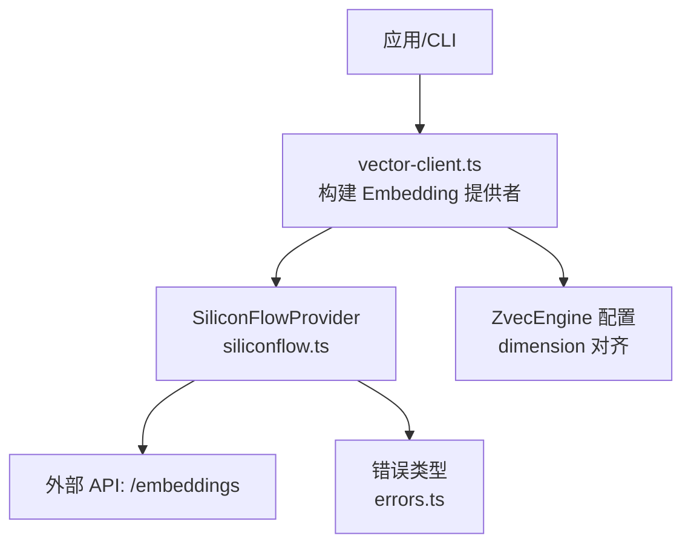
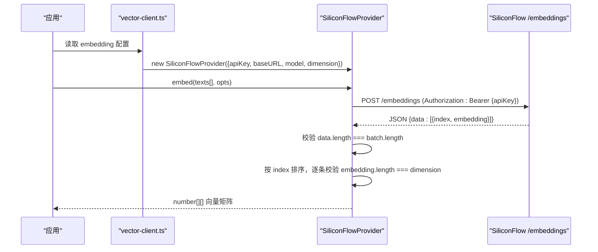
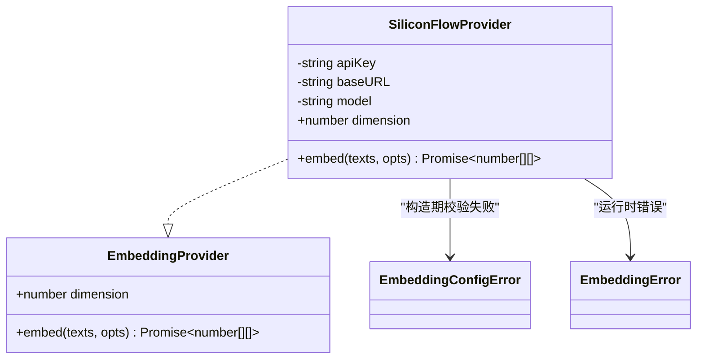

# 配置与初始化

<cite>
**本文引用的文件**
- [siliconflow.ts](file://src/zvec-engine/embedding/siliconflow.ts)
- [provider.ts](file://src/zvec-engine/embedding/provider.ts)
- [errors.ts](file://src/zvec-engine/errors.ts)
- [vector-client.ts](file://src/lib/vector-client.ts)
- [config.ts](file://src/config.ts)
- [configuration.md](file://docs/configuration.md)
</cite>

## 目录
1. [简介](#简介)
2. [项目结构](#项目结构)
3. [核心组件](#核心组件)
4. [架构总览](#架构总览)
5. [详细组件分析](#详细组件分析)
6. [依赖关系分析](#依赖关系分析)
7. [性能考量](#性能考量)
8. [故障排查指南](#故障排查指南)
9. [结论](#结论)
10. [附录：配置示例](#附录配置示例)

## 简介
本章节面向使用 SiliconFlow 提供商进行文本向量化（Embedding）的配置与初始化。重点说明 SiliconFlowProviderConfig 接口的全部配置项、环境变量注入方式、基础 URL 自定义、模型选择策略、维度校验机制，以及最小化与生产环境推荐配置，并给出常见错误的处理思路与排障步骤。

## 项目结构
SiliconFlow 的 Embedding 能力位于向量引擎子模块 embedding 中，通过统一的 EmbeddingProvider 抽象对外暴露；上层 vector-client 负责从配置文件加载 embedding 参数并构造 SiliconFlowProvider；错误类型集中在 errors 模块，便于跨线程/协议序列化。

图表来源
- [vector-client.ts:247-265](file://src/lib/vector-client.ts#L247-L265)
- [siliconflow.ts:16-75](file://src/zvec-engine/embedding/siliconflow.ts#L16-L75)
- [errors.ts:56-61](file://src/zvec-engine/errors.ts#L56-L61)

章节来源
- [siliconflow.ts:1-75](file://src/zvec-engine/embedding/siliconflow.ts#L1-L75)
- [provider.ts:9-28](file://src/zvec-engine/embedding/provider.ts#L9-L28)
- [vector-client.ts:247-293](file://src/lib/vector-client.ts#L247-L293)
- [errors.ts:56-61](file://src/zvec-engine/errors.ts#L56-L61)

## 核心组件
- SiliconFlowProviderConfig：定义 SiliconFlow 提供商所需的配置项，包括 apiKey、baseURL、model、dimension 等。
- SiliconFlowProvider：实现 EmbeddingProvider 接口，封装网络请求、重试、超时、维度校验等逻辑。
- EmbeddingProvider：统一抽象，要求 embed 返回的每条向量长度等于 dimension，且数组长度与输入一致。
- 错误体系：EmbeddingConfigError、EmbeddingError 等用于配置与运行时异常的统一表达。

章节来源
- [siliconflow.ts:16-75](file://src/zvec-engine/embedding/siliconflow.ts#L16-L75)
- [provider.ts:9-28](file://src/zvec-engine/embedding/provider.ts#L9-L28)
- [errors.ts:56-61](file://src/zvec-engine/errors.ts#L56-L61)

## 架构总览
下图展示从配置到向量生成的完整调用链：配置加载 → 构建 Embedding 提供者 → 发起批量嵌入请求 → 响应校验与排序 → 返回向量矩阵。

图表来源
- [vector-client.ts:247-265](file://src/lib/vector-client.ts#L247-L265)
- [siliconflow.ts:77-101](file://src/zvec-engine/embedding/siliconflow.ts#L77-L101)
- [siliconflow.ts:130-184](file://src/zvec-engine/embedding/siliconflow.ts#L130-L184)

## 详细组件分析

### SiliconFlowProviderConfig 配置项详解
- apiKey
  - 作用：认证令牌，用于访问 SiliconFlow /embeddings 接口。
  - 默认值：无。若未提供，构造函数会抛出配置错误。
  - 获取与设置：
    - 直接传入 config.apiKey。
    - 或设置环境变量 SILICONFLOW_API_KEY，构造函数会优先读取该环境变量。
    - 在配置文件中可通过 ${VAR_NAME} 引用环境变量（KI 层解析后注入）。
  - 注意：vector-client 层对配置中的 apiKey 做显式检查，缺失即 fail-loud，避免误用其他厂商密钥。
- baseURL
  - 作用：指定 Embedding 服务的基础地址，决定实际对接的端点。
  - 默认值：https://api.siliconflow.cn/v1。
  - 自定义：可替换为任意 OpenAI 兼容端点；但需确保该端点支持 /embeddings 及相同请求/响应格式。
  - 校验：必须以 https:// 开头，否则抛配置错误；末尾多余斜杠会被规范化去除。
- model
  - 作用：指定使用的 Embedding 模型名称。
  - 默认值：Qwen/Qwen3-Embedding-8B。
  - 建议：保持与 collection.dimension 匹配；不同模型的输出维度可能不同。
- dimension
  - 作用：期望的向量维度，必须与集合 schema 的 dimension 严格一致。
  - 默认值：4096。
  - 校验：必须为正整数；否则抛配置错误。
  - 运行时一致性：每次响应中的 embedding 长度会与 dimension 比较，不一致将抛运行时错误。
- fetchImpl（测试注入）
  - 作用：允许单测注入自定义 fetch，便于隔离网络依赖。
  - 默认：使用全局 fetch。

章节来源
- [siliconflow.ts:16-75](file://src/zvec-engine/embedding/siliconflow.ts#L16-L75)
- [vector-client.ts:247-265](file://src/lib/vector-client.ts#L247-L265)
- [configuration.md:67-88](file://docs/configuration.md#L67-L88)

### 环境变量 SILICONFLOW_API_KEY 的使用
- 优先级：config.apiKey 存在则使用；否则回退到 process.env.SILICONFLOW_API_KEY；两者均不存在则抛配置错误。
- 安全建议：在生产环境中优先通过环境变量注入密钥，避免明文写入配置文件。
- 配置模板中可使用 ${SILICONFLOW_API_KEY} 形式引用环境变量，由 KI 配置层解析后注入到 provider。

章节来源
- [siliconflow.ts:51-57](file://src/zvec-engine/embedding/siliconflow.ts#L51-L57)
- [config.ts:90-99](file://src/config.ts#L90-L99)
- [configuration.md:71-88](file://docs/configuration.md#L71-L88)

### 基础 URL 自定义与多端点接入
- 默认端点：https://api.siliconflow.cn/v1。
- 自定义方法：修改 embedding.baseURL 指向目标端点（例如私有部署或其他兼容服务）。
- 约束：必须以 https:// 开头；否则会触发配置错误。
- 注意事项：更换 baseURL 时，需确认新端点的 /embeddings 接口契约与当前实现一致（请求体包含 model 和 input，响应体包含 data[index, embedding]）。

章节来源
- [siliconflow.ts:64-72](file://src/zvec-engine/embedding/siliconflow.ts#L64-L72)
- [configuration.md:71-88](file://docs/configuration.md#L71-L88)

### 模型选择策略与默认模型 Qwen/Qwen3-Embedding-8B
- 默认模型：Qwen/Qwen3-Embedding-8B。
- 特点与性能考虑：
  - 作为默认模型，兼顾质量与成本；如需更高精度或更低延迟，可按业务需求切换至其他兼容模型。
  - 不同模型的输出维度可能不同，务必同步调整 dimension 以保持一致性。
  - 批大小与超时可根据模型吞吐与限流策略调优（见“性能考量”）。

章节来源
- [siliconflow.ts:26-28](file://src/zvec-engine/embedding/siliconflow.ts#L26-L28)
- [configuration.md:71-88](file://docs/configuration.md#L71-L88)

### 维度配置的验证机制
- 构造期校验：dimension 必须为正整数，否则抛配置错误。
- 运行时校验：
  - 响应 data 长度必须与批次大小一致，否则抛运行时错误。
  - 每个 embedding 的长度必须等于 dimension，否则抛运行时错误。
  - 响应数据按 index 排序，保证与输入顺序一致。
- 与集合 schema 的一致性：embedding.provider.dimension 必须等于 ZvecEngineConfig.collection.dimension，否则后续检索/相似度计算会出现维度不匹配问题。

章节来源
- [siliconflow.ts:58-63](file://src/zvec-engine/embedding/siliconflow.ts#L58-L63)
- [siliconflow.ts:160-184](file://src/zvec-engine/embedding/siliconflow.ts#L160-L184)
- [provider.ts:20-27](file://src/zvec-engine/embedding/provider.ts#L20-L27)

### 批处理、重试与超时
- 批处理：默认批次大小为 64，可按需通过 EmbedOptions.batchSize 调整，避免触发服务端限流。
- 重试策略：
  - 对 5xx、429 以及网络错误进行指数退避重试，最多重试次数由 EmbedOptions.retries 控制（默认 3）。
  - 非 429 的 4xx 错误与响应结构错误标记为非可重试，直接抛出。
  - 支持读取响应头 Retry-After 决定等待时间。
- 超时：默认单批超时 30000ms，可通过 EmbedOptions.timeoutMs 调整。

章节来源
- [siliconflow.ts:77-128](file://src/zvec-engine/embedding/siliconflow.ts#L77-L128)
- [siliconflow.ts:130-202](file://src/zvec-engine/embedding/siliconflow.ts#L130-L202)
- [provider.ts:9-18](file://src/zvec-engine/embedding/provider.ts#L9-L18)

## 依赖关系分析
- vector-client 从配置加载 embedding 参数，构造 SiliconFlowProvider，并将 dimension 透传到 ZvecEngine 集合创建/打开流程，确保维度一致。
- SiliconFlowProvider 依赖 errors 模块的错误类型，统一向上抛出 EmbeddingConfigError（配置阶段）与 EmbeddingError（运行阶段）。
- EmbeddingProvider 抽象约束了 embed 的输入输出语义，便于未来扩展其他提供商。

图表来源
- [provider.ts:20-28](file://src/zvec-engine/embedding/provider.ts#L20-L28)
- [siliconflow.ts:43-75](file://src/zvec-engine/embedding/siliconflow.ts#L43-L75)
- [errors.ts:56-61](file://src/zvec-engine/errors.ts#L56-L61)

章节来源
- [vector-client.ts:247-293](file://src/lib/vector-client.ts#L247-L293)
- [siliconflow.ts:43-75](file://src/zvec-engine/embedding/siliconflow.ts#L43-L75)
- [errors.ts:56-61](file://src/zvec-engine/errors.ts#L56-L61)

## 性能考量
- 批大小（batchSize）：默认 64，适合大多数场景；在高并发或受限网络环境下可适当降低以避免限流。
- 重试次数（retries）：默认 3；对于不稳定网络可适当提高，但需结合后端限流策略。
- 超时（timeoutMs）：默认 30000ms；长文本或高负载时可适当增大。
- 进度回调（onProgress）：可用于监控批处理进度，便于前端或日志记录。
- 模型选择：根据精度与延迟需求选择合适的模型；大模型通常更准确但耗时更长。

[本节为通用指导，不直接分析具体文件]

## 故障排查指南
- 缺少 API Key
  - 现象：构造 SiliconFlowProvider 时报配置错误。
  - 处理：确保提供 config.apiKey 或设置环境变量 SILICONFLOW_API_KEY；或在配置文件中通过 ${VAR_NAME} 引用。
- baseURL 不合法
  - 现象：必须以 https:// 开头，否则抛配置错误。
  - 处理：修正 baseURL 前缀；如使用内部代理，确保走 HTTPS。
- 维度不匹配
  - 现象：响应 embedding 长度与配置 dimension 不一致，抛运行时错误。
  - 处理：核对模型输出维度与 collection.dimension；必要时重建集合或更换模型。
- 网络错误或超时
  - 现象：网络错误被包装为 EmbeddingError，带 code=NETWORK；超时为 TIMEOUT。
  - 处理：检查网络连通性与防火墙；适当增大 timeoutMs 或 retries。
- 服务端限流
  - 现象：收到 429，自动按 Retry-After 或指数退避重试。
  - 处理：降低 batchSize 或增加重试间隔；必要时升级配额。
- 响应结构异常
  - 现象：data 长度与批次不一致或缺少 embedding 字段，抛运行时错误。
  - 处理：检查服务端版本与接口契约；必要时降级或回滚。

章节来源
- [siliconflow.ts:51-75](file://src/zvec-engine/embedding/siliconflow.ts#L51-L75)
- [siliconflow.ts:147-184](file://src/zvec-engine/embedding/siliconflow.ts#L147-L184)
- [errors.ts:56-61](file://src/zvec-engine/errors.ts#L56-L61)

## 结论
SiliconFlow 提供商通过清晰的配置接口与严格的校验机制，确保了向量维度的强一致性与运行时的健壮性。结合环境变量注入、可自定义的基础 URL、灵活的批处理与重试策略，能够适配从开发到生产的多种场景。建议在生产环境中采用最小化配置原则，并通过环境变量管理敏感信息，同时依据业务需求调优批大小、超时与重试策略。

[本节为总结性内容，不直接分析具体文件]

## 附录：配置示例

- 最小化配置（仅必填项）
  - 在 embedding 中提供 apiKey（明文或环境变量引用）、baseURL、model、dimension。
  - 参考路径：[configuration.md:71-88](file://docs/configuration.md#L71-L88)

- 生产环境推荐配置
  - 使用环境变量注入 apiKey，避免明文存储。
  - 固定 baseURL 为稳定端点，必要时切换至内部代理。
  - 明确 model 与 dimension，确保与集合 schema 一致。
  - 合理设置 batchSize、retries、timeoutMs，以平衡吞吐与稳定性。
  - 参考路径：[configuration.md:180-227](file://docs/configuration.md#L180-L227)

- 配置文件生成与编辑
  - 使用 ki config init 生成模板，再手动编辑 embedding 相关字段。
  - 参考路径：[configuration.md:20-23](file://docs/configuration.md#L20-L23)、[config.ts:128-176](file://src/config.ts#L128-L176)

章节来源
- [configuration.md:71-88](file://docs/configuration.md#L71-L88)
- [configuration.md:180-227](file://docs/configuration.md#L180-L227)
- [config.ts:128-176](file://src/config.ts#L128-L176)