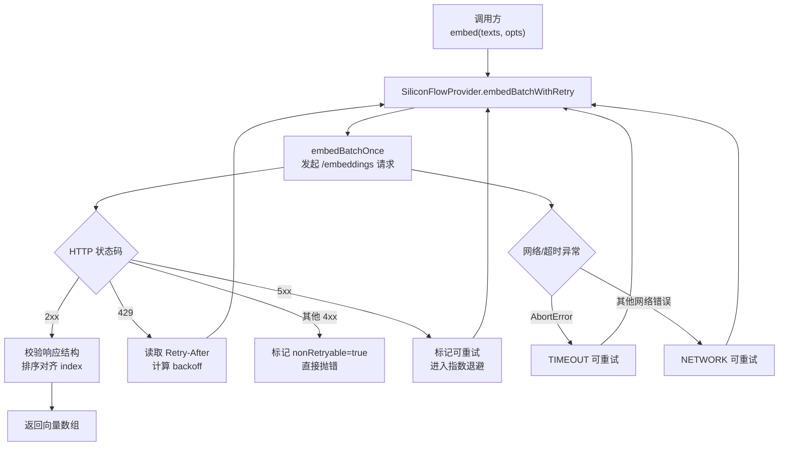
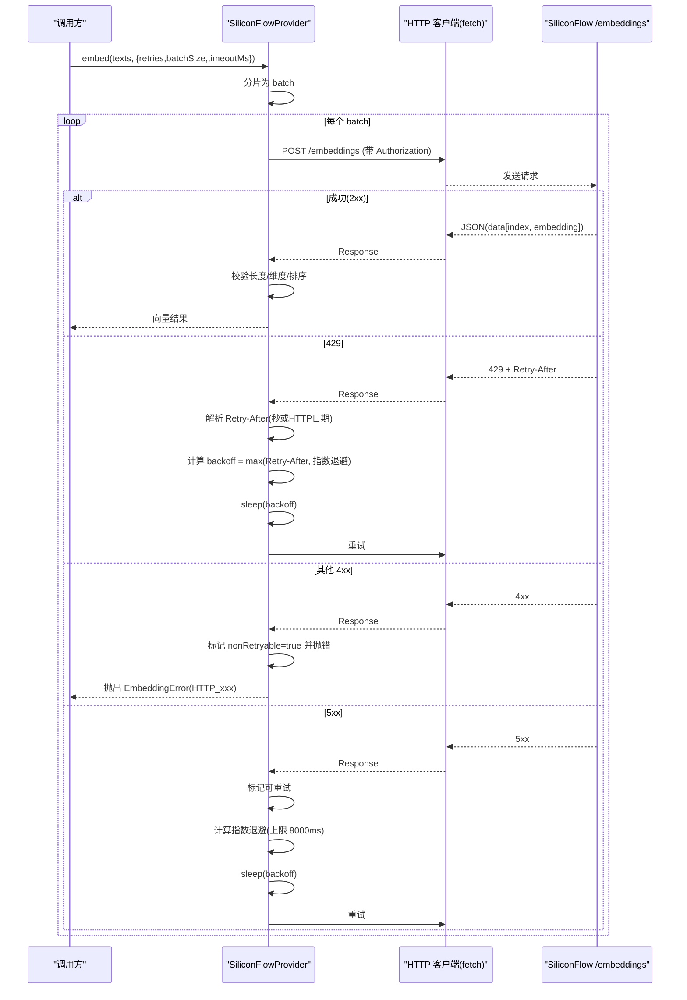
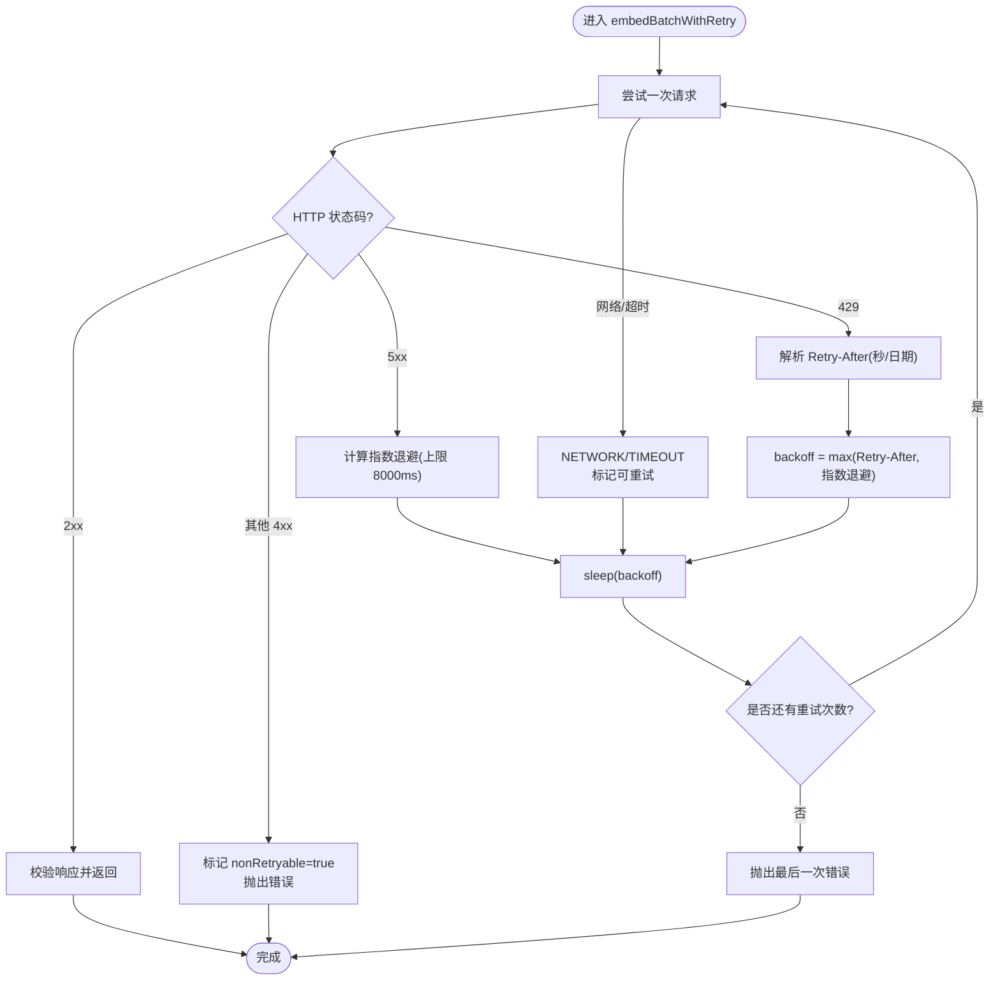
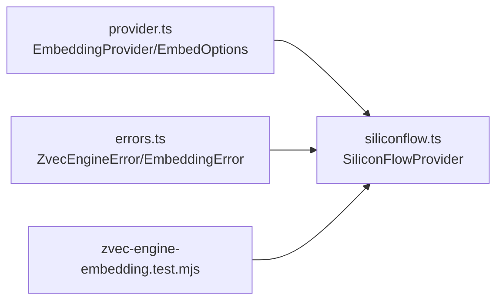

# 重试与错误恢复

<cite>
**本文引用的文件**
- [siliconflow.ts](file://src/zvec-engine/embedding/siliconflow.ts)
- [errors.ts](file://src/zvec-engine/errors.ts)
- [provider.ts](file://src/zvec-engine/embedding/provider.ts)
- [zvec-engine-embedding.test.mjs](file://test/zvec-engine-embedding.test.mjs)
</cite>

## 目录
1. [简介](#简介)
2. [项目结构](#项目结构)
3. [核心组件](#核心组件)
4. [架构总览](#架构总览)
5. [详细组件分析](#详细组件分析)
6. [依赖关系分析](#依赖关系分析)
7. [性能考量](#性能考量)
8. [故障诊断指南](#故障诊断指南)
9. [结论](#结论)

## 简介
本章节聚焦 SiliconFlow Embedding 提供者的重试机制与错误恢复策略，覆盖以下要点：
- 指数退避算法的实现、重试间隔计算公式与最大等待时间限制
- Retry-After 头部解析（秒数与 HTTP 日期格式）及优先级
- 可重试与不可重试错误的分类标准（HTTP 状态码判断逻辑）
- 网络异常处理策略（连接超时、DNS 解析失败等）
- 非重试错误的识别机制（4xx 除 429 外、响应结构错误）
- 错误信息的结构化设计（错误代码与数据字段）
- 常见错误场景与排障建议

## 项目结构
SiliconFlow 重试与错误恢复的核心实现位于 embedding 子模块中，围绕一个统一的 Provider 接口进行扩展。关键文件职责如下：
- siliconflow.ts：SiliconFlowProvider 的具体实现，包含请求、重试、退避、错误分类与结构化错误抛出
- provider.ts：EmbeddingProvider 抽象与 EmbedOptions 配置项定义
- errors.ts：统一错误基类与具体错误类型，承载 code 与 data 字段以支持跨层/跨进程序列化
- zvec-engine-embedding.test.mjs：覆盖重试、退避、Retry-After、错误分类等用例

图表来源
- [siliconflow.ts:77-128](file://src/zvec-engine/embedding/siliconflow.ts#L77-L128)
- [siliconflow.ts:130-202](file://src/zvec-engine/embedding/siliconflow.ts#L130-L202)

章节来源
- [siliconflow.ts:1-234](file://src/zvec-engine/embedding/siliconflow.ts#L1-L234)
- [provider.ts:9-28](file://src/zvec-engine/embedding/provider.ts#L9-L28)
- [errors.ts:11-30](file://src/zvec-engine/errors.ts#L11-L30)

## 核心组件
- SiliconFlowProvider：对外暴露 embed API，内部按批次串行调用，每批独立重试
- EmbeddingProvider/EmbedOptions：定义重试次数、分批大小、超时与进度回调
- ZvecEngineError/EmbeddingError：统一错误模型，携带 code 与 data 字段，便于上层分类与展示

章节来源
- [siliconflow.ts:43-102](file://src/zvec-engine/embedding/siliconflow.ts#L43-L102)
- [provider.ts:9-28](file://src/zvec-engine/embedding/provider.ts#L9-L28)
- [errors.ts:11-30](file://src/zvec-engine/errors.ts#L11-L30)

## 架构总览
下图展示了从调用到重试决策的完整流程，包括指数退避与 Retry-After 优先策略。

图表来源
- [siliconflow.ts:77-128](file://src/zvec-engine/embedding/siliconflow.ts#L77-L128)
- [siliconflow.ts:130-202](file://src/zvec-engine/embedding/siliconflow.ts#L130-L202)
- [siliconflow.ts:215-225](file://src/zvec-engine/embedding/siliconflow.ts#L215-L225)

## 详细组件分析

### 指数退避与最大等待时间
- 基础公式：backoff = min(1000 × 2^attempt, 8000) ms
  - attempt 从 0 开始递增；首次失败 attempt=0 → 1000ms，第二次 2000ms，第三次 4000ms，第四次 8000ms
  - 最大等待时间为 8000ms，避免无限增长
- 优先级：若存在 Retry-After，则优先使用其值（秒或 HTTP 日期），否则回退到指数退避
- 重试次数：由 EmbedOptions.retries 控制，默认 3；当达到 retries 仍失败时直接抛出最后一次错误

章节来源
- [siliconflow.ts:104-128](file://src/zvec-engine/embedding/siliconflow.ts#L104-L128)
- [siliconflow.ts:215-225](file://src/zvec-engine/embedding/siliconflow.ts#L215-L225)
- [provider.ts:9-18](file://src/zvec-engine/embedding/provider.ts#L9-L18)

### Retry-After 头部解析
- 支持两种格式：
  - 秒数：数值字符串，>=0 时转换为毫秒
  - HTTP 日期：使用 Date.parse 解析 UTC 时间，计算与当前时间的差值（仅正值有效）
- 解析失败或无效值时忽略，回退到指数退避

章节来源
- [siliconflow.ts:215-225](file://src/zvec-engine/embedding/siliconflow.ts#L215-L225)

### 可重试与不可重试错误分类
- 可重试：
  - 5xx 服务器错误
  - 429 Too Many Requests（限流）
  - 网络错误（fetch reject）
  - 超时（AbortError）
- 不可重试：
  - 其他 4xx（如 400、401、403、404 等）
  - 响应结构错误（data 数量不匹配、embedding 非数组、维度不匹配）
- 分类依据：
  - HTTP 状态码：status >= 400 && status < 500 && status !== 429 → nonRetryable = true
  - 响应结构校验失败：直接标记 nonRetryable = true

章节来源
- [siliconflow.ts:147-184](file://src/zvec-engine/embedding/siliconflow.ts#L147-L184)

### 网络异常处理策略
- 超时：通过 AbortController 在 timeoutMs 后中止请求，捕获 AbortError 并抛出 EmbeddingError(code='TIMEOUT', nonRetryable=false)
- 网络错误：catch 所有非 EmbeddingError 的网络异常，抛出 EmbeddingError(code='NETWORK', nonRetryable=false)
- DNS 解析失败、连接失败等均属于网络错误范畴，会被归类为 NETWORK 并允许重试

章节来源
- [siliconflow.ts:185-199](file://src/zvec-engine/embedding/siliconflow.ts#L185-L199)

### 非重试错误的识别机制
- 4xx（除 429）：nonRetryable = true，立即抛出，不进行重试
- 响应结构错误：
  - data 数量与输入不一致
  - embedding 不是数组
  - 维度与期望 dimension 不一致
  - 以上均标记 nonRetryable = true，直接抛出

章节来源
- [siliconflow.ts:159-184](file://src/zvec-engine/embedding/siliconflow.ts#L159-L184)

### 错误信息的结构化设计
- 基类：ZvecEngineError 提供 code 与 data 字段，用于统一错误模型
- EmbeddingError：继承自 ZvecEngineError，承载业务相关错误信息
- 常用 code：
  - HTTP_{status}：如 HTTP_401、HTTP_429、HTTP_503
  - TIMEOUT：请求超时
  - NETWORK：网络错误
- data 字段：
  - status：HTTP 状态码（HTTP_* 错误）
  - nonRetryable：是否不可重试（true/false）
  - retryAfterMs：解析后的 Retry-After 毫秒值（可选）
  - expectedDim/actualDim：维度不匹配时的期望与实际维度

章节来源
- [errors.ts:11-30](file://src/zvec-engine/errors.ts#L11-L30)
- [errors.ts:56-62](file://src/zvec-engine/errors.ts#L56-L62)
- [siliconflow.ts:147-184](file://src/zvec-engine/embedding/siliconflow.ts#L147-L184)

### 流程图：重试决策与退避

图表来源
- [siliconflow.ts:104-128](file://src/zvec-engine/embedding/siliconflow.ts#L104-L128)
- [siliconflow.ts:130-202](file://src/zvec-engine/embedding/siliconflow.ts#L130-L202)
- [siliconflow.ts:215-225](file://src/zvec-engine/embedding/siliconflow.ts#L215-L225)

## 依赖关系分析
- 模块内依赖：
  - siliconflow.ts 依赖 provider.ts 定义的 EmbeddingProvider 与 EmbedOptions
  - siliconflow.ts 依赖 errors.ts 中的 ZvecEngineError/EmbeddingError
- 测试依赖：
  - zvec-engine-embedding.test.mjs 通过注入 mock fetch 验证重试、退避、错误分类等行为

图表来源
- [provider.ts:9-28](file://src/zvec-engine/embedding/provider.ts#L9-L28)
- [errors.ts:11-30](file://src/zvec-engine/errors.ts#L11-L30)
- [siliconflow.ts:1-234](file://src/zvec-engine/embedding/siliconflow.ts#L1-L234)

章节来源
- [provider.ts:9-28](file://src/zvec-engine/embedding/provider.ts#L9-L28)
- [errors.ts:11-30](file://src/zvec-engine/errors.ts#L11-L30)
- [siliconflow.ts:1-234](file://src/zvec-engine/embedding/siliconflow.ts#L1-L234)

## 性能考量
- 分批串行：为避免触发服务端限流，批量请求按 batchSize 串行执行，降低并发压力
- 退避上限：指数退避上限 8000ms，防止长时间阻塞
- 超时控制：单批请求设置 timeoutMs，避免长尾请求影响整体吞吐
- 进度回调：onProgress 可用于监控处理进度，便于前端或日志系统反馈

[本节为通用指导，无需特定文件引用]

## 故障诊断指南
- 常见问题与定位
  - 401/403/404 等 4xx：检查 apiKey、baseURL、权限与资源路径；此类错误不会重试
  - 429 限流：关注 Retry-After，优先遵循服务端指示；适当降低请求频率或增大批次间隔
  - 5xx 服务错误：通常为临时性问题，会自动重试；若持续出现，需检查服务端健康状态
  - 网络错误/超时：检查网络连通性、DNS 解析、代理配置；必要时增大 timeoutMs 或调整重试次数
  - 响应结构错误：确认 provider 返回的 data 数量、embedding 类型与维度是否符合预期
- 排查步骤
  - 查看错误 code 与 data：根据 code（如 HTTP_429、TIMEOUT、NETWORK）快速定位问题类别
  - 检查 Retry-After：若存在，确保正确解析并等待足够时长
  - 调整参数：retries、batchSize、timeoutMs 可根据实际环境调优
  - 观察重试次数与耗时：结合 onProgress 与日志评估整体耗时与成功率

章节来源
- [siliconflow.ts:147-199](file://src/zvec-engine/embedding/siliconflow.ts#L147-L199)
- [zvec-engine-embedding.test.mjs:107-218](file://test/zvec-engine-embedding.test.mjs#L107-L218)

## 结论
SiliconFlow 的重试与错误恢复机制通过“指数退避 + Retry-After 优先”的策略，在保证稳定性的同时兼顾了用户体验。错误分类清晰、结构化错误信息便于上层处理与诊断。合理配置重试次数、批次大小与超时时间，可有效提升在高负载或网络不稳定环境下的鲁棒性。

[本节为总结性内容，无需特定文件引用]