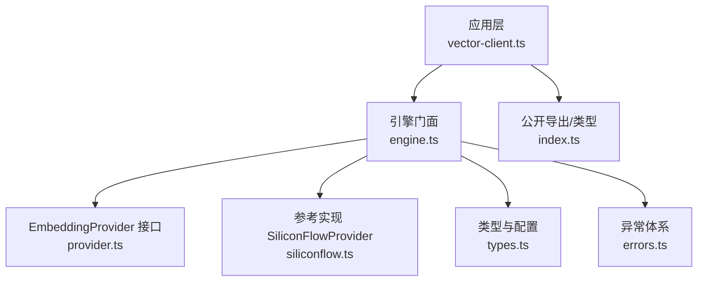
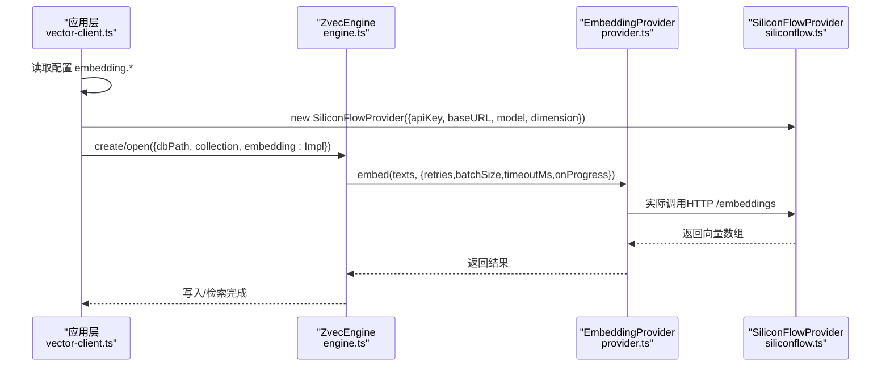
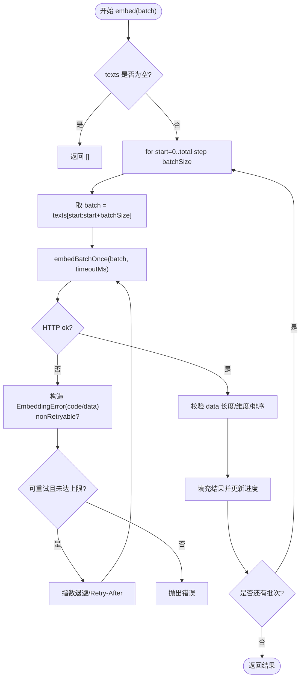
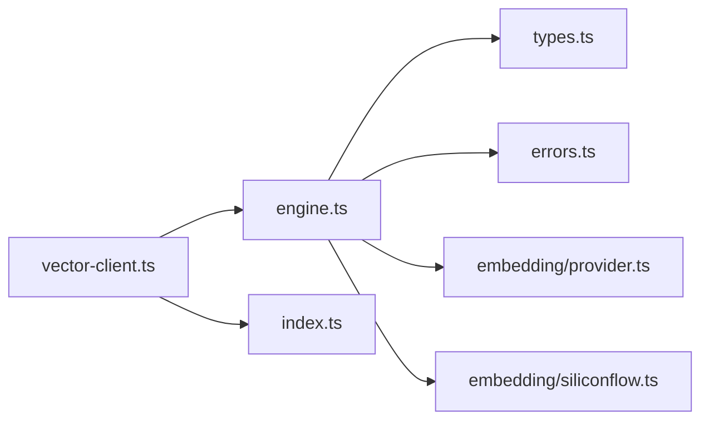

# 自定义提供商开发指南

<cite>
**本文引用的文件**
- [src/zvec-engine/embedding/provider.ts](file://src/zvec-engine/embedding/provider.ts)
- [src/zvec-engine/embedding/siliconflow.ts](file://src/zvec-engine/embedding/siliconflow.ts)
- [src/zvec-engine/types.ts](file://src/zvec-engine/types.ts)
- [src/zvec-engine/index.ts](file://src/zvec-engine/index.ts)
- [src/zvec-engine/errors.ts](file://src/zvec-engine/errors.ts)
- [src/zvec-engine/engine.ts](file://src/zvec-engine/engine.ts)
- [src/lib/vector-client.ts](file://src/lib/vector-client.ts)
- [test/zvec-engine-embedding.test.mjs](file://test/zvec-engine-embedding.test.mjs)
</cite>

## 目录
1. [简介](#简介)
2. [项目结构](#项目结构)
3. [核心组件](#核心组件)
4. [架构总览](#架构总览)
5. [详细组件分析](#详细组件分析)
6. [依赖关系分析](#依赖关系分析)
7. [性能考量](#性能考量)
8. [故障排查指南](#故障排查指南)
9. [结论](#结论)
10. [附录](#附录)

## 简介
本指南面向需要在系统中接入自定义 Embedding 提供商的开发者。你将了解：
- 如何实现 EmbeddingProvider 接口（必需方法与可选配置）
- 提供商在系统中的集成与使用方式（无需注册表，通过构造注入）
- 完整的参考实现要点（错误处理、重试逻辑、性能优化）
- 测试与验证方法，确保新提供商的正确性与稳定性
- 常见陷阱与解决方案，以及性能调优最佳实践

## 项目结构
与 Embedding 相关的代码集中在 zvec-engine 子模块中，并通过上层 vector-client 进行配置化构建与注入。关键路径如下：
- 抽象接口与选项定义：embedding/provider.ts
- 参考实现（SiliconFlow）：embedding/siliconflow.ts
- 引擎类型与配置：types.ts
- 引擎门面与导出：index.ts
- 引擎编排与嵌入调用：engine.ts
- 应用层配置与 provider 构建：vector-client.ts
- 异常体系：errors.ts
- 单元测试：test/zvec-engine-embedding.test.mjs

图表来源
- [src/lib/vector-client.ts:240-303](file://src/lib/vector-client.ts#L240-L303)
- [src/zvec-engine/engine.ts:68-131](file://src/zvec-engine/engine.ts#L68-L131)
- [src/zvec-engine/embedding/provider.ts:9-28](file://src/zvec-engine/embedding/provider.ts#L9-L28)
- [src/zvec-engine/embedding/siliconflow.ts:43-102](file://src/zvec-engine/embedding/siliconflow.ts#L43-L102)
- [src/zvec-engine/types.ts:41-61](file://src/zvec-engine/types.ts#L41-L61)
- [src/zvec-engine/index.ts:12-45](file://src/zvec-engine/index.ts#L12-L45)

章节来源
- [src/zvec-engine/embedding/provider.ts:9-28](file://src/zvec-engine/embedding/provider.ts#L9-L28)
- [src/zvec-engine/embedding/siliconflow.ts:43-102](file://src/zvec-engine/embedding/siliconflow.ts#L43-L102)
- [src/zvec-engine/types.ts:41-61](file://src/zvec-engine/types.ts#L41-L61)
- [src/zvec-engine/index.ts:12-45](file://src/zvec-engine/index.ts#L12-L45)
- [src/zvec-engine/engine.ts:68-131](file://src/zvec-engine/engine.ts#L68-L131)
- [src/lib/vector-client.ts:240-303](file://src/lib/vector-client.ts#L240-L303)

## 核心组件
- EmbeddingProvider 接口：定义 dimension 与 embed(texts, opts) 契约，要求返回向量维度一致且长度等于 texts.length。
- EmbedOptions：支持 retries、batchSize、timeoutMs、onProgress 等批处理与进度回调配置。
- SiliconFlowProvider：参考实现，展示 HTTP 调用、重试策略、超时控制、响应校验与排序对齐等完整流程。
- ZvecEngineConfig/ZvecEngineOpenConfig：在创建或打开引擎时注入 EmbeddingProvider。
- 异常体系：EmbeddingError、EmbeddingConfigError 等用于统一错误语义与可重试性标记。

章节来源
- [src/zvec-engine/embedding/provider.ts:9-28](file://src/zvec-engine/embedding/provider.ts#L9-L28)
- [src/zvec-engine/embedding/siliconflow.ts:16-75](file://src/zvec-engine/embedding/siliconflow.ts#L16-L75)
- [src/zvec-engine/types.ts:41-61](file://src/zvec-engine/types.ts#L41-L61)
- [src/zvec-engine/errors.ts:56-61](file://src/zvec-engine/errors.ts#L56-L61)

## 架构总览
系统不采用“注册表”机制发现提供商，而是通过构造参数将 EmbeddingProvider 实例注入到引擎配置中。应用层负责从配置读取并构建具体提供商实例，再交给引擎使用。

图表来源
- [src/lib/vector-client.ts:247-303](file://src/lib/vector-client.ts#L247-L303)
- [src/zvec-engine/engine.ts:97-131](file://src/zvec-engine/engine.ts#L97-L131)
- [src/zvec-engine/embedding/provider.ts:20-28](file://src/zvec-engine/embedding/provider.ts#L20-L28)
- [src/zvec-engine/embedding/siliconflow.ts:77-102](file://src/zvec-engine/embedding/siliconflow.ts#L77-L102)

## 详细组件分析

### EmbeddingProvider 接口与选项
- 必须属性：dimension（与集合维度严格一致）
- 必须方法：embed(texts, opts?) → Promise<number[][]>
- 可选配置（EmbedOptions）：
  - retries：失败重试次数
  - batchSize：分批大小（避免限流），失败粒度为小批
  - timeoutMs：单批超时
  - onProgress：进度回调（done, total）

章节来源
- [src/zvec-engine/embedding/provider.ts:9-28](file://src/zvec-engine/embedding/provider.ts#L9-L28)

### 参考实现：SiliconFlowProvider
- 配置项：apiKey（可从环境变量读取）、baseURL、model、dimension、fetchImpl（便于测试注入）
- 构造期校验：
  - apiKey 缺失抛 EmbeddingConfigError
  - dimension 非正整数抛 EmbeddingConfigError
  - baseURL 必须以 https:// 开头
- 批处理与重试：
  - 按 batchSize 切分文本，逐批调用
  - 指数退避 + Retry-After 优先；4xx（非429）不重试；5xx/429/网络错可重试
  - 超时以 AbortController 控制，抛出 TIMEOUT 错误（可重试）
- 响应校验：
  - data 数量与输入 batch 长度一致
  - 按 index 排序对齐输入顺序
  - 每条 embedding 维度与 dimension 一致
- 错误封装：
  - 所有异常包装为 EmbeddingError，携带 code 与 data（含 nonRetryable、retryAfterMs 等）

图表来源
- [src/zvec-engine/embedding/siliconflow.ts:77-102](file://src/zvec-engine/embedding/siliconflow.ts#L77-L102)
- [src/zvec-engine/embedding/siliconflow.ts:104-128](file://src/zvec-engine/embedding/siliconflow.ts#L104-L128)
- [src/zvec-engine/embedding/siliconflow.ts:130-202](file://src/zvec-engine/embedding/siliconflow.ts#L130-L202)

章节来源
- [src/zvec-engine/embedding/siliconflow.ts:16-75](file://src/zvec-engine/embedding/siliconflow.ts#L16-L75)
- [src/zvec-engine/embedding/siliconflow.ts:77-202](file://src/zvec-engine/embedding/siliconflow.ts#L77-L202)

### 引擎集成与使用
- 引擎创建/打开时接收 EmbeddingProvider 实例（ZvecEngineConfig.embedding / ZvecEngineOpenConfig.embedding）
- 引擎内部对写入和检索路径按需调用 embed，默认批大小为 64，与参考实现保持一致
- 探测健康状态时使用 dummyEmbeddingProvider（不会真正调用 embed）

章节来源
- [src/zvec-engine/types.ts:41-61](file://src/zvec-engine/types.ts#L41-L61)
- [src/zvec-engine/engine.ts:97-131](file://src/zvec-engine/engine.ts#L97-L131)
- [src/zvec-engine/engine.ts:530-540](file://src/zvec-engine/engine.ts#L530-L540)

### 应用层配置与构建
- vector-client 提供 buildEmbedding()，从配置读取 embedding.* 并构造 SiliconFlowProvider
- 若 apiKey 未配置则直接报错（fail-loud），避免隐式回退导致密钥误用
- 构建 create/open 配置时将 embedding 注入引擎

章节来源
- [src/lib/vector-client.ts:247-303](file://src/lib/vector-client.ts#L247-L303)

### 错误与重试约定
- EmbeddingError：承载 code 与 data，包含 nonRetryable、retryAfterMs、expectedDim/actualDim 等字段
- EmbeddingConfigError：构造期配置错误（如缺少 apiKey、非法 dimension/baseURL）
- 重试策略：
  - 5xx/429/网络错误：可重试，指数退避，优先使用 Retry-After
  - 4xx（非429）：不可重试，直接抛出
  - 超时：TIMEOUT，可重试
  - 响应结构/维度不一致：nonRetryable=true，直接抛出

章节来源
- [src/zvec-engine/errors.ts:56-61](file://src/zvec-engine/errors.ts#L56-L61)
- [src/zvec-engine/embedding/siliconflow.ts:104-128](file://src/zvec-engine/embedding/siliconflow.ts#L104-L128)
- [src/zvec-engine/embedding/siliconflow.ts:130-202](file://src/zvec-engine/embedding/siliconflow.ts#L130-L202)

## 依赖关系分析
- 应用层 vector-client 依赖 engine 与 embedding provider
- engine 依赖 types、errors、filter/compiler、search/router、proxy
- embedding provider 仅依赖 errors 与自身实现逻辑
- 公开导出通过 index.ts 暴露引擎类、类型与 SiliconFlowProvider

图表来源
- [src/lib/vector-client.ts:247-303](file://src/lib/vector-client.ts#L247-L303)
- [src/zvec-engine/engine.ts:12-33](file://src/zvec-engine/engine.ts#L12-L33)
- [src/zvec-engine/index.ts:12-45](file://src/zvec-engine/index.ts#L12-L45)

章节来源
- [src/zvec-engine/index.ts:12-45](file://src/zvec-engine/index.ts#L12-L45)
- [src/zvec-engine/engine.ts:12-33](file://src/zvec-engine/engine.ts#L12-L33)

## 性能考量
- 批大小：默认 64，既避免触发限流，又使失败粒度与一次 HTTP 调用对应，便于重试定位
- 超时控制：单批请求设置超时，防止长尾阻塞
- 进度回调：onProgress 可用于监控与中断感知
- 重试策略：指数退避 + Retry-After，减少瞬时拥塞影响
- 维度一致性：在 provider 侧校验，尽早失败，避免下游浪费计算
- 内存与传输：embed 在主线程执行，产出向量经 Float32Array + Transferable 传 worker（设计注释说明）

章节来源
- [src/zvec-engine/embedding/provider.ts:9-18](file://src/zvec-engine/embedding/provider.ts#L9-L18)
- [src/zvec-engine/embedding/siliconflow.ts:30-33](file://src/zvec-engine/embedding/siliconflow.ts#L30-L33)
- [src/zvec-engine/embedding/siliconflow.ts:77-102](file://src/zvec-engine/embedding/siliconflow.ts#L77-L102)
- [src/zvec-engine/engine.ts:62-66](file://src/zvec-engine/engine.ts#L62-L66)

## 故障排查指南
常见问题与定位建议：
- 缺少 API Key：构造 SiliconFlowProvider 时立即抛 EmbeddingConfigError，检查配置或环境变量
- baseURL 非 https：构造期校验失败，修正为 https 地址
- dimension 不匹配：响应维度与期望不符会抛 EmbeddingError(nonRetryable)，核对模型与配置
- 4xx 错误：非 429 不重试，检查鉴权、权限或参数
- 429 限流：优先使用 Retry-After 头，必要时降低 batchSize 或增加 retries
- 超时：TIMEOUT 错误可重试，适当增大 timeoutMs 或优化网络
- 响应乱序：provider 已按 index 排序对齐，若仍异常检查上游返回数据完整性
- 网络错误：NETWORK 错误可重试，检查网络连通性与代理配置

章节来源
- [src/zvec-engine/embedding/siliconflow.ts:51-75](file://src/zvec-engine/embedding/siliconflow.ts#L51-L75)
- [src/zvec-engine/embedding/siliconflow.ts:130-202](file://src/zvec-engine/embedding/siliconflow.ts#L130-L202)
- [test/zvec-engine-embedding.test.mjs:107-197](file://test/zvec-engine-embedding.test.mjs#L107-L197)

## 结论
- 自定义 Embedding 提供商通过实现 EmbeddingProvider 接口即可接入系统，无需注册表
- 推荐遵循 SiliconFlowProvider 的重试、超时、校验与错误封装模式
- 在应用层通过 vector-client 的配置构建 provider 并注入引擎
- 借助完善的单元测试覆盖边界条件与异常路径，确保稳定性

## 附录

### 如何从零实现一个自定义提供商
步骤概览：
1. 定义配置对象（如 apiKey、baseURL、model、dimension 等）
2. 实现 EmbeddingProvider：
   - dimension：与集合维度一致
   - embed(texts, opts)：分批调用、重试、超时、进度回调
3. 错误处理：
   - 构造期错误使用 EmbeddingConfigError
   - 运行时错误使用 EmbeddingError，并标注 nonRetryable/retryAfterMs/code
4. 集成到引擎：
   - 在 vector-client 中新增构建函数，或直接在业务代码中 new 你的 Provider
   - 将实例传入 ZvecEngineConfig.embedding 或 ZvecEngineOpenConfig.embedding
5. 测试与验证：
   - 注入 mock fetch，覆盖成功、4xx、429、5xx、超时、维度不一致、乱序等场景
   - 验证重试次数、退避时间、进度回调、空输入行为

章节来源
- [src/zvec-engine/embedding/provider.ts:9-28](file://src/zvec-engine/embedding/provider.ts#L9-L28)
- [src/zvec-engine/embedding/siliconflow.ts:16-75](file://src/zvec-engine/embedding/siliconflow.ts#L16-L75)
- [src/zvec-engine/embedding/siliconflow.ts:77-202](file://src/zvec-engine/embedding/siliconflow.ts#L77-L202)
- [src/lib/vector-client.ts:247-303](file://src/lib/vector-client.ts#L247-L303)
- [test/zvec-engine-embedding.test.mjs:54-218](file://test/zvec-engine-embedding.test.mjs#L54-L218)

### 测试与验证清单
- 构造期校验：缺 apiKey、非法 dimension、非 https baseURL
- 正常路径：空输入返回空数组；分批 with onProgress；响应维度与数量正确；乱序按 index 对齐
- 错误路径：4xx（非429）不重试；429 带 Retry-After；5xx 指数退避；超时 TIMEOUT；网络错误 NETWORK
- 维度不一致：nonRetryable=true，直接失败
- 并发与资源：批量大小合理，避免触发限流；超时保护有效

章节来源
- [test/zvec-engine-embedding.test.mjs:54-218](file://test/zvec-engine-embedding.test.mjs#L54-L218)

### 常见陷阱与解决方案
- 隐式回退 API Key：不要在 provider 外做隐式 env 回退，应在配置层显式传递，避免跨厂商误用密钥
- 忽略 Retry-After：优先使用服务端指示的等待时间，而非固定指数退避
- 维度不一致：在 provider 内尽早校验，避免下游重复计算
- 响应乱序：始终按 index 排序对齐，保证输出顺序与输入一致
- 超时未释放：确保 AbortController 与定时器清理，避免资源泄漏

章节来源
- [src/lib/vector-client.ts:247-266](file://src/lib/vector-client.ts#L247-L266)
- [src/zvec-engine/embedding/siliconflow.ts:104-128](file://src/zvec-engine/embedding/siliconflow.ts#L104-L128)
- [src/zvec-engine/embedding/siliconflow.ts:130-202](file://src/zvec-engine/embedding/siliconflow.ts#L130-L202)