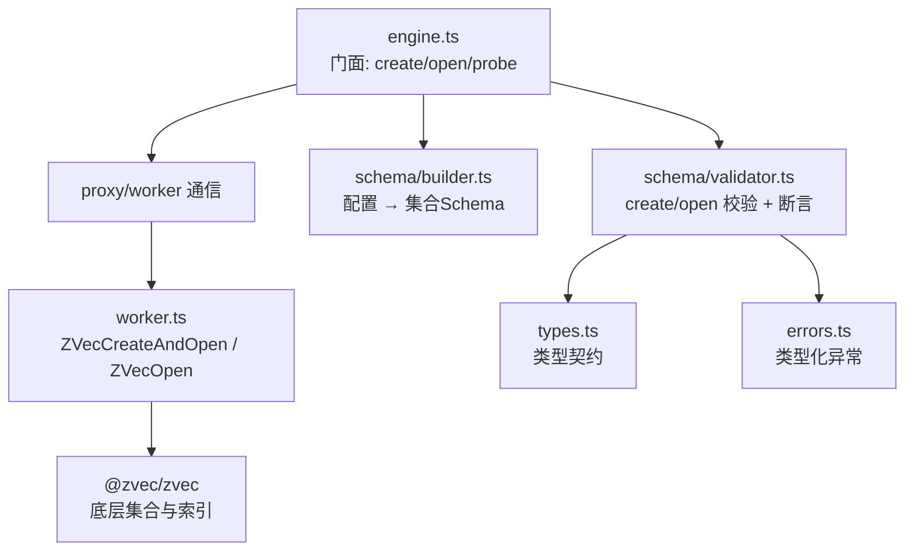
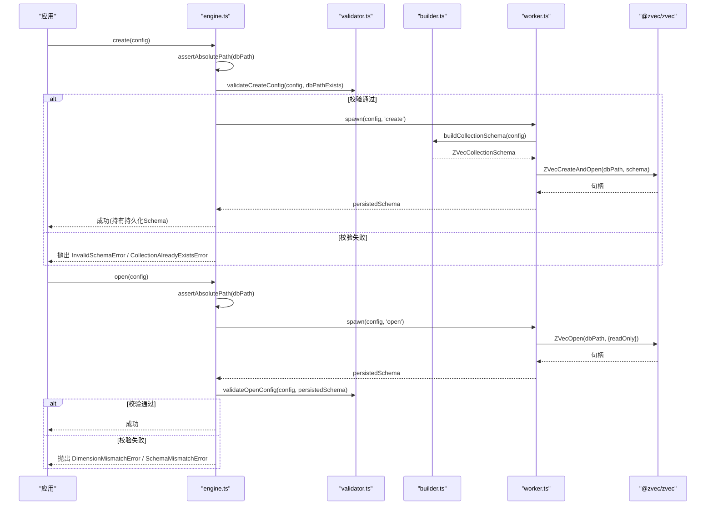
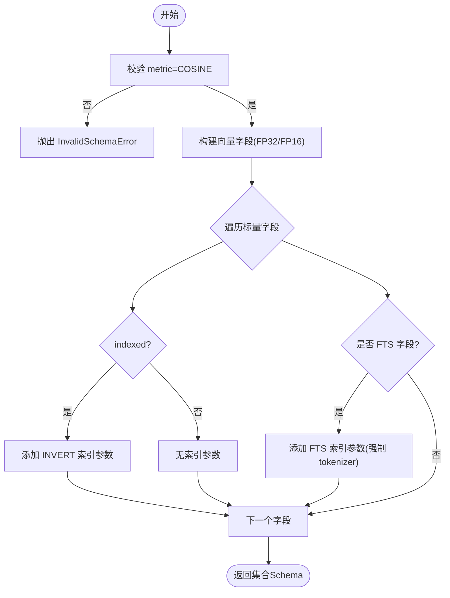
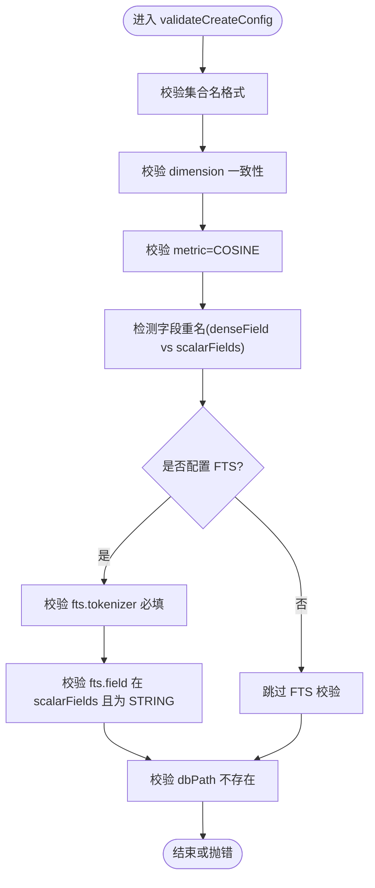
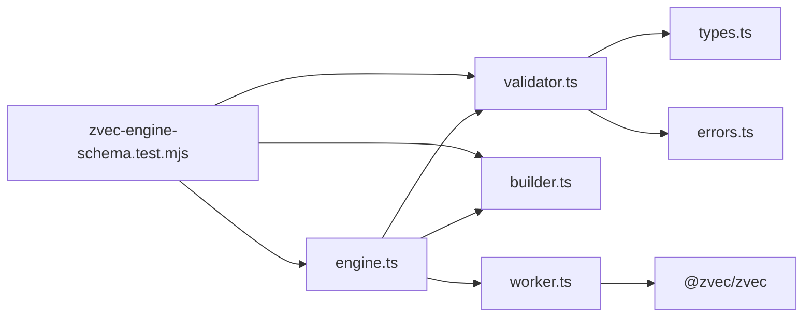

# Schema验证与构建

<cite>
**本文引用的文件**
- [builder.ts](file://src/zvec-engine/schema/builder.ts)
- [validator.ts](file://src/zvec-engine/schema/validator.ts)
- [types.ts](file://src/zvec-engine/types.ts)
- [errors.ts](file://src/zvec-engine/errors.ts)
- [engine.ts](file://src/zvec-engine/engine.ts)
- [worker.ts](file://src/zvec-engine/worker.ts)
- [zvec-engine-schema.test.mjs](file://test/zvec-engine-schema.test.mjs)
</cite>

## 目录
1. [简介](#简介)
2. [项目结构](#项目结构)
3. [核心组件](#核心组件)
4. [架构总览](#架构总览)
5. [详细组件分析](#详细组件分析)
6. [依赖关系分析](#依赖关系分析)
7. [性能考量](#性能考量)
8. [故障排查指南](#故障排查指南)
9. [结论](#结论)
10. [附录](#附录)

## 简介
本文件围绕向量引擎的 Schema 体系，系统性说明集合 Schema 的定义规范、约束规则、动态构建流程、校验逻辑、持久化结构与版本兼容策略，并给出最佳实践、常见陷阱以及迁移升级建议。目标是帮助读者在不深入源码的情况下，也能正确设计、构建和演进 Schema，避免数据不一致与运行时异常。

## 项目结构
Schema 相关代码集中在 zvec-engine 子模块中：
- schema/builder.ts：将高层配置转换为底层集合 Schema（含向量字段、标量字段、FTS 索引等）。
- schema/validator.ts：负责 create/open 时的配置校验、字段检查、兼容性断言，以及底层错误映射。
- types.ts：定义 Schema、配置、持久化结构、文档输入、检索请求等类型契约。
- errors.ts：统一类型化异常族，便于跨线程/进程传递与识别。
- engine.ts：门面类，编排 create/open、校验、代理调用与生命周期管理。
- worker.ts：工作线程入口，实际创建/打开集合，返回持久化 Schema 信息。
- test/zvec-engine-schema.test.mjs：覆盖 Schema 构建与校验的关键用例。

图表来源
- [engine.ts:97-131](file://src/zvec-engine/engine.ts#L97-L131)
- [validator.ts:34-133](file://src/zvec-engine/schema/validator.ts#L34-L133)
- [builder.ts:38-81](file://src/zvec-engine/schema/builder.ts#L38-L81)
- [worker.ts:167-189](file://src/zvec-engine/worker.ts#L167-L189)
- [types.ts:41-71](file://src/zvec-engine/types.ts#L41-L71)
- [errors.ts:17-54](file://src/zvec-engine/errors.ts#L17-L54)

章节来源
- [engine.ts:97-131](file://src/zvec-engine/engine.ts#L97-L131)
- [worker.ts:167-189](file://src/zvec-engine/worker.ts#L167-L189)
- [builder.ts:38-81](file://src/zvec-engine/schema/builder.ts#L38-L81)
- [validator.ts:34-133](file://src/zvec-engine/schema/validator.ts#L34-L133)
- [types.ts:41-71](file://src/zvec-engine/types.ts#L41-L71)
- [errors.ts:17-54](file://src/zvec-engine/errors.ts#L17-L54)

## 核心组件
- SchemaBuilder（builder.ts）
  - 作用：把高层配置（ZvecEngineConfig）转换为底层集合 Schema（ZVecCollectionSchema），完成：
    - 向量字段类型选择（FP32/FP16）
    - 度量类型限定为 COSINE
    - 标量字段映射到数据类型枚举
    - indexed=true 的标量字段生成倒排索引
    - FTS 字段生成全文检索索引（强制显式分词器）
  - 输出：包含一个向量字段与若干标量字段的集合 Schema。

- SchemaValidator（validator.ts）
  - create 校验（V-01~V-07）：集合名合法、维度一致、metric=COSINE、字段重名检测、FTS 配置合法性、路径存在性。
  - open 校验（O-02~O-05）：embedding 维度与持久化维度一致、持久化 metric 限定、schemaAssert 逐项比对。
  - 错误映射：将底层 zvec 原始错误映射为类型化异常（锁冲突、不存在、损坏等）。

- 类型与持久化（types.ts）
  - 配置类型：ZvecEngineConfig、ZvecEngineOpenConfig、ScalarFieldDef、FtsConfig、SchemaAssert。
  - 持久化结构：PersistedSchema（name/dimension/metric/denseDataType/scalarFields/fts）。
  - 文档与检索：DocInput/Doc、SearchOptions、HybridSearchReq、Hit 等。

- 异常体系（errors.ts）
  - 统一继承基类，支持 code/data 序列化，便于跨线程/进程传递与识别。
  - 关键异常：DimensionMismatchError、InvalidSchemaError、SchemaMismatchError、CollectionAlreadyExistsError、CollectionLockedException、CollectionCorruptedException 等。

章节来源
- [builder.ts:38-94](file://src/zvec-engine/schema/builder.ts#L38-L94)
- [validator.ts:34-189](file://src/zvec-engine/schema/validator.ts#L34-L189)
- [types.ts:21-71](file://src/zvec-engine/types.ts#L21-L71)
- [errors.ts:17-54](file://src/zvec-engine/errors.ts#L17-L54)

## 架构总览
下图展示从应用层到工作线程的 Schema 构建与校验流程，包括 create 与 open 两条路径。

图表来源
- [engine.ts:97-131](file://src/zvec-engine/engine.ts#L97-L131)
- [validator.ts:34-133](file://src/zvec-engine/schema/validator.ts#L34-L133)
- [builder.ts:38-81](file://src/zvec-engine/schema/builder.ts#L38-L81)
- [worker.ts:167-189](file://src/zvec-engine/worker.ts#L167-L189)

## 详细组件分析

### SchemaBuilder：动态构建与字段推断
- 向量字段
  - denseDataType=FP16 → VECTOR_FP16；否则 VECTOR_FP32。
  - metric 必须为 COSINE，否则抛 InvalidSchemaError。
- 标量字段
  - 名称→数据类型映射（STRING/BOOL/INT32/INT64/FLOAT/DOUBLE/UINT32/UINT64）。
  - indexed=true → 生成 INVERT 倒排索引参数。
- FTS 字段
  - 若配置 fts，则对应标量字段生成 FTS 索引，tokenizer 必须显式指定（推荐 jieba）。
  - filters 默认 ['lowercase']，可选 extraParams（如 jieba 词典目录）。
- 集合名提取
  - collectionNameOf 支持两种配置形态，统一返回集合名。

图表来源
- [builder.ts:38-94](file://src/zvec-engine/schema/builder.ts#L38-L94)

章节来源
- [builder.ts:38-94](file://src/zvec-engine/schema/builder.ts#L38-L94)

### SchemaValidator：配置校验、字段检查与兼容性验证
- create 阶段（V-01~V-07）
  - V-01 集合名正则校验（字母开头、≥3字符、仅字母数字下划线）。
  - V-02 embedding.dimension 与 collection.dimension 必须一致。
  - V-03 metric 必须为 COSINE。
  - V-04/V-05 FTS 要求：tokenizer 必填；fts.field 必须在 scalarFields 中且类型为 STRING。
  - V-06 字段重名检测（denseField 与 scalarFields 之间不可重复）。
  - V-07 dbPath 已存在时拒绝创建（防止覆盖）。
- open 阶段（O-02~O-05）
  - O-02 embedding.dimension 与持久化 dimension 一致。
  - O-03 持久化 metric 必须为 COSINE。
  - O-04 schemaAssert 逐项比对：dimension、metric、scalarFields（name+dataType）、fts（field+tokenizer）。
- 底层错误映射
  - 锁冲突/不存在/损坏三类错误通过消息模式匹配映射为类型化异常。

图表来源
- [validator.ts:34-105](file://src/zvec-engine/schema/validator.ts#L34-L105)

章节来源
- [validator.ts:34-189](file://src/zvec-engine/schema/validator.ts#L34-L189)

### 持久化 Schema 结构与版本管理
- 持久化结构（PersistedSchema）
  - name、denseField、dimension、metric、denseDataType、scalarFields、fts。
  - 由 worker 在 create/open 后读取底层集合 schema 并反序列化为该结构。
- 版本管理现状
  - 当前实现未引入显式的“版本字段”；兼容性通过 schemaAssert 与严格校验保障。
  - 开放扩展点：可在 PersistedSchema 中增加 version 字段，并在 open 时进行向后兼容判断（例如允许新增可选字段但不允许破坏性变更）。
- 建议的版本策略
  - 向后兼容：新增可选字段/索引可接受。
  - 向前兼容：移除/改名/改类型视为不兼容，需迁移或新建集合。
  - 迁移工具：提供脚本对比新旧 schema，生成增量迁移计划（增删改字段、重建索引）。

章节来源
- [types.ts:63-71](file://src/zvec-engine/types.ts#L63-L71)
- [worker.ts:217-268](file://src/zvec-engine/worker.ts#L217-L268)

### 写入与 FTS 联动（补充）
- 写入时若配置了 FTS 字段，text 会自动写入对应标量字段以维护 FTS 索引一致性。
- update 场景需保证 vector/text 与 FTS 配置一致，避免索引与数据不同步。

章节来源
- [worker.ts:333-348](file://src/zvec-engine/worker.ts#L333-L348)

## 依赖关系分析
- engine.ts 依赖 validator.ts 与 builder.ts 完成前置校验与 Schema 构建。
- worker.ts 依赖 @zvec/zvec 原生能力，并通过 builder.ts 生成集合 Schema。
- validator.ts 依赖 types.ts 的类型契约与 errors.ts 的异常族。
- 测试用例覆盖纯函数与集成路径，确保行为稳定。

图表来源
- [engine.ts:97-131](file://src/zvec-engine/engine.ts#L97-L131)
- [worker.ts:167-189](file://src/zvec-engine/worker.ts#L167-L189)
- [validator.ts:34-189](file://src/zvec-engine/schema/validator.ts#L34-L189)
- [builder.ts:38-94](file://src/zvec-engine/schema/builder.ts#L38-L94)
- [zvec-engine-schema.test.mjs:1-274](file://test/zvec-engine-schema.test.mjs#L1-L274)

章节来源
- [engine.ts:97-131](file://src/zvec-engine/engine.ts#L97-L131)
- [worker.ts:167-189](file://src/zvec-engine/worker.ts#L167-L189)
- [validator.ts:34-189](file://src/zvec-engine/schema/validator.ts#L34-L189)
- [builder.ts:38-94](file://src/zvec-engine/schema/builder.ts#L38-L94)
- [zvec-engine-schema.test.mjs:1-274](file://test/zvec-engine-schema.test.mjs#L1-L274)

## 性能考量
- 向量数据类型选择
  - FP16 可降低存储与带宽占用，但需评估精度与下游任务影响。
- 标量索引
  - indexed=true 会生成倒排索引，提升过滤查询性能，但会增加写入与存储开销。
- FTS 索引
  - 中文场景建议使用 jieba 分词器，配合合适的过滤器（如 lowercase）。
- 批量写入
  - 工作线程内部按批次处理，并通过 setImmediate 让出事件循环，减少阻塞。

[本节为通用指导，不直接分析具体文件]

## 故障排查指南
- 常见错误与定位
  - 集合名非法：检查命名规范（字母开头、长度≥3、仅字母数字下划线）。
  - 维度不匹配：确保 embedding.dimension 与 collection.dimension 一致。
  - metric 非 COSINE：当前仅支持 COSINE。
  - FTS 配置缺失：tokenizer 必填，fts.field 必须为 STRING 且在 scalarFields 中声明。
  - 路径已存在：create 不允许覆盖已有路径。
  - 打开失败：可能因锁冲突、集合不存在或数据损坏，查看 mapZvecOpenError 映射结果。
- 诊断步骤
  - 使用 probe 探测集合状态（不存在/被锁/健康/损坏）。
  - 检查 schemaAssert 是否与持久化 Schema 完全一致。
  - 核对 FTS 字段与文本写入链路，确保 text 同步到 FTS 字段。

章节来源
- [validator.ts:197-222](file://src/zvec-engine/schema/validator.ts#L197-L222)
- [engine.ts:151-199](file://src/zvec-engine/engine.ts#L151-L199)
- [zvec-engine-schema.test.mjs:29-48](file://test/zvec-engine-schema.test.mjs#L29-L48)

## 结论
本 Schema 体系通过严格的 create/open 校验、清晰的类型契约与类型化异常，保障了集合的生命周期安全与数据一致性。SchemaBuilder 将高层配置可靠地转换为底层集合 Schema，SchemaValidator 确保配置与持久化结构的一致性。建议在业务侧遵循最佳实践，谨慎设计字段与索引，并通过 schemaAssert 与探针机制降低上线风险。未来可引入显式版本字段与迁移工具，进一步提升可演进性。

[本节为总结，不直接分析具体文件]

## 附录

### Schema 设计最佳实践
- 固定 metric 为 COSINE，避免后续兼容问题。
- 合理设置 dimension，确保与 embedding 一致。
- 对高频过滤字段启用 indexed，权衡写入与查询性能。
- FTS 字段优先选择 STRING，并使用 jieba 分词器以提升中文检索效果。
- 使用 schemaAssert 在 open 时锁定关键属性，防止隐式变更。

[本节为通用指导，不直接分析具体文件]

### 常见陷阱
- 忘记声明 FTS 字段导致全文检索无效。
- 误用非 STRING 类型作为 FTS 字段。
- 标量字段与 denseField 重名引发冲突。
- 忽略路径存在性检查导致意外覆盖。
- 打开集合时未校验 schemaAssert，导致运行期不一致。

[本节为通用指导，不直接分析具体文件]

### Schema 迁移与升级策略
- 向后兼容优先：新增可选字段/索引可平滑升级。
- 破坏性变更（删除/改名/改类型）应通过新建集合+数据迁移完成。
- 迁移流程建议：
  - 导出旧集合数据与 Schema。
  - 生成新 Schema（含必要变更）。
  - 在新集合重建索引并导入数据。
  - 切换读写流量并验证。
  - 下线旧集合。
- 自动化辅助：基于 PersistedSchema 差异比较，生成迁移脚本与回滚方案。

[本节为通用指导，不直接分析具体文件]