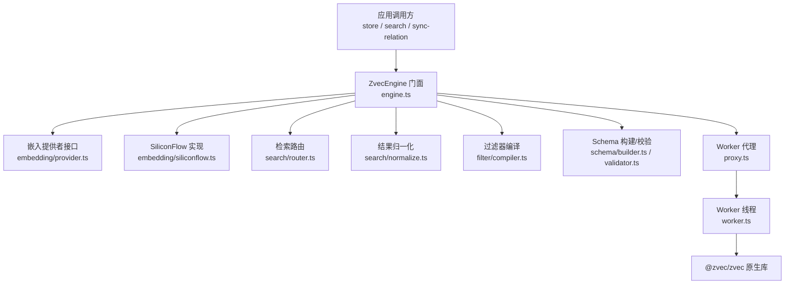
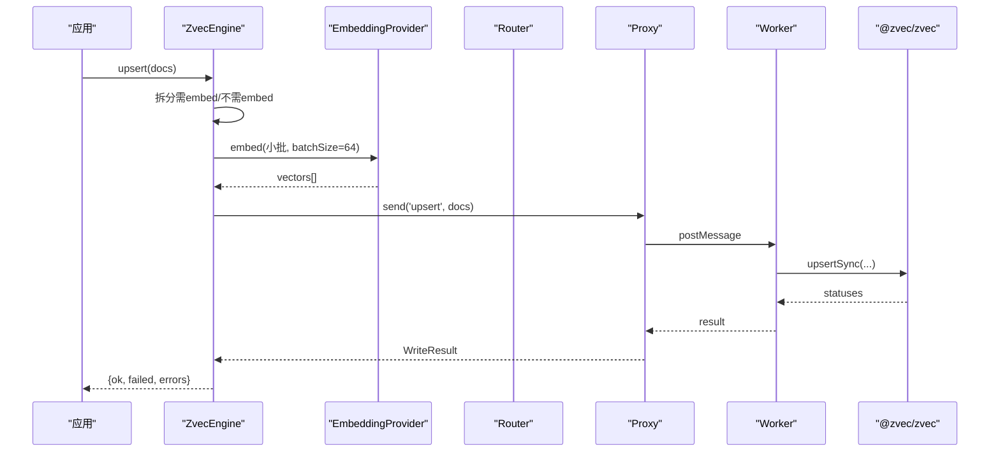
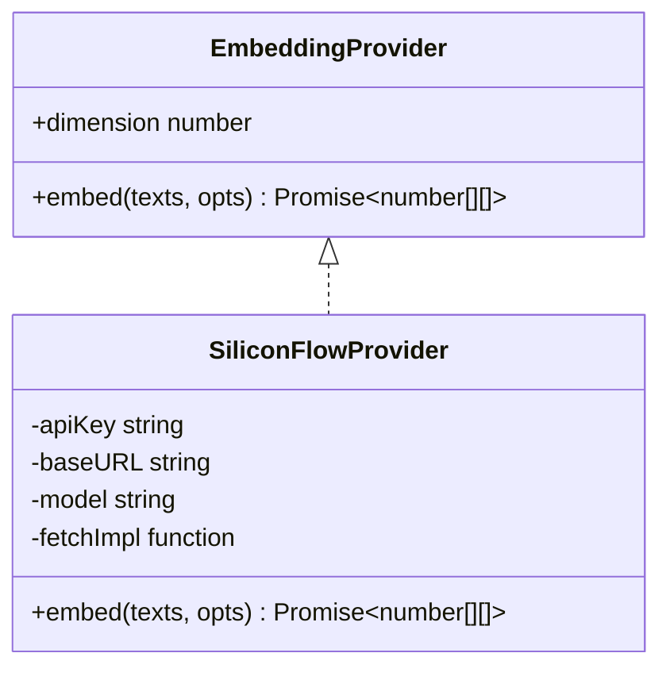
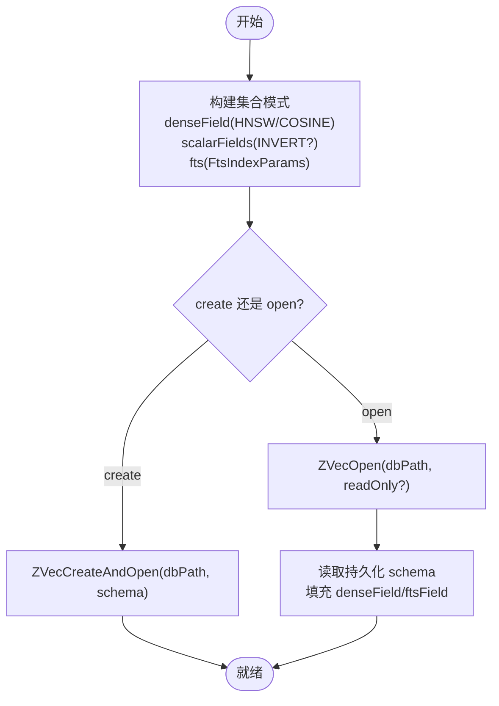
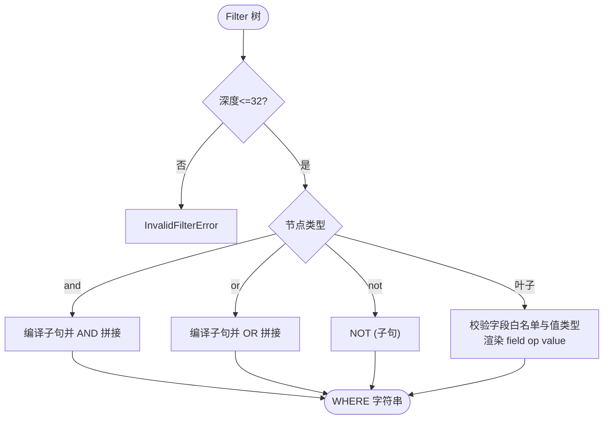
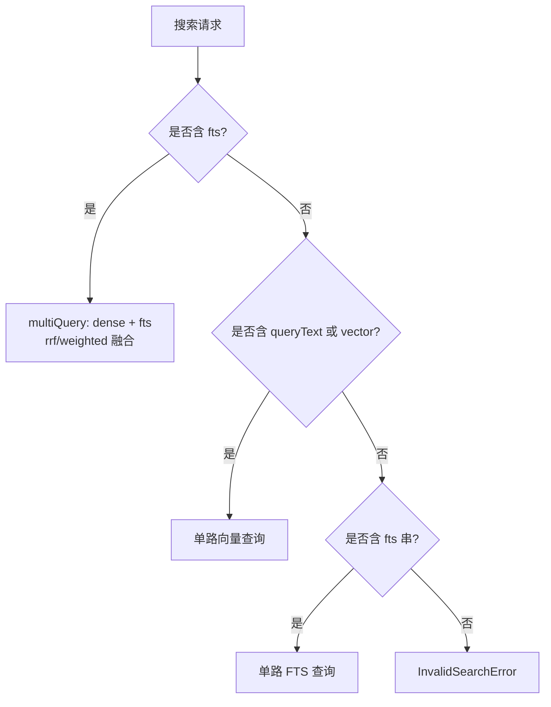
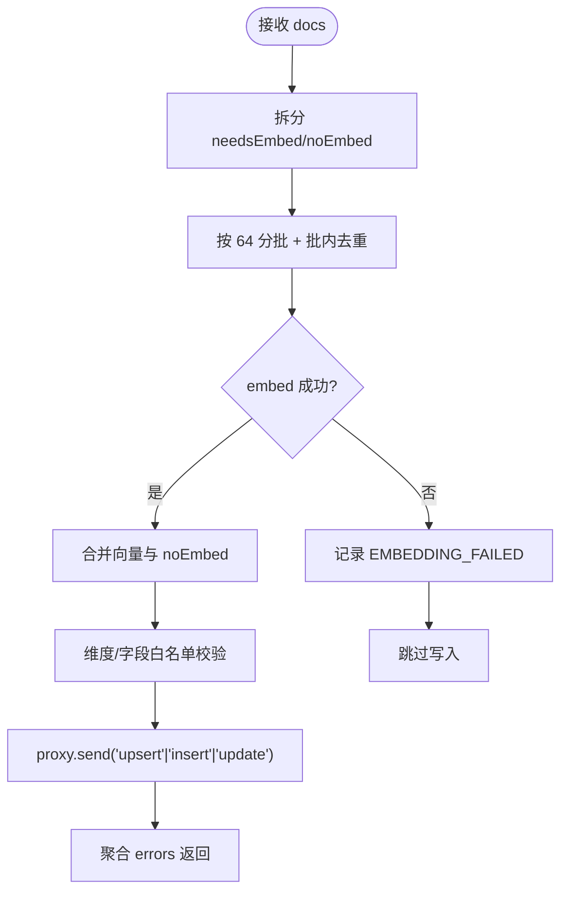
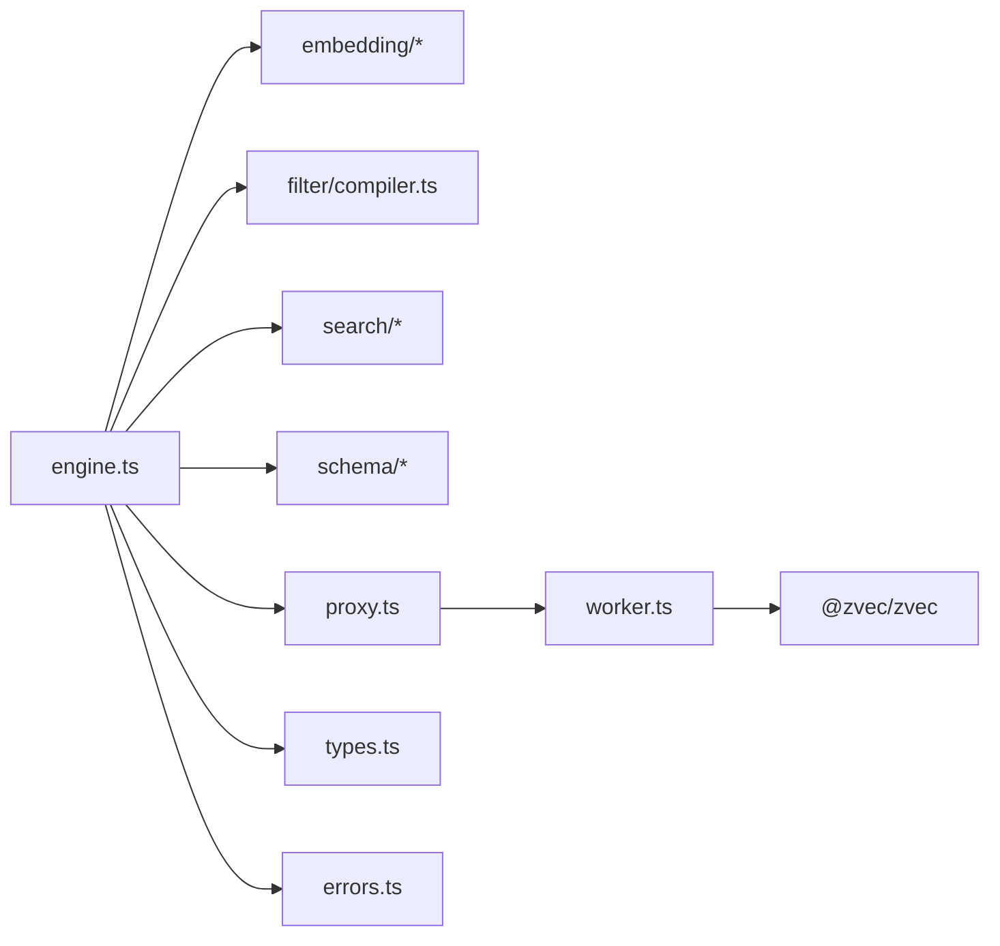

# 向量引擎架构

<cite>
**本文引用的文件**
- [engine.ts](file://src/zvec-engine/engine.ts)
- [index.ts](file://src/zvec-engine/index.ts)
- [types.ts](file://src/zvec-engine/types.ts)
- [provider.ts](file://src/zvec-engine/embedding/provider.ts)
- [siliconflow.ts](file://src/zvec-engine/embedding/siliconflow.ts)
- [router.ts](file://src/zvec-engine/search/router.ts)
- [normalize.ts](file://src/zvec-engine/search/normalize.ts)
- [compiler.ts](file://src/zvec-engine/filter/compiler.ts)
- [builder.ts](file://src/zvec-engine/schema/builder.ts)
- [validator.ts](file://src/zvec-engine/schema/validator.ts)
- [proxy.ts](file://src/zvec-engine/proxy.ts)
- [worker.ts](file://src/zvec-engine/worker.ts)
- [errors.ts](file://src/zvec-engine/errors.ts)
- [vector-engine-mem.md](file://docs/vector-engine-mem.md)
</cite>

## 目录
1. [简介](#简介)
2. [项目结构](#项目结构)
3. [核心组件](#核心组件)
4. [架构总览](#架构总览)
5. [详细组件分析](#详细组件分析)
6. [依赖关系分析](#依赖关系分析)
7. [性能与优化](#性能与优化)
8. [故障排查与恢复](#故障排查与恢复)
9. [结论](#结论)
10. [附录：监控与可观测性建议](#附录：监控与可观测性建议)

## 简介
本文件面向“基于 zvec 的向量搜索引擎”实现，系统性说明嵌入模型配置与管理、索引构建与优化策略、向量维度管理、相似度计算、过滤条件编译、搜索路由机制、嵌入提供商扩展（如 SiliconFlow）、自定义嵌入集成、向量数据持久化，以及监控、故障恢复与性能调优指南。该引擎以 Node.js 进程内常驻方式封装 Rust 内核的 @zvec/zvec，提供高吞吐写入与低延迟检索能力，并通过 Worker 线程隔离原生句柄与锁资源。

## 项目结构
- 引擎门面与类型：engine.ts、types.ts、index.ts
- 嵌入层：embedding/provider.ts、embedding/siliconflow.ts
- 检索层：search/router.ts、search/normalize.ts
- 过滤层：filter/compiler.ts
- 模式层：schema/builder.ts、schema/validator.ts
- 运行时：proxy.ts（主线程代理）、worker.ts（子线程执行）
- 错误体系：errors.ts
- 工程文档：docs/vector-engine-mem.md

图表来源
- [engine.ts:68-131](file://src/zvec-engine/engine.ts#L68-L131)
- [proxy.ts:44-109](file://src/zvec-engine/proxy.ts#L44-L109)
- [worker.ts:118-163](file://src/zvec-engine/worker.ts#L118-L163)

章节来源
- [engine.ts:68-131](file://src/zvec-engine/engine.ts#L68-L131)
- [proxy.ts:44-109](file://src/zvec-engine/proxy.ts#L44-L109)
- [worker.ts:118-163](file://src/zvec-engine/worker.ts#L118-L163)

## 核心组件
- ZvecEngine 门面：负责 create/open/probe、生命周期、写入编排（含 embed 小批失败隔离）、检索编排（路由 + 必要 embed + filter 注入）、索引操作与优化。
- EmbeddingProvider 抽象与 SiliconFlowProvider 实现：统一文本到向量的接口；内置重试、退避、超时、进度回调与维度一致性校验。
- 检索路由与归一化：根据请求参数选择单路向量、单路 FTS 或混合两路（RRF/加权），并对 COSINE 距离进行 score 归一化。
- 过滤器编译器：将结构化 Filter 编译为类 SQL WHERE 字符串，带字段白名单、深度限制与值安全渲染。
- Schema 构建与校验：将高层配置映射为 @zvec/zvec 集合模式，并在 open 时做 schemaAssert 比对与错误映射。
- Worker 代理与线程：主线程通过 postMessage 与子线程通信，子线程串行处理消息并直接调用 @zvec/zvec API。

章节来源
- [engine.ts:68-495](file://src/zvec-engine/engine.ts#L68-L495)
- [provider.ts:9-28](file://src/zvec-engine/embedding/provider.ts#L9-L28)
- [siliconflow.ts:43-203](file://src/zvec-engine/embedding/siliconflow.ts#L43-L203)
- [router.ts:43-127](file://src/zvec-engine/search/router.ts#L43-L127)
- [normalize.ts:16-63](file://src/zvec-engine/search/normalize.ts#L16-L63)
- [compiler.ts:21-101](file://src/zvec-engine/filter/compiler.ts#L21-L101)
- [builder.ts:38-94](file://src/zvec-engine/schema/builder.ts#L38-L94)
- [validator.ts:34-133](file://src/zvec-engine/schema/validator.ts#L34-L133)
- [proxy.ts:44-181](file://src/zvec-engine/proxy.ts#L44-L181)
- [worker.ts:118-436](file://src/zvec-engine/worker.ts#L118-L436)

## 架构总览
引擎采用“门面 + 路由 + 嵌入 + 代理 + 工作线程”的分层设计：
- 门面层屏蔽底层复杂性，暴露稳定 API。
- 路由层决定查询路径与融合策略。
- 嵌入层解耦外部服务，支持多提供商与容错。
- 代理层管理 Worker 生命周期与消息协议。
- 工作线程持有唯一集合句柄，串行执行 IO，避免并发竞争。

图表来源
- [engine.ts:330-450](file://src/zvec-engine/engine.ts#L330-L450)
- [siliconflow.ts:77-102](file://src/zvec-engine/embedding/siliconflow.ts#L77-L102)
- [proxy.ts:114-126](file://src/zvec-engine/proxy.ts#L114-L126)
- [worker.ts:286-331](file://src/zvec-engine/worker.ts#L286-L331)

## 详细组件分析

### 嵌入模型配置与管理
- 接口契约：EmbeddingProvider 暴露 dimension 与 embed(texts, opts)，opts 支持 retries、batchSize、timeoutMs、onProgress。
- SiliconFlowProvider：默认 baseURL/model/dimension，从环境变量读取密钥；HTTP 错误分类（4xx/5xx/429）与指数退避；响应维度校验；按 index 排序对齐输入顺序；支持 AbortController 超时。
- 维度一致性：create/open 阶段强制 embedding.dimension 与 collection.dimension 一致；open 时还会与持久化维度比对。
- 失败粒度：engine 侧按 EMBED_BATCH_SIZE=64 切批，provider 侧也按相同批次大小执行，使一次 HTTP 调用对应一个失败单元，便于局部失败不影响整批。

图表来源
- [provider.ts:9-28](file://src/zvec-engine/embedding/provider.ts#L9-L28)
- [siliconflow.ts:43-203](file://src/zvec-engine/embedding/siliconflow.ts#L43-L203)

章节来源
- [provider.ts:9-28](file://src/zvec-engine/embedding/provider.ts#L9-L28)
- [siliconflow.ts:43-203](file://src/zvec-engine/embedding/siliconflow.ts#L43-L203)
- [validator.ts:48-54](file://src/zvec-engine/schema/validator.ts#L48-L54)
- [validator.ts:109-119](file://src/zvec-engine/schema/validator.ts#L109-L119)

### 索引构建与优化策略
- Schema 构建：将 denseField 映射为 HNSW 向量索引（COSINE），标量字段可选 INVERT 倒排；FTS 字段使用 FtsIndexParams（tokenizer/filters/jieba 字典）。
- 创建/打开：create 使用 ZVecCreateAndOpen，open 使用 ZVecOpen；open 后读取持久化 schema 并回填 denseField/ftsField。
- 索引维护：engine 暴露 createIndex/dropIndex/optimize，由 worker 转发至 @zvec/zvec。
- 数据持久化：集合数据与索引落盘于 dbPath；destroy 会释放并删除集合。

图表来源
- [builder.ts:38-94](file://src/zvec-engine/schema/builder.ts#L38-L94)
- [worker.ts:167-189](file://src/zvec-engine/worker.ts#L167-L189)
- [engine.ts:316-326](file://src/zvec-engine/engine.ts#L316-L326)

章节来源
- [builder.ts:38-94](file://src/zvec-engine/schema/builder.ts#L38-L94)
- [worker.ts:167-189](file://src/zvec-engine/worker.ts#L167-L189)
- [engine.ts:316-326](file://src/zvec-engine/engine.ts#L316-L326)

### 向量维度管理与相似度计算
- 维度管理：
  - 创建时：collection.dimension 必须等于 embedding.dimension。
  - 打开时：embedding.dimension 必须等于持久化 dimension。
  - 写入时：若传入 vector，长度必须等于 dimension，否则抛 DimensionMismatchError。
  - 检索时：若传入 vector，路由层校验维度。
- 相似度计算：
  - COSINE 度量下，worker 返回 distance（越小越相似），engine 侧 normalizeVectorScore(distance) = 1/(1+distance)，值域 [1/3, 1]。
  - FTS/Hybrid 路径直接使用 BM25/RRF 分数。

章节来源
- [validator.ts:48-54](file://src/zvec-engine/schema/validator.ts#L48-L54)
- [validator.ts:109-119](file://src/zvec-engine/schema/validator.ts#L109-L119)
- [engine.ts:405-410](file://src/zvec-engine/engine.ts#L405-L410)
- [router.ts:158-165](file://src/zvec-engine/search/router.ts#L158-L165)
- [normalize.ts:16-25](file://src/zvec-engine/search/normalize.ts#L16-L25)
- [worker.ts:440-473](file://src/zvec-engine/worker.ts#L440-L473)

### 过滤条件编译
- 输入：Filter 树（field/op/value、and/or/not）。
- 规则：
  - 仅允许 schema 声明的 scalarFields 与 fts.field。
  - 字符串值转义并加引号；数字/布尔原样输出。
  - and/or 递归编译并加括号保证优先级；not 包裹子表达式。
  - 嵌套深度上限 32，防 DoS；空 and/or、非法值抛出 InvalidFilterError。
- 输出：类 SQL WHERE 字符串，随 query/multiQuery 下发给 worker。

图表来源
- [compiler.ts:21-101](file://src/zvec-engine/filter/compiler.ts#L21-L101)

章节来源
- [compiler.ts:21-101](file://src/zvec-engine/filter/compiler.ts#L21-L101)

### 搜索路由机制
- 退化矩阵：
  - 同时有 fts 与 queryText/vector → multiQuery 两路（RRF/加权）。
  - 缺 fts → 退化为单路向量。
  - 缺 queryText/vector → 退化为单路 FTS。
  - 三者皆缺 → InvalidSearchError。
  - queryText 与 vector 互斥。
- 路由产物：kind（query/multiQuery）、payload（QueryPayload/MultiQueryPayload）、queryType（vector/fts/hybrid）、是否需要 embed。
- 归一化：vector 路 distance→score；fts/hybrid 直通。

图表来源
- [router.ts:43-127](file://src/zvec-engine/search/router.ts#L43-L127)
- [normalize.ts:33-63](file://src/zvec-engine/search/normalize.ts#L33-L63)

章节来源
- [router.ts:43-127](file://src/zvec-engine/search/router.ts#L43-L127)
- [normalize.ts:33-63](file://src/zvec-engine/search/normalize.ts#L33-L63)

### 写入编排与失败隔离
- 写入前：
  - 拆分需 embed 与不需 embed 的文档。
  - 对需 embed 的文档按 EMBED_BATCH_SIZE=64 分批，批内去重减少重复 HTTP 调用。
  - 逐批调用 provider.embed，失败仅标记该批文档为 EMBEDDING_FAILED，不阻塞其他批次。
- 组装写入：
  - 校验 vector 维度与 fields 白名单。
  - 批量发送至 worker，合并后端错误。
- 结果：返回 ok/failed/errors，语义清晰且可定位。

图表来源
- [engine.ts:330-450](file://src/zvec-engine/engine.ts#L330-L450)
- [siliconflow.ts:77-102](file://src/zvec-engine/embedding/siliconflow.ts#L77-L102)

章节来源
- [engine.ts:330-450](file://src/zvec-engine/engine.ts#L330-L450)

### 检索编排与结果归一化
- 入口：semanticSearch/vectorSearch/ftsSearch/hybridSearch 统一走 search()。
- 流程：
  - 编译 filter 为 SQL 片段。
  - 路由选择 query/multiQuery，必要时 embed。
  - 注入 filterSql，发送 query/multiQuery。
  - 归一化距离/分数为 Hit.score。
- 特性：支持 includeVector 返回原始向量；hybrid 支持 RRF/加权融合。

章节来源
- [engine.ts:454-495](file://src/zvec-engine/engine.ts#L454-L495)
- [router.ts:43-127](file://src/zvec-engine/search/router.ts#L43-L127)
- [normalize.ts:33-63](file://src/zvec-engine/search/normalize.ts#L33-L63)

### 生命周期与 Worker 通信
- 工厂方法：create/open/tryOpen/probe。probe 通过短超时探测是否被锁或损坏。
- 代理：spawn 启动 worker，postMessage 收发，close drain 在途后 closeSync，terminate 强制回收。
- 工作线程：串行处理消息，维护唯一集合句柄；write 分批并让出事件循环；query/multiQuery 直接调用 @zvec/zvec。

章节来源
- [engine.ts:95-239](file://src/zvec-engine/engine.ts#L95-L239)
- [proxy.ts:44-181](file://src/zvec-engine/proxy.ts#L44-L181)
- [worker.ts:62-163](file://src/zvec-engine/worker.ts#L62-L163)

## 依赖关系分析
- 模块耦合：
  - engine.ts 依赖 embedding、filter、search、schema、proxy、types、errors。
  - proxy.ts 依赖 worker-protocol 与 errors。
  - worker.ts 依赖 @zvec/zvec 与 schema/validator。
- 外部依赖：
  - @zvec/zvec：Rust 内核，提供集合、索引、查询、统计等能力。
  - fetch：SiliconFlowProvider 使用标准 fetch 调用远程嵌入服务。
- 潜在环：无显式循环依赖；各模块职责清晰。

图表来源
- [engine.ts:13-60](file://src/zvec-engine/engine.ts#L13-L60)
- [proxy.ts:14-33](file://src/zvec-engine/proxy.ts#L14-L33)
- [worker.ts:21-46](file://src/zvec-engine/worker.ts#L21-L46)

章节来源
- [engine.ts:13-60](file://src/zvec-engine/engine.ts#L13-L60)
- [proxy.ts:14-33](file://src/zvec-engine/proxy.ts#L14-L33)
- [worker.ts:21-46](file://src/zvec-engine/worker.ts#L21-L46)

## 性能与优化
- 写入吞吐：
  - 批大小：DEFAULT_WRITE_BATCH_SIZE=100；embed 批大小 EMBED_BATCH_SIZE=64，兼顾失败粒度与网络效率。
  - 批内去重：同文本只 embed 一次，显著降低重复 HTTP 调用。
  - 事件循环让出：worker 写入分块间 setImmediate，避免阻塞查询。
- 检索延迟：
  - 常驻 Worker 避免冷启动；COSINE 距离归一化减少上层换算开销。
  - 混合检索利用 RRF/加权融合提升召回质量。
- 存储与索引：
  - HNSW 向量索引 + 可选 INVERT 倒排 + FTS 全文索引，按需启用。
  - optimize 触发底层合并与压缩。
- 网络与限流：
  - SiliconFlowProvider 支持指数退避与 Retry-After；超时保护；非 429 的 4xx 不重试。
- 参考对比：工程文档显示 zvec 引擎相较旧 CLI 方案在延迟与召回上全面领先。

章节来源
- [engine.ts:62-67](file://src/zvec-engine/engine.ts#L62-L67)
- [engine.ts:330-450](file://src/zvec-engine/engine.ts#L330-L450)
- [worker.ts:286-331](file://src/zvec-engine/worker.ts#L286-L331)
- [siliconflow.ts:104-128](file://src/zvec-engine/embedding/siliconflow.ts#L104-L128)
- [vector-engine-mem.md:233-245](file://docs/vector-engine-mem.md#L233-L245)

## 故障排查与恢复
- 常见异常与含义：
  - CollectionNotFoundError：集合不存在。
  - CollectionLockedException：集合被其他进程持锁。
  - CollectionCorruptedException：集合损坏。
  - DimensionMismatchError：维度不一致。
  - InvalidSchemaError/InvalidDocInputError/InvalidSearchError/InvalidFilterError：配置/输入/查询/过滤非法。
  - WorkerCrashedError/WorkerUnavailableError：Worker 崩溃或不可用。
- 探测与自愈：
  - probe(dbPath, timeoutMs) 判断 exists/locked/healthy/error，结合 NOT_FOUND/CORRUPTED 分支决定是否重建。
  - tryOpen 用于“能否用”的布尔判断，不抛错。
- 恢复策略：
  - locked：等待或清理占用进程后重试。
  - corrupted：备份可用部分，重建集合。
  - not found：创建新集合。
- 错误跨线程传递：
  - worker-protocol 序列化/反序列化错误，保持类型与 data 信息。

章节来源
- [engine.ts:151-199](file://src/zvec-engine/engine.ts#L151-L199)
- [errors.ts:17-99](file://src/zvec-engine/errors.ts#L17-L99)
- [validator.ts:197-223](file://src/zvec-engine/schema/validator.ts#L197-L223)

## 结论
该向量引擎以稳定的门面 API 封装了 zvec 原生能力，通过嵌入层解耦、路由层灵活降级、过滤器编译保障安全、Worker 隔离确保稳定性，并提供完善的错误体系与探测恢复机制。配合合理的批大小、去重、超时与重试策略，可在生产环境获得高吞吐写入与低延迟检索能力。

## 附录：监控与可观测性建议
- 指标采集点：
  - 嵌入：每批耗时、成功率、重试次数、超时率、维度不一致次数。
  - 写入：批大小分布、upsert/insert/update 成功率、ID 冲突率、ZVEC 错误分布。
  - 检索：路由分布（vector/fts/hybrid）、topk 分布、归一化分数分布、过滤命中率。
  - 资源：Worker 存活时间、消息队列积压、内存峰值。
- 告警建议：
  - 连续嵌入失败或超时率突增。
  - 集合状态异常（locked/corrupted）。
  - 维度不一致或 schema 不匹配。
  - Worker 频繁崩溃或不可用。
- 日志建议：
  - 关键路径打点（创建/打开/写入/检索/优化/销毁）。
  - 错误附带 data（维度、字段名、状态码、重试信息等）。
  - 长耗时操作分段日志，便于定位瓶颈。

[本节为通用指导，无需列出具体文件来源]