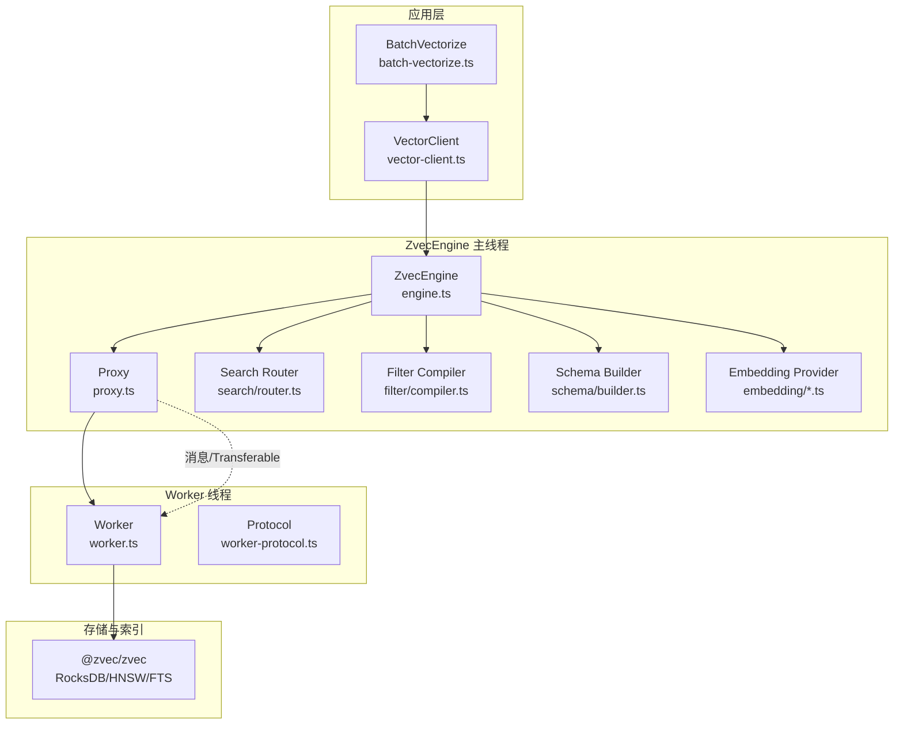
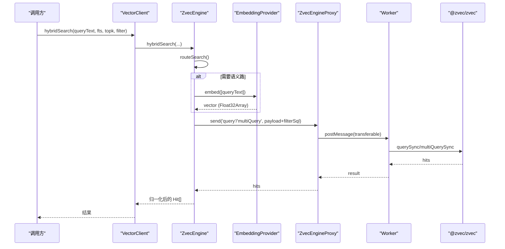
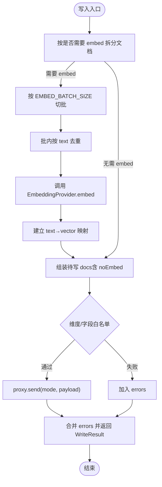
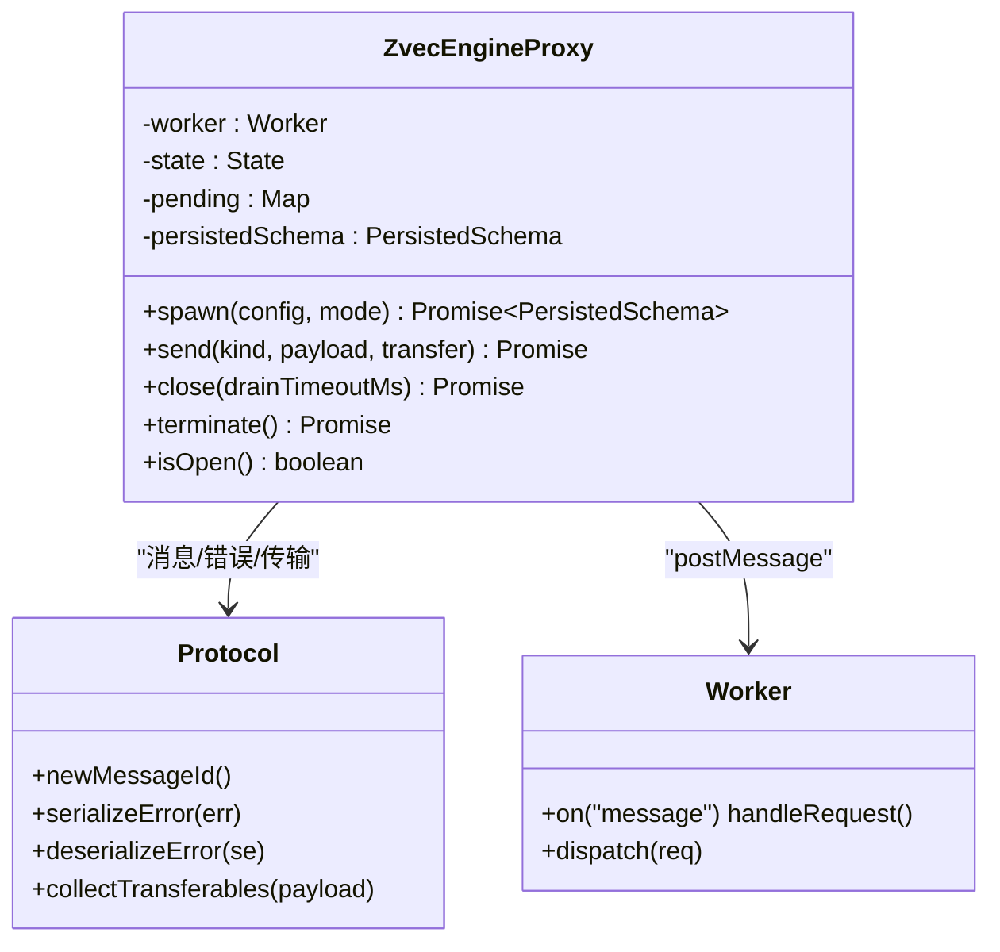
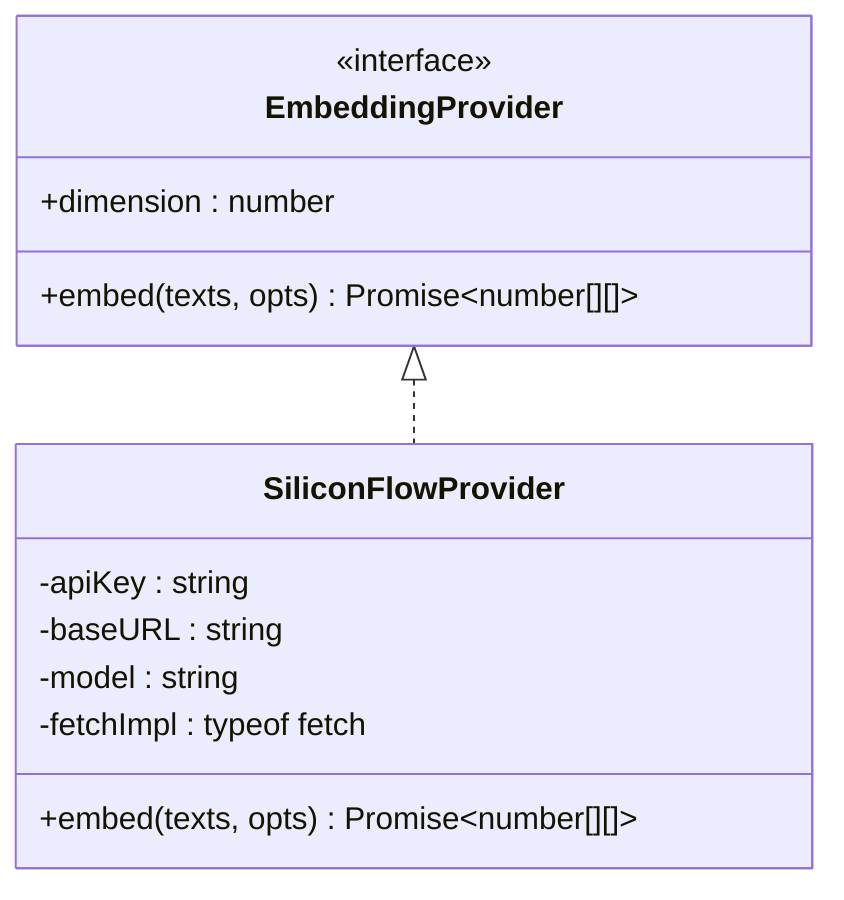
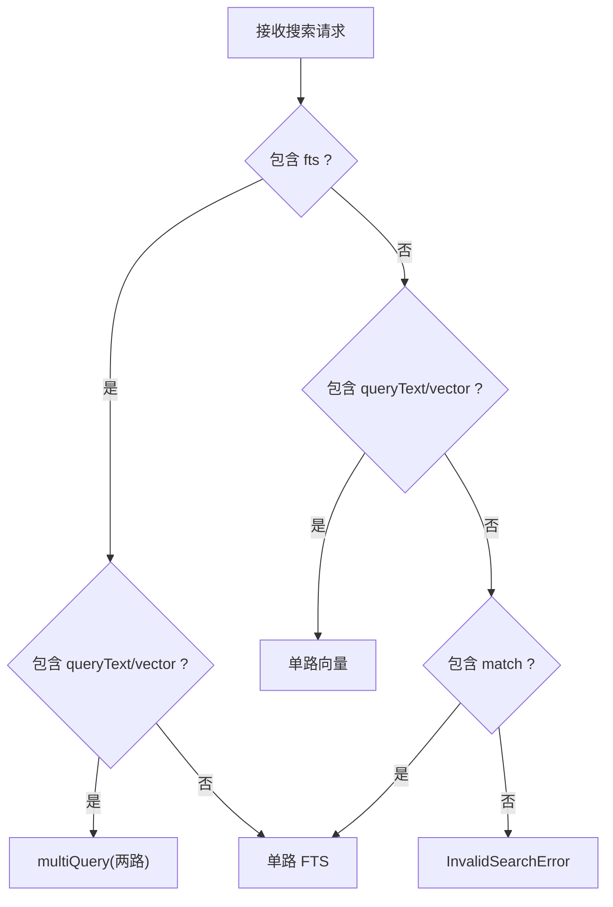
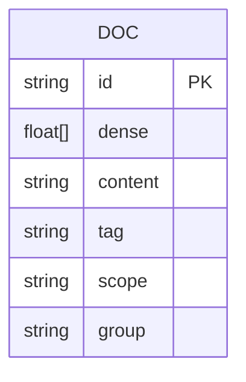
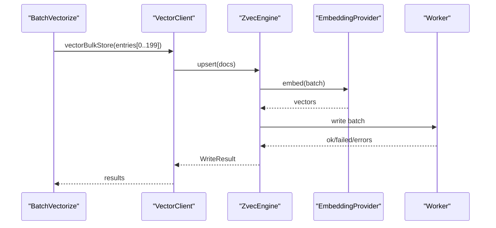
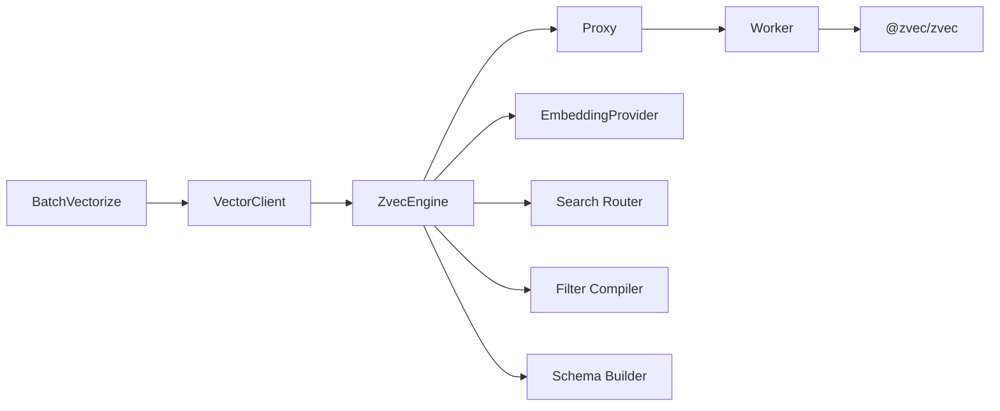

# 向量引擎架构

<cite>
**本文引用的文件**   
- [engine.ts](file://src/zvec-engine/engine.ts)
- [index.ts](file://src/zvec-engine/index.ts)
- [proxy.ts](file://src/zvec-engine/proxy.ts)
- [worker.ts](file://src/zvec-engine/worker.ts)
- [types.ts](file://src/zvec-engine/types.ts)
- [errors.ts](file://src/zvec-engine/errors.ts)
- [worker-protocol.ts](file://src/zvec-engine/worker-protocol.ts)
- [provider.ts](file://src/zvec-engine/embedding/provider.ts)
- [siliconflow.ts](file://src/zvec-engine/embedding/siliconflow.ts)
- [router.ts](file://src/zvec-engine/search/router.ts)
- [compiler.ts](file://src/zvec-engine/filter/compiler.ts)
- [builder.ts](file://src/zvec-engine/schema/builder.ts)
- [vector-client.ts](file://src/lib/vector-client.ts)
- [batch-vectorize.ts](file://src/lib/batch-vectorize.ts)
</cite>

## 目录
1. [简介](#简介)
2. [项目结构](#项目结构)
3. [核心组件](#核心组件)
4. [架构总览](#架构总览)
5. [详细组件分析](#详细组件分析)
6. [依赖关系分析](#依赖关系分析)
7. [性能与并发优化](#性能与并发优化)
8. [故障排查与恢复](#故障排查与恢复)
9. [结论](#结论)
10. [附录：扩展自定义 Embedding 提供商](#附录：扩展自定义-embedding-提供商)

## 简介
本仓库实现了一个基于 zvec 的向量引擎（ZvecEngine），采用“主线程编排 + worker 线程执行”的进程内隔离架构，提供集合创建/打开、文档写入、检索（语义/关键词/混合）、索引管理、批量向量化等能力。Embedding 通过可插拔的 Provider 接口接入，当前内置 SiliconFlowProvider（OpenAI 兼容 /embeddings 接口）。向量数据以 RocksDB 为底层存储，HNSW 向量索引 + FTS 全文索引 + 倒排标量索引组合使用。

## 项目结构
- 引擎核心：src/zvec-engine
  - 门面与类型：engine.ts, types.ts, index.ts
  - 进程通信：proxy.ts, worker.ts, worker-protocol.ts
  - 嵌入插件：embedding/provider.ts, embedding/siliconflow.ts
  - 检索路由与过滤：search/router.ts, filter/compiler.ts
  - 模式构建与校验：schema/builder.ts, schema/validator.ts
- 上层适配：src/lib/vector-client.ts（封装 ZvecEngine，面向 CLI/MCP）
- 批量向量化：src/lib/batch-vectorize.ts（批量 embed + 写入）

图表来源
- [engine.ts:68-131](file://src/zvec-engine/engine.ts#L68-L131)
- [proxy.ts:44-126](file://src/zvec-engine/proxy.ts#L44-L126)
- [worker.ts:62-163](file://src/zvec-engine/worker.ts#L62-L163)
- [vector-client.ts:271-340](file://src/lib/vector-client.ts#L271-L340)

章节来源
- [engine.ts:68-131](file://src/zvec-engine/engine.ts#L68-L131)
- [proxy.ts:44-126](file://src/zvec-engine/proxy.ts#L44-L126)
- [worker.ts:62-163](file://src/zvec-engine/worker.ts#L62-L163)
- [vector-client.ts:271-340](file://src/lib/vector-client.ts#L271-L340)

## 核心组件
- ZvecEngine：对外门面，负责配置校验、生命周期、写入/检索编排、错误聚合、与 Embedding Provider 协作。
- ZvecEngineProxy：主线程侧代理，spawn/terminate worker，postMessage 请求/响应，状态机管理，crash 处理。
- Worker：独立线程持有唯一 collection 句柄，串行处理 DB 操作，分批写入并让出事件循环。
- Embedding Provider：抽象接口 + SiliconFlowProvider 参考实现，支持 OpenAI 兼容 /embeddings 接口。
- Search Router：将高层检索请求映射到 query/multiQuery，决定是否需要 embed、是否走 FTS。
- Filter Compiler：结构化 Filter → 类 SQL 字符串，字段白名单、深度限制、值校验。
- Schema Builder：ZvecEngineConfig → @zvec/zvec 集合模式（HNSW/COSINE/FP32/FP16，FTS/Jieba，倒排标量）。
- Vector Client：对 ZvecEngine 的二次封装，提供 scope/tag 隔离、docId 生成、空闲释放锁、自愈重试等。
- Batch Vectorize：批量向量化入口，按批调用 vectorBulkStore，统一进度与错误收集。

章节来源
- [engine.ts:68-509](file://src/zvec-engine/engine.ts#L68-L509)
- [proxy.ts:44-277](file://src/zvec-engine/proxy.ts#L44-L277)
- [worker.ts:62-504](file://src/zvec-engine/worker.ts#L62-L504)
- [provider.ts:9-28](file://src/zvec-engine/embedding/provider.ts#L9-L28)
- [siliconflow.ts:43-203](file://src/zvec-engine/embedding/siliconflow.ts#L43-L203)
- [router.ts:43-127](file://src/zvec-engine/search/router.ts#L43-L127)
- [compiler.ts:21-102](file://src/zvec-engine/filter/compiler.ts#L21-L102)
- [builder.ts:38-100](file://src/zvec-engine/schema/builder.ts#L38-L100)
- [vector-client.ts:183-467](file://src/lib/vector-client.ts#L183-L467)
- [batch-vectorize.ts:132-183](file://src/lib/batch-vectorize.ts#L132-L183)

## 架构总览
ZvecEngine 作为门面，将“配置/模式校验、Embedding 编排、检索路由、Filter 编译、写入/查询分发”集中在主线程；实际持久化与索引由 worker 线程独占维护，避免共享状态竞态。Embedding 在主线程完成，结果以 Float32Array + Transferable 零拷贝传给 worker。检索时，若需要文本转向量，先主线程 embed，再下发 worker 查询。

图表来源
- [engine.ts:454-495](file://src/zvec-engine/engine.ts#L454-L495)
- [router.ts:43-127](file://src/zvec-engine/search/router.ts#L43-L127)
- [siliconflow.ts:77-102](file://src/zvec-engine/embedding/siliconflow.ts#L77-L102)
- [proxy.ts:114-126](file://src/zvec-engine/proxy.ts#L114-L126)
- [worker.ts:396-436](file://src/zvec-engine/worker.ts#L396-L436)

## 详细组件分析

### ZvecEngine 门面与写入/检索编排
- 工厂方法 create/open/probe：路径校验、配置校验、spawn worker、返回持久化 schema。probe 带超时判定 locked/corrupted/not_found。
- 写入 upsert/insert/update/delete/fetch/listIds：
  - 写入前按是否需要 embed 拆分批次；needsEmbed 按 EMBED_BATCH_SIZE=64 切分，批内去重减少重复 HTTP 调用；失败项记录 errors，成功项继续写入。
  - update 强制要求 dense vector（或 text 重嵌），且若集合有 FTS，禁止只传 vector 不传 text，防止 FTS 与向量不同步。
  - 维度校验、字段白名单校验在写入路径进行。
- 检索 semanticSearch/vectorSearch/ftsSearch/hybridSearch：
  - 路由选择 query 或 multiQuery；必要时主线程 embed；注入 filterSql；转发到 worker；归一化为 Hit。
- 索引 optimize/createIndex/dropIndex。

图表来源
- [engine.ts:330-450](file://src/zvec-engine/engine.ts#L330-L450)
- [engine.ts:243-274](file://src/zvec-engine/engine.ts#L243-L274)

章节来源
- [engine.ts:97-199](file://src/zvec-engine/engine.ts#L97-L199)
- [engine.ts:243-450](file://src/zvec-engine/engine.ts#L243-L450)
- [engine.ts:454-495](file://src/zvec-engine/engine.ts#L454-L495)

### 进程间通信（主线程 ↔ Worker）
- 消息协议：id 关联请求/响应，支持 transferable（Float32Array buffer 零拷贝）。
- 状态机：init → opening → open → closing → closed/crashed/failed。
- 关闭流程：drain 在途请求 → closeSync 释放 LOCK → terminate。
- 崩溃处理：error/exit 事件 → reject 所有 pending → 标记不可用。
- 错误序列化：跨线程传递 SerializedError，主线程反序列化为类型化异常。

图表来源
- [proxy.ts:44-277](file://src/zvec-engine/proxy.ts#L44-L277)
- [worker.ts:62-163](file://src/zvec-engine/worker.ts#L62-L163)
- [worker-protocol.ts:21-202](file://src/zvec-engine/worker-protocol.ts#L21-L202)

章节来源
- [proxy.ts:44-277](file://src/zvec-engine/proxy.ts#L44-L277)
- [worker.ts:62-163](file://src/zvec-engine/worker.ts#L62-L163)
- [worker-protocol.ts:21-202](file://src/zvec-engine/worker-protocol.ts#L21-L202)

### Embedding 提供商插件架构
- 抽象接口 EmbeddingProvider：
  - dimension：输出维度必须与集合维度一致。
  - embed(texts, opts)：支持 retries、batchSize、timeoutMs、onProgress。
- SiliconFlowProvider（OpenAI 兼容）：
  - baseURL/model/apiKey/dimension 配置；默认 https://api.siliconflow.cn/v1。
  - 批间串行、指数退避 + Retry-After、网络/超时/非 4xx 可重试策略。
  - 响应顺序按 index 排序对齐输入，校验 embedding 长度与维度。
- 集成方式：ZvecEngine 在主线程调用 provider.embed，结果经 Float32Array 传入 worker。

图表来源
- [provider.ts:9-28](file://src/zvec-engine/embedding/provider.ts#L9-L28)
- [siliconflow.ts:43-203](file://src/zvec-engine/embedding/siliconflow.ts#L43-L203)

章节来源
- [provider.ts:9-28](file://src/zvec-engine/embedding/provider.ts#L9-L28)
- [siliconflow.ts:43-203](file://src/zvec-engine/embedding/siliconflow.ts#L43-L203)
- [engine.ts:330-384](file://src/zvec-engine/engine.ts#L330-L384)

### 检索路由与过滤
- 路由规则：
  - 同时存在 fts 和 queryText/vector → multiQuery 两路 RRF/加权融合（hybrid）。
  - 缺 fts → 退化单路向量。
  - 缺 queryText/vector → 退化单路 FTS。
  - 三者皆缺 → InvalidSearchError；queryText 与 vector 互斥。
- 过滤编译器：
  - 仅允许 schema 声明的 scalarFields + fts.field。
  - and/or/not 递归编译，嵌套深度上限 32，空数组/null/NaN 值拒绝。
  - 字符串值转义，数字/布尔原样输出。

图表来源
- [router.ts:43-127](file://src/zvec-engine/search/router.ts#L43-L127)
- [compiler.ts:31-102](file://src/zvec-engine/filter/compiler.ts#L31-L102)

章节来源
- [router.ts:43-127](file://src/zvec-engine/search/router.ts#L43-L127)
- [compiler.ts:31-102](file://src/zvec-engine/filter/compiler.ts#L31-L102)

### 存储结构与索引机制
- 集合模式：
  - 向量字段：HNSW 索引，COSINE 度量，FP32/FP16。
  - 标量字段：可选倒排索引（indexed=true）。
  - FTS：指定 tokenizer（standard/whitespace/jieba），filters（lowercase/ascii_folding/stemmer），可选 jiebaDictDir。
- 写入路径：
  - 向量字段写入 denseField；text 写入 fts.field（若启用 FTS）。
- 查询路径：
  - 向量路：distance（COSINE）→ 归一化为 score。
  - FTS 路：BM25 分数。
  - 混合路：RRF 或加权融合。

图表来源
- [builder.ts:38-100](file://src/zvec-engine/schema/builder.ts#L38-L100)
- [worker.ts:286-348](file://src/zvec-engine/worker.ts#L286-L348)
- [worker.ts:396-436](file://src/zvec-engine/worker.ts#L396-L436)

章节来源
- [builder.ts:38-100](file://src/zvec-engine/schema/builder.ts#L38-L100)
- [worker.ts:286-348](file://src/zvec-engine/worker.ts#L286-L348)
- [worker.ts:396-436](file://src/zvec-engine/worker.ts#L396-L436)

### 批量向量化与并发控制
- VectorClient：
  - 进程内单例 engine，串行化 probe/create/open/close，避免原生竞态阻塞。
  - 空闲释放锁：常驻 MCP 场景下，空闲超时自动 closeEngine，让其他实例抢占。
  - 自愈重试：worker 不可用时重置并重试一次。
- BatchVectorize：
  - bulkVectorize：按 200 条/批调用 vectorBulkStore，批间进度反馈，统一错误收集。
  - batchVectorize：串行逐条（兼容旧路径）。
- 并发要点：
  - 所有涉及原生 open 的操作经 serializeEngineOp 排队。
  - withEngine 包装 in-flight 计数，防止 idle close 竞态。

图表来源
- [batch-vectorize.ts:132-183](file://src/lib/batch-vectorize.ts#L132-L183)
- [vector-client.ts:314-362](file://src/lib/vector-client.ts#L314-L362)
- [vector-client.ts:389-407](file://src/lib/vector-client.ts#L389-L407)

章节来源
- [vector-client.ts:183-467](file://src/lib/vector-client.ts#L183-L467)
- [batch-vectorize.ts:132-183](file://src/lib/batch-vectorize.ts#L132-L183)

## 依赖关系分析
- ZvecEngine 依赖：
  - proxy（进程通信）、embedding provider（主线程 embed）、search router（检索路由）、filter compiler（过滤）、schema builder（模式构建）。
- Worker 依赖：
  - @zvec/zvec（集合句柄、索引、查询）。
- VectorClient 依赖：
  - ZvecEngine（dist 产物）、配置加载、scope 校验、中断引导。
- 外部依赖：
  - SiliconFlowProvider 依赖 HTTP fetch（OpenAI 兼容 /embeddings）。

图表来源
- [engine.ts:68-131](file://src/zvec-engine/engine.ts#L68-L131)
- [vector-client.ts:271-340](file://src/lib/vector-client.ts#L271-L340)
- [batch-vectorize.ts:132-183](file://src/lib/batch-vectorize.ts#L132-L183)

章节来源
- [engine.ts:68-131](file://src/zvec-engine/engine.ts#L68-L131)
- [vector-client.ts:271-340](file://src/lib/vector-client.ts#L271-L340)
- [batch-vectorize.ts:132-183](file://src/lib/batch-vectorize.ts#L132-L183)

## 性能与并发优化
- 零拷贝传输：Float32Array.buffer 通过 transfer list 在进程间传递，避免复制开销。
- 批大小与失败粒度：
  - Embedding 批大小 64，与 SiliconFlowProvider 默认一致，失败粒度精确到小批。
  - 写入批大小 100，worker 内分批插入并在批间 setImmediate 让出事件循环，提升查询插队能力。
- 去重优化：写入前批内按 text 去重，避免相同文本多次 HTTP 调用。
- 并发控制：
  - 引擎操作串行化（serializeEngineOp），避免同进程并发 open 导致原生阻塞。
  - 空闲释放锁（enableIdleClose），常驻服务空闲后释放 LOCK，多实例错开使用。
  - in-flight 保护：withEngine 计数防止 idle close 与 embedding 网络阶段竞态。
- 检索优化：
  - 路由选择最小必要路径（单路 vs 混合）。
  - 混合检索支持 RRF/加权融合，减少额外 rerank 成本。

章节来源
- [engine.ts:62-67](file://src/zvec-engine/engine.ts#L62-L67)
- [engine.ts:330-450](file://src/zvec-engine/engine.ts#L330-L450)
- [worker.ts:286-331](file://src/zvec-engine/worker.ts#L286-L331)
- [vector-client.ts:183-216](file://src/lib/vector-client.ts#L183-L216)
- [vector-client.ts:389-407](file://src/lib/vector-client.ts#L389-L407)
- [siliconflow.ts:77-102](file://src/zvec-engine/embedding/siliconflow.ts#L77-L102)

## 故障排查与恢复
- 常见错误类型：
  - 配置/模式：DimensionMismatchError、InvalidSchemaError、SchemaMismatchError。
  - 文档输入：InvalidDocInputError、InconsistentUpdateError。
  - 集合生命周期：CollectionNotFoundError、CollectionLockedException、CollectionCorruptedException、CollectionAlreadyExistsError。
  - Worker：WorkerSpawnError、WorkerCrashedError、WorkerUnavailableError、WorkerProtocolError、CloseTimeoutError。
  - Embedding：EmbeddingError、EmbeddingConfigError。
- 恢复策略：
  - 撞锁重试：VectorClient 检测 locked 等待对方释放后重试（最多 3 次）。
  - 自愈重试：withEngine 捕获 WorkerUnavailableError，重置 engine 并重试一次。
  - 损坏恢复：ensureVectorAvailable 返回 CORRUPTED 提示重建（ki restore --from-snapshot --rebuild-vector）。
  - 探针探测：ZvecEngine.probe 带超时，区分 NOT_FOUND/LOCKED/CORRUPTED/UNKNOWN。
- 调试建议：
  - 检查集合信息 info（dimension/metric/fields/fts/docCount）。
  - 查看 WriteResult.errors 定位具体失败条目与原因。
  - 监控 EmbeddingProvider 的 onProgress 与重试日志。
  - 使用 ensureVectorAvailable 快速判断可用性与原因码。

章节来源
- [errors.ts:17-99](file://src/zvec-engine/errors.ts#L17-L99)
- [engine.ts:151-199](file://src/zvec-engine/engine.ts#L151-L199)
- [vector-client.ts:420-467](file://src/lib/vector-client.ts#L420-L467)
- [vector-client.ts:389-407](file://src/lib/vector-client.ts#L389-L407)

## 结论
ZvecEngine 通过“主线程编排 + worker 线程执行”的清晰分层，结合可插拔 Embedding 提供商、严格的模式与过滤校验、以及健壮的进程通信与错误处理，提供了高性能、可扩展的向量检索能力。VectorClient 与 BatchVectorize 进一步封装了常用场景，提供并发安全、空闲释放锁、自愈重试与批量优化。整体设计兼顾了易用性、健壮性与扩展性。

## 附录：扩展自定义 Embedding 提供商
- 实现 EmbeddingProvider 接口：
  - 定义 dimension（需与集合维度一致）。
  - 实现 embed(texts, opts)，支持 retries、batchSize、timeoutMs、onProgress。
  - 遵循 OpenAI 兼容 /embeddings 协议（或根据目标提供商调整请求/响应解析）。
- 集成到 ZvecEngine：
  - 在 ZvecEngineConfig.embedding 中注入你的 Provider。
  - 确保 batchSize 与引擎 EMBED_BATCH_SIZE 协调，使失败粒度可控。
- 最佳实践：
  - 合理设置超时与重试，避免瞬时抖动影响整体吞吐。
  - 对响应进行严格校验（embedding 长度、维度、顺序）。
  - 利用 onProgress 上报进度，便于上层展示与中断。

章节来源
- [provider.ts:9-28](file://src/zvec-engine/embedding/provider.ts#L9-L28)
- [siliconflow.ts:43-203](file://src/zvec-engine/embedding/siliconflow.ts#L43-L203)
- [engine.ts:330-384](file://src/zvec-engine/engine.ts#L330-L384)