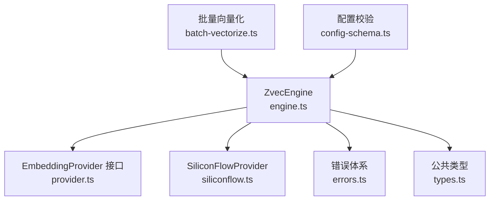
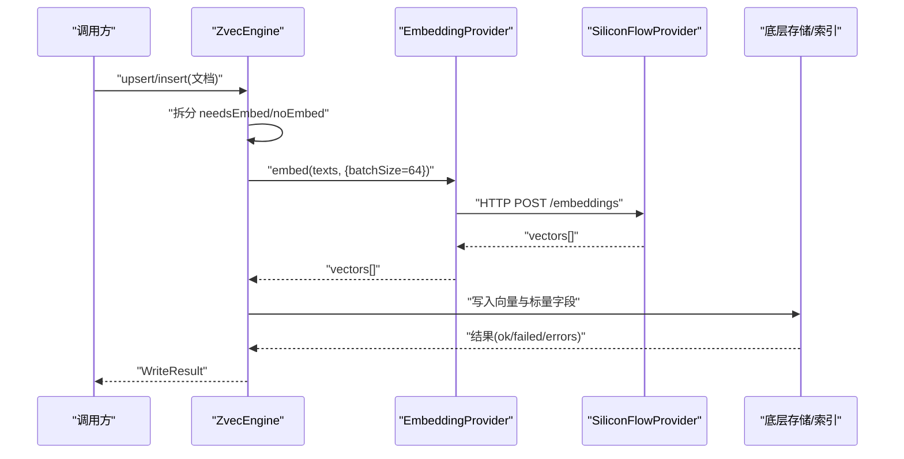
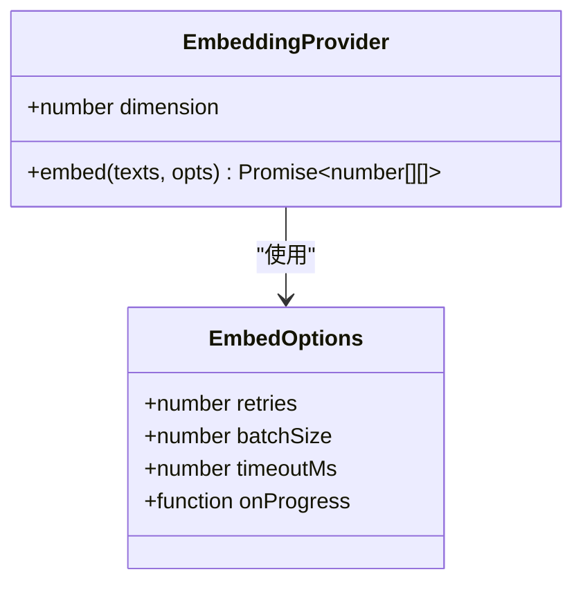
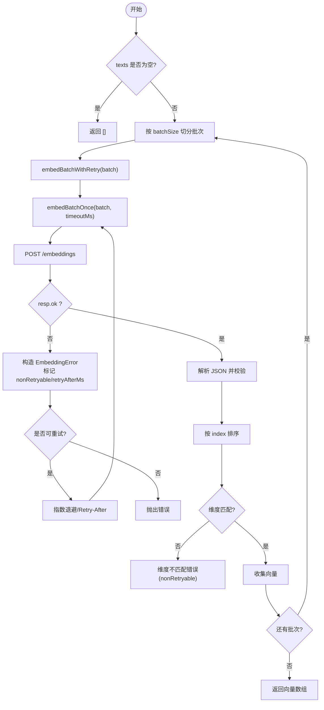
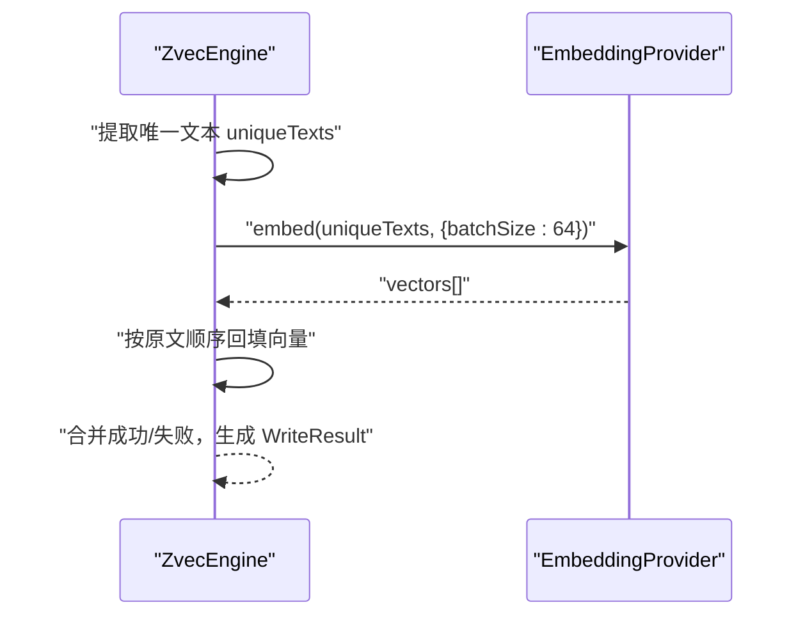
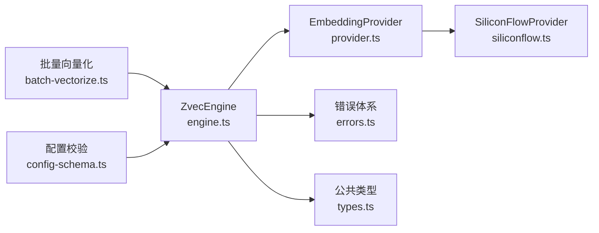

# 嵌入模型管理

<cite>
**本文引用的文件**
- [src/zvec-engine/embedding/provider.ts](file://src/zvec-engine/embedding/provider.ts)
- [src/zvec-engine/embedding/siliconflow.ts](file://src/zvec-engine/embedding/siliconflow.ts)
- [src/zvec-engine/errors.ts](file://src/zvec-engine/errors.ts)
- [src/zvec-engine/types.ts](file://src/zvec-engine/types.ts)
- [src/zvec-engine/engine.ts](file://src/zvec-engine/engine.ts)
- [src/lib/batch-vectorize.ts](file://src/lib/batch-vectorize.ts)
- [src/lib/config-schema.ts](file://src/lib/config-schema.ts)
</cite>

## 目录
1. [简介](#简介)
2. [项目结构](#项目结构)
3. [核心组件](#核心组件)
4. [架构总览](#架构总览)
5. [详细组件分析](#详细组件分析)
6. [依赖关系分析](#依赖关系分析)
7. [性能考量](#性能考量)
8. [故障排查指南](#故障排查指南)
9. [结论](#结论)
10. [附录](#附录)

## 简介
本文件面向“嵌入模型管理”主题，系统性说明 EmbeddingProvider 接口设计、SiliconFlow 提供商实现、批量嵌入处理机制，并覆盖维度管理、批大小优化、失败重试策略、缓存机制（含建议）、自定义扩展指南、API 密钥与速率限制处理，以及嵌入质量评估、模型选择与性能优化技巧。内容基于仓库中 zvec-engine 的 embedding 模块与引擎编排逻辑进行梳理。

## 项目结构
围绕嵌入能力的相关代码主要分布在以下位置：
- 抽象接口与类型：embedding/provider.ts、zvec-engine/types.ts
- 具体实现：embedding/siliconflow.ts
- 错误体系：zvec-engine/errors.ts
- 引擎编排与批量调用：zvec-engine/engine.ts
- 上层批量向量化流程：lib/batch-vectorize.ts
- 配置校验（含 embedding 字段）：lib/config-schema.ts

图表来源
- [src/zvec-engine/engine.ts:1-200](file://src/zvec-engine/engine.ts#L1-L200)
- [src/zvec-engine/embedding/provider.ts:1-29](file://src/zvec-engine/embedding/provider.ts#L1-L29)
- [src/zvec-engine/embedding/siliconflow.ts:1-234](file://src/zvec-engine/embedding/siliconflow.ts#L1-L234)
- [src/zvec-engine/errors.ts:1-99](file://src/zvec-engine/errors.ts#L1-L99)
- [src/zvec-engine/types.ts:1-187](file://src/zvec-engine/types.ts#L1-L187)
- [src/lib/batch-vectorize.ts:1-183](file://src/lib/batch-vectorize.ts#L1-L183)
- [src/lib/config-schema.ts:125-166](file://src/lib/config-schema.ts#L125-L166)

章节来源
- [src/zvec-engine/engine.ts:1-200](file://src/zvec-engine/engine.ts#L1-L200)
- [src/zvec-engine/embedding/provider.ts:1-29](file://src/zvec-engine/embedding/provider.ts#L1-L29)
- [src/zvec-engine/embedding/siliconflow.ts:1-234](file://src/zvec-engine/embedding/siliconflow.ts#L1-L234)
- [src/zvec-engine/errors.ts:1-99](file://src/zvec-engine/errors.ts#L1-L99)
- [src/zvec-engine/types.ts:1-187](file://src/zvec-engine/types.ts#L1-L187)
- [src/lib/batch-vectorize.ts:1-183](file://src/lib/batch-vectorize.ts#L1-L183)
- [src/lib/config-schema.ts:125-166](file://src/lib/config-schema.ts#L125-L166)

## 核心组件
- EmbeddingProvider 接口
  - 定义 dimension 只读属性，要求与集合维度一致。
  - embed(texts, opts) 将文本数组转为向量二维数组；支持 retries、batchSize、timeoutMs、onProgress 等选项；小批失败时抛出携带范围信息的 EmbeddingError。
- SiliconFlowProvider 实现
  - 通过 HTTP 调用 OpenAI 兼容 /embeddings 端点，默认使用 Qwen/Qwen3-Embedding-8B，默认维度 4096。
  - 内置重试：指数退避 + Retry-After；对 5xx/429/网络错可重试，非 429 的 4xx 不重试。
  - 响应校验：data 长度、embedding 为数组、维度一致性；按 index 排序对齐输入顺序。
  - 超时控制：AbortController + 定时器。
- ZvecEngine 编排
  - 写入路径：将需 embed 的文档分组，调用 EmbeddingProvider.embed 并设置固定小批大小，使失败粒度与 provider 一次 HTTP 调用对齐。
  - 维度管理：从持久化 schema 读取 dimension，并在写入前做维度校验。
- 批量向量化（上层）
  - bulkVectorize 以 200 条/批提交 vectorBulkStore，内部走 engine 的批量 embed；提供进度回调与错误明细。
- 配置校验
  - embedding.provider/baseURL/model/dimension/apiKey 等字段的类型与取值校验。

章节来源
- [src/zvec-engine/embedding/provider.ts:9-28](file://src/zvec-engine/embedding/provider.ts#L9-L28)
- [src/zvec-engine/embedding/siliconflow.ts:16-75](file://src/zvec-engine/embedding/siliconflow.ts#L16-L75)
- [src/zvec-engine/engine.ts:62-67](file://src/zvec-engine/engine.ts#L62-L67)
- [src/lib/batch-vectorize.ts:129-183](file://src/lib/batch-vectorize.ts#L129-L183)
- [src/lib/config-schema.ts:131-140](file://src/lib/config-schema.ts#L131-L140)

## 架构总览
嵌入能力在引擎层被统一编排：上层批量向量化或单条写入会进入 ZvecEngine，由引擎决定是否需要 embed，并以固定小批大小调用 EmbeddingProvider；返回向量后进入下游存储与索引构建。

图表来源
- [src/zvec-engine/engine.ts:366-384](file://src/zvec-engine/engine.ts#L366-L384)
- [src/zvec-engine/embedding/siliconflow.ts:130-202](file://src/zvec-engine/embedding/siliconflow.ts#L130-L202)

## 详细组件分析

### EmbeddingProvider 接口设计
- 维度契约：dimension 必须与集合维度一致，避免混用不同模型导致的检索失效。
- 批处理契约：embed 接受 texts 数组，返回同长二维数组；支持 batchSize 控制单次请求规模，便于限流与失败粒度控制。
- 重试与超时：retries 控制尝试次数，timeoutMs 控制单次请求超时；onProgress 用于进度上报。
- 错误约定：小批失败抛 EmbeddingError，携带该批文本范围信息，便于上层定位问题。

图表来源
- [src/zvec-engine/embedding/provider.ts:9-28](file://src/zvec-engine/embedding/provider.ts#L9-L28)

章节来源
- [src/zvec-engine/embedding/provider.ts:9-28](file://src/zvec-engine/embedding/provider.ts#L9-L28)

### SiliconFlow 提供商实现
- 构造参数：apiKey（优先环境变量 SILICONFLOW_API_KEY）、baseURL、model、dimension、可选 fetchImpl。
- 默认值：默认 baseURL、默认模型 Qwen/Qwen3-Embedding-8B、默认维度 4096、默认重试 3、默认批次 64、默认超时 30000ms。
- 请求与响应：
  - 发送 model、input 到 /embeddings。
  - 校验 data 长度、embedding 数组、维度一致性；按 index 排序对齐输入顺序。
- 重试策略：
  - 5xx/429/网络错误可重试；非 429 的 4xx 不可重试。
  - 指数退避，优先使用 Retry-After 头。
- 超时与取消：AbortController + setTimeout 实现超时中断。
- 错误封装：统一包装为 EmbeddingError，附带 code/data（如 status、nonRetryable、retryAfterMs、expectedDim/actualDim）。

图表来源
- [src/zvec-engine/embedding/siliconflow.ts:77-202](file://src/zvec-engine/embedding/siliconflow.ts#L77-L202)

章节来源
- [src/zvec-engine/embedding/siliconflow.ts:16-75](file://src/zvec-engine/embedding/siliconflow.ts#L16-L75)
- [src/zvec-engine/embedding/siliconflow.ts:77-202](file://src/zvec-engine/embedding/siliconflow.ts#L77-L202)
- [src/zvec-engine/errors.ts:56-62](file://src/zvec-engine/errors.ts#L56-L62)

### 批量嵌入处理机制（引擎侧）
- 小批大小：引擎侧固定 EMBED_BATCH_SIZE = 64，与 SiliconFlowProvider 默认 batchSize 对齐，确保失败粒度恰好对应 provider 的一次 HTTP 调用。
- 去重与映射：对同一批内重复文本去重，再调用 embed；成功后按原文顺序回填向量。
- 错误聚合：若 embed 失败，整批记录为 EMBEDDING_FAILED，不影响其他批。

图表来源
- [src/zvec-engine/engine.ts:366-384](file://src/zvec-engine/engine.ts#L366-L384)

章节来源
- [src/zvec-engine/engine.ts:62-67](file://src/zvec-engine/engine.ts#L62-L67)
- [src/zvec-engine/engine.ts:366-384](file://src/zvec-engine/engine.ts#L366-L384)

### 维度管理
- 集合维度来源：PersistedSchema.dimension，open/create 时校验并固化。
- Provider 维度约束：EmbeddingProvider.dimension 必须等于集合维度；SiliconFlowProvider 在构造时校验为正整数，并在响应中再次校验 embedding.length。
- 不一致处理：维度不匹配抛 EmbeddingError（nonRetryable），防止错误数据入库。

章节来源
- [src/zvec-engine/types.ts:41-53](file://src/zvec-engine/types.ts#L41-L53)
- [src/zvec-engine/embedding/siliconflow.ts:58-73](file://src/zvec-engine/embedding/siliconflow.ts#L58-L73)
- [src/zvec-engine/embedding/siliconflow.ts:177-181](file://src/zvec-engine/embedding/siliconflow.ts#L177-L181)

### 批大小优化
- 引擎侧：EMBED_BATCH_SIZE = 64，平衡吞吐与失败粒度。
- 上层批量：bulkVectorize 以 200 条/批提交 vectorBulkStore，减少多次往返，同时提供进度反馈。
- 建议：在高并发或严格限流场景下，可适当降低 batchSize；在网络稳定且 provider 允许大请求时，可适度提升。

章节来源
- [src/zvec-engine/engine.ts:62-67](file://src/zvec-engine/engine.ts#L62-L67)
- [src/lib/batch-vectorize.ts:129-183](file://src/lib/batch-vectorize.ts#L129-L183)

### 失败重试策略
- 可重试条件：5xx、429、网络错误；非 429 的 4xx 不重试。
- 退避策略：指数退避，优先使用 Retry-After 头；最大退避上限受实现保护。
- 超时处理：AbortError 视为 TIMEOUT，标记为非致命，可重试。
- 错误分类：EmbeddingError 携带 code/data，便于上层区分处理。

章节来源
- [src/zvec-engine/embedding/siliconflow.ts:104-128](file://src/zvec-engine/embedding/siliconflow.ts#L104-L128)
- [src/zvec-engine/embedding/siliconflow.ts:147-198](file://src/zvec-engine/embedding/siliconflow.ts#L147-L198)
- [src/zvec-engine/errors.ts:56-62](file://src/zvec-engine/errors.ts#L56-L62)

### 缓存机制
- 当前实现：SiliconFlowProvider 未内置本地缓存；每次调用均发起 HTTP 请求。
- 建议方案：
  - 文本哈希键（如 SHA-256）+ 内存 LRU 缓存，命中直接返回向量，减少重复请求。
  - 跨进程/多实例共享缓存可使用 Redis/Memcached，注意 TTL 与一致性。
  - 结合 onProgress 与指标上报，监控命中率与延迟分布。
- 注意事项：缓存仅适用于幂等语义（相同文本始终返回相同向量）；对于带动态参数的模型输出需谨慎。

[本节为通用建议，不直接引用具体文件]

### 自定义嵌入提供商扩展指南
- 步骤：
  1) 实现 EmbeddingProvider 接口，声明 dimension 与 embed 方法。
  2) 遵循错误约定：小批失败抛 EmbeddingError，携带必要 data（如 nonRetryable、retryAfterMs）。
  3) 遵循重试与超时约定：支持 retries、batchSize、timeoutMs、onProgress。
  4) 在引擎配置中注入你的 Provider 实例。
- 最佳实践：
  - 保持 batch 粒度与引擎期望一致（64），以便失败粒度可控。
  - 对 provider 返回乱序数据进行排序对齐。
  - 对维度进行双重校验（构造期与响应期）。

章节来源
- [src/zvec-engine/embedding/provider.ts:9-28](file://src/zvec-engine/embedding/provider.ts#L9-L28)
- [src/zvec-engine/errors.ts:56-62](file://src/zvec-engine/errors.ts#L56-L62)
- [src/zvec-engine/types.ts:41-53](file://src/zvec-engine/types.ts#L41-L53)

### API 密钥管理
- SiliconFlowProvider：
  - 优先使用构造函数传入 apiKey；否则读取环境变量 SILICONFLOW_API_KEY。
  - 缺失时抛出 EmbeddingConfigError，阻止启动。
- 安全建议：
  - 生产环境通过环境变量或密钥管理服务注入，避免硬编码。
  - 最小权限原则，限制 API Key 访问范围与配额。

章节来源
- [src/zvec-engine/embedding/siliconflow.ts:16-24](file://src/zvec-engine/embedding/siliconflow.ts#L16-L24)
- [src/zvec-engine/embedding/siliconflow.ts:51-57](file://src/zvec-engine/embedding/siliconflow.ts#L51-L57)
- [src/zvec-engine/errors.ts:56-62](file://src/zvec-engine/errors.ts#L56-L62)

### 速率限制处理
- 服务端限流：
  - 识别 429 状态码，触发重试并使用 Retry-After 头计算等待时间。
  - 指数退避上限保护，避免雪崩。
- 客户端限流：
  - 调整 batchSize 与并发度，避免触发 provider 限流。
  - 可在上层增加令牌桶/漏桶控制器，平滑请求速率。

章节来源
- [src/zvec-engine/embedding/siliconflow.ts:104-128](file://src/zvec-engine/embedding/siliconflow.ts#L104-L128)
- [src/zvec-engine/embedding/siliconflow.ts:147-156](file://src/zvec-engine/embedding/siliconflow.ts#L147-L156)

### 嵌入质量评估与模型选择建议
- 质量评估：
  - 使用领域相关查询集评估召回率/准确率（Top-K 命中率、NDCG 等）。
  - 对比不同模型的相似度得分分布与边界案例表现。
- 模型选择：
  - 中文场景优先考虑中文预训练优化的模型（如 Qwen 系列）。
  - 根据业务需求权衡维度与精度：更高维度通常更精细但成本更高。
  - 关注模型更新与版本稳定性，必要时锁定版本。

[本节为通用建议，不直接引用具体文件]

### 性能优化技巧
- 批大小调优：
  - 引擎侧 64 作为默认；可根据网络与 provider 能力微调。
  - 上层 bulkVectorize 使用 200 条/批，减少往返。
- 去重与复用：
  - 引擎侧对重复文本去重后再 embed，减少冗余请求。
  - 引入本地缓存进一步提升命中率。
- 超时与重试：
  - 合理设置 timeoutMs，避免长时间阻塞。
  - 利用 Retry-After 与指数退避，提高鲁棒性。
- 资源隔离：
  - 多租户或多 scope 场景下，考虑独立连接池与限流策略。

章节来源
- [src/zvec-engine/engine.ts:366-384](file://src/zvec-engine/engine.ts#L366-L384)
- [src/lib/batch-vectorize.ts:129-183](file://src/lib/batch-vectorize.ts#L129-L183)
- [src/zvec-engine/embedding/siliconflow.ts:104-128](file://src/zvec-engine/embedding/siliconflow.ts#L104-L128)

## 依赖关系分析
- ZvecEngine 依赖 EmbeddingProvider 抽象，解耦具体实现。
- SiliconFlowProvider 依赖错误体系与 HTTP 能力。
- 上层批量向量化依赖引擎提供的批量写入能力。
- 配置校验模块保障 embedding 相关字段合法。

图表来源
- [src/zvec-engine/engine.ts:1-200](file://src/zvec-engine/engine.ts#L1-L200)
- [src/zvec-engine/embedding/provider.ts:1-29](file://src/zvec-engine/embedding/provider.ts#L1-L29)
- [src/zvec-engine/embedding/siliconflow.ts:1-234](file://src/zvec-engine/embedding/siliconflow.ts#L1-L234)
- [src/zvec-engine/errors.ts:1-99](file://src/zvec-engine/errors.ts#L1-L99)
- [src/zvec-engine/types.ts:1-187](file://src/zvec-engine/types.ts#L1-L187)
- [src/lib/batch-vectorize.ts:1-183](file://src/lib/batch-vectorize.ts#L1-L183)
- [src/lib/config-schema.ts:125-166](file://src/lib/config-schema.ts#L125-L166)

章节来源
- [src/zvec-engine/engine.ts:1-200](file://src/zvec-engine/engine.ts#L1-L200)
- [src/zvec-engine/embedding/provider.ts:1-29](file://src/zvec-engine/embedding/provider.ts#L1-L29)
- [src/zvec-engine/embedding/siliconflow.ts:1-234](file://src/zvec-engine/embedding/siliconflow.ts#L1-L234)
- [src/zvec-engine/errors.ts:1-99](file://src/zvec-engine/errors.ts#L1-L99)
- [src/zvec-engine/types.ts:1-187](file://src/zvec-engine/types.ts#L1-L187)
- [src/lib/batch-vectorize.ts:1-183](file://src/lib/batch-vectorize.ts#L1-L183)
- [src/lib/config-schema.ts:125-166](file://src/lib/config-schema.ts#L125-L166)

## 性能考量
- 批大小与吞吐：64 条/批在多数场景下能较好平衡延迟与吞吐；高吞吐场景可结合缓存与并行度优化。
- 超时与重试：合理设置超时与重试次数，避免级联失败；利用 Retry-After 提升恢复速度。
- 维度与数据类型：FP32/FP16 的选择影响存储与计算开销，需结合硬件与精度需求权衡。
- 监控与告警：关注 embed 成功率、平均耗时、429 比例、超时比例等指标。

[本节为通用指导，不直接引用具体文件]

## 故障排查指南
- 常见错误与定位：
  - 维度不匹配：检查集合 dimension 与 Provider.dimension 是否一致；查看 EmbeddingError.data.expectedDim/actualDim。
  - 429 限流：确认 Retry-After 与退避策略生效；适当降低并发或 batchSize。
  - 超时：检查 timeoutMs 设置与网络状况；必要时增大超时或优化上游链路。
  - 配置错误：使用配置校验模块快速发现拼写错误或非法取值。
- 诊断步骤：
  1) 启用 onProgress 观察进度与失败批次。
  2) 打印 EmbeddingError.code/data 定位根因。
  3) 核对环境变量与配置项（apiKey、baseURL、model、dimension）。
  4) 复现最小用例，逐步缩小问题范围。

章节来源
- [src/zvec-engine/embedding/siliconflow.ts:147-198](file://src/zvec-engine/embedding/siliconflow.ts#L147-L198)
- [src/zvec-engine/errors.ts:56-62](file://src/zvec-engine/errors.ts#L56-L62)
- [src/lib/config-schema.ts:125-166](file://src/lib/config-schema.ts#L125-L166)

## 结论
本仓库通过 EmbeddingProvider 抽象实现了嵌入能力的可插拔设计，SiliconFlowProvider 提供了健壮的生产级实现，涵盖重试、超时、维度校验与错误分类。ZvecEngine 在引擎层统一编排批量嵌入，保证失败粒度与可观测性。配合上层批量向量化与配置校验，形成完整的嵌入模型管理闭环。建议在关键场景引入缓存与监控，持续优化批大小与超时策略，以获得更好的性能与稳定性。

[本节为总结，不直接引用具体文件]

## 附录
- 配置项速查（embedding 相关）：
  - provider：字符串，标识提供商名称。
  - baseURL：HTTPS URL，必须以 https:// 开头。
  - model：模型名称，如 Qwen/Qwen3-Embedding-8B。
  - dimension：正整数，必须与集合维度一致。
  - apiKey：API 密钥，可通过环境变量注入。
- 推荐实践：
  - 使用环境变量管理敏感信息。
  - 在生产环境开启指标与日志采集。
  - 定期评估模型效果与成本，适时切换或升级。

章节来源
- [src/lib/config-schema.ts:131-140](file://src/lib/config-schema.ts#L131-L140)
- [src/zvec-engine/embedding/siliconflow.ts:16-24](file://src/zvec-engine/embedding/siliconflow.ts#L16-L24)