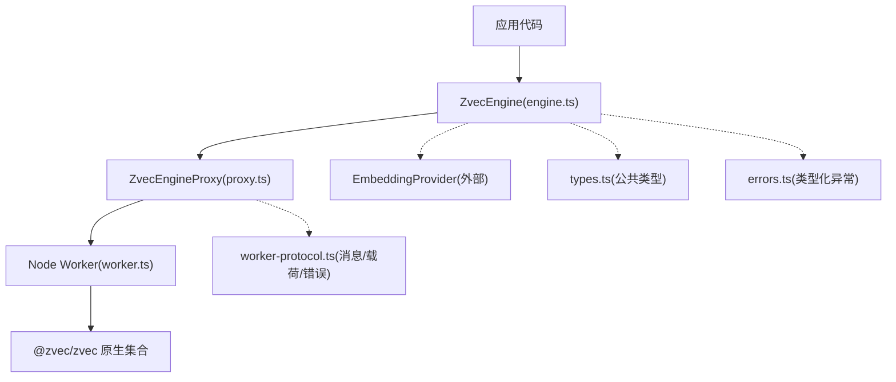
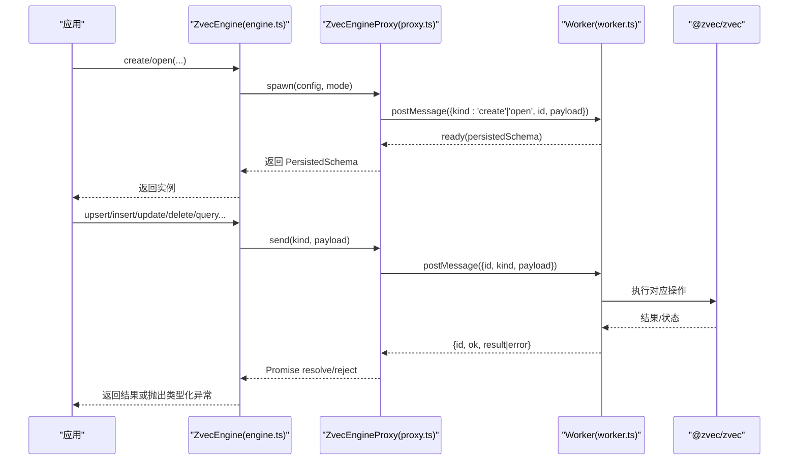
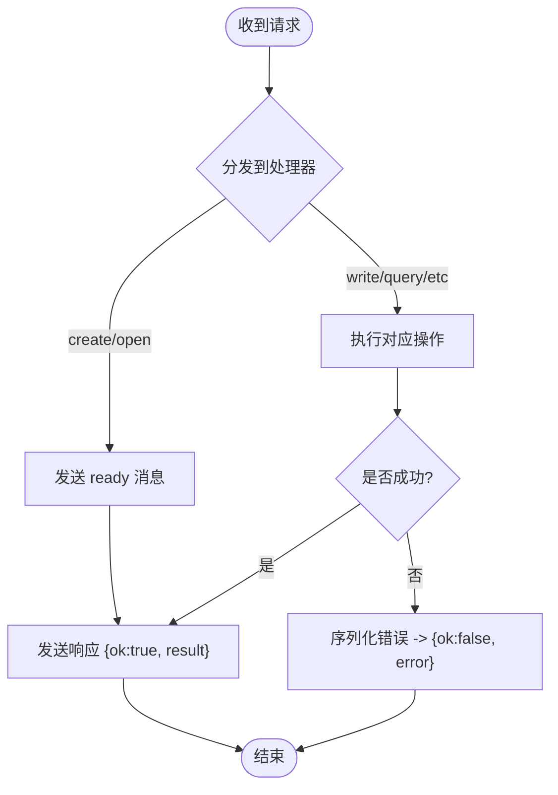
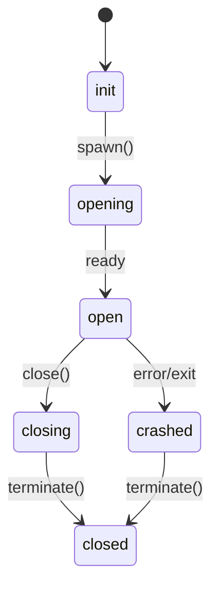
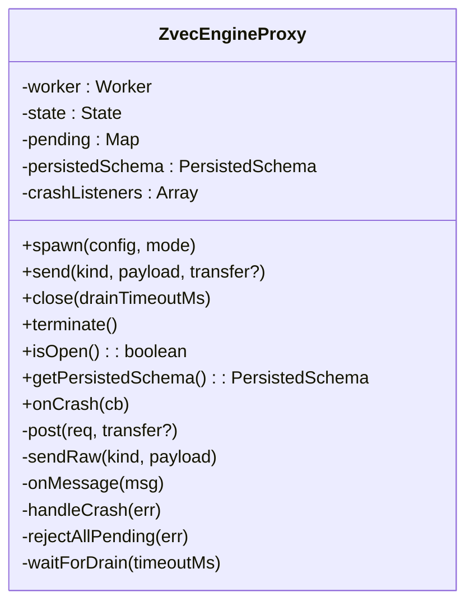
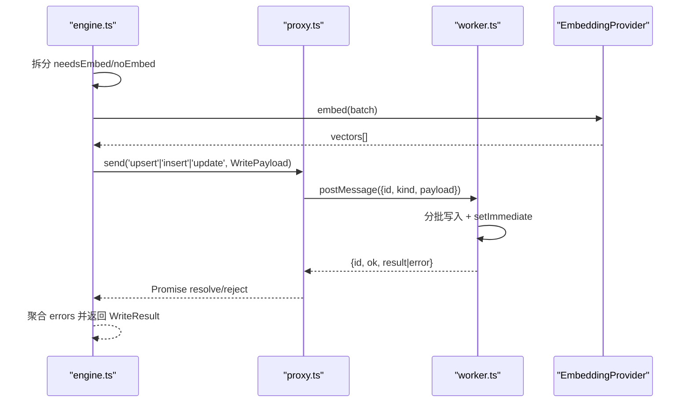
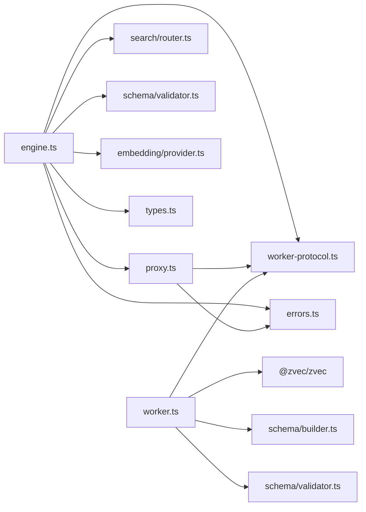

# 工作进程通信协议

<cite>
**本文引用的文件**
- [worker-protocol.ts](file://src/zvec-engine/worker-protocol.ts)
- [worker.ts](file://src/zvec-engine/worker.ts)
- [proxy.ts](file://src/zvec-engine/proxy.ts)
- [engine.ts](file://src/zvec-engine/engine.ts)
- [types.ts](file://src/zvec-engine/types.ts)
- [errors.ts](file://src/zvec-engine/errors.ts)
</cite>

## 目录
1. [简介](#简介)
2. [项目结构](#项目结构)
3. [核心组件](#核心组件)
4. [架构总览](#架构总览)
5. [详细组件分析](#详细组件分析)
6. [依赖关系分析](#依赖关系分析)
7. [性能考量](#性能考量)
8. [故障排查指南](#故障排查指南)
9. [结论](#结论)
10. [附录：数据格式规范](#附录数据格式规范)

## 简介
本文件面向“主进程—工作进程”之间的进程间通信协议，覆盖请求/响应模式、异步处理机制、Worker 启动与管理、Proxy 层设计（消息序列化、错误传播、连接管理）、数据格式规范（DocPayload、WritePayload 等），以及调试与性能监控实践。该协议基于 Node.js worker_threads，通过 postMessage 传递结构化消息，使用 UUID 关联请求与响应，并通过 Transferable 实现向量数据的零拷贝传输。

## 项目结构
围绕 zvec-engine 子模块的四个关键文件构成完整通信链路：
- engine.ts：对外门面，负责编排嵌入、路由、校验、调用 Proxy。
- proxy.ts：主线程侧代理，封装 Worker 生命周期、消息收发、状态机与超时控制。
- worker.ts：工作进程入口，串行处理数据库操作，维护唯一集合句柄。
- worker-protocol.ts：定义跨进程消息类型、载荷结构与错误序列化。
- types.ts：公共类型定义（配置、Schema、检索请求、结果等）。
- errors.ts：类型化异常及跨线程反序列化映射。

图表来源
- [engine.ts:68-131](file://src/zvec-engine/engine.ts#L68-L131)
- [proxy.ts:44-126](file://src/zvec-engine/proxy.ts#L44-L126)
- [worker.ts:62-163](file://src/zvec-engine/worker.ts#L62-L163)
- [worker-protocol.ts:76-136](file://src/zvec-engine/worker-protocol.ts#L76-L136)
- [types.ts:41-71](file://src/zvec-engine/types.ts#L41-L71)
- [errors.ts:17-99](file://src/zvec-engine/errors.ts#L17-L99)

章节来源
- [engine.ts:68-131](file://src/zvec-engine/engine.ts#L68-L131)
- [proxy.ts:44-126](file://src/zvec-engine/proxy.ts#L44-L126)
- [worker.ts:62-163](file://src/zvec-engine/worker.ts#L62-L163)
- [worker-protocol.ts:76-136](file://src/zvec-engine/worker-protocol.ts#L76-L136)
- [types.ts:41-71](file://src/zvec-engine/types.ts#L41-L71)
- [errors.ts:17-99](file://src/zvec-engine/errors.ts#L17-L99)

## 核心组件
- ZvecEngine（engine.ts）：对外 API 门面，负责配置校验、嵌入批处理、过滤编译、搜索路由、写入聚合、索引与优化操作。
- ZvecEngineProxy（proxy.ts）：主线程侧代理，管理 Worker 生命周期（spawn/close/terminate）、消息队列、就绪等待、崩溃处理与 drain 超时。
- Worker（worker.ts）：工作进程，持有唯一集合句柄，串行处理所有 DB 操作，支持批量写入与查询插队。
- 协议（worker-protocol.ts）：定义 WorkerRequest/WorkerResponse、各类 Payload、错误序列化/反序列化、Transferable 收集。
- 类型（types.ts）：统一 Schema、配置、检索请求、结果等类型契约。
- 异常（errors.ts）：类型化异常与跨线程反序列化构造器映射。

章节来源
- [engine.ts:68-131](file://src/zvec-engine/engine.ts#L68-L131)
- [proxy.ts:44-126](file://src/zvec-engine/proxy.ts#L44-L126)
- [worker.ts:62-163](file://src/zvec-engine/worker.ts#L62-L163)
- [worker-protocol.ts:76-136](file://src/zvec-engine/worker-protocol.ts#L76-L136)
- [types.ts:41-71](file://src/zvec-engine/types.ts#L41-L71)
- [errors.ts:17-99](file://src/zvec-engine/errors.ts#L17-L99)

## 架构总览
主进程通过 ZvecEngine 暴露稳定接口；内部委托 ZvecEngineProxy 与独立 Worker 通信。Worker 内维护单一集合句柄，串行执行所有写/读/索引/优化等操作，保证一致性并简化锁管理。向量数据通过 Float32Array + transfer list 进行零拷贝传输，减少内存复制开销。错误在 Worker 中序列化为 SerializedError，主线程反序列化为具体类型化异常。

图表来源
- [engine.ts:97-131](file://src/zvec-engine/engine.ts#L97-L131)
- [proxy.ts:56-126](file://src/zvec-engine/proxy.ts#L56-L126)
- [worker.ts:62-163](file://src/zvec-engine/worker.ts#L62-L163)
- [worker-protocol.ts:76-136](file://src/zvec-engine/worker-protocol.ts#L76-L136)

## 详细组件分析

### 请求/响应与异步处理机制
- 请求标识：每个 WorkerRequest 携带唯一 id（UUID v4），用于匹配响应。
- 响应类型：WorkerResponse 包含成功结果或 SerializedError；ready 消息用于 create/open 完成后通知主线程。
- 异步模型：主线程通过 Promise 挂起等待；Worker 串行处理消息，避免并发竞争。
- 批处理与插队：写入按 batchSize 分批，并在批次间让出事件循环（setImmediate），使查询可插队执行。

图表来源
- [worker.ts:62-87](file://src/zvec-engine/worker.ts#L62-L87)
- [worker-protocol.ts:76-136](file://src/zvec-engine/worker-protocol.ts#L76-L136)

章节来源
- [worker-protocol.ts:76-136](file://src/zvec-engine/worker-protocol.ts#L76-L136)
- [worker.ts:62-163](file://src/zvec-engine/worker.ts#L62-L163)

### Worker 进程的启动与管理
- 启动：Proxy.spawn 创建 dedicated Worker，发送 create/open 消息，等待 ready 消息后进入 open 状态。
- 关闭：Proxy.close 先 drain 在途请求，再向 Worker 发送 close 以释放资源，最后 terminate。
- 销毁：Proxy.send('destroy') 由 Worker 执行 closeSync 与底层 destroy，随后 terminate。
- 崩溃处理：Worker 的 error/exit 事件触发 handleCrash，拒绝所有 pending 请求，标记为 crashed。

图表来源
- [proxy.ts:56-173](file://src/zvec-engine/proxy.ts#L56-L173)
- [worker.ts:167-215](file://src/zvec-engine/worker.ts#L167-L215)

章节来源
- [proxy.ts:56-173](file://src/zvec-engine/proxy.ts#L56-L173)
- [worker.ts:167-215](file://src/zvec-engine/worker.ts#L167-L215)

### Proxy 层设计：序列化、错误传播与连接管理
- 消息序列化：postMessage 前自动收集 payload 中的 Float32Array buffer 作为 transfer list，实现零拷贝传输。
- 错误传播：Worker 将错误序列化为 SerializedError；主线程 onMessage 中反序列化为具体类型化异常并 reject Promise。
- 连接管理：维护 pending Map（id -> Promise），ready 专用通道，crash 时统一拒绝所有待处理请求；close 带 drain 超时保护。

图表来源
- [proxy.ts:44-277](file://src/zvec-engine/proxy.ts#L44-L277)

章节来源
- [proxy.ts:44-277](file://src/zvec-engine/proxy.ts#L44-L277)
- [worker-protocol.ts:138-201](file://src/zvec-engine/worker-protocol.ts#L138-L201)

### 数据流与处理逻辑
- 写入路径：engine 拆分需嵌入与不需嵌入的文档，对需嵌入的按小批调用 EmbeddingProvider，转换为 Float32Array，组装 WritePayload 发送至 Worker；Worker 分批写入并让出事件循环。
- 检索路径：engine 编译 filter、路由选择 query/multiQuery，必要时在主线程 embed 并注入 vector，发送到 Worker；Worker 返回 RawHitPayload 数组，engine 归一化为 Hit。
- 索引与优化：engine 直接转发 createIndex/dropIndex/optimize 至 Worker 同步执行。

图表来源
- [engine.ts:330-450](file://src/zvec-engine/engine.ts#L330-L450)
- [worker.ts:286-331](file://src/zvec-engine/worker.ts#L286-L331)
- [worker-protocol.ts:27-37](file://src/zvec-engine/worker-protocol.ts#L27-L37)

章节来源
- [engine.ts:330-450](file://src/zvec-engine/engine.ts#L330-L450)
- [worker.ts:286-331](file://src/zvec-engine/worker.ts#L286-L331)
- [worker-protocol.ts:27-37](file://src/zvec-engine/worker-protocol.ts#L27-L37)

### 错误处理与恢复
- 类型化异常：errors.ts 定义多种业务异常，均继承 ZvecEngineError，支持 code/data 字段。
- 跨线程反序列化：worker-protocol.serializeError 捕获错误并转为 SerializedError；deserializeError 根据 name 查找构造器重建异常。
- 崩溃恢复：Proxy.handleCrash 拒绝所有 pending，清理 ready 回调，通知 crash 监听器；engine 在写入/检索前检查 isOpen 状态。

章节来源
- [errors.ts:17-99](file://src/zvec-engine/errors.ts#L17-L99)
- [worker-protocol.ts:138-169](file://src/zvec-engine/worker-protocol.ts#L138-L169)
- [proxy.ts:244-264](file://src/zvec-engine/proxy.ts#L244-L264)
- [engine.ts:499-508](file://src/zvec-engine/engine.ts#L499-L508)

## 依赖关系分析
- engine.ts 依赖 proxy.ts、search/router、schema/validator、embedding/provider、worker-protocol.ts、types.ts、errors.ts。
- proxy.ts 依赖 worker-protocol.ts、errors.ts。
- worker.ts 依赖 @zvec/zvec、schema/builder、schema/validator、worker-protocol.ts。
- worker-protocol.ts 依赖 errors.ts、types.ts。
- types.ts 被多处引用，提供统一契约。
- errors.ts 提供异常类型与反序列化映射。

图表来源
- [engine.ts:1-60](file://src/zvec-engine/engine.ts#L1-L60)
- [proxy.ts:14-33](file://src/zvec-engine/proxy.ts#L14-L33)
- [worker.ts:17-46](file://src/zvec-engine/worker.ts#L17-L46)
- [worker-protocol.ts:11-15](file://src/zvec-engine/worker-protocol.ts#L11-L15)

章节来源
- [engine.ts:1-60](file://src/zvec-engine/engine.ts#L1-L60)
- [proxy.ts:14-33](file://src/zvec-engine/proxy.ts#L14-L33)
- [worker.ts:17-46](file://src/zvec-engine/worker.ts#L17-L46)
- [worker-protocol.ts:11-15](file://src/zvec-engine/worker-protocol.ts#L11-L15)

## 性能考量
- 零拷贝传输：通过 collectTransferables 收集 Float32Array.buffer 并使用 postMessage transfer list，避免大数据量向量复制。
- 批处理与事件循环让出：写入按 batchSize 分批，并在批次间 await setImmediate，降低阻塞时间，提高查询吞吐。
- 嵌入失败粒度：embed 小批失败仅影响该批，其余文档继续写入，提升整体成功率。
- 资源释放：close 流程确保 drain 完成后再释放锁与终止进程，避免泄漏。

[本节为通用性能建议，不直接分析具体文件]

## 故障排查指南
- 常见错误定位
  - WorkerSpawnError：spawn 失败，检查 Worker 加载与路径。
  - WorkerUnavailableError：非 open 状态发送请求，检查生命周期。
  - WorkerCrashedError：Worker 崩溃，查看 error/exit 事件与日志。
  - CloseTimeoutError：drain 超时，检查 pending 数量与耗时操作。
  - CollectionLockedException/CORRUPTED/NOT_FOUND：集合状态问题，使用 probe 判断。
- 调试方法
  - 观察 ready 消息：确认 create/open 完成后再发业务请求。
  - 检查 pending 队列：close 前 pending.size > 0 会触发 drain 超时。
  - 验证 transfer list：确认向量数据是否被正确收集与传输。
  - 错误堆栈：SerializedError.stack 保留堆栈信息，便于定位 Worker 侧异常。
- 恢复策略
  - 重试：对网络或临时错误可重试；对损坏集合应重建。
  - 重建：destroy 后重新 create/open。
  - 降级：在崩溃时回退到只读或离线模式。

章节来源
- [errors.ts:63-99](file://src/zvec-engine/errors.ts#L63-L99)
- [proxy.ts:131-173](file://src/zvec-engine/proxy.ts#L131-L173)
- [worker-protocol.ts:138-169](file://src/zvec-engine/worker-protocol.ts#L138-L169)

## 结论
该通信协议通过清晰的请求/响应模型、严格的类型契约与健壮的错误传播机制，实现了主进程与工作进程之间的高可靠、高性能交互。Proxy 层统一管理 Worker 生命周期与消息队列，结合零拷贝传输与批处理策略，满足大规模向量索引场景下的稳定性与吞吐需求。配合完善的调试与故障排查手段，可在生产环境中快速定位与恢复问题。

[本节为总结性内容，不直接分析具体文件]

## 附录：数据格式规范
- 请求消息（WorkerRequest）
  - 字段：id（字符串，UUID）、kind（枚举）、payload（对象）
  - kind 包括：create、open、close、destroy、info、upsert、insert、update、delete、fetch、listIds、query、multiQuery、optimize、createIndex、dropIndex
- 响应消息（WorkerResponse）
  - 成功：{id, ok: true, result}
  - 失败：{id, ok: false, error: SerializedError}
  - 就绪：{id: '__ready__', kind: 'ready', persistedSchema?}
- 载荷结构
  - WritePayload：docs（WriteDocPayload[]）、batchSize（可选）
  - WriteDocPayload：id、text（可选）、vector（可选，Float32Array）、fields（可选）
  - QueryPayload：fieldName、vector（可选）、ftsMatchString/ftsQueryString（可选）、topk、filterSql（可选）、outputFields（可选）、includeVector（可选）
  - MultiQueryPayload：queries（MultiQueryItem[]）、topk、rerankRrf/rerankWeighted（可选）、filterSql（可选）、outputFields（可选）、includeVector（可选）
  - OpenRequestPayload：dbPath、collectionName（可选）、readOnly（可选）
  - CreateRequestPayload：config（不含 embedding）
- 结果结构
  - DocPayload：id、vector（可选）、fields（可选）、text（可选）
  - RawHitPayload：id、distance/score（二选一）、fields、text（可选）、vector（可选）
  - InfoResultPayload：name、denseField、dimension、metric、denseDataType、scalarFields、fts、docCount、locked
- 错误结构（SerializedError）
  - name、message、code（可选）、stack（可选）、data（可选）

章节来源
- [worker-protocol.ts:27-136](file://src/zvec-engine/worker-protocol.ts#L27-L136)
- [types.ts:41-71](file://src/zvec-engine/types.ts#L41-L71)
- [types.ts:138-187](file://src/zvec-engine/types.ts#L138-L187)