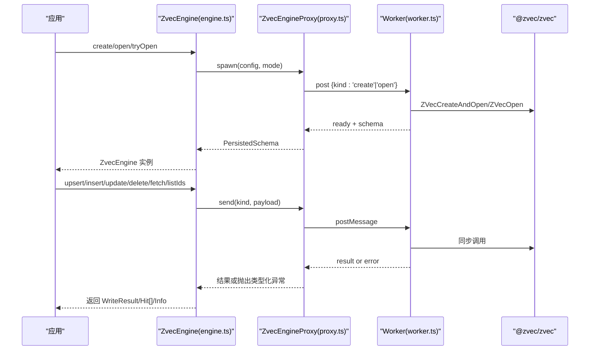
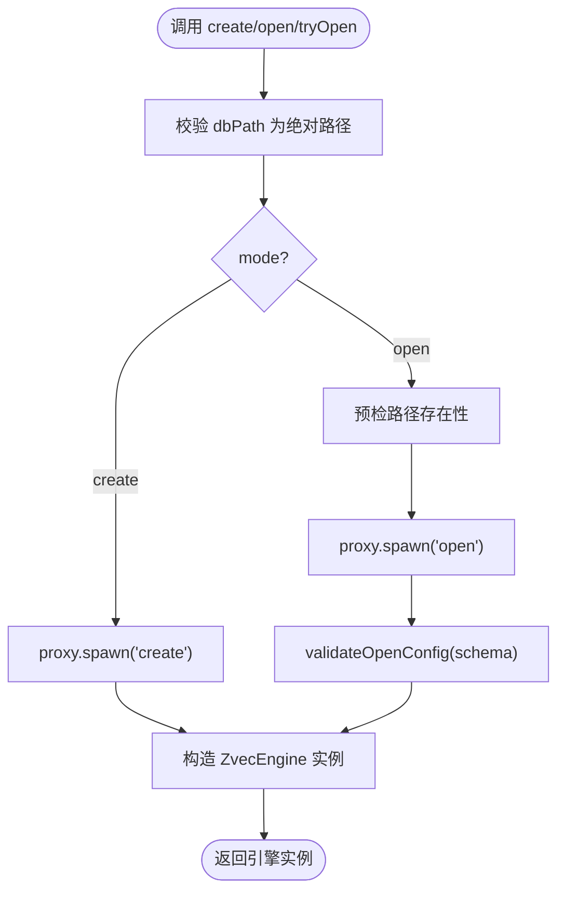
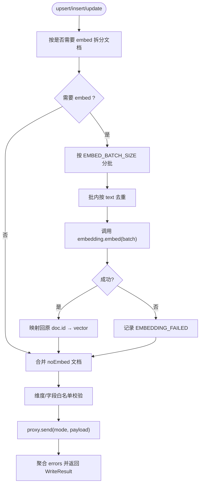
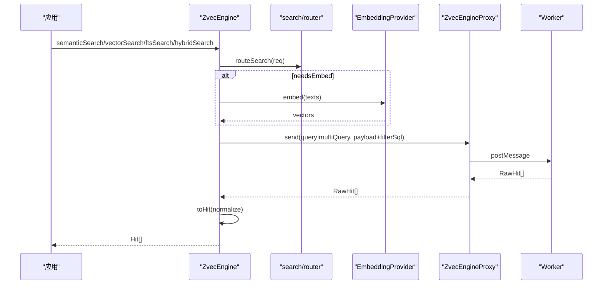
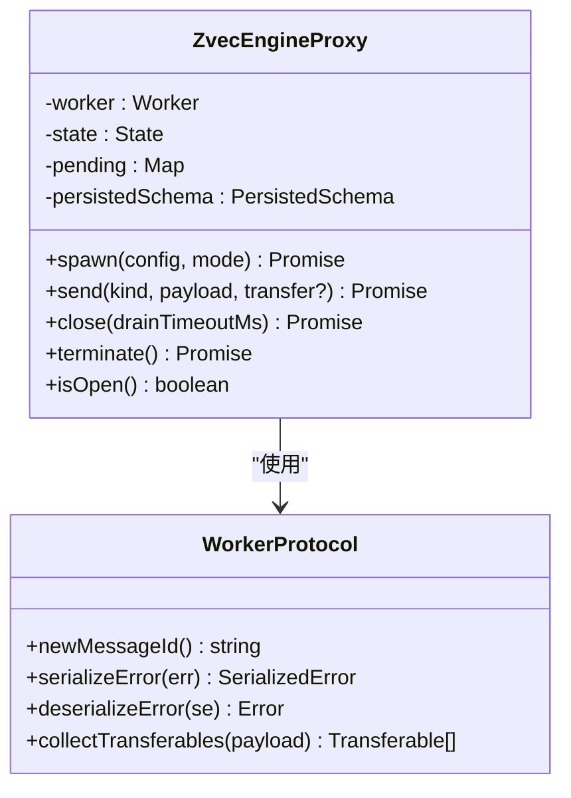
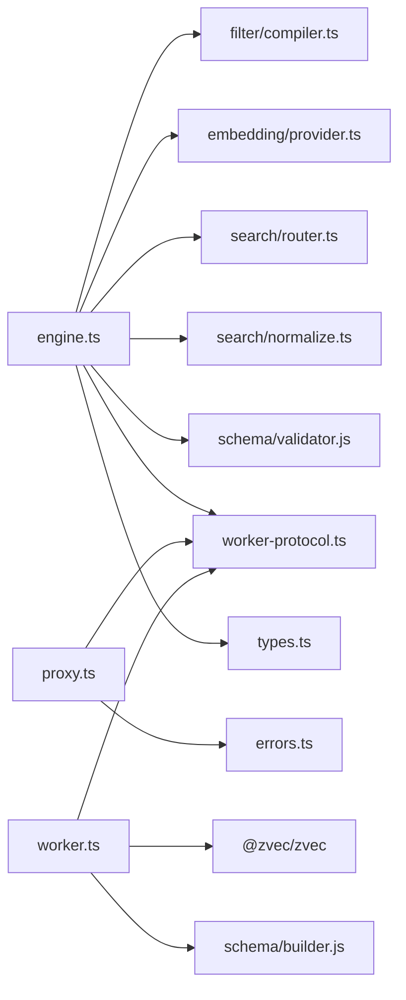

# 引擎核心封装

<cite>
**本文引用的文件**
- [engine.ts](file://src/zvec-engine/engine.ts)
- [proxy.ts](file://src/zvec-engine/proxy.ts)
- [worker.ts](file://src/zvec-engine/worker.ts)
- [errors.ts](file://src/zvec-engine/errors.ts)
- [types.ts](file://src/zvec-engine/types.ts)
- [worker-protocol.ts](file://src/zvec-engine/worker-protocol.ts)
- [zvec-engine.test.mjs](file://test/zvec-engine.test.mjs)
</cite>

## 目录
1. [简介](#简介)
2. [项目结构](#项目结构)
3. [核心组件](#核心组件)
4. [架构总览](#架构总览)
5. [详细组件分析](#详细组件分析)
6. [依赖关系分析](#依赖关系分析)
7. [性能考量](#性能考量)
8. [故障排查指南](#故障排查指南)
9. [结论](#结论)
10. [附录：使用示例与最佳实践](#附录使用示例与最佳实践)

## 简介
本文件面向“ZvecEngine”引擎核心封装，系统性说明门面设计模式、生命周期管理、进程间通信机制（主线程与 worker）、错误处理策略、健康检查与锁检测、资源清理的最佳实践，并给出基于测试用例的 API 使用指引。目标是帮助读者在不深入底层实现的情况下，正确、安全、高效地使用引擎。

## 项目结构
引擎核心位于 src/zvec-engine，采用“门面 + 代理 + worker”的分层组织：
- engine.ts：对外暴露 ZvecEngine 门面，提供 create/open/tryOpen、读写、检索、索引、生命周期等方法。
- proxy.ts：主线程侧代理，负责 spawn worker、消息路由、状态机、关闭/销毁流程。
- worker.ts：独立 worker 线程入口，持有唯一集合句柄，串行执行所有数据库操作。
- worker-protocol.ts：定义主线程与 worker 之间的消息协议、序列化/反序列化、Transferable 收集。
- errors.ts：类型化异常体系，支持跨线程重建。
- types.ts：公共类型定义（配置、文档、过滤、检索、结果等）。

```mermaid
graph TB
A["应用代码"] --> B["ZvecEngine(门面)<br/>engine.ts"]
B --> C["ZvecEngineProxy(代理)<br/>proxy.ts"]
C --> D["Worker(工作线程)<br/>worker.ts"]
C < --> |postMessage / 协议<br/>worker-protocol.ts| D
B --> E["EmbeddingProvider<br/>types.ts"]
B --> F["Filter编译/Router<br/>filter/compiler.ts, search/router.ts"]
D --> G["@zvec/zvec 原生库"]
```

图表来源
- [engine.ts:68-143](file://src/zvec-engine/engine.ts#L68-L143)
- [proxy.ts:44-126](file://src/zvec-engine/proxy.ts#L44-L126)
- [worker.ts:62-163](file://src/zvec-engine/worker.ts#L62-L163)
- [worker-protocol.ts:76-136](file://src/zvec-engine/worker-protocol.ts#L76-L136)

章节来源
- [engine.ts:1-143](file://src/zvec-engine/engine.ts#L1-L143)
- [proxy.ts:1-126](file://src/zvec-engine/proxy.ts#L1-L126)
- [worker.ts:1-163](file://src/zvec-engine/worker.ts#L1-L163)
- [worker-protocol.ts:1-136](file://src/zvec-engine/worker-protocol.ts#L1-L136)

## 核心组件
- ZvecEngine（门面）：统一入口，封装创建/打开/探测、写入编排（含 embedding 批处理与失败隔离）、检索路由与归一化、索引与优化、生命周期方法。
- ZvecEngineProxy（代理）：维护 worker 生命周期与消息队列，确保在途请求 drain 后再 close，崩溃时拒绝所有 pending。
- Worker（工作线程）：持有唯一集合句柄，串行处理 create/open/close/destroy/info/upsert/insert/update/delete/fetch/listIds/query/multiQuery/optimize/createIndex/dropIndex。
- 协议层（worker-protocol）：以 id 关联请求响应，向量通过 Float32Array + transfer list 零拷贝传输，错误序列化为 SerializedError 并在主线程重建为类型化异常。
- 类型与错误（types.ts, errors.ts）：统一的配置、数据结构与异常体系，便于上层稳定消费。

章节来源
- [engine.ts:68-509](file://src/zvec-engine/engine.ts#L68-L509)
- [proxy.ts:44-277](file://src/zvec-engine/proxy.ts#L44-L277)
- [worker.ts:118-504](file://src/zvec-engine/worker.ts#L118-L504)
- [worker-protocol.ts:16-136](file://src/zvec-engine/worker-protocol.ts#L16-L136)
- [types.ts:15-187](file://src/zvec-engine/types.ts#L15-L187)
- [errors.ts:17-99](file://src/zvec-engine/errors.ts#L17-L99)

## 架构总览
引擎采用“门面-代理-worker”三层架构：
- 门面层（ZvecEngine）：对外暴露简洁 API；内部完成参数校验、embedding 批处理、filter 编译、路由选择、结果归一化。
- 代理层（ZvecEngineProxy）：管理 worker 生命周期，维护状态机（init/opening/open/closing/closed/crashed/failed），保证并发安全与优雅关闭。
- 工作线程（worker.ts）：单实例单集合，串行执行所有操作，避免竞争条件；通过 setImmediate 让出事件循环，保障查询插队。



图表来源
- [engine.ts:97-143](file://src/zvec-engine/engine.ts#L97-L143)
- [proxy.ts:56-126](file://src/zvec-engine/proxy.ts#L56-L126)
- [worker.ts:62-163](file://src/zvec-engine/worker.ts#L62-L163)
- [worker-protocol.ts:76-136](file://src/zvec-engine/worker-protocol.ts#L76-L136)

## 详细组件分析

### ZvecEngine 门面：静态工厂方法与生命周期
- 静态工厂方法
  - create：校验绝对路径与配置，spawn worker 执行 create，成功后构造门面实例；失败则终止 worker。
  - open：预检路径存在性，spawn worker 执行 open，校验 schema 一致性后构造实例；失败则终止 worker。
  - tryOpen：仅用于布尔判断，任何 open 失败返回 null，不抛异常。
- 生命周期
  - info：获取集合信息（名称、维度、metric、docCount、标量字段、fts 等）。
  - close：委托 proxy.close，drain 在途请求后释放 worker。
  - destroy：发送 destroy 到 worker 执行 closeSync + 销毁集合，再 terminate。
  - isHealthy/isLocked/isOpen：基于 proxy 状态与 destroyed 标志判断。
  - probe：无句柄探测 dbPath 状态（不存在/被持锁/健康/损坏），内部带超时保护，避免阻塞。



图表来源
- [engine.ts:97-143](file://src/zvec-engine/engine.ts#L97-L143)

章节来源
- [engine.ts:97-239](file://src/zvec-engine/engine.ts#L97-L239)

### 写入编排：embedding 批处理与失败隔离
- 将需要 embed 的文档按固定批次大小切分（EMBED_BATCH_SIZE=64），逐批调用 EmbeddingProvider。
- 批内去重相同文本，避免重复 HTTP 调用；失败粒度限定在批次内，仅该批 doc 标记 EMBEDDING_FAILED，不影响其他批次。
- 组装待写数据时进行维度校验、字段白名单校验；update 模式强制要求 dense vector 或 text（FTS 联动规则）。
- 最终批量发送至 worker，聚合 errors 返回 WriteResult。



图表来源
- [engine.ts:330-450](file://src/zvec-engine/engine.ts#L330-L450)

章节来源
- [engine.ts:330-450](file://src/zvec-engine/engine.ts#L330-L450)

### 检索编排：路由与归一化
- 根据请求类型（语义/向量/全文/混合）路由至 query 或 multiQuery。
- 若需 embed，主线程调用 embedding.embed 并将向量注入 QueryPayload/MultiQueryPayload。
- filter 编译为 SQL 片段注入请求；worker 返回原始命中，主线程归一化为 Hit（score、queryType、fields、text/vector）。



图表来源
- [engine.ts:454-495](file://src/zvec-engine/engine.ts#L454-L495)
- [worker.ts:396-436](file://src/zvec-engine/worker.ts#L396-L436)

章节来源
- [engine.ts:454-495](file://src/zvec-engine/engine.ts#L454-L495)
- [worker.ts:396-436](file://src/zvec-engine/worker.ts#L396-L436)

### 进程间通信机制：proxy.spawn 与消息协议
- spawn：创建 worker_threads.Worker，注册 message/error/exit 监听，发送 create/open 请求，等待 ready 消息携带持久化 schema。
- send：为每个请求生成唯一 id，维护 pending Promise 表；响应到达后 resolve/reject。
- close：先等待 in-flight 请求 drain（可配置超时），再发送 close 给 worker 释放 LOCK，最后 terminate。
- terminate：立即 reject 所有 pending，终止 worker。
- 协议：请求/响应通过 id 关联；向量使用 Float32Array + transfer list 零拷贝；错误序列化为 SerializedError，主线程用 ERROR_CONSTRUCTORS 重建类型化异常。



图表来源
- [proxy.ts:44-277](file://src/zvec-engine/proxy.ts#L44-L277)
- [worker-protocol.ts:21-169](file://src/zvec-engine/worker-protocol.ts#L21-L169)

章节来源
- [proxy.ts:56-277](file://src/zvec-engine/proxy.ts#L56-L277)
- [worker-protocol.ts:76-169](file://src/zvec-engine/worker-protocol.ts#L76-L169)

### 错误处理策略
- 类型化异常：所有异常继承 ZvecEngineError，包含 code/data，支持跨线程反序列化重建。
- 常见异常分类：
  - Schema/配置类：DimensionMismatchError、InvalidSchemaError、InvalidDocInputError、InvalidSearchError、InvalidFilterError、SchemaMismatchError。
  - 集合生命周期：CollectionNotFoundError、CollectionLockedException、CollectionCorruptedException、CollectionAlreadyExistsError。
  - Embedding：EmbeddingError、EmbeddingConfigError（内部模块）。
  - Worker：WorkerSpawnError、WorkerCrashedError、WorkerUnavailableError、WorkerProtocolError、CloseTimeoutError。
- 写入错误：WriteResult.errors 中记录每条失败原因（如 EMBEDDING_FAILED、ID_CONFLICT、NOT_FOUND、ZVEC_WRITE_ERROR、UNKNOWN）。
- 探测错误：probe 将异常映射为 ProbeResult 的状态字段（exists/locked/healthy/error）。

章节来源
- [errors.ts:17-99](file://src/zvec-engine/errors.ts#L17-L99)
- [engine.ts:151-199](file://src/zvec-engine/engine.ts#L151-L199)
- [types.ts:155-166](file://src/zvec-engine/types.ts#L155-L166)

### 健康检查、锁检测与资源清理最佳实践
- 健康检查
  - 实例级：isHealthy() 基于 proxy.isOpen() 与 destroyed 标志。
  - 无句柄探测：static probe(dbPath, timeoutMs) 返回 exists/locked/healthy/error，适合启动前自检或外部监控。
- 锁检测
  - 实例级 isLocked() 在本实例持锁时返回 false；是否被其他进程持锁由 probe 判定（基于 ZVecOpen 阻塞行为与超时）。
- 资源清理
  - 正常关闭：engine.close() 会 drain 在途请求，发送 close 给 worker 释放 LOCK，再 terminate。
  - 强制销毁：engine.destroy() 在 worker 端执行 closeSync + 销毁集合，再 terminate。
  - 探测临时代理：closeProbeProxyBounded 对 probe 使用的临时 proxy 加 2s 上限，防止阻塞。

章节来源
- [engine.ts:203-239](file://src/zvec-engine/engine.ts#L203-L239)
- [engine.ts:151-199](file://src/zvec-engine/engine.ts#L151-L199)
- [engine.ts:550-568](file://src/zvec-engine/engine.ts#L550-L568)
- [proxy.ts:131-177](file://src/zvec-engine/proxy.ts#L131-L177)

## 依赖关系分析
- 门面依赖：
  - 过滤器编译与允许字段构建（filter/compiler.js）。
  - 嵌入提供者接口（embedding/provider.ts）。
  - 搜索路由与归一化（search/router.ts, search/normalize.ts）。
  - 配置校验（schema/validator.js）。
  - 协议与类型（worker-protocol.ts, types.ts）。
- 代理依赖：
  - Node worker_threads。
  - 错误类型（errors.ts）。
  - 协议（worker-protocol.ts）。
- 工作线程依赖：
  - @zvec/zvec 原生库（ZVecCreateAndOpen/ZVecOpen 等）。
  - 协议（worker-protocol.ts）。
  - 配置构建（schema/builder.js）。



图表来源
- [engine.ts:27-60](file://src/zvec-engine/engine.ts#L27-L60)
- [proxy.ts:18-33](file://src/zvec-engine/proxy.ts#L18-L33)
- [worker.ts:21-46](file://src/zvec-engine/worker.ts#L21-L46)

章节来源
- [engine.ts:27-60](file://src/zvec-engine/engine.ts#L27-L60)
- [proxy.ts:18-33](file://src/zvec-engine/proxy.ts#L18-L33)
- [worker.ts:21-46](file://src/zvec-engine/worker.ts#L21-L46)

## 性能考量
- 写入批处理：默认 batch size 100，减少频繁 IO；worker 侧每批后 setImmediate 让出事件循环，避免阻塞查询。
- Embedding 批处理：EMBED_BATCH_SIZE=64，与 provider 默认 batchSize 对齐，失败粒度最小化，避免单次抖动导致整批静默存 0。
- 零拷贝传输：Float32Array + transfer list，避免大向量复制开销。
- 查询插队：写入过程中主动让出，确保查询及时响应。
- 探测超时：probe 默认 3s 超时，避免 ZVecOpen 阻塞拖垂调用链；临时 proxy 关闭加 2s 上限。

[本节为通用性能讨论，无需具体文件引用]

## 故障排查指南
- 常见问题定位
  - 无法打开集合：检查路径是否存在、是否被其他进程持锁（使用 static probe 判断 locked）。
  - 维度不匹配：确认 embedding.dimension 与集合 dimension 一致。
  - 更新失败：update 必须提供 dense vector 或 text（FTS 联动规则）；否则抛出 InconsistentUpdateError。
  - 写入错误：查看 WriteResult.errors 中的 code 与 reason，区分 ID_CONFLICT、NOT_FOUND、ZVEC_WRITE_ERROR。
  - Worker 崩溃：捕获 WorkerCrashedError，检查日志与资源占用。
- 建议步骤
  - 使用 static probe 做启动前自检。
  - 使用 engine.info 核对 schema 与 docCount。
  - 对大批量写入启用合理 batch size，观察 write 耗时与错误率。
  - 对 embedding 失败场景，关注 EMBEDDING_FAILED 条目，必要时重试或降级。

章节来源
- [engine.ts:151-199](file://src/zvec-engine/engine.ts#L151-L199)
- [engine.ts:243-274](file://src/zvec-engine/engine.ts#L243-L274)
- [types.ts:155-166](file://src/zvec-engine/types.ts#L155-L166)
- [errors.ts:17-99](file://src/zvec-engine/errors.ts#L17-L99)

## 结论
ZvecEngine 通过门面设计提供了清晰稳定的 API，结合代理与工作线程实现了进程隔离与串行执行，保障了数据一致性与稳定性。其完善的错误体系、健康检查与资源管理机制，使得在复杂生产环境中也能可靠运行。遵循本文的最佳实践，可以最大化发挥引擎的性能与可靠性。

[本节为总结，无需具体文件引用]

## 附录：使用示例与最佳实践
以下示例来自测试用例，展示典型用法与关键断言。请参照对应文件路径了解完整上下文。

- 创建集合、写入文档、四类检索、关闭与重新打开、探测
  - 参考：[zvec-engine.test.mjs:111-199](file://test/zvec-engine.test.mjs#L111-L199)
- 配置校验与错误类型
  - 维度不符、集合名非法、FTS 字段未声明等
  - 参考：[zvec-engine.test.mjs:68-94](file://test/zvec-engine.test.mjs#L68-L94)
- 过滤与白名单
  - 未声明字段过滤触发 InvalidFilterError
  - 参考：[zvec-engine.test.mjs:98-107](file://test/zvec-engine.test.mjs#L98-L107)

章节来源
- [zvec-engine.test.mjs:68-199](file://test/zvec-engine.test.mjs#L68-L199)