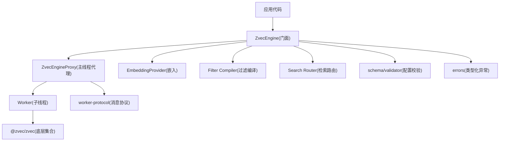
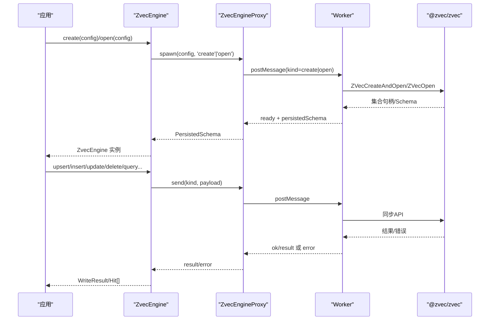
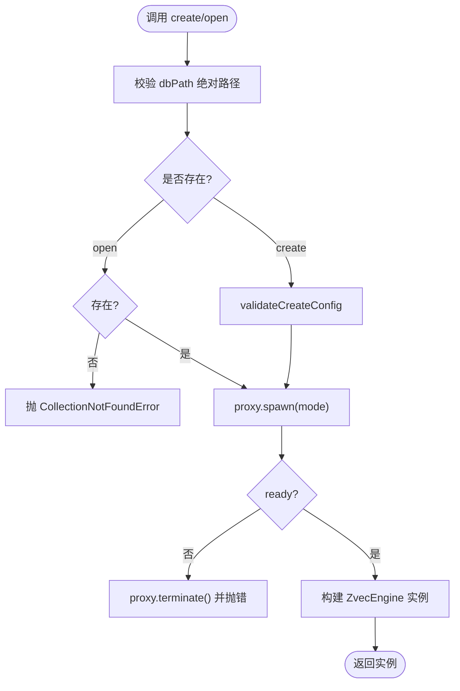
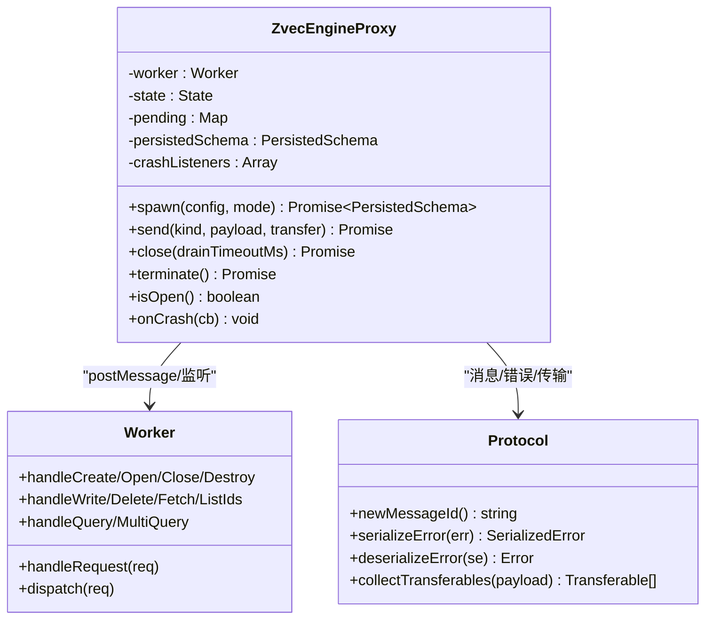
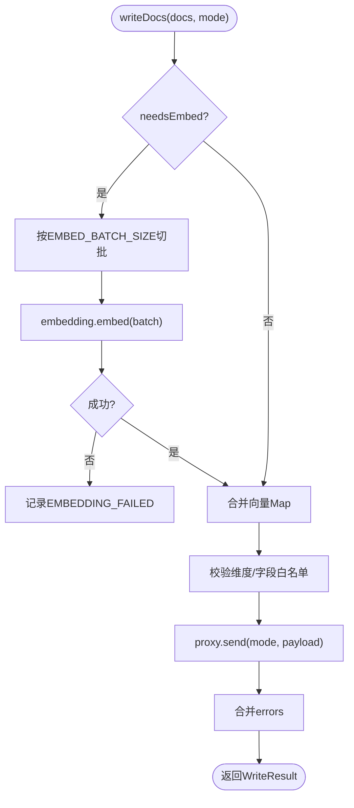
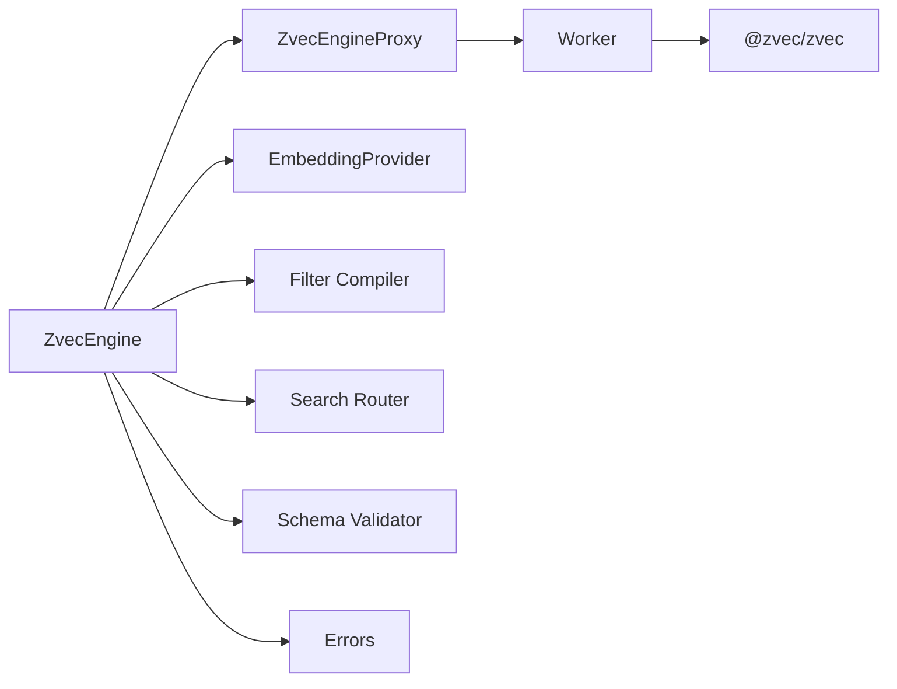

# 引擎核心架构

<cite>
**本文引用的文件**
- [engine.ts](file://src/zvec-engine/engine.ts)
- [proxy.ts](file://src/zvec-engine/proxy.ts)
- [worker.ts](file://src/zvec-engine/worker.ts)
- [worker-protocol.ts](file://src/zvec-engine/worker-protocol.ts)
- [types.ts](file://src/zvec-engine/types.ts)
- [errors.ts](file://src/zvec-engine/errors.ts)
- [validator.ts](file://src/zvec-engine/schema/validator.ts)
- [index.ts](file://src/zvec-engine/index.ts)
- [zvec-engine.test.mjs](file://test/zvec-engine.test.mjs)
</cite>

## 目录
1. [简介](#简介)
2. [项目结构](#项目结构)
3. [核心组件](#核心组件)
4. [架构总览](#架构总览)
5. [详细组件分析](#详细组件分析)
6. [依赖关系分析](#依赖关系分析)
7. [性能考量](#性能考量)
8. [故障排查指南](#故障排查指南)
9. [结论](#结论)
10. [附录：最佳实践](#附录最佳实践)

## 简介
本文件面向向量引擎“ZvecEngine”的核心架构，聚焦以下目标：
- 门面设计：ZvecEngine 作为统一入口，封装创建、打开、写入、检索、索引与生命周期管理。
- 生命周期管理：create/open/close/destroy 的完整流程与资源清理策略。
- 进程隔离机制：通过 ZvecEngineProxy 在独立 worker_threads 中运行底层集合句柄，实现进程级隔离与崩溃恢复。
- Worker 通信协议：基于 id 的请求-响应模型、Float32Array 零拷贝传输、错误序列化/反序列化。
- 工厂模式与配置验证：create/open 静态工厂 + schema/validator 严格校验。
- 错误处理策略：类型化异常体系、跨线程错误重建、失败项隔离（errors[]）。
- 状态监控：isHealthy/isLocked/isOpen 及 probe 探测。
- 资源清理与异常恢复：drain 等待、closeSync 释放锁、terminate 强制回收。
- 实例化、配置参数与性能调优的最佳实践。

## 项目结构
向量引擎位于 src/zvec-engine 下，采用“门面 + 代理 + 工作线程 + 协议 + 类型/错误”的分层组织：
- engine.ts：门面类，编排 create/open、写入、检索、索引、生命周期。
- proxy.ts：主线程侧代理，负责 spawn worker、消息路由、状态机、crash 处理。
- worker.ts：worker 线程入口，持有唯一集合句柄，串行处理请求。
- worker-protocol.ts：主/子线程消息协议、错误序列化、Transferable 收集。
- types.ts：公共类型定义（配置、文档、过滤、检索、结果等）。
- errors.ts：类型化异常与跨线程映射表。
- schema/validator.ts：配置铁律校验、持久化 schema 断言、zvec 原始错误映射。
- index.ts：对外导出门面与类型、EmbeddingProvider、核心异常。

图表来源
- [engine.ts:68-509](file://src/zvec-engine/engine.ts#L68-L509)
- [proxy.ts:44-185](file://src/zvec-engine/proxy.ts#L44-L185)
- [worker.ts:62-163](file://src/zvec-engine/worker.ts#L62-L163)
- [worker-protocol.ts:76-136](file://src/zvec-engine/worker-protocol.ts#L76-L136)
- [types.ts:41-187](file://src/zvec-engine/types.ts#L41-L187)
- [errors.ts:17-99](file://src/zvec-engine/errors.ts#L17-L99)
- [validator.ts:34-223](file://src/zvec-engine/schema/validator.ts#L34-L223)

章节来源
- [engine.ts:1-569](file://src/zvec-engine/engine.ts#L1-L569)
- [proxy.ts:1-286](file://src/zvec-engine/proxy.ts#L1-L286)
- [worker.ts:1-504](file://src/zvec-engine/worker.ts#L1-L504)
- [worker-protocol.ts:1-202](file://src/zvec-engine/worker-protocol.ts#L1-L202)
- [types.ts:1-187](file://src/zvec-engine/types.ts#L1-L187)
- [errors.ts:1-99](file://src/zvec-engine/errors.ts#L1-L99)
- [validator.ts:1-223](file://src/zvec-engine/schema/validator.ts#L1-L223)
- [index.ts:1-62](file://src/zvec-engine/index.ts#L1-L62)

## 核心组件
- ZvecEngine（门面）：提供 create/open/tryOpen/probe、upsert/insert/update/delete/fetch/listIds、semanticSearch/vectorSearch/ftsSearch/hybridSearch、createIndex/dropIndex/optimize、info、close/destroy、isHealthy/isLocked/isOpen。
- ZvecEngineProxy（进程隔离代理）：spawn 专用 worker、维护状态机（init/opening/open/closing/closed/crashed/failed）、消息排队与超时 drain、crash 事件广播、close/terminate 安全回收。
- Worker（子线程）：持有唯一集合句柄，串行处理所有 db 操作；写入分批并让出事件循环；close/destroy 释放锁并销毁集合。
- 通信协议：id 关联请求响应、Float32Array transfer 零拷贝、SerializedError 跨线程错误重建。
- 配置校验：create 时 V-01~V-07，open 时 O-01~O-05，schemaAssert 逐项比对，zvec 原始错误映射为类型化异常。
- 错误体系：继承 ZvecEngineError，支持 code/data/cause，跨线程可重建。

章节来源
- [engine.ts:68-509](file://src/zvec-engine/engine.ts#L68-L509)
- [proxy.ts:44-185](file://src/zvec-engine/proxy.ts#L44-L185)
- [worker.ts:118-215](file://src/zvec-engine/worker.ts#L118-L215)
- [worker-protocol.ts:76-136](file://src/zvec-engine/worker-protocol.ts#L76-L136)
- [validator.ts:34-223](file://src/zvec-engine/schema/validator.ts#L34-L223)
- [errors.ts:17-99](file://src/zvec-engine/errors.ts#L17-L99)

## 架构总览
ZvecEngine 作为门面，屏蔽了底层 zvec 集合与 worker 细节。调用方通过静态工厂 create/open 获取实例，内部通过 ZvecEngineProxy 启动独立 worker 线程，使用 worker-protocol 进行消息通信。写入路径按是否需要 embed 分流，检索路径经 router 路由到 query/multiQuery。生命周期 close/destroy 保证锁释放与进程回收。

图表来源
- [engine.ts:97-131](file://src/zvec-engine/engine.ts#L97-L131)
- [proxy.ts:56-109](file://src/zvec-engine/proxy.ts#L56-L109)
- [worker.ts:62-87](file://src/zvec-engine/worker.ts#L62-L87)
- [worker-protocol.ts:76-136](file://src/zvec-engine/worker-protocol.ts#L76-L136)

## 详细组件分析

### ZvecEngine 门面与生命周期
- 工厂模式：
  - create：绝对路径校验 → validateCreateConfig → spawn('create') → 构造实例。
  - open：存在性预检 → spawn('open') → validateOpenConfig → 构造实例。
  - tryOpen：捕获异常返回 null，便于“能否用”的布尔判断。
- 生命周期：
  - close：委托 proxy.close，drain 在途后 closeSync 释放 LOCK，再 terminate。
  - destroy：发送 destroy 给 worker（closeSync + ZVecDestroy），再 terminate。
  - isHealthy：proxy.isOpen() && !destroyed。
  - isLocked：当前实例持锁返回 false；是否被其他进程持锁由 probe 判定。
  - isOpen：proxy.isOpen()。
- probe：无句柄探测 dbPath 状态（NOT_FOUND/健康/locked/CORRUPTED/UNKNOWN），带超时避免阻塞。

图表来源
- [engine.ts:97-131](file://src/zvec-engine/engine.ts#L97-L131)
- [engine.ts:151-199](file://src/zvec-engine/engine.ts#L151-L199)
- [proxy.ts:56-109](file://src/zvec-engine/proxy.ts#L56-L109)

章节来源
- [engine.ts:97-131](file://src/zvec-engine/engine.ts#L97-L131)
- [engine.ts:217-239](file://src/zvec-engine/engine.ts#L217-L239)
- [engine.ts:151-199](file://src/zvec-engine/engine.ts#L151-L199)

### 进程隔离与 Worker 通信协议
- 进程隔离：ZvecEngineProxy 使用 node:worker_threads 启动专用 worker，每个 proxy 持有唯一 collection 句柄，避免共享状态竞争。
- 消息协议：
  - 请求：id(kind, payload)，包含 create/open/close/destroy/info/upsert/insert/update/delete/fetch/listIds/query/multiQuery/optimize/createIndex/dropIndex。
  - 响应：ok/result 或 ok:false + SerializedError。
  - 传输：Float32Array 通过 transfer list 零拷贝传递，减少内存复制。
  - 错误：跨线程 serializeError/deserializeError 重建类型化异常。
- 状态机：init → opening → open → closing → closed；crash/failed 分支保护。
- Drain：close 前等待 pending 完成，超时抛 CloseTimeoutError。

图表来源
- [proxy.ts:44-185](file://src/zvec-engine/proxy.ts#L44-L185)
- [worker.ts:62-163](file://src/zvec-engine/worker.ts#L62-L163)
- [worker-protocol.ts:21-136](file://src/zvec-engine/worker-protocol.ts#L21-L136)

章节来源
- [proxy.ts:44-185](file://src/zvec-engine/proxy.ts#L44-L185)
- [worker.ts:62-163](file://src/zvec-engine/worker.ts#L62-L163)
- [worker-protocol.ts:76-136](file://src/zvec-engine/worker-protocol.ts#L76-L136)

### 写入与检索编排
- 写入编排（writeDocs）：
  - 按是否需要 embed 拆分 needsEmbed/noEmbed。
  - needsEmbed 按 EMBED_BATCH_SIZE=64 切小批，批内去重文本，调用 EmbeddingProvider.embed，失败仅标记该批 doc 进 errors[]，不影响其他批次。
  - 组装待写 docs，校验维度、字段白名单，转换为 Float32Array 后批量发送至 worker。
  - 聚合 errors（embed 失败 + zvec 写入错误），返回 WriteResult。
- 检索编排（search）：
  - filter 编译为 SQL 片段。
  - routeSearch 决定 query/multiQuery、是否需要 embed。
  - 需要 embed 则主线程 embed 并注入 QueryPayload/MultiQueryPayload。
  - 发送 query/multiQuery，归一化为 Hit[]。

图表来源
- [engine.ts:330-450](file://src/zvec-engine/engine.ts#L330-L450)
- [worker.ts:286-331](file://src/zvec-engine/worker.ts#L286-L331)

章节来源
- [engine.ts:330-450](file://src/zvec-engine/engine.ts#L330-L450)
- [worker.ts:286-331](file://src/zvec-engine/worker.ts#L286-L331)

### 配置验证与错误处理
- 配置验证：
  - create：集合名合法性、维度匹配、metric 限定 COSINE、字段重名、FTS 字段声明与类型、路径不存在性。
  - open：embedding.dimension vs 持久化 dimension、metric 限定、schemaAssert 逐项比对。
  - mapZvecOpenError：将 zvec 原始错误映射为 CollectionLockedException/CollectionNotFoundError/CollectionCorruptedException。
- 错误处理：
  - 类型化异常继承 ZvecEngineError，携带 code/data/cause。
  - 跨线程错误序列化/反序列化，保持类型信息。
  - 写入失败项隔离：errors[] 不中断整批写入。
  - 关闭/销毁：close 先 drain 再 closeSync 释放锁，destroy 直接释放并销毁集合。

章节来源
- [validator.ts:34-223](file://src/zvec-engine/schema/validator.ts#L34-L223)
- [errors.ts:17-99](file://src/zvec-engine/errors.ts#L17-L99)
- [engine.ts:217-239](file://src/zvec-engine/engine.ts#L217-L239)

### 状态监控与资源清理
- 状态监控：
  - isHealthy：proxy.isOpen() && !destroyed。
  - isLocked：当前实例始终返回 false；是否被其他进程持锁通过 probe 判定。
  - isOpen：proxy.state === 'open'。
  - probe：尝试 open 并加超时，空目录视为 NOT_FOUND，锁定/损坏/未知状态分类返回。
- 资源清理：
  - close：drain 在途 → closeSync 释放 LOCK → terminate。
  - destroy：发送 destroy → closeSync + ZVecDestroy → terminate。
  - probe 临时 proxy：限时 close/terminate，防止阻塞。

章节来源
- [engine.ts:217-239](file://src/zvec-engine/engine.ts#L217-L239)
- [engine.ts:151-199](file://src/zvec-engine/engine.ts#L151-L199)
- [proxy.ts:131-173](file://src/zvec-engine/proxy.ts#L131-L173)
- [worker.ts:191-211](file://src/zvec-engine/worker.ts#L191-L211)

## 依赖关系分析
- ZvecEngine 依赖：
  - ZvecEngineProxy：进程隔离与消息路由。
  - EmbeddingProvider：文本→向量转换。
  - Filter Compiler：filter → SQL。
  - Search Router：语义/关键词/混合检索路由。
  - Schema Validator：配置与持久化 schema 校验。
  - Errors：类型化异常与跨线程映射。
- 外部依赖：
  - @zvec/zvec：底层集合 API（ZVecCreateAndOpen/ZVecOpen/查询/写入/索引/优化/销毁）。
  - node:worker_threads：进程隔离。

图表来源
- [engine.ts:68-509](file://src/zvec-engine/engine.ts#L68-L509)
- [proxy.ts:44-185](file://src/zvec-engine/proxy.ts#L44-L185)
- [worker.ts:118-215](file://src/zvec-engine/worker.ts#L118-L215)

章节来源
- [engine.ts:68-509](file://src/zvec-engine/engine.ts#L68-L509)
- [proxy.ts:44-185](file://src/zvec-engine/proxy.ts#L44-L185)
- [worker.ts:118-215](file://src/zvec-engine/worker.ts#L118-L215)

## 性能考量
- 写入批大小：DEFAULT_WRITE_BATCH_SIZE=100，worker 内分批插入并 setImmediate 让出事件循环，避免阻塞查询。
- Embedding 批大小：EMBED_BATCH_SIZE=64，与 provider 默认 batchSize 对齐，失败粒度最小化，避免单次抖动导致整批静默存 0。
- 零拷贝传输：Float32Array 通过 transfer list 传递，减少内存复制开销。
- 检索路由：routeSearch 决定单路/多路查询，必要时主线程 embed 一次复用。
- 关闭超时：close 默认 drain 超时 5s，probe 关闭 bounded 2s，避免挂死。

[本节为通用性能讨论，不直接分析具体文件]

## 故障排查指南
- 常见错误与定位：
  - DimensionMismatchError：collection.dimension 与 embedding.dimension 不一致。
  - InvalidSchemaError：集合名非法、metric 非 COSINE、FTS 字段未声明或类型不符。
  - InconsistentUpdateError：update 缺 dense vector 或仅传 vector 且开启 FTS。
  - CollectionLockedException：集合被其他进程占用（probe 超时判定 locked）。
  - CollectionNotFoundError：集合不存在（open 预检或 zvec 错误映射）。
  - WorkerCrashedError/WorkerUnavailableError：worker 崩溃或未就绪。
- 排查步骤：
  - 使用 probe 判断集合状态（NOT_FOUND/健康/locked/CORRUPTED/UNKNOWN）。
  - 检查日志中的 SerializedError 名称与 message，结合 code/data 定位。
  - 确认 embedding.dimension 与集合 dimension 一致。
  - 若 close 超时，检查是否有长事务或阻塞的 zvec 调用。
  - 对 update 场景，确保提供 vector 或 text（以触发重嵌）。

章节来源
- [errors.ts:17-99](file://src/zvec-engine/errors.ts#L17-L99)
- [validator.ts:34-223](file://src/zvec-engine/schema/validator.ts#L34-L223)
- [engine.ts:151-199](file://src/zvec-engine/engine.ts#L151-L199)

## 结论
ZvecEngine 通过门面设计将复杂的底层集合操作抽象为简洁的 API，配合进程隔离的 worker 与严格的配置校验，提供了稳定可靠的向量存储与检索能力。其错误体系与资源清理机制确保了在高并发与异常场景下的健壮性。遵循本文的最佳实践，可在生产环境中获得良好的性能与可维护性。

[本节为总结，不直接分析具体文件]

## 附录：最佳实践
- 实例化与配置：
  - 使用 create 新建集合，确保 dbPath 绝对且不存在；使用 open 打开已有集合，确保 path 存在。
  - 配置 embedding.dimension 必须与集合 dimension 一致；metric 固定为 COSINE。
  - 启用 FTS 时，fts.field 必须在 scalarFields 中声明且类型为 STRING。
- 写入优化：
  - 合理设置 batch size（默认 100），大批量写入建议分片提交。
  - 利用 embed 批大小（默认 64）控制失败粒度，避免整批失败。
  - 更新文档时，若开启 FTS，需提供 vector 或 text 以保持一致性。
- 检索优化：
  - 使用 hybridSearch 融合语义与关键词，提升召回率。
  - 合理使用 filter 编译为 SQL，减少不必要的数据扫描。
- 生命周期管理：
  - 使用 tryOpen 快速判断可用性；使用 probe 检测 locked/损坏。
  - 及时 close/destroy，避免资源泄漏；注意 close 的 drain 超时。
- 错误处理：
  - 捕获类型化异常，根据 code/data 做差异化处理。
  - 对 embed 失败与 zvec 写入失败分别统计，上报可观测系统。

章节来源
- [engine.ts:97-131](file://src/zvec-engine/engine.ts#L97-L131)
- [engine.ts:330-450](file://src/zvec-engine/engine.ts#L330-L450)
- [validator.ts:34-223](file://src/zvec-engine/schema/validator.ts#L34-L223)
- [zvec-engine.test.mjs:111-199](file://test/zvec-engine.test.mjs#L111-L199)