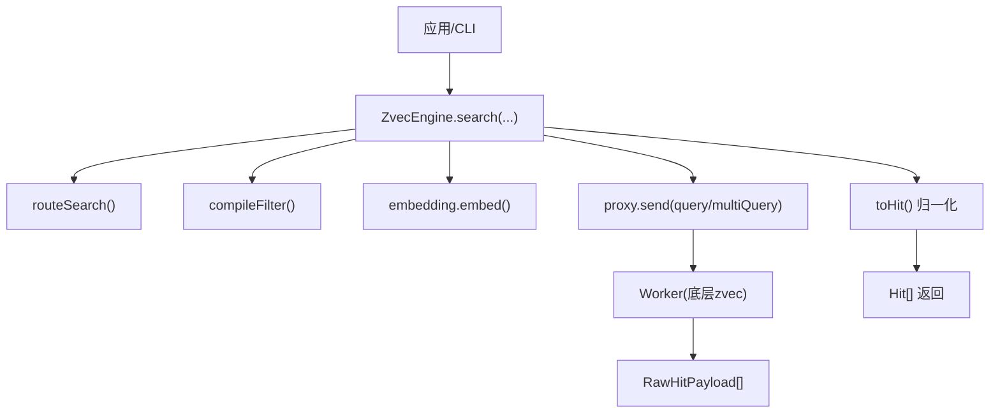
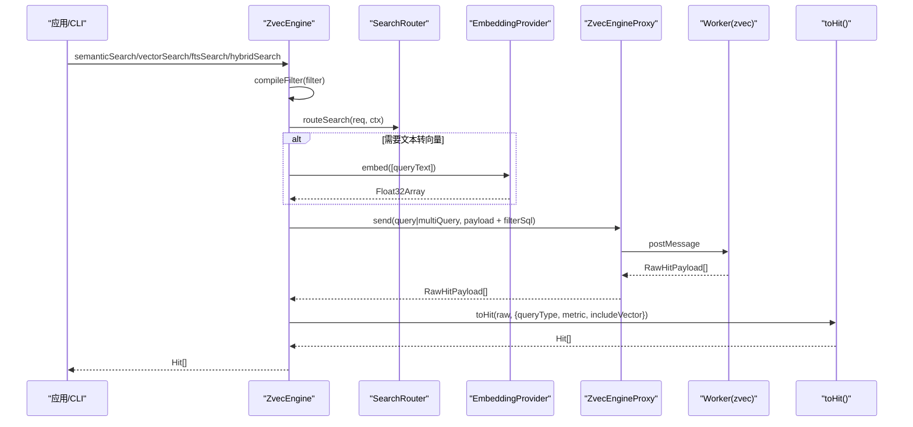
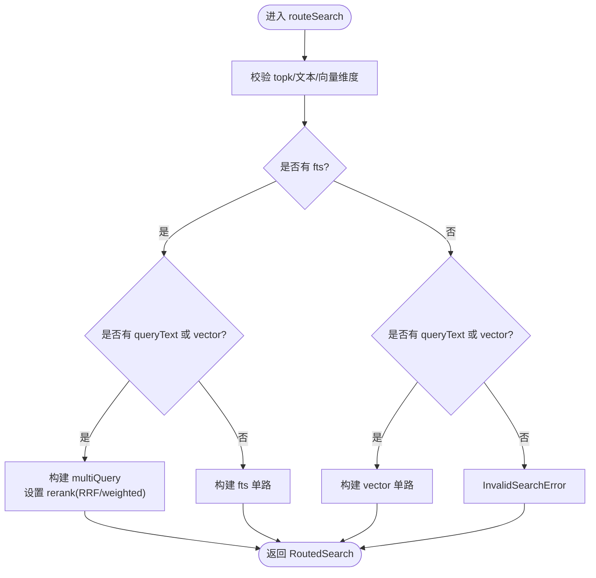
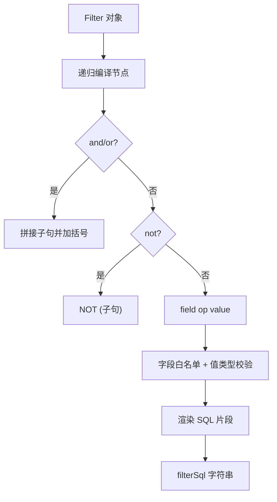
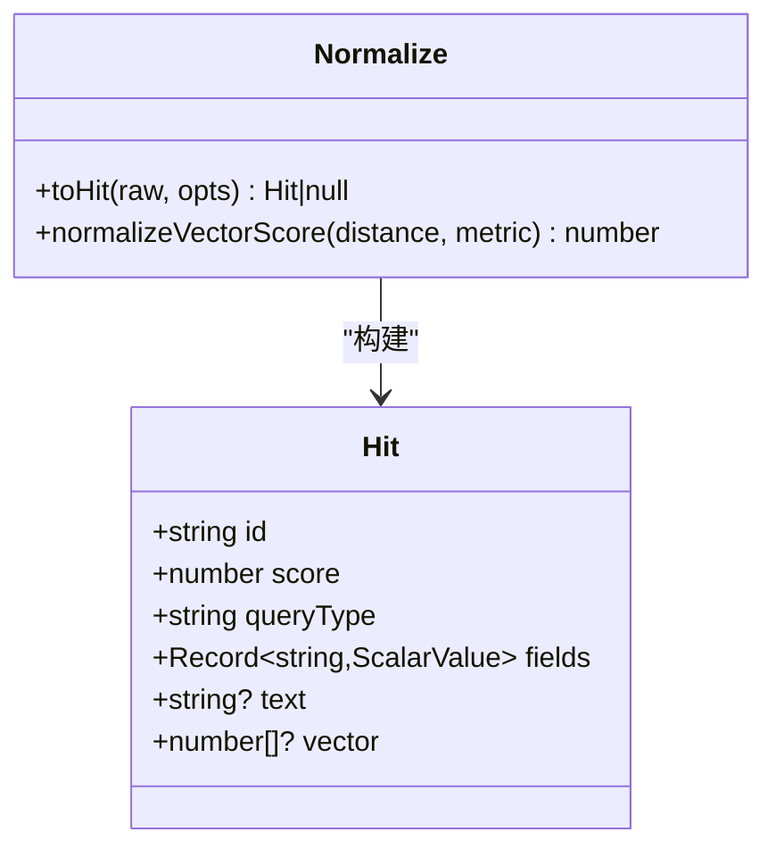
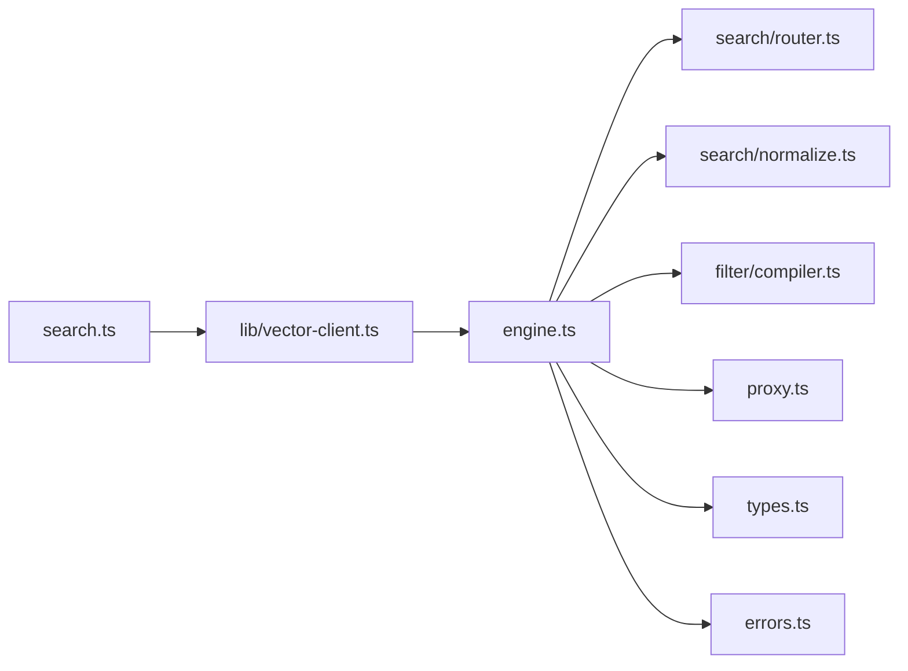

# 搜索路由与优化

<cite>
**本文引用的文件**
- [router.ts](file://src/zvec-engine/search/router.ts)
- [normalize.ts](file://src/zvec-engine/search/normalize.ts)
- [engine.ts](file://src/zvec-engine/engine.ts)
- [types.ts](file://src/zvec-engine/types.ts)
- [worker-protocol.ts](file://src/zvec-engine/worker-protocol.ts)
- [proxy.ts](file://src/zvec-engine/proxy.ts)
- [errors.ts](file://src/zvec-engine/errors.ts)
- [vector-client.ts](file://src/lib/vector-client.ts)
- [search.ts](file://src/search.ts)
</cite>

## 目录
1. [简介](#简介)
2. [项目结构](#项目结构)
3. [核心组件](#核心组件)
4. [架构总览](#架构总览)
5. [详细组件分析](#详细组件分析)
6. [依赖关系分析](#依赖关系分析)
7. [性能考量](#性能考量)
8. [故障排查指南](#故障排查指南)
9. [结论](#结论)
10. [附录](#附录)

## 简介
本文聚焦“搜索路由与优化”，系统性解释 SearchRouter 的工作机制，覆盖语义搜索、向量搜索、全文搜索与混合搜索的路由逻辑；详述查询类型识别与参数校验；说明搜索结果归一化（Hit 构建与字段映射）；阐述查询优化策略（过滤条件编译、索引选择、性能调优）；给出不同场景的配置示例与性能分析；并提供查询调试工具与监控指标的使用建议。

## 项目结构
围绕搜索能力的关键代码分布在 zvec-engine 子模块与上层 vector-client：
- 路由层：search/router.ts 负责将高层检索请求转换为底层 Query/MultiQuery 负载，并决定 queryType（vector/fts/hybrid）。
- 归一化层：search/normalize.ts 负责将 worker 返回的 RawHitPayload 转为统一 Hit，并对向量距离进行 score 归一化。
- 引擎门面：engine.ts 编排 embed、路由、filter 编译、worker 调用与结果归一化。
- 协议与代理：worker-protocol.ts 定义主线程与 worker 的消息协议；proxy.ts 封装 worker_threads 通信、状态机与错误处理。
- 类型与错误：types.ts 定义所有公共类型；errors.ts 定义类型化异常。
- 上层适配：vector-client.ts 为 CLI/MCP 提供 hybridSearch 的统一入口，构造 scope/tag 过滤与阈值过滤。
- CLI 入口：search.ts 提供 ki search 命令，组合 tag 优先级、原文召回与去重等能力。

图表来源
- [engine.ts:454-495](file://src/zvec-engine/engine.ts#L454-L495)
- [router.ts:43-127](file://src/zvec-engine/search/router.ts#L43-L127)
- [normalize.ts:38-63](file://src/zvec-engine/search/normalize.ts#L38-L63)
- [worker-protocol.ts:39-64](file://src/zvec-engine/worker-protocol.ts#L39-L64)

章节来源
- [engine.ts:1-120](file://src/zvec-engine/engine.ts#L1-L120)
- [worker-protocol.ts:1-95](file://src/zvec-engine/worker-protocol.ts#L1-L95)

## 核心组件
- SearchRouter（router.ts）
  - 输入：SemanticSearchReq / VectorSearchReq / FtsSearchReq / HybridSearchReq
  - 输出：RoutedSearch（kind/query 或 multiQuery；payload；queryType；是否需要 embed）
  - 规则：
    - 同时存在 fts 与 queryText/vector → 走 hybrid 两路 RRF/加权融合
    - 缺 fts → 退化为单路向量
    - 缺 queryText/vector → 退化为单路 FTS
    - 三者皆缺 → InvalidSearchError
    - queryText 与 vector 互斥
- 归一化器（normalize.ts）
  - 向量路：distance ∈ [0,2] 经 1/(1+distance) 归一化为 score
  - FTS/Hybrid 路：score 直通
  - distance/score 异常时丢弃该 Hit
- 引擎门面（engine.ts）
  - 编排 filter 编译、路由、embed、worker 调用、结果归一化
  - 写入路径按是否需 embed 切分，失败粒度小批隔离
- 协议与代理（worker-protocol.ts, proxy.ts）
  - 消息协议、Float32Array 零拷贝传输、错误序列化
  - 状态机、drain/close/terminate、crash 处理
- 上层适配（vector-client.ts）
  - 统一 hybridSearch 入口，构造 scope/tag 过滤，支持 threshold 过滤
  - 进程内 engine 单例、空闲释放锁、撞锁重试、超时保护
- CLI（search.ts）
  - 多 tag 优先级合并、原文召回与去重、阈值与 limit 解析

章节来源
- [router.ts:1-191](file://src/zvec-engine/search/router.ts#L1-L191)
- [normalize.ts:1-64](file://src/zvec-engine/search/normalize.ts#L1-L64)
- [engine.ts:296-495](file://src/zvec-engine/engine.ts#L296-L495)
- [worker-protocol.ts:39-119](file://src/zvec-engine/worker-protocol.ts#L39-L119)
- [proxy.ts:44-181](file://src/zvec-engine/proxy.ts#L44-L181)
- [vector-client.ts:477-506](file://src/lib/vector-client.ts#L477-L506)
- [search.ts:70-199](file://src/search.ts#L70-L199)

## 架构总览
下图展示从应用到 worker 的完整检索链路，包括路由、嵌入、过滤、执行与归一化。

图表来源
- [engine.ts:454-495](file://src/zvec-engine/engine.ts#L454-L495)
- [router.ts:43-127](file://src/zvec-engine/search/router.ts#L43-L127)
- [worker-protocol.ts:39-64](file://src/zvec-engine/worker-protocol.ts#L39-L64)
- [proxy.ts:114-126](file://src/zvec-engine/proxy.ts#L114-L126)

## 详细组件分析

### SearchRouter：查询类型识别与路由决策
- 输入校验
  - topk 必须为正整数且不超过上限
  - 文本长度非空且不超过上限
  - 向量维度与集合维度一致
  - queryText 与 vector 互斥
  - fts 查询要求集合配置了 fts 字段
- 路由矩阵
  - 有 fts 且有 queryText/vector → hybrid（multiQuery），携带 rerank 策略（RRF 或 weighted）
  - 仅 vector → vector（单路）
  - 仅 fts → fts（单路）
  - 三者皆缺 → 抛出 InvalidSearchError
- 输出
  - kind: 'query' | 'multiQuery'
  - payload: QueryPayload | MultiQueryPayload
  - queryType: 'vector' | 'fts' | 'hybrid'
  - needsEmbed 与 embedTexts：若含 queryText 则标记需要 embed

图表来源
- [router.ts:43-127](file://src/zvec-engine/search/router.ts#L43-L127)
- [router.ts:148-174](file://src/zvec-engine/search/router.ts#L148-L174)

章节来源
- [router.ts:1-191](file://src/zvec-engine/search/router.ts#L1-L191)

### 过滤器编译与注入
- 白名单校验：仅允许 schema 声明的标量字段与 fts 字段
- 表达式支持：and/or/not 递归编译，限制嵌套深度防 DoS
- 值渲染：字符串转义、数字/布尔原样输出
- 注入时机：在 engine.search 中先编译 filterSql，再注入到 QueryPayload/MultiQueryPayload

图表来源
- [compiler.ts:31-78](file://src/zvec-engine/filter/compiler.ts#L31-L78)
- [compiler.ts:80-101](file://src/zvec-engine/filter/compiler.ts#L80-L101)

章节来源
- [engine.ts:454-478](file://src/zvec-engine/engine.ts#L454-L478)
- [worker-protocol.ts:39-64](file://src/zvec-engine/worker-protocol.ts#L39-L64)

### 嵌入与批量失败隔离
- 写入路径：按 text/vector 拆分，text→vector 缺失时触发 embed
- 批大小：EMBED_BATCH_SIZE=64，与 provider 默认批次对齐，失败粒度精确到批
- 批内去重：相同 text 只 embed 一次，复用向量，减少重复 HTTP 调用
- 失败聚合：embed 失败项记录 errors，成功项继续写入

章节来源
- [engine.ts:330-450](file://src/zvec-engine/engine.ts#L330-L450)

### 结果归一化与 Hit 构建
- 向量路：distance 钳制到 [0,2]，score = 1/(1+distance)
- FTS/Hybrid 路：score 直通
- 异常处理：distance/score 为 NaN/undefined 时丢弃该 Hit
- 可选字段：includeVector=true 时附带 vector

图表来源
- [normalize.ts:16-63](file://src/zvec-engine/search/normalize.ts#L16-L63)
- [types.ts:138-151](file://src/zvec-engine/types.ts#L138-L151)

章节来源
- [normalize.ts:1-64](file://src/zvec-engine/search/normalize.ts#L1-L64)
- [types.ts:99-151](file://src/zvec-engine/types.ts#L99-L151)

### 上层检索适配（vector-client）
- 统一入口：vectorSearch 使用 hybridSearch，queryText 与 fts 同传以启用混合检索
- 过滤：buildScopeTagFilter 构造 scope== 与 tag OR 的组合
- 阈值过滤：对返回结果按 score 过滤
- 进程管理：getEngine 单例、空闲释放锁、撞锁重试、open/create 超时保护

章节来源
- [vector-client.ts:477-506](file://src/lib/vector-client.ts#L477-L506)
- [vector-client.ts:314-362](file://src/lib/vector-client.ts#L314-L362)
- [vector-client.ts:420-467](file://src/lib/vector-client.ts#L420-L467)

### CLI 搜索流程（search.ts）
- 参数解析：limit、threshold、tags、original
- Tag 优先级：ki-search > ki-relation > ki-path，分别查询后合并排序
- 原文召回：根据 relations-cache 定位 group/relation，读取本地 KB 原文，失败降级
- 去重：同一文件多 chunk 命中去重，保留最高分或首次命中的原文

章节来源
- [search.ts:70-199](file://src/search.ts#L70-L199)
- [search.ts:204-248](file://src/search.ts#L204-L248)

## 依赖关系分析
- 耦合与内聚
  - engine.ts 高内聚：编排 filter、router、embed、proxy、normalize
  - router.ts 低耦合：仅依赖 types 与 errors，职责单一
  - normalize.ts 独立：仅依赖 types 与 worker-protocol
- 直接/间接依赖
  - engine.ts 依赖 router.ts、normalize.ts、filter/compiler.ts、proxy.ts、types.ts、errors.ts
  - vector-client.ts 依赖 engine.ts（dist 产物）、config、scope、interrupt
  - search.ts 依赖 vector-client.ts、relation-map、store、cli-args
- 外部集成点
  - EmbeddingProvider（SiliconFlowProvider）用于文本向量化
  - Worker(zvec) 通过 proxy 通信，使用 Float32Array 零拷贝传输
- 潜在循环依赖
  - 无循环：engine→router/normalize/proxy，无反向引用

图表来源
- [engine.ts:27-32](file://src/zvec-engine/engine.ts#L27-L32)
- [vector-client.ts:21-33](file://src/lib/vector-client.ts#L21-L33)
- [search.ts:11-18](file://src/search.ts#L11-L18)

章节来源
- [engine.ts:1-120](file://src/zvec-engine/engine.ts#L1-L120)
- [vector-client.ts:1-75](file://src/lib/vector-client.ts#L1-L75)
- [search.ts:1-48](file://src/search.ts#L1-L48)

## 性能考量
- 路由与嵌入
  - 仅在需要时触发 embed，避免不必要的网络开销
  - 批大小 64 与 provider 默认对齐，失败粒度最小化
  - 批内文本去重，减少重复 embedding
- 过滤与索引
  - filter 编译为类 SQL 字符串，由底层 zvec 利用标量字段索引加速
  - 推荐对高频过滤字段（如 scope、tag）建立索引（schema 中标记 indexed）
- 向量度量与归一化
  - COSINE 度量下距离归一化稳定，score 范围可控
- 并发与锁
  - 进程内 engine 单例，串行化 open/create/probe，避免原生竞态阻塞
  - 空闲释放锁，提升共享库利用率
- 阈值与 TopK
  - 合理设置 topk 与 threshold，控制响应体积与延迟
- 监控与可观测性
  - 通过 info/listIds/optimize 等接口观察集合状态与索引健康
  - 结合日志与错误码（如 LOCKED/CORRUPTED）快速定位问题

[本节为通用性能指导，不直接分析具体文件]

## 故障排查指南
- 常见错误与定位
  - InvalidSearchError：topk/文本/向量维度/互斥校验失败
  - InvalidFilterError：字段未声明、值非法、嵌套过深
  - CollectionLockedException：向量库被占用，参考 lockedHint 提示处置
  - CollectionCorruptedException：向量库损坏，建议重建
  - WorkerCrashedError/WorkerUnavailableError：worker 崩溃或未打开，检查生命周期与重试
- 排查步骤
  - 确认集合配置（dimension、metric、scalarFields、fts）与查询一致
  - 检查 filter 白名单与值类型
  - 查看 ensureVectorAvailable 返回的 code（LOCKED/CORRUPTED/PROBE_ERROR）
  - 使用 probe/open/close/destroy 生命周期方法验证状态
  - 对大库执行 optimize 维护索引健康

章节来源
- [errors.ts:17-99](file://src/zvec-engine/errors.ts#L17-L99)
- [vector-client.ts:74-104](file://src/lib/vector-client.ts#L74-L104)
- [vector-client.ts:420-467](file://src/lib/vector-client.ts#L420-L467)
- [engine.ts:151-199](file://src/zvec-engine/engine.ts#L151-L199)

## 结论
SearchRouter 通过清晰的退化矩阵与严格的参数校验，将高层检索请求精准路由至向量、全文或混合模式；engine 编排 embed、filter 编译、worker 调用与结果归一化，形成端到端的高可用检索链路；vector-client 提供进程级健壮性与可观测性；CLI 提供便捷的多标签优先与原文召回能力。配合合理的索引与阈值配置，可在多种场景下获得稳定高效的检索体验。

[本节为总结，不直接分析具体文件]

## 附录

### 不同搜索场景的配置示例
- 纯语义搜索（semanticSearch）
  - 输入：queryText + optional filter/topk/outputFields/includeVector
  - 路由：vector
  - 适用：自然语言问答、概念匹配
- 纯向量搜索（vectorSearch）
  - 输入：预计算 vector + optional filter/topk/outputFields/includeVector
  - 路由：vector
  - 适用：已知向量、相似度检索
- 全文搜索（ftsSearch）
  - 输入：match + optional filter/topk/outputFields/includeVector
  - 路由：fts
  - 适用：关键词匹配、精确词检索
- 混合搜索（hybridSearch）
  - 输入：queryText 或 vector + fts + optional rerank(topk/filter/outputFields/includeVector)
  - 路由：hybrid（multiQuery）
  - 适用：兼顾语义与关键词召回，提高查全率

章节来源
- [types.ts:99-151](file://src/zvec-engine/types.ts#L99-L151)
- [router.ts:43-127](file://src/zvec-engine/search/router.ts#L43-L127)
- [vector-client.ts:477-506](file://src/lib/vector-client.ts#L477-L506)

### 查询调试与监控指标
- 调试
  - 打印 routed.queryType 与 payload 结构，确认路由正确
  - 检查 filterSql 生成是否符合预期
  - 使用 listIds/fetch 验证数据与字段映射
- 监控
  - info：维度、度量、文档数、标量字段、fts 配置
  - listIds：统计与抽样，评估数据规模
  - optimize：定期维护索引，提升查询性能
  - 错误码：LOCKED/CORRUPTED/PROBE_ERROR 等，结合日志定位

章节来源
- [engine.ts:203-226](file://src/zvec-engine/engine.ts#L203-L226)
- [engine.ts:316-326](file://src/zvec-engine/engine.ts#L316-L326)
- [vector-client.ts:420-467](file://src/lib/vector-client.ts#L420-L467)