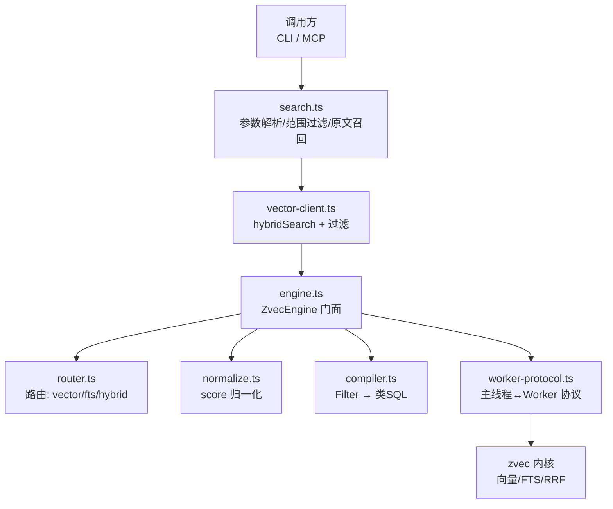
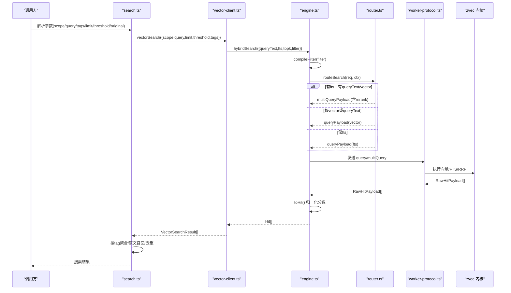
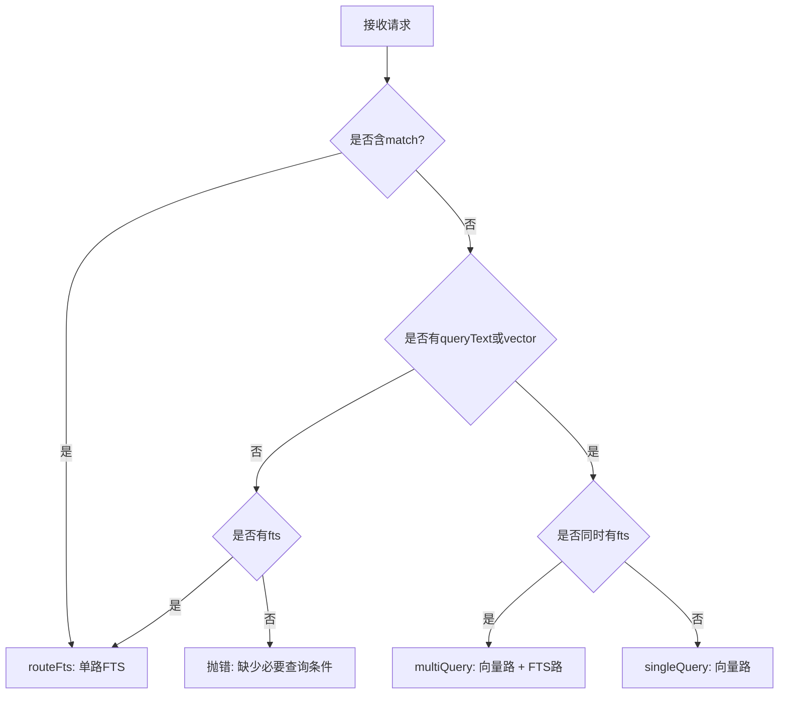
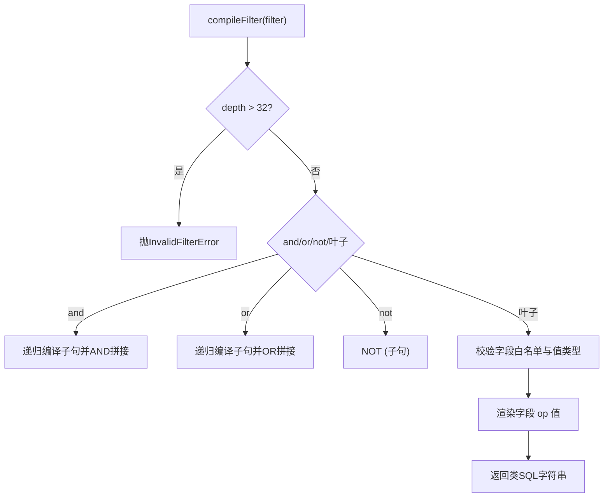
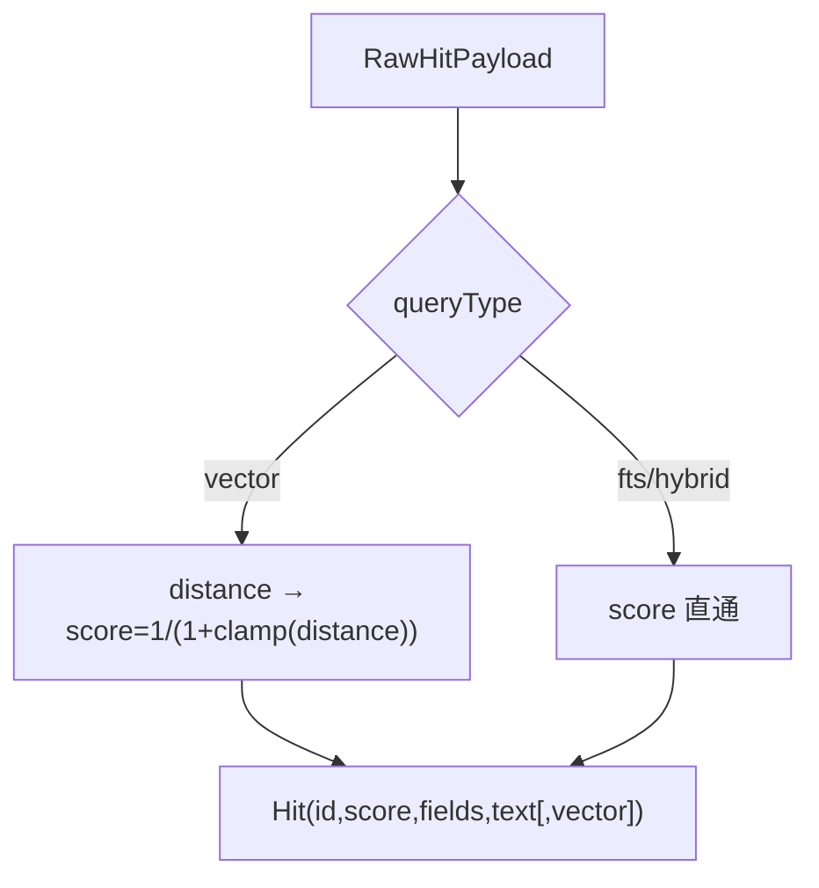
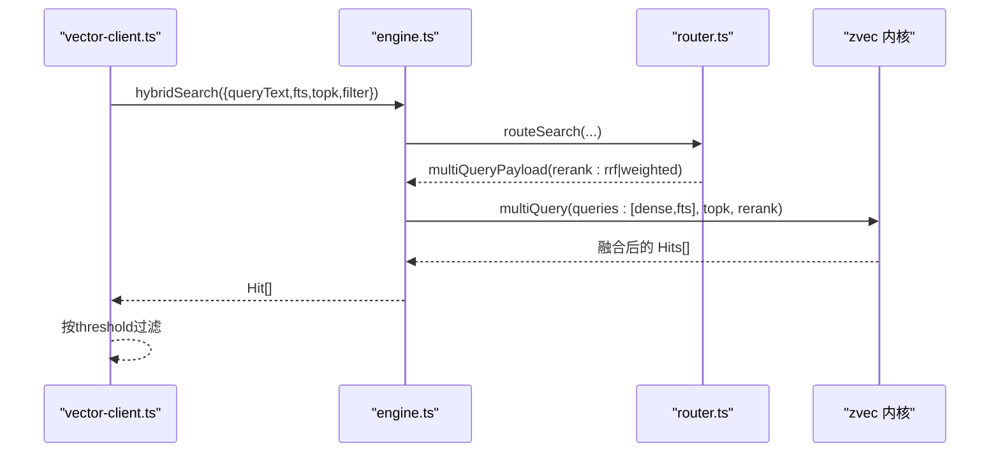
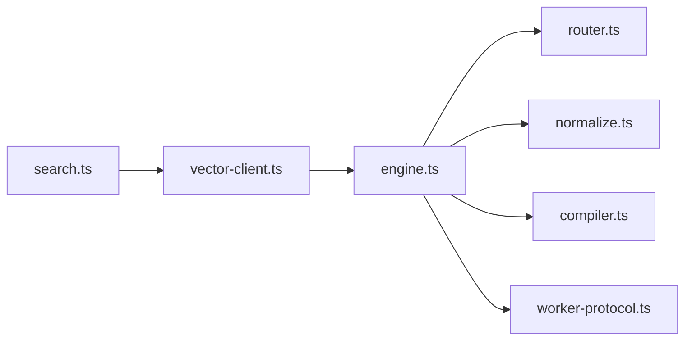

# 搜索路由与执行

<cite>
**本文引用的文件**
- [src/search.ts](file://src/search.ts)
- [src/zvec-engine/engine.ts](file://src/zvec-engine/engine.ts)
- [src/zvec-engine/search/router.ts](file://src/zvec-engine/search/router.ts)
- [src/zvec-engine/search/normalize.ts](file://src/zvec-engine/search/normalize.ts)
- [src/zvec-engine/filter/compiler.ts](file://src/zvec-engine/filter/compiler.ts)
- [src/zvec-engine/types.ts](file://src/zvec-engine/types.ts)
- [src/zvec-engine/worker-protocol.ts](file://src/zvec-engine/worker-protocol.ts)
- [src/lib/vector-client.ts](file://src/lib/vector-client.ts)
- [docs/architecture.md](file://docs/architecture.md)
</cite>

## 目录
1. [简介](#简介)
2. [项目结构](#项目结构)
3. [核心组件](#核心组件)
4. [架构总览](#架构总览)
5. [详细组件分析](#详细组件分析)
6. [依赖关系分析](#依赖关系分析)
7. [性能考量](#性能考量)
8. [故障排查指南](#故障排查指南)
9. [结论](#结论)
10. [附录](#附录)

## 简介
本文面向“搜索请求如何被路由、识别查询类型、编译过滤条件、生成并执行 SQL，以及多路结果合并与排序”的完整链路。覆盖语义搜索、向量搜索、全文搜索、混合搜索四种查询类型；解释 RRF 融合策略与加权融合；给出查询性能分析与执行计划优化建议，并提供调试工具使用指引。

## 项目结构
本仓库的搜索能力由三层构成：
- 上层 CLI/MCP 入口（search.ts）：负责参数解析、范围与标签过滤、原文召回与去重。
- 向量引擎门面（engine.ts）：编排 Embedding、路由、归一化、Worker 通信。
- 检索内核（router.ts / normalize.ts / compiler.ts）：路由到单路或多路查询、将结构化 Filter 编译为类 SQL、对分数进行归一化。

图表来源
- [src/search.ts:70-199](file://src/search.ts#L70-L199)
- [src/lib/vector-client.ts:498-533](file://src/lib/vector-client.ts#L498-L533)
- [src/zvec-engine/engine.ts:454-495](file://src/zvec-engine/engine.ts#L454-L495)
- [src/zvec-engine/search/router.ts:43-127](file://src/zvec-engine/search/router.ts#L43-L127)
- [src/zvec-engine/search/normalize.ts:16-63](file://src/zvec-engine/search/normalize.ts#L16-L63)
- [src/zvec-engine/filter/compiler.ts:31-78](file://src/zvec-engine/filter/compiler.ts#L31-L78)
- [src/zvec-engine/worker-protocol.ts:39-64](file://src/zvec-engine/worker-protocol.ts#L39-L64)

章节来源
- [docs/architecture.md:1-169](file://docs/architecture.md#L1-L169)

## 核心组件
- 搜索入口 search.ts：解析 scope/tags/limit/threshold/original，按 tag 分查或单次查询，反查 relations-cache 定位 group/relation，按需拉取本地 KB 原文并进行多 chunk 去重。
- 向量客户端 vector-client.ts：封装 ZvecEngine，统一构建 scope+tag 过滤，走 hybridSearch 实现“语义 + FTS + RRF”的混合检索。
- 引擎门面 engine.ts：编排 embed→路由→归一化→Worker 通信；提供 listIds/fetch/delete/optimize 等能力。
- 路由 router.ts：根据请求字段识别 queryType（vector/fts/hybrid），构造 QueryPayload 或 MultiQueryPayload，必要时注入 filterSql。
- 归一化 normalize.ts：将 distance 转换为 score（COSINE），保留 fts/hybrid 原始分数。
- 过滤器编译器 compiler.ts：将结构化 Filter 编译为带括号优先级的类 SQL 字符串，限制嵌套深度，校验字段白名单与值类型。
- Worker 协议 worker-protocol.ts：定义主线程与 Worker 的消息结构，支持 Float32Array 零拷贝传输与错误序列化。

章节来源
- [src/search.ts:70-199](file://src/search.ts#L70-L199)
- [src/lib/vector-client.ts:498-533](file://src/lib/vector-client.ts#L498-L533)
- [src/zvec-engine/engine.ts:454-495](file://src/zvec-engine/engine.ts#L454-L495)
- [src/zvec-engine/search/router.ts:43-127](file://src/zvec-engine/search/router.ts#L43-L127)
- [src/zvec-engine/search/normalize.ts:16-63](file://src/zvec-engine/search/normalize.ts#L16-L63)
- [src/zvec-engine/filter/compiler.ts:31-78](file://src/zvec-engine/filter/compiler.ts#L31-L78)
- [src/zvec-engine/worker-protocol.ts:39-64](file://src/zvec-engine/worker-protocol.ts#L39-L64)

## 架构总览
搜索请求从 CLI/MCP 进入，经 search.ts 解析后通过 vector-client.ts 调用 engine.ts 的 hybridSearch。engine 内部先编译 filter，再交由 router.ts 决定单路或双路查询，必要时在主线程完成文本→向量的嵌入，随后通过 worker-protocol.ts 下发至 zvec 内核执行。返回的 RawHitPayload 经 normalize.ts 转为 Hit[]，最终在 search.ts 中做 tag 聚合、原文召回与去重。

图表来源
- [src/search.ts:70-199](file://src/search.ts#L70-L199)
- [src/lib/vector-client.ts:498-533](file://src/lib/vector-client.ts#L498-L533)
- [src/zvec-engine/engine.ts:454-495](file://src/zvec-engine/engine.ts#L454-L495)
- [src/zvec-engine/search/router.ts:43-127](file://src/zvec-engine/search/router.ts#L43-L127)
- [src/zvec-engine/search/normalize.ts:16-63](file://src/zvec-engine/search/normalize.ts#L16-L63)
- [src/zvec-engine/worker-protocol.ts:39-64](file://src/zvec-engine/worker-protocol.ts#L39-L64)

## 详细组件分析

### 查询类型识别与路由机制
- 语义搜索（SemanticSearchReq）：传入 queryText，路由为 vector 单路，主线程先 embed 成向量再查询 denseField。
- 向量搜索（VectorSearchReq）：直接传入 vector，路由为 vector 单路。
- 全文搜索（FtsSearchReq）：传入 match，路由为 fts 单路，查询 ftsField。
- 混合搜索（HybridSearchReq）：同时包含 queryText/vector 与 fts 时，路由为 multiQuery，双路并行召回并按 rerank 策略融合。

路由决策要点：
- queryText 与 vector 互斥；若同传抛 InvalidSearchError。
- 当存在 fts 且同时存在 queryText/vector 时，走 hybrid 两路；否则退化为单路 vector 或 fts。
- topk 默认 10，最大 1000；文本长度上限 10000。

图表来源
- [src/zvec-engine/search/router.ts:43-127](file://src/zvec-engine/search/router.ts#L43-L127)

章节来源
- [src/zvec-engine/search/router.ts:43-127](file://src/zvec-engine/search/router.ts#L43-L127)
- [src/zvec-engine/types.ts:99-136](file://src/zvec-engine/types.ts#L99-L136)

### 过滤条件编译与类 SQL 生成
- 支持 and/or/not 组合，叶子节点支持 ==、!=、>、<、>=、<=。
- 字段白名单：仅允许 schema 声明的 scalarFields 与 fts.field。
- 值校验：禁止 null/undefined/NaN/Infinity，仅支持 string/number/boolean。
- 安全：嵌套深度上限 32，防止 DoS；字符串值转义处理。
- 输出：生成带括号的类 SQL 表达式，作为 filterSql 注入到 query/multiQuery。

图表来源
- [src/zvec-engine/filter/compiler.ts:31-78](file://src/zvec-engine/filter/compiler.ts#L31-L78)
- [src/zvec-engine/filter/compiler.ts:80-101](file://src/zvec-engine/filter/compiler.ts#L80-L101)

章节来源
- [src/zvec-engine/filter/compiler.ts:31-101](file://src/zvec-engine/filter/compiler.ts#L31-L101)

### 查询规范化与分数处理
- 向量路（COSINE）：distance ∈ [0,2]，score = 1/(1+distance)，异常距离 clamp 到 [0,2]；NaN/undefined 丢弃该命中。
- FTS 路：BM25 原值直通（越大越相关）。
- Hybrid 路：RRF 或加权融合后的分数直通。
- includeVector：可选返回原始向量副本。

图表来源
- [src/zvec-engine/search/normalize.ts:16-63](file://src/zvec-engine/search/normalize.ts#L16-L63)

章节来源
- [src/zvec-engine/search/normalize.ts:16-63](file://src/zvec-engine/search/normalize.ts#L16-L63)

### 多路查询合并与排序（RRF 融合策略）
- 混合搜索时，router 会构造 MultiQueryPayload，包含 dense 路与 fts 路，并携带 rerank 配置：
  - RRF：rankConstant 默认 60，基于秩次融合，不依赖不同度量尺度。
  - Weighted：需显式提供 weights，按字段权重线性组合。
- 向量客户端 vector-client.ts 默认以 hybridSearch(queryText, fts=queryText) 触发双路召回，并在上层按 threshold 过滤。
- search.ts 对多 tag 场景进行组内排序与跨 tag 优先级合并，并对同一文件的多个 chunk 命中进行去重。

图表来源
- [src/zvec-engine/search/router.ts:74-100](file://src/zvec-engine/search/router.ts#L74-L100)
- [src/lib/vector-client.ts:498-533](file://src/lib/vector-client.ts#L498-L533)

章节来源
- [src/zvec-engine/search/router.ts:74-100](file://src/zvec-engine/search/router.ts#L74-L100)
- [src/lib/vector-client.ts:498-533](file://src/lib/vector-client.ts#L498-L533)
- [src/search.ts:94-121](file://src/search.ts#L94-L121)

### 原文召回与多 chunk 去重
- 通过 relations-cache 反查 memoryId → group/relation，按需从本地 KB 读取文件级原文。
- 同一文件多 chunk 命中时，仅首次返回 original，后续标记 deduplicated 以避免重复。
- 原文不可用时降级为返回向量文档 content，并附带提示。

章节来源
- [src/search.ts:123-194](file://src/search.ts#L123-L194)

## 依赖关系分析
- search.ts 依赖 vector-client.ts 提供的 vectorSearch/vectorListTags/ensureVectorAvailable/closeEngine。
- vector-client.ts 依赖 dist 中的 ZvecEngine（engine.ts 暴露的门面），并通过 withEngine 包装在途保护与空闲释放锁。
- engine.ts 依赖 router.ts、normalize.ts、compiler.ts、worker-protocol.ts 完成检索全链路。
- 所有检索均受 filter 编译约束，确保字段白名单与安全边界。

图表来源
- [src/search.ts:70-199](file://src/search.ts#L70-L199)
- [src/lib/vector-client.ts:498-533](file://src/lib/vector-client.ts#L498-L533)
- [src/zvec-engine/engine.ts:454-495](file://src/zvec-engine/engine.ts#L454-L495)

章节来源
- [src/zvec-engine/engine.ts:454-495](file://src/zvec-engine/engine.ts#L454-L495)

## 性能考量
- 嵌入批大小：engine.ts 使用 EMBED_BATCH_SIZE=64 切分文本→向量，失败粒度小，避免整批失败。
- 文本去重：批内相同 text 只 embed 一次，减少 HTTP 调用（sync-relation 多 tag 场景尤为明显）。
- 路由与融合：hybrid 双路召回 + RRF 融合，兼顾语义与关键词匹配，降低单一指标偏差。
- 过滤编译：提前编译 filterSql，减少 Worker 侧解析开销；嵌套深度限制防 DoS。
- 并发与锁：vector-client.ts 提供撞锁重试与空闲释放锁，避免常驻服务与 CLI 短命令争用。
- 阈值过滤：vectorSearch 支持 threshold 过滤低分结果，减少下游处理成本。

[本节为通用指导，无需列出具体文件来源]

## 故障排查指南
- 查询参数校验：
  - topk 必须为正整数且不超过 1000；文本长度超过 10000 报错。
  - queryText 与 vector 互斥；缺失必要查询条件抛 InvalidSearchError。
- 维度不匹配：
  - 文档向量维度与集合 dimension 不一致抛 DimensionMismatchError。
- 更新一致性：
  - update 模式要求 dense vector 必填；若配置了 FTS，仅传 vector 不传 text 会抛 InconsistentUpdateError。
- 过滤器非法：
  - 字段不在白名单、值为 null/undefined/NaN/Infinity、类型不支持、嵌套过深都会抛 InvalidFilterError。
- 向量服务不可用：
  - ensureVectorAvailable 检测 locked/corrupted/probe_error；CLI 可据此给出恢复引导。
- 调试建议：
  - 使用 vectorListTags 查看当前 scope 下的 tag 分布，确认过滤条件是否正确。
  - 使用 listIds + fetch 验证 filter 生效范围与数据可见性。
  - 调整 topk、threshold 观察召回变化；对比 hybrid vs 单路 vector/fts 的结果差异。

章节来源
- [src/zvec-engine/errors.ts:17-99](file://src/zvec-engine/errors.ts#L17-L99)
- [src/zvec-engine/engine.ts:243-274](file://src/zvec-engine/engine.ts#L243-L274)
- [src/zvec-engine/filter/compiler.ts:31-101](file://src/zvec-engine/filter/compiler.ts#L31-L101)
- [src/lib/vector-client.ts:440-494](file://src/lib/vector-client.ts#L440-L494)

## 结论
本系统通过清晰的路由层将语义、向量、全文与混合搜索统一到一致的执行框架中；借助结构化 Filter 编译与类 SQL 注入，保证查询安全与高效；RRF 融合策略在多源召回下提供稳定排序；配合原文召回与去重，提升结果可用性。结合性能优化与故障排查手段，可在大规模知识库场景下获得高可用、高性能的检索体验。

[本节为总结，无需列出具体文件来源]

## 附录

### API 与数据结构速览
- 检索请求类型：
  - SemanticSearchReq：queryText + SearchOptions
  - VectorSearchReq：vector + SearchOptions
  - FtsSearchReq：match + SearchOptions
  - HybridSearchReq：queryText/vector（互斥）、fts、rerank（rrf/weighted）+ SearchOptions
- 返回 Hit：id、score、queryType、fields、text、可选 vector
- 写入结果 WriteResult：ok、failed、errors

章节来源
- [src/zvec-engine/types.ts:99-166](file://src/zvec-engine/types.ts#L99-L166)

### 执行流程参考
- 主线程检索编排：engine.ts 的 search 方法串联 filter 编译、路由、embed、归一化与 Worker 通信。
- 混合搜索：router.ts 构造 multiQueryPayload，携带 rerank 配置；zvec 内核执行 RRF/加权融合。

章节来源
- [src/zvec-engine/engine.ts:454-495](file://src/zvec-engine/engine.ts#L454-L495)
- [src/zvec-engine/search/router.ts:74-100](file://src/zvec-engine/search/router.ts#L74-L100)