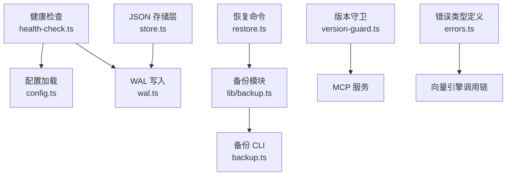
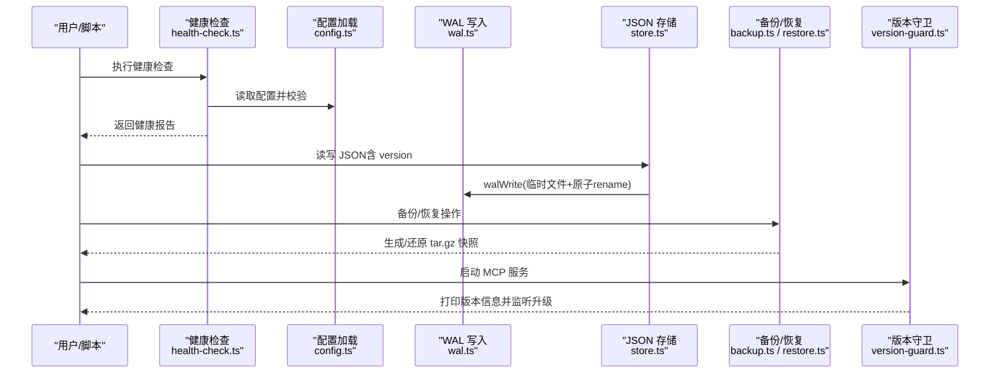
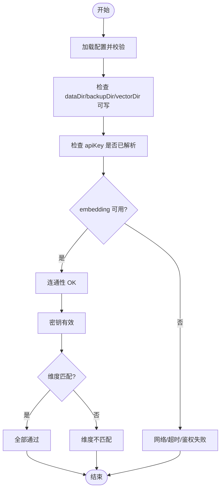
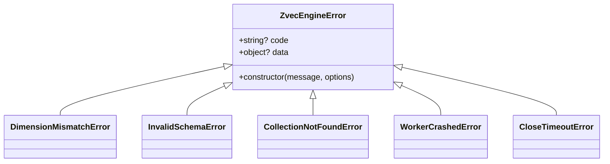
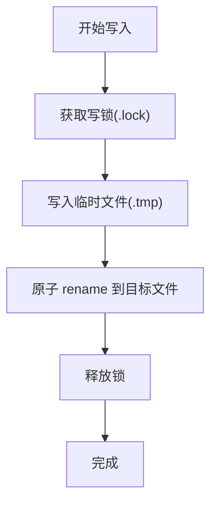
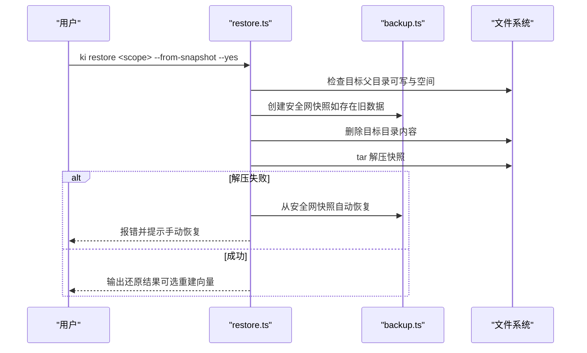
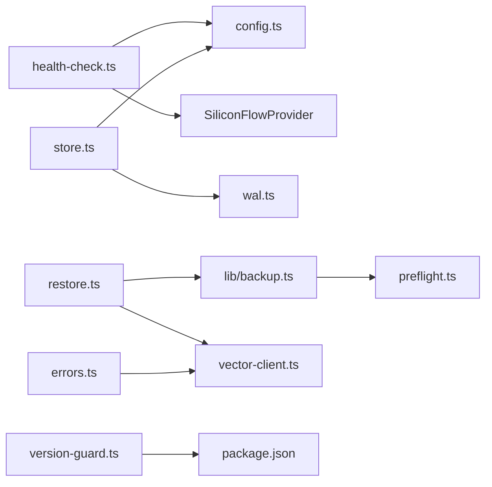

# 监控与维护

<cite>
**本文引用的文件**
- [health-check.ts](file://src/lib/health-check.ts)
- [wal.ts](file://src/lib/wal.ts)
- [store.ts](file://src/lib/store.ts)
- [config.ts](file://src/lib/config.ts)
- [version-guard.ts](file://src/lib/version-guard.ts)
- [backup.ts](file://src/lib/backup.ts)
- [backup.ts（CLI）](file://src/backup.ts)
- [restore.ts](file://src/restore.ts)
- [errors.ts](file://src/zvec-engine/errors.ts)
- [error-handling.md](file://docs/error-handling.md)
- [backup-restore.md](file://docs/backup-restore.md)
- [configuration.md](file://docs/configuration.md)
</cite>

## 目录
1. [简介](#简介)
2. [项目结构](#项目结构)
3. [核心组件](#核心组件)
4. [架构总览](#架构总览)
5. [详细组件分析](#详细组件分析)
6. [依赖关系分析](#依赖关系分析)
7. [性能与资源监控](#性能与资源监控)
8. [故障排查指南](#故障排查指南)
9. [结论](#结论)
10. [附录：日常维护清单](#附录日常维护清单)

## 简介
本文件面向向量引擎的运维与监控，覆盖健康检查、错误分类与处理、版本兼容性检查；阐述 WAL（预写日志）机制、数据持久化与故障恢复策略；给出性能监控指标、资源使用建议、慢查询分析方法；并提供日常维护、备份恢复、数据迁移与故障排查的操作指南。内容基于仓库中现有实现进行归纳与可视化说明。

## 项目结构
围绕“监控与维护”的关键模块分布如下：
- 健康检查：src/lib/health-check.ts
- WAL 与原子写入：src/lib/wal.ts
- JSON 存储层与版本兼容：src/lib/store.ts
- 配置加载与默认路径：src/lib/config.ts
- MCP 长驻进程版本自检：src/lib/version-guard.ts
- 备份与恢复：src/lib/backup.ts、src/backup.ts、src/restore.ts
- 向量引擎错误类型：src/zvec-engine/errors.ts
- 文档：docs/error-handling.md、docs/backup-restore.md、docs/configuration.md

图表来源
- [health-check.ts:150-239](file://src/lib/health-check.ts#L150-L239)
- [wal.ts:92-112](file://src/lib/wal.ts#L92-L112)
- [store.ts:23-62](file://src/lib/store.ts#L23-L62)
- [config.ts:156-183](file://src/lib/config.ts#L156-L183)
- [backup.ts:87-117](file://src/lib/backup.ts#L87-L117)
- [restore.ts:124-284](file://src/restore.ts#L124-L284)
- [version-guard.ts:31-65](file://src/lib/version-guard.ts#L31-L65)
- [errors.ts:17-99](file://src/zvec-engine/errors.ts#L17-L99)

章节来源
- [health-check.ts:1-261](file://src/lib/health-check.ts#L1-L261)
- [wal.ts:1-143](file://src/lib/wal.ts#L1-L143)
- [store.ts:1-267](file://src/lib/store.ts#L1-L267)
- [config.ts:1-535](file://src/lib/config.ts#L1-L535)
- [version-guard.ts:1-66](file://src/lib/version-guard.ts#L1-L66)
- [backup.ts:1-178](file://src/lib/backup.ts#L1-L178)
- [backup.ts（CLI）:1-108](file://src/backup.ts#L1-L108)
- [restore.ts:1-526](file://src/restore.ts#L1-L526)
- [errors.ts:1-99](file://src/zvec-engine/errors.ts#L1-L99)

## 核心组件
- 健康检查：对配置文件、目录权限、embedding 连通性/密钥/维度、zvec collection、scopes.default 等进行只读诊断，输出结构化报告。
- WAL 写入：跨进程写锁 + 临时文件 + 原子 rename，保证并发安全与中断不损坏原文件；提供残留清理工具。
- JSON 存储层：readJson 带 version 兼容检查；writeJson 自动注入 version 与 updatedAt，并通过 WAL 写入。
- 配置加载：YAML/JSON 解析、字段级校验、默认路径解析、scopeMode 护栏、embedding 配置合并。
- 版本守卫：启动 banner 显示版本/PID/时间，监听 package.json 变化提示升级后需重启 MCP。
- 备份与恢复：tar.gz 快照备份；恢复前创建安全网快照；支持从快照还原与向量重建（全量/局部）。
- 错误类型：统一继承 ZvecEngineError，包含 code/data，便于跨线程序列化与分类处理。

章节来源
- [health-check.ts:22-35](file://src/lib/health-check.ts#L22-L35)
- [wal.ts:1-143](file://src/lib/wal.ts#L1-L143)
- [store.ts:23-62](file://src/lib/store.ts#L23-L62)
- [config.ts:156-183](file://src/lib/config.ts#L156-L183)
- [version-guard.ts:17-65](file://src/lib/version-guard.ts#L17-L65)
- [backup.ts:87-178](file://src/lib/backup.ts#L87-L178)
- [restore.ts:124-284](file://src/restore.ts#L124-L284)
- [errors.ts:17-99](file://src/zvec-engine/errors.ts#L17-L99)

## 架构总览
下图展示健康检查、WAL、存储层、备份恢复与版本守卫之间的交互关系。

图表来源
- [health-check.ts:150-239](file://src/lib/health-check.ts#L150-L239)
- [store.ts:23-62](file://src/lib/store.ts#L23-L62)
- [wal.ts:92-112](file://src/lib/wal.ts#L92-L112)
- [backup.ts:87-117](file://src/lib/backup.ts#L87-L117)
- [restore.ts:124-284](file://src/restore.ts#L124-L284)
- [version-guard.ts:31-65](file://src/lib/version-guard.ts#L31-L65)

## 详细组件分析

### 健康检查机制
- 检查项包括：配置文件存在且可解析、字段告警聚合、dataDir/backupDir/vectorDir 存在且可写、apiKey 是否已解析、embedding 三合一（URL 连通性、密钥有效性、维度匹配）、zvec collection 是否存在、scopes.default 是否配置。
- embedding 检查通过一次最短请求验证连通性、鉴权与维度一致性，超时与重试有界，避免常驻进程被瞬时网络抖动误判。
- 输出结构化报告与渲染文本，供 doctor 或 MCP 启动预检使用。

图表来源
- [health-check.ts:54-144](file://src/lib/health-check.ts#L54-L144)
- [health-check.ts:150-239](file://src/lib/health-check.ts#L150-L239)

章节来源
- [health-check.ts:1-261](file://src/lib/health-check.ts#L1-L261)

### 错误分类与处理
- 向量引擎错误统一继承 ZvecEngineError，附带 code 与 data，支持跨线程反序列化重建，便于上层按类别捕获与降级。
- 常见错误类别：Schema/配置类、集合生命周期类、Embedding 类、Worker 通信与生命周期类。
- 应用层错误处理文档提供了参数校验、数据损坏、增量导入等场景的恢复指引。

图表来源
- [errors.ts:17-99](file://src/zvec-engine/errors.ts#L17-L99)

章节来源
- [errors.ts:1-99](file://src/zvec-engine/errors.ts#L1-L99)
- [error-handling.md:1-167](file://docs/error-handling.md#L1-L167)

### 版本兼容性检查
- JSON 存储层在读取时检查 version 字段，若高于当前支持版本则发出警告，提示潜在兼容性问题。
- 配置加载阶段进行字段级校验，非法字段直接 fail-loud，避免静默落默认值导致隐错。
- MCP 版本守卫启动时打印版本/PID/时间，并在检测到 package.json 版本变化时提示重启以加载新代码。

章节来源
- [store.ts:23-49](file://src/lib/store.ts#L23-L49)
- [config.ts:252-284](file://src/lib/config.ts#L252-L284)
- [version-guard.ts:17-65](file://src/lib/version-guard.ts#L17-L65)

### WAL（预写日志）机制
- 写入流程：获取跨进程写锁 → 写 .tmp 临时文件 → 原子 rename → 释放锁。
- 并发保护：同一目标文件仅允许一个进程写入，避免多进程并发写 JSON 造成静默覆盖。
- 锁机制：基于 O_CREAT|O_EXCL 创建 .lock 文件，支持陈旧锁抢占与超时兜底，避免死锁。
- 清理：提供清理 .tmp 与陈旧 .lock 的工具函数，保障中断后的目录整洁。

图表来源
- [wal.ts:37-71](file://src/lib/wal.ts#L37-L71)
- [wal.ts:92-112](file://src/lib/wal.ts#L92-L112)
- [wal.ts:121-142](file://src/lib/wal.ts#L121-L142)

章节来源
- [wal.ts:1-143](file://src/lib/wal.ts#L1-L143)

### 数据持久化与故障恢复
- 持久化：所有 JSON 写入均通过 writeJson → walWrite，确保原子性与版本/时间戳注入。
- 恢复策略：
  - 备份：ki backup 将 scope 目录打包为 tar.gz 快照，支持列出已有备份。
  - 恢复：ki restore 从快照还原，支持指定 timestamp；还原前创建安全网快照；解压失败自动尝试回滚至安全网快照。
  - 向量重建：还原后可选择全量或局部重建向量（--rebuild-vector），支持 --group 过滤与 --tags 打标。

图表来源
- [restore.ts:124-284](file://src/restore.ts#L124-L284)
- [backup.ts:87-117](file://src/lib/backup.ts#L87-L117)

章节来源
- [restore.ts:1-526](file://src/restore.ts#L1-L526)
- [backup.ts:1-178](file://src/lib/backup.ts#L1-L178)
- [backup-restore.md:1-254](file://docs/backup-restore.md#L1-L254)

## 依赖关系分析
- 健康检查依赖配置加载与 embedding 提供商；同时检查目录与 zvec collection。
- JSON 存储层依赖 WAL 与配置；负责 version 兼容与模板初始化。
- 备份/恢复依赖 tar 命令、预检工具（可写性、磁盘空间估算）与配置。
- 版本守卫独立运行，监听 package.json 变更。
- 错误类型由向量引擎层定义，被上层调用方用于分类处理。

图表来源
- [health-check.ts:150-239](file://src/lib/health-check.ts#L150-L239)
- [store.ts:1-62](file://src/lib/store.ts#L1-L62)
- [backup.ts:1-178](file://src/lib/backup.ts#L1-L178)
- [restore.ts:1-526](file://src/restore.ts#L1-L526)
- [version-guard.ts:1-66](file://src/lib/version-guard.ts#L1-L66)
- [errors.ts:1-99](file://src/zvec-engine/errors.ts#L1-L99)

章节来源
- [health-check.ts:1-261](file://src/lib/health-check.ts#L1-L261)
- [store.ts:1-267](file://src/lib/store.ts#L1-L267)
- [backup.ts:1-178](file://src/lib/backup.ts#L1-L178)
- [restore.ts:1-526](file://src/restore.ts#L1-L526)
- [version-guard.ts:1-66](file://src/lib/version-guard.ts#L1-L66)
- [errors.ts:1-99](file://src/zvec-engine/errors.ts#L1-L99)

## 性能与资源监控
- 健康检查中的 embedding 请求设置超时与重试上限，避免长时间阻塞；zvec collection 检查采用目录非空判定，避免打开文件锁冲突。
- WAL 写锁具备超时与陈旧锁抢占机制，防止极端高并发或崩溃导致的死锁；同步阻塞窗口极短，仅在临时文件写入与 rename 期间持有锁。
- 备份/恢复在执行前进行可写性与磁盘空间预检，避免中途失败；tar 压缩体积通常小于源目录，降低 IO 压力。
- 建议关注资源使用：
  - 磁盘空间：备份与恢复过程需要额外空间（恢复时按膨胀倍数估算预留）。
  - CPU/IO：WAL 原子写入与 tar 压缩会占用 IO；在高并发场景下注意锁争用。
  - 网络：embedding 连通性检查可能受网络抖动影响，合理设置超时与重试。

[本节为通用指导，无需列出具体文件来源]

## 故障排查指南
- 参数与配置：
  - 非法 scope、缺失参数、配置文件字段不合法（CONFIG_FIELD_INVALID）会导致快速失败；按错误清单逐项修复。
- 数据文件损坏或缺失：
  - relations-cache.json/group-index.json 损坏可从快照恢复；KB 原文丢失可重新导入。
- 增量导入异常：
  - 增量删除失败记录 warning 继续执行；缓存未找到 sourcePath 记录 warning 继续清理。
- 恢复与回滚：
  - 恢复失败时自动尝试从安全网快照恢复；若仍失败，保留安全网快照以便手动恢复。
- 向量重建：
  - 还原后可选择全量或局部重建向量；局部重建不支持与 --from-snapshot 组合，需先全量对齐。

章节来源
- [error-handling.md:13-167](file://docs/error-handling.md#L13-L167)
- [restore.ts:234-271](file://src/restore.ts#L234-L271)
- [backup-restore.md:198-244](file://docs/backup-restore.md#L198-L244)

## 结论
本系统通过健康检查、WAL 原子写入、版本兼容检查与完善的备份恢复机制，构建了稳健的向量引擎运维基础。结合错误分类与恢复策略，可在大多数故障场景下快速定位与恢复。建议在部署与日常维护中遵循本文档的操作规范，并结合实际环境调整超时、重试与资源配额。

[本节为总结性内容，无需列出具体文件来源]

## 附录：日常维护清单
- 健康检查
  - 定期执行 ki doctor 或 MCP 启动预检，关注 fail/warn 项。
- 配置管理
  - 使用 YAML/JSON 配置文件集中管理 dataDir、backupDir、vectorDir、embedding、scopeMode 与 scopes。
  - 严格模式（strict）下确保 scope 白名单正确注册。
- 备份策略
  - 使用 ki backup 定期创建 scope 快照；必要时批量备份所有 scope。
  - 手动备份 kb/ 目录作为补充（rsync/tar）。
- 恢复流程
  - 使用 ki restore 列出可用快照，选择目标后执行还原；必要时重建向量。
  - 遇到 tar 解压失败，优先检查安全网快照并手动恢复。
- 向量重建
  - 还原后按需执行全量或局部重建；局部重建需与 KB 一致，避免混合状态。
- 版本管理
  - 升级 ki 后重启 MCP 服务以加载新代码；关注版本守卫提示。
- 排障顺序
  - 参数 → 路径 → scope 注册 → 索引/缓存 → 工作流步骤。

章节来源
- [configuration.md:7-200](file://docs/configuration.md#L7-L200)
- [backup-restore.md:5-178](file://docs/backup-restore.md#L5-L178)
- [error-handling.md:144-167](file://docs/error-handling.md#L144-L167)