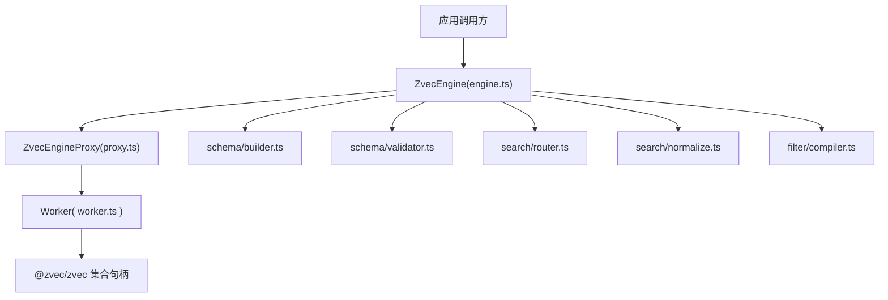
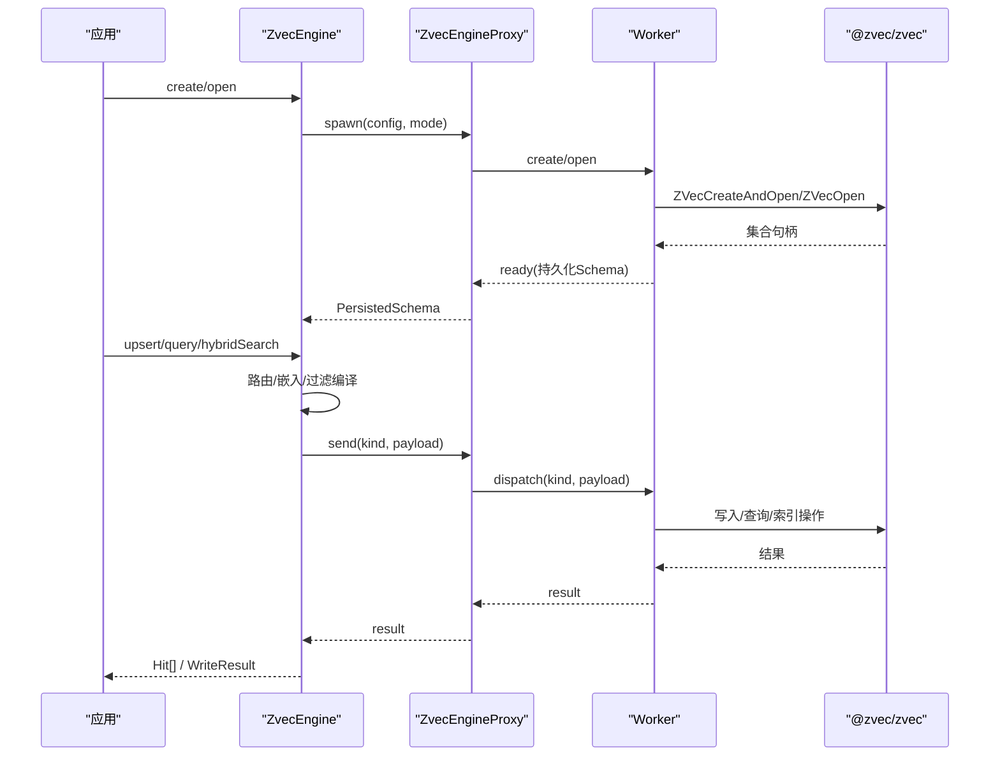
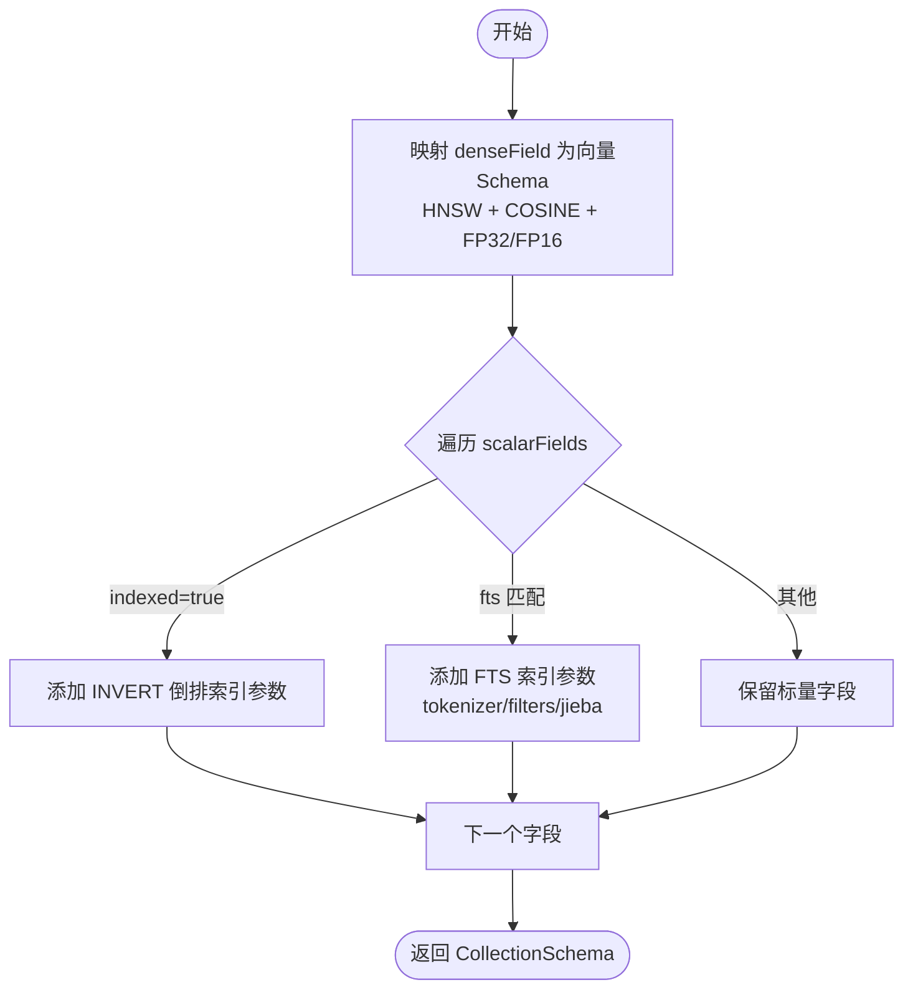
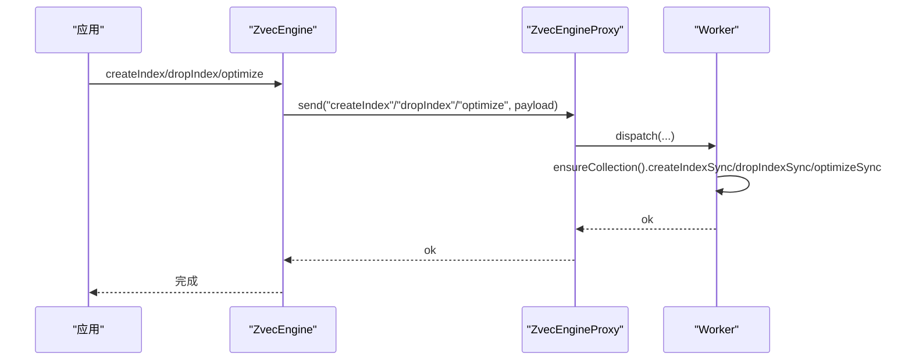
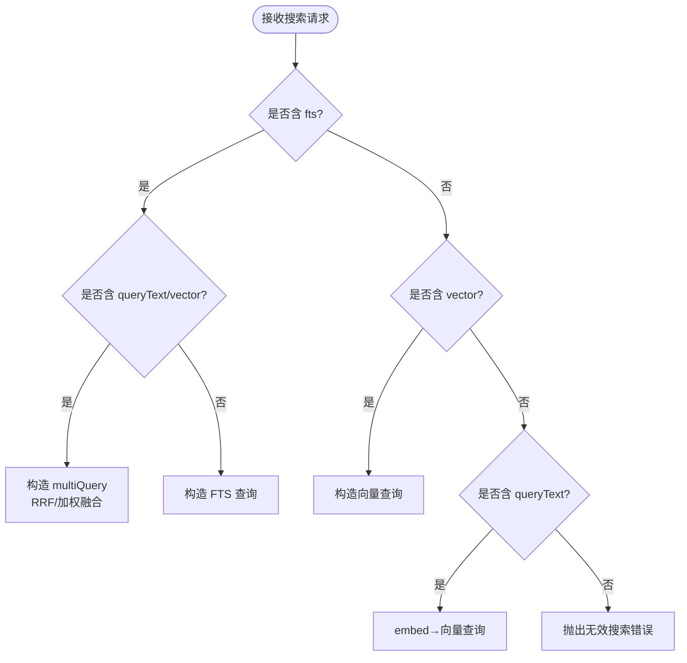
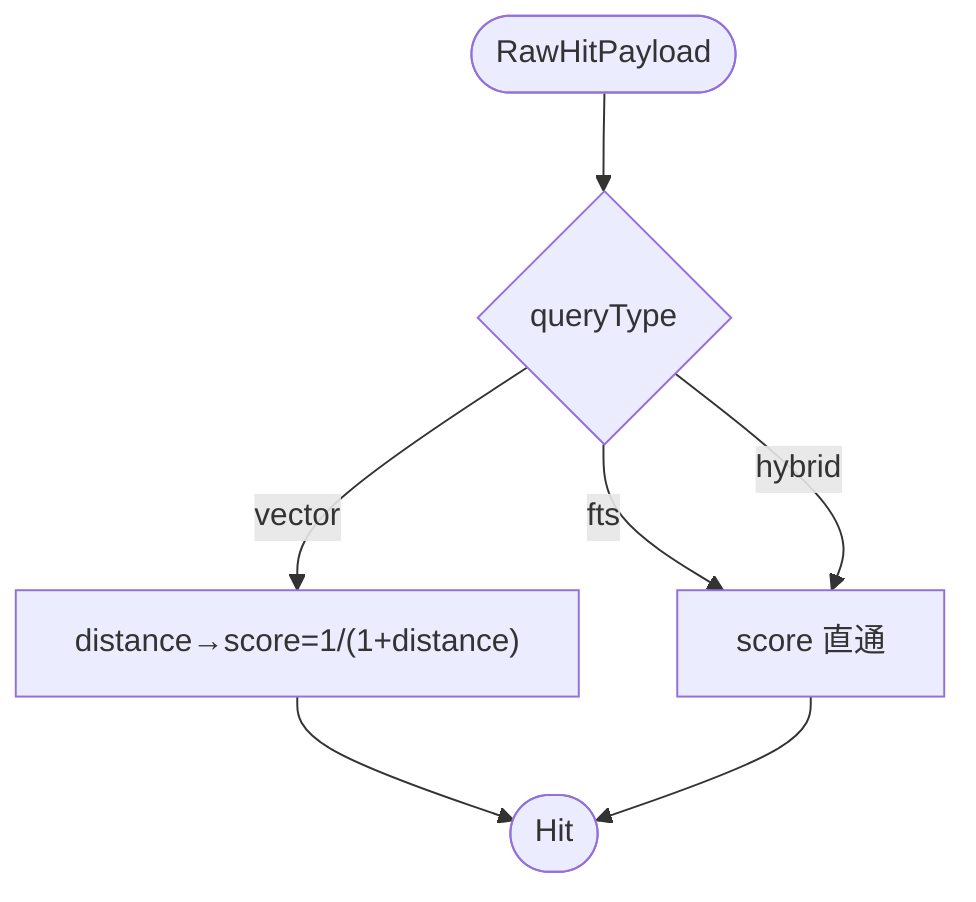
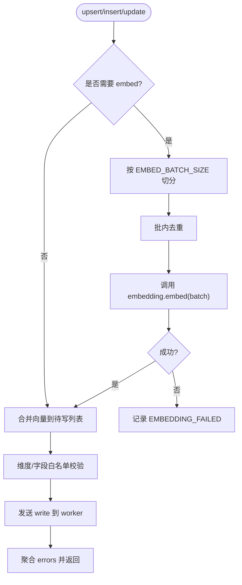
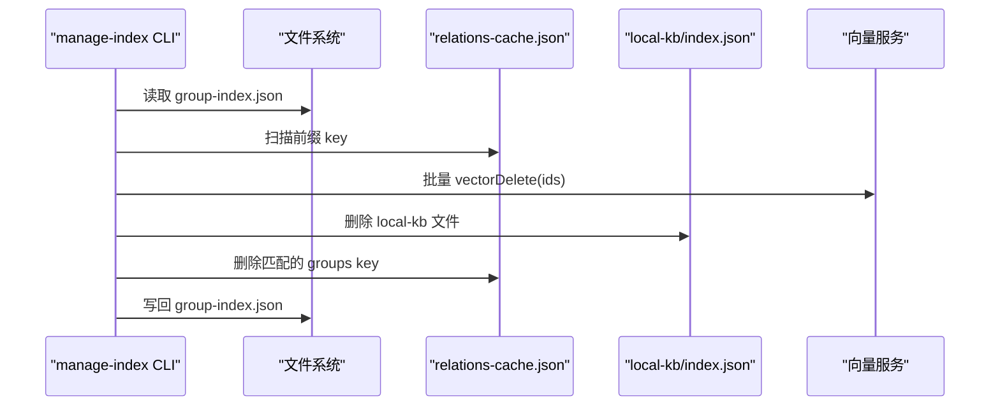
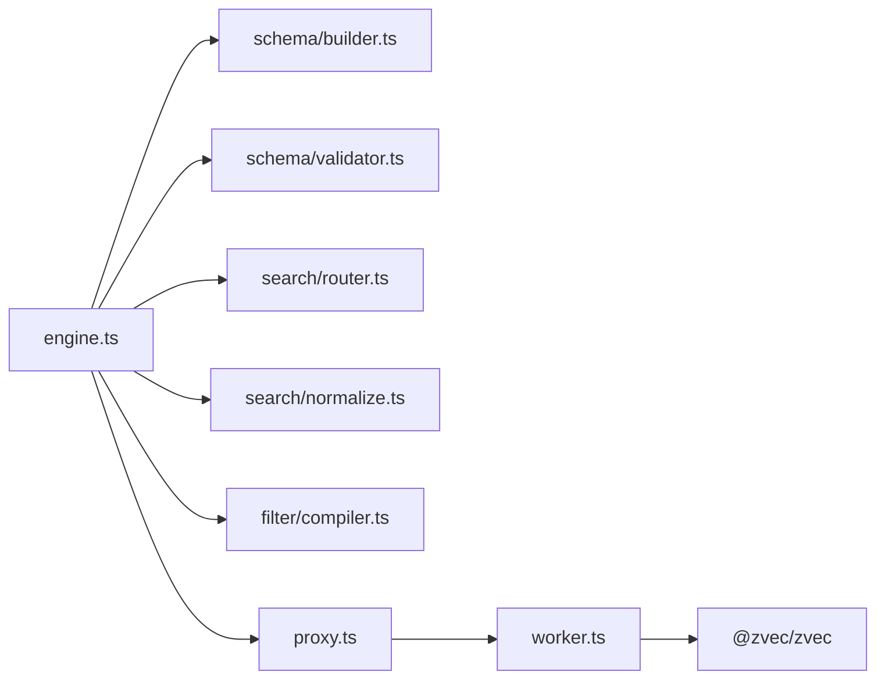

# 索引构建与优化

<cite>
**本文引用的文件**
- [src/zvec-engine/schema/builder.ts](file://src/zvec-engine/schema/builder.ts)
- [src/zvec-engine/schema/validator.ts](file://src/zvec-engine/schema/validator.ts)
- [src/zvec-engine/types.ts](file://src/zvec-engine/types.ts)
- [src/zvec-engine/search/router.ts](file://src/zvec-engine/search/router.ts)
- [src/zvec-engine/search/normalize.ts](file://src/zvec-engine/search/normalize.ts)
- [src/zvec-engine/filter/compiler.ts](file://src/zvec-engine/filter/compiler.ts)
- [src/zvec-engine/engine.ts](file://src/zvec-engine/engine.ts)
- [src/zvec-engine/proxy.ts](file://src/zvec-engine/proxy.ts)
- [src/zvec-engine/worker.ts](file://src/zvec-engine/worker.ts)
- [src/manage-index.ts](file://src/manage-index.ts)
- [docs/manage-index.md](file://docs/manage-index.md)
</cite>

## 目录
1. [简介](#简介)
2. [项目结构](#项目结构)
3. [核心组件](#核心组件)
4. [架构总览](#架构总览)
5. [详细组件分析](#详细组件分析)
6. [依赖关系分析](#依赖关系分析)
7. [性能与存储优化](#性能与存储优化)
8. [故障排查指南](#故障排查指南)
9. [结论](#结论)
10. [附录：操作清单](#附录：操作清单)

## 简介
本文件面向“索引构建与优化”主题，系统性说明 Schema 构建器、字段类型定义、索引参数配置；解释向量索引、全文检索索引、标量字段索引的创建与管理；给出索引优化策略、存储布局优化、查询性能调优；并提供索引重建、压缩与维护操作指南；最后覆盖混合搜索路由机制、查询计划生成与执行优化。

## 项目结构
围绕索引能力的关键代码集中在 zvec-engine 子模块中，采用“主线程门面 + Worker 线程执行”的架构：
- schema：Schema 构建与校验（builder、validator）
- search：检索路由与结果归一化（router、normalize）
- filter：结构化过滤条件编译为类 SQL 字符串（compiler）
- engine：对外暴露的引擎门面（engine），编排嵌入、写入、检索、索引维护
- proxy/worker：跨进程通信与底层集合句柄管理（proxy、worker）
- types：公共类型定义（types）
- manage-index：Group 树索引管理与级联清理（CLI/MCP）

图表来源
- [src/zvec-engine/engine.ts:68-131](file://src/zvec-engine/engine.ts#L68-L131)
- [src/zvec-engine/proxy.ts:56-109](file://src/zvec-engine/proxy.ts#L56-L109)
- [src/zvec-engine/worker.ts:118-163](file://src/zvec-engine/worker.ts#L118-L163)
- [src/zvec-engine/schema/builder.ts:38-81](file://src/zvec-engine/schema/builder.ts#L38-L81)
- [src/zvec-engine/schema/validator.ts:34-105](file://src/zvec-engine/schema/validator.ts#L34-L105)
- [src/zvec-engine/search/router.ts:43-127](file://src/zvec-engine/search/router.ts#L43-L127)
- [src/zvec-engine/search/normalize.ts:38-63](file://src/zvec-engine/search/normalize.ts#L38-L63)
- [src/zvec-engine/filter/compiler.ts:21-36](file://src/zvec-engine/filter/compiler.ts#L21-L36)

章节来源
- [src/zvec-engine/engine.ts:68-131](file://src/zvec-engine/engine.ts#L68-L131)
- [src/zvec-engine/proxy.ts:56-109](file://src/zvec-engine/proxy.ts#L56-L109)
- [src/zvec-engine/worker.ts:118-163](file://src/zvec-engine/worker.ts#L118-L163)

## 核心组件
- Schema 构建器：将高层配置转换为底层集合 Schema，并设置向量索引、标量索引与全文检索索引参数。
- 配置校验器：在 create/open 时进行严格约束（维度、度量、字段名、FTS 配置等）。
- 检索路由器：根据请求决定走向量路、FTS 路或混合两路 RRF/加权融合。
- 过滤器编译器：将结构化 Filter 编译为安全、白名单化的类 SQL 字符串。
- 引擎门面：统一编排嵌入、写入、检索、索引维护（createIndex/dropIndex/optimize）、生命周期管理。
- Worker 代理与线程：隔离集合句柄，串行处理消息，支持批量写入、查询插队、资源释放。

章节来源
- [src/zvec-engine/schema/builder.ts:38-94](file://src/zvec-engine/schema/builder.ts#L38-L94)
- [src/zvec-engine/schema/validator.ts:34-133](file://src/zvec-engine/schema/validator.ts#L34-L133)
- [src/zvec-engine/search/router.ts:43-127](file://src/zvec-engine/search/router.ts#L43-L127)
- [src/zvec-engine/filter/compiler.ts:21-36](file://src/zvec-engine/filter/compiler.ts#L21-L36)
- [src/zvec-engine/engine.ts:241-326](file://src/zvec-engine/engine.ts#L241-L326)
- [src/zvec-engine/proxy.ts:114-177](file://src/zvec-engine/proxy.ts#L114-L177)
- [src/zvec-engine/worker.ts:118-163](file://src/zvec-engine/worker.ts#L118-L163)

## 架构总览
下图展示从请求到落库/检索的完整链路，包括 Schema 构建、路由、嵌入、过滤、Worker 执行与结果归一化。

图表来源
- [src/zvec-engine/engine.ts:97-131](file://src/zvec-engine/engine.ts#L97-L131)
- [src/zvec-engine/engine.ts:241-326](file://src/zvec-engine/engine.ts#L241-L326)
- [src/zvec-engine/proxy.ts:56-109](file://src/zvec-engine/proxy.ts#L56-L109)
- [src/zvec-engine/worker.ts:118-163](file://src/zvec-engine/worker.ts#L118-L163)

## 详细组件分析

### Schema 构建器与字段类型
- 向量字段：通过 denseField、dimension、metric、denseDataType 映射为底层向量 Schema，默认使用 HNSW 索引与 COSINE 度量，数据类型按 FP32/FP16 选择。
- 标量字段：每个 ScalarFieldDef 映射为底层字段类型；若 indexed=true，则附加倒排索引参数（INVERT）。
- 全文检索（FTS）：当配置 fts 时，对应标量字段附加 FTS 索引参数，强制显式 tokenizer，并可配置 filters 与 jieba 词典目录。
- 名称与冲突检查：创建时校验集合名、维度一致性、metric 限定、字段重名、FTS 字段存在性与类型等。

图表来源
- [src/zvec-engine/schema/builder.ts:38-94](file://src/zvec-engine/schema/builder.ts#L38-L94)
- [src/zvec-engine/schema/validator.ts:34-105](file://src/zvec-engine/schema/validator.ts#L34-L105)

章节来源
- [src/zvec-engine/schema/builder.ts:38-94](file://src/zvec-engine/schema/builder.ts#L38-L94)
- [src/zvec-engine/schema/validator.ts:34-105](file://src/zvec-engine/schema/validator.ts#L34-L105)
- [src/zvec-engine/types.ts:21-71](file://src/zvec-engine/types.ts#L21-L71)

### 索引参数配置与创建/删除/优化
- 创建索引：engine.createIndex(field, indexParam) → worker.createIndexSync(fieldName, indexParams)。
- 删除索引：engine.dropIndex(field) → worker.dropIndexSync(field)。
- 优化索引：engine.optimize() → worker.optimizeSync()，触发底层合并/压缩以提升查询性能。

图表来源
- [src/zvec-engine/engine.ts:316-326](file://src/zvec-engine/engine.ts#L316-L326)
- [src/zvec-engine/worker.ts:146-159](file://src/zvec-engine/worker.ts#L146-L159)

章节来源
- [src/zvec-engine/engine.ts:316-326](file://src/zvec-engine/engine.ts#L316-L326)
- [src/zvec-engine/worker.ts:146-159](file://src/zvec-engine/worker.ts#L146-L159)

### 检索路由与查询计划
- 退化矩阵：
  - 同时提供 fts 与 queryText/vector → 混合两路（multiQuery），RRF 或加权融合。
  - 仅 vector 或 queryText → 单路向量检索。
  - 仅 fts/match → 单路 FTS 检索。
  - 三者皆缺 → 报错。
  - queryText 与 vector 同传 → 互斥报错。
- 文本长度与 topk 限制：防止过大请求。
- 过滤注入：将结构化 Filter 编译为类 SQL 字符串，注入到查询负载中。

图表来源
- [src/zvec-engine/search/router.ts:43-127](file://src/zvec-engine/search/router.ts#L43-L127)
- [src/zvec-engine/engine.ts:454-495](file://src/zvec-engine/engine.ts#L454-L495)
- [src/zvec-engine/filter/compiler.ts:21-36](file://src/zvec-engine/filter/compiler.ts#L21-L36)

章节来源
- [src/zvec-engine/search/router.ts:43-127](file://src/zvec-engine/search/router.ts#L43-L127)
- [src/zvec-engine/engine.ts:454-495](file://src/zvec-engine/engine.ts#L454-L495)
- [src/zvec-engine/filter/compiler.ts:21-36](file://src/zvec-engine/filter/compiler.ts#L21-L36)

### 结果归一化与分数语义
- 向量路（COSINE）：distance ∈ [0,2]，score = 1/(1+distance)，值域约 [1/3, 1]。
- FTS 路：BM25 原值，越大越相关。
- 混合路：RRF 或加权融合分，不二次转换。
- 异常距离处理：clamp 到 [0,2]；NaN/undefined 丢弃该命中。

图表来源
- [src/zvec-engine/search/normalize.ts:16-63](file://src/zvec-engine/search/normalize.ts#L16-L63)

章节来源
- [src/zvec-engine/search/normalize.ts:16-63](file://src/zvec-engine/search/normalize.ts#L16-L63)

### 写入路径与失败粒度
- 写入前按是否需要 embed 拆分文档；需要 embed 的按固定批次大小切分，批内去重以减少重复 HTTP 调用。
- 某批 embed 失败仅标记该批失败，不影响其余成功项写入，保证失败项进入 errors、成功项正常落库。
- 更新模式要求 dense vector 必填（或 text 以重新嵌入），避免 FTS 失配。

图表来源
- [src/zvec-engine/engine.ts:330-450](file://src/zvec-engine/engine.ts#L330-L450)

章节来源
- [src/zvec-engine/engine.ts:330-450](file://src/zvec-engine/engine.ts#L330-L450)

### Group 树索引与级联清理
- 提供 Group 树索引的创建、删除、列出 scope 等操作。
- 删除节点可级联清理 relations-cache、local-kb 与向量记忆（收集 memoryId 后批量删除）。
- MCP 仅支持空节点删除，非空需 CLI 带 --force 执行。

图表来源
- [src/manage-index.ts:320-411](file://src/manage-index.ts#L320-L411)
- [docs/manage-index.md:111-128](file://docs/manage-index.md#L111-L128)

章节来源
- [src/manage-index.ts:320-411](file://src/manage-index.ts#L320-L411)
- [docs/manage-index.md:111-128](file://docs/manage-index.md#L111-L128)

## 依赖关系分析
- engine 依赖 schema builder/validator、search router/normalize、filter compiler、proxy 与 worker。
- proxy 负责 worker 生命周期与消息协议，屏蔽跨进程细节。
- worker 直接持有 @zvec/zvec 集合句柄，串行处理所有 db 操作。
- 类型系统集中定义于 types，贯穿配置、文档、检索、结果等。

图表来源
- [src/zvec-engine/engine.ts:27-33](file://src/zvec-engine/engine.ts#L27-L33)
- [src/zvec-engine/proxy.ts:14-33](file://src/zvec-engine/proxy.ts#L14-L33)
- [src/zvec-engine/worker.ts:21-46](file://src/zvec-engine/worker.ts#L21-L46)

章节来源
- [src/zvec-engine/engine.ts:27-33](file://src/zvec-engine/engine.ts#L27-L33)
- [src/zvec-engine/proxy.ts:14-33](file://src/zvec-engine/proxy.ts#L14-L33)
- [src/zvec-engine/worker.ts:21-46](file://src/zvec-engine/worker.ts#L21-L46)

## 性能与存储优化
- 向量索引
  - 使用 HNSW + COSINE，适合高维相似度检索；确保 dimension 与 embedding 一致，避免运行时维度不匹配。
  - 合理设置 denseDataType（FP32/FP16）权衡精度与体积。
- 标量索引
  - 对高频过滤字段开启 indexed=true 以启用倒排索引，提升过滤效率。
  - 注意字段白名单与值类型合法性，避免无效过滤导致全表扫描。
- 全文检索索引
  - 选择合适的 tokenizer（推荐 jieba 用于中文），必要时配置 jieba 词典目录与过滤器。
  - FTS 字段必须为 STRING 类型，且需在 schema 中声明。
- 写入优化
  - 批大小：写入默认 batch size 与 embed 小批大小（EMBED_BATCH_SIZE）配合，减少网络往返与失败影响面。
  - 批内去重：相同 text 只 embed 一次，显著降低重复 HTTP 调用。
- 查询优化
  - 合理使用 filter 将无关数据提前剪枝。
  - 混合搜索优先使用 RRF 或加权融合，控制 topk 上限。
  - 结果归一化保证不同路分数可比性。
- 存储与压缩
  - 定期调用 optimize 触发底层合并/压缩，改善查询延迟与磁盘占用。
  - 删除无用索引（dropIndex）减少冗余开销。
- 生命周期与资源
  - 正确 close/destroy 释放锁与句柄，避免泄漏；probe 超时判定被锁状态，便于自愈流程。

章节来源
- [src/zvec-engine/schema/builder.ts:38-94](file://src/zvec-engine/schema/builder.ts#L38-L94)
- [src/zvec-engine/schema/validator.ts:34-133](file://src/zvec-engine/schema/validator.ts#L34-L133)
- [src/zvec-engine/engine.ts:330-450](file://src/zvec-engine/engine.ts#L330-L450)
- [src/zvec-engine/engine.ts:316-326](file://src/zvec-engine/engine.ts#L316-L326)
- [src/zvec-engine/search/router.ts:43-127](file://src/zvec-engine/search/router.ts#L43-L127)
- [src/zvec-engine/search/normalize.ts:16-63](file://src/zvec-engine/search/normalize.ts#L16-L63)

## 故障排查指南
- 常见错误与定位
  - 维度不匹配：collection.dimension 与 embedding.dimension 不一致 → DimensionMismatchError。
  - metric 不支持：仅支持 COSINE → InvalidSchemaError。
  - FTS 配置缺失或字段类型不符 → InvalidSchemaError。
  - 搜索参数非法：topk 非正整数、超过上限、文本为空或超长 → InvalidSearchError。
  - 更新模式缺少 dense vector 或 FTS 失配 → InconsistentUpdateError。
  - 集合不存在/损坏/被锁 → 对应类型化异常，可通过 probe 判断状态。
- 诊断步骤
  - 使用 info 获取集合元数据（维度、指标、字段、FTS）。
  - 使用 listIds(filter) 验证过滤逻辑是否正确编译。
  - 使用 probe 检测是否存在、是否被锁、是否健康。
  - 查看 WriteResult.errors 中的 code 与 reason，快速定位失败原因。
- 恢复建议
  - 被锁：等待或终止占用进程后重试。
  - 损坏：重建集合并导入数据。
  - 性能退化：执行 optimize 并评估索引/过滤策略。

章节来源
- [src/zvec-engine/schema/validator.ts:197-223](file://src/zvec-engine/schema/validator.ts#L197-L223)
- [src/zvec-engine/engine.ts:151-199](file://src/zvec-engine/engine.ts#L151-L199)
- [src/zvec-engine/search/router.ts:148-174](file://src/zvec-engine/search/router.ts#L148-L174)
- [src/zvec-engine/engine.ts:251-273](file://src/zvec-engine/engine.ts#L251-L273)

## 结论
本系统通过严格的 Schema 构建与校验、灵活的检索路由、安全的过滤编译以及稳定的 Worker 执行模型，实现了向量、全文与标量索引的统一管理与高效检索。结合批处理写入、结果归一化与索引优化操作，可在大规模知识索引场景下获得稳定、可预期的性能表现。

## 附录：操作清单
- 创建集合与索引
  - 配置 collection（denseField、dimension、metric、scalarFields、可选 fts）。
  - 调用 create/open 初始化集合。
  - 按需调用 createIndex/dropIndex/optimize 管理索引。
- 写入与检索
  - 写入：upsert/insert/update，注意 update 需 dense vector 或 text。
  - 检索：semanticSearch/vectorSearch/ftsSearch/hybridSearch，合理使用 filter 与 topk。
- 维护与优化
  - 定期 optimize 压缩索引。
  - 删除无用索引 dropIndex。
  - 使用 manage-index 管理 Group 树与级联清理。

章节来源
- [src/zvec-engine/engine.ts:97-131](file://src/zvec-engine/engine.ts#L97-L131)
- [src/zvec-engine/engine.ts:241-326](file://src/zvec-engine/engine.ts#L241-L326)
- [src/manage-index.ts:415-635](file://src/manage-index.ts#L415-L635)
- [docs/manage-index.md:65-128](file://docs/manage-index.md#L65-L128)