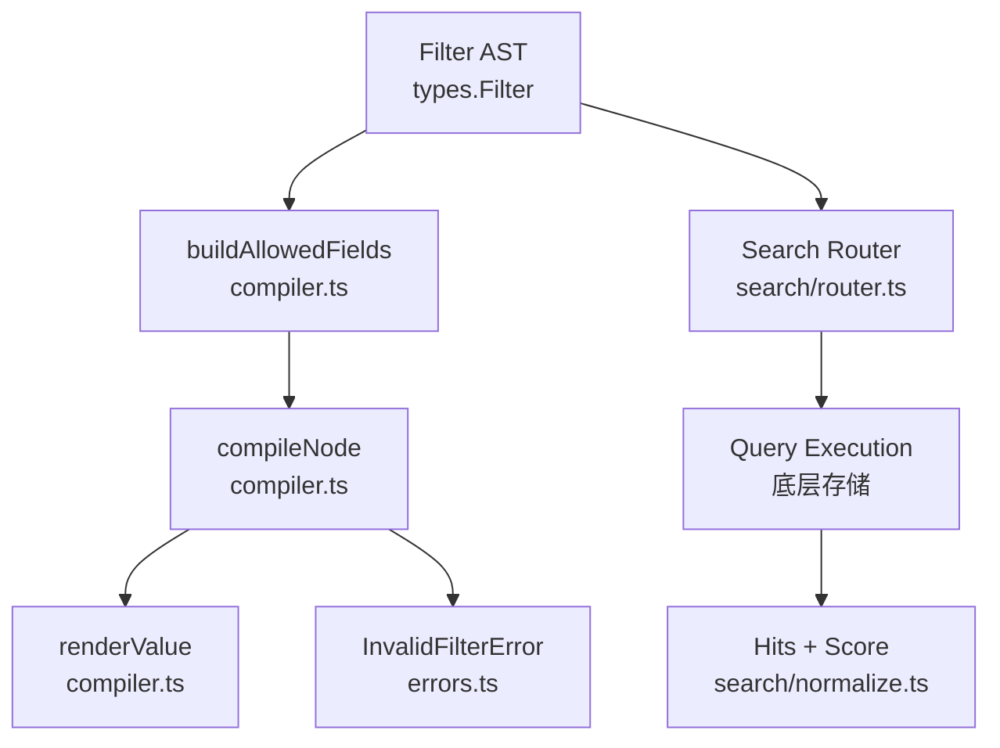
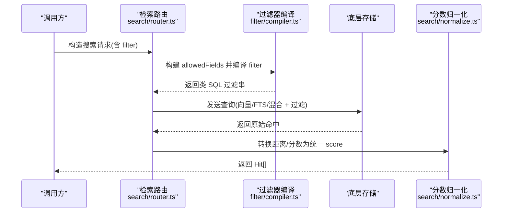
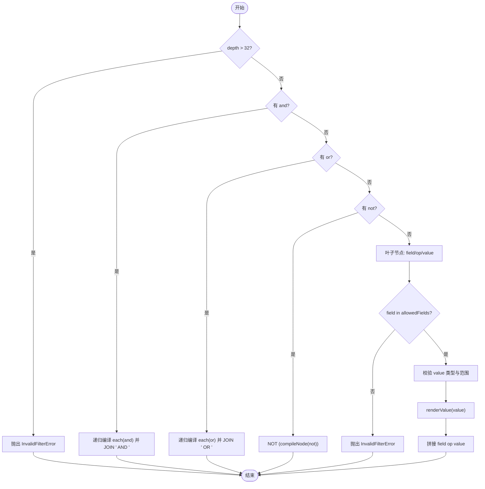
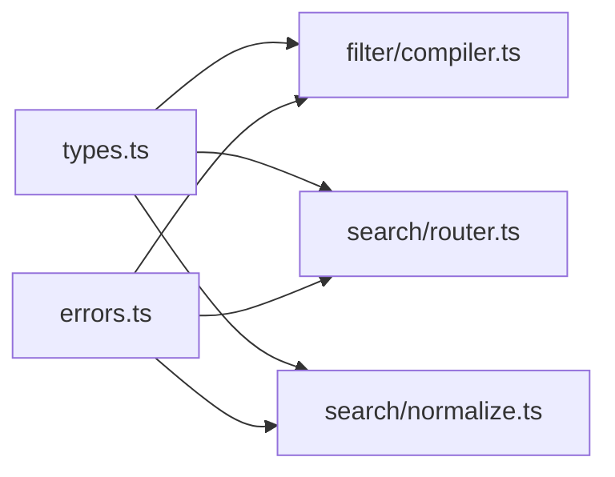

# 过滤器编译系统

<cite>
**本文引用的文件**
- [compiler.ts](file://src/zvec-engine/filter/compiler.ts)
- [types.ts](file://src/zvec-engine/types.ts)
- [errors.ts](file://src/zvec-engine/errors.ts)
- [router.ts](file://src/zvec-engine/search/router.ts)
- [normalize.ts](file://src/zvec-engine/search/normalize.ts)
- [zvec-engine-filter.test.mjs](file://test/zvec-engine-filter.test.mjs)
</cite>

## 目录
1. [简介](#简介)
2. [项目结构](#项目结构)
3. [核心组件](#核心组件)
4. [架构总览](#架构总览)
5. [详细组件分析](#详细组件分析)
6. [依赖关系分析](#依赖关系分析)
7. [性能考量](#性能考量)
8. [故障排查指南](#故障排查指南)
9. [结论](#结论)
10. [附录：常用过滤器示例与对比](#附录：常用过滤器示例与对比)

## 简介
本文件系统性地说明“过滤器编译系统”的设计与实现，覆盖以下方面：
- Filter 语法规范与支持的查询操作符
- 过滤器编译过程：AST 构建、SQL 生成、安全校验与性能保护
- 字段白名单机制与安全策略
- 复杂查询条件的组合逻辑与执行计划优化建议
- 常用过滤器使用示例与性能对比
- 调试工具与问题诊断方法

该子系统位于 zvec-engine 的 filter 模块中，负责将结构化 Filter（JSON AST）编译为可被底层存储执行的类 SQL 过滤表达式，并在编译阶段完成类型校验、注入防护与深度限制等安全措施。

## 项目结构
与过滤器编译相关的核心文件及职责如下：
- src/zvec-engine/filter/compiler.ts：Filter → 类 SQL 字符串编译器，包含白名单构建、节点递归编译、值渲染与错误抛出
- src/zvec-engine/types.ts：Filter 类型定义、Schema 定义、检索请求与结果类型
- src/zvec-engine/errors.ts：统一异常体系，包括 InvalidFilterError
- src/zvec-engine/search/router.ts：检索路由与退化矩阵（与 Filter 配合形成完整检索流程）
- src/zvec-engine/search/normalize.ts：分数归一化（与 Filter 无关但属于检索链路的一部分）
- test/zvec-engine-filter.test.mjs：过滤器编译器的单元测试，覆盖白名单、转义、嵌套、操作符等

图表来源
- [compiler.ts:21-102](file://src/zvec-engine/filter/compiler.ts#L21-L102)
- [types.ts:89-104](file://src/zvec-engine/types.ts#L89-L104)
- [errors.ts:17-38](file://src/zvec-engine/errors.ts#L17-L38)
- [router.ts:43-127](file://src/zvec-engine/search/router.ts#L43-L127)
- [normalize.ts:16-63](file://src/zvec-engine/search/normalize.ts#L16-L63)

章节来源
- [compiler.ts:1-102](file://src/zvec-engine/filter/compiler.ts#L1-L102)
- [types.ts:1-187](file://src/zvec-engine/types.ts#L1-L187)
- [errors.ts:1-99](file://src/zvec-engine/errors.ts#L1-L99)
- [router.ts:1-191](file://src/zvec-engine/search/router.ts#L1-L191)
- [normalize.ts:1-64](file://src/zvec-engine/search/normalize.ts#L1-L64)
- [zvec-engine-filter.test.mjs:1-102](file://test/zvec-engine-filter.test.mjs#L1-L102)

## 核心组件
- 白名单构建器 buildAllowedFields：基于 Schema 的 scalarFields 与可选 fts.field 构建允许使用的字段集合，防止未声明字段参与过滤
- 编译器 compileFilter/compileNode：递归遍历 Filter AST，生成类 SQL 表达式；支持 and/or/not 组合与叶子比较节点
- 值渲染 renderValue：对字符串进行反斜杠与单引号转义，数字原样输出，布尔转为 true/false
- 错误体系 InvalidFilterError：在非法字段、非法值、空 and/or、过深嵌套时抛出，便于上层捕获与处理

章节来源
- [compiler.ts:21-102](file://src/zvec-engine/filter/compiler.ts#L21-L102)
- [errors.ts:17-38](file://src/zvec-engine/errors.ts#L17-L38)

## 架构总览
过滤器编译系统与检索路由协同工作：
- 上层传入 SearchOptions.filter（Filter AST）
- 编译阶段通过 buildAllowedFields 与 compileFilter 生成安全的类 SQL 表达式
- 检索路由根据 queryText/vector/fts 选择向量路、FTS 路或混合路，并将 Filter 作为标量过滤条件下发到底层存储
- 返回结果经 normalize 归一化为 Hit 列表

图表来源
- [router.ts:43-127](file://src/zvec-engine/search/router.ts#L43-L127)
- [compiler.ts:31-78](file://src/zvec-engine/filter/compiler.ts#L31-L78)
- [normalize.ts:38-63](file://src/zvec-engine/search/normalize.ts#L38-L63)

## 详细组件分析

### Filter 语法规范与操作符
- 叶子节点：{ field, op, value }
  - field：必须来自白名单（scalarFields 或 fts.field）
  - op：==、!=、>、<、>=、<=
  - value：string | number | boolean，禁止 null/undefined/NaN/Infinity
- 组合节点：
  - { and: Filter[] }：至少一个子句
  - { or: Filter[] }：至少一个子句
  - { not: Filter }：对子句取反
- 嵌套深度上限：32，超过则抛错，防 DoS

章节来源
- [types.ts:89-95](file://src/zvec-engine/types.ts#L89-L95)
- [compiler.ts:38-78](file://src/zvec-engine/filter/compiler.ts#L38-L78)
- [zvec-engine-filter.test.mjs:41-89](file://test/zvec-engine-filter.test.mjs#L41-L89)

### AST 构建与编译流程
- 入口 compileFilter(filter, allowedFields) 调用内部 compileNode 递归编译
- 组合节点：and/or 递归编译每个子节点并用 AND/OR 连接；not 包裹子节点
- 叶子节点：校验字段在白名单、校验值类型与合法性，然后渲染为类 SQL 片段
- 值渲染：字符串先转义反斜杠再转义单引号，数字原样输出，布尔转为 true/false

图表来源
- [compiler.ts:31-102](file://src/zvec-engine/filter/compiler.ts#L31-L102)

章节来源
- [compiler.ts:31-102](file://src/zvec-engine/filter/compiler.ts#L31-L102)

### 字段白名单机制与安全策略
- 白名单来源：buildAllowedFields(scalarFields, ftsField?)
  - 仅允许 schema 中声明的标量字段与可选全文检索字段参与过滤
- 安全防护：
  - 未声明字段直接拒绝，避免任意字段访问
  - 字符串值严格转义（反斜杠翻倍、单引号转义），防止注入
  - 禁止 null/undefined/NaN/Infinity 值，避免语义歧义与潜在攻击面
  - 嵌套深度限制 32，防止恶意深层嵌套导致栈溢出或资源耗尽

章节来源
- [compiler.ts:21-93](file://src/zvec-engine/filter/compiler.ts#L21-L93)
- [zvec-engine-filter.test.mjs:21-71](file://test/zvec-engine-filter.test.mjs#L21-L71)

### 复杂查询条件组合与执行计划优化
- 组合逻辑：and/or 递归展开，not 包裹子表达式；所有子表达式加括号保证优先级
- 执行计划优化建议：
  - 尽量将高选择性条件放在 and 的前部，便于底层索引快速裁剪
  - 避免过度嵌套 not，必要时拆分为多个简单条件
  - 合理使用 topk 限制返回数量，减少后续排序与内存占用
  - 混合检索（hybrid）时，合理设置 rerank 权重或 RRF rankConstant，平衡向量与 FTS 贡献

章节来源
- [compiler.ts:47-65](file://src/zvec-engine/filter/compiler.ts#L47-L65)
- [router.ts:74-127](file://src/zvec-engine/search/router.ts#L74-L127)

### 与检索路由的集成
- 路由规则：
  - 同时提供 vector 与 queryText → 报错（互斥）
  - 提供 fts 且提供 vector/queryText → hybrid 两路，RRF 或加权融合
  - 仅提供 vector → 向量路
  - 仅提供 fts/match → FTS 路
  - 三者皆缺 → 报错
- Filter 在路由后作为标量过滤条件随 QueryPayload/MultiQueryPayload 下发到底层存储

章节来源
- [router.ts:43-127](file://src/zvec-engine/search/router.ts#L43-L127)

## 依赖关系分析
- compiler.ts 依赖 types.ts 中的 Filter、ScalarFieldDef、ScalarValue 等类型
- compiler.ts 依赖 errors.ts 中的 InvalidFilterError
- search/router.ts 依赖 types.ts 中的检索请求类型与 errors.ts 中的 InvalidSearchError
- search/normalize.ts 依赖 types.ts 中的 Hit 与 errors.ts 中的 SchemaMismatchError

图表来源
- [types.ts:1-187](file://src/zvec-engine/types.ts#L1-L187)
- [errors.ts:1-99](file://src/zvec-engine/errors.ts#L1-L99)
- [compiler.ts:1-102](file://src/zvec-engine/filter/compiler.ts#L1-L102)
- [router.ts:1-191](file://src/zvec-engine/search/router.ts#L1-L191)
- [normalize.ts:1-64](file://src/zvec-engine/search/normalize.ts#L1-L64)

章节来源
- [types.ts:1-187](file://src/zvec-engine/types.ts#L1-L187)
- [errors.ts:1-99](file://src/zvec-engine/errors.ts#L1-L99)
- [compiler.ts:1-102](file://src/zvec-engine/filter/compiler.ts#L1-L102)
- [router.ts:1-191](file://src/zvec-engine/search/router.ts#L1-L191)
- [normalize.ts:1-64](file://src/zvec-engine/search/normalize.ts#L1-L64)

## 性能考量
- 编译阶段复杂度：O(N)，N 为 Filter 节点数；递归深度限制 32，避免栈溢出
- 字符串转义成本：每次字符串值需两次替换（反斜杠与单引号），建议在高频路径缓存白名单与复用编译结果
- 查询性能：
  - 高选择性条件优先：如精确匹配 tag、数值范围筛选
  - 控制 topk：避免过大 topk 导致排序与内存压力
  - 混合检索权重：根据业务场景调整 rerank 权重或 RRF rankConstant
- 错误快速失败：非法字段、非法值、空 and/or、过深嵌套立即抛错，减少无效计算

[本节为通用指导，不直接分析具体文件]

## 故障排查指南
常见错误与定位方法：
- InvalidFilterError：
  - 未声明字段：检查 buildAllowedFields 是否包含目标字段（scalarFields 或 fts.field）
  - 非法值：确保 value 非 null/undefined/NaN/Infinity，且类型为 string/number/boolean
  - 空 and/or：确保数组至少包含一个子句
  - 嵌套过深：减少 not 或 and/or 的层级，控制在 32 以内
- 注入风险：确认字符串值已正确转义；测试用例覆盖了单引号与反斜杠转义
- 检索路由错误：
  - queryText 与 vector 互斥：只传其一
  - 缺少必要参数：至少提供 queryText/vector/fts/match 之一
  - 文本长度超限：确保 match 或 queryText 不超过最大长度限制

章节来源
- [errors.ts:17-38](file://src/zvec-engine/errors.ts#L17-L38)
- [zvec-engine-filter.test.mjs:21-89](file://test/zvec-engine-filter.test.mjs#L21-L89)
- [router.ts:148-174](file://src/zvec-engine/search/router.ts#L148-L174)

## 结论
过滤器编译系统将结构化 Filter 安全、高效地转换为类 SQL 表达式，通过字段白名单、值校验、注入防护与深度限制保障安全性；结合检索路由与分数归一化，形成完整的检索链路。实践中应关注高选择性条件放置、topk 控制与混合检索权重调优，以获得更好的性能与稳定性。

[本节为总结性内容，不直接分析具体文件]

## 附录：常用过滤器示例与对比
以下为典型用法与预期行为（以测试断言为依据）：
- 白名单拒绝未声明字段：对 unknown 字段查询会抛 InvalidFilterError
- 字符串值转义：单引号与反斜杠会被正确转义，防止注入
- and/or 嵌套：and 用 AND 连接，or 用 OR 连接，子表达式加括号
- not 子句：NOT (子表达式)
- 操作符变体：== 映射为 =，!=、>、<、>=、<= 保持原样
- 布尔值渲染：true/false 原样输出
- 数字值渲染：整数、浮点、负数原样输出

章节来源
- [zvec-engine-filter.test.mjs:21-95](file://test/zvec-engine-filter.test.mjs#L21-L95)