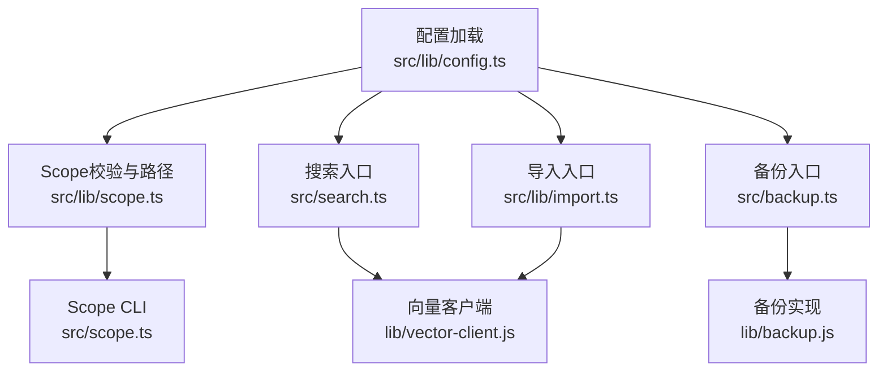
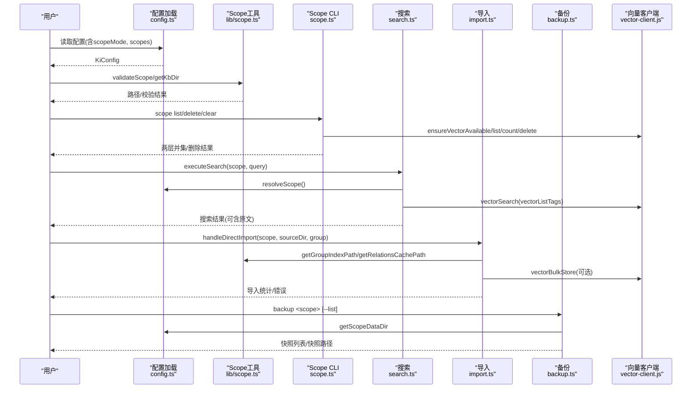
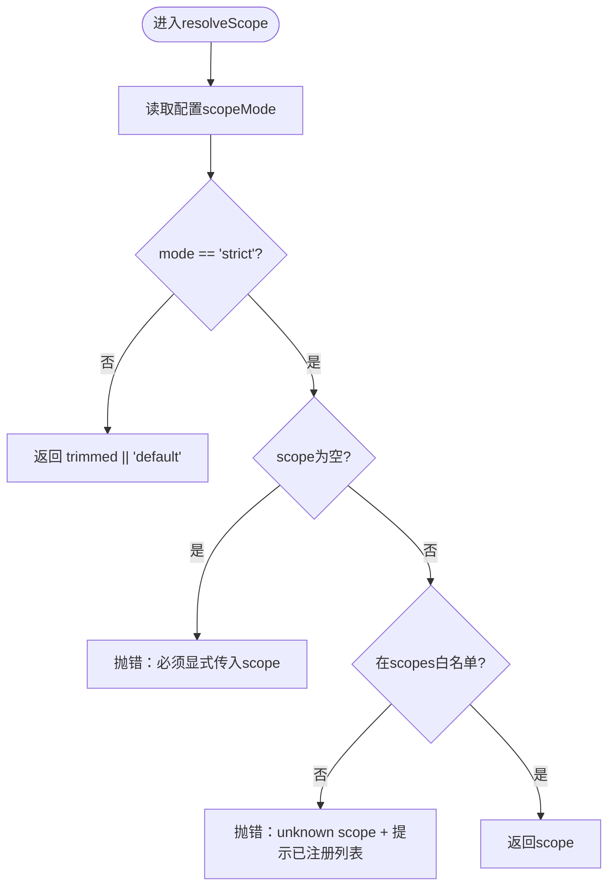
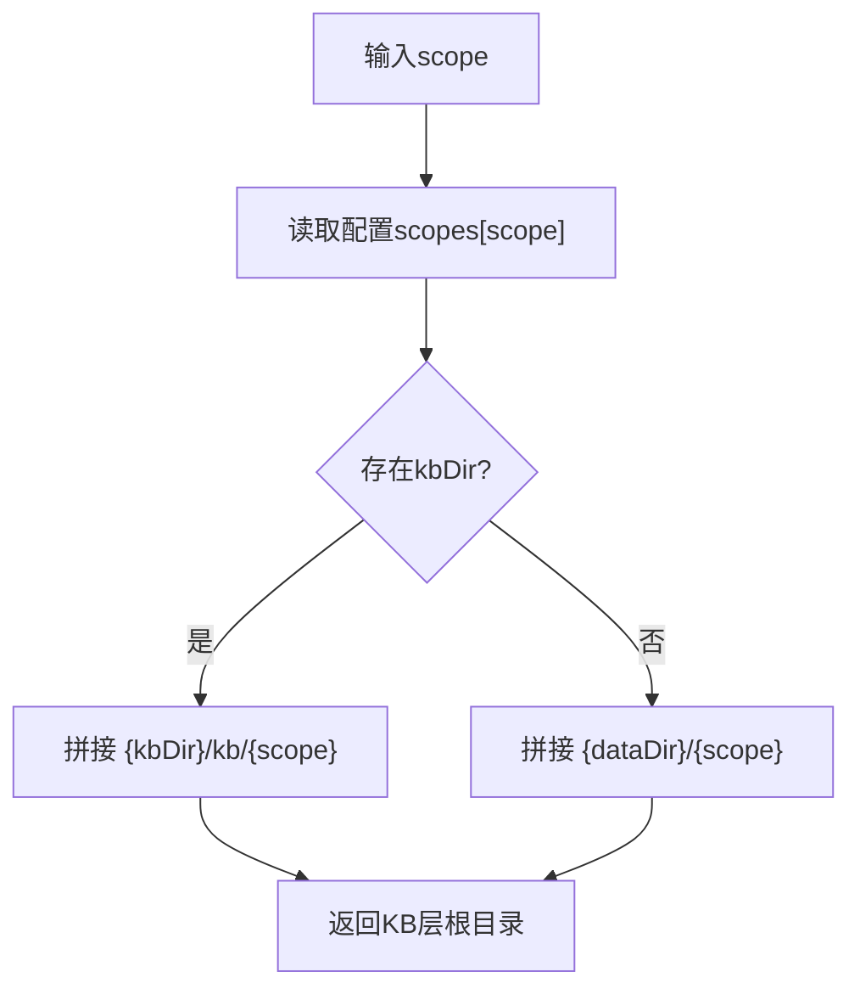
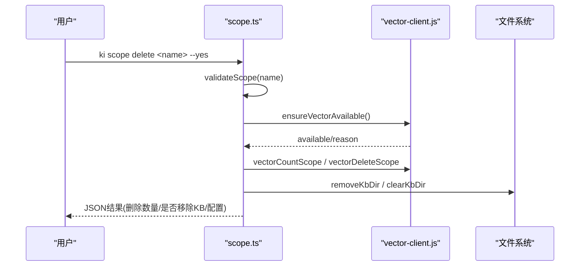
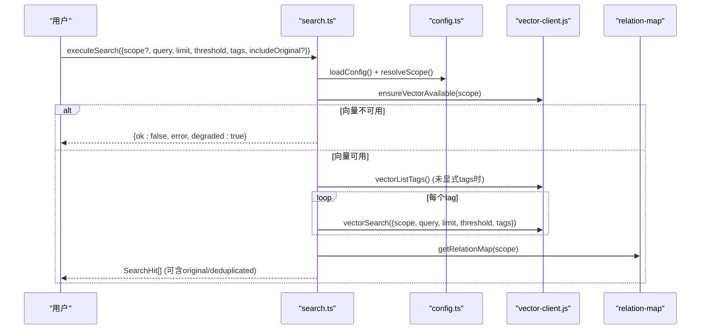
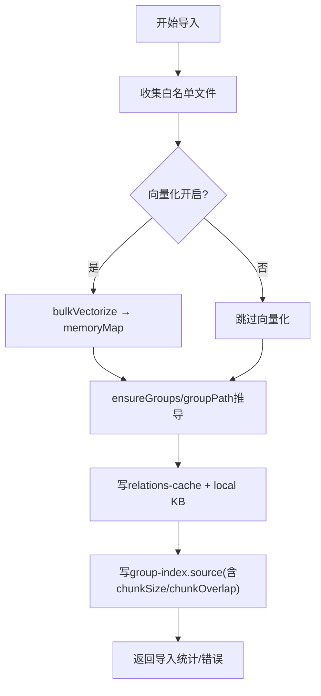
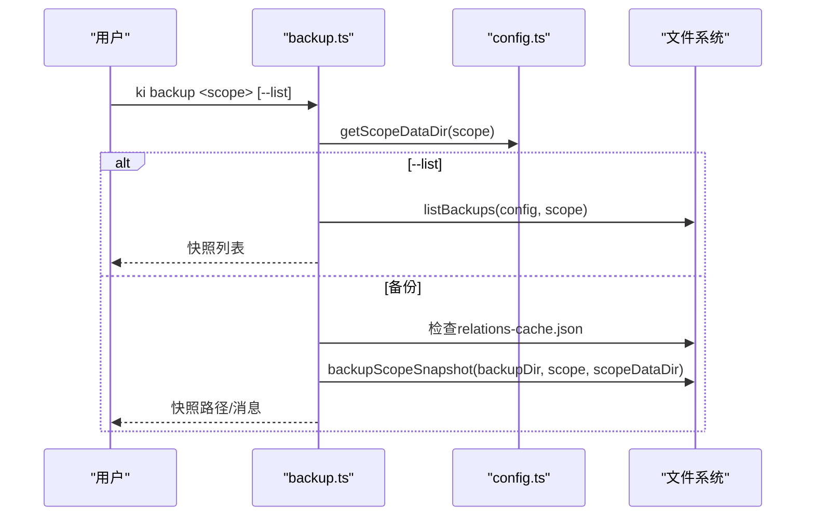
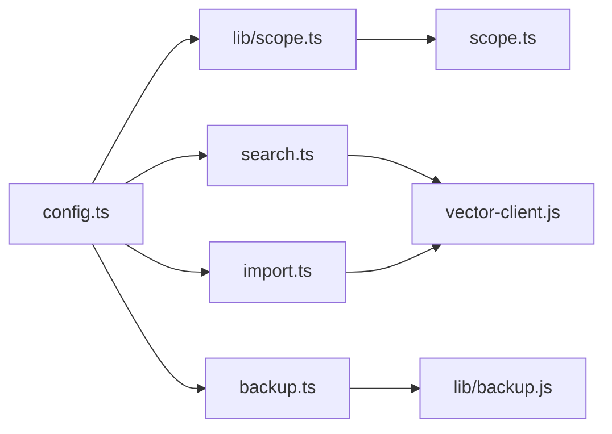

# Scope隔离管理

<cite>
**本文引用的文件**
- [src/scope.ts](file://src/scope.ts)
- [src/lib/scope.ts](file://src/lib/scope.ts)
- [src/lib/config.ts](file://src/lib/config.ts)
- [src/search.ts](file://src/search.ts)
- [src/lib/import.ts](file://src/lib/import.ts)
- [src/backup.ts](file://src/backup.ts)
- [test/scope-mode.test.ts](file://test/scope-mode.test.ts)
- [test/scope-doc.test.ts](file://test/scope-doc.test.ts)
- [test/scope-isolation.test.ts](file://test/scope-isolation.test.ts)
- [docs/cli.md](file://docs/cli.md)
- [docs/backup-restore.md](file://docs/backup-restore.md)
</cite>

## 目录
1. [简介](#简介)
2. [项目结构](#项目结构)
3. [核心组件](#核心组件)
4. [架构总览](#架构总览)
5. [详细组件分析](#详细组件分析)
6. [依赖关系分析](#依赖关系分析)
7. [性能考量](#性能考量)
8. [故障排查指南](#故障排查指南)
9. [结论](#结论)
10. [附录：CLI命令速查](#附录cli命令速查)

## 简介
本文件系统性说明知识索引系统中的Scope隔离机制，覆盖以下目标：
- 解释Scope的概念与作用：项目级数据隔离、命名空间管理、权限控制（通过scopeMode实现白名单限制）。
- 详细说明Scope的创建、配置与管理方法。
- 深入讲解scopeMode两种模式：default（灵活使用）与strict（白名单限制）的安全考虑。
- 解释Scope与KB目录的映射关系，包括kbDir配置的自动拼接逻辑。
- 提供多项目场景下的Scope设计模式与最佳实践。
- 包含Scope相关的CLI命令使用示例。
- 说明Scope在搜索、导入、备份等操作中的行为差异。
- 提供Scope管理的常见问题与解决方案。

## 项目结构
围绕Scope的核心代码分布在以下模块：
- 配置加载与解析：src/lib/config.ts
- Scope校验与路径构造：src/lib/scope.ts
- Scope CLI与生命周期管理：src/scope.ts
- 搜索流程中Scope应用：src/search.ts
- 导入流程中Scope应用：src/lib/import.ts
- 备份命令入口：src/backup.ts
- 测试用例验证隔离与模式语义：test/*.ts

图表来源
- [src/lib/config.ts:148-359](file://src/lib/config.ts#L148-L359)
- [src/lib/scope.ts:30-77](file://src/lib/scope.ts#L30-L77)
- [src/scope.ts:94-132](file://src/scope.ts#L94-L132)
- [src/search.ts:70-199](file://src/search.ts#L70-L199)
- [src/lib/import.ts:1-117](file://src/lib/import.ts#L1-L117)
- [src/backup.ts:63-103](file://src/backup.ts#L63-L103)

章节来源
- [src/lib/config.ts:148-359](file://src/lib/config.ts#L148-L359)
- [src/lib/scope.ts:30-77](file://src/lib/scope.ts#L30-L77)
- [src/scope.ts:94-132](file://src/scope.ts#L94-L132)
- [src/search.ts:70-199](file://src/search.ts#L70-L199)
- [src/lib/import.ts:1-117](file://src/lib/import.ts#L1-L117)
- [src/backup.ts:63-103](file://src/backup.ts#L63-L103)

## 核心组件
- 配置中心（KiConfig）：集中管理dataDir、vectorDir、embedding、scopeMode、scopes等全局与scope级配置。
- Scope校验与路径工具：确保scope名称合法，并计算KB层目录、group-index.json、relations-cache.json等关键路径。
- Scope CLI：提供list/delete/clear等生命周期操作，协调KB层与向量层一致性。
- 搜索流程：基于resolveScope进行scope护栏，结合tag优先级与原文召回。
- 导入流程：按scope写入KB层（relations-cache、local KB），可选向量化；支持source块持久化切分参数。
- 备份流程：对指定scope生成快照，支持列出与恢复。

章节来源
- [src/lib/config.ts:119-128](file://src/lib/config.ts#L119-L128)
- [src/lib/scope.ts:30-77](file://src/lib/scope.ts#L30-L77)
- [src/scope.ts:233-292](file://src/scope.ts#L233-L292)
- [src/search.ts:70-199](file://src/search.ts#L70-L199)
- [src/lib/import.ts:1-117](file://src/lib/import.ts#L1-L117)
- [src/backup.ts:63-103](file://src/backup.ts#L63-L103)

## 架构总览
Scope贯穿配置、存储、检索与运维全链路。下图展示从配置到各操作的调用链路与数据流向。

图表来源
- [src/lib/config.ts:148-359](file://src/lib/config.ts#L148-L359)
- [src/lib/scope.ts:30-77](file://src/lib/scope.ts#L30-L77)
- [src/scope.ts:94-132](file://src/scope.ts#L94-L132)
- [src/search.ts:70-199](file://src/search.ts#L70-L199)
- [src/lib/import.ts:1-117](file://src/lib/import.ts#L1-L117)
- [src/backup.ts:63-103](file://src/backup.ts#L63-L103)

## 详细组件分析

### 配置与scopeMode策略
- scopeMode定义与解析：仅当显式设置为'strict'时生效，否则归为'default'。
- default模式：未传scope或空scope回退为'default'，任意值放行，便于快速迭代。
- strict模式：必须显式传入非空scope，且必须在config.scopes白名单内，否则抛出错误（fail-loud）。
- 辅助函数：getScopeMode、resolveScope用于统一策略执行。

图表来源
- [src/lib/config.ts:288-289](file://src/lib/config.ts#L288-L289)
- [src/lib/config.ts:433-459](file://src/lib/config.ts#L433-L459)

章节来源
- [src/lib/config.ts:288-289](file://src/lib/config.ts#L288-L289)
- [src/lib/config.ts:433-459](file://src/lib/config.ts#L433-L459)
- [test/scope-mode.test.ts:43-97](file://test/scope-mode.test.ts#L43-L97)

### Scope与KB目录映射及自动拼接
- getKbDir：优先使用scope级kbDir，再fallback到全局dataDir/{scope}。
- getScopeDataDir：若配置了scopes.<scope>.kbDir，则自动拼接为{kbDir}/kb/{scope}，避免污染源码目录；否则使用dataDir/{scope}。
- 其他路径：group-index.json、relations-cache.json、本地KB的group/index.json均由上述基础路径派生。

图表来源
- [src/lib/config.ts:382-386](file://src/lib/config.ts#L382-L386)
- [src/lib/scope.ts:49-77](file://src/lib/scope.ts#L49-L77)

章节来源
- [src/lib/config.ts:382-386](file://src/lib/config.ts#L382-L386)
- [src/lib/scope.ts:49-77](file://src/lib/scope.ts#L49-L77)

### Scope生命周期管理（CLI）
- list：合并KB层与向量层scope集合，标注是否存在于KB、向量、以及是否注册；同时输出当前scopeMode与向量可用性。
- delete：保护default不可删；需向量服务可用；支持--yes确认；删除向量、KB目录、配置条目（尽力而为）。
- clear：可按tags仅清向量层对应tag；不传tags则清空KB目录内容（保留目录）；同样需要--yes确认。

图表来源
- [src/scope.ts:145-179](file://src/scope.ts#L145-L179)
- [src/scope.ts:192-221](file://src/scope.ts#L192-L221)
- [src/scope.ts:233-292](file://src/scope.ts#L233-L292)

章节来源
- [src/scope.ts:94-132](file://src/scope.ts#L94-L132)
- [src/scope.ts:145-179](file://src/scope.ts#L145-L179)
- [src/scope.ts:192-221](file://src/scope.ts#L192-L221)
- [src/scope.ts:233-292](file://src/scope.ts#L233-L292)

### 搜索中的Scope行为
- 入口executeSearch先通过resolveScope进行护栏，再检测向量可用性。
- 默认搜索全部tag时，按内置优先级（ki-search > ki-relation > ki-path）分别查询并合并排序。
- 支持includeOriginal：根据memoryId反查relations-cache获取group/relation，再从本地KB取原文；失败降级返回向量文档并附带提示。
- Multi-tag去重：同一(group,relation)只保留score最高的一条；同文件多chunk命中去重，后续条目的original置空并标记deduplicated。

图表来源
- [src/search.ts:70-199](file://src/search.ts#L70-L199)

章节来源
- [src/search.ts:70-199](file://src/search.ts#L70-L199)

### 导入中的Scope行为
- 直导模式：Phase 2向量化（可选）、Phase 3建Group树、Phase 4写relations-cache与local KB（含memoryId/sourcePath）、Phase 5记录source块（含切分参数）。
- 幂等追加：同sourcePath覆盖、同名不同sourcePath跳过、新文件导入。
- Group落点规则：显式--group时作为前缀；缺省时目录导入以相对目录为groupPath，单文件导入以scope name为根。
- 格式白名单：默认.md，可通过scopes.<scope>.import.extensions扩展；超限或chunk过多会跳过并统计。

图表来源
- [src/lib/import.ts:1-117](file://src/lib/import.ts#L1-L117)
- [src/lib/import.ts:136-200](file://src/lib/import.ts#L136-L200)

章节来源
- [src/lib/import.ts:1-117](file://src/lib/import.ts#L1-L117)
- [src/lib/import.ts:136-200](file://src/lib/import.ts#L136-L200)

### 备份中的Scope行为
- 手动备份：ki backup <scope> 生成tar.gz快照至{backupDir}/{scope}/snapshots；支持--list列出历史。
- 前置检查：scope数据目录存在且包含relations-cache.json才允许备份。
- 自动备份：导入成功后触发ai-results副本与scope快照（见设计文档约定）。

图表来源
- [src/backup.ts:63-103](file://src/backup.ts#L63-L103)

章节来源
- [src/backup.ts:63-103](file://src/backup.ts#L63-L103)
- [docs/backup-restore.md:46-170](file://docs/backup-restore.md#L46-L170)

### 多项目场景与最佳实践
- 物理隔离：相同Group/Relation在不同scope下独立存储，互不串读/串写/串删（测试覆盖）。
- 命名规范：scope仅允许字母、数字、连字符、下划线，禁止路径遍历字符。
- 模式选择：
  - default：适合开发/实验环境，允许任意scope快速创建。
  - strict：生产环境推荐，强制白名单注册，防止误用未知scope。
- 目录规划：
  - 使用scopes.<scope>.kbDir将不同项目的KB落盘到不同物理位置，并通过自动拼接{kbDir}/kb/{scope}避免污染源码目录。
  - 共享dataDir时，确保每个scope子目录独立。
- 权限控制：通过strict模式+白名单实现“访问控制”；结合外部鉴权（如MCP allowedHosts）进一步收敛暴露面。
- 备份策略：为每个scope建立定期快照；导入后自动备份；恢复时支持从最新或指定时间戳快照还原。

章节来源
- [test/scope-isolation.test.ts:50-59](file://test/scope-isolation.test.ts#L50-L59)
- [src/lib/scope.ts:30-43](file://src/lib/scope.ts#L30-L43)
- [src/lib/config.ts:382-386](file://src/lib/config.ts#L382-L386)
- [docs/backup-restore.md:72-170](file://docs/backup-restore.md#L72-L170)

## 依赖关系分析
- config.ts为所有模块提供统一的配置读取与scopeMode解析。
- lib/scope.ts提供路径与校验能力，被CLI、搜索、导入、备份等多处复用。
- search.ts依赖vector-client进行语义检索，并通过relation-map关联KB定位。
- import.ts依赖vector-client进行批量向量化（可选），并维护relations-cache与local KB。
- backup.ts依赖lib/backup进行快照打包，依赖config获取scope数据目录。

图表来源
- [src/lib/config.ts:148-359](file://src/lib/config.ts#L148-L359)
- [src/lib/scope.ts:30-77](file://src/lib/scope.ts#L30-L77)
- [src/search.ts:70-199](file://src/search.ts#L70-L199)
- [src/lib/import.ts:1-117](file://src/lib/import.ts#L1-L117)
- [src/backup.ts:63-103](file://src/backup.ts#L63-L103)

章节来源
- [src/lib/config.ts:148-359](file://src/lib/config.ts#L148-L359)
- [src/lib/scope.ts:30-77](file://src/lib/scope.ts#L30-L77)
- [src/search.ts:70-199](file://src/search.ts#L70-L199)
- [src/lib/import.ts:1-117](file://src/lib/import.ts#L1-L117)
- [src/backup.ts:63-103](file://src/backup.ts#L63-L103)

## 性能考量
- 搜索阶段：
  - tag分查并按优先级合并，避免单次大查询开销。
  - relation-map带TTL与mtime缓存，首次构建O(N)，后续O(1)。
  - 多tag去重与同文件多chunk去重减少冗余输出。
- 导入阶段：
  - 并行向量化与KB写入（设计文档提及优化），注意向量化失败仍写入KB层的变更。
  - 白名单过滤与大小限制减少无效IO。
- 备份阶段：
  - tar.gz压缩快照，保留历史不做自动清理，注意磁盘占用。

章节来源
- [src/search.ts:94-199](file://src/search.ts#L94-L199)
- [src/lib/import.ts:1-117](file://src/lib/import.ts#L1-L117)
- [docs/backup-restore.md:72-170](file://docs/backup-restore.md#L72-L170)

## 故障排查指南
- 非法scope字符：
  - 现象：报错“不合法：仅允许字母、数字、连字符(-)、下划线(_)”。
  - 原因：validateScope拒绝路径遍历与特殊字符。
  - 处理：修正scope命名。
- strict模式下未注册scope：
  - 现象：报错“unknown scope”，并提示已注册scope列表。
  - 原因：resolveScope在strict模式下要求scope在白名单。
  - 处理：在config.scopes中添加该scope。
- 向量服务不可用：
  - 现象：搜索/备份/删除时报错“向量检索暂不可用”或“向量服务暂不可用”。
  - 原因：未检测到向量服务或无apiKey导致降级。
  - 处理：启动向量服务或配置embedding.apiKey；scope list在无apiKey时仍返回KB层。
- 删除/清理需确认：
  - 现象：未加--yes时返回requireConfirm与预览信息。
  - 原因：破坏性操作安全保护。
  - 处理：确认无误后加--yes重试。
- 备份失败：
  - 现象：报“尚未初始化（缺少relations-cache.json）”。
  - 原因：scope未导入或损坏。
  - 处理：先执行导入或从模板重新初始化。

章节来源
- [src/lib/scope.ts:30-43](file://src/lib/scope.ts#L30-L43)
- [src/lib/config.ts:444-459](file://src/lib/config.ts#L444-L459)
- [src/search.ts:84-92](file://src/search.ts#L84-L92)
- [src/scope.ts:152-179](file://src/scope.ts#L152-L179)
- [src/backup.ts:84-90](file://src/backup.ts#L84-L90)

## 结论
Scope隔离机制通过配置驱动的模式与路径策略，实现了项目级数据隔离、命名空间管理与严格/灵活的访问控制。配合CLI的生命周期管理、搜索与导入的流程集成、以及备份恢复能力，形成了完整的多项目知识索引体系。在生产环境中建议采用strict模式与白名单注册，合理划分kbDir与dataDir，并建立完善的备份与监控策略。

## 附录：CLI命令速查
- 列出scope：
  - ki scope list [--json]
- 删除scope：
  - ki scope delete <name> --yes
- 清空scope：
  - ki scope clear <name> [--tags t1,t2] --yes
- 搜索：
  - ki search --scope <scope> --query "..." [--limit 10] [--threshold 0.0] [--tags ...] [--original]
- 导入：
  - ki scan-kb import --scope <scope> --source <dir|file> [--group <group>] [--no-vector] [--clean-rules ...]
- 备份：
  - ki backup <scope> [--list]
- 列出所有scope（管理索引）：
  - ki manage-index --action list-scopes

章节来源
- [src/scope.ts:233-292](file://src/scope.ts#L233-L292)
- [src/search.ts:70-199](file://src/search.ts#L70-L199)
- [src/lib/import.ts:1-117](file://src/lib/import.ts#L1-L117)
- [src/backup.ts:63-103](file://src/backup.ts#L63-L103)
- [docs/cli.md:77-191](file://docs/cli.md#L77-L191)