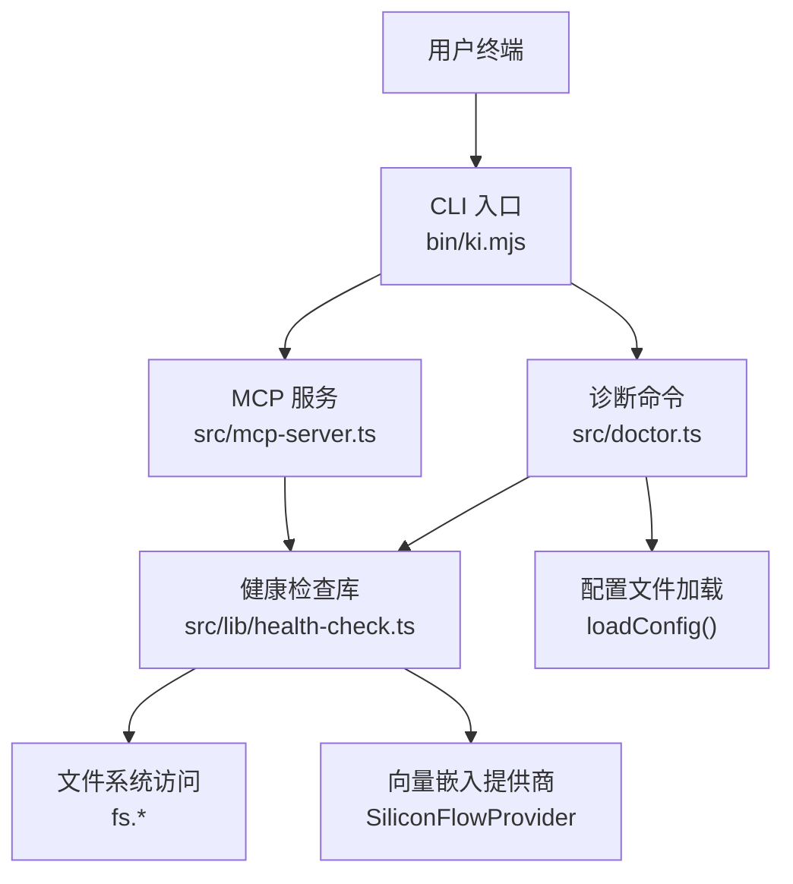
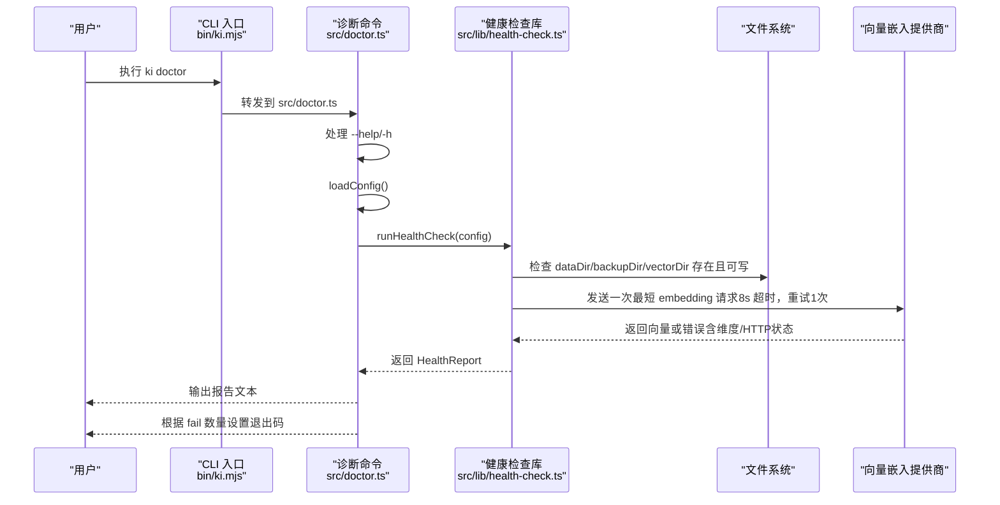
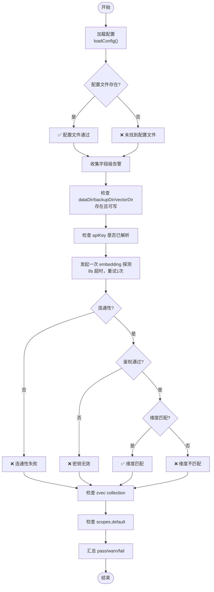
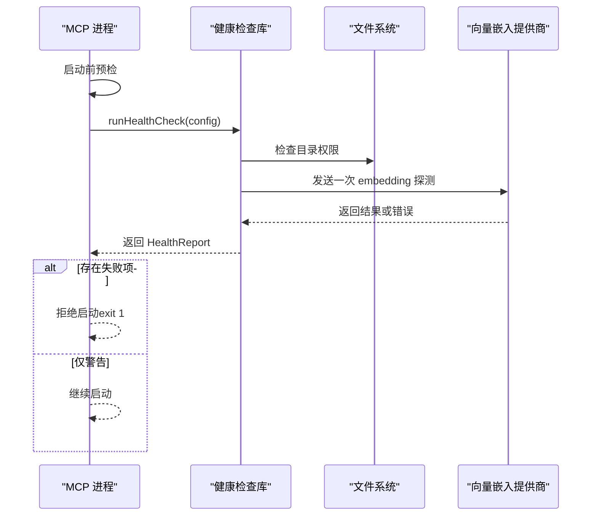
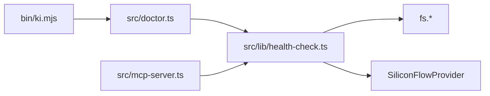

# 健康检查

<cite>
**本文引用的文件**
- [src/doctor.ts](file://src/doctor.ts)
- [src/lib/health-check.ts](file://src/lib/health-check.ts)
- [bin/ki.mjs](file://bin/ki.mjs)
- [src/mcp-server.ts](file://src/mcp-server.ts)
- [docs/cli.md](file://docs/cli.md)
</cite>

## 目录
1. [简介](#简介)
2. [项目结构](#项目结构)
3. [核心组件](#核心组件)
4. [架构总览](#架构总览)
5. [详细组件分析](#详细组件分析)
6. [依赖关系分析](#依赖关系分析)
7. [性能与超时特性](#性能与超时特性)
8. [故障排查指南](#故障排查指南)
9. [结论](#结论)
10. [附录：手动检查各组件状态](#附录手动检查各组件状态)

## 简介
本文件面向使用者与维护者，系统化说明 ki 提供的“健康检查”能力，重点覆盖以下目标：
- 解释 ki doctor 命令的功能、用法与输出含义
- 逐项说明健康检查内容：API 密钥验证、网络连接测试、向量维度检查、目录权限验证等
- 给出正常与异常输出的示例说明
- 说明如何在 MCP 启动前自动执行健康检查
- 提供常见失败原因分析与解决步骤
- 提供手动检查各组件状态的方法

## 项目结构
健康检查由 CLI 入口、诊断命令实现、共享检查逻辑与 MCP 启动预检共同构成：
- 命令行入口：bin/ki.mjs 将子命令分发到具体脚本（包含 doctor）
- 诊断命令：src/doctor.ts 负责加载配置并调用健康检查，渲染报告并设置退出码
- 共享检查逻辑：src/lib/health-check.ts 提供 runHealthCheck、renderHealthReport 等只读检查能力
- MCP 启动预检：src/mcp-server.ts 在启动前复用同一套检查逻辑，失败则拒绝启动

图表来源
- [bin/ki.mjs:28-49](file://bin/ki.mjs#L28-L49)
- [src/doctor.ts:15-17](file://src/doctor.ts#L15-L17)
- [src/lib/health-check.ts:17-20](file://src/lib/health-check.ts#L17-L20)
- [src/mcp-server.ts:660-678](file://src/mcp-server.ts#L660-L678)

章节来源
- [bin/ki.mjs:28-49](file://bin/ki.mjs#L28-L49)
- [src/doctor.ts:1-57](file://src/doctor.ts#L1-L57)
- [src/lib/health-check.ts:1-261](file://src/lib/health-check.ts#L1-L261)
- [src/mcp-server.ts:660-678](file://src/mcp-server.ts#L660-L678)

## 核心组件
- 健康检查库（src/lib/health-check.ts）
  - 提供 runHealthCheck(config) 返回结构化 HealthReport（含 items/pass/warn/fail）
  - 提供 renderHealthReport(report) 生成人类可读的多行文本
  - 纯只读：不修改任何配置或数据
- 诊断命令（src/doctor.ts）
  - 解析 --help/-h 后直接退出
  - 加载配置并执行健康检查，打印报告
  - 存在失败项时退出码为 1，否则为 0
- CLI 入口（bin/ki.mjs）
  - 维护命令映射，将 doctor 路由到 src/doctor.ts
  - 支持全局 --config 参数传递
- MCP 启动预检（src/mcp-server.ts）
  - 启动前执行同样的健康检查，报告写入 stderr
  - 存在失败项拒绝启动；仅警告时继续启动

章节来源
- [src/lib/health-check.ts:22-35](file://src/lib/health-check.ts#L22-L35)
- [src/lib/health-check.ts:150-240](file://src/lib/health-check.ts#L150-L240)
- [src/lib/health-check.ts:247-260](file://src/lib/health-check.ts#L247-L260)
- [src/doctor.ts:18-52](file://src/doctor.ts#L18-L52)
- [bin/ki.mjs:28-49](file://bin/ki.mjs#L28-L49)
- [src/mcp-server.ts:660-678](file://src/mcp-server.ts#L660-L678)

## 架构总览
健康检查的调用链路与职责边界如下：

图表来源
- [bin/ki.mjs:28-49](file://bin/ki.mjs#L28-L49)
- [src/doctor.ts:18-52](file://src/doctor.ts#L18-L52)
- [src/lib/health-check.ts:150-240](file://src/lib/health-check.ts#L150-L240)
- [src/lib/health-check.ts:54-144](file://src/lib/health-check.ts#L54-L144)

## 详细组件分析

### 健康检查项详解
健康检查涵盖约 10 项关键内容，覆盖配置、目录、密钥、网络与向量维度等：

- 配置文件
  - 判定：是否成功加载配置文件（_configPath）
  - 说明：加载成功即代表语法与字段校验已通过
- 配置字段
  - 判定：是否存在废弃字段或 null scope 条目等告警
  - 说明：以 ⚠️ 警告形式提示，不阻断运行
- 目录权限（dataDir / backupDir / vectorDir）
  - 判定：目录存在且可写
  - 说明：不存在或无写权限均标记失败
- API 密钥（apiKey）
  - 判定：embedding.apiKey 是否已解析出有效值（明文或 ${VAR}）
  - 说明：不做隐式环境变量回退
- 连通性 / 密钥有效性 / 向量维度（三合一）
  - 判定：通过一次最短 embedding 请求（timeoutMs=8000, retries=1）综合判断
  - 说明：
    - 连通性：URL 可达
    - 密钥有效性：鉴权通过
    - 维度匹配：实际维度与配置一致
- zvec collection
  - 判定：vectorDir 非空视为已创建
  - 说明：首次使用未创建为 ⚠️ 警告（执行 ki store 后自动创建），避免锁冲突不 open
- scopes.default
  - 判定：是否显式配置 default scope
  - 说明：未配置为 ⚠️ 警告

章节来源
- [src/lib/health-check.ts:150-240](file://src/lib/health-check.ts#L150-L240)
- [docs/cli.md:1235-1251](file://docs/cli.md#L1235-L1251)

### 健康检查流程（算法流程图）

图表来源
- [src/lib/health-check.ts:54-144](file://src/lib/health-check.ts#L54-L144)
- [src/lib/health-check.ts:150-240](file://src/lib/health-check.ts#L150-L240)

### MCP 启动预检时序

图表来源
- [src/mcp-server.ts:660-678](file://src/mcp-server.ts#L660-L678)
- [src/lib/health-check.ts:150-240](file://src/lib/health-check.ts#L150-L240)

## 依赖关系分析
- 命令路由依赖
  - bin/ki.mjs 维护 COMMANDS 映射，将 doctor 指向 src/doctor.ts
- 诊断命令依赖
  - src/doctor.ts 依赖 loadConfig 与 health-check 模块
- 健康检查库依赖
  - 文件系统 fs.* 用于目录存在性与可写性检查
  - 向量嵌入 SiliconFlowProvider 用于连通性、鉴权与维度检查
- MCP 服务依赖
  - src/mcp-server.ts 在启动前复用 health-check 逻辑，确保环境就绪

图表来源
- [bin/ki.mjs:28-49](file://bin/ki.mjs#L28-L49)
- [src/doctor.ts:15-17](file://src/doctor.ts#L15-L17)
- [src/lib/health-check.ts:17-20](file://src/lib/health-check.ts#L17-L20)
- [src/mcp-server.ts:660-678](file://src/mcp-server.ts#L660-L678)

章节来源
- [bin/ki.mjs:28-49](file://bin/ki.mjs#L28-L49)
- [src/doctor.ts:15-17](file://src/doctor.ts#L15-L17)
- [src/lib/health-check.ts:17-20](file://src/lib/health-check.ts#L17-L20)
- [src/mcp-server.ts:660-678](file://src/mcp-server.ts#L660-L678)

## 性能与超时特性
- 网络探测
  - 单次最短文本 embedding 请求，超时 8 秒，最多重试 1 次
  - 容忍冷启动 DNS/TLS 握手与瞬时拥塞，避免常驻 MCP 被短暂抖动误判
- 文件操作
  - 目录检查使用同步接口，快速失败
  - zvec collection 仅做目录非空判定，避免打开文件导致锁冲突
- 退出码
  - 存在失败项时退出码为 1，便于 CI/脚本 gate
  - 仅警告时退出码为 0

章节来源
- [src/lib/health-check.ts:10-15](file://src/lib/health-check.ts#L10-L15)
- [src/lib/health-check.ts:92-144](file://src/lib/health-check.ts#L92-L144)
- [src/lib/health-check.ts:206-222](file://src/lib/health-check.ts#L206-L222)
- [src/doctor.ts:48-52](file://src/doctor.ts#L48-L52)

## 故障排查指南
以下为常见健康检查失败的原因与解决步骤：

- 配置文件问题
  - 现象：未找到配置文件或字段校验失败
  - 处理：执行 ki config init 重新生成配置；修正字段名/类型/取值；参考 docs/configuration.md
  - 依据：加载失败直接报错并退出码 1
- 目录权限问题
  - 现象：dataDir/backupDir/vectorDir 不存在或无写权限
  - 处理：创建目录并赋予写权限；确认路径正确
- API 密钥问题
  - 现象：未配置 embedding.apiKey 或鉴权失败（HTTP_401/403）
  - 处理：在配置中设置 apiKey（明文或 ${VAR_NAME} 引用）；核对密钥有效性
- 网络连接问题
  - 现象：TIMEOUT 或 NETWORK 错误
  - 处理：检查 baseURL 可达性、DNS 解析、代理与防火墙；必要时降低并发或增加网络稳定性
- 向量维度不匹配
  - 现象：实际维度与配置不一致
  - 处理：调整配置中的 dimension 与实际模型维度一致；或更换模型
- zvec collection 未创建
  - 现象：首次使用未创建 collection（⚠️ 警告）
  - 处理：执行 ki store 初始化向量库；后续不再警告
- scopes.default 未配置
  - 现象：未显式配置 default scope（⚠️ 警告）
  - 处理：在配置中添加 scopes.default；避免默认数据落盘位置不确定

章节来源
- [src/doctor.ts:35-52](file://src/doctor.ts#L35-L52)
- [src/lib/health-check.ts:54-144](file://src/lib/health-check.ts#L54-L144)
- [src/lib/health-check.ts:150-240](file://src/lib/health-check.ts#L150-L240)
- [docs/cli.md:1235-1251](file://docs/cli.md#L1235-L1251)

## 结论
ki 的健康检查提供了统一、只读、可量化的环境就绪验证能力。通过 ki doctor 可快速定位配置、目录、密钥、网络与向量维度等问题；MCP 启动预检复用同一逻辑，确保服务仅在环境健康时启动。结合文档与排查指南，可在部署与日常运维中高效保障系统稳定性。

## 附录：手动检查各组件状态
- 配置文件
  - 方法：查看 _configPath 是否已解析；若为空建议执行 ki config init
  - 参考：[src/lib/health-check.ts:155-163](file://src/lib/health-check.ts#L155-L163)
- 目录权限
  - 方法：ls -ld 检查 dataDir/backupDir/vectorDir 是否存在且可写
  - 参考：[src/lib/health-check.ts:37-48](file://src/lib/health-check.ts#L37-L48)
- API 密钥
  - 方法：确认 embedding.apiKey 已在配置中设置（明文或 ${VAR}）
  - 参考：[src/lib/health-check.ts:194-200](file://src/lib/health-check.ts#L194-L200)
- 网络连接与鉴权
  - 方法：使用 curl 或浏览器访问 baseURL/embeddings，观察响应与鉴权状态
  - 参考：[src/lib/health-check.ts:92-144](file://src/lib/health-check.ts#L92-L144)
- 向量维度
  - 方法：对比配置 dimension 与模型实际维度；可通过一次真实请求获取 actualDim
  - 参考：[src/lib/health-check.ts:92-144](file://src/lib/health-check.ts#L92-L144)
- zvec collection
  - 方法：检查 vectorDir 是否非空；首次使用执行 ki store
  - 参考：[src/lib/health-check.ts:206-222](file://src/lib/health-check.ts#L206-L222)
- scopes.default
  - 方法：确认配置中存在 scopes.default；缺失会触发警告
  - 参考：[src/lib/health-check.ts:224-233](file://src/lib/health-check.ts#L224-L233)