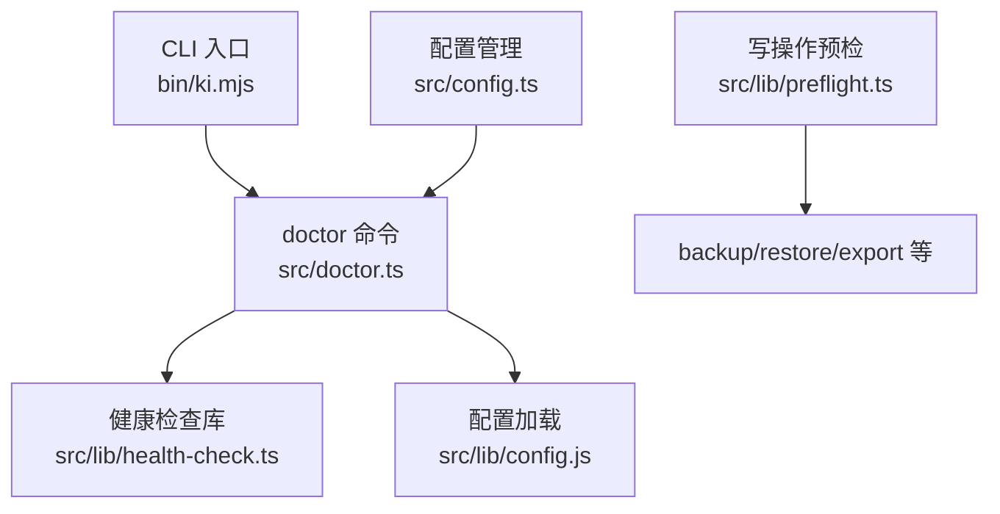
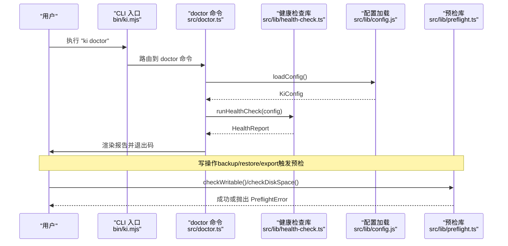
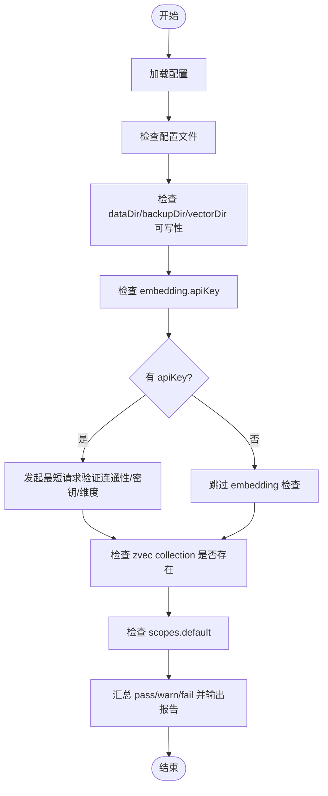
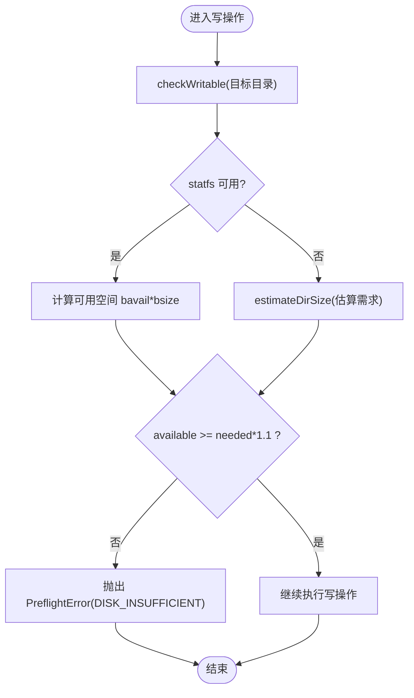
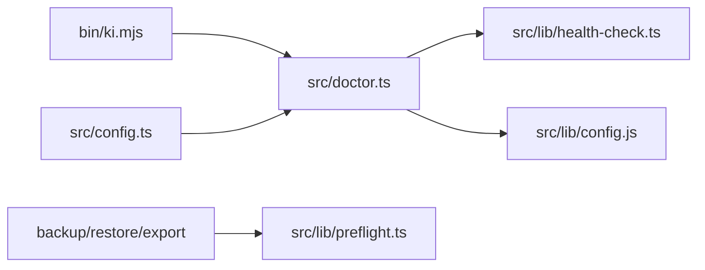

# 健康检查与诊断

<cite>
**本文引用的文件**
- [bin/ki.mjs](file://bin/ki.mjs)
- [src/doctor.ts](file://src/doctor.ts)
- [src/lib/health-check.ts](file://src/lib/health-check.ts)
- [src/lib/preflight.ts](file://src/lib/preflight.ts)
- [src/config.ts](file://src/config.ts)
- [docs/cli.md](file://docs/cli.md)
- [docs/error-handling.md](file://docs/error-handling.md)
</cite>

## 目录
1. [简介](#简介)
2. [项目结构](#项目结构)
3. [核心组件](#核心组件)
4. [架构总览](#架构总览)
5. [详细组件分析](#详细组件分析)
6. [依赖关系分析](#依赖关系分析)
7. [性能考虑](#性能考虑)
8. [故障排查指南](#故障排查指南)
9. [结论](#结论)
10. [附录](#附录)

## 简介
本指南面向使用 ki 工具的用户与运维人员，系统说明“健康检查与诊断”能力：通过 ki doctor 命令进行一键式环境检查（配置文件、目录权限、apiKey、embedding 连通性、向量维度、zvec collection、scopes.default），并结合预检机制（preflight）在写操作前保障磁盘空间与可写性。文档还涵盖常见问题定位、日志与调试技巧、自动化集成方案以及性能监控建议。

## 项目结构
健康检查与诊断由 CLI 入口、命令实现、健康检查库、预检库和配置管理共同组成：
- CLI 入口负责路由与参数解析，将 doctor 命令转发到具体实现。
- doctor 命令加载配置并执行健康检查，输出结构化报告。
- health-check 库提供只读检查逻辑，覆盖配置、目录、API、向量等关键项。
- preflight 库在备份/恢复/导出等写操作前进行可写性与磁盘空间预检。
- config 命令用于生成默认配置模板，便于快速初始化。

图表来源
- [bin/ki.mjs:28-49](file://bin/ki.mjs#L28-L49)
- [src/doctor.ts:15-48](file://src/doctor.ts#L15-L48)
- [src/lib/health-check.ts:148-213](file://src/lib/health-check.ts#L148-L213)
- [src/lib/preflight.ts:45-90](file://src/lib/preflight.ts#L45-L90)
- [src/config.ts:121-177](file://src/config.ts#L121-L177)

章节来源
- [bin/ki.mjs:28-49](file://bin/ki.mjs#L28-L49)
- [src/doctor.ts:15-48](file://src/doctor.ts#L15-L48)
- [src/lib/health-check.ts:148-213](file://src/lib/health-check.ts#L148-L213)
- [src/lib/preflight.ts:45-90](file://src/lib/preflight.ts#L45-L90)
- [src/config.ts:121-177](file://src/config.ts#L121-L177)

## 核心组件
- ki doctor 命令：加载配置并执行健康检查，输出带状态图标与统计的报告；失败项存在时退出码为 1，便于脚本 gate。
- 健康检查库：纯只读检查，包含配置文件、dataDir/backupDir/vectorDir 可写性、apiKey、embedding 三合一检查（URL 连通性、密钥有效性、维度匹配）、zvec collection 存在性、scopes.default 配置。
- 预检库：对目标目录进行可写探针与可用磁盘空间估算校验，避免写入中途失败产生半截产物。
- 配置管理：提供 init 子命令生成 YAML 模板，自动创建默认目录，便于快速初始化。

章节来源
- [src/doctor.ts:15-48](file://src/doctor.ts#L15-L48)
- [src/lib/health-check.ts:148-213](file://src/lib/health-check.ts#L148-L213)
- [src/lib/preflight.ts:45-90](file://src/lib/preflight.ts#L45-L90)
- [src/config.ts:121-177](file://src/config.ts#L121-L177)

## 架构总览
下图展示从 CLI 到健康检查与预检的调用链路与数据流：

图表来源
- [bin/ki.mjs:28-49](file://bin/ki.mjs#L28-L49)
- [src/doctor.ts:15-48](file://src/doctor.ts#L15-L48)
- [src/lib/health-check.ts:148-213](file://src/lib/health-check.ts#L148-L213)
- [src/lib/preflight.ts:45-90](file://src/lib/preflight.ts#L45-L90)

## 详细组件分析

### ki doctor 命令
- 功能：加载配置后执行健康检查，输出结构化报告；帮助模式直接打印使用说明并退出。
- 行为：若配置加载失败，输出错误并退出码 1；若有失败项，退出码 1，便于 CI gate。
- 用法：支持全局 --config 指定配置文件路径。

章节来源
- [src/doctor.ts:15-48](file://src/doctor.ts#L15-L48)
- [bin/ki.mjs:54-63](file://bin/ki.mjs#L54-L63)

### 健康检查项详解
- 配置文件：检测是否已加载有效配置；未找到时使用内置默认值并提示初始化。
- 目录可写性：检查 dataDir、backupDir、vectorDir 是否存在且可写。
- apiKey：仅读取 embedding.apiKey（明文或环境变量引用），缺失则标记失败。
- embedding 三合一检查：
  - URL 连通性：向 baseURL/embeddings 发起最短请求，超时 8s，重试 1 次。
  - 密钥有效性：根据 HTTP 状态码判断（如 401/403）。
  - 维度匹配：比较返回向量维度与配置的 dimension。
- zvec collection：通过 vectorDir 非空判定，首次使用会给出警告。
- scopes.default：检测是否已配置 default scope。

图表来源
- [src/lib/health-check.ts:148-213](file://src/lib/health-check.ts#L148-L213)
- [src/lib/health-check.ts:52-142](file://src/lib/health-check.ts#L52-L142)

章节来源
- [src/lib/health-check.ts:52-142](file://src/lib/health-check.ts#L52-L142)
- [src/lib/health-check.ts:148-213](file://src/lib/health-check.ts#L148-L213)

### 预检机制（preflight）
- 作用：在执行 backup/restore/export 等写操作前，确保目标目录可写且磁盘空间充足，避免写入中途失败产生半截产物。
- 可写性检查：对第一个已存在的祖先目录进行试写探针，失败抛出 DIR_NOT_WRITABLE。
- 磁盘空间检查：基于 statfs 计算可用空间，预留 10% 安全余量；不足抛出 DISK_INSUFFICIENT。
- 目录大小估算：递归统计目录占用字节数，用于备份前的空间预估。

图表来源
- [src/lib/preflight.ts:45-90](file://src/lib/preflight.ts#L45-L90)
- [src/lib/preflight.ts:96-116](file://src/lib/preflight.ts#L96-L116)

章节来源
- [src/lib/preflight.ts:45-90](file://src/lib/preflight.ts#L45-L90)
- [src/lib/preflight.ts:96-116](file://src/lib/preflight.ts#L96-L116)

### 配置管理与初始化
- 生成模板：ki config init 生成 YAML 配置文件到 $HOME/.ki/config.yaml，包含注释说明。
- 默认路径：dataDir、backupDir、vectorDir 默认位于 $HOME/.ki 下，init 时会尝试创建这些目录。
- 环境变量：KI_DATA_DIR 仅在 init 时生效以覆盖默认 dataDir；运行时不再作为配置来源。

章节来源
- [src/config.ts:38-56](file://src/config.ts#L38-L56)
- [src/config.ts:66-119](file://src/config.ts#L66-L119)
- [src/config.ts:121-177](file://src/config.ts#L121-L177)

## 依赖关系分析
- CLI 入口将 doctor 命令映射到 src/doctor.ts，并通过 jiti 执行 TypeScript 脚本。
- doctor 依赖配置加载与 health-check 库，health-check 依赖文件系统 API 与向量提供商（SiliconFlowProvider）。
- 预检库独立于健康检查，被写操作调用，提供可写性与磁盘空间保障。
- 配置管理提供 init 子命令，辅助初始化环境与目录。

图表来源
- [bin/ki.mjs:28-49](file://bin/ki.mjs#L28-L49)
- [src/doctor.ts:15-48](file://src/doctor.ts#L15-L48)
- [src/lib/health-check.ts:148-213](file://src/lib/health-check.ts#L148-L213)
- [src/lib/preflight.ts:45-90](file://src/lib/preflight.ts#L45-L90)
- [src/config.ts:121-177](file://src/config.ts#L121-L177)

章节来源
- [bin/ki.mjs:28-49](file://bin/ki.mjs#L28-L49)
- [src/doctor.ts:15-48](file://src/doctor.ts#L15-L48)
- [src/lib/health-check.ts:148-213](file://src/lib/health-check.ts#L148-L213)
- [src/lib/preflight.ts:45-90](file://src/lib/preflight.ts#L45-L90)
- [src/config.ts:121-177](file://src/config.ts#L121-L177)

## 性能考虑
- embedding 检查采用最短文本请求，超时 8s、重试 1 次，兼顾网络抖动容忍与上限控制，避免常驻 MCP 启动阻塞。
- 预检的空间检查利用 statfs 获取可用空间，并预留 10% 安全余量，减少 ENOSPC 风险。
- 目录大小估算递归统计，单文件失败忽略，保证估算鲁棒性。
- 建议在批量导入或高频搜索场景下关注 embedding 调用频率与超时设置，必要时调整并发与阈值。

章节来源
- [src/lib/health-check.ts:52-142](file://src/lib/health-check.ts#L52-L142)
- [src/lib/preflight.ts:67-90](file://src/lib/preflight.ts#L67-L90)
- [src/lib/preflight.ts:96-116](file://src/lib/preflight.ts#L96-L116)

## 故障排查指南

### 常见检查项含义与错误信息
- 配置文件：未找到时使用内置默认值，建议执行 ki config init。
- 目录可写性：不存在或无写权限会导致 fail；需检查路径与权限。
- apiKey：未配置 embedding.apiKey 会跳过 embedding 检查；需按模板配置或使用环境变量引用。
- embedding URL 连通性：网络不可达/DNS 解析失败/超时会导致 fail；检查 baseURL 与网络策略。
- 密钥有效性：HTTP_401/HTTP_403 表示密钥无效；核对密钥与权限。
- 维度匹配：实际维度与配置不一致；需统一 dimension 与模型配置。
- zvec collection：首次使用未创建属 warn；执行 store 后自动创建。
- scopes.default：未配置 default scope 属 warn；未传 --scope 时仍会使用 default。

章节来源
- [src/lib/health-check.ts:148-213](file://src/lib/health-check.ts#L148-L213)
- [src/lib/health-check.ts:52-142](file://src/lib/health-check.ts#L52-L142)

### 常见问题诊断与解决方案
- 磁盘空间不足：
  - 现象：预检抛出 DISK_INSUFFICIENT。
  - 处理：清理目标目录所在文件系统空间，或更换更大容量挂载点；重新执行写操作。
- 网络访问问题：
  - 现象：embedding URL 连通性失败（TIMEOUT/NETWORK）。
  - 处理：检查防火墙、代理、DNS；确认 baseURL 可达；必要时降低并发或增加超时。
- 权限配置错误：
  - 现象：目录无写权限（DIR_NOT_WRITABLE）。
  - 处理：修正目录权限或改用有写权限的路径；确认进程用户具备写入能力。
- 向量库损坏：
  - 现象：zvec collection 异常或无法打开。
  - 处理：优先使用备份恢复；必要时重建 collection 并重新导入数据。
- 密钥无效：
  - 现象：HTTP_401/HTTP_403。
  - 处理：核对 embedding.apiKey 是否正确；确认提供商授权与配额。

章节来源
- [src/lib/preflight.ts:45-90](file://src/lib/preflight.ts#L45-L90)
- [src/lib/health-check.ts:52-142](file://src/lib/health-check.ts#L52-L142)
- [docs/error-handling.md:1-153](file://docs/error-handling.md#L1-L153)

### 日志分析与调试技巧
- 使用 ki doctor 输出结构化报告，关注 fail/warn 项对应的 detail 字段。
- 对于 embedding 检查失败，结合网络与密钥信息进行分层定位（连通性→密钥→维度）。
- 写操作失败时，查看预检抛出的错误码与消息，快速定位权限或空间问题。
- 在 CI 中利用退出码 gate：doctor 失败时阻断后续流程，防止隐患扩散。

章节来源
- [src/doctor.ts:15-48](file://src/doctor.ts#L15-L48)
- [src/lib/health-check.ts:220-233](file://src/lib/health-check.ts#L220-L233)
- [src/lib/preflight.ts:45-90](file://src/lib/preflight.ts#L45-L90)

### 自动化健康检查集成方案
- 在部署流水线中加入 ki doctor 步骤，确保配置与环境就绪后再执行导入/搜索等操作。
- 将 doctor 结果纳入告警：fail > 0 时触发通知，warn > 0 时记录审计。
- 结合预检：在 backup/restore/export 前调用预检，失败即中止并上报原因。
- 定期巡检：定时任务执行 ki doctor，收集历史趋势，发现漂移问题。

章节来源
- [src/doctor.ts:15-48](file://src/doctor.ts#L15-L48)
- [src/lib/preflight.ts:45-90](file://src/lib/preflight.ts#L45-L90)

## 结论
ki doctor 提供了全面而轻量的一键健康检查能力，覆盖配置、目录、API、向量等关键维度；配合预检机制，可在写操作前规避权限与空间风险。通过结构化报告与退出码，便于自动化集成与故障快速定位。建议在生产环境中常态化运行健康检查与预检，建立告警与回滚策略，提升系统稳定性与可维护性。

## 附录
- CLI 参考：详见 docs/cli.md，了解各命令用法与参数语义。
- 错误处理：详见 docs/error-handling.md，掌握常见报错与恢复方式。
- 配置模板：使用 ki config init 生成 YAML 模板，按注释指引完成 embedding 与 scope 配置。

章节来源
- [docs/cli.md:1-800](file://docs/cli.md#L1-L800)
- [docs/error-handling.md:1-153](file://docs/error-handling.md#L1-L153)
- [src/config.ts:121-177](file://src/config.ts#L121-L177)