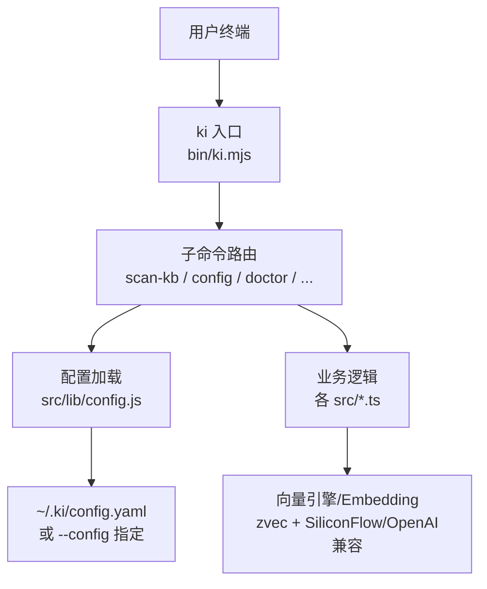
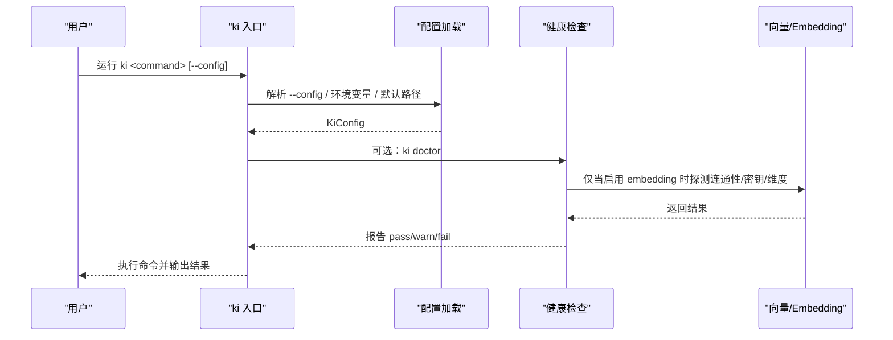
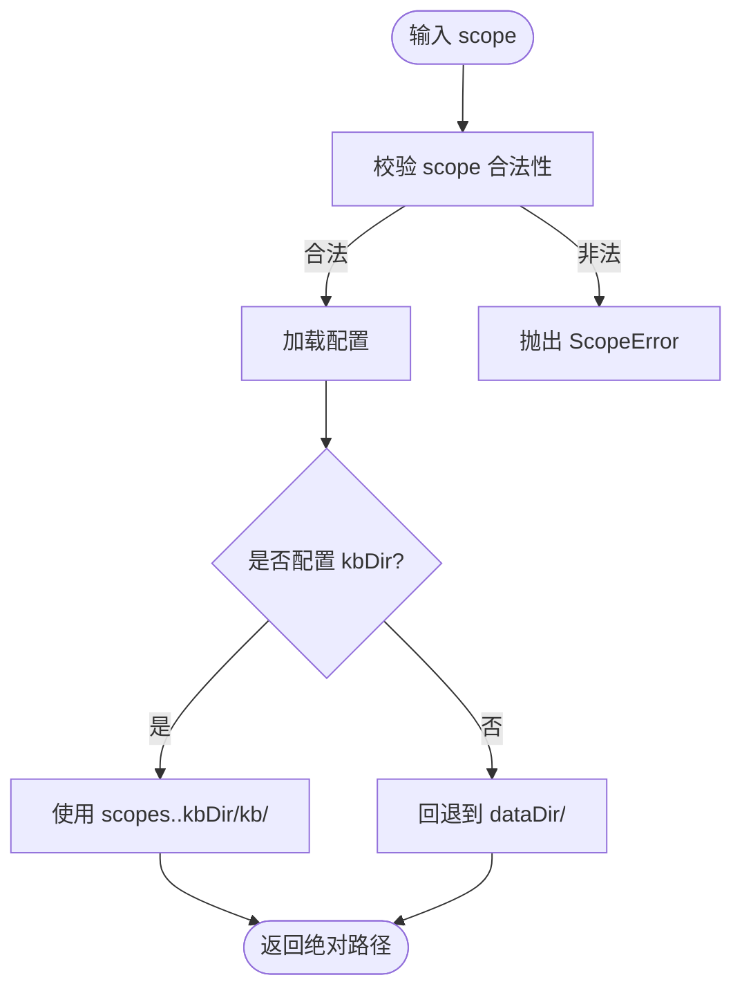
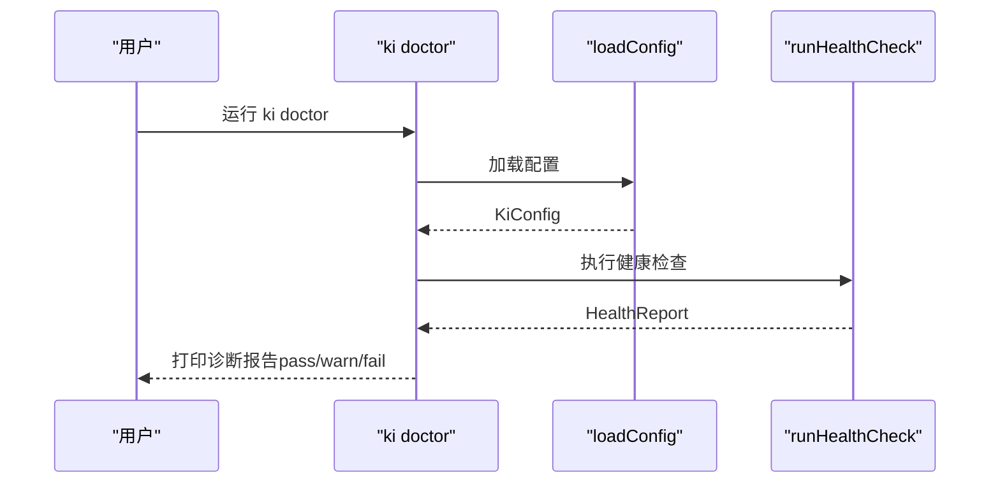
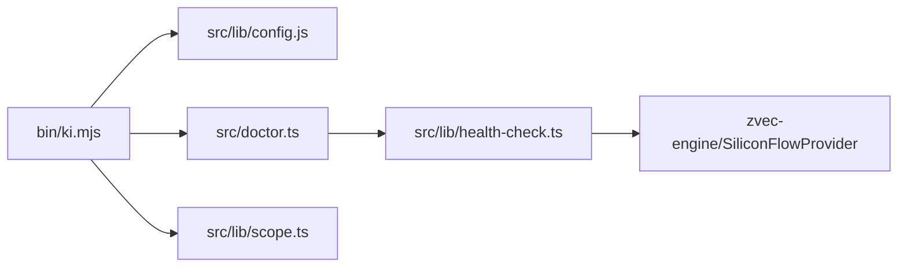

# 安装与配置

<cite>
**本文引用的文件**
- [package.json](file://package.json)
- [bin/ki.mjs](file://bin/ki.mjs)
- [scripts/install-latest.sh](file://scripts/install-latest.sh)
- [src/config.ts](file://src/config.ts)
- [docs/configuration.md](file://docs/configuration.md)
- [src/lib/config.js](file://src/lib/config.js)
- [src/lib/scope.ts](file://src/lib/scope.ts)
- [src/doctor.ts](file://src/doctor.ts)
- [src/lib/health-check.ts](file://src/lib/health-check.ts)
- [.e2e-run/ki-config.yaml](file://.e2e-run/ki-config.yaml)
</cite>

## 目录
1. [简介](#简介)
2. [项目结构](#项目结构)
3. [核心组件](#核心组件)
4. [架构总览](#架构总览)
5. [详细组件分析](#详细组件分析)
6. [依赖关系分析](#依赖关系分析)
7. [性能注意事项](#性能注意事项)
8. [故障排查指南](#故障排查指南)
9. [结论](#结论)
10. [附录](#附录)

## 简介
本指南面向首次使用者，提供 kisearch（命令名 ki）的安装、初始化与配置说明。内容涵盖：
- 环境要求（Node.js >= 18）
- 多种安装方式（一键安装、源码安装、npm link）
- 配置文件 ~/.ki/config.yaml 的选项详解（dataDir、backupDir、vectorDir、embedding 提供商配置、scopeMode 等）
- Scope 隔离机制的配置与使用
- 健康检查工具 ki doctor 的使用方法
- 常见配置问题与排错建议
- 实际配置示例与最佳实践

## 项目结构
kisearch 通过 CLI 入口分发命令，配置文件默认位于用户目录下的 .ki 目录中。CLI 支持 --config 指定配置文件路径，也支持环境变量 KI_CONFIG_PATH 覆盖。

图表来源
- [bin/ki.mjs:28-49](file://bin/ki.mjs#L28-L49)
- [docs/configuration.md:7-23](file://docs/configuration.md#L7-L23)

章节来源
- [bin/ki.mjs:28-49](file://bin/ki.mjs#L28-L49)
- [docs/configuration.md:7-23](file://docs/configuration.md#L7-L23)

## 核心组件
- 命令行入口：bin/ki.mjs，负责命令分发、--config 解析、版本和帮助输出
- 配置管理：src/config.ts（生成模板）、src/lib/config.js（加载与默认值）
- 健康诊断：src/doctor.ts + src/lib/health-check.ts（只读检查配置、目录、apiKey、embedding 连通性与维度、collection、scopes.default）
- Scope 隔离：src/lib/scope.ts（校验 scope、构造数据目录、枚举 scope）
- 文档与示例：docs/configuration.md（完整配置项说明与示例）

章节来源
- [bin/ki.mjs:28-49](file://bin/ki.mjs#L28-L49)
- [src/config.ts:1-204](file://src/config.ts#L1-L204)
- [src/doctor.ts:1-55](file://src/doctor.ts#L1-L55)
- [src/lib/health-check.ts:1-234](file://src/lib/health-check.ts#L1-L234)
- [src/lib/scope.ts:1-230](file://src/lib/scope.ts#L1-L230)
- [docs/configuration.md:1-252](file://docs/configuration.md#L1-L252)

## 架构总览
kisearch 的运行流程可概括为：读取配置 → 校验环境与依赖 → 执行具体命令（导入、检索、备份、MCP 服务等）。其中 embedding 与向量库是可选但常见的能力，需正确配置 baseURL、model、dimension、apiKey。

图表来源
- [bin/ki.mjs:54-63](file://bin/ki.mjs#L54-L63)
- [src/doctor.ts:18-48](file://src/doctor.ts#L18-L48)
- [src/lib/health-check.ts:148-213](file://src/lib/health-check.ts#L148-L213)

## 详细组件分析

### 环境要求
- Node.js >= 18（由包元信息声明）
- 网络访问（如需使用远程 embedding 服务）
- 磁盘空间（dataDir、backupDir、vectorDir 所在分区需有足够空间）

章节来源
- [package.json:60-62](file://package.json#L60-L62)

### 安装方式

#### 一键安装（推荐）
使用仓库提供的脚本自动检测并安装最新版本：
- 前置依赖：curl、jq（可选）
- 用法：
  - 自动安装：bash scripts/install-latest.sh
  - 本地模式安装：bash scripts/install-latest.sh --local
- 该脚本会查询 GitHub Releases，下载 tgz 并通过 npm install -g 安装

章节来源
- [scripts/install-latest.sh:1-205](file://scripts/install-latest.sh#L1-L205)

#### 源码安装
- 克隆仓库后在根目录执行 npm install
- 通过 npx jiti 直接运行 TypeScript 源文件（开发调试）
- 构建产物可通过 npm run build 生成

章节来源
- [package.json:9-32](file://package.json#L9-L32)

#### npm link（本地开发）
- 在仓库根目录执行 npm link 将 ki 链接到全局
- 在其他项目中可直接调用 ki 命令进行联调

章节来源
- [bin/ki.mjs:6-8](file://bin/ki.mjs#L6-L8)
- [package.json:6-8](file://package.json#L6-L8)

### 配置文件位置与优先级
配置文件按以下顺序查找（找到即用，后项不生效）：
1. --config <path> 命令行参数
2. 环境变量 KI_CONFIG_PATH
3. $HOME/.ki/config.yaml
4. $HOME/.ki/config.yml
5. $HOME/.ki/config.json
6. 内置默认值

提示：config.yaml 与 config.json 字段一致，可互相转换。

章节来源
- [docs/configuration.md:7-23](file://docs/configuration.md#L7-L23)

### 配置文件选项详解

#### dataDir
- 作用：KB 源数据目录，存放各 scope 的原始文档
- 类型：string
- 默认值：~/.ki/kb（无显式配置时）
- 说明：相对路径基于配置文件所在目录展开；运行时数据默认落用户目录，避免随安装位置漂移
- 与 scopes.<scope>.kbDir 的回退关系：未配置 kbDir 时回退到 dataDir/{scope}

章节来源
- [docs/configuration.md:43-50](file://docs/configuration.md#L43-L50)

#### backupDir
- 作用：备份目录，ki backup 等命令写入的位置
- 类型：string
- 默认值：~/.ki/backup

章节来源
- [docs/configuration.md:52-57](file://docs/configuration.md#L52-L57)

#### vectorDir
- 作用：zvec 向量库 collection 目录，存储向量数据与索引
- 类型：string
- 默认值：~/.ki/vector
- 注意：向量库 schema 创建后不可变更，增加字段需删除 vectorDir 重建，会丢失该 scope 全部向量数据并需重新导入

章节来源
- [docs/configuration.md:59-65](file://docs/configuration.md#L59-L65)

#### embedding（SiliconFlow / OpenAI 兼容接口）
- provider：siliconflow | openai-compatible（OpenAI 兼容客户端，实际提供商由 baseURL 决定）
- baseURL：API 端点（例如 https://api.siliconflow.cn/v1），决定实际对接的提供商
- model：模型名称（如 Qwen/Qwen3-Embedding-8B）
- dimension：向量维度（必须等于 collection.dimension，kisearch 固定 4096）
- apiKey：必填；支持明文 sk-xxx 或环境变量引用 ${VAR_NAME}；缺省时不做隐式 env 回退，fail-loud

安全建议：优先使用环境变量引用 ${VAR_NAME}，不要把密钥明文写入配置文件。

章节来源
- [docs/configuration.md:67-88](file://docs/configuration.md#L67-L88)
- [src/config.ts:88-100](file://src/config.ts#L88-L100)

#### scopeMode
- 作用：scope 护栏模式
- 取值：'default' | 'strict'
- 默认值：'default'
- 行为：
  - default：允许使用未在 scopes 显式注册的 scope（按需传入 scope 名即可）
  - strict：scopes 的 key 兼作 scope 白名单，必须显式传入已注册的 scope，否则报错

章节来源
- [docs/configuration.md:90-99](file://docs/configuration.md#L90-L99)
- [src/config.ts:101-104](file://src/config.ts#L101-L104)

#### scopes（scope → KB 目录映射）
- kbDir：KB 基础目录，程序自动拼接 kb/{scope} 子目录（不要带上 scope 名）；未配置时回退到 dataDir/{scope}
- wikiSync：Wiki 写回/回收站的源目录定位与开关
- clean：数据清洗配置（rules、hooks）
- import：导入配置（extensions、maxFileSize）

章节来源
- [docs/configuration.md:100-163](file://docs/configuration.md#L100-L163)

### Scope 隔离机制
Scope 用于隔离不同项目或团队的知识库。系统对 scope 参数进行严格校验，仅允许字母、数字、连字符、下划线，拒绝路径遍历字符。

- 校验规则：validateScope(scope)
- 数据目录构造：getKbDir(scope) 优先使用 scopes.<scope>.kbDir，否则回退到 dataDir/{scope}
- 列出已初始化 scope：listAllScopes()

图表来源
- [src/lib/scope.ts:26-53](file://src/lib/scope.ts#L26-L53)

章节来源
- [src/lib/scope.ts:26-53](file://src/lib/scope.ts#L26-L53)

### 健康检查工具 ki doctor
ki doctor 提供一键诊断，检查配置文件、目录可写性、apiKey、embedding 连通性与维度、zvec collection、scopes.default。只读，不修改任何配置或数据；有失败项时退出码为 1（便于脚本 gate）。

使用方法：
- ki doctor
- ki --config <path> doctor

诊断项包括：
- 配置文件存在且可解析
- dataDir、backupDir、vectorDir 存在且可写
- apiKey 是否配置
- embedding URL 连通性、密钥有效性、维度匹配
- zvec collection 是否已创建
- scopes.default 是否配置

图表来源
- [src/doctor.ts:18-48](file://src/doctor.ts#L18-L48)
- [src/lib/health-check.ts:148-213](file://src/lib/health-check.ts#L148-L213)

章节来源
- [src/doctor.ts:1-55](file://src/doctor.ts#L1-55)
- [src/lib/health-check.ts:1-234](file://src/lib/health-check.ts#L1-L234)

### 实际配置示例与最佳实践
- 首次使用：执行 ki config init 生成模板到 ~/.ki/config.yaml（支持 --dir 指定目录、--force 覆盖已有）
- 修改 dataDir、backupDir、vectorDir 指向独立目录，避免与源码目录混用
- embedding.apiKey 优先使用环境变量引用 ${VAR_NAME}，不要明文入库
- 若使用 OpenAI 兼容接口，确保 baseURL、model、dimension 与实际提供商一致
- 生产环境建议使用 scopeMode: strict，限制 scope 白名单
- 定期执行 ki doctor 验证配置与环境

章节来源
- [src/config.ts:121-177](file://src/config.ts#L121-L177)
- [docs/configuration.md:180-227](file://docs/configuration.md#L180-L227)
- [docs/configuration.md:231-243](file://docs/configuration.md#L231-L243)

## 依赖关系分析
- CLI 入口 bin/ki.mjs 负责命令分发与 --config 解析
- 配置加载 src/lib/config.js 提供 loadConfig、getVectorDir、getEmbeddingConfig 等能力
- 健康检查 src/lib/health-check.ts 依赖 SiliconFlowProvider 进行真实请求探测
- Scope 隔离 src/lib/scope.ts 依赖配置与文件系统

图表来源
- [bin/ki.mjs:28-49](file://bin/ki.mjs#L28-L49)
- [src/doctor.ts:15-17](file://src/doctor.ts#L15-L17)
- [src/lib/health-check.ts:15-18](file://src/lib/health-check.ts#L15-L18)
- [src/lib/scope.ts:7-9](file://src/lib/scope.ts#L7-L9)

章节来源
- [bin/ki.mjs:28-49](file://bin/ki.mjs#L28-L49)
- [src/lib/health-check.ts:15-18](file://src/lib/health-check.ts#L15-L18)
- [src/lib/scope.ts:7-9](file://src/lib/scope.ts#L7-L9)

## 性能注意事项
- vectorDir 的 schema 创建后不可变更，新增字段需重建 collection，会带来全量重导入成本
- embedding 请求超时与重试策略已在健康检查中内置（超时 8s，重试 1 次），避免常驻服务因瞬时抖动被误判
- 合理设置 maxFileSize 与 extensions 控制导入规模，避免大文件拖慢导入

章节来源
- [docs/configuration.md:59-65](file://docs/configuration.md#L59-L65)
- [src/lib/health-check.ts:8-12](file://src/lib/health-check.ts#L8-L12)
- [docs/configuration.md:155-163](file://docs/configuration.md#L155-L163)

## 故障排查指南
常见问题与处理建议：
- 未找到配置文件
  - 现象：ki doctor 提示未找到配置文件
  - 处理：执行 ki config init 生成模板，或通过 --config 指定路径
- 目录不存在或无写权限
  - 现象：dataDir/backupDir/vectorDir 检查失败
  - 处理：创建目录并确保当前用户有写权限
- embedding 连通性或密钥无效
  - 现象：URL 连通性/密钥有效性/维度匹配失败
  - 处理：检查 baseURL、model、dimension、apiKey；确认网络可达与凭据有效
- 维度不匹配
  - 现象：config 维度与实际维度不一致
  - 处理：调整 embedding.dimension 或重建 vectorDir 以匹配新维度
- scope 不合法
  - 现象：ScopeError 提示非法字符
  - 处理：仅使用字母、数字、连字符(-)、下划线(_)

章节来源
- [src/lib/health-check.ts:35-46](file://src/lib/health-check.ts#L35-L46)
- [src/lib/health-check.ts:52-142](file://src/lib/health-check.ts#L52-L142)
- [src/lib/scope.ts:26-43](file://src/lib/scope.ts#L26-L43)

## 结论
kisearch 提供了灵活的配置体系与健壮的初始化、诊断能力。通过合理的安装方式、清晰的配置文件组织与严格的 scope 隔离，可以在多项目或多团队场景下高效管理知识库。建议在部署前执行 ki doctor 完成环境自检，并在生产环境启用 strict 模式与安全的 apiKey 引用方式。

## 附录

### 快速开始清单
- 安装 Node.js >= 18
- 一键安装：bash scripts/install-latest.sh
- 生成配置：ki config init
- 编辑配置：~/.ki/config.yaml（设置 dataDir、backupDir、vectorDir、embedding、scopeMode、scopes）
- 健康检查：ki doctor
- 开始导入：根据需求执行 scan-kb import 等命令

章节来源
- [scripts/install-latest.sh:1-205](file://scripts/install-latest.sh#L1-L205)
- [src/config.ts:121-177](file://src/config.ts#L121-L177)
- [docs/configuration.md:180-227](file://docs/configuration.md#L180-L227)
- [src/doctor.ts:18-48](file://src/doctor.ts#L18-L48)

### 参考示例
- e2e 隔离配置示例（YAML 版）：.e2e-run/ki-config.yaml
- 完整配置示例与说明：docs/configuration.md

章节来源
- [.e2e-run/ki-config.yaml:1-18](file://.e2e-run/ki-config.yaml#L1-L18)
- [docs/configuration.md:180-227](file://docs/configuration.md#L180-L227)