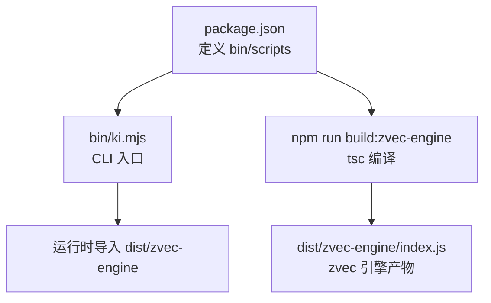
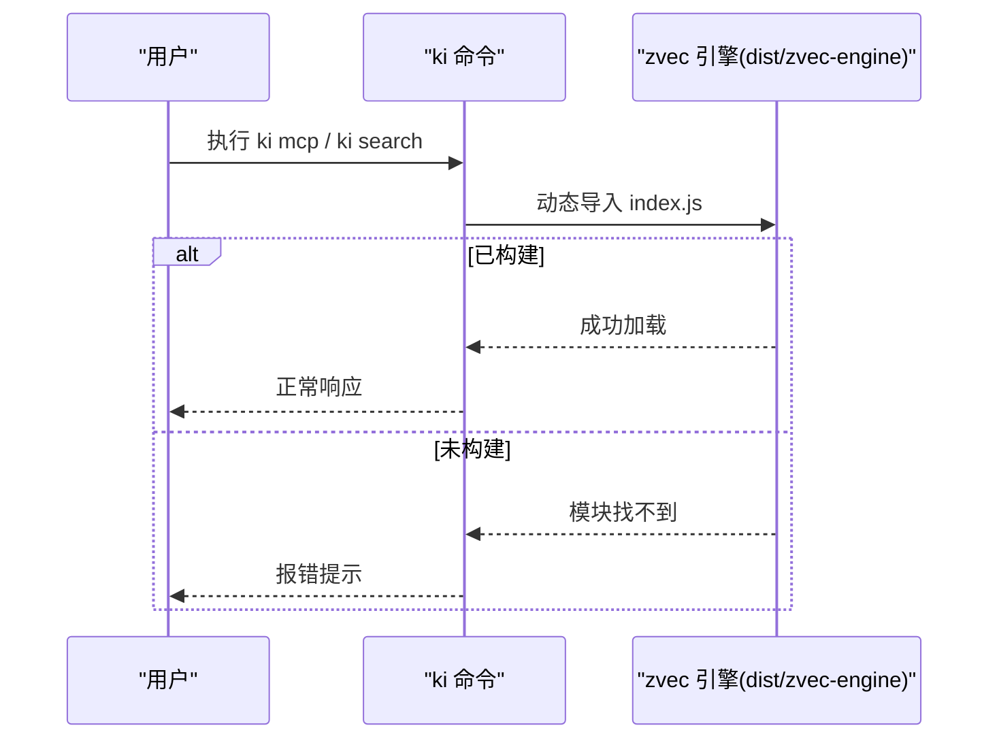
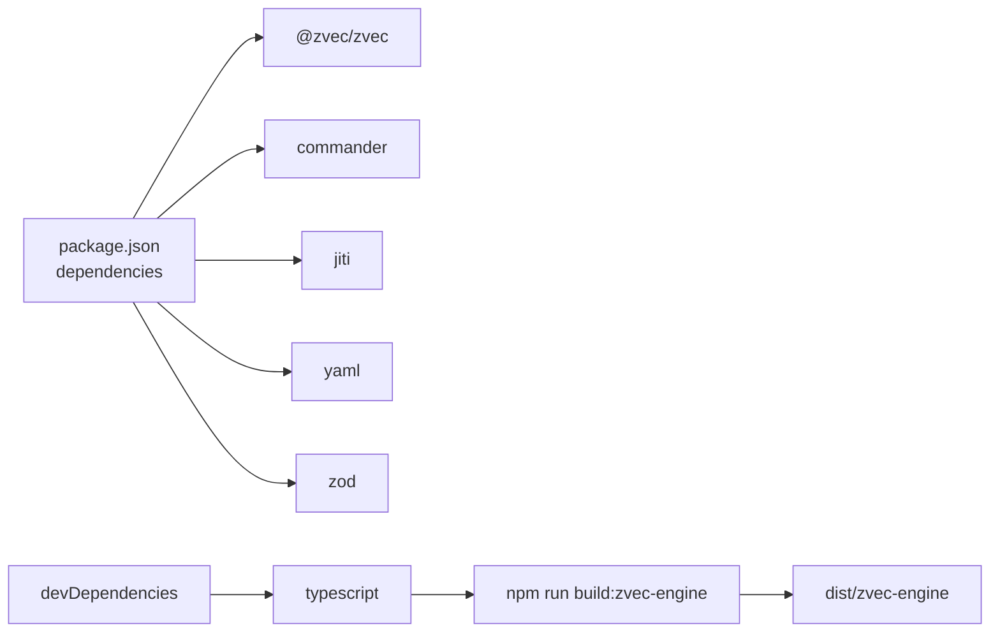

# 安装方式

<cite>
**本文引用的文件**
- [package.json](file://package.json)
- [README.md](file://README.md)
- [scripts/install-latest.sh](file://scripts/install-latest.sh)
- [tsconfig.src.json](file://tsconfig.src.json)
- [bin/ki.mjs](file://bin/ki.mjs)
- [test/e2e-guide.md](file://test/e2e-guide.md)
</cite>

## 目录
1. [简介](#简介)
2. [项目结构（与安装相关）](#项目结构与安装相关)
3. [核心组件（与安装相关）](#核心组件与安装相关)
4. [架构总览（安装与构建关系）](#架构总览安装与构建关系)
5. [详细安装方法](#详细安装方法)
6. [依赖分析](#依赖分析)
7. [性能注意事项](#性能注意事项)
8. [故障排查指南](#故障排查指南)
9. [结论](#结论)
10. [附录：验证步骤](#附录验证步骤)

## 简介
本章节面向首次接触本项目的用户，提供三种安装方式的完整说明：一键安装、源码安装、本地开发安装。重点解释 zvec 引擎构建的重要性以及不构建可能导致的错误，并提供安装后的验证方法与常见错误排查建议。

## 项目结构（与安装相关）
- 入口命令通过 package.json 的 bin 字段映射到 bin/ki.mjs，安装后可在终端直接执行 ki 命令。
- 构建脚本 npm run build:zvec-engine 使用 TypeScript 将 src/zvec-engine 编译输出到 dist/zvec-engine，供运行时导入。
- 一键安装脚本 scripts/install-latest.sh 自动获取最新版本并全局安装。
- README 提供了快速开始、初始化配置、MCP 启动等常用流程。

**图表来源**
- [package.json:6-32](file://package.json#L6-L32)
- [tsconfig.src.json:14-15](file://tsconfig.src.json#L14-L15)
- [README.md:107-118](file://README.md#L107-L118)

**章节来源**
- [package.json:6-32](file://package.json#L6-L32)
- [tsconfig.src.json:14-15](file://tsconfig.src.json#L14-L15)
- [README.md:107-118](file://README.md#L107-L118)

## 核心组件（与安装相关）
- CLI 命令：ki（由 package.json 的 bin 指向 bin/ki.mjs）。
- 构建脚本：build:zvec-engine（TypeScript 编译 zvec 引擎到 dist/zvec-engine）。
- 一键安装器：install-latest.sh（自动检测版本、下载并全局安装）。
- 文档与示例：README 中的快速开始与 MCP 启动流程。

**章节来源**
- [package.json:6-32](file://package.json#L6-L32)
- [scripts/install-latest.sh:127-159](file://scripts/install-latest.sh#L127-L159)
- [README.md:107-118](file://README.md#L107-L118)

## 架构总览（安装与构建关系）
安装完成后，ki 命令作为 CLI 入口；当运行涉及向量检索或 MCP 服务时，会尝试从 dist/zvec-engine 加载 zvec 引擎。因此，构建 zvec 引擎是确保功能可用的关键步骤。

**图表来源**
- [package.json:6-32](file://package.json#L6-L32)
- [tsconfig.src.json:14-15](file://tsconfig.src.json#L14-L15)
- [README.md:116-118](file://README.md#L116-L118)

## 详细安装方法

### 方法一：一键安装（curl 脚本）
适用场景：希望快速获得最新稳定版，无需维护源码。

步骤：
1. 确保系统已安装 curl（脚本会检查依赖）。
2. 执行一键安装脚本：
   - curl -fsSL https://raw.githubusercontent.com/HACK-WU/kisearch/master/scripts/install-latest.sh | bash
3. 安装完成后，验证 ki 命令可用：
   - ki --version
4. 如需更新到最新版本，可再次执行上述命令。

注意：
- 该脚本会自动查询最新版本并通过 npm 全局安装。
- 若网络受限或 GitHub API 不可用，脚本会尝试备用方法。

**章节来源**
- [scripts/install-latest.sh:30-39](file://scripts/install-latest.sh#L30-L39)
- [scripts/install-latest.sh:127-159](file://scripts/install-latest.sh#L127-L159)
- [README.md:107-118](file://README.md#L107-L118)

### 方法二：源码安装（git clone + npm install）
适用场景：需要参与开发、调试或自定义构建流程。

步骤：
1. 克隆仓库并进入目录：
   - git clone <仓库地址> && cd kisearch
2. 安装依赖：
   - npm install
3. 构建 zvec 引擎（必需）：
   - npm run build:zvec-engine
4. 链接全局命令（可选，便于在任何目录使用 ki）：
   - npm link
5. 验证 ki 命令可用：
   - ki --version

说明：
- 构建 zvec 引擎会将 src/zvec-engine 编译为 dist/zvec-engine，供运行时导入。
- 若不执行构建，后续运行 ki mcp 或搜索等功能时会报“找不到模块”的错误。

**章节来源**
- [README.md:107-118](file://README.md#L107-L118)
- [package.json:15-32](file://package.json#L15-L32)
- [tsconfig.src.json:14-15](file://tsconfig.src.json#L14-L15)

### 方法三：本地开发安装
适用场景：开发者需要在本地调试、运行测试或修改代码后即时验证。

步骤：
1. 克隆仓库并进入目录：
   - git clone <仓库地址> && cd kisearch
2. 安装依赖：
   - npm install
3. 构建 zvec 引擎：
   - npm run build:zvec-engine
4. 直接通过 Node 执行 CLI（无需全局安装）：
   - node bin/ki.mjs --help
5. 运行测试（可选）：
   - npm test
   - npm run test:zvec-engine
   - npm run test:all

说明：
- 本地开发可直接通过 bin/ki.mjs 调用命令，适合调试和集成测试。
- 构建 zvec 引擎是运行测试和功能的必要前提。

**章节来源**
- [test/e2e-guide.md:35-40](file://test/e2e-guide.md#L35-L40)
- [package.json:15-32](file://package.json#L15-L32)
- [README.md:396-405](file://README.md#L396-L405)

## 依赖分析
- 运行时依赖：@zvec/zvec（向量引擎）、commander（命令行解析）、jiti（TypeScript 直跑）、yaml、zod（配置校验）。
- 构建依赖：typescript（用于编译 zvec 引擎）。
- 引擎构建输出：dist/zvec-engine（由 tsconfig.src.json 指定输出目录）。

**图表来源**
- [package.json:42-66](file://package.json#L42-L66)
- [tsconfig.src.json:14-15](file://tsconfig.src.json#L14-L15)

**章节来源**
- [package.json:42-66](file://package.json#L42-L66)
- [tsconfig.src.json:14-15](file://tsconfig.src.json#L14-L15)

## 性能注意事项
- 构建 zvec 引擎仅在执行 npm run build:zvec-engine 时进行，属于一次性操作。
- 运行时依赖 @zvec/zvec 包含预编译二进制，安装过程可能因平台而异，如遇网络问题可更换镜像源。
- 首次启动 MCP 或服务时，zvec 引擎会进行必要的初始化，后续请求延迟较低。

[本节为通用指导，不直接分析具体文件]

## 故障排查指南

### 常见问题与解决方案
1. 错误：Cannot find module ../../dist/zvec-engine/index.js
   - 原因：未执行 npm run build:zvec-engine。
   - 解决：在项目根目录执行 npm run build:zvec-engine。
   - 参考路径：[README.md:116-118](file://README.md#L116-L118)

2. 错误：ki 命令不存在
   - 原因：未正确安装或未加入 PATH。
   - 解决：
     - 一键安装：重新执行安装脚本。
     - 源码安装：执行 npm link 或使用 node bin/ki.mjs。
   - 参考路径：[scripts/install-latest.sh:127-159](file://scripts/install-latest.sh#L127-L159)

3. 错误：Node 版本过低
   - 原因：要求 Node >= 18。
   - 解决：升级 Node 至 18 或以上版本。
   - 参考路径：[package.json:60-62](file://package.json#L60-L62)

4. 错误：npm install 失败
   - 原因：网络问题或权限不足。
   - 解决：
     - 更换 npm 镜像源。
     - 使用 sudo 或以管理员身份运行（谨慎）。
   - 参考路径：[package.json:42-66](file://package.json#L42-L66)

5. 错误：MCP 启动失败
   - 原因：zvec 引擎未构建或配置错误。
   - 解决：
     - 执行 npm run build:zvec-engine。
     - 检查配置文件和数据目录权限。
   - 参考路径：[README.md:107-118](file://README.md#L107-L118)

**章节来源**
- [README.md:116-118](file://README.md#L116-L118)
- [scripts/install-latest.sh:127-159](file://scripts/install-latest.sh#L127-L159)
- [package.json:60-62](file://package.json#L60-L62)

## 结论
- 一键安装适合快速体验和生产部署。
- 源码安装适合开发和定制需求。
- 本地开发安装便于调试和测试。
- 无论哪种方式，构建 zvec 引擎都是关键步骤，缺失会导致运行时模块加载失败。
- 安装后应验证 ki 命令可用性并进行基本功能测试，确保环境正确。

[本节为总结性内容，不直接分析具体文件]

## 附录：验证步骤

### 验证 ki 命令可用性
- 一键安装后：
  - ki --version
- 源码安装后：
  - ki --version 或 node bin/ki.mjs --version

### 基本功能测试
- 初始化配置：
  - ki config init
- 健康检查：
  - ki doctor
- 导入知识库（示例）：
  - ki scan-kb import --scope my-project --source /path/to/wiki --group Wiki
- 语义检索（示例）：
  - ki search --scope my-project --query "用户登录流程"

参考路径：
- [README.md:121-167](file://README.md#L121-L167)
- [test/e2e-guide.md:35-40](file://test/e2e-guide.md#L35-L40)

**章节来源**
- [README.md:121-167](file://README.md#L121-L167)
- [test/e2e-guide.md:35-40](file://test/e2e-guide.md#L35-L40)