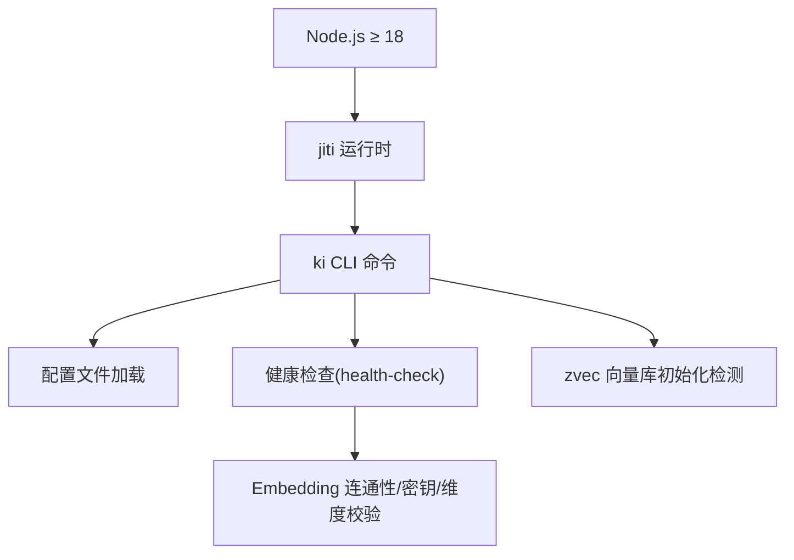
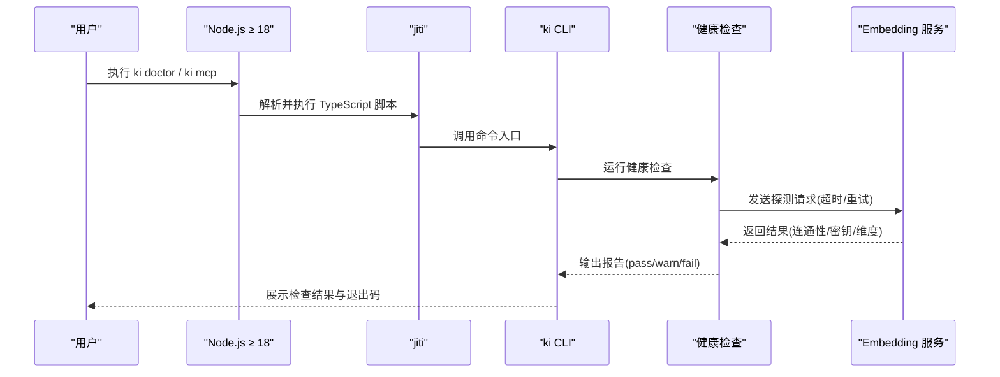
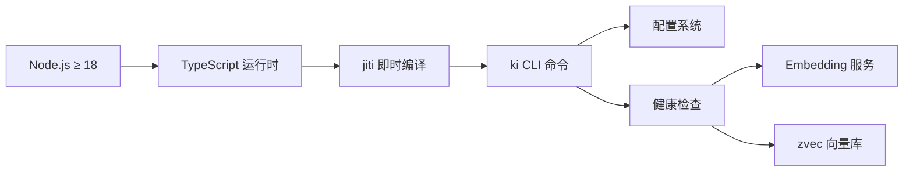

# 环境准备

<cite>
**本文引用的文件**
- [package.json](file://package.json)
- [README.md](file://README.md)
- [scripts/install-latest.sh](file://scripts/install-latest.sh)
- [src/doctor.ts](file://src/doctor.ts)
- [src/lib/health-check.ts](file://src/lib/health-check.ts)
- [docs/cli.md](file://docs/cli.md)
- [src/config.ts](file://src/config.ts)
- [test/e2e/scan-kb-cli.e2e.network.mjs](file://test/e2e/scan-kb-cli.e2e.network.mjs)
- [test/e2e/step-c-cli.e2e.network.mjs](file://test/e2e/step-c-cli.e2e.network.mjs)
</cite>

## 目录
1. [简介](#简介)
2. [项目结构与环境依赖总览](#项目结构与环境依赖总览)
3. [核心组件与职责](#核心组件与职责)
4. [架构概览](#架构概览)
5. [详细组件分析](#详细组件分析)
6. [依赖关系分析](#依赖关系分析)
7. [性能注意事项](#性能注意事项)
8. [故障排查指南](#故障排查指南)
9. [结论](#结论)
10. [附录：安装与验证命令速查](#附录安装与验证命令速查)

## 简介
本章节面向首次接触本项目的用户，说明如何准备运行环境，确保 Node.js、npm、环境变量等满足要求，并给出跨平台安装指引与常见问题解决方案。本项目通过 jiti 直接执行 TypeScript 源码，无需编译；同时声明了最低 Node.js 版本要求，以保障运行时特性与依赖兼容。

## 项目结构与环境依赖总览
- 最低 Node.js 版本：≥ 18（由包元数据声明）
- 使用 jiti 直接运行 TypeScript 脚本，避免额外构建步骤
- 向量嵌入服务默认对接 SiliconFlow，需配置 API Key
- 提供一键诊断工具 ki doctor，用于检查配置、目录、API Key、连通性与维度匹配



图表来源
- [package.json:60-62](file://package.json#L60-L62)
- [README.md:101-102](file://README.md#L101-L102)
- [src/lib/health-check.ts:1-15](file://src/lib/health-check.ts#L1-L15)

章节来源
- [package.json:1-68](file://package.json#L1-L68)
- [README.md:101-126](file://README.md#L101-L126)

## 核心组件与职责
- Node.js 运行时：提供 ES Modules、现代 JS 特性支持，满足 jiti 与依赖的最低版本要求
- jiti 运行时：直接执行 TypeScript 源文件，简化开发体验
- 配置系统：YAML/JSON 配置加载、字段校验、路径展开、环境变量注入
- 健康检查：统一检查配置文件、目录可写性、API Key、Embedding 连通性、向量维度、zvec 集合状态
- 安装脚本：自动获取最新版本并安装，辅助快速部署

章节来源
- [package.json:9-32](file://package.json#L9-L32)
- [src/lib/health-check.ts:1-35](file://src/lib/health-check.ts#L1-L35)
- [scripts/install-latest.sh:1-205](file://scripts/install-latest.sh#L1-L205)

## 架构概览
下图展示了从 Node.js 启动到环境检查的关键流程，包括 jiti 执行、配置加载与健康检查。



图表来源
- [src/doctor.ts:1-33](file://src/doctor.ts#L1-L33)
- [src/lib/health-check.ts:1-35](file://src/lib/health-check.ts#L1-L35)
- [docs/cli.md:1235-1251](file://docs/cli.md#L1235-L1251)

## 详细组件分析

### Node.js 与 jiti 运行时
- 最低版本要求：Node.js ≥ 18（在包元数据中声明）
- 原因说明：
  - 项目使用 ES Modules（type: module），需要现代 Node.js 支持
  - jiti 作为 TypeScript 即时编译器，依赖较新的 Node.js 特性
  - 部分依赖（如 TypeScript 类型定义）对 Node.js 有最低版本要求
- 验证方法：
  - 运行 `node --version` 确认版本 ≥ 18
  - 运行 `npm --version` 确认 npm 可用（通常随 Node.js 安装）

章节来源
- [package.json:5,60-62](file://package.json#L5,L60-L62)
- [README.md:101-102](file://README.md#L101-L102)

### 配置系统与 API Key 管理
- 配置文件位置：`~/.ki/config.yaml`（可通过 `ki config init` 生成）
- API Key 配置方式：
  - 明文写入：`embedding.apiKey: sk-xxx`
  - 环境变量引用：`embedding.apiKey: ${SILICONFLOW_API_KEY}`
- 重要约束：
  - 不做隐式环境变量回退，必须显式配置 `apiKey`
  - 若使用 `SILICONFLOW_API_KEY`，需在配置中明确引用该变量名
- 环境变量设置：
  - Linux/macOS：`export SILICONFLOW_API_KEY="your-api-key"`
  - Windows (CMD)：`set SILICONFLOW_API_KEY=your-api-key`
  - Windows (PowerShell)：`$env:SILICONFLOW_API_KEY="your-api-key"`

章节来源
- [src/config.ts:88-104](file://src/config.ts#L88-L104)
- [docs/cli.md:1166-1214](file://docs/cli.md#L1166-L1214)

### 健康检查与诊断
- 诊断命令：`ki doctor`
- 检查项包括：
  - 配置文件加载成功
  - 目录可写性（dataDir/backupDir/vectorDir）
  - API Key 有效性
  - Embedding 服务连通性、密钥有效性、向量维度匹配
  - zvec 集合初始化状态
  - scopes.default 配置
- 退出码：存在失败项时返回 1，否则返回 0

章节来源
- [src/doctor.ts:1-33](file://src/doctor.ts#L1-L33)
- [docs/cli.md:1235-1251](file://docs/cli.md#L1235-L1251)

### 安装与部署
- 一键安装：`curl -fsSL https://raw.githubusercontent.com/HACK-WU/kisearch/master/scripts/install-latest.sh | bash`
- 源码安装：`git clone` + `npm install` + `npm link`
- 构建 zvec 引擎：`npm run build:zvec-engine`（必需，否则 MCP 启动时报模块找不到错误）

章节来源
- [README.md:107-119](file://README.md#L107-L119)
- [scripts/install-latest.sh:1-205](file://scripts/install-latest.sh#L1-L205)

## 依赖关系分析


图表来源
- [package.json:42-49](file://package.json#L42-L49)
- [src/lib/health-check.ts:17-21](file://src/lib/health-check.ts#L17-L21)

章节来源
- [package.json:42-49](file://package.json#L42-L49)

## 性能注意事项
- 健康检查包含网络请求，默认超时 8 秒，重试 1 次，避免长时间阻塞
- 磁盘空间预检会估算所需空间并预留 10% 安全余量
- 向量维度必须与建库时一致，否则会导致检索异常

[本节为通用指导，不直接分析具体文件]

## 故障排查指南
常见环境问题及解决方案：

### Node.js 版本过低
- 症状：运行时报语法错误或模块加载失败
- 解决：升级到 Node.js ≥ 18

### API Key 未配置或无效
- 症状：`ki doctor` 显示 embedding 连通性失败
- 解决：检查 `~/.ki/config.yaml` 中的 `embedding.apiKey` 配置

### 目录权限问题
- 症状：写入操作报权限错误
- 解决：确保 dataDir/backupDir/vectorDir 具有写权限

### zvec 引擎未构建
- 症状：MCP 启动时报找不到模块错误
- 解决：执行 `npm run build:zvec-engine`

章节来源
- [src/lib/preflight.ts:45-59](file://src/lib/preflight.ts#L45-L59)
- [README.md:116-118](file://README.md#L116-L118)

## 结论
通过正确配置 Node.js 环境、设置 API Key、完成健康检查，用户可以顺利运行 kisearch 项目。建议使用 `ki doctor` 进行环境验证，确保所有依赖和配置都正确无误。

[本节为总结性内容，不直接分析具体文件]

## 附录：安装与验证命令速查

### 环境验证命令
```bash
# 检查 Node.js 版本
node --version
# 预期输出：v18.x.x 或更高版本

# 检查 npm 版本
npm --version
# 预期输出：版本号

# 检查 ki 是否已安装
ki --version
# 预期输出：kisearch 版本号

# 运行健康检查
ki doctor
# 预期输出：各项检查的 pass/warn/fail 状态
```

### 环境变量设置示例
```bash
# Linux/macOS
export SILICONFLOW_API_KEY="sk-your-api-key-here"

# Windows CMD
set SILICONFLOW_API_KEY=sk-your-api-key-here

# Windows PowerShell
$env:SILICONFLOW_API_KEY="sk-your-api-key-here"
```

### 快速开始
```bash
# 一键安装
curl -fsSL https://raw.githubusercontent.com/HACK-WU/kisearch/master/scripts/install-latest.sh | bash

# 初始化配置
ki config init

# 运行诊断
ki doctor
```

章节来源
- [README.md:107-126](file://README.md#L107-L126)
- [docs/cli.md:1235-1251](file://docs/cli.md#L1235-L1251)