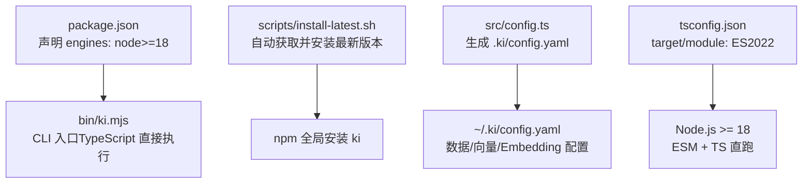
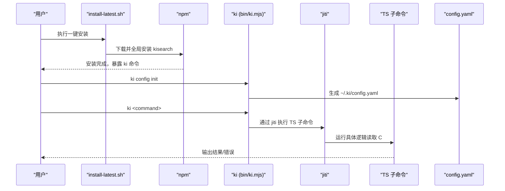
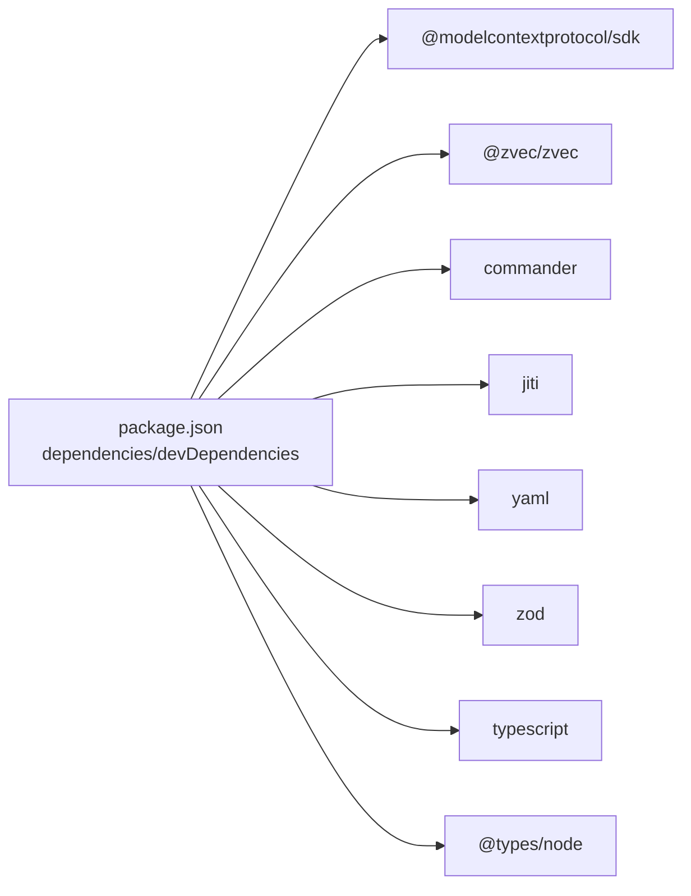

# 环境要求与安装

<cite>
**本文引用的文件**
- [package.json](file://package.json)
- [scripts/install-latest.sh](file://scripts/install-latest.sh)
- [bin/ki.mjs](file://bin/ki.mjs)
- [README.md](file://README.md)
- [src/config.ts](file://src/config.ts)
- [tsconfig.json](file://tsconfig.json)
</cite>

## 目录
1. [简介](#简介)
2. [项目结构](#项目结构)
3. [核心组件](#核心组件)
4. [架构总览](#架构总览)
5. [详细组件分析](#详细组件分析)
6. [依赖分析](#依赖分析)
7. [性能考虑](#性能考虑)
8. [故障排除指南](#故障排除指南)
9. [结论](#结论)
10. [附录](#附录)

## 简介
本指南聚焦于 kisearch（CLI 命令：ki）的环境要求与安装方法，覆盖 Node.js 最低版本要求、三种安装方式（一键脚本、npm 全局安装、源码安装与开发模式）、环境变量与 PATH 配置、跨平台兼容性、安装验证步骤以及常见问题的排查。kisearch 通过 TypeScript 直接执行（jiti 运行时），无需编译即可运行 CLI；同时使用 ES 模块语法，因此需要较新的 Node.js 版本以获得原生支持。

## 项目结构
与安装相关的关键位置：
- 包元数据与引擎约束：package.json
- 命令行入口：bin/ki.mjs
- 一键安装脚本：scripts/install-latest.sh
- 配置模板生成：src/config.ts
- 类型与模块目标：tsconfig.json
- 快速开始与说明：README.md

图表来源
- [package.json:60-62](file://package.json#L60-L62)
- [bin/ki.mjs:1-20](file://bin/ki.mjs#L1-L20)
- [scripts/install-latest.sh:1-20](file://scripts/install-latest.sh#L1-L20)
- [src/config.ts:121-177](file://src/config.ts#L121-L177)
- [tsconfig.json:1-14](file://tsconfig.json#L1-L14)

章节来源
- [package.json:1-68](file://package.json#L1-L68)
- [bin/ki.mjs:1-223](file://bin/ki.mjs#L1-L223)
- [scripts/install-latest.sh:1-205](file://scripts/install-latest.sh#L1-L205)
- [src/config.ts:1-204](file://src/config.ts#L1-L204)
- [tsconfig.json:1-14](file://tsconfig.json#L1-L14)
- [README.md:105-126](file://README.md#L105-L126)

## 核心组件
- 引擎与运行时要求
  - Node.js 最低版本：>= 18.0.0（由包的 engines 字段声明）
  - 原因：项目使用 ES 模块（"type": "module"）与 TypeScript 直接执行（jiti），且 tsconfig 目标为 ES2022，需要 Node 的 ESM 与语言特性支持
- CLI 入口
  - bin/ki.mjs：统一入口，内部通过 jiti 直接执行 TypeScript 源文件，避免预编译
- 配置系统
  - src/config.ts：提供 ki config init，生成 ~/.ki/config.yaml，包含 dataDir、backupDir、vectorDir、embedding、scopeMode 等
- 安装脚本
  - scripts/install-latest.sh：自动查询 GitHub Releases，下载 tgz 并通过 npm 全局安装

章节来源
- [package.json:5-11,60-62:5-11](file://package.json#L5-L11)
- [package.json:42-49](file://package.json#L42-L49)
- [bin/ki.mjs:15-26,148-168:15-26](file://bin/ki.mjs#L15-L26)
- [src/config.ts:121-177](file://src/config.ts#L121-L177)
- [scripts/install-latest.sh:29-159](file://scripts/install-latest.sh#L29-L159)

## 架构总览
kisearch 的安装与运行链路如下：
- 安装阶段：通过一键脚本或 npm 将包安装到全局，暴露 ki 命令
- 启动阶段：ki 作为入口，解析参数后通过 jiti 直接执行对应 TypeScript 子命令
- 配置阶段：ki config init 生成 YAML 配置文件，定义数据、向量与 Embedding 路径
- 运行阶段：根据配置加载数据目录、向量库与 Embedding 提供商信息

图表来源
- [scripts/install-latest.sh:127-159](file://scripts/install-latest.sh#L127-L159)
- [bin/ki.mjs:148-168](file://bin/ki.mjs#L148-L168)
- [src/config.ts:121-177](file://src/config.ts#L121-L177)

## 详细组件分析

### 环境要求与为什么需要 Node.js >= 18
- 最低版本：Node.js >= 18.0.0
- 原因
  - 项目以 ES 模块组织代码（package.json 中 "type": "module"）
  - 使用 TypeScript 直接执行（jiti），无需编译，但需要 Node 对 ESM 与 TS 的良好支持
  - tsconfig 目标为 ES2022，需 Node 的相应运行时能力
- 建议
  - 使用 LTS 版本的 Node.js（如 18.x/20.x/22.x），确保长期稳定
  - 若使用 nvm/nodenv，可在项目根目录添加 .nvmrc 指定版本（可选）

章节来源
- [package.json:5-11,60-62:5-11](file://package.json#L5-L11)
- [tsconfig.json:1-14](file://tsconfig.json#L1-L14)
- [README.md:101-102](file://README.md#L101-L102)

### 安装方式一：一键安装脚本（推荐）
- 适用场景
  - 快速在任意机器上安装最新稳定版
  - CI/CD 流水线或批量部署
- 前置依赖
  - curl（必需）
  - jq（可选，提升 JSON 解析体验）
- 使用方法
  - 在终端执行脚本（参考 README 中的示例）
  - 脚本会自动检测当前已安装版本、查询最新版本、下载 tgz 并通过 npm 全局安装
- 注意事项
  - 网络访问 GitHub API/Release 页面
  - 若遇到速率限制，脚本会尝试备用方法（gh CLI 或重定向）

章节来源
- [scripts/install-latest.sh:29-159](file://scripts/install-latest.sh#L29-L159)
- [README.md:107-119](file://README.md#L107-L119)

### 安装方式二：npm 全局安装
- 适用场景
  - 已有 Node.js 环境，希望手动控制版本或镜像源
- 使用方法
  - 使用 npm 全局安装 kisearch（可通过 --registry 指定镜像）
- 优点
  - 可精确控制版本与更新策略
  - 便于本地调试与升级

章节来源
- [package.json:6-8](file://package.json#L6-L8)
- [README.md:107-119](file://README.md#L107-L119)

### 安装方式三：源码安装与开发模式
- 适用场景
  - 开发者需要修改源码、参与贡献或调试
- 使用方法
  - 克隆仓库，安装依赖，链接到全局
  - 构建 zvec 引擎层（必需，否则 MCP 启动可能报错）
- 开发提示
  - 可直接通过 npx jiti 运行任意 TS 子命令进行调试
  - 使用 npm test 运行单元测试

章节来源
- [README.md:113-119](file://README.md#L113-L119)
- [README.md:397-404](file://README.md#L397-L404)
- [bin/ki.mjs:148-168](file://bin/ki.mjs#L148-L168)

### 环境变量与 PATH 设置
- PATH
  - 全局安装后，ki 应位于系统 PATH 中，可直接在终端调用
  - 若无法识别命令，检查 npm 全局 bin 目录是否加入 PATH
- 关键环境变量
  - KI_CONFIG_PATH：指定配置文件路径（可在任意命令位置使用）
  - SILICONFLOW_API_KEY：Embedding 提供商密钥（MCP 场景需在客户端 env 显式传入）
  - KI_MCP_TOKEN：HTTP 模式的临时全权 Token（优先级高于多 Token 存储）
- 配置文件
  - 通过 ki config init 生成 ~/.ki/config.yaml，包含 dataDir、backupDir、vectorDir、embedding、scopeMode 等
  - embedding.apiKey 支持明文或环境变量引用（不做隐式回退）

章节来源
- [bin/ki.mjs:54-63,148-152:54-63](file://bin/ki.mjs#L54-L63)
- [src/config.ts:48-56,88-100,121-177:48-56](file://src/config.ts#L48-L56)
- [README.md:121-142](file://README.md#L121-L142)
- [docs/cli.md:936-975](file://docs/cli.md#L936-L975)

### 跨平台兼容性
- 支持平台
  - Windows、macOS、Linux（基于 Node.js 生态）
- 注意事项
  - 脚本依赖 curl/jq（Windows 需自行安装或使用替代工具）
  - 权限问题：全局安装可能需要管理员/root 权限
  - 路径分隔符与换行符差异不影响 Node 应用运行

[本节为通用说明，不直接分析具体文件]

### 安装验证步骤
- 基础验证
  - 运行 ki --version 查看版本号
  - 运行 ki --help 查看帮助信息
- 配置验证
  - 运行 ki config init 生成配置文件
  - 运行 ki doctor 校验配置、目录、API 密钥与向量维度
- MCP 服务验证（可选）
  - 运行 ki mcp --status 查看 HTTP 单例状态
  - 浏览器访问 http://127.0.0.1:7423/ 打开内置前端（需先构建 web 产物）

章节来源
- [bin/ki.mjs:67-71,73-133:67-71](file://bin/ki.mjs#L67-L71)
- [src/config.ts:121-177](file://src/config.ts#L121-L177)
- [README.md:121-126](file://README.md#L121-L126)
- [docs/cli.md:936-975](file://docs/cli.md#L936-L975)

### 常见安装问题与解决方案
- 无法识别 ki 命令
  - 检查 npm 全局 bin 目录是否在 PATH 中
  - 重新安装或修复 npm 全局权限
- 一键脚本失败
  - 检查网络连接与防火墙
  - 安装 jq 以提升 JSON 解析稳定性
  - 若 GitHub API 受限，等待重试或切换网络
- 构建 zvec 引擎报错
  - 确保执行 npm run build:zvec-engine
  - 确认 Node.js 版本满足要求
- MCP 启动失败
  - 使用 ki doctor 诊断配置与密钥
  - 检查端口占用与 Token 配置
  - 使用 ki mcp --status 查看实例状态

章节来源
- [scripts/install-latest.sh:29-159](file://scripts/install-latest.sh#L29-L159)
- [README.md:113-119](file://README.md#L113-L119)
- [docs/cli.md:936-975](file://docs/cli.md#L936-L975)

## 依赖分析
- 运行时依赖
  - commander：命令行参数解析
  - jiti：TypeScript 直接执行
  - yaml：YAML 配置读写
  - zod：运行时校验
  - @modelcontextprotocol/sdk：MCP 协议支持
  - @zvec/zvec：向量引擎
- 开发依赖
  - typescript：类型检查与构建
  - @types/node：Node 类型定义
- 引擎约束
  - Node.js >= 18.0.0（engines 字段）

图表来源
- [package.json:42-66](file://package.json#L42-L66)

章节来源
- [package.json:42-66](file://package.json#L42-L66)

## 性能考虑
- 使用 jiti 直接执行 TypeScript，避免编译开销，适合开发与快速迭代
- 全局安装减少重复安装成本，适合生产环境
- 构建 zvec 引擎一次，后续 MCP 启动复用，提升启动效率
- 合理配置 dataDir/vectorDir 到高性能磁盘，提升 I/O 性能

[本节为通用指导，不直接分析具体文件]

## 故障排除指南
- 环境检查
  - 运行 node -v 确认版本 >= 18
  - 运行 npm -v 确认 npm 可用
  - 运行 which ki 确认命令路径
- 配置检查
  - 运行 ki config init 生成默认配置
  - 运行 ki doctor 诊断 API 密钥、目录与向量维度
- 日志与状态
  - 使用 ki mcp --status 查看 HTTP 单例状态
  - 检查 ~/.ki/mcp-http.lock 与 /healthz 探活
- 权限与路径
  - 确保对 dataDir/backupDir/vectorDir 有读写权限
  - 检查 PATH 与 npm 全局 bin 目录

章节来源
- [src/config.ts:121-177](file://src/config.ts#L121-L177)
- [docs/cli.md:936-975](file://docs/cli.md#L936-L975)

## 结论
kisearch 要求 Node.js >= 18，以支持 ES 模块与 TypeScript 直接执行。推荐使用一键脚本快速安装，或通过 npm 全局安装与源码安装满足不同场景。安装后通过 ki config init 与 ki doctor 完成配置与校验。遇到问题时，优先检查环境版本、PATH、权限与网络，并使用内置诊断工具定位问题。

[本节为总结性内容，不直接分析具体文件]

## 附录
- 快速开始参考
  - 一键安装、初始化配置、导入知识库、启动 MCP HTTP 服务
- 命令参考
  - 常用 CLI 命令与参数说明
- 文档导航
  - 架构、配置、MCP、备份恢复等文档链接

章节来源
- [README.md:105-166](file://README.md#L105-L166)
- [README.md:194-216](file://README.md#L194-L216)
- [README.md:322-348](file://README.md#L322-L348)