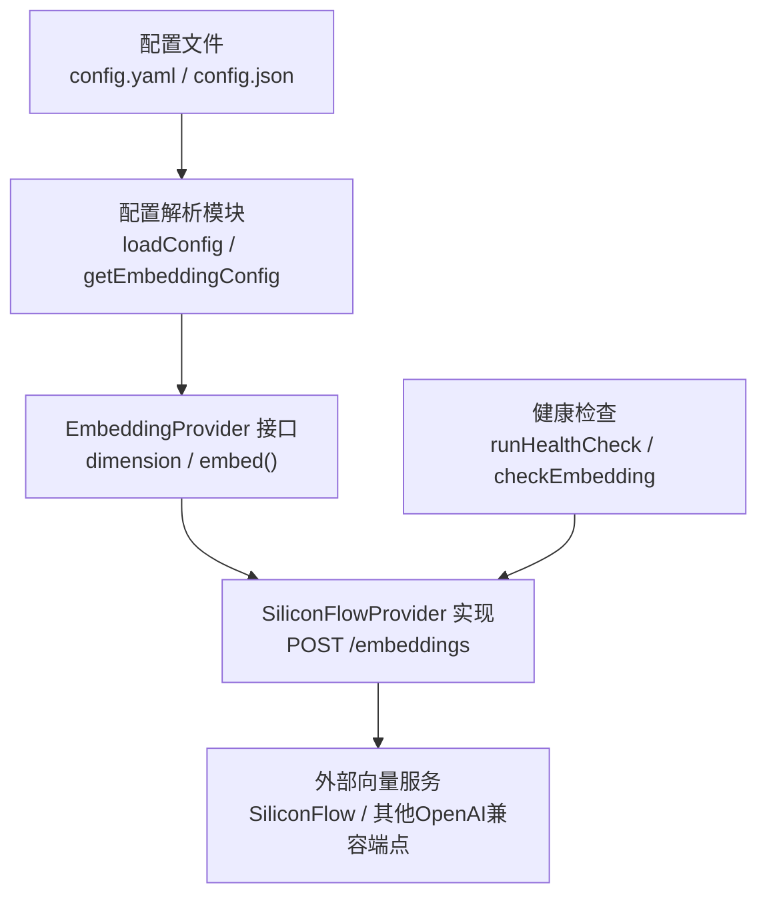
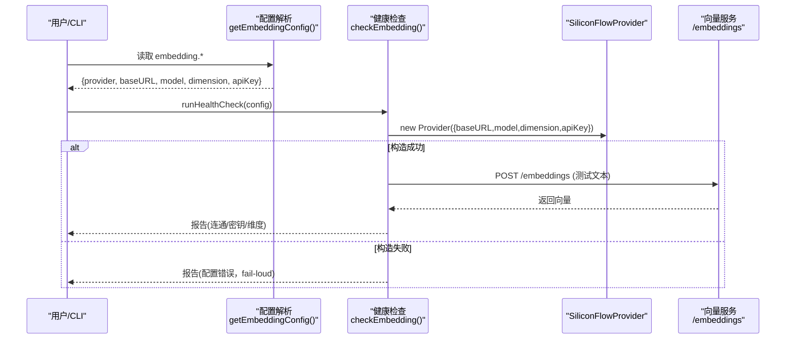
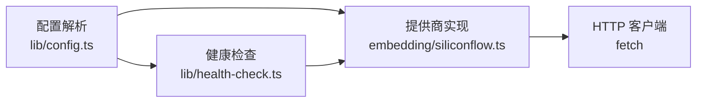
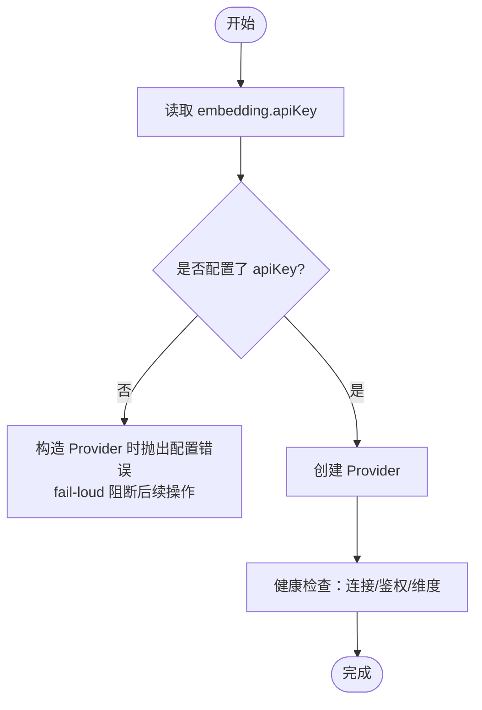

# Embedding提供商配置

<cite>
**本文引用的文件**
- [src/zvec-engine/embedding/provider.ts](file://src/zvec-engine/embedding/provider.ts)
- [src/zvec-engine/embedding/siliconflow.ts](file://src/zvec-engine/embedding/siliconflow.ts)
- [src/lib/config.ts](file://src/lib/config.ts)
- [src/config.ts](file://src/config.ts)
- [src/zvec-engine/errors.ts](file://src/zvec-engine/errors.ts)
- [src/lib/health-check.ts](file://src/lib/health-check.ts)
</cite>

## 目录
1. [简介](#简介)
2. [项目结构](#项目结构)
3. [核心组件](#核心组件)
4. [架构总览](#架构总览)
5. [详细组件分析](#详细组件分析)
6. [依赖关系分析](#依赖关系分析)
7. [性能与可靠性](#性能与可靠性)
8. [故障排查指南](#故障排查指南)
9. [结论](#结论)
10. [附录：配置示例与最佳实践](#附录配置示例与最佳实践)

## 简介
本指南聚焦于知识库索引系统中的 Embedding 提供商配置，覆盖 provider 字段支持的两种模式（siliconflow 与 openai-compatible）、baseURL 的端点切换、model 与 dimension 的严格一致性要求、apiKey 的安全管理方式（明文与环境变量引用），以及未配置 apiKey 时的 fail-loud 安全机制。文档同时提供 SiliconFlow 与 OpenAI 兼容提供商的配置示例与最佳实践。

## 项目结构
Embedding 相关能力由“配置解析 + 提供商实现 + 健康检查”三部分构成：
- 配置解析：负责加载 embedding.provider/baseURL/model/dimension/apiKey，并支持环境变量引用。
- 提供商实现：当前内置 SiliconFlow 实现；openai-compatible 通过 baseURL 指向任意 OpenAI 兼容端点即可复用该实现。
- 健康检查：在启动或诊断时验证连接、密钥、维度一致性。

图表来源
- [src/lib/config.ts:110-137](file://src/lib/config.ts#L110-L137)
- [src/zvec-engine/embedding/provider.ts:9-28](file://src/zvec-engine/embedding/provider.ts#L9-L28)
- [src/zvec-engine/embedding/siliconflow.ts:43-75](file://src/zvec-engine/embedding/siliconflow.ts#L43-L75)
- [src/lib/health-check.ts:70-142](file://src/lib/health-check.ts#L70-L142)

章节来源
- [src/lib/config.ts:110-137](file://src/lib/config.ts#L110-L137)
- [src/zvec-engine/embedding/provider.ts:9-28](file://src/zvec-engine/embedding/provider.ts#L9-L28)
- [src/zvec-engine/embedding/siliconflow.ts:43-75](file://src/zvec-engine/embedding/siliconflow.ts#L43-L75)
- [src/lib/health-check.ts:70-142](file://src/lib/health-check.ts#L70-L142)

## 核心组件
- EmbeddingProvider 接口：定义 dimension 与 embed(texts, opts) 契约，确保输出向量长度一致且等于 dimension。
- SiliconFlowProvider：具体实现，封装 HTTP 调用、重试、超时、维度校验等。
- 配置系统：统一解析 embedding.provider/baseURL/model/dimension/apiKey，并提供默认值与环境变量引用。
- 健康检查：构造 Provider 并发起一次测试请求，验证连通性、鉴权与维度一致性。

章节来源
- [src/zvec-engine/embedding/provider.ts:9-28](file://src/zvec-engine/embedding/provider.ts#L9-L28)
- [src/zvec-engine/embedding/siliconflow.ts:43-75](file://src/zvec-engine/embedding/siliconflow.ts#L43-L75)
- [src/lib/config.ts:110-137](file://src/lib/config.ts#L110-L137)
- [src/lib/health-check.ts:70-142](file://src/lib/health-check.ts#L70-L142)

## 架构总览
下图展示了从配置到实际调用的完整链路，包括失败路径与安全策略。

图表来源
- [src/lib/config.ts:110-137](file://src/lib/config.ts#L110-L137)
- [src/zvec-engine/embedding/siliconflow.ts:51-75](file://src/zvec-engine/embedding/siliconflow.ts#L51-L75)
- [src/lib/health-check.ts:70-142](file://src/lib/health-check.ts#L70-L142)

## 详细组件分析

### 配置模型与默认值
- embedding.provider：支持 siliconflow 与 openai-compatible 两种模式。两者均基于 OpenAI 兼容协议，差异在于 baseURL 指向不同端点。
- embedding.baseURL：API 端点，决定实际对接的提供商。更换 baseURL 即可切换到其他 OpenAI 兼容服务。
- embedding.model：模型名称，需与服务端提供的嵌入模型一致。
- embedding.dimension：向量维度，必须与建库时的 collection.dimension 完全一致。
- embedding.apiKey：可选；若存在则用于鉴权；缺失时走 fail-loud。

默认值来源于内置配置，provider 默认为 siliconflow，baseURL 为 SiliconFlow 官方端点，model 为 Qwen 嵌入模型，dimension 为 4096。

章节来源
- [src/lib/config.ts:110-137](file://src/lib/config.ts#L110-L137)
- [src/config.ts:88-100](file://src/config.ts#L88-L100)

### apiKey 安全管理与 fail-loud
- 支持两种写法：
  - 明文密钥：直接写入 apiKey 字段。
  - 环境变量引用：使用 ${VAR_NAME} 引用同名环境变量，运行时读取。
- 解析规则：
  - 若为空或未配置，返回 undefined。
  - 若为 ${VAR_NAME} 但对应环境变量未设置，也返回 undefined。
- fail-loud 机制：
  - 当 apiKey 缺失时，Provider 构造阶段抛出配置错误，阻止后续任何向量操作，避免误用跨提供商密钥。
  - 健康检查会明确报告 apiKey 未配置的状态。

章节来源
- [src/lib/config.ts:220-240](file://src/lib/config.ts#L220-L240)
- [src/zvec-engine/embedding/siliconflow.ts:51-63](file://src/zvec-engine/embedding/siliconflow.ts#L51-L63)
- [src/lib/health-check.ts:167-173](file://src/lib/health-check.ts#L167-L173)
- [src/zvec-engine/errors.ts:56-62](file://src/zvec-engine/errors.ts#L56-L62)

### baseURL 与 openai-compatible 模式
- 通过更换 baseURL 可对接任意 OpenAI 兼容提供商（例如本地部署的 vLLM、Ollama 等）。
- 当前实现以 SiliconFlow 为例，但协议为标准 OpenAI 兼容的 /embeddings 接口，因此 openai-compatible 模式本质是“同一实现 + 不同端点”。
- 安全约束：baseURL 必须以 https:// 开头，防止明文传输。

章节来源
- [src/zvec-engine/embedding/siliconflow.ts:64-72](file://src/zvec-engine/embedding/siliconflow.ts#L64-L72)
- [src/lib/config.ts:110-117](file://src/lib/config.ts#L110-L117)

### model 与 dimension 的一致性
- model 参数应与所选提供商的嵌入模型一致。
- dimension 必须与建库时的 collection.dimension 完全一致。实现会在响应中校验每条向量的长度是否等于配置的 dimension，不一致将抛出错误并标记为非重试错误。
- 健康检查会执行一次测试请求，对比配置维度与实际返回维度，给出明确诊断信息。

章节来源
- [src/zvec-engine/embedding/siliconflow.ts:170-183](file://src/zvec-engine/embedding/siliconflow.ts#L170-L183)
- [src/lib/health-check.ts:90-118](file://src/lib/health-check.ts#L90-L118)
- [src/zvec-engine/embedding/provider.ts:20-27](file://src/zvec-engine/embedding/provider.ts#L20-L27)

### 批处理、重试与超时
- 批大小：默认 64，按批次调用以避免触发限流。
- 重试策略：对 5xx、429 及网络错误进行指数退避重试；非 429 的 4xx 不重试。
- 超时控制：单批请求可配置超时时间，超时将被视为可重试的网络错误。
- 进度回调：支持 onProgress 回调，便于上层展示处理进度。

章节来源
- [src/zvec-engine/embedding/siliconflow.ts:77-128](file://src/zvec-engine/embedding/siliconflow.ts#L77-L128)
- [src/zvec-engine/embedding/provider.ts:9-18](file://src/zvec-engine/embedding/provider.ts#L9-L18)

## 依赖关系分析
- 配置层依赖 YAML/JSON 解析与路径展开，统一输出 KiConfig.embedding。
- 健康检查依赖 Provider 构造与单次 embed 调用，用于诊断连通性、鉴权与维度。
- Provider 实现依赖标准 fetch API，并通过 Authorization 头传递 apiKey。

图表来源
- [src/lib/config.ts:110-137](file://src/lib/config.ts#L110-L137)
- [src/lib/health-check.ts:70-142](file://src/lib/health-check.ts#L70-L142)
- [src/zvec-engine/embedding/siliconflow.ts:130-145](file://src/zvec-engine/embedding/siliconflow.ts#L130-L145)

章节来源
- [src/lib/config.ts:110-137](file://src/lib/config.ts#L110-L137)
- [src/lib/health-check.ts:70-142](file://src/lib/health-check.ts#L70-L142)
- [src/zvec-engine/embedding/siliconflow.ts:130-145](file://src/zvec-engine/embedding/siliconflow.ts#L130-L145)

## 性能与可靠性
- 批处理：默认每批 64 条，降低请求频率与开销。
- 重试与退避：指数退避结合服务端 Retry-After 头，提高在高负载下的成功率。
- 超时保护：单批请求超时后中止，避免长时间阻塞。
- 维度校验：响应后立即校验维度，尽早暴露配置错误。

[本节为通用性能讨论，不直接分析具体文件]

## 故障排查指南
- 未配置 apiKey：
  - 现象：Provider 构造失败，健康检查报告 apiKey 未配置。
  - 处理：在 embedding.apiKey 中写明文或使用 ${VAR_NAME} 引用环境变量。
- baseURL 非法：
  - 现象：必须以 https:// 开头，否则构造时报错。
  - 处理：修正 baseURL 为合法 HTTPS 地址。
- 维度不匹配：
  - 现象：健康检查或 embed 返回维度不一致错误。
  - 处理：确保 embedding.dimension 与建库时的 collection.dimension 一致。
- 鉴权失败：
  - 现象：401/403 错误。
  - 处理：检查 apiKey 是否正确，确认目标提供商的密钥格式。
- 网络/超时问题：
  - 现象：TIMEOUT 或 NETWORK 错误。
  - 处理：检查网络连通性、DNS 解析、代理设置；适当增大超时或调整批大小。

章节来源
- [src/lib/health-check.ts:70-142](file://src/lib/health-check.ts#L70-L142)
- [src/zvec-engine/embedding/siliconflow.ts:51-75](file://src/zvec-engine/embedding/siliconflow.ts#L51-L75)
- [src/zvec-engine/embedding/siliconflow.ts:170-183](file://src/zvec-engine/embedding/siliconflow.ts#L170-L183)
- [src/zvec-engine/errors.ts:56-62](file://src/zvec-engine/errors.ts#L56-L62)

## 结论
- provider 字段支持 siliconflow 与 openai-compatible 两种模式，二者均基于 OpenAI 兼容协议，差异在于 baseURL 指向。
- baseURL 决定了实际对接的提供商；更换端点即可无缝切换。
- model 与 dimension 必须与建库保持一致，dimension 不一致会被立即检测并报错。
- apiKey 支持明文与环境变量引用两种方式；缺失时采用 fail-loud 安全机制，避免误用密钥。
- 健康检查提供三合一诊断：连通性、鉴权、维度一致性，便于快速定位问题。

[本节为总结性内容，不直接分析具体文件]

## 附录：配置示例与最佳实践

### 配置项说明
- embedding.provider：选择 siliconflow 或 openai-compatible。
- embedding.baseURL：填写目标提供商的 /embeddings 端点（HTTPS）。
- embedding.model：填写提供商提供的嵌入模型名称。
- embedding.dimension：填写向量维度，必须与建库时一致。
- embedding.apiKey：填写 API 密钥，或 ${VAR_NAME} 引用环境变量。

章节来源
- [src/lib/config.ts:110-137](file://src/lib/config.ts#L110-L137)
- [src/config.ts:88-100](file://src/config.ts#L88-L100)

### SiliconFlow 配置示例
- 端点：https://api.siliconflow.cn/v1
- 模型：Qwen/Qwen3-Embedding-8B
- 维度：4096
- 密钥：可通过环境变量 SILICONFLOW_API_KEY 注入，或在配置中使用 ${SILICONFLOW_API_KEY} 引用。

最佳实践
- 优先使用环境变量引用 apiKey，避免明文入库。
- 使用健康检查命令验证连接、密钥与维度。

章节来源
- [src/zvec-engine/embedding/siliconflow.ts:26-28](file://src/zvec-engine/embedding/siliconflow.ts#L26-L28)
- [src/zvec-engine/embedding/siliconflow.ts:51-63](file://src/zvec-engine/embedding/siliconflow.ts#L51-L63)
- [src/lib/health-check.ts:167-173](file://src/lib/health-check.ts#L167-L173)

### OpenAI 兼容提供商配置示例
- 端点：替换 baseURL 为目标提供商的 /embeddings 端点（如本地 vLLM、Ollama 等）。
- 模型：填写提供商提供的嵌入模型名称。
- 维度：填写向量维度，必须与建库时一致。
- 密钥：根据提供商要求设置 apiKey（可为空或自定义格式）。

最佳实践
- 确保 baseURL 为 HTTPS。
- 使用健康检查验证连通性与维度一致性。
- 若提供商不支持某些字段（如 dimensions），仍可通过响应维度校验保证一致性。

章节来源
- [src/lib/config.ts:110-117](file://src/lib/config.ts#L110-L117)
- [src/zvec-engine/embedding/siliconflow.ts:64-72](file://src/zvec-engine/embedding/siliconflow.ts#L64-L72)
- [src/zvec-engine/embedding/siliconflow.ts:170-183](file://src/zvec-engine/embedding/siliconflow.ts#L170-L183)

### 环境变量与 fail-loud 流程

图表来源
- [src/lib/config.ts:220-240](file://src/lib/config.ts#L220-L240)
- [src/zvec-engine/embedding/siliconflow.ts:51-63](file://src/zvec-engine/embedding/siliconflow.ts#L51-L63)
- [src/lib/health-check.ts:70-142](file://src/lib/health-check.ts#L70-L142)

章节来源
- [src/lib/config.ts:220-240](file://src/lib/config.ts#L220-L240)
- [src/zvec-engine/embedding/siliconflow.ts:51-63](file://src/zvec-engine/embedding/siliconflow.ts#L51-L63)
- [src/lib/health-check.ts:70-142](file://src/lib/health-check.ts#L70-L142)