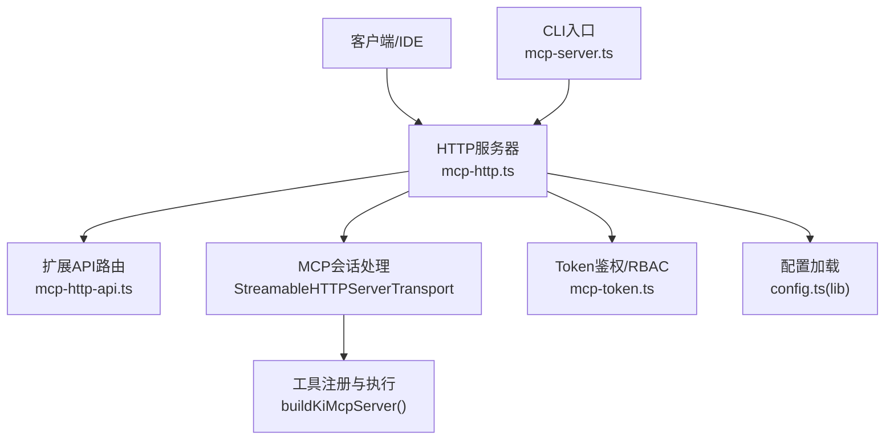
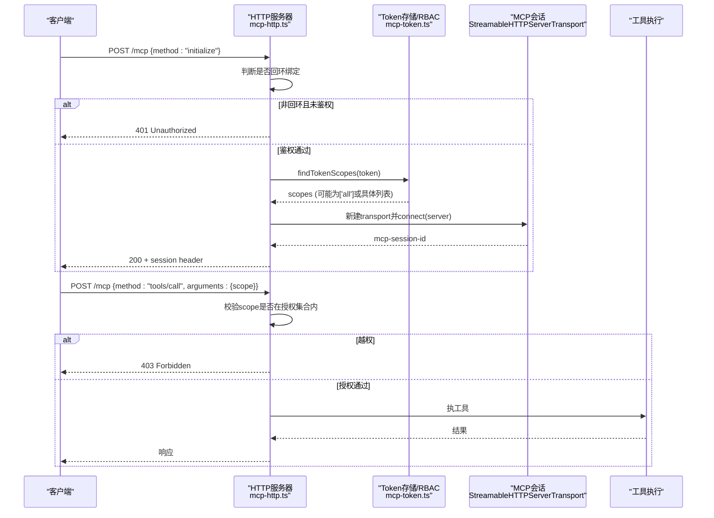
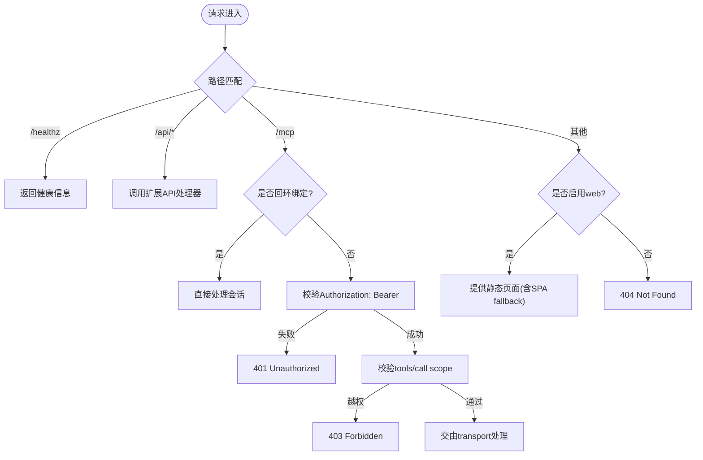
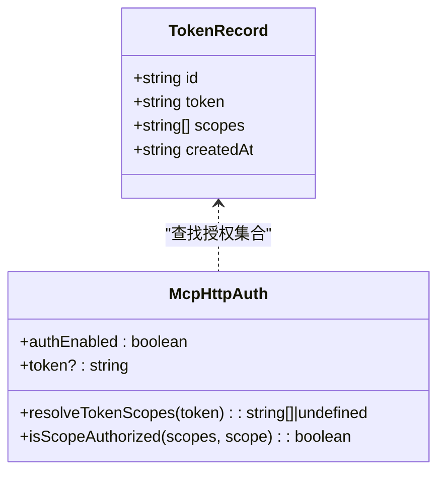
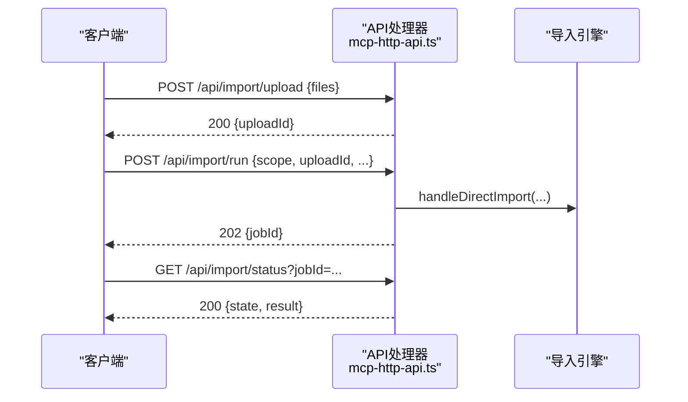
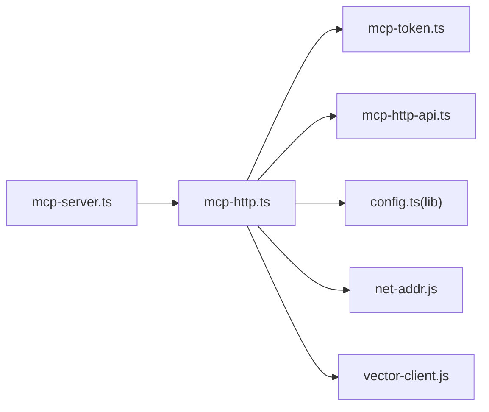

# MCP HTTP服务配置

<cite>
**本文引用的文件**
- [mcp-http.ts](file://src/lib/mcp-http.ts)
- [mcp-http-api.ts](file://src/lib/mcp-http-api.ts)
- [mcp-token.ts](file://src/lib/mcp-token.ts)
- [config.ts（lib）](file://src/lib/config.ts)
- [mcp-server.ts](file://src/mcp-server.ts)
- [mcp-http.md](file://docs/mcp-http.md)
- [mcp-http.test.ts](file://test/mcp-http.test.ts)
</cite>

## 目录
1. [简介](#简介)
2. [项目结构](#项目结构)
3. [核心组件](#核心组件)
4. [架构总览](#架构总览)
5. [详细组件分析](#详细组件分析)
6. [依赖关系分析](#依赖关系分析)
7. [性能与容量规划](#性能与容量规划)
8. [生产部署指南](#生产部署指南)
9. [监控与日志](#监控与日志)
10. [故障排查](#故障排查)
11. [结论](#结论)

## 简介
本指南面向在生产环境中以HTTP模式运行MCP服务的运维与开发团队，覆盖以下主题：
- HTTP模式下MCP服务器的启动配置与网络监听设置
- Token鉴权机制的配置方法、API密钥生成、验证流程与安全考虑
- HTTP API端点访问方式与认证流程
- 生产环境部署示例（反向代理、SSL证书、负载均衡）
- 监控与日志配置选项
- 与其他系统集成时的网络要求与安全最佳实践
- 常见问题与解决方案

## 项目结构
MCP HTTP传输由以下关键模块构成：
- HTTP服务器与会话管理：mcp-http.ts
- 扩展API路由（健康检查、文档列表、导入等）：mcp-http-api.ts
- 多Token存储与RBAC授权：mcp-token.ts
- 配置加载与默认值：config.ts（lib）
- CLI入口与参数解析：mcp-server.ts
- 用户文档：mcp-http.md

图表来源
- [mcp-http.ts:344-607](file://src/lib/mcp-http.ts#L344-L607)
- [mcp-http-api.ts:216-272](file://src/lib/mcp-http-api.ts#L216-L272)
- [mcp-token.ts:245-259](file://src/lib/mcp-token.ts#L245-L259)
- [config.ts（lib）:148-175](file://src/lib/config.ts#L148-L175)
- [mcp-server.ts:137-200](file://src/mcp-server.ts#L137-L200)

章节来源
- [mcp-http.ts:344-607](file://src/lib/mcp-http.ts#L344-L607)
- [mcp-http-api.ts:216-272](file://src/lib/mcp-http-api.ts#L216-L272)
- [mcp-token.ts:245-259](file://src/lib/mcp-token.ts#L245-L259)
- [config.ts（lib）:148-175](file://src/lib/config.ts#L148-L175)
- [mcp-server.ts:137-200](file://src/mcp-server.ts#L137-L200)

## 核心组件
- HTTP服务器与会话生命周期：创建http.Server，按路径分发到/mcp、/api/*、/healthz与静态页面；维护会话Map与空闲回收定时器。
- 鉴权中间件：根据绑定地址决定是否启用Bearer Token校验；回环地址免鉴权，非回环强制鉴权；支持临时全权Token与多Token存储。
- RBAC授权：对tools/call的arguments.scope进行越权拦截；枚举类无scope参数工具在工具层按授权集合过滤输出。
- 扩展API：/api/health、/api/doc/list、/api/import/*等，复用同一鉴权策略。
- 配置系统：从配置文件读取mcp.http.host/port/allowedHosts；token不写入配置文件，仅通过CLI或环境变量注入。

章节来源
- [mcp-http.ts:344-607](file://src/lib/mcp-http.ts#L344-L607)
- [mcp-http-api.ts:216-272](file://src/lib/mcp-http-api.ts#L216-L272)
- [mcp-token.ts:47-50](file://src/lib/mcp-token.ts#L47-L50)
- [config.ts（lib）:99-108](file://src/lib/config.ts#L99-L108)

## 架构总览
下图展示一次带鉴权的MCP初始化请求流程，包括鉴权、会话建立、工具调用与RBAC校验。

图表来源
- [mcp-http.ts:454-577](file://src/lib/mcp-http.ts#L454-L577)
- [mcp-token.ts:245-259](file://src/lib/mcp-token.ts#L245-L259)

章节来源
- [mcp-http.ts:454-577](file://src/lib/mcp-http.ts#L454-L577)
- [mcp-token.ts:245-259](file://src/lib/mcp-token.ts#L245-L259)

## 详细组件分析

### HTTP服务器与会话管理
- 监听端口与地址：默认127.0.0.1:7423；可通过CLI或配置文件覆盖。
- 会话上限与空闲回收：默认最大并发会话256；空闲超时30分钟自动清理。
- DNS rebinding保护：可选allowedHosts白名单，限制Host头。
- 优雅退出：关闭所有会话、释放向量库锁、删除lock文件。

图表来源
- [mcp-http.ts:394-499](file://src/lib/mcp-http.ts#L394-L499)
- [mcp-http.ts:501-577](file://src/lib/mcp-http.ts#L501-L577)
- [mcp-http.ts:257-298](file://src/lib/mcp-http.ts#L257-L298)

章节来源
- [mcp-http.ts:394-499](file://src/lib/mcp-http.ts#L394-L499)
- [mcp-http.ts:501-577](file://src/lib/mcp-http.ts#L501-L577)
- [mcp-http.ts:257-298](file://src/lib/mcp-http.ts#L257-L298)

### Token鉴权与RBAC
- 鉴权开关：由绑定地址决定；回环地址免鉴权，非回环强制Bearer Token。
- Token来源优先级：CLI --token > 环境变量KI_MCP_TOKEN > 多Token存储（~/.ki/mcp-tokens.json）。
- 多Token存储：每个Token记录包含短ID、明文、授权scope集合、创建时间；原子写回，权限0600。
- RBAC：对tools/call的arguments.scope进行越权拦截；枚举工具（ki_scope_list、ki_manage_index_list）跳过单点校验，由工具层按授权集合过滤输出。

图表来源
- [mcp-token.ts:25-35](file://src/lib/mcp-token.ts#L25-L35)
- [mcp-token.ts:47-50](file://src/lib/mcp-token.ts#L47-L50)
- [mcp-token.ts:245-259](file://src/lib/mcp-token.ts#L245-L259)
- [mcp-http.ts:454-487](file://src/lib/mcp-http.ts#L454-L487)

章节来源
- [mcp-token.ts:25-35](file://src/lib/mcp-token.ts#L25-L35)
- [mcp-token.ts:47-50](file://src/lib/mcp-token.ts#L47-L50)
- [mcp-token.ts:245-259](file://src/lib/mcp-token.ts#L245-L259)
- [mcp-http.ts:454-487](file://src/lib/mcp-http.ts#L454-L487)

### 扩展API端点
- GET /api/health：健康报告（含zvec探活，10秒超时）。
- GET /api/doc/list：Group路径+文档列表，支持q模糊搜索、tag过滤、limit分页。
- POST /api/import/upload：上传文件至受控目录，返回uploadId。
- POST /api/import/run：触发导入（异步job），返回jobId。
- GET /api/import/status：轮询导入进度/结果。
- 鉴权规则与/mcp一致；/api/*与MCP会话隔离。

图表来源
- [mcp-http-api.ts:260-272](file://src/lib/mcp-http-api.ts#L260-L272)
- [mcp-http-api.ts:371-506](file://src/lib/mcp-http-api.ts#L371-L506)
- [mcp-http-api.ts:541-564](file://src/lib/mcp-http-api.ts#L541-L564)

章节来源
- [mcp-http-api.ts:260-272](file://src/lib/mcp-http-api.ts#L260-L272)
- [mcp-http-api.ts:371-506](file://src/lib/mcp-http-api.ts#L371-L506)
- [mcp-http-api.ts:541-564](file://src/lib/mcp-http-api.ts#L541-L564)

### 配置系统与默认值
- 配置文件位置：$HOME/.ki/config.yaml/yml/json；支持YAML优先。
- mcp.http配置项：host、port、allowedHosts；token不写入配置文件。
- 命令行参数优先级高于配置文件；回环绑定时提供Token会提示不生效。
- 默认端口7423，默认主机127.0.0.1。

章节来源
- [config.ts（lib）:148-175](file://src/lib/config.ts#L148-L175)
- [config.ts（lib）:291-307](file://src/lib/config.ts#L291-L307)
- [mcp-server.ts:137-200](file://src/mcp-server.ts#L137-L200)

## 依赖关系分析
- mcp-http.ts依赖：
  - mcp-token.ts：Token查找与RBAC判定
  - mcp-http-api.ts：延迟加载扩展API
  - config.ts（lib）：读取mcp.http默认值
  - net-addr.js：回环地址判定
- mcp-server.ts负责CLI参数解析与启动流程，调用startHttpMcpServer。
- 测试用例验证鉴权、会话隔离、错误码等行为。

图表来源
- [mcp-server.ts:24-47](file://src/mcp-server.ts#L24-L47)
- [mcp-http.ts:24-28](file://src/lib/mcp-http.ts#L24-L28)
- [mcp-http.ts:344-353](file://src/lib/mcp-http.ts#L344-L353)

章节来源
- [mcp-server.ts:24-47](file://src/mcp-server.ts#L24-L47)
- [mcp-http.ts:24-28](file://src/lib/mcp-http.ts#L24-L28)
- [mcp-http.ts:344-353](file://src/lib/mcp-http.ts#L344-L353)

## 性能与容量规划
- 会话上限：默认256，防止内存耗尽；可根据业务规模调整maxSessions。
- 空闲回收：默认30分钟，避免僵尸会话堆积。
- 请求体上限：16MB，防止滥用。
- 导入Job内存Map：最多50个，过期清理（1小时TTL）。
- 建议：在高并发场景下结合反向代理限流与连接池优化。

章节来源
- [mcp-http.ts:46-53](file://src/lib/mcp-http.ts#L46-L53)
- [mcp-http.ts:147-173](file://src/lib/mcp-http.ts#L147-L173)
- [mcp-http-api.ts:49-86](file://src/lib/mcp-http-api.ts#L49-L86)

## 生产部署指南

### 启动与监听
- 本地开发：ki mcp --http（默认127.0.0.1:7423，免鉴权）。
- 远程暴露：ki mcp --http --host 0.0.0.0 --port 7423，必须配置鉴权（--token或KI_MCP_TOKEN或多Token存储）。
- 后台常驻：ki mcp --http --daemon（或-d）。
- 前端页面：ki mcp --http --web（需先构建web/dist）。

章节来源
- [mcp-http.md:13-22](file://docs/mcp-http.md#L13-L22)
- [mcp-server.ts:84-107](file://src/mcp-server.ts#L84-L107)
- [mcp-http.ts:676-726](file://src/lib/mcp-http.ts#L676-L726)

### 反向代理与SSL
- 推荐前置Nginx/Caddy终结TLS，后端仅处理明文HTTP。
- 配置示例要点：
  - 监听443，配置SSL证书与HSTS。
  - 将/mcp、/api/*转发到后端7423端口。
  - 设置合理的超时与缓冲大小。
  - 使用allowedHosts限制Host头，缓解DNS rebinding。

章节来源
- [mcp-http.md:243-248](file://docs/mcp-http.md#L243-L248)
- [mcp-http.ts:550-552](file://src/lib/mcp-http.ts#L550-L552)

### 负载均衡
- 由于MCP会话基于mcp-session-id，建议在代理层保持会话粘性或使用共享会话存储（如Redis）以实现横向扩展。
- 注意：当前实现为单进程单锁，水平扩展需谨慎评估向量库锁竞争。

章节来源
- [mcp-http.ts:528-566](file://src/lib/mcp-http.ts#L528-L566)

### 安全最佳实践
- 生产环境必须启用鉴权；回环地址免鉴权仅用于本机调试。
- 使用强随机Token（ki mcp token generate --scope <...>），最小授权原则。
- 定期轮换Token，发现泄露立即删除或收敛权限。
- 防火墙/安全组收敛来源IP；启用allowedHosts白名单。

章节来源
- [mcp-token.ts:55-68](file://src/lib/mcp-token.ts#L55-L68)
- [mcp-http.md:132-146](file://docs/mcp-http.md#L132-L146)

## 监控与日志
- 健康检查：GET /healthz返回ok、pid、version、host、port、authFailures。
- 状态诊断：ki mcp --status输出JSON，包含running、healthz、lock、managedTokens.count、stdioInstances等。
- 鉴权失败日志：服务端stderr记录失败原因与次数，便于排查。
- 导入Job状态：/api/import/status轮询jobId获取进度与结果。

章节来源
- [mcp-http.ts:183-230](file://src/lib/mcp-http.ts#L183-L230)
- [mcp-http.ts:632-670](file://src/lib/mcp-http.ts#L632-L670)
- [mcp-http-api.ts:276-288](file://src/lib/mcp-http-api.ts#L276-L288)
- [mcp-http-api.ts:541-564](file://src/lib/mcp-http-api.ts#L541-L564)

## 故障排查
- 端口占用：EADDRINUSE提示更换端口或排查占用进程。
- 权限不足：EACCES提示改用高位端口。
- 地址不可用：EADDRNOTAVAIL提示检查host是否为合法IP。
- 无法解析主机：ENOTFOUND提示检查--host。
- 鉴权失败（401）：核对Authorization: Bearer与ki mcp token list输出完全一致。
- 越权拒绝（403）：确认请求scope在Token授权范围内；必要时更新Token授权。
- 会话超限：503 Too many active sessions，关闭闲置连接或提高maxSessions。

章节来源
- [mcp-http.ts:609-630](file://src/lib/mcp-http.ts#L609-L630)
- [mcp-http.md:224-233](file://docs/mcp-http.md#L224-L233)
- [mcp-http.ts:537-547](file://src/lib/mcp-http.ts#L537-L547)

## 结论
MCP HTTP传输模式提供了高可用、可观测、安全的单进程共享方案，适用于多IDE协作与生产部署。通过合理的网络配置、Token鉴权、反向代理与监控日志，可实现稳定可靠的MCP服务。建议在生产环境中严格遵循最小授权原则，定期审计Token与访问日志，并结合反向代理与防火墙策略提升整体安全性。