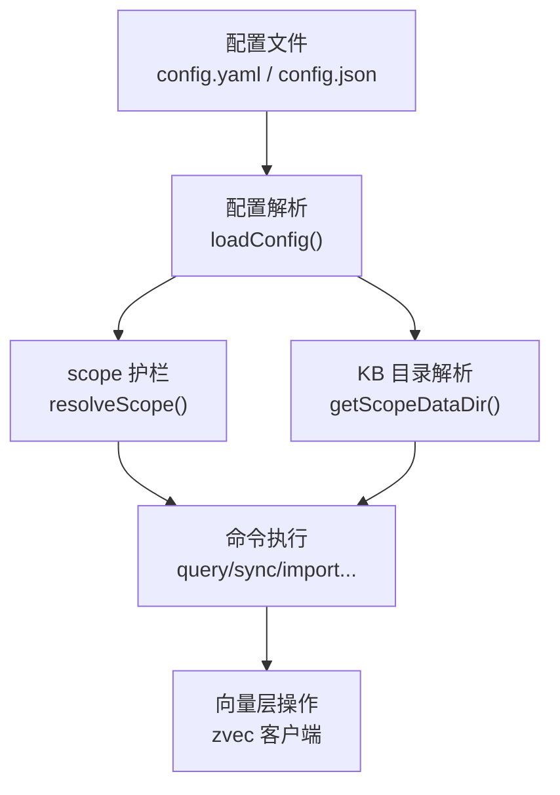
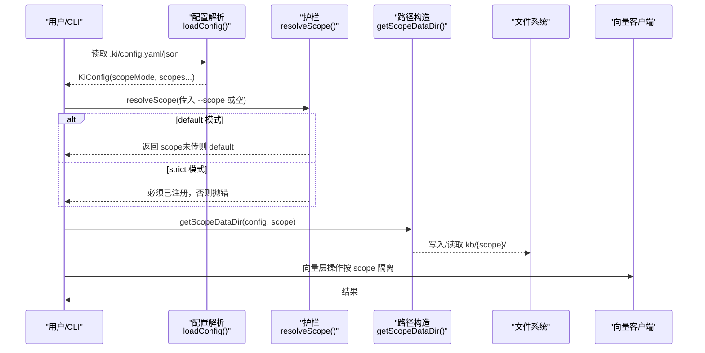
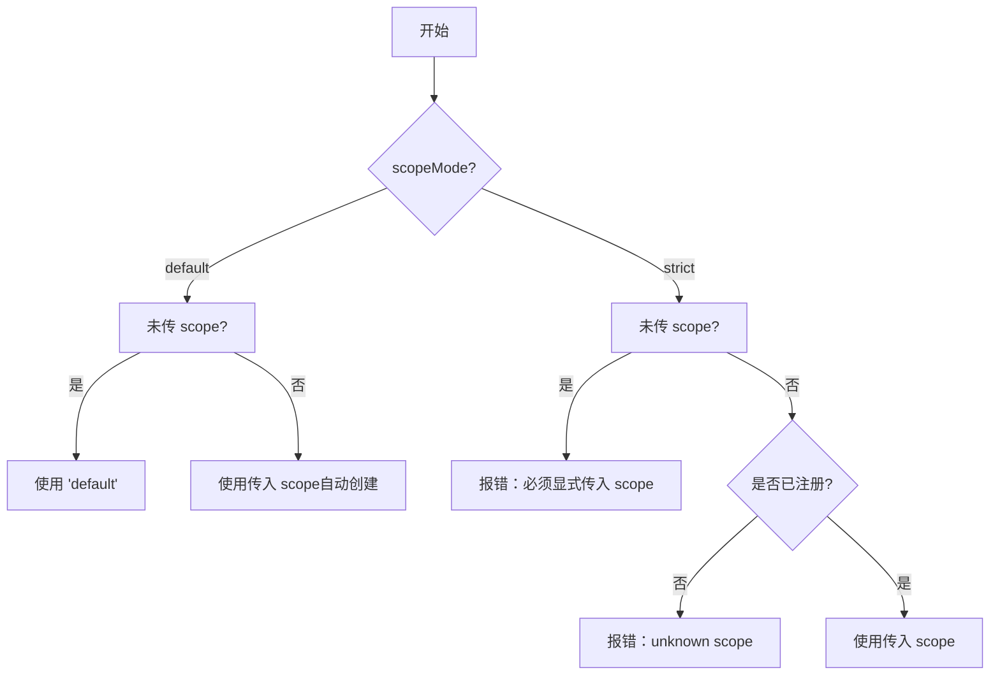
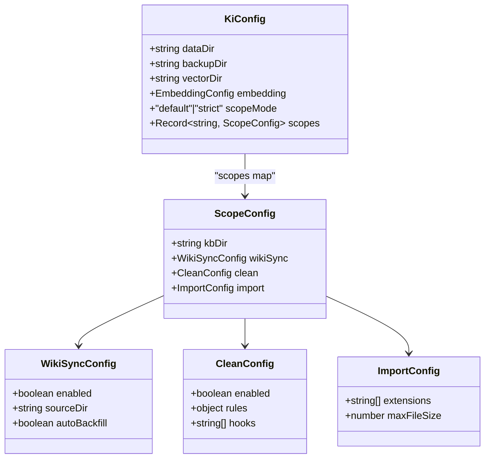
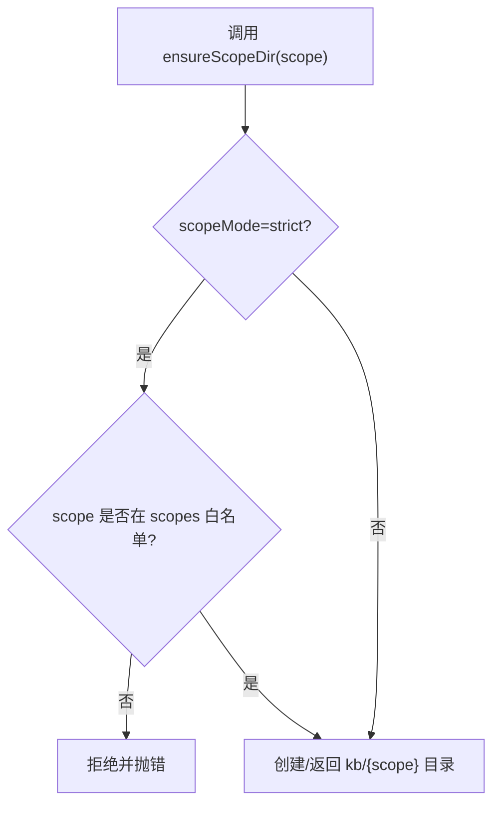
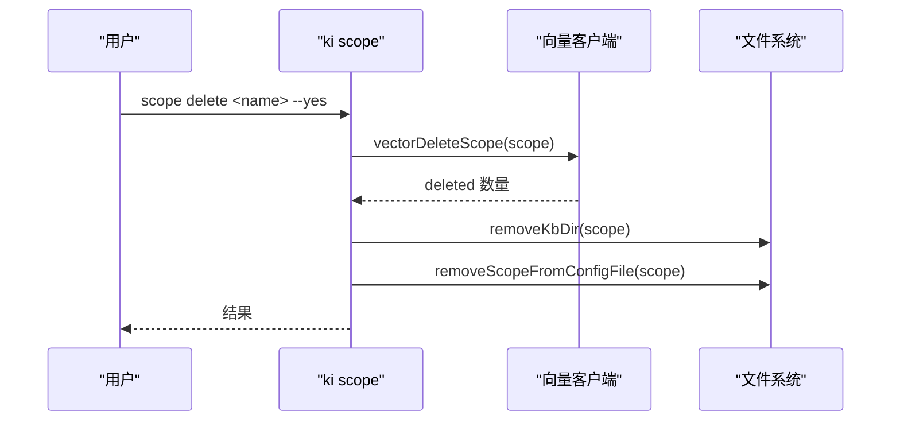
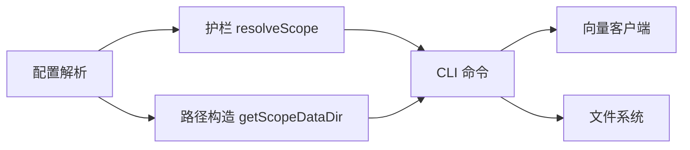

# Scope隔离配置

<cite>
**本文引用的文件**
- [src/lib/config.ts](file://src/lib/config.ts)
- [src/lib/scope.ts](file://src/lib/scope.ts)
- [src/scope.ts](file://src/scope.ts)
- [src/config.ts](file://src/config.ts)
- [docs/configuration.md](file://docs/configuration.md)
- [test/scope-mode.test.ts](file://test/scope-mode.test.ts)
- [test/scope-isolation.test.ts](file://test/scope-isolation.test.ts)
- [.requirements/2026-07-17-KiSearch-zvec-node-mcp/design/REF_S01_Config_DESIGN.md](file://.requirements/2026-07-17-KiSearch-zvec-node-mcp/design/REF_S01_Config_DESIGN.md)
</cite>

## 目录
1. [简介](#简介)
2. [项目结构](#项目结构)
3. [核心组件](#核心组件)
4. [架构总览](#架构总览)
5. [详细组件分析](#详细组件分析)
6. [依赖关系分析](#依赖关系分析)
7. [性能与安全考量](#性能与安全考量)
8. [故障排查指南](#故障排查指南)
9. [结论](#结论)
10. [附录：常用配置示例](#附录常用配置示例)

## 简介
本文件面向需要为多项目、多团队或不同环境配置知识索引器（KI）Scope 隔离机制的用户与运维人员。内容覆盖 scopeMode 的两种模式差异与适用场景、scopes 配置结构（kbDir、wikiSync、clean、import）、默认 scope 的行为、自定义 scope 的配置方法，以及在不同使用场景下的最佳实践与注意事项。

## 项目结构
Scope 隔离能力由“配置解析 + 路径构造 + 护栏校验”三部分协同实现：
- 配置解析：加载并合并 KiConfig，包含 scopeMode、scopes 映射等
- 路径构造：根据 scope 计算实际 KB 数据目录（优先 kbDir/kb/{scope}，回退 dataDir/{scope}）
- 护栏校验：在 strict 模式下强制白名单校验，default 模式下自动放行并创建

图表来源
- [src/lib/config.ts:148-359](file://src/lib/config.ts#L148-L359)
- [src/lib/config.ts:382-459](file://src/lib/config.ts#L382-L459)
- [src/lib/scope.ts:49-53](file://src/lib/scope.ts#L49-L53)

章节来源
- [src/lib/config.ts:148-359](file://src/lib/config.ts#L148-L359)
- [src/lib/config.ts:382-459](file://src/lib/config.ts#L382-L459)
- [src/lib/scope.ts:49-53](file://src/lib/scope.ts#L49-L53)

## 核心组件
- 配置模型与解析：KiConfig、parseAndExpand、buildDefaults
- Scope 护栏：resolveScope（default/strict 行为）
- KB 目录定位：getScopeDataDir（kbDir 优先，自动拼接 kb/{scope}）
- Scope 工具：validateScope、listAllScopes、getKbDir、getRelationsCachePath
- CLI 管理：ki scope list/delete/clear（两层一致性维护）

章节来源
- [src/lib/config.ts:119-128](file://src/lib/config.ts#L119-L128)
- [src/lib/config.ts:244-359](file://src/lib/config.ts#L244-L359)
- [src/lib/config.ts:382-459](file://src/lib/config.ts#L382-L459)
- [src/lib/scope.ts:30-53](file://src/lib/scope.ts#L30-L53)
- [src/scope.ts:94-132](file://src/scope.ts#L94-L132)

## 架构总览
下图展示了从配置到运行时落盘与向量层的完整链路，重点体现 scope 隔离对 KB 目录与向量元数据的约束。

图表来源
- [src/lib/config.ts:148-359](file://src/lib/config.ts#L148-L359)
- [src/lib/config.ts:382-459](file://src/lib/config.ts#L382-L459)
- [src/lib/scope.ts:49-53](file://src/lib/scope.ts#L49-L53)
- [src/scope.ts:94-132](file://src/scope.ts#L94-L132)

## 详细组件分析

### scopeMode：default 与 strict 的差异与场景
- default（默认）
  - 未传 --scope：自动使用 default scope
  - 未注册 scope：允许任意 scope 名，按需自动创建 KB 目录与向量层资源
  - 适用：单项目、快速体验、临时实验
- strict
  - 未传 --scope：直接报错（fail-loud）
  - 未注册 scope：拒绝并提示已注册 scope 列表
  - 适用：多项目隔离、团队协作、生产环境防串味

图表来源
- [src/lib/config.ts:288-290](file://src/lib/config.ts#L288-L290)
- [src/lib/config.ts:444-459](file://src/lib/config.ts#L444-L459)
- [.requirements/2026-07-17-KiSearch-zvec-node-mcp/design/REF_S01_Config_DESIGN.md:97-107](file://.requirements/2026-07-17-KiSearch-zvec-node-mcp/design/REF_S01_Config_DESIGN.md#L97-L107)

章节来源
- [src/lib/config.ts:288-290](file://src/lib/config.ts#L288-L290)
- [src/lib/config.ts:444-459](file://src/lib/config.ts#L444-L459)
- [.requirements/2026-07-17-KiSearch-zvec-node-mcp/design/REF_S01_Config_DESIGN.md:97-107](file://.requirements/2026-07-17-KiSearch-zvec-node-mcp/design/REF_S01_Config_DESIGN.md#L97-L107)
- [test/scope-mode.test.ts:49-96](file://test/scope-mode.test.ts#L49-L96)

### scopes 配置结构与子项
- kbDir：KB 基础目录。程序会自动在其下创建 kb/{scope} 子目录，避免污染源码目录。未配置时回退到 dataDir/{scope}
- wikiSync：Wiki 写回/回收站源目录定位与开关
  - enabled：是否启用写回（false 关闭一切写回）
  - autoBackfill：写回时若目标目录不存在或为空，自动全量补齐历史关系（可显式 false 关闭）
  - sourceDir：源文档目录（用于写回目标定位）
- clean：数据清洗规则
  - enabled：总开关（false 等效 --no-clean，连 hooks 一起关闭）
  - rules：内置规则逐项开关（bom、frontmatter、htmlComment、mermaid、codePath、codeBlock、emptyChunk、keepShortSamples）
  - hooks：外部清洗钩子（stdin→stdout 管道，按序执行）
- import：导入选项
  - extensions：格式白名单（默认 [.md]）
  - maxFileSize：单文件大小上限（字节，默认 1MB）

图表来源
- [src/lib/config.ts:63-97](file://src/lib/config.ts#L63-L97)
- [src/lib/config.ts:119-128](file://src/lib/config.ts#L119-L128)
- [docs/configuration.md:100-163](file://docs/configuration.md#L100-L163)

章节来源
- [src/lib/config.ts:63-97](file://src/lib/config.ts#L63-L97)
- [src/lib/config.ts:310-359](file://src/lib/config.ts#L310-L359)
- [docs/configuration.md:100-163](file://docs/configuration.md#L100-L163)

### 默认 scope 的概念与作用
- 当未传入 --scope 且 scopeMode=default 时，系统自动使用 default scope
- default scope 的数据目录位于 dataDir/default（或 kbDir/kb/default）
- 可通过 scopes.default: {} 显式声明；也可不声明，仍会按默认逻辑生效

章节来源
- [src/lib/config.ts:444-459](file://src/lib/config.ts#L444-L459)
- [src/lib/config.ts:382-386](file://src/lib/config.ts#L382-L386)
- [src/config.ts:101-118](file://src/config.ts#L101-L118)

### 自定义 scope 配置方法与自动创建机制
- 在 scopes 下新增键值，例如 my-project
- 若配置了 kbDir，实际数据目录 = kbDir/kb/my-project（避免污染源码目录）
- 未配置 kbDir 时，数据目录 = dataDir/my-project
- ensureScopeDir 会根据 scopeMode 决定是否创建目录：
  - default：自动创建
  - strict：仅当已在 scopes 中注册才创建，否则拒绝

图表来源
- [src/lib/config.ts:382-386](file://src/lib/config.ts#L382-L386)
- [test/scope-mode.test.ts:49-96](file://test/scope-mode.test.ts#L49-L96)

章节来源
- [src/lib/config.ts:382-386](file://src/lib/config.ts#L382-L386)
- [test/scope-mode.test.ts:49-96](file://test/scope-mode.test.ts#L49-L96)

### 多项目隔离验证与行为
- 相同 Group/Relation 名称在不同 scope 下独立存储，互不影响
- 删除、查询、导入等操作均受 scope 隔离约束
- 磁盘路径隔离：每个 scope 拥有独立的 KB 目录

章节来源
- [test/scope-isolation.test.ts:50-153](file://test/scope-isolation.test.ts#L50-L153)

### CLI 管理与两层一致性
- ki scope list：列出 KB 层与向量层并集，标注存在性与文档数
- ki scope delete：删除向量文档 + KB 目录 + 移除配置条目（需 --yes）
- ki scope clear：清空向量文档 + 可选清理 KB 目录内容（可按 tag 过滤）

图表来源
- [src/scope.ts:145-179](file://src/scope.ts#L145-L179)
- [src/scope.ts:192-221](file://src/scope.ts#L192-L221)
- [src/lib/config.ts:476-508](file://src/lib/config.ts#L476-L508)

章节来源
- [src/scope.ts:94-132](file://src/scope.ts#L94-L132)
- [src/scope.ts:145-179](file://src/scope.ts#L145-L179)
- [src/scope.ts:192-221](file://src/scope.ts#L192-L221)
- [src/lib/config.ts:476-508](file://src/lib/config.ts#L476-L508)

## 依赖关系分析
- 配置解析模块负责统一加载 YAML/JSON，并展开路径、合并默认值
- 护栏模块基于 scopeMode 决定放行或拒绝策略
- 路径构造模块确保 KB 目录隔离，避免跨 scope 串读串写
- CLI 管理模块协调向量层与文件系统，保证两层一致

图表来源
- [src/lib/config.ts:148-359](file://src/lib/config.ts#L148-L359)
- [src/lib/config.ts:382-459](file://src/lib/config.ts#L382-L459)
- [src/scope.ts:94-132](file://src/scope.ts#L94-L132)

章节来源
- [src/lib/config.ts:148-359](file://src/lib/config.ts#L148-L359)
- [src/lib/config.ts:382-459](file://src/lib/config.ts#L382-L459)
- [src/scope.ts:94-132](file://src/scope.ts#L94-L132)

## 性能与安全考量
- 性能
  - 默认 mode 下自动创建 scope 会带来额外 I/O（目录创建、向量层初始化），适合小规模或临时场景
  - strict 模式通过白名单减少误用，降低跨 scope 干扰风险，但要求更严格的配置管理
  - wikiSync.autoBackfill 会在首次写回时触发全量补齐，可能带来一次性 I/O 峰值，建议在低峰期执行或显式关闭
- 安全
  - validateScope 限制 scope 字符集，防止路径穿越
  - strict 模式将 scopes 作为白名单，有效防止未授权 scope 访问
  - wikiSync.enabled=false 可完全禁用写回，避免意外修改外部 wiki
  - apiKey 支持环境变量引用，避免明文泄露

章节来源
- [src/lib/scope.ts:30-43](file://src/lib/scope.ts#L30-L43)
- [src/lib/config.ts:220-240](file://src/lib/config.ts#L220-L240)
- [docs/configuration.md:67-89](file://docs/configuration.md#L67-L89)

## 故障排查指南
- 现象：strict 模式下未传 --scope 报错
  - 处理：显式传入已注册的 scope，或在 default 模式下运行
- 现象：strict 模式下传入未注册 scope 报错
  - 处理：在 scopes 中添加该 scope 配置后再试
- 现象：wikiSync 写回未生效
  - 检查：enabled 是否为 true；sourceDir 是否正确；autoBackfill 是否被禁用
- 现象：向量服务不可用导致删除/清理失败
  - 处理：确保向量服务可用，或使用 --yes 确认前查看预览信息

章节来源
- [src/lib/config.ts:444-459](file://src/lib/config.ts#L444-L459)
- [src/scope.ts:145-179](file://src/scope.ts#L145-L179)
- [src/scope.ts:192-221](file://src/scope.ts#L192-L221)

## 结论
Scope 隔离通过 scopeMode 提供灵活的安全边界：default 模式便于快速上手与临时隔离，strict 模式适合生产与团队协作。结合 kbDir、wikiSync、clean、import 等子配置，可实现精细化的数据治理与流程控制。建议在生产环境采用 strict 模式，并为每个项目明确注册 scope，配合 wikiSync 与 clean 规则保障数据质量与安全性。

## 附录：常用配置示例
- 单项目默认模式
  - 不配置 scopes，或未传 --scope 时使用 default
- 多项目隔离（strict）
  - 在 scopes 中注册各项目名称，严格限定可访问范围
- 团队协作环境
  - 为不同团队分配独立 scope，开启 wikiSync 以同步文档，配置 clean 规则统一清洗标准
- 导入与清洗
  - 通过 import.extensions 限制导入格式，maxFileSize 控制文件大小；clean.rules 按需开启/关闭清洗规则

章节来源
- [docs/configuration.md:180-227](file://docs/configuration.md#L180-L227)
- [src/config.ts:101-118](file://src/config.ts#L101-L118)