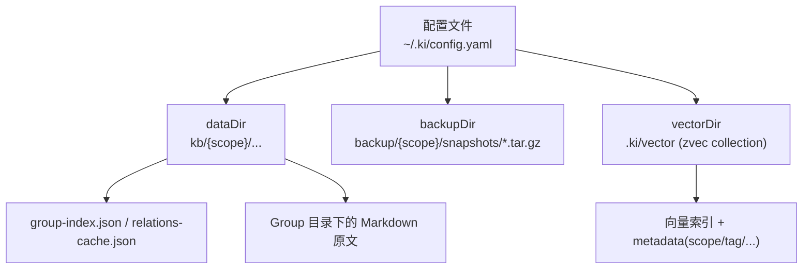
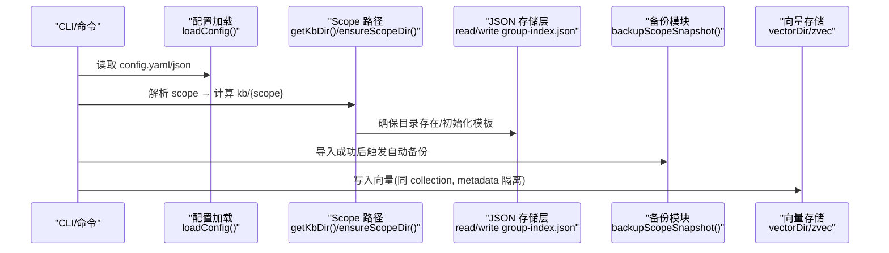
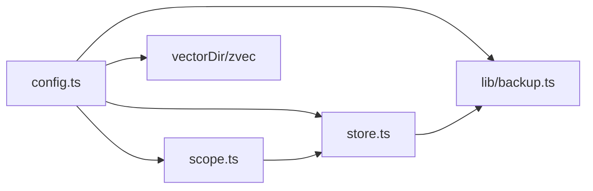

# 基础存储配置

<cite>
**本文引用的文件**
- [src/lib/config.ts](file://src/lib/config.ts)
- [src/config.ts](file://src/config.ts)
- [src/lib/scope.ts](file://src/lib/scope.ts)
- [src/lib/store.ts](file://src/lib/store.ts)
- [src/backup.ts](file://src/backup.ts)
- [src/lib/backup.ts](file://src/lib/backup.ts)
- [docs/configuration.md](file://docs/configuration.md)
- [docs/backup-restore.md](file://docs/backup-restore.md)
- [_template/group-index.json](file://_template/group-index.json)
- [.e2e-run/ki-config.yaml](file://.e2e-run/ki-config.yaml)
</cite>

## 目录
1. [简介](#简介)
2. [项目结构](#项目结构)
3. [核心组件](#核心组件)
4. [架构总览](#架构总览)
5. [详细组件分析](#详细组件分析)
6. [依赖关系分析](#依赖关系分析)
7. [性能与容量规划](#性能与容量规划)
8. [故障排查指南](#故障排查指南)
9. [结论](#结论)
10. [附录：完整配置示例与最佳实践](#附录完整配置示例与最佳实践)

## 简介
本文聚焦“基础存储配置”，系统性说明以下要点：
- dataDir（知识库目录）的作用、默认路径逻辑与 scope 级 kbDir 回退机制。
- KB 源数据组织方式：每个 scope 下的 markdown 文档、ai-results.json、group-index.json、relations-cache.json 的存放位置与作用。
- backupDir（备份目录）用于存放 snapshot tar.gz 的机制与命名规则。
- vectorDir（向量数据库目录）作为独立存储的重要性，以及“所有 scope 共享一个 collection，通过 metadata 字段隔离”的设计原理。
- 各配置项的路径规范、权限要求与最佳实践。
- 常见错误与排障方法。

## 项目结构
kisearch 的基础存储由三类目录构成：
- dataDir：KB 源数据目录，按 scope 划分，保存 group-index.json、relations-cache.json 与各 Group 下的 Markdown 原文等。
- backupDir：备份目录，保存每个 scope 的快照 tar.gz。
- vectorDir：zvec 向量库 collection 目录，独立于 KB，承载向量索引与元数据。



图示来源
- [src/lib/config.ts:244-359](file://src/lib/config.ts#L244-L359)
- [src/lib/scope.ts:49-67](file://src/lib/scope.ts#L49-L67)
- [src/lib/backup.ts:87-117](file://src/lib/backup.ts#L87-L117)

章节来源
- [docs/configuration.md:27-65](file://docs/configuration.md#L27-L65)
- [src/lib/config.ts:244-359](file://src/lib/config.ts#L244-L359)

## 核心组件
- 配置加载与默认路径解析：负责查找配置文件、展开路径、合并默认值，并暴露 getScopeDataDir/getBackupDir/getVectorDir 等访问器。
- Scope 与 KB 目录管理：校验 scope、构造 kb/{scope} 路径、初始化新 scope 模板、读取/迁移 group-index.json。
- 备份模块：将 scope 目录打包为 tar.gz 快照，支持列出备份、自动备份与失败清理。
- 向量存储：vectorDir 指向 zvec collection 目录；所有 scope 共用同一 collection，使用 metadata 区分 scope 等维度。

章节来源
- [src/lib/config.ts:148-175](file://src/lib/config.ts#L148-L175)
- [src/lib/scope.ts:49-67](file://src/lib/scope.ts#L49-L67)
- [src/lib/store.ts:168-267](file://src/lib/store.ts#L168-L267)
- [src/lib/backup.ts:87-117](file://src/lib/backup.ts#L87-L117)

## 架构总览
下图展示从配置到三类存储的调用链与职责边界。



图示来源
- [src/lib/config.ts:148-175](file://src/lib/config.ts#L148-L175)
- [src/lib/scope.ts:49-67](file://src/lib/scope.ts#L49-L67)
- [src/lib/store.ts:168-267](file://src/lib/store.ts#L168-L267)
- [src/lib/backup.ts:125-143](file://src/lib/backup.ts#L125-L143)

## 详细组件分析

### dataDir（知识库目录）
- 作用：存放各 scope 的原始文档与结构化索引。每个 scope 对应 dataDir/{scope}（或 scopes.<scope>.kbDir/kb/{scope}）。
- 默认路径逻辑：
  - 未显式配置时，dataDir 默认为 ~/.ki/kb。
  - includeEnv=true 时（仅 config init 模板生成阶段），允许 KI_DATA_DIR 环境变量覆盖默认值；运行时不读该环境变量。
  - 不再继承旧默认路径（如 {项目根}/kb、~/.ki-data），需手动迁移或显式配置。
- 与 scopes.<scope>.kbDir 的关系：
  - 若配置了 kbDir，则实际数据目录 = kbDir/kb/{scope}。
  - 否则回退到 dataDir/{scope}。
- 权限要求：对运行用户可读写；建议置于独立磁盘分区以便备份与扩容。
- 最佳实践：
  - 使用绝对路径或 $HOME/~/ 前缀，避免相对路径歧义。
  - 不同环境（开发/测试/生产）使用不同 dataDir，便于隔离。
  - 定期备份 dataDir 中的 group-index.json 与 relations-cache.json。

章节来源
- [src/lib/config.ts:31-59](file://src/lib/config.ts#L31-L59)
- [src/lib/config.ts:244-275](file://src/lib/config.ts#L244-L275)
- [src/lib/config.ts:382-386](file://src/lib/config.ts#L382-L386)
- [AGENTS.md:348-371](file://AGENTS.md#L348-L371)

### KB 源数据组织（markdown、ai-results.json、group-index.json、relations-cache.json）
- 目录布局：
  - kb/{scope}/group-index.json：Group 树索引与 source 块信息。
  - kb/{scope}/relations-cache.json：Relation 缓存（含评分、淘汰、分区、memoryId 等）。
  - kb/{scope}/{groupPath}/index.json：本地 KB 中每个 Group 下 Relation 的原文内容。
  - 其他 Markdown 原文位于相应 Group 目录下，供导出与回溯。
- 初始化流程：
  - ensureScopeDir 会校验 scopeMode，并在目录缺失或关键文件缺失时从 _template 初始化。
  - 模板包含 group-index.json 和 relations-cache.json，复制后填充 scope 与时间戳。
- 版本兼容：
  - readJson 会检查 version 字段；旧格式 group-index.json 会自动迁移 roots→groups。
- 权限要求：读写需一致；建议开启文件系统级权限控制，避免非预期修改。
- 最佳实践：
  - 不要手动编辑 group-index.json/relations-cache.json，应通过 ki 命令操作。
  - 保持 group-index.json 与 relations-cache.json 同步更新，避免不一致。

章节来源
- [src/lib/store.ts:23-62](file://src/lib/store.ts#L23-L62)
- [src/lib/store.ts:73-92](file://src/lib/store.ts#L73-L92)
- [src/lib/store.ts:168-267](file://src/lib/store.ts#L168-L267)
- [docs/backup-restore.md:46-69](file://docs/backup-restore.md#L46-L69)
- [_template/group-index.json:1-7](file://_template/group-index.json#L1-L7)

### backupDir（备份目录）
- 作用：存放每个 scope 的快照 tar.gz，路径为 backupDir/{scope}/snapshots/snapshot.{timestamp}.tar.gz。
- 机制：
  - 使用系统 tar 命令压缩 scope 目录。
  - 预检目标目录可写性与磁盘空间；失败时清理半截产物。
  - 自动备份在 import 成功后触发；也可通过 ki backup 手动执行。
  - 支持列出已有备份。
- 权限要求：需具备创建目录与写入 tar.gz 的权限；建议与 dataDir 同卷或就近存储以降低 I/O 开销。
- 最佳实践：
  - 定期轮转历史快照，保留最近 N 份。
  - 将 backupDir 纳入外部备份策略（异地容灾）。

章节来源
- [src/backup.ts:63-103](file://src/backup.ts#L63-L103)
- [src/lib/backup.ts:87-117](file://src/lib/backup.ts#L87-L117)
- [src/lib/backup.ts:125-143](file://src/lib/backup.ts#L125-L143)
- [src/lib/backup.ts:152-177](file://src/lib/backup.ts#L152-L177)
- [docs/backup-restore.md:72-100](file://docs/backup-restore.md#L72-L100)

### vectorDir（向量数据库目录）与 metadata 隔离设计
- 重要性：
  - vectorDir 是 zvec collection 的持久化目录，存储向量与标量字段索引。
  - 向量 schema 创建后不可变更（无 alter/drop API），新增字段需重建 collection，会丢失该 scope 全部向量数据并需重新导入。
- 共享 collection 与 metadata 隔离：
  - 所有 scope 共享同一个 collection，通过 metadata 字段（如 scope、tag 等）进行逻辑隔离。
  - 查询与写入时需携带 scope 等元数据，确保跨 scope 不串读/串写。
- 权限要求：需具备读写 vectorDir 的权限；建议单独磁盘以提升 I/O 性能。
- 最佳实践：
  - 固定 embedding.dimension（kisearch 固定 4096），与 collection dimension 保持一致。
  - 谨慎维护 vectorDir，避免误删导致全量重建成本。
  - 结合 backupDir 做整体恢复策略（KB + vectorDir）。

章节来源
- [docs/configuration.md:59-66](file://docs/configuration.md#L59-L66)
- [src/lib/config.ts:271-275](file://src/lib/config.ts#L271-L275)
- [src/lib/config.ts:419-421](file://src/lib/config.ts#L419-L421)

### 配置项详解与路径规范
- dataDir：
  - 类型：string；默认 ~/.ki/kb；相对路径基于配置文件所在目录展开。
  - 与 scopes.<scope>.kbDir 的回退：优先 kbDir/kb/{scope}，否则 dataDir/{scope}。
- backupDir：
  - 类型：string；默认 ~/.ki/backup。
- vectorDir：
  - 类型：string；默认 ~/.ki/vector；schema 固定，变更需重建。
- embedding：
  - provider/baseURL/model/dimension/apiKey；apiKey 支持明文或 ${VAR} 引用，缺省 fail-loud。
- scopeMode：
  - default：允许任意 scope；strict：必须显式传入已注册 scope。
- scopes：
  - kbDir/wikiSync/clean/import 等子配置；clean 提供清洗规则开关与 hooks；import 提供扩展名与大小限制。

章节来源
- [docs/configuration.md:27-177](file://docs/configuration.md#L27-L177)
- [src/lib/config.ts:119-137](file://src/lib/config.ts#L119-L137)
- [src/lib/config.ts:277-359](file://src/lib/config.ts#L277-L359)

## 依赖关系分析
- 配置加载依赖：YAML/JSON 解析、路径展开、默认值合并。
- Scope 管理依赖：validateScope、getKbDir、ensureScopeDir、initScope。
- 备份依赖：tar 命令可用性检测、磁盘空间估算、防覆盖命名。
- 向量存储依赖：embedding 提供商、collection schema、metadata 过滤。



图示来源
- [src/lib/config.ts:148-175](file://src/lib/config.ts#L148-L175)
- [src/lib/scope.ts:49-67](file://src/lib/scope.ts#L49-L67)
- [src/lib/store.ts:168-267](file://src/lib/store.ts#L168-L267)
- [src/lib/backup.ts:87-117](file://src/lib/backup.ts#L87-L117)

章节来源
- [src/lib/config.ts:148-175](file://src/lib/config.ts#L148-L175)
- [src/lib/scope.ts:49-67](file://src/lib/scope.ts#L49-L67)
- [src/lib/store.ts:168-267](file://src/lib/store.ts#L168-L267)
- [src/lib/backup.ts:87-117](file://src/lib/backup.ts#L87-L117)

## 性能与容量规划
- dataDir：
  - 建议 SSD；Markdown 数量大时注意 inode 与目录层级深度。
  - 合理设置 import.maxFileSize 与 extensions，避免过大或不必要文件进入 KB。
- backupDir：
  - tar.gz 体积通常小于源目录；但仍需预留足够空间；建议定期清理历史快照。
- vectorDir：
  - 向量索引增长快；建议独立磁盘；dimension=4096 固定，重建成本高，需谨慎扩容。
- 并发与锁：
  - 批量写入与向量入库建议串行化或加锁，避免竞争。
- 监控指标：
  - 关注磁盘使用率、I/O 延迟、tar 命令可用性与失败重试次数。

[本节为通用指导，无需特定文件引用]

## 故障排查指南
- 配置文件问题：
  - 未找到配置文件：提示使用默认路径；可通过 --config 或设置 KI_CONFIG_PATH 指定。
  - JSON/YAML 解析失败：检查语法与编码；建议使用 YAML 并执行 ki config init 生成模板。
- dataDir 相关：
  - 路径不存在或权限不足：确保目录存在且可读写；避免相对路径歧义。
  - scope 未初始化：缺少 relations-cache.json 或 group-index.json；执行 ensureScopeDir 或重新导入。
- backupDir 相关：
  - tar 不可用：安装 tar（Linux/macOS 内置，Windows 需 Git for Windows）。
  - 磁盘空间不足：预检失败；清理空间或更换更大磁盘。
  - 备份失败残留：模块会尝试清理半截产物；检查目标目录权限。
- vectorDir 相关：
  - 向量维度不匹配：embedding.dimension 必须等于 collection.dimension（kisearch 固定 4096）。
  - 需要新增字段：必须删除 vectorDir 重建 collection，并重新导入数据。
- 常见错误码与提示：
  - CORRUPT_JSON：JSON 损坏，建议从备份恢复或重新初始化 scope。
  - EMPTY_SCOPE/INVALID_SCOPE：scope 为空或非法字符。
  - strict 模式未传 scope：必须显式传入已注册 scope。

章节来源
- [src/lib/config.ts:148-175](file://src/lib/config.ts#L148-L175)
- [src/lib/config.ts:244-275](file://src/lib/config.ts#L244-L275)
- [src/lib/store.ts:23-62](file://src/lib/store.ts#L23-L62)
- [src/lib/scope.ts:30-43](file://src/lib/scope.ts#L30-L43)
- [src/lib/backup.ts:64-75](file://src/lib/backup.ts#L64-L75)
- [docs/configuration.md:59-66](file://docs/configuration.md#L59-L66)

## 结论
- dataDir 是 KB 源数据的根，按 scope 组织，配合 kbDir 实现灵活映射。
- backupDir 提供可靠的快照能力，保障数据可恢复性。
- vectorDir 作为独立存储，通过 metadata 实现多 scope 共享 collection 的高效检索。
- 遵循路径规范、权限要求与最佳实践，可显著提升稳定性与可维护性。

[本节为总结性内容，无需特定文件引用]

## 附录：完整配置示例与最佳实践

### 完整配置示例
以下为一份最小可用的配置示例（YAML），涵盖 dataDir、backupDir、vectorDir、embedding、scopeMode 与 scopes：

```yaml
dataDir: /data/kb
backupDir: /data/ki-backup
vectorDir: /root/.ki/vector

embedding:
  provider: siliconflow
  baseURL: https://api.siliconflow.cn/v1
  model: Qwen/Qwen3-Embedding-8B
  dimension: 4096
  apiKey: ${SILICONFLOW_API_KEY}

scopeMode: default

scopes:
  monitor:
    kbDir: /data/kb
    wikiSync:
      enabled: true
      sourceDir: /repo/bk-monitor-wiki/wiki
    clean:
      enabled: true
      rules:
        bom: true
        frontmatter: true
        htmlComment: true
        mermaid: true
        codePath: true
        codeBlock: true
        emptyChunk: true
        keepShortSamples: true
      hooks: []
    import:
      extensions: [.md]
      maxFileSize: 1048576
  docs:
    kbDir: /data/kb

mcp:
  host: 127.0.0.1
  port: 7423
  allowedHosts: [localhost]
```

章节来源
- [docs/configuration.md:180-227](file://docs/configuration.md#L180-L227)
- [.e2e-run/ki-config.yaml:1-18](file://.e2e-run/ki-config.yaml#L1-L18)

### 路径规范与权限要求
- dataDir：
  - 推荐绝对路径；相对路径以配置文件所在目录为基准。
  - 权限：rw（当前运行用户）；建议独立分区。
- backupDir：
  - 推荐绝对路径；需具备创建 snapshots 目录与写入 tar.gz 的权限。
- vectorDir：
  - 推荐绝对路径；需具备 rw 权限；建议独立磁盘。
- 环境变量：
  - KI_CONFIG_PATH：指定配置文件路径。
  - KI_DATA_DIR：仅在 config init 模板生成时生效，运行时不读取。

章节来源
- [src/lib/config.ts:244-275](file://src/lib/config.ts#L244-L275)
- [docs/configuration.md:7-24](file://docs/configuration.md#L7-L24)

### 最佳实践建议
- 首次使用：执行 ki config init 生成模板，再按需修改 dataDir/vectorDir/embedding/scopes。
- 多环境隔离：为不同环境配置不同的 dataDir/backupDir/vectorDir。
- 安全：apiKey 使用 ${VAR} 引用环境变量，避免明文入库。
- 备份策略：定期执行 ki backup 或自动化任务，保留最近 N 份快照。
- 向量库维护：避免频繁重建 vectorDir；如需新增字段，评估重建成本并做好数据迁移计划。
- 导入优化：合理设置 import.extensions 与 import.maxFileSize，减少不必要数据进入 KB。

章节来源
- [docs/configuration.md:231-242](file://docs/configuration.md#L231-L242)
- [src/config.ts:128-176](file://src/config.ts#L128-L176)