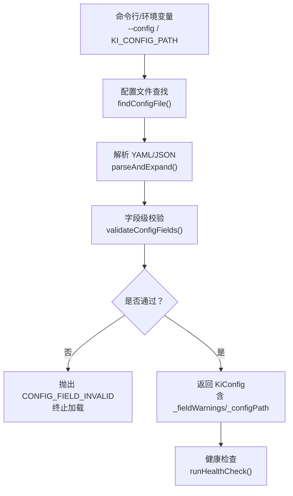
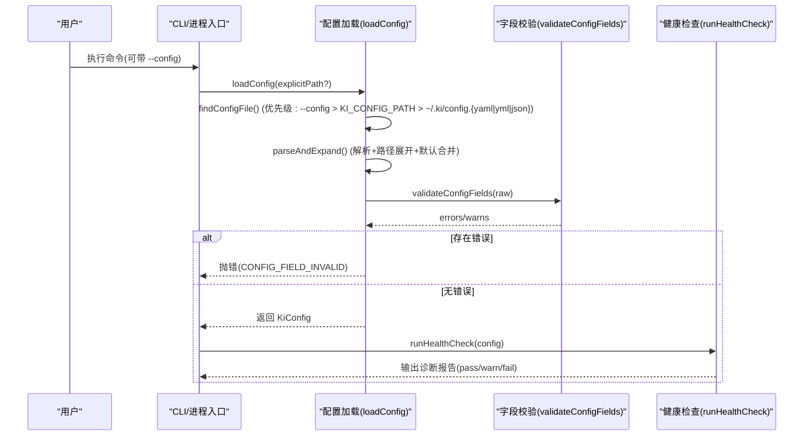
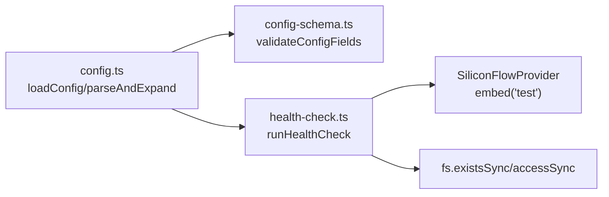

# 配置详解

<cite>
**本文引用的文件**
- [src/lib/config.ts](file://src/lib/config.ts)
- [src/lib/config-schema.ts](file://src/lib/config-schema.ts)
- [src/config.ts](file://src/config.ts)
- [docs/configuration.md](file://docs/configuration.md)
- [src/lib/health-check.ts](file://src/lib/health-check.ts)
- [.e2e-run/ki-config.yaml](file://.e2e-run/ki-config.yaml)
- [.e2e-run/ki-config.json](file://.e2e-run/ki-config.json)
</cite>

## 目录
1. [简介](#简介)
2. [项目结构](#项目结构)
3. [核心组件](#核心组件)
4. [架构总览](#架构总览)
5. [详细组件分析](#详细组件分析)
6. [依赖关系分析](#依赖关系分析)
7. [性能与容量建议](#性能与容量建议)
8. [故障排查指南](#故障排查指南)
9. [结论](#结论)
10. [附录：完整示例与最佳实践](#附录完整示例与最佳实践)

## 简介
本指南面向需要部署和运维知识索引系统的读者，系统化说明配置文件格式（YAML/JSON）、各配置项含义与默认值、关键配置项的优先级与覆盖规则，并提供完整的配置示例、最佳实践以及配置验证与错误诊断方法。重点覆盖以下关键配置项：
- dataDir（知识库目录）
- backupDir（备份目录）
- vectorDir（向量库目录）
- embedding.provider（嵌入提供商）
- embedding.model（模型名称）
- embedding.dimension（向量维度）
- scopeMode（作用域模式）

## 项目结构
配置体系由“加载解析 + 字段校验 + 健康诊断”三部分构成：
- 加载解析：负责查找配置文件、解析 YAML/JSON、展开路径、合并默认值、归一化取值。
- 字段校验：在语法解析成功后进行字段名、类型、取值合法性检查，失败时 fail-loud。
- 健康诊断：对配置、目录权限、embedding 连通性、维度匹配、zvec collection 状态等进行只读检查并输出报告。



图表来源
- [src/lib/config.ts:156-183](file://src/lib/config.ts#L156-L183)
- [src/lib/config.ts:252-385](file://src/lib/config.ts#L252-L385)
- [src/lib/config-schema.ts:323-339](file://src/lib/config-schema.ts#L323-L339)
- [src/lib/health-check.ts:150-240](file://src/lib/health-check.ts#L150-L240)

章节来源
- [src/lib/config.ts:1-21](file://src/lib/config.ts#L1-L21)
- [docs/configuration.md:7-18](file://docs/configuration.md#L7-L18)

## 核心组件
- 配置加载器（loadConfig/findConfigFile/parseAndExpand/buildDefaults）
- 字段校验器（validateConfigFields 及 schema 声明）
- 健康检查器（runHealthCheck/checkEmbedding/checkDir）
- CLI 模板生成（ki config init）

章节来源
- [src/lib/config.ts:156-183](file://src/lib/config.ts#L156-L183)
- [src/lib/config.ts:193-226](file://src/lib/config.ts#L193-L226)
- [src/lib/config.ts:252-385](file://src/lib/config.ts#L252-L385)
- [src/lib/config-schema.ts:125-166](file://src/lib/config-schema.ts#L125-L166)
- [src/lib/health-check.ts:150-240](file://src/lib/health-check.ts#L150-L240)
- [src/config.ts:128-177](file://src/config.ts#L128-L177)

## 架构总览
下图展示从命令行到配置生效的关键流程，包括优先级、解析、校验与诊断。



图表来源
- [src/lib/config.ts:156-183](file://src/lib/config.ts#L156-L183)
- [src/lib/config.ts:193-226](file://src/lib/config.ts#L193-L226)
- [src/lib/config.ts:252-385](file://src/lib/config.ts#L252-L385)
- [src/lib/config-schema.ts:323-339](file://src/lib/config-schema.ts#L323-L339)
- [src/lib/health-check.ts:150-240](file://src/lib/health-check.ts#L150-L240)

## 详细组件分析

### 配置文件位置与优先级
- 优先级顺序（找到即用，后项不生效）：
  1) --config <path> 命令行参数
  2) 环境变量 KI_CONFIG_PATH
  3) $HOME/.ki/config.yaml
  4) $HOME/.ki/config.yml
  5) $HOME/.ki/config.json
  6) 内置默认值（无配置文件时）
- 支持 YAML 与 JSON 两种格式，结构完全一致；读取 .json 时会提示迁移到 YAML。

章节来源
- [docs/configuration.md:7-18](file://docs/configuration.md#L7-L18)
- [src/lib/config.ts:156-183](file://src/lib/config.ts#L156-L183)
- [src/lib/config.ts:193-226](file://src/lib/config.ts#L193-L226)

### 顶层结构与关键字段
- dataDir：KB 源数据目录（存放各 scope 的原始文档）。默认 ~/.ki/kb。相对路径基于配置文件所在目录展开。
- backupDir：备份目录。默认 ~/.ki/backup。
- vectorDir：zvec 向量库 collection 目录。默认 ~/.ki/vector。⚠️ 增加字段需重建 vectorDir，会丢失该 scope 全部向量数据并需重新导入。
- embedding：嵌入提供商配置（provider/baseURL/model/dimension/apiKey）。
- scopeMode：scope 护栏模式（default | strict）。
- scopes：scope → KB 目录映射与行为开关（kbDir/wikiSync/clean/import）。
- mcp：MCP HTTP 传输默认值（仅 http.host/port/allowedHosts）。

章节来源
- [docs/configuration.md:27-179](file://docs/configuration.md#L27-L179)
- [src/lib/config.ts:125-136](file://src/lib/config.ts#L125-L136)
- [src/lib/config.ts:285-331](file://src/lib/config.ts#L285-L331)

### 关键配置项详解

#### dataDir（知识库目录）
- 类型：string
- 默认值：~/.ki/kb（未显式配置时）
- 说明：
  - 相对路径基于配置文件所在目录展开。
  - 运行时数据默认落用户目录，不随安装位置漂移。
  - 与 scopes.<scope>.kbDir 的回退关系：若某 scope 配置了 kbDir，则实际数据目录为 kbDir/kb/{scope}；否则回退到 dataDir/{scope}。
- 注意事项：
  - 不做存量路径继承（旧默认不再自动沿用），请迁移数据或在此显式配置。

章节来源
- [docs/configuration.md:45-53](file://docs/configuration.md#L45-L53)
- [src/lib/config.ts:285-291](file://src/lib/config.ts#L285-L291)
- [src/lib/config.ts:408-412](file://src/lib/config.ts#L408-L412)

#### backupDir（备份目录）
- 类型：string
- 默认值：~/.ki/backup
- 说明：ki backup 等命令写入的位置。

章节来源
- [docs/configuration.md:54-60](file://docs/configuration.md#L54-L60)
- [src/lib/config.ts:289-291](file://src/lib/config.ts#L289-L291)

#### vectorDir（向量库目录）
- 类型：string
- 默认值：~/.ki/vector
- 说明：zvec collection 目录，存储向量数据与索引。
- ⚠️ 重要：vector 的 schema 创建后不可 alter/drop，增加字段需删除 vectorDir 重建，将丢失该 scope 全部向量数据并需重新导入。

章节来源
- [docs/configuration.md:61-68](file://docs/configuration.md#L61-L68)
- [src/lib/config.ts:293-296](file://src/lib/config.ts#L293-L296)

#### embedding.provider（嵌入提供商）
- 类型：string
- 默认值：siliconflow
- 说明：当前支持 siliconflow 与 openai-compatible（OpenAI 兼容客户端），实际提供商由 baseURL 决定。
- 注意：provider 仅做字符串校验，不强制枚举；baseURL 必须为 http(s) URL。

章节来源
- [docs/configuration.md:69-90](file://docs/configuration.md#L69-L90)
- [src/lib/config.ts:116-123](file://src/lib/config.ts#L116-L123)
- [src/lib/config.ts:140-145](file://src/lib/config.ts#L140-L145)
- [src/lib/config-schema.ts:131-139](file://src/lib/config-schema.ts#L131-L139)

#### embedding.model（模型名称）
- 类型：string
- 默认值：Qwen/Qwen3-Embedding-8B
- 说明：用于调用 embedding API 的模型标识。

章节来源
- [docs/configuration.md:73-79](file://docs/configuration.md#L73-L79)
- [src/lib/config.ts:140-145](file://src/lib/config.ts#L140-L145)

#### embedding.dimension（向量维度）
- 类型：number（正整数）
- 默认值：4096
- 说明：必须等于 collection.dimension（kisearch 固定 4096）。维度不匹配会在健康检查中暴露。
- 校验：必须为正整数；非法值将导致 CONFIG_FIELD_INVALID。

章节来源
- [docs/configuration.md:73-79](file://docs/configuration.md#L73-L79)
- [src/lib/config.ts:140-145](file://src/lib/config.ts#L140-L145)
- [src/lib/config-schema.ts:131-139](file://src/lib/config-schema.ts#L131-L139)
- [src/lib/health-check.ts:92-104](file://src/lib/health-check.ts#L92-L104)

#### scopeMode（作用域模式）
- 类型：'default' | 'strict'
- 默认值：default
- 说明：
  - default：允许使用未在 scopes 显式注册的 scope（按需传入 scope 名即可）。
  - strict：scopes 的 key 兼作 scope 白名单，必须显式传入已注册的 scope，否则报错（fail-loud）。
- 注意：除 'strict' 外其他值（含缺省/非法值）一律归为 'default'。

章节来源
- [docs/configuration.md:92-101](file://docs/configuration.md#L92-L101)
- [src/lib/config.ts:310-312](file://src/lib/config.ts#L310-L312)
- [src/lib/config.ts:459-485](file://src/lib/config.ts#L459-L485)
- [src/lib/config-schema.ts:141-141](file://src/lib/config-schema.ts#L141-L141)

### 配置项校验与错误处理
- 校验时机：在 YAML/JSON 语法解析成功后、宽容归一化之前进行字段级校验。
- 校验范围：字段名（未知字段报错并附相近建议）、类型（标量/对象/数组）、取值（枚举/端口范围/http URL/正整数等）。
- 行为策略：
  - 错误（errors）：阻断加载，抛出 CONFIG_FIELD_INVALID，一次性列出最多 10 处问题。
  - 告警（warns）：不阻断加载，如废弃字段、YAML 裸写 null 的 scope 条目、空字符串字段等，最终在 ki doctor 报告中呈现。
- 常见错误示例：
  - 拼写错误字段名（如 datadir）→ 报错并给出 dataDir 建议。
  - dimension 写为字符串 → 报错期望数字。
  - 只写键名未赋值（dataDir: ）→ 报错提示“实际为 null”。
  - 取值非法（scopeMode: strick、port 越界、baseURL 非 http(s)）→ 报错。

章节来源
- [src/lib/config-schema.ts:1-15](file://src/lib/config-schema.ts#L1-L15)
- [src/lib/config-schema.ts:125-166](file://src/lib/config-schema.ts#L125-L166)
- [src/lib/config-schema.ts:174-274](file://src/lib/config-schema.ts#L174-L274)
- [src/lib/config.ts:266-278](file://src/lib/config.ts#L266-L278)
- [docs/configuration.md:234-262](file://docs/configuration.md#L234-L262)

### 配置文件的优先级与覆盖规则
- 配置文件查找优先级：--config > KI_CONFIG_PATH > ~/.ki/config.yaml > ~/.ki/config.yml > ~/.ki/config.json > 内置默认值。
- 路径展开规则：$HOME / ~ 展开为用户目录；相对路径相对于配置文件所在目录展开。
- 默认值合并：
  - dataDir/backupDir：未显式配置时使用 resolveDefaultDataPaths 的默认值。
  - vectorDir：未显式配置时使用 ~/.ki/vector。
  - embedding：与内置 DEFAULT_EMBEDDING 合并，允许部分覆盖。
  - scopeMode：仅 'strict' 保留，其余归为 'default'。
- 环境变量：
  - KI_DATA_DIR：仅在 `ki config init` 模板生成时作为覆盖源，运行时不作为配置来源。
  - KI_CONFIG_PATH：可用于指定配置文件路径。

章节来源
- [src/lib/config.ts:1-21](file://src/lib/config.ts#L1-L21)
- [src/lib/config.ts:30-65](file://src/lib/config.ts#L30-L65)
- [src/lib/config.ts:156-183](file://src/lib/config.ts#L156-L183)
- [src/lib/config.ts:217-226](file://src/lib/config.ts#L217-L226)
- [src/lib/config.ts:285-331](file://src/lib/config.ts#L285-L331)
- [src/config.ts:48-55](file://src/config.ts#L48-L55)

### 配置模板与示例
- 模板生成：使用 `ki config init` 生成带注释的 YAML 模板到 $HOME/.ki/config.yaml，同时创建 dataDir/backupDir/vectorDir 目录。
- e2e 示例：仓库提供 YAML 与 JSON 两套等价示例，便于对照理解。

章节来源
- [src/config.ts:128-177](file://src/config.ts#L128-L177)
- [.e2e-run/ki-config.yaml:1-18](file://.e2e-run/ki-config.yaml#L1-L18)
- [.e2e-run/ki-config.json:1-17](file://.e2e-run/ki-config.json#L1-L17)

## 依赖关系分析
- 配置加载依赖：
  - fs/os/path 用于文件系统与路径操作。
  - yaml 库用于 YAML 解析。
  - config-schema 用于字段级校验。
- 健康检查依赖：
  - 通过 SiliconFlowProvider 发起一次最短请求，验证 URL 连通性、密钥有效性、维度匹配。
  - 目录检查：dataDir/backupDir/vectorDir 存在且可写。
  - zvec collection：检测 vectorDir 是否存在且非空。



图表来源
- [src/lib/config.ts:252-385](file://src/lib/config.ts#L252-L385)
- [src/lib/config-schema.ts:323-339](file://src/lib/config-schema.ts#L323-L339)
- [src/lib/health-check.ts:54-144](file://src/lib/health-check.ts#L54-L144)
- [src/lib/health-check.ts:150-240](file://src/lib/health-check.ts#L150-L240)

章节来源
- [src/lib/config.ts:252-385](file://src/lib/config.ts#L252-L385)
- [src/lib/config-schema.ts:125-166](file://src/lib/config-schema.ts#L125-L166)
- [src/lib/health-check.ts:54-144](file://src/lib/health-check.ts#L54-L144)

## 性能与容量建议
- vectorDir 重建成本：由于 schema 不可变更，新增字段需删除 vectorDir 重建，将导致该 scope 全部向量数据丢失并需重新导入。建议在规划阶段确定好字段集，避免频繁重建。
- embedding 调用开销：健康检查会发起一次真实请求（超时 8s，重试 1 次），避免常驻服务因瞬时抖动被拒绝启动。生产环境建议确保网络稳定与密钥正确。
- 目录 I/O：dataDir/backupDir/vectorDir 均需具备读写权限，建议使用本地高性能磁盘或挂载共享存储。

[本节为通用指导，不直接分析具体文件]

## 故障排查指南
- 配置加载失败：
  - 现象：出现 CONFIG_FIELD_INVALID，包含字段路径与错误信息，最多显示 10 条，超出提示“另有 N 处”。
  - 处理：根据错误提示修正字段名、类型或取值；参考 docs/configuration.md 的字段表。
- 字段告警：
  - 现象：ki doctor 输出“配置字段”告警，如废弃字段、null 的 scope 条目、空字符串字段。
  - 处理：按提示迁移或补齐配置；不影响运行但建议修复。
- embedding 连通性与维度：
  - 现象：健康检查报告 URL 连通性/密钥有效性/维度匹配失败。
  - 处理：检查 baseURL、apiKey、model、dimension；确保网络可达与密钥有效；维度需与实际模型返回一致。
- 目录权限：
  - 现象：dataDir/backupDir/vectorDir 不存在或无写权限。
  - 处理：创建目录并赋予写权限。
- MCP 启动预检：
  - 现象：ki mcp 启动时因健康检查失败而拒绝启动。
  - 处理：先运行 ki doctor 定位问题，修复后再启动。

章节来源
- [src/lib/config.ts:266-278](file://src/lib/config.ts#L266-L278)
- [src/lib/health-check.ts:54-144](file://src/lib/health-check.ts#L54-L144)
- [src/lib/health-check.ts:150-240](file://src/lib/health-check.ts#L150-L240)
- [docs/configuration.md:234-262](file://docs/configuration.md#L234-L262)

## 结论
本配置体系通过严格的字段校验与健康诊断，确保系统在启动前即发现并暴露配置问题，避免隐性错配导致的运行时故障。推荐在生产环境中：
- 使用 YAML 配置文件，并通过 `ki config init` 生成模板。
- 明确配置 dataDir/backupDir/vectorDir，并确保目录权限。
- 正确设置 embedding.provider/baseURL/model/dimension/apiKey，并使用环境变量引用 apiKey。
- 根据团队规范选择 scopeMode（default/strict）。
- 定期运行 ki doctor 进行健康检查，及时修复告警与错误。

[本节为总结，不直接分析具体文件]

## 附录：完整示例与最佳实践

### 完整配置示例（YAML）
以下为一份完整配置示例，涵盖 dataDir、backupDir、vectorDir、embedding、scopeMode、scopes、mcp 等字段。

```yaml
dataDir: /data/kb
backupDir: /data/ki-backup
vectorDir: /root/.ki/vector

embedding:
  provider: siliconflow
  baseURL: https://api.siliconflow.cn/v1
  model: Qwen/Qwen3-Embedding-8B
  dimension: 4096
  apiKey: ${SILICONFLOW_API_KEY}

scopeMode: default

scopes:
  monitor:
    kbDir: /data/kb
    wikiSync:
      enabled: true
      sourceDir: /repo/bk-monitor-wiki/wiki
    clean:
      enabled: true
      rules:
        bom: true
        frontmatter: true
        htmlComment: true
        mermaid: true
        codePath: true
        codeBlock: true
        emptyChunk: true
        keepShortSamples: true
      hooks: []
    import:
      extensions: [.md]
      maxFileSize: 1048576
  docs:
    kbDir: /data/kb

mcp:
  http:
    host: 127.0.0.1
    port: 7423
    allowedHosts: [localhost]
```

章节来源
- [docs/configuration.md:182-230](file://docs/configuration.md#L182-L230)

### 最佳实践建议
- 安全：
  - apiKey 优先使用环境变量引用 `${VAR_NAME}`，避免明文入库。
  - MCP token 只走 CLI 参数或环境变量，绝不写入配置文件。
- 稳定性：
  - 使用 scopeMode=strict 以限制 scope 白名单，避免误用未注册 scope。
  - 合理划分 dataDir/backupDir/vectorDir，确保独立存储与权限控制。
- 可维护性：
  - 使用 YAML 配置文件，配合 `ki config init` 生成模板，保持注释与结构清晰。
  - 定期运行 ki doctor，关注告警并及时修复。
- 迁移与升级：
  - 如需调整 embedding 模型或维度，确认 dimension 与实际模型返回一致。
  - 如需新增 vector schema 字段，需重建 vectorDir 并重新导入数据。

章节来源
- [docs/configuration.md:69-90](file://docs/configuration.md#L69-L90)
- [docs/configuration.md:166-179](file://docs/configuration.md#L166-L179)
- [src/lib/config.ts:228-248](file://src/lib/config.ts#L228-L248)
- [src/lib/health-check.ts:54-144](file://src/lib/health-check.ts#L54-L144)