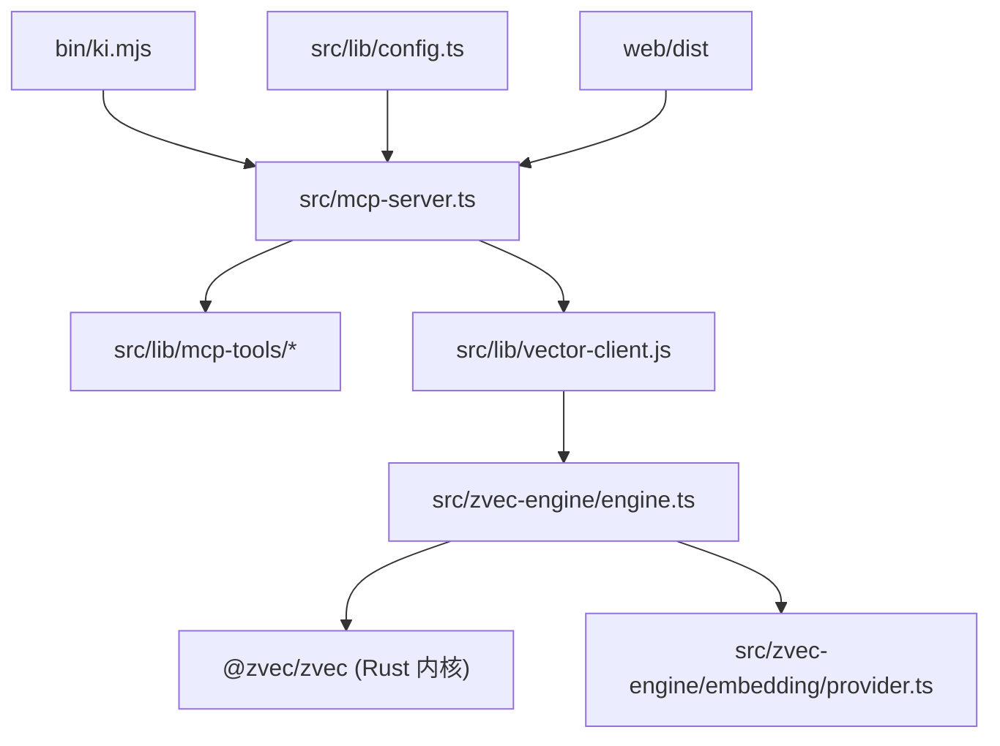
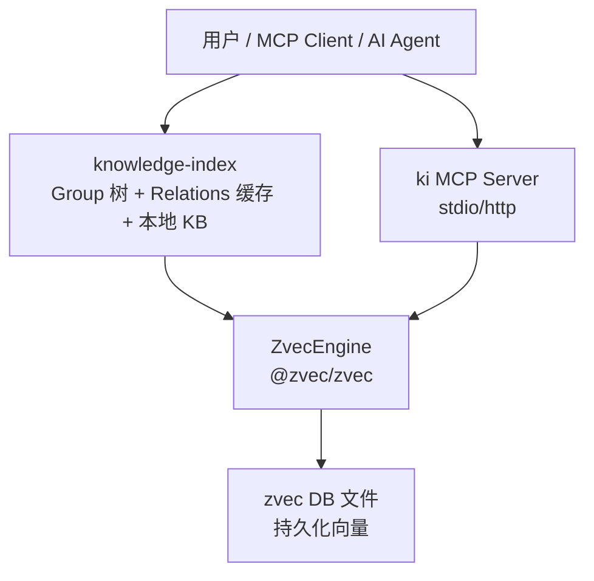
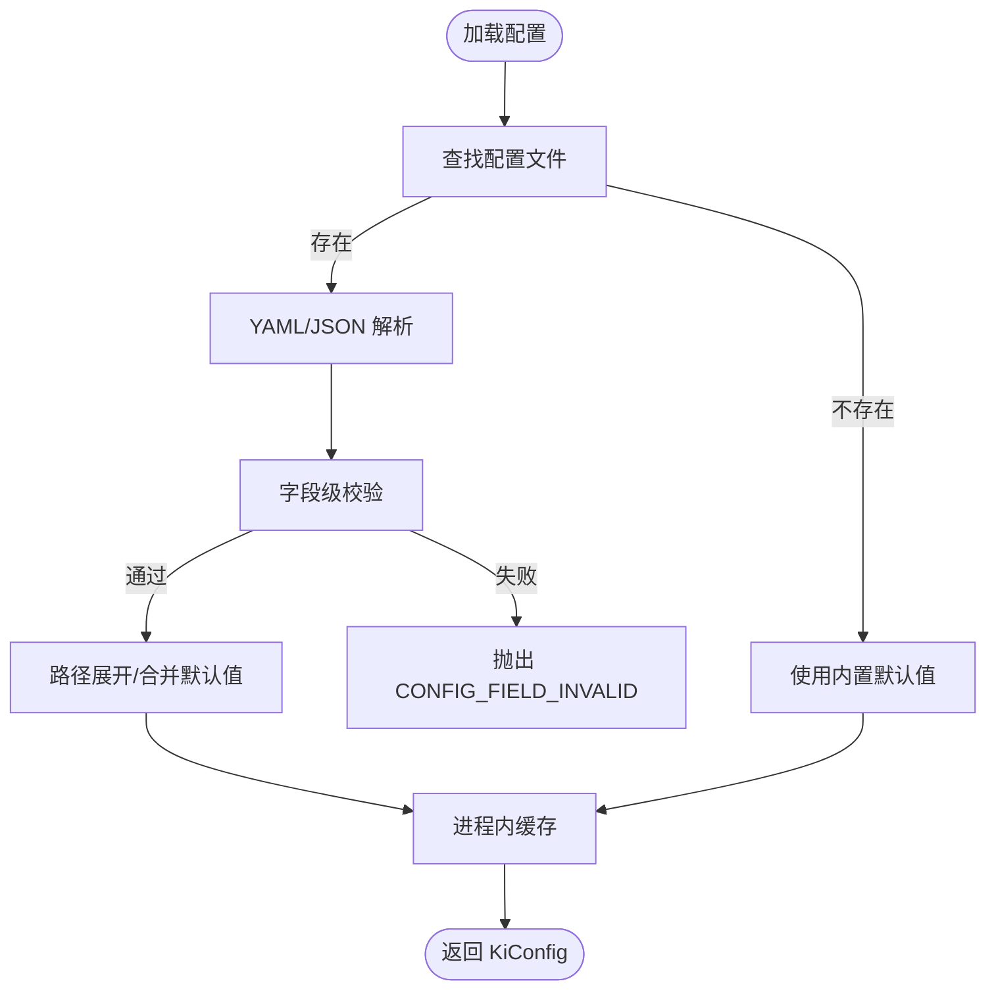
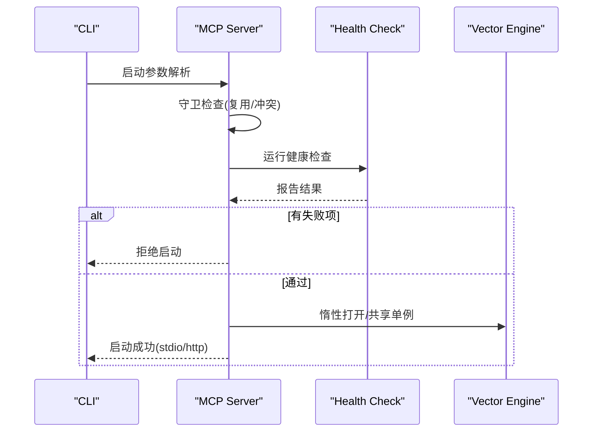
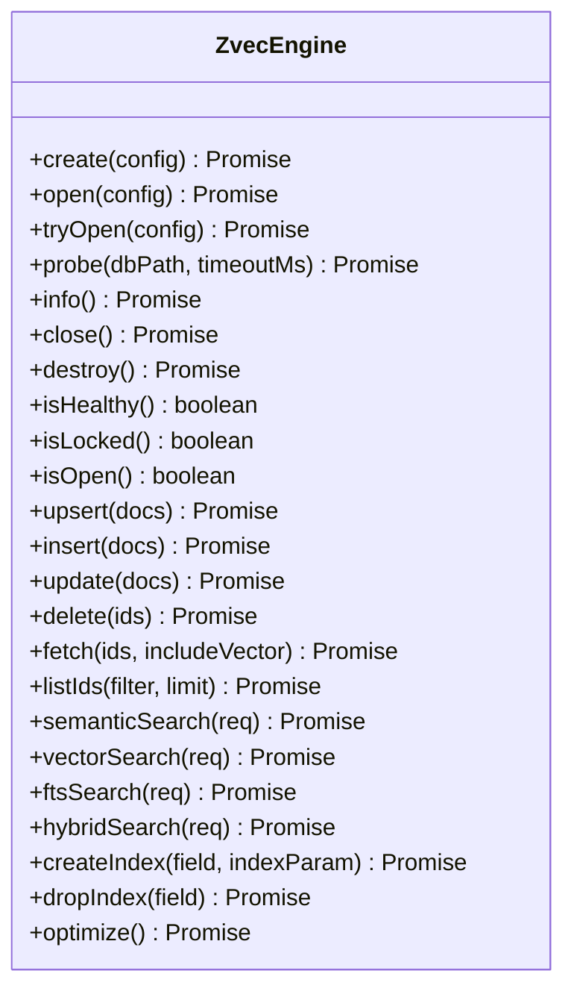
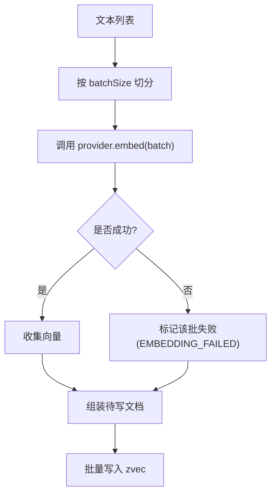
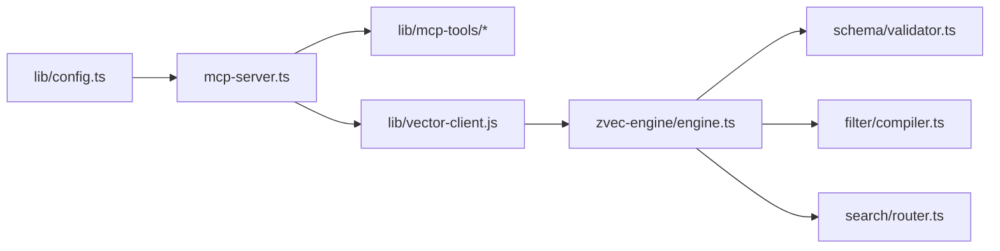

# 开发指南

<cite>
**本文引用的文件**
- [README.md](file://README.md)
- [package.json](file://package.json)
- [src/lib/config.ts](file://src/lib/config.ts)
- [docs/configuration.md](file://docs/configuration.md)
- [docs/architecture.md](file://docs/architecture.md)
- [src/mcp-server.ts](file://src/mcp-server.ts)
- [src/zvec-engine/engine.ts](file://src/zvec-engine/engine.ts)
- [src/zvec-engine/embedding/provider.ts](file://src/zvec-engine/embedding/provider.ts)
- [test/e2e-guide.md](file://test/e2e-guide.md)
- [test/zvec-engine.test.mjs](file://test/zvec-engine.test.mjs)
- [scripts/release.sh](file://scripts/release.sh)
</cite>

## 目录
1. [简介](#简介)
2. [项目结构](#项目结构)
3. [核心组件](#核心组件)
4. [架构总览](#架构总览)
5. [详细组件分析](#详细组件分析)
6. [依赖关系分析](#依赖关系分析)
7. [性能与优化](#性能与优化)
8. [测试指南](#测试指南)
9. [调试与日志](#调试与日志)
10. [插件扩展机制](#插件扩展机制)
11. [CI/CD 与发布流程](#cicd-与发布流程)
12. [版本管理策略](#版本管理策略)
13. [故障排查](#故障排查)
14. [结论](#结论)

## 简介
本指南面向开发者，覆盖项目结构、环境搭建、代码规范、贡献流程、测试方法（单元、端到端、zvec 引擎）、调试技巧、日志与性能分析、插件扩展（自定义嵌入提供商、MCP 工具扩展）、CI/CD 流水线与发布流程、版本管理策略。目标是帮助你在本地高效开发、稳定集成并安全发布。

## 项目结构
仓库采用“功能域 + 分层”组织：
- src：核心业务逻辑与 MCP Server、zvec 引擎封装、配置、存储等
- test：单元测试与 e2e 用例；zvec 引擎测试以 .mjs 形式运行
- docs：用户与开发者文档（配置、架构、工作流等）
- web：内置可视化前端（构建后由 MCP HTTP 模式提供静态页面）
- scripts：发布脚本等运维脚本
- zvec-mcp-server：独立的 Python MCP 服务示例（与本仓库 Node 侧能力互补）

图表来源
- [src/mcp-server.ts:54-70](file://src/mcp-server.ts#L54-L70)
- [src/zvec-engine/engine.ts:97-131](file://src/zvec-engine/engine.ts#L97-L131)
- [src/lib/config.ts:156-183](file://src/lib/config.ts#L156-L183)

章节来源
- [README.md:105-167](file://README.md#L105-L167)
- [docs/architecture.md:11-26](file://docs/architecture.md#L11-L26)

## 核心组件
- 配置系统：集中管理数据目录、向量库路径、Embedding 提供商、scope 护栏、MCP HTTP 默认值等，支持 YAML/JSON，字段级校验 fail-loud。
- MCP Server：暴露 11 个工具（查询、写入、管理、搜索、存储等），支持 stdio 与 HTTP 共享单例模式，具备鉴权、健康检查、守护进程重启能力。
- zvec 引擎封装：提供 create/open/probe 生命周期、upsert/insert/update/delete、语义/向量/全文/混合检索、索引操作，内嵌 EmbeddingProvider 抽象与批处理失败隔离。
- 知识库导入与导出：scan-kb import 原文直导、增量幂等追加；export 反向导出为 Wiki Markdown。
- 存储与索引：Group 树、Relation 缓存、本地 KB 原文、WAL 原子写、冷热治理与评分衰减。

章节来源
- [src/lib/config.ts:125-136](file://src/lib/config.ts#L125-L136)
- [src/mcp-server.ts:54-70](file://src/mcp-server.ts#L54-L70)
- [src/zvec-engine/engine.ts:243-326](file://src/zvec-engine/engine.ts#L243-L326)
- [docs/architecture.md:36-61](file://docs/architecture.md#L36-L61)

## 架构总览
kisearch 将结构化知识索引（Group/Relation）与向量检索（zvec）结合，通过 MCP 向 AI Agent 暴露能力，同时提供 CLI 与 Web 前端。

图表来源
- [docs/architecture.md:11-26](file://docs/architecture.md#L11-L26)

章节来源
- [docs/architecture.md:11-26](file://docs/architecture.md#L11-L26)

## 详细组件分析

### 配置系统（src/lib/config.ts）
- 配置文件查找优先级：命令行 --config > 环境变量 KI_CONFIG_PATH > ~/.ki/config.yaml/yml/json > 内置默认。
- 路径展开：支持 $HOME 与 ~，相对路径基于配置文件所在目录解析。
- 字段校验：语法正确后进行字段名/类型/取值校验，非法直接报错（fail-loud）。
- scope 护栏：default（自动创建）与 strict（必须显式注册）。
- embedding 配置：provider/baseURL/model/dimension/apiKey，apiKey 支持明文或 ${ENV_VAR} 引用。
- mcp.http：host/port/allowedHosts 仅作为传输默认值，token 不入配置。

图表来源
- [src/lib/config.ts:156-183](file://src/lib/config.ts#L156-L183)
- [src/lib/config.ts:252-384](file://src/lib/config.ts#L252-L384)

章节来源
- [src/lib/config.ts:156-183](file://src/lib/config.ts#L156-L183)
- [docs/configuration.md:7-17](file://docs/configuration.md#L7-L17)
- [docs/configuration.md:234-260](file://docs/configuration.md#L234-L260)

### MCP Server（src/mcp-server.ts）
- 启动守卫：检测已有健康实例复用；阻止 stdio 与 HTTP 单例并存争抢锁；非回环绑定强制鉴权。
- 预检：启动前执行健康检查（等价 ki doctor），失败拒绝启动。
- 工具注册：统一工厂 buildKiMcpServer 注册全部工具，HTTP 模式下每个会话新建实例但共享 vector-client 单例 engine。
- Token 管理：generate/list/update/delete，支持多 Token + scope 授权。
- 守护进程：restart/stop/status 子命令，后台常驻与优雅退出。

图表来源
- [src/mcp-server.ts:597-685](file://src/mcp-server.ts#L597-L685)
- [src/mcp-server.ts:492-558](file://src/mcp-server.ts#L492-L558)

章节来源
- [src/mcp-server.ts:54-70](file://src/mcp-server.ts#L54-L70)
- [src/mcp-server.ts:597-685](file://src/mcp-server.ts#L597-L685)

### zvec 引擎封装（src/zvec-engine/engine.ts）
- 生命周期：create/open/tryOpen/probe/close/destroy/isHealthy/isLocked/isOpen。
- 写入：upsert/insert/update/delete/fetch/listIds；embed 失败按小批隔离，成功项正常写入。
- 检索：semanticSearch/vectorSearch/ftsSearch/hybridSearch；filter 编译与白名单校验。
- 索引：createIndex/dropIndex/optimize。
- 错误体系：DimensionMismatchError/InvalidSchemaError/CollectionNotFoundError/WorkerCrashedError 等。

图表来源
- [src/zvec-engine/engine.ts:97-131](file://src/zvec-engine/engine.ts#L97-L131)
- [src/zvec-engine/engine.ts:243-326](file://src/zvec-engine/engine.ts#L243-L326)
- [src/zvec-engine/engine.ts:454-495](file://src/zvec-engine/engine.ts#L454-L495)

章节来源
- [src/zvec-engine/engine.ts:97-131](file://src/zvec-engine/engine.ts#L97-L131)
- [src/zvec-engine/engine.ts:243-326](file://src/zvec-engine/engine.ts#L243-L326)
- [src/zvec-engine/engine.ts:454-495](file://src/zvec-engine/engine.ts#L454-L495)

### 嵌入提供商抽象（src/zvec-engine/embedding/provider.ts）
- 定义 EmbeddingProvider 接口：dimension、embed(texts, opts)。
- 选项：retries、batchSize、timeoutMs、onProgress。
- 工程实践：engine 层按 EMBED_BATCH_SIZE=64 切分，失败粒度等于 provider 一次 HTTP 调用，便于定位抖动与重试。

图表来源
- [src/zvec-engine/engine.ts:330-450](file://src/zvec-engine/engine.ts#L330-L450)
- [src/zvec-engine/embedding/provider.ts:9-28](file://src/zvec-engine/embedding/provider.ts#L9-L28)

章节来源
- [src/zvec-engine/embedding/provider.ts:9-28](file://src/zvec-engine/embedding/provider.ts#L9-L28)
- [src/zvec-engine/engine.ts:330-450](file://src/zvec-engine/engine.ts#L330-L450)

## 依赖关系分析
- 运行时依赖：@modelcontextprotocol/sdk、@zvec/zvec、commander、jiti、yaml、zod。
- 构建产物：dist/zvec-engine 由 tsc 生成，MCP HTTP 模式需先构建 zvec 引擎。
- 模块耦合：
  - mcp-server 依赖 lib/mcp-tools/* 与 vector-client、health-check、version-guard、constants。
  - zvec-engine 依赖 filter/compiler、search/router、schema/validator、worker-protocol、proxy。
  - config 被多处读取，建议集中维护默认值与校验规则。

图表来源
- [src/mcp-server.ts:54-70](file://src/mcp-server.ts#L54-L70)
- [src/zvec-engine/engine.ts:27-33](file://src/zvec-engine/engine.ts#L27-L33)
- [src/lib/config.ts:156-183](file://src/lib/config.ts#L156-L183)

章节来源
- [package.json:42-49](file://package.json#L42-L49)
- [src/mcp-server.ts:54-70](file://src/mcp-server.ts#L54-L70)
- [src/zvec-engine/engine.ts:27-33](file://src/zvec-engine/engine.ts#L27-L33)

## 性能与优化
- 写入批处理：DEFAULT_WRITE_BATCH_SIZE=100；embedding 小批 EMBED_BATCH_SIZE=64，失败粒度最小化。
- 去重优化：同批内相同 text 只 embed 一次，避免重复 HTTP 调用。
- 空闲释放：长驻进程在向量库空闲超时后自动 closeEngine 释放 LOCK，允许多 stdio 实例错开共享。
- 检索路由：根据 schema 选择 dense/fts/hybrid，减少不必要计算。
- 建议：
  - 大批量写入优先使用 bulk-store/bulk-sync-relation。
  - 合理设置 threshold/limit 控制结果集大小。
  - 监控 embedding provider 的超时与限流，必要时调整 batchSize。

章节来源
- [src/zvec-engine/engine.ts:62-66](file://src/zvec-engine/engine.ts#L62-L66)
- [src/zvec-engine/engine.ts:330-450](file://src/zvec-engine/engine.ts#L330-L450)
- [src/mcp-server.ts:683-685](file://src/mcp-server.ts#L683-L685)

## 测试指南

### 单元测试
- 运行方式：npm run test:all 或针对单个测试文件。
- zvec 引擎测试：node --test test/zvec-engine*.test.mjs，覆盖 create/upsert/检索/probe/错误路径。
- 建议：新增功能需补充对应单元测试，确保边界条件与错误分支覆盖。

章节来源
- [package.json:16-32](file://package.json#L16-L32)
- [test/zvec-engine.test.mjs:1-11](file://test/zvec-engine.test.mjs#L1-L11)

### 端到端测试
- 使用 test/fixtures/mock-wiki 模拟外部 wiki，无需真实服务即可验证完整链路。
- 步骤包括初始化配置、全量导入、索引查询、关系写入、语义搜索、导出、差异检测、增量导入、备份还原等。
- 参考 e2e 指南逐步执行并核对输出与文件结构。

章节来源
- [test/e2e-guide.md:1-24](file://test/e2e-guide.md#L1-L24)
- [test/e2e-guide.md:27-80](file://test/e2e-guide.md#L27-L80)
- [test/e2e-guide.md:178-273](file://test/e2e-guide.md#L178-L273)
- [test/e2e-guide.md:630-716](file://test/e2e-guide.md#L630-L716)

### zvec 引擎测试方法
- 冒烟测试：S-01 Schema 校验、S-02 Filter 编译、S-06 全链路（create→upsert→检索→close→reopen→probe）。
- probe 状态：NOT_FOUND/健康/locked；空目录误判防护。
- 失败隔离：部分 embedding 失败不影响其他文档写入。

章节来源
- [test/zvec-engine.test.mjs:66-107](file://test/zvec-engine.test.mjs#L66-L107)
- [test/zvec-engine.test.mjs:109-199](file://test/zvec-engine.test.mjs#L109-L199)
- [test/zvec-engine.test.mjs:201-248](file://test/zvec-engine.test.mjs#L201-L248)
- [test/zvec-engine.test.mjs:260-333](file://test/zvec-engine.test.mjs#L260-L333)

## 调试与日志
- 启动预检：ki mcp 启动前执行健康检查，失败项拒绝启动，警告项继续启动。
- 日志位置：stderr 输出诊断信息（如提示、警告、错误）；stdout 保持协议纯净。
- 常见问题：
  - 端口占用：修改 mcp.http.port 或 kill 占用进程。
  - Token 缺失：非回环绑定需配置 Token（环境变量或托管文件）。
  - 维度不匹配：embedding.dimension 必须等于 collection.dimension。
  - 向量库锁：多实例争用导致阻塞，使用 HTTP 单例或等待空闲释放。
- 调试技巧：
  - 使用 ki doctor 快速诊断配置与环境。
  - 通过 ki mcp --status 查看实例状态与健康。
  - 对长耗时工具调用，关注 withTimeout 超时错误码 TOOL_TIMEOUT。

章节来源
- [src/mcp-server.ts:660-685](file://src/mcp-server.ts#L660-L685)
- [src/lib/mcp-tools/util.ts:11-42](file://src/lib/mcp-tools/util.ts#L11-L42)
- [docs/configuration.md:234-260](file://docs/configuration.md#L234-L260)

## 插件扩展机制

### 自定义嵌入提供商
- 实现 EmbeddingProvider 接口：提供 dimension 与 embed(texts, opts)。
- 集成方式：在 ZvecEngine.create/open 时传入自定义 embedding 实例；engine 层按批次调用 provider.embed。
- 注意事项：
  - dimension 必须与 collection.dimension 一致。
  - 合理设置 batchSize/timeoutMs/retries，避免限流与超时。
  - 失败会标记 EMBEDDING_FAILED，不影响其他文档写入。

章节来源
- [src/zvec-engine/embedding/provider.ts:9-28](file://src/zvec-engine/embedding/provider.ts#L9-L28)
- [src/zvec-engine/engine.ts:330-450](file://src/zvec-engine/engine.ts#L330-L450)

### MCP 工具扩展开发
- 注册模式：在 buildKiMcpServer 中调用 registerXxxTool(server)，每个工具包含 schema、handler、超时保护。
- 超时保护：withTimeout 包装异步任务，READ/WRITE/BULK 预设超时阈值。
- 安全约束：零破坏性原则（不含 delete/force/overwrite），scope 校验复用 validateScope。
- 建议：
  - 新增工具遵循现有命名与返回格式约定。
  - 输入参数使用 zod 定义，保证 JSON Schema 自动生成。
  - 对可能长时间运行的操作添加超时与进度回调。

章节来源
- [src/mcp-server.ts:54-70](file://src/mcp-server.ts#L54-L70)
- [src/lib/mcp-tools/util.ts:11-42](file://src/lib/mcp-tools/util.ts#L11-L42)
- [docs/architecture.md:28-35](file://docs/architecture.md#L28-L35)

## CI/CD 与发布流程
- 本地构建与测试：npm install → npm run build:zvec-engine → npm test。
- 发布脚本：scripts/release.sh <version> [prerelease]，执行步骤包括版本校验、工作区干净检查、关键文件检查、运行测试、打包、创建 git tag、推送、创建 GitHub Release。
- 安装方式：通过 npm install -g 指定 release tarball URL。

章节来源
- [scripts/release.sh:1-142](file://scripts/release.sh#L1-L142)
- [README.md:396-405](file://README.md#L396-L405)

## 版本管理策略
- 版本号：package.json version 与发布脚本严格校验一致。
- Tag 管理：发布脚本创建 v<version> tag 并推送远程，支持覆盖已存在 tag。
- 预发布：支持 prerelease 标志创建预发布版本。
- 建议：
  - 发布前确保所有测试通过且工作区干净。
  - 使用语义化版本（主.次.修订-预发布标识）。
  - 发布后更新 README 中的版本徽章与安装说明。

章节来源
- [scripts/release.sh:18-24](file://scripts/release.sh#L18-L24)
- [scripts/release.sh:65-78](file://scripts/release.sh#L65-L78)
- [scripts/release.sh:79-137](file://scripts/release.sh#L79-L137)

## 故障排查
- 配置问题：CONFIG_FIELD_INVALID 错误，检查字段名/类型/取值；使用 ki doctor 诊断。
- 向量库问题：
  - CollectionNotFoundError：dbPath 不存在或为空目录。
  - DimensionMismatchError：embedding.dimension 与 collection.dimension 不一致。
  - WorkerCrashedError：worker 未打开或崩溃，检查进程状态。
- MCP 问题：
  - 端口占用：修改端口或终止占用进程。
  - Token 缺失：非回环绑定需配置 Token。
  - 实例冲突：stdio 与 HTTP 单例并存会争抢锁，迁移至 URL 接入。
- 性能问题：
  - embedding 超时：调整 batchSize/timeoutMs，检查 provider 可用性。
  - 检索慢：合理设置 threshold/limit，避免全量扫描。

章节来源
- [src/zvec-engine/engine.ts:112-131](file://src/zvec-engine/engine.ts#L112-L131)
- [src/zvec-engine/engine.ts:499-508](file://src/zvec-engine/engine.ts#L499-L508)
- [src/mcp-server.ts:186-211](file://src/mcp-server.ts#L186-L211)
- [docs/configuration.md:234-260](file://docs/configuration.md#L234-L260)

## 结论
kisearch 通过结构化索引与向量检索的结合，为 AI Agent 提供了精准、可追溯的知识服务能力。开发者应遵循配置校验、错误隔离、超时保护与零破坏性原则进行扩展与集成。借助完善的测试与发布流程，可保障系统的稳定性与可维护性。建议在扩展时优先复用现有抽象（EmbeddingProvider、MCP 工具注册），并在测试中覆盖边界与异常路径。