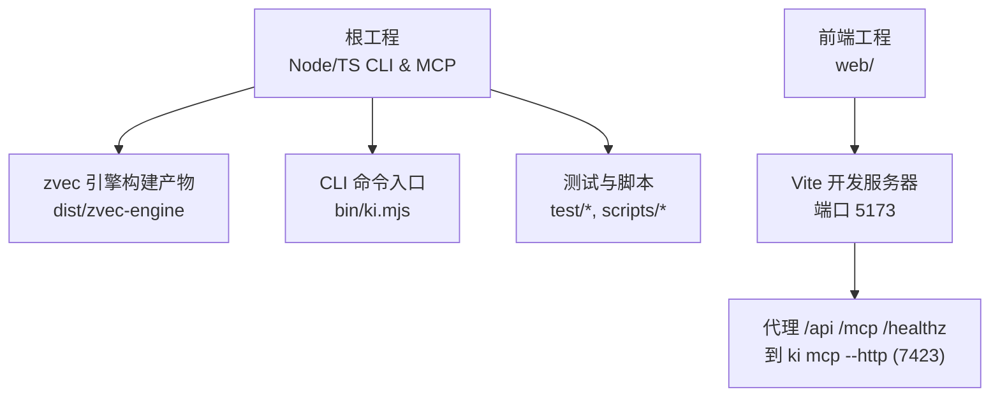
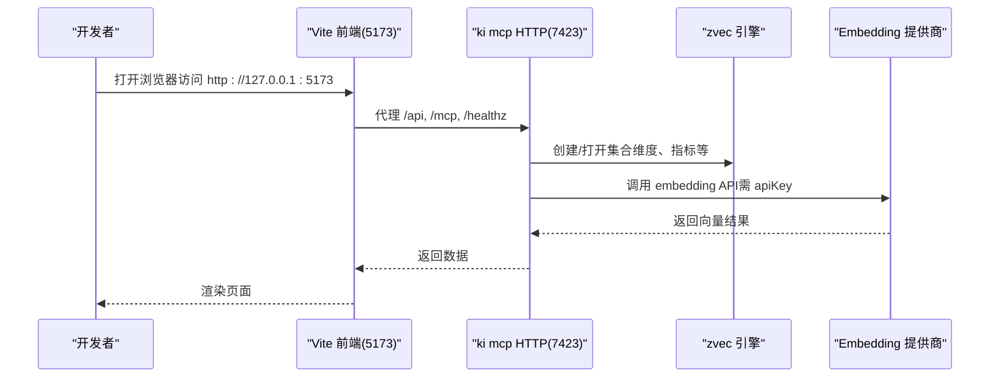
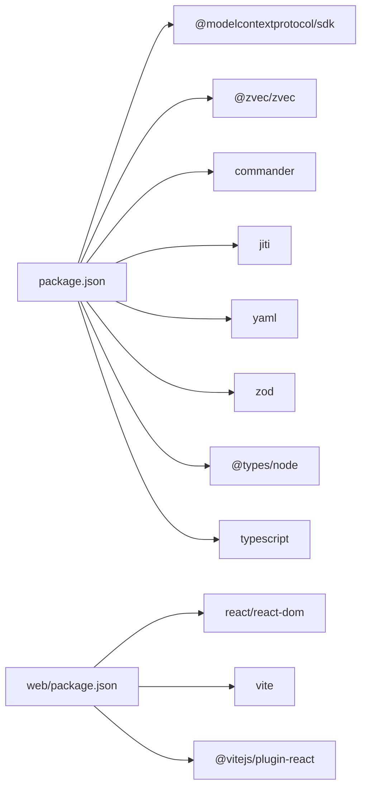

# 开发环境搭建

<cite>
**本文引用的文件**
- [package.json](file://package.json)
- [tsconfig.json](file://tsconfig.json)
- [tsconfig.src.json](file://tsconfig.src.json)
- [README.md](file://README.md)
- [web/package.json](file://web/package.json)
- [web/vite.config.ts](file://web/vite.config.ts)
- [src/config.ts](file://src/config.ts)
- [src/lib/vector-client.ts](file://src/lib/vector-client.ts)
</cite>

## 目录
1. [简介](#简介)
2. [项目结构](#项目结构)
3. [核心组件](#核心组件)
4. [架构总览](#架构总览)
5. [详细组件分析](#详细组件分析)
6. [依赖分析](#依赖分析)
7. [性能注意事项](#性能注意事项)
8. [故障排查指南](#故障排查指南)
9. [结论](#结论)
10. [附录](#附录)

## 简介
本指南面向首次参与知识索引器（kisearch）项目的开发者，目标是帮助你在本地快速搭建可运行的开发环境，覆盖 Node.js 版本要求、依赖安装、TypeScript 编译配置、VS Code 调试与插件建议、环境变量设置、代码规范约定、Git 工作流，以及常见环境问题排查。

## 项目结构
仓库采用“主工程 + 子前端工程”的布局：
- 根目录为 Node/TS CLI 与 MCP 服务工程，提供命令入口、向量引擎构建产物输出、测试脚本等。
- web 子目录为独立 Vite + React 前端工程，用于可视化浏览与调试。

图表来源
- [package.json:1-68](file://package.json#L1-L68)
- [web/vite.config.ts:1-30](file://web/vite.config.ts#L1-L30)

章节来源
- [package.json:1-68](file://package.json#L1-L68)
- [web/vite.config.ts:1-30](file://web/vite.config.ts#L1-L30)

## 核心组件
- Node.js 运行时与包管理
  - 要求 Node.js >= 18（由 engines 字段声明）。
  - 使用 npm 进行依赖管理与脚本执行。
- TypeScript 编译
  - 根 tsconfig.json 定义通用编译选项，输出至 dist。
  - zvec 引擎单独 tsconfig.src.json，输出至 dist/zvec-engine。
- 前端工程
  - web 子工程基于 Vite + React，开发时通过代理将 /api、/mcp、/healthz 转发到本机 ki mcp HTTP 服务（默认 7423）。

章节来源
- [package.json:60-66](file://package.json#L60-L66)
- [tsconfig.json:1-16](file://tsconfig.json#L1-L16)
- [tsconfig.src.json:1-24](file://tsconfig.src.json#L1-L24)
- [web/vite.config.ts:14-23](file://web/vite.config.ts#L14-L23)

## 架构总览
下图展示开发期关键进程与端口关系：
- 开发者在 web 目录启动 Vite 开发服务器（5173），请求被代理到 ki mcp HTTP 服务（7423）。
- 后端通过 zvec 引擎进行向量检索，读取配置与 Embedding 提供商密钥完成向量化。

图表来源
- [web/vite.config.ts:14-23](file://web/vite.config.ts#L14-L23)
- [src/lib/vector-client.ts:269-304](file://src/lib/vector-client.ts#L269-L304)

## 详细组件分析

### Node.js 与依赖安装
- 版本要求
  - Node.js >= 18（见 engines 字段）。
- 安装步骤
  - 克隆仓库后，在根目录执行依赖安装。
  - 构建 zvec 引擎层（必需，否则运行时会报找不到模块）。
- 常用脚本
  - 构建：tsc -p tsconfig.src.json（输出到 dist/zvec-engine）。
  - 测试：分别运行单元测试与 zvec 引擎测试。

章节来源
- [package.json:60-66](file://package.json#L60-L66)
- [package.json:9-33](file://package.json#L9-L33)

### TypeScript 编译配置
- 根配置（tsconfig.json）
  - 目标与模块：ES2022。
  - 模块解析：bundler。
  - 严格模式开启，跳过库检查。
  - 输出目录：dist；包含 src/**/*.ts，排除 node_modules、dist、kb、test。
- zvec 引擎配置（tsconfig.src.json）
  - 目标与模块：ES2022。
  - 输出目录：dist/zvec-engine；根目录：src/zvec-engine。
  - 启用声明与源映射，隔离模块等。

章节来源
- [tsconfig.json:1-16](file://tsconfig.json#L1-L16)
- [tsconfig.src.json:1-24](file://tsconfig.src.json#L1-L24)

### VS Code 推荐设置与调试
- 推荐设置
  - 使用 ESLint/Prettier 统一风格（可选）。
  - 启用 TypeScript 类型检查与自动修复。
  - 使用 Node.js 调试器配合 npx jiti 直接运行 TS 脚本。
- 调试要点
  - 使用 Node “附加到进程”或“Node.js 终端”方式调试 CLI。
  - 前端调试：在 web 目录启动 Vite 开发服务器，浏览器中打开 Sources 面板断点。
  - 若需要调试 MCP HTTP 服务，先启动 ki mcp --http，再在浏览器或客户端连接。

[本节为通用实践说明，不直接分析具体文件]

### 环境变量与配置
- 配置文件生成
  - 使用命令初始化配置文件模板（YAML），包含数据目录、备份目录、向量目录、Embedding 提供商与 scope 模式等。
- 关键环境变量
  - Embedding 提供商密钥必须通过配置注入（明文或引用环境变量），缺失会抛出错误并阻止启动。
- 健康检查
  - 启动前会执行预检（等价 doctor），报告缺失密钥、维度不匹配等问题。

章节来源
- [src/config.ts:1-36](file://src/config.ts#L1-L36)
- [src/lib/vector-client.ts:269-285](file://src/lib/vector-client.ts#L269-L285)
- [README.md:121-141](file://README.md#L121-L141)

### IDE 插件推荐
- TypeScript/JavaScript
  - TypeScript 语言服务（内置）、ESLint、Prettier、Path Intellisense。
- 前端
  - React 语法高亮、Vite 相关提示（可选）。
- 其他
  - YAML/JSON 格式校验、Markdown 预览（便于阅读文档）。

[本节为通用实践说明，不直接分析具体文件]

### 项目结构组织与代码规范约定
- 目录组织
  - src：核心逻辑与命令实现。
  - test：单元测试与 e2e 测试。
  - web：前端工程。
  - docs：用户与开发者文档。
  - scripts：辅助脚本。
- 代码规范
  - 遵循 TypeScript 严格模式。
  - 建议使用统一的 Lint/格式化规则（可在项目中引入 ESLint/Prettier）。
  - 提交信息建议遵循 Conventional Commits（可结合 pre-commit 钩子）。

[本节为通用实践说明，不直接分析具体文件]

### Git 工作流
- 分支策略
  - 主分支保护，功能分支开发，合并前通过 CI 检查。
- 提交规范
  - 使用 Conventional Commits 规范（feat/fix/docs/chore 等）。
- 预提交检查
  - 可配置 pre-commit 钩子进行敏感信息检测、提交信息格式检查等。

[本节为通用实践说明，不直接分析具体文件]

## 依赖分析
- 运行时依赖
  - MCP SDK、zvec 引擎、命令行框架、YAML 解析、Schema 校验等。
- 开发依赖
  - TypeScript、@types/node。
- 前端依赖
  - React、React Router、Vite、Mermaid、Marked 等。

图表来源
- [package.json:42-66](file://package.json#L42-L66)
- [web/package.json:12-28](file://web/package.json#L12-L28)

章节来源
- [package.json:42-66](file://package.json#L42-L66)
- [web/package.json:12-28](file://web/package.json#L12-L28)

## 性能注意事项
- 向量维度一致性
  - 确保 Embedding 模型维度与向量集合维度一致，避免重建失败或检索异常。
- 批量写入
  - 优先使用批量接口减少网络与 I/O 开销。
- 缓存与冷热治理
  - 利用 Relation 热缓存与评分衰减机制提升热点查询性能。

[本节为通用实践说明，不直接分析具体文件]

## 故障排查指南
- 无法找到 zvec 引擎模块
  - 现象：运行时报 Cannot find module ../../dist/zvec-engine/index.js。
  - 处理：执行构建 zvec 引擎的命令，确保 dist/zvec-engine 存在。
- Embedding 密钥未配置
  - 现象：启动或写入时报 embedding.apiKey 未配置。
  - 处理：在配置文件中填写明文密钥或使用 ${VAR_NAME} 引用环境变量，并确保 MCP 客户端 env 正确传入。
- 端口冲突
  - 现象：Vite 或 ki mcp 启动失败。
  - 处理：确认 5173（前端）与 7423（MCP HTTP）未被占用，必要时调整端口。
- 向量维度不匹配
  - 现象：doctor 或建库时报维度不一致。
  - 处理：核对 Embedding 模型 dimension 与集合配置一致，必要时重建向量库。

章节来源
- [README.md:116-118](file://README.md#L116-L118)
- [src/lib/vector-client.ts:269-285](file://src/lib/vector-client.ts#L269-L285)
- [web/vite.config.ts:14-23](file://web/vite.config.ts#L14-L23)

## 结论
按照本指南完成 Node.js 环境准备、依赖安装、TypeScript 编译配置、前端开发与调试、环境变量与配置设置后，即可在本机完整运行知识索引器的 CLI、MCP 服务与可视化前端。建议在团队内统一代码规范与 Git 工作流，并结合预提交钩子提升代码质量与安全性。

## 附录
- 快速开始参考
  - 安装与初始化、导入知识库、启动 MCP HTTP 与前端、查看状态与 Token 管理等步骤详见 README。
- 文档导航
  - 操作指南、架构说明、MCP HTTP 模式、向量引擎设计、错误处理与工作流等文档位于 docs 目录。

章节来源
- [README.md:105-167](file://README.md#L105-L167)
- [README.md:323-349](file://README.md#L323-L349)