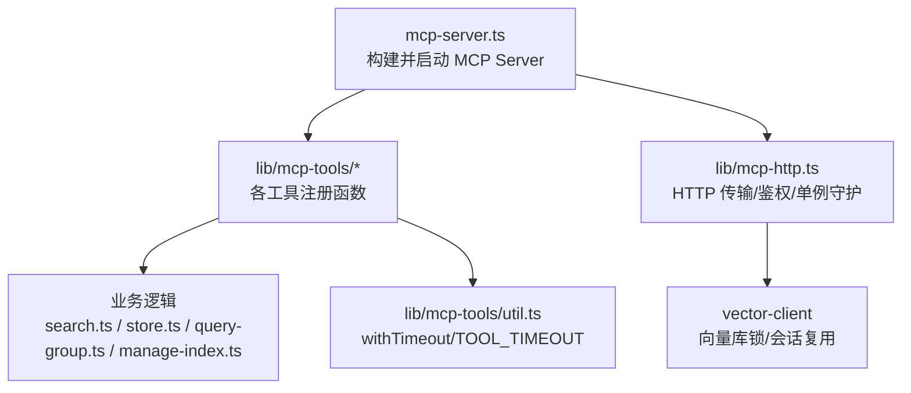
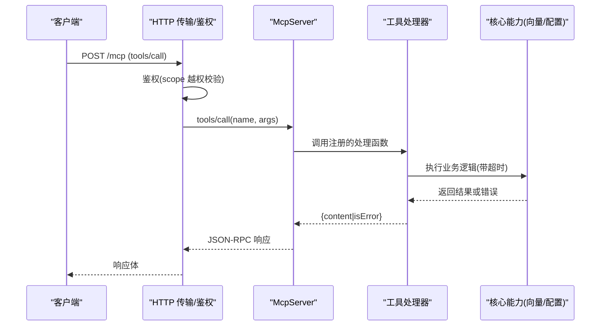
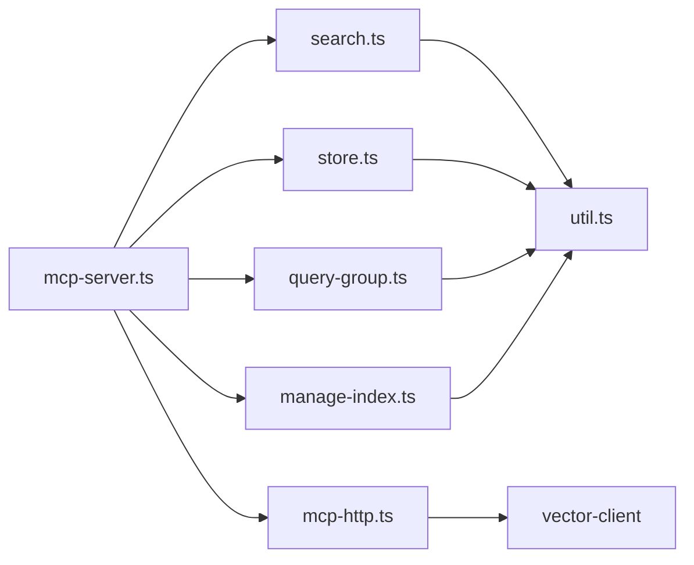

# MCP 工具扩展

<cite>
**本文引用的文件**
- [src/mcp-server.ts](file://src/mcp-server.ts)
- [src/lib/mcp-http.ts](file://src/lib/mcp-http.ts)
- [src/lib/mcp-tools/util.ts](file://src/lib/mcp-tools/util.ts)
- [src/lib/mcp-tools/search.ts](file://src/lib/mcp-tools/search.ts)
- [src/lib/mcp-tools/store.ts](file://src/lib/mcp-tools/store.ts)
- [src/lib/mcp-tools/query-group.ts](file://src/lib/mcp-tools/query-group.ts)
- [src/lib/mcp-tools/manage-index.ts](file://src/lib/mcp-tools/manage-index.ts)
- [docs/mcp-http.md](file://docs/mcp-http.md)
</cite>

## 目录
1. [简介](#简介)
2. [项目结构](#项目结构)
3. [核心组件](#核心组件)
4. [架构总览](#架构总览)
5. [详细组件分析](#详细组件分析)
6. [依赖关系分析](#依赖关系分析)
7. [性能与超时](#性能与超时)
8. [权限控制与安全](#权限控制与安全)
9. [日志与可观测性](#日志与可观测性)
10. [调试技巧与常见问题](#调试技巧与常见问题)
11. [结论](#结论)
12. [附录：扩展示例清单](#附录扩展示例清单)

## 简介
本指南面向需要在 kisearch 中开发自定义 MCP 工具的工程师，系统说明工具接口定义、参数校验、错误处理、注册流程、生命周期管理以及与核心系统的集成方式。文档同时覆盖权限控制、日志记录、性能优化最佳实践，并提供搜索工具、存储工具等完整实现路径参考，以及调试技巧与常见问题解决方案。

## 项目结构
MCP 工具扩展位于 src/lib/mcp-tools 下，每个工具一个模块，统一通过 server.tool(...) 注册到 McpServer。服务启动入口在 src/mcp-server.ts，HTTP 传输与鉴权在 src/lib/mcp-http.ts，工具层公共能力（超时、错误）在 util.ts。



图表来源
- [src/mcp-server.ts:54-70](file://src/mcp-server.ts#L54-L70)
- [src/lib/mcp-http.ts:10-15](file://src/lib/mcp-http.ts#L10-L15)
- [src/lib/mcp-tools/util.ts:20-42](file://src/lib/mcp-tools/util.ts#L20-L42)

章节来源
- [src/mcp-server.ts:54-70](file://src/mcp-server.ts#L54-L70)
- [src/lib/mcp-http.ts:10-15](file://src/lib/mcp-http.ts#L10-L15)

## 核心组件
- McpServer 构建与工具注册：buildKiMcpServer 集中注册所有工具，支持传入 authScopes 用于枚举类工具的权限过滤。
- HTTP 共享单例：startHttpMcpServer 提供 Streamable HTTP 传输、鉴权、会话管理与进程守护。
- 工具公共能力：withTimeout 为工具处理器提供超时保护；TOOL_TIMEOUT 提供 READ/WRITE/BULK 三类默认超时。
- 典型工具示例：ki_search、ki_store、ki_query_group、ki_manage_index_* 等，均遵循统一的 schema + handler + 超时包装模式。

章节来源
- [src/mcp-server.ts:54-70](file://src/mcp-server.ts#L54-L70)
- [src/lib/mcp-http.ts:64-81](file://src/lib/mcp-http.ts#L64-L81)
- [src/lib/mcp-tools/util.ts:20-42](file://src/lib/mcp-tools/util.ts#L20-L42)
- [src/lib/mcp-tools/search.ts:6-49](file://src/lib/mcp-tools/search.ts#L6-L49)
- [src/lib/mcp-tools/store.ts:6-43](file://src/lib/mcp-tools/store.ts#L6-L43)

## 架构总览
MCP 工具扩展由“服务层 + 工具层 + 核心能力”组成：
- 服务层负责启动、传输、鉴权、会话管理、进程守护。
- 工具层以模块化方式实现具体能力，统一使用 Zod 做参数校验，统一用 withTimeout 包裹执行。
- 核心能力包括向量库访问、配置加载、健康检查、版本守卫等。



图表来源
- [src/lib/mcp-http.ts:112-139](file://src/lib/mcp-http.ts#L112-L139)
- [src/mcp-server.ts:54-70](file://src/mcp-server.ts#L54-L70)
- [src/lib/mcp-tools/util.ts:20-42](file://src/lib/mcp-tools/util.ts#L20-L42)

## 详细组件分析

### 工具接口与注册流程
- 工具注册：每个工具模块导出 registerXxxTool(server)，在 buildKiMcpServer 中集中调用完成注册。
- 参数校验：使用 Zod 定义入参 schema，支持 optional/default/describe，自动生成交互式 schema。
- 处理器签名：async (args) => { content | isError }，成功返回 content 数组，失败返回 isError 与文本内容。
- 超时保护：通过 withTimeout 包裹业务 Promise，避免长驻进程被阻塞。

```mermaid
flowchart TD
Start(["工具处理器入口"]) --> Validate["Zod 参数校验"]
Validate --> Exec["withTimeout 执行业务逻辑"]
Exec --> Ok{"业务 ok?"}
Ok --> |是| ReturnOk["返回 {content:[{type:'text', text}]"}"]
Ok --> |否| ReturnErr["返回 {isError:true, content:[{type:'text', text}]"}"]
Exec --> Err["捕获异常"]
Err --> ReturnErr
```

图表来源
- [src/lib/mcp-tools/search.ts:6-49](file://src/lib/mcp-tools/search.ts#L6-L49)
- [src/lib/mcp-tools/store.ts:6-43](file://src/lib/mcp-tools/store.ts#L6-L43)
- [src/lib/mcp-tools/util.ts:20-42](file://src/lib/mcp-tools/util.ts#L20-L42)

章节来源
- [src/mcp-server.ts:54-70](file://src/mcp-server.ts#L54-L70)
- [src/lib/mcp-tools/search.ts:6-49](file://src/lib/mcp-tools/search.ts#L6-L49)
- [src/lib/mcp-tools/store.ts:6-43](file://src/lib/mcp-tools/store.ts#L6-L43)
- [src/lib/mcp-tools/util.ts:20-42](file://src/lib/mcp-tools/util.ts#L20-L42)

### 搜索工具（ki_search）
- 功能：语义检索知识库内容，支持 scope、query、limit、threshold、tags、include_original 等参数。
- 超时：WRITE 级别（60s），适合含 embedding 的写入型操作。
- 错误处理：业务失败返回 isError，异常捕获后返回错误消息。

章节来源
- [src/lib/mcp-tools/search.ts:6-49](file://src/lib/mcp-tools/search.ts#L6-L49)

### 存储工具（ki_store）
- 功能：将文本向量化并存储到索引，支持 scope、text、tags。
- 超时：WRITE 级别（60s）。
- 错误处理：同搜索工具，统一返回 content 或 isError。

章节来源
- [src/lib/mcp-tools/store.ts:6-43](file://src/lib/mcp-tools/store.ts#L6-L43)

### 查询 Group 工具（ki_query_group）
- 功能：查询 Group 树、Relations 与词云，支持多种模式与深度，可启用向量兜底。
- 超时：READ 级别（30s）。
- 兼容性：兼容 group/groups 双字段输入，避免误落全库视图。

章节来源
- [src/lib/mcp-tools/query-group.ts:6-53](file://src/lib/mcp-tools/query-group.ts#L6-L53)

### 索引管理工具（ki_manage_index_*）
- 功能：创建/删除空节点、列出 scope（按授权过滤）。
- 权限：list 工具按 authScopes 过滤输出，避免泄露未授权 scope。
- 安全边界：delete 仅允许删除空节点，非空节点引导走 CLI 或专用删除工具。

章节来源
- [src/lib/mcp-tools/manage-index.ts:13-112](file://src/lib/mcp-tools/manage-index.ts#L13-L112)

### HTTP 传输与鉴权
- 传输：StreamableHTTPServerTransport，每个 initialize 新建 transport + McpServer，共享 vector-client 单例 engine。
- 鉴权：回环绑定免鉴权；非回环强制 Bearer Token；支持 allowedHosts 防 DNS rebinding。
- 会话：会话上限与空闲回收，防止资源耗尽。
- 单例：探活已有健康实例则复用退出，避免多进程争抢向量库锁。

章节来源
- [src/lib/mcp-http.ts:10-15](file://src/lib/mcp-http.ts#L10-L15)
- [src/lib/mcp-http.ts:64-81](file://src/lib/mcp-http.ts#L64-L81)
- [src/lib/mcp-http.ts:112-139](file://src/lib/mcp-http.ts#L112-L139)
- [docs/mcp-http.md:147-156](file://docs/mcp-http.md#L147-L156)

## 依赖关系分析
- mcp-server.ts 依赖各工具注册函数与 HTTP 模块，集中装配。
- 工具模块依赖业务逻辑（search/store/query-group/manage-index）与 util 的超时能力。
- HTTP 模块依赖 token 管理、网络地址判断、向量客户端与常量服务名。



图表来源
- [src/mcp-server.ts:54-70](file://src/mcp-server.ts#L54-L70)
- [src/lib/mcp-tools/util.ts:20-42](file://src/lib/mcp-tools/util.ts#L20-L42)
- [src/lib/mcp-http.ts:10-15](file://src/lib/mcp-http.ts#L10-L15)

章节来源
- [src/mcp-server.ts:54-70](file://src/mcp-server.ts#L54-L70)
- [src/lib/mcp-http.ts:10-15](file://src/lib/mcp-http.ts#L10-L15)

## 性能与超时
- 超时策略：READ 30s、WRITE 60s、BULK 300s，避免长驻进程被慢请求阻塞。
- 向量库锁：单进程单锁，HTTP 单例模式从根本上消除多 IDE 锁冲突；stdio 多实例错开共享，空闲释放锁。
- 会话限制：默认最大并发会话数与空闲回收，防止内存泄漏。
- 建议：对耗时操作使用 BULK 超时；批量写入优先使用 bulk-store 工具；避免在工具内做同步阻塞 I/O。

章节来源
- [src/lib/mcp-tools/util.ts:34-42](file://src/lib/mcp-tools/util.ts#L34-L42)
- [docs/mcp-http.md:147-156](file://docs/mcp-http.md#L147-L156)

## 权限控制与安全
- 条件鉴权：回环绑定免鉴权；非回环绑定强制 Bearer Token。
- 越权校验：拦截 tools/call 中的 arguments.scope，缺省为 default；白名单工具（无 scope 参数）放行给工具层按授权集合过滤。
- 枚举工具过滤：ki_scope_list、ki_manage_index_list 在工具层按 authScopes 过滤输出，避免泄露未授权 scope。
- Token 管理：支持生成、列表、更新、删除；优先级 --token > 环境变量 > 托管文件。

章节来源
- [src/lib/mcp-http.ts:112-139](file://src/lib/mcp-http.ts#L112-L139)
- [src/lib/mcp-tools/manage-index.ts:46-70](file://src/lib/mcp-tools/manage-index.ts#L46-L70)
- [docs/mcp-http.md:132-145](file://docs/mcp-http.md#L132-L145)

## 日志与可观测性
- 健康检查：启动预检复用 doctor 逻辑，失败时拒绝启动；/healthz 暴露运行状态。
- 状态诊断：ki mcp --status 输出实例全貌（含 stdio 实例、lock、managedTokens 数量）。
- 错误码：工具超时、Token 相关错误、端口非法等均有明确错误码，便于上层处理。

章节来源
- [src/mcp-server.ts:660-678](file://src/mcp-server.ts#L660-L678)
- [docs/mcp-http.md:105-131](file://docs/mcp-http.md#L105-L131)
- [.module-experts/MCP服务专家/implementation/05-接口.md:67-82](file://.module-experts/MCP服务专家/implementation/05-接口.md#L67-L82)

## 调试技巧与常见问题
- 常见错误
  - 工具超时：检查是否涉及大文件或 embedding 服务无响应；适当提高超时或拆分任务。
  - 鉴权失败：确认 Authorization: Bearer 与托管 Token 一致；非回环绑定必须提供 Token。
  - 越权拒绝：检查请求的 scope 是否在 Token 授权范围内；枚举工具需关注工具层过滤。
- 排查步骤
  - 使用 ki mcp --status 查看当前实例、lock 与托管 Token 数量。
  - 使用 curl http://<host>:<port>/healthz 验证服务健康。
  - 若端口占用或地址不可用，根据错误码提示调整 host/port。
- 最佳实践
  - 优先使用 HTTP 单例模式，避免多 IDE 锁冲突。
  - 工具处理器保持幂等与短事务，避免长时间持有锁。
  - 对敏感操作（如删除）提供清晰错误提示与替代路径。

章节来源
- [docs/mcp-http.md:224-233](file://docs/mcp-http.md#L224-L233)
- [src/lib/mcp-tools/util.ts:11-18](file://src/lib/mcp-tools/util.ts#L11-L18)

## 结论
kisearch 的 MCP 工具扩展提供了清晰的接口定义、严格的参数校验、统一的错误处理与超时保护，并通过 HTTP 单例与条件鉴权保障多 IDE 场景下的稳定性与安全性。开发者只需遵循注册流程与工具契约，即可快速扩展搜索、存储、管理等能力，并结合权限控制与可观测性机制满足生产环境需求。

## 附录：扩展示例清单
- 搜索工具：ki_search（语义检索）
- 存储工具：ki_store（文本向量化存储）
- 查询工具：ki_query_group（Group 树与 Relations 查询）
- 管理工具：ki_manage_index_create/list/delete（索引节点管理）
- 批量工具：bulk-store、bulk-sync-relation（批量写入）
- 列表工具：scope-list、tag-list（枚举与元数据）

章节来源
- [src/mcp-server.ts:54-70](file://src/mcp-server.ts#L54-L70)
- [src/lib/mcp-tools/search.ts:6-49](file://src/lib/mcp-tools/search.ts#L6-L49)
- [src/lib/mcp-tools/store.ts:6-43](file://src/lib/mcp-tools/store.ts#L6-L43)
- [src/lib/mcp-tools/query-group.ts:6-53](file://src/lib/mcp-tools/query-group.ts#L6-L53)
- [src/lib/mcp-tools/manage-index.ts:13-112](file://src/lib/mcp-tools/manage-index.ts#L13-L112)