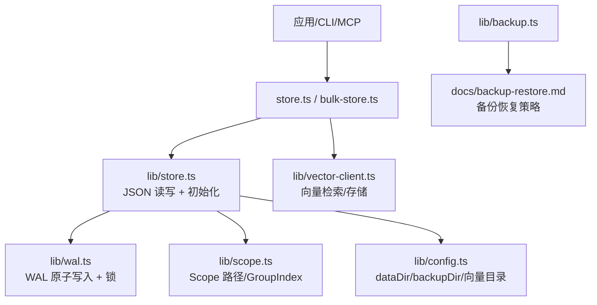
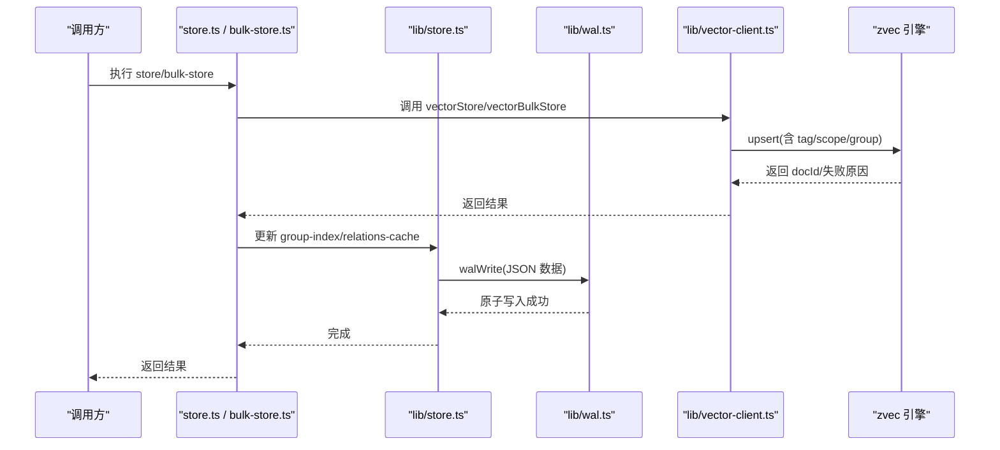
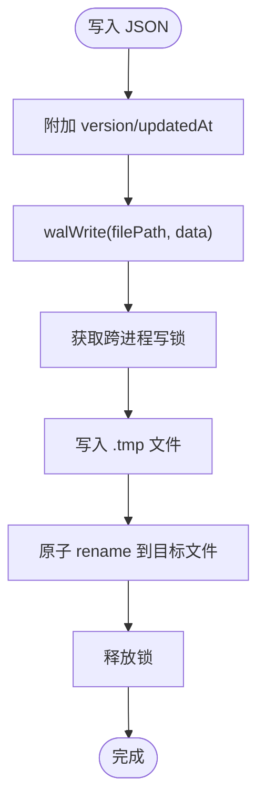
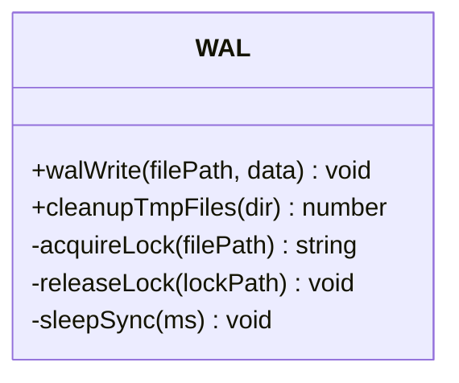
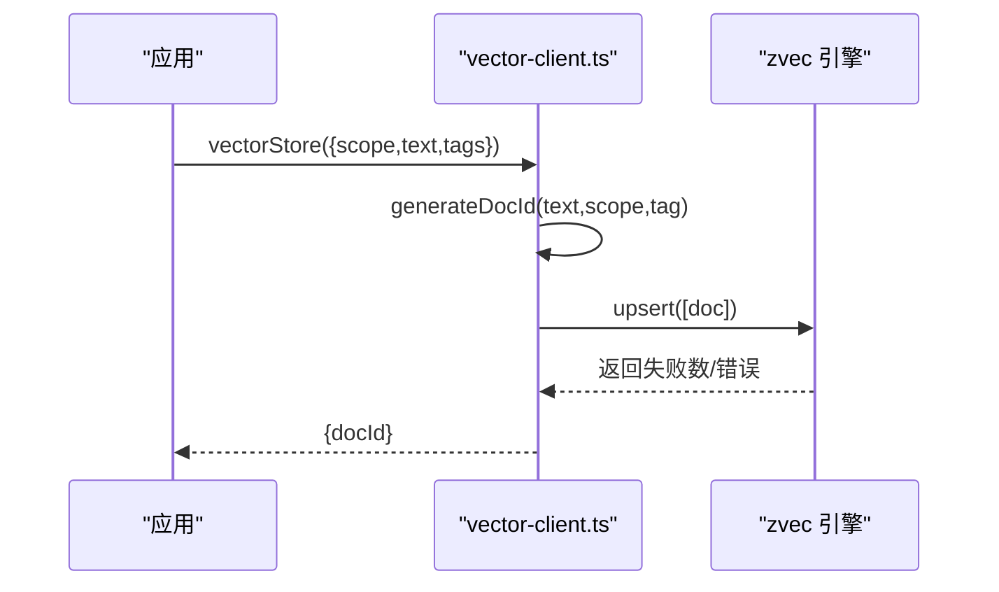
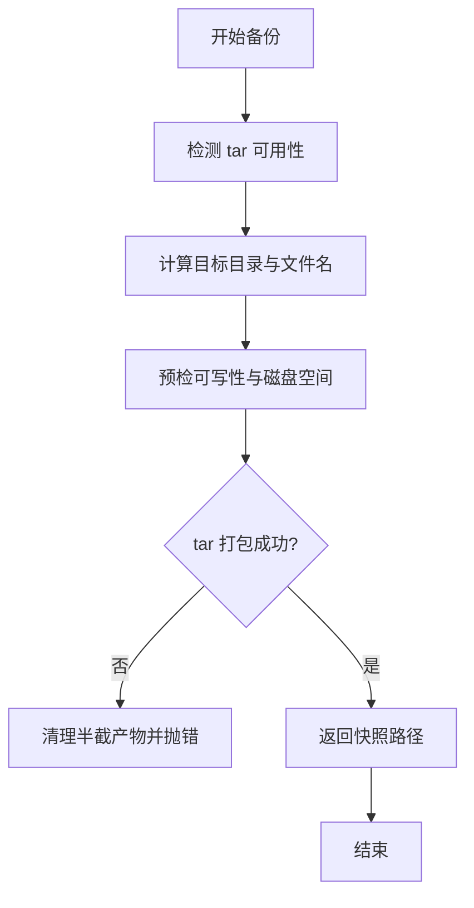
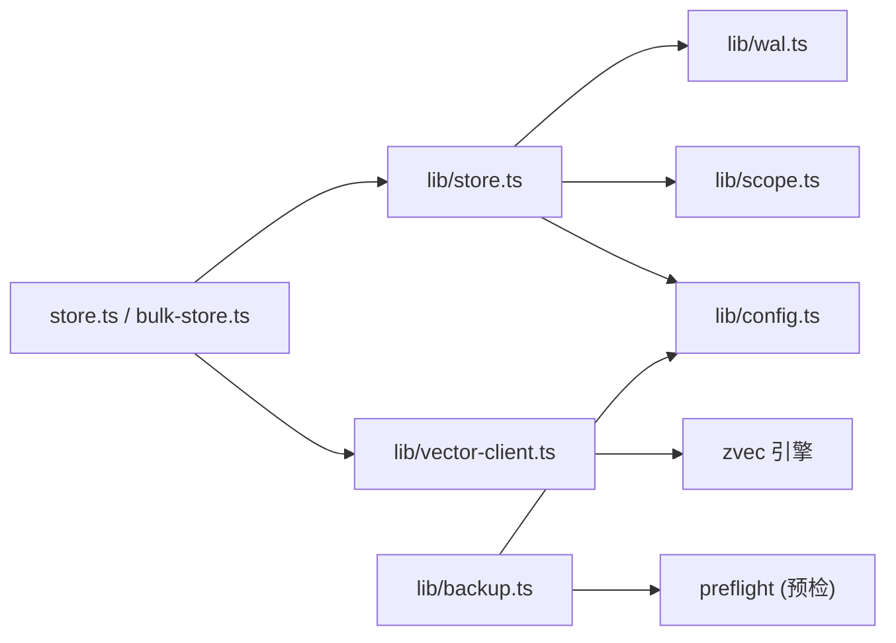

# 存储后端扩展

<cite>
**本文引用的文件**
- [src/lib/store.ts](file://src/lib/store.ts)
- [src/lib/wal.ts](file://src/lib/wal.ts)
- [src/lib/backup.ts](file://src/lib/backup.ts)
- [src/lib/scope.ts](file://src/lib/scope.ts)
- [src/lib/config.ts](file://src/lib/config.ts)
- [src/lib/constants.ts](file://src/lib/constants.ts)
- [src/lib/vector-client.ts](file://src/lib/vector-client.ts)
- [src/store.ts](file://src/store.ts)
- [src/bulk-store.ts](file://src/bulk-store.ts)
- [docs/backup-restore.md](file://docs/backup-restore.md)
</cite>

## 目录
1. [简介](#简介)
2. [项目结构](#项目结构)
3. [核心组件](#核心组件)
4. [架构总览](#架构总览)
5. [详细组件分析](#详细组件分析)
6. [依赖关系分析](#依赖关系分析)
7. [性能与并发](#性能与并发)
8. [故障恢复与错误处理](#故障恢复与错误处理)
9. [数据迁移与版本兼容](#数据迁移与版本兼容)
10. [云存储集成指南](#云存储集成指南)
11. [结论](#结论)

## 简介
本指南面向需要扩展知识索引系统“数据存储后端”的开发者，围绕以下目标展开：
- 明确存储接口边界、数据持久化机制与事务性保证
- 解释 WAL（预写日志）机制、备份恢复流程与数据一致性策略
- 分析本地文件存储实现，并给出云存储集成的参考方案
- 说明数据迁移、版本兼容、性能优化策略
- 覆盖并发访问控制、锁机制与错误恢复方案

本仓库采用“本地 JSON 文件 + WAL 原子写入 + 向量索引（zvec）”的分层存储设计。JSON 元数据通过 WAL 保障原子性与并发安全；向量检索由独立的向量引擎提供。备份模块提供快照能力，配合恢复命令完成故障恢复。

## 项目结构
与存储后端相关的核心代码集中在 src/lib 下，CLI 入口在 src 根目录，文档在 docs 下。关键路径如下：
- 本地 JSON 存储与 WAL：src/lib/store.ts、src/lib/wal.ts
- Scope 与配置：src/lib/scope.ts、src/lib/config.ts、src/lib/constants.ts
- 向量适配器（检索/存储）：src/lib/vector-client.ts
- CLI 存储命令：src/store.ts、src/bulk-store.ts
- 备份与恢复：src/lib/backup.ts、docs/backup-restore.md

图表来源
- [src/lib/store.ts:1-267](file://src/lib/store.ts#L1-L267)
- [src/lib/wal.ts:1-143](file://src/lib/wal.ts#L1-L143)
- [src/lib/vector-client.ts:1-781](file://src/lib/vector-client.ts#L1-L781)
- [src/lib/scope.ts:1-230](file://src/lib/scope.ts#L1-L230)
- [src/lib/config.ts:1-535](file://src/lib/config.ts#L1-L535)
- [src/lib/backup.ts:1-178](file://src/lib/backup.ts#L1-L178)
- [docs/backup-restore.md:1-254](file://docs/backup-restore.md#L1-L254)

章节来源
- [src/lib/store.ts:1-267](file://src/lib/store.ts#L1-L267)
- [src/lib/wal.ts:1-143](file://src/lib/wal.ts#L1-L143)
- [src/lib/vector-client.ts:1-781](file://src/lib/vector-client.ts#L1-L781)
- [src/lib/scope.ts:1-230](file://src/lib/scope.ts#L1-L230)
- [src/lib/config.ts:1-535](file://src/lib/config.ts#L1-L535)
- [src/lib/backup.ts:1-178](file://src/lib/backup.ts#L1-L178)
- [docs/backup-restore.md:1-254](file://docs/backup-restore.md#L1-L254)

## 核心组件
- 本地 JSON 存储层：负责 group-index.json、relations-cache.json 等元数据的读取、写入、初始化与迁移。
- WAL 原子写入：通过临时文件 + 原子 rename 与跨进程文件锁，确保并发写入不损坏原文件。
- 向量适配器：封装 zvec 引擎，提供语义检索、批量存储、删除、列表、统计等能力。
- 备份模块：打包 scope 目录为 tar.gz 快照，支持自动备份与列出历史备份。
- 配置与 Scope：统一解析 dataDir、backupDir、vectorDir，校验 scope 合法性，构造 kb/{scope} 路径。

章节来源
- [src/lib/store.ts:1-267](file://src/lib/store.ts#L1-L267)
- [src/lib/wal.ts:1-143](file://src/lib/wal.ts#L1-L143)
- [src/lib/vector-client.ts:1-781](file://src/lib/vector-client.ts#L1-L781)
- [src/lib/backup.ts:1-178](file://src/lib/backup.ts#L1-L178)
- [src/lib/scope.ts:1-230](file://src/lib/scope.ts#L1-L230)
- [src/lib/config.ts:1-535](file://src/lib/config.ts#L1-L535)

## 架构总览
系统采用“元数据 + 向量索引”的双轨存储：
- 元数据：以 JSON 文件形式落盘，使用 WAL 保障原子写入与并发安全。
- 向量索引：通过 zvec 引擎维护 dense vector、FTS、标量字段（tag、scope、group），提供混合检索。

图表来源
- [src/store.ts:1-91](file://src/store.ts#L1-L91)
- [src/bulk-store.ts:1-110](file://src/bulk-store.ts#L1-L110)
- [src/lib/store.ts:1-267](file://src/lib/store.ts#L1-L267)
- [src/lib/wal.ts:1-143](file://src/lib/wal.ts#L1-L143)
- [src/lib/vector-client.ts:1-781](file://src/lib/vector-client.ts#L1-L781)

## 详细组件分析

### 本地 JSON 存储层（lib/store.ts）
- 读取 JSON：带 version 检查与损坏提示，抛出结构化错误码便于上层处理。
- 写入 JSON：通过 WAL 写入，自动注入 version 与 updatedAt，保证幂等与可追踪。
- Scope 初始化：从模板复制 group-index.json 与 relations-cache.json，设置 scope 与时间戳。
- 旧格式迁移：自动将 roots → groups，并清理 relations-cache 中的旧 key 前缀。
- 路径与校验：结合 config 与 scope 校验，确保 strict/default 模式下的安全访问。

图表来源
- [src/lib/store.ts:51-62](file://src/lib/store.ts#L51-L62)
- [src/lib/wal.ts:78-112](file://src/lib/wal.ts#L78-L112)

章节来源
- [src/lib/store.ts:1-267](file://src/lib/store.ts#L1-L267)

### WAL 原子写入与并发控制（lib/wal.ts）
- 原子写入：先写 .tmp，再原子 rename，避免中断导致原文件损坏。
- 跨进程锁：基于 .lock 文件创建（O_CREAT|O_EXCL），支持陈旧锁抢占与超时保护，防止死锁。
- 自旋等待：使用 Atomics.wait 同步睡眠，避免事件循环阻塞过久。
- 残留清理：提供 cleanupTmpFiles 清理 .tmp 与陈旧 .lock。

图表来源
- [src/lib/wal.ts:1-143](file://src/lib/wal.ts#L1-L143)

章节来源
- [src/lib/wal.ts:1-143](file://src/lib/wal.ts#L1-L143)

### 向量适配器（lib/vector-client.ts）
- 单例引擎：进程内缓存 ZvecEngine，串行化 probe/create/open/close，避免原生竞态。
- 撞锁重试：检测到 locked 时等待并重试，错开共享向量库的使用。
- 空闲释放锁：常驻 MCP 场景启用 idle close，释放 LOCK 给其他实例/CLI。
- 文档 ID：sha256(text+scope+tag) 截 32，幂等 upsert，多 tag 分 doc。
- 检索：hybridSearch（语义 + FTS + RRF），按 scope/tag 过滤。
- 管理面：listIds/fetch/delete/count/listScopes/listTags 等。

图表来源
- [src/lib/vector-client.ts:245-262](file://src/lib/vector-client.ts#L245-L262)
- [src/lib/vector-client.ts:540-569](file://src/lib/vector-client.ts#L540-L569)

章节来源
- [src/lib/vector-client.ts:1-781](file://src/lib/vector-client.ts#L1-L781)

### 备份与恢复（lib/backup.ts 与 docs/backup-restore.md）
- 快照备份：tar.gz 打包 scope 目录，预检可写性与磁盘空间，失败清理半截产物。
- 自动备份：import 成功后触发，失败仅告警不阻断主流程。
- 恢复流程：列出快照 → 选择目标 → 还原 KB → 可选重建向量（全量或局部）。
- 故障场景：group-index.json/relations-cache.json 损坏、整个 scope 丢失、原文丢失等。

图表来源
- [src/lib/backup.ts:87-117](file://src/lib/backup.ts#L87-L117)
- [docs/backup-restore.md:1-254](file://docs/backup-restore.md#L1-L254)

章节来源
- [src/lib/backup.ts:1-178](file://src/lib/backup.ts#L1-L178)
- [docs/backup-restore.md:1-254](file://docs/backup-restore.md#L1-L254)

### CLI 存储命令（store.ts 与 bulk-store.ts）
- store：单条文本存储到向量索引，返回 docId。
- bulk-store：批量导入 JSON 数组，逐项返回成功/失败详情。
- 两者均进行 scope 护栏校验、向量服务可用性检测，并在 CLI 结束时关闭引擎。

章节来源
- [src/store.ts:1-91](file://src/store.ts#L1-L91)
- [src/bulk-store.ts:1-110](file://src/bulk-store.ts#L1-L110)

## 依赖关系分析
- store.ts 依赖 lib/store.ts 进行 JSON 读写与 scope 初始化。
- lib/store.ts 依赖 lib/wal.ts 进行原子写入，依赖 lib/scope.ts 与 lib/config.ts 进行路径与配置解析。
- vector-client.ts 依赖 zvec 引擎（dist 构建产物），并通过 config.ts 获取向量目录与 embedding 配置。
- backup.ts 依赖 config.ts 获取备份目录，依赖 preflight 进行预检。

图表来源
- [src/store.ts:1-91](file://src/store.ts#L1-L91)
- [src/bulk-store.ts:1-110](file://src/bulk-store.ts#L1-L110)
- [src/lib/store.ts:1-267](file://src/lib/store.ts#L1-L267)
- [src/lib/wal.ts:1-143](file://src/lib/wal.ts#L1-L143)
- [src/lib/scope.ts:1-230](file://src/lib/scope.ts#L1-L230)
- [src/lib/config.ts:1-535](file://src/lib/config.ts#L1-L535)
- [src/lib/vector-client.ts:1-781](file://src/lib/vector-client.ts#L1-L781)
- [src/lib/backup.ts:1-178](file://src/lib/backup.ts#L1-L178)

章节来源
- [src/lib/store.ts:1-267](file://src/lib/store.ts#L1-L267)
- [src/lib/vector-client.ts:1-781](file://src/lib/vector-client.ts#L1-L781)
- [src/lib/config.ts:1-535](file://src/lib/config.ts#L1-L535)

## 性能与并发
- WAL 并发控制：同一目标文件同一时刻仅一个进程写入，避免 Last-Write-Wins 静默覆盖；陈旧锁抢占与超时避免死锁。
- 向量引擎串行化：probe/create/open/close 经队列串行化，避免原生竞态导致的永久阻塞；open 带超时保护。
- 空闲释放锁：常驻 MCP 场景启用 idle close，让其他实例/CLI 能错开抢锁。
- 批量操作：bulk-store 支持批量 upsert，减少往返开销；向量层内部聚合错误并按 doc id 定位。
- 扫描限制：listIds 受 scanLimit 约束，大库下近似枚举 scope/tag。

章节来源
- [src/lib/wal.ts:1-143](file://src/lib/wal.ts#L1-L143)
- [src/lib/vector-client.ts:150-236](file://src/lib/vector-client.ts#L150-L236)
- [src/lib/vector-client.ts:334-382](file://src/lib/vector-client.ts#L334-L382)
- [src/lib/vector-client.ts:700-780](file://src/lib/vector-client.ts#L700-L780)

## 故障恢复与错误处理
- JSON 损坏：readJson 捕获解析异常，抛出 CORRUPT_JSON 错误，建议从备份恢复或重新初始化。
- 向量库占用/损坏：ensureVectorAvailable 返回 LOCKED/CORRUPTED，附带恢复指引（停止进程、稍后重试、重建向量）。
- 备份失败：autoBackup 仅输出 stderr 警告，不阻断 import 主流程；tar 失败清理半截产物。
- 恢复场景：支持从快照恢复、从模板重新初始化、还原后重建向量（全量或局部）。

章节来源
- [src/lib/store.ts:23-49](file://src/lib/store.ts#L23-L49)
- [src/lib/vector-client.ts:75-87](file://src/lib/vector-client.ts#L75-L87)
- [src/lib/vector-client.ts:440-494](file://src/lib/vector-client.ts#L440-L494)
- [src/lib/backup.ts:125-143](file://src/lib/backup.ts#L125-L143)
- [docs/backup-restore.md:180-254](file://docs/backup-restore.md#L180-L254)

## 数据迁移与版本兼容
- 数据版本：CURRENT_DATA_VERSION 用于 readJson 的版本检查，旧版本数据会发出兼容警告。
- GroupIndex 迁移：自动将 roots → groups，并迁移 relations-cache 中旧 key 前缀（如“项目根/”）。
- 向量 ID 变更：tag 参与 docId 生成后，存量向量 docId 与新 scheme 失配，需 re-import 或 rebuild-vector 迁移。
- 配置迁移：YAML 优先，JSON 读取时提示迁移；字段级校验 fail-loud，避免隐式默认值导致错配。

章节来源
- [src/lib/constants.ts:9-11](file://src/lib/constants.ts#L9-L11)
- [src/lib/store.ts:67-92](file://src/lib/store.ts#L67-L92)
- [src/lib/scope.ts:114-146](file://src/lib/scope.ts#L114-L146)
- [src/lib/vector-client.ts:245-262](file://src/lib/vector-client.ts#L245-L262)
- [src/lib/config.ts:156-183](file://src/lib/config.ts#L156-L183)

## 云存储集成指南
当前实现以本地文件系统为主，WAL 与备份均基于本地路径。若需扩展到云存储（对象存储/分布式文件系统），建议遵循以下原则：
- 抽象存储接口：定义统一的 put/get/delete/metadata 接口，适配本地 fs 与云 SDK。
- 原子写入：云侧通常不支持 rename 原子替换，可采用“命名约定 + 元数据切换”的方式模拟原子性（例如写入 .tmp 对象，成功后更新指针对象）。
- 并发控制：利用云对象的版本控制或条件写入（如 If-Match/If-None-Match）实现乐观锁；或使用分布式锁服务协调写冲突。
- 备份恢复：将 scope 目录打包上传至对象存储，恢复时下载并解压；增量备份可利用云对象的时间戳与差异对比。
- 一致性保证：对关键元数据（group-index.json、relations-cache.json）采用 WAL + 双写校验（本地暂存 + 云端确认）；失败回滚并记录审计日志。
- 性能优化：启用分片上传、压缩传输、连接池与重试退避；热点文件引入 CDN 或边缘缓存。

注意：上述为扩展建议，当前仓库未直接实现云存储后端；实际接入时需结合所选云厂商 SDK 与一致性模型进行调整。

[本节为概念性指导，不直接分析具体源码文件]

## 结论
本系统通过“WAL 原子写入 + 向量索引 + 备份恢复”的组合，提供了稳定、可扩展的存储后端基础。扩展者可在保持现有接口不变的前提下，替换底层存储实现（如云存储），并遵循原子性、并发控制与一致性原则。对于高并发与大数据量场景，建议重点优化向量引擎的批处理能力、WAL 的锁争用与备份的并行度。

[本节为总结性内容，不直接分析具体源码文件]