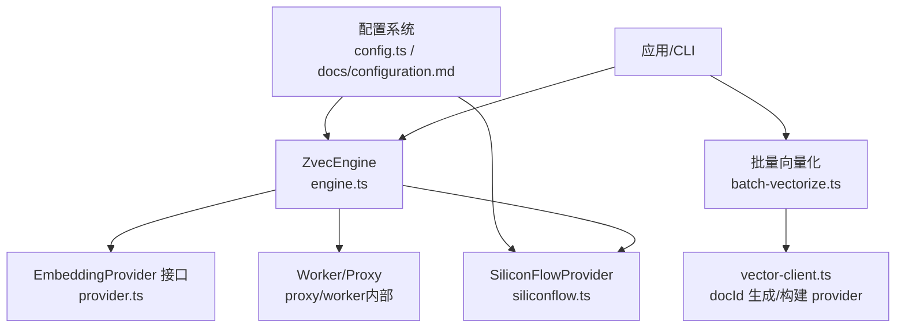
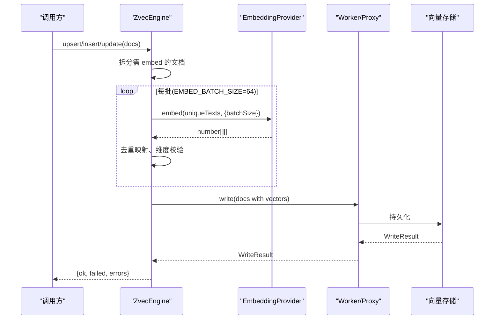
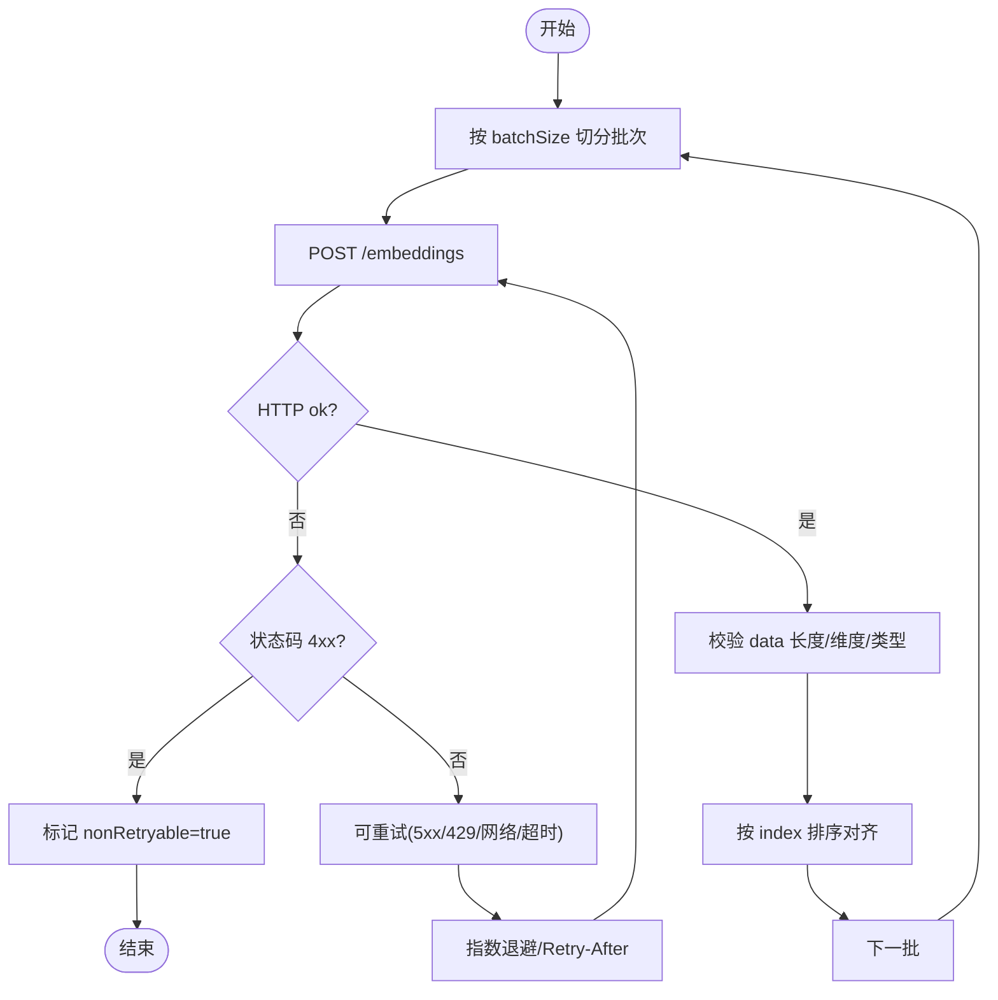
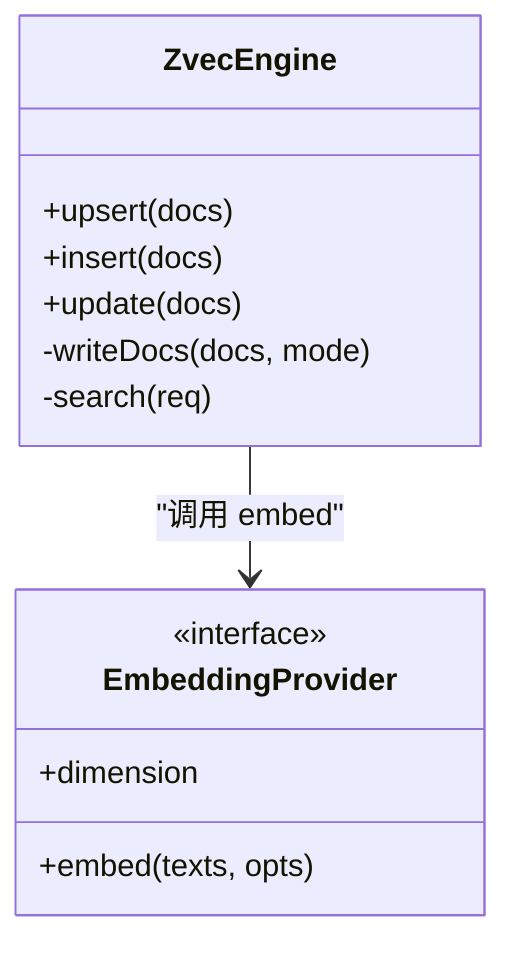
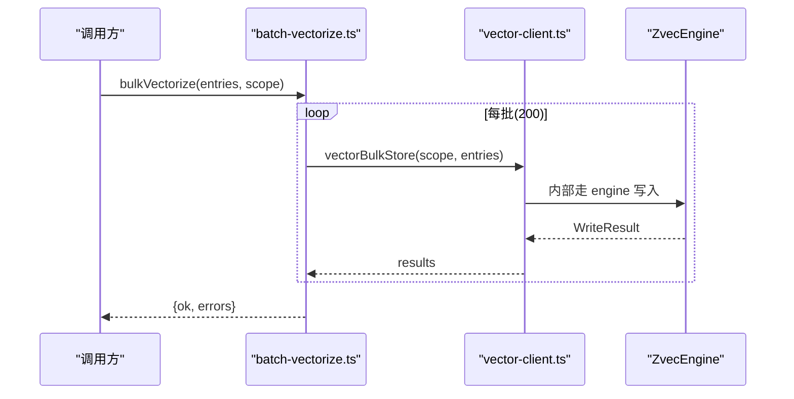
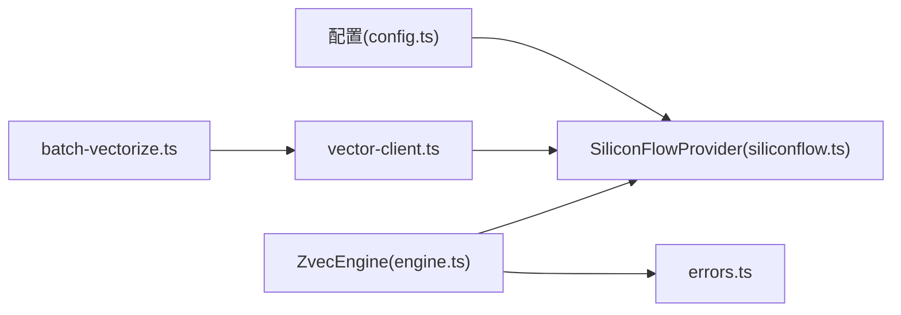

# 嵌入提供商扩展

<cite>
**本文引用的文件**
- [src/zvec-engine/embedding/provider.ts](file://src/zvec-engine/embedding/provider.ts)
- [src/zvec-engine/embedding/siliconflow.ts](file://src/zvec-engine/embedding/siliconflow.ts)
- [src/zvec-engine/types.ts](file://src/zvec-engine/types.ts)
- [src/zvec-engine/engine.ts](file://src/zvec-engine/engine.ts)
- [src/zvec-engine/errors.ts](file://src/zvec-engine/errors.ts)
- [src/lib/batch-vectorize.ts](file://src/lib/batch-vectorize.ts)
- [src/lib/config.ts](file://src/lib/config.ts)
- [src/lib/vector-client.ts](file://src/lib/vector-client.ts)
- [docs/configuration.md](file://docs/configuration.md)
</cite>

## 目录
1. [简介](#简介)
2. [项目结构](#项目结构)
3. [核心组件](#核心组件)
4. [架构总览](#架构总览)
5. [详细组件分析](#详细组件分析)
6. [依赖关系分析](#依赖关系分析)
7. [性能考虑](#性能考虑)
8. [故障排查指南](#故障排查指南)
9. [结论](#结论)
10. [附录：新提供商接入清单](#附录：新提供商接入清单)

## 简介
本指南面向需要扩展“文本嵌入模型提供商”的开发者，目标是说明如何在现有 ZvecEngine 体系中实现自定义 EmbeddingProvider，完成 API 调用封装、错误重试与限流控制，并理解嵌入向量生成流程、批量处理优化与缓存策略。文档以 SiliconFlow 实现为参考，给出集成步骤、配置管理、认证机制、限流处理、性能调优与故障排查方法。

## 项目结构
围绕嵌入能力的关键代码分布在以下位置：
- 抽象接口与类型定义：embedding/provider.ts、zvec-engine/types.ts
- 参考实现：embedding/siliconflow.ts
- 引擎编排与写入/检索路径：zvec-engine/engine.ts
- 异常体系：zvec-engine/errors.ts
- 批量向量化与客户端：lib/batch-vectorize.ts、lib/vector-client.ts
- 配置加载与默认值：lib/config.ts、docs/configuration.md

图表来源
- [src/zvec-engine/engine.ts:68-131](file://src/zvec-engine/engine.ts#L68-L131)
- [src/zvec-engine/embedding/provider.ts:9-28](file://src/zvec-engine/embedding/provider.ts#L9-L28)
- [src/zvec-engine/embedding/siliconflow.ts:43-75](file://src/zvec-engine/embedding/siliconflow.ts#L43-L75)
- [src/lib/batch-vectorize.ts:132-182](file://src/lib/batch-vectorize.ts#L132-L182)
- [src/lib/vector-client.ts:245-267](file://src/lib/vector-client.ts#L245-L267)
- [src/lib/config.ts:116-145](file://src/lib/config.ts#L116-L145)
- [docs/configuration.md:69-90](file://docs/configuration.md#L69-L90)

章节来源
- [src/zvec-engine/engine.ts:68-131](file://src/zvec-engine/engine.ts#L68-L131)
- [src/zvec-engine/embedding/provider.ts:9-28](file://src/zvec-engine/embedding/provider.ts#L9-L28)
- [src/zvec-engine/embedding/siliconflow.ts:43-75](file://src/zvec-engine/embedding/siliconflow.ts#L43-L75)
- [src/lib/batch-vectorize.ts:132-182](file://src/lib/batch-vectorize.ts#L132-L182)
- [src/lib/vector-client.ts:245-267](file://src/lib/vector-client.ts#L245-L267)
- [src/lib/config.ts:116-145](file://src/lib/config.ts#L116-L145)
- [docs/configuration.md:69-90](file://docs/configuration.md#L69-L90)

## 核心组件
- EmbeddingProvider 接口：定义 dimension 与 embed(texts, opts)，要求返回长度一致且维度匹配集合配置。
- SiliconFlowProvider：OpenAI 兼容 /embeddings 端点实现，内置重试、退避、超时、响应校验与批间串行。
- ZvecEngine：编排写入与检索，按小批切分触发 embed，失败项隔离到 errors[]，避免整批失败。
- 批量向量化：bulkVectorize 通过 vectorBulkStore 一次完成 embed+写入；batchVectorize 串行逐条用于增量场景。
- 配置系统：提供 embedding.provider/baseURL/model/dimension/apiKey 等配置项与默认值。

章节来源
- [src/zvec-engine/embedding/provider.ts:9-28](file://src/zvec-engine/embedding/provider.ts#L9-L28)
- [src/zvec-engine/embedding/siliconflow.ts:43-75](file://src/zvec-engine/embedding/siliconflow.ts#L43-L75)
- [src/zvec-engine/engine.ts:330-449](file://src/zvec-engine/engine.ts#L330-L449)
- [src/lib/batch-vectorize.ts:77-182](file://src/lib/batch-vectorize.ts#L77-L182)
- [src/lib/config.ts:116-145](file://src/lib/config.ts#L116-L145)

## 架构总览
嵌入向量从“文本”到“向量存储”的整体流程如下：

图表来源
- [src/zvec-engine/engine.ts:330-449](file://src/zvec-engine/engine.ts#L330-L449)
- [src/zvec-engine/embedding/siliconflow.ts:77-102](file://src/zvec-engine/embedding/siliconflow.ts#L77-L102)

## 详细组件分析

### EmbeddingProvider 接口与选项
- dimension：必须与集合维度一致，否则在写入或检索阶段会触发维度不匹配错误。
- embed(texts, opts)：
  - retries：失败重试次数（默认 3）。
  - batchSize：分批大小（默认 64），失败粒度等于小批。
  - timeoutMs：单批超时（默认 30000ms）。
  - onProgress：进度回调。

章节来源
- [src/zvec-engine/embedding/provider.ts:9-28](file://src/zvec-engine/embedding/provider.ts#L9-L28)

### SiliconFlowProvider 实现要点
- 构造期校验：apiKey 必填（支持环境变量注入）、dimension 正整数、baseURL 必须以 https:// 开头。
- HTTP 调用：POST /embeddings，Authorization: Bearer，body 包含 model 与 input。
- 重试策略：
  - 可重试：5xx、429、网络错误、超时。
  - 不可重试：非 429 的 4xx、响应结构错误、维度不匹配。
  - 指数退避 + Retry-After 优先。
- 响应校验：data 数组长度、每项 embedding 类型与维度、按 index 排序对齐输入顺序。
- 批间串行：避免触发提供商限流。

图表来源
- [src/zvec-engine/embedding/siliconflow.ts:77-202](file://src/zvec-engine/embedding/siliconflow.ts#L77-L202)

章节来源
- [src/zvec-engine/embedding/siliconflow.ts:43-75](file://src/zvec-engine/embedding/siliconflow.ts#L43-L75)
- [src/zvec-engine/embedding/siliconflow.ts:77-202](file://src/zvec-engine/embedding/siliconflow.ts#L77-L202)

### ZvecEngine 写入与检索中的嵌入编排
- 写入路径：
  - 将需要 embed 的文档按 EMBED_BATCH_SIZE=64 切分。
  - 批内按 text 去重，减少重复 HTTP 调用。
  - 调用 Provider.embed(uniqueTexts, {batchSize: 64})，使失败粒度恰好对应一次 HTTP 调用。
  - 对 embed 失败的 doc 记录 EMBEDDING_FAILED，其余正常写入。
- 检索路径：
  - 路由后若需要语义侧向量，则主线程 embed(queryText) 并转换为 Float32Array。
- 维度校验：写入前校验 vector 长度与集合维度一致。

图表来源
- [src/zvec-engine/engine.ts:330-449](file://src/zvec-engine/engine.ts#L330-L449)
- [src/zvec-engine/engine.ts:454-495](file://src/zvec-engine/engine.ts#L454-L495)
- [src/zvec-engine/embedding/provider.ts:20-28](file://src/zvec-engine/embedding/provider.ts#L20-L28)

章节来源
- [src/zvec-engine/engine.ts:330-449](file://src/zvec-engine/engine.ts#L330-L449)
- [src/zvec-engine/engine.ts:454-495](file://src/zvec-engine/engine.ts#L454-L495)

### 批量向量化与客户端
- bulkVectorize：按 200 条/批调用 vectorBulkStore，一次完成 embed+写入，适合全量导入。
- batchVectorize：串行逐条 vectorizeOne，适合增量修改。
- vector-client：
  - generateDocId：基于 sha256(text+scope+tag) 截断生成稳定 docId。
  - buildEmbedding：从配置构建 SiliconFlowProvider。

图表来源
- [src/lib/batch-vectorize.ts:132-182](file://src/lib/batch-vectorize.ts#L132-L182)
- [src/lib/vector-client.ts:245-267](file://src/lib/vector-client.ts#L245-L267)

章节来源
- [src/lib/batch-vectorize.ts:77-182](file://src/lib/batch-vectorize.ts#L77-L182)
- [src/lib/vector-client.ts:245-267](file://src/lib/vector-client.ts#L245-L267)

### 配置管理与认证
- 配置文件优先级：命令行 --config → ~/.ki/config.yaml/yml/json → 内置默认。
- embedding 配置项：provider、baseURL、model、dimension、apiKey（支持明文或 ${VAR} 引用）。
- 默认值：provider=siliconflow，baseURL=https://api.siliconflow.cn/v1，model=Qwen/Qwen3-Embedding-8B，dimension=4096。
- 安全建议：apiKey 优先使用环境变量引用，避免明文入库。

章节来源
- [src/lib/config.ts:116-145](file://src/lib/config.ts#L116-L145)
- [src/lib/config.ts:228-248](file://src/lib/config.ts#L228-L248)
- [docs/configuration.md:69-90](file://docs/configuration.md#L69-L90)

## 依赖关系分析
- ZvecEngine 依赖 EmbeddingProvider 接口，具体由 SiliconFlowProvider 实现。
- 批量向量化模块依赖 vector-client，后者负责 docId 生成与 provider 构建。
- 配置系统提供 embedding 配置，影响 provider 行为。
- 异常体系统一继承 ZvecEngineError，便于跨线程序列化与识别。

图表来源
- [src/zvec-engine/engine.ts:68-131](file://src/zvec-engine/engine.ts#L68-L131)
- [src/zvec-engine/embedding/siliconflow.ts:43-75](file://src/zvec-engine/embedding/siliconflow.ts#L43-L75)
- [src/lib/vector-client.ts:245-267](file://src/lib/vector-client.ts#L245-L267)
- [src/zvec-engine/errors.ts:17-61](file://src/zvec-engine/errors.ts#L17-L61)
- [src/lib/batch-vectorize.ts:132-182](file://src/lib/batch-vectorize.ts#L132-L182)
- [src/lib/config.ts:116-145](file://src/lib/config.ts#L116-L145)

章节来源
- [src/zvec-engine/engine.ts:68-131](file://src/zvec-engine/engine.ts#L68-L131)
- [src/zvec-engine/embedding/siliconflow.ts:43-75](file://src/zvec-engine/embedding/siliconflow.ts#L43-L75)
- [src/lib/vector-client.ts:245-267](file://src/lib/vector-client.ts#L245-L267)
- [src/zvec-engine/errors.ts:17-61](file://src/zvec-engine/errors.ts#L17-L61)
- [src/lib/batch-vectorize.ts:132-182](file://src/lib/batch-vectorize.ts#L132-L182)
- [src/lib/config.ts:116-145](file://src/lib/config.ts#L116-L145)

## 性能考虑
- 批大小选择：
  - Provider 层 batchSize=64 与 Engine 层 EMBED_BATCH_SIZE=64 对齐，确保失败粒度最小化且与一次 HTTP 调用对应。
  - 批量向量化采用 200 条/批提交，兼顾吞吐与中间态可见性。
- 批内去重：Engine 在每批内按 text 去重，避免相同文本重复 embed。
- 批间串行：SiliconFlowProvider 批间串行，降低触发限流风险。
- 超时与退避：单批超时默认 30s；重试采用指数退避并优先读取 Retry-After。
- 内存与传输：向量经 Float32Array 传递至 worker，减少拷贝开销。
- 维度一致性：写入前严格校验维度，避免后续检索失败。

[本节为通用性能建议，无需特定文件引用]

## 故障排查指南
- 常见错误类型：
  - EMBEDDING_FAILED：Provider 层 HTTP/网络/超时/响应结构错误导致。
  - DimensionMismatchError：向量维度与集合维度不一致。
  - InvalidDocInputError：fields 不在白名单或未提供 vector/text。
  - InconsistentUpdateError：update 未传 vector 且未传 text，或仅传 vector 但集合启用 FTS。
- 定位步骤：
  - 检查 embedding.dimension 与集合 dimension 是否一致。
  - 检查 apiKey、baseURL、model 是否正确。
  - 查看 Provider 返回的 data 长度与 embedding 类型是否符合预期。
  - 关注重试策略：429/5xx/网络错误会重试；其他 4xx 不重试。
- 日志与调试：
  - 利用 onProgress 观察批进度。
  - 通过 errors[] 中 code/data 快速定位问题根因。

章节来源
- [src/zvec-engine/errors.ts:17-61](file://src/zvec-engine/errors.ts#L17-L61)
- [src/zvec-engine/engine.ts:330-449](file://src/zvec-engine/engine.ts#L330-L449)
- [src/zvec-engine/embedding/siliconflow.ts:104-202](file://src/zvec-engine/embedding/siliconflow.ts#L104-L202)

## 结论
通过 EmbeddingProvider 抽象与 SiliconFlowProvider 参考实现，项目提供了可扩展、高可靠、易集成的嵌入能力。ZvecEngine 在写入与检索路径中对嵌入进行细粒度批处理、去重与重试，配合批量向量化与配置系统，满足大规模知识索引的性能与稳定性需求。新增提供商只需实现接口并遵循错误与重试约定，即可无缝接入。

## 附录：新提供商接入清单
- 实现 EmbeddingProvider：
  - 暴露 dimension，确保与集合维度一致。
  - 实现 embed(texts, opts)：
    - 按 batchSize 切分批次，批间串行。
    - 实现重试：5xx/429/网络/超时可重试；其他 4xx 与响应结构错误不可重试。
    - 解析 Retry-After 与指数退避。
    - 校验响应数据长度、embedding 类型与维度。
    - 可选：onProgress 进度回调。
- 配置与认证：
  - 在 config.embedding 中设置 provider/baseURL/model/dimension/apiKey。
  - 推荐通过 ${VAR_NAME} 引用环境变量，避免明文。
- 集成步骤：
  - 替换或新增 provider 实现，并在 vector-client 中根据配置构建实例。
  - 验证维度一致性、批量大小与重试策略。
  - 使用 bulkVectorize 进行全量导入，batchVectorize 进行增量更新。
- 性能与限流：
  - 保持 batchSize=64 与 Engine 层 EMBED_BATCH_SIZE 对齐。
  - 批间串行，必要时调整超时与重试上限。
- 故障排查：
  - 依据 errors[] 的 code/data 定位问题。
  - 检查网络、鉴权、响应结构与维度一致性。

章节来源
- [src/zvec-engine/embedding/provider.ts:9-28](file://src/zvec-engine/embedding/provider.ts#L9-L28)
- [src/zvec-engine/embedding/siliconflow.ts:43-202](file://src/zvec-engine/embedding/siliconflow.ts#L43-L202)
- [src/lib/config.ts:116-145](file://src/lib/config.ts#L116-L145)
- [src/lib/vector-client.ts:245-267](file://src/lib/vector-client.ts#L245-L267)
- [docs/configuration.md:69-90](file://docs/configuration.md#L69-L90)