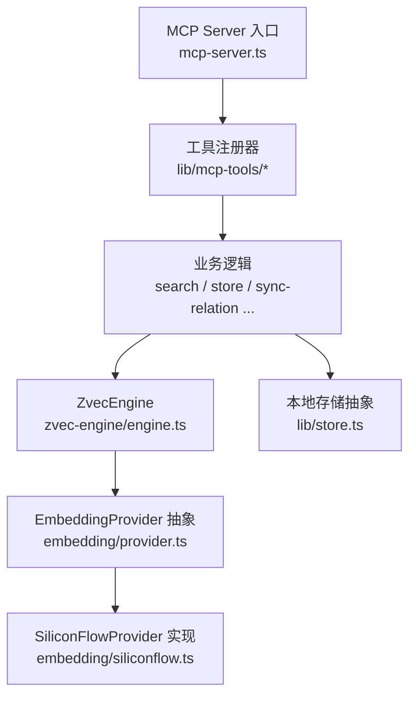
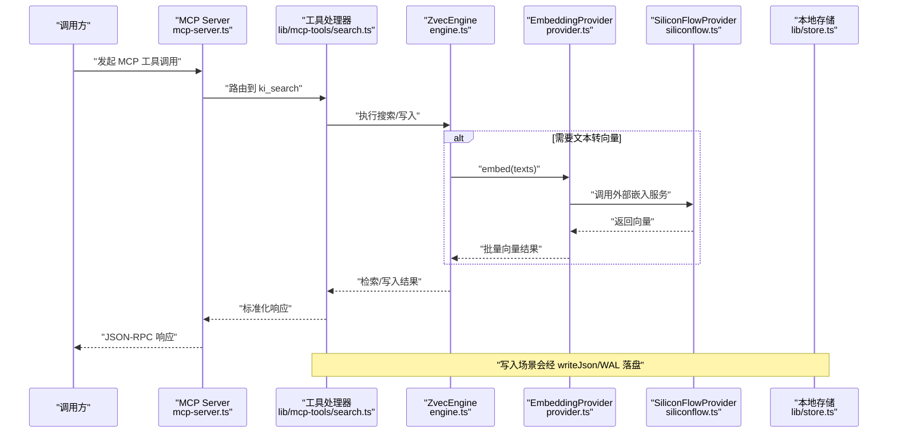
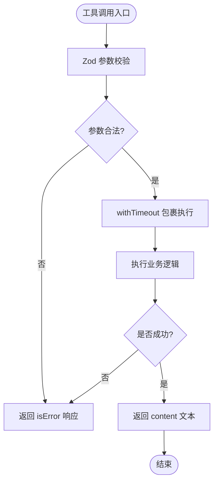
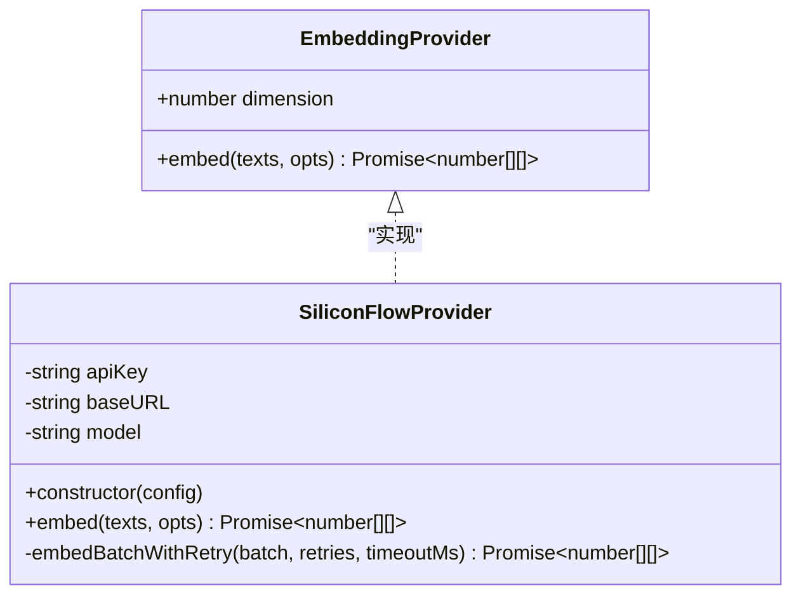
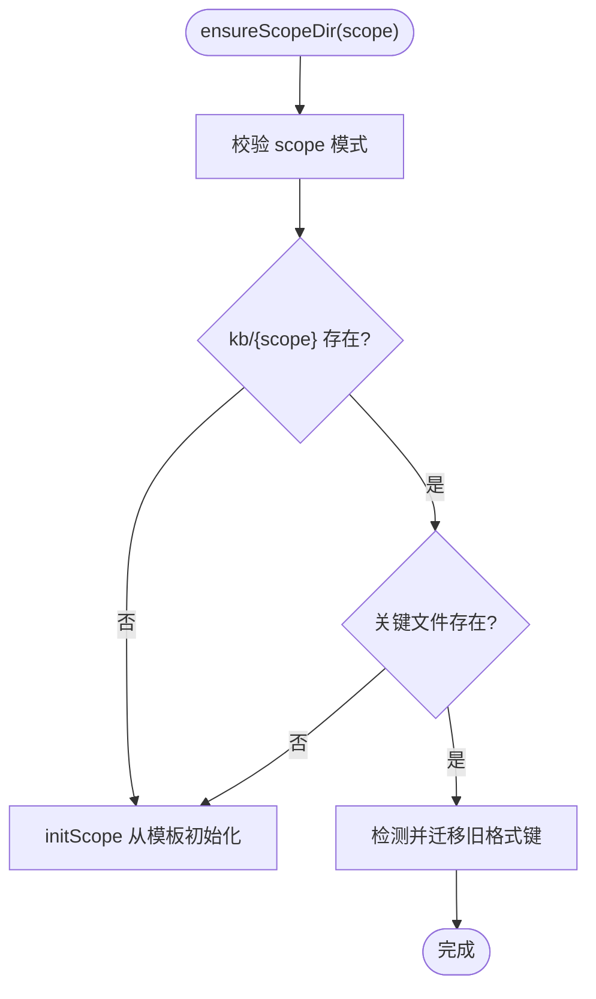
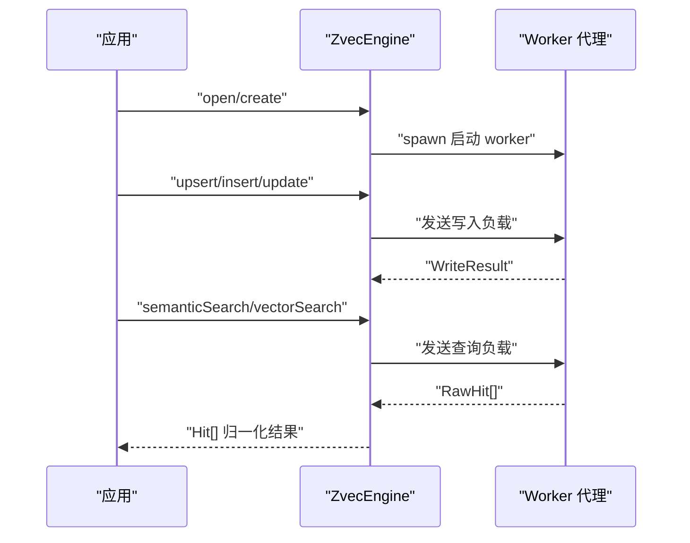
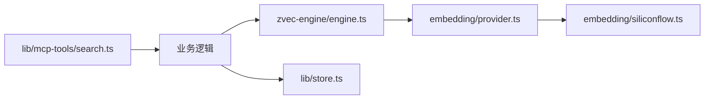

# 扩展开发

<cite>
**本文引用的文件**
- [mcp-server.ts](file://src/mcp-server.ts)
- [search.ts](file://src/lib/mcp-tools/search.ts)
- [provider.ts](file://src/zvec-engine/embedding/provider.ts)
- [siliconflow.ts](file://src/zvec-engine/embedding/siliconflow.ts)
- [engine.ts](file://src/zvec-engine/engine.ts)
- [index.ts](file://src/zvec-engine/index.ts)
- [store.ts](file://src/lib/store.ts)
- [S01_框架_DESIGN.md](file://.requirements/2026-06-14-ki-mcp-server/design/S01_框架_DESIGN.md)
- [S01_mem-client-CLI-MCP_DESIGN.md](file://.requirements/2026-06-14-ki-vector-integration/design/S01_mem-client-CLI-MCP_DESIGN.md)
</cite>

## 目录
1. [简介](#简介)
2. [项目结构](#项目结构)
3. [核心组件](#核心组件)
4. [架构总览](#架构总览)
5. [详细组件分析](#详细组件分析)
6. [依赖关系分析](#依赖关系分析)
7. [性能与可扩展性](#性能与可扩展性)
8. [故障排查指南](#故障排查指南)
9. [结论](#结论)
10. [附录：扩展示例与最佳实践](#附录扩展示例与最佳实践)

## 简介
本指南面向希望在 kisearch 中扩展能力的开发者，覆盖三类扩展点：
- MCP 工具扩展：通过注册新工具暴露能力给 AI Agent。
- 自定义嵌入提供商：替换或新增向量文本到向量的实现，支持重试、限流、进度回调等。
- 存储后端扩展：基于 JSON+WAL 的本地知识库存储机制，支持 scope 初始化、迁移与版本兼容。

文档同时给出插件接口定义、生命周期管理、错误处理约定，并提供具体扩展示例、最佳实践与常见问题解决方案。

## 项目结构
kisearch 将“服务入口”“工具注册”“向量引擎”“存储抽象”分层组织：
- 服务入口：负责进程启动、HTTP/stdio 模式选择、鉴权、预检、单例守护与资源释放。
- 工具层：每个工具一个 registerXxxTool 函数，集中定义 schema、handler、超时与错误包装。
- 向量引擎：对外暴露 ZvecEngine 与 EmbeddingProvider 抽象；内置 SiliconFlowProvider 参考实现。
- 存储层：JSON + WAL 持久化，scope 隔离与模板初始化，自动迁移旧格式。

图示来源
- [mcp-server.ts:54-70](file://src/mcp-server.ts#L54-L70)
- [search.ts:6-49](file://src/lib/mcp-tools/search.ts#L6-L49)
- [engine.ts:68-131](file://src/zvec-engine/engine.ts#L68-L131)
- [provider.ts:20-28](file://src/zvec-engine/embedding/provider.ts#L20-L28)
- [siliconflow.ts:43-75](file://src/zvec-engine/embedding/siliconflow.ts#L43-L75)
- [store.ts:19-62](file://src/lib/store.ts#L19-L62)

章节来源
- [mcp-server.ts:49-70](file://src/mcp-server.ts#L49-L70)
- [S01_框架_DESIGN.md:51-90](file://.requirements/2026-06-14-ki-mcp-server/design/S01_框架_DESIGN.md#L51-L90)

## 核心组件
- MCP 服务器与工具注册
  - 通过 buildKiMcpServer 创建 McpServer 实例并集中注册所有工具。
  - 工具以 registerXxxTool(server) 形式解耦，便于新增/替换。
- 向量引擎与嵌入提供商
  - ZvecEngine 提供 create/open/probe/close/destroy 等生命周期方法。
  - EmbeddingProvider 是文本→向量的可插拔接口，内置 SiliconFlowProvider 作为参考实现。
- 本地存储抽象
  - readJson/writeJson 提供带版本检查与 WAL 的 JSON 读写。
  - ensureScopeDir/initScope 负责 scope 目录初始化与模板复制。
  - 自动迁移 group-index.json 与 relations-cache.json 的旧格式键。

章节来源
- [mcp-server.ts:54-70](file://src/mcp-server.ts#L54-L70)
- [engine.ts:97-131](file://src/zvec-engine/engine.ts#L97-L131)
- [provider.ts:20-28](file://src/zvec-engine/embedding/provider.ts#L20-L28)
- [siliconflow.ts:43-75](file://src/zvec-engine/embedding/siliconflow.ts#L43-L75)
- [store.ts:19-62](file://src/lib/store.ts#L19-L62)
- [store.ts:168-267](file://src/lib/store.ts#L168-L267)

## 架构总览
下图展示了从 MCP 请求到向量检索与存储写入的关键路径，以及扩展点位置。

图示来源
- [mcp-server.ts:54-70](file://src/mcp-server.ts#L54-L70)
- [search.ts:6-49](file://src/lib/mcp-tools/search.ts#L6-L49)
- [engine.ts:330-450](file://src/zvec-engine/engine.ts#L330-L450)
- [provider.ts:20-28](file://src/zvec-engine/embedding/provider.ts#L20-L28)
- [siliconflow.ts:77-102](file://src/zvec-engine/embedding/siliconflow.ts#L77-L102)
- [store.ts:55-62](file://src/lib/store.ts#L55-L62)

## 详细组件分析

### MCP 工具扩展机制
- 注册方式
  - 在 mcp-server.ts 的 buildKiMcpServer 中集中注册工具。
  - 每个工具独立文件，导出 registerXxxTool(server)，内部使用 server.tool(name, desc, zodSchema, handler)。
- 参数校验与超时
  - 使用 Zod 定义入参 schema，统一类型与默认值。
  - 通过 withTimeout 包裹业务逻辑，避免长任务阻塞。
- 错误处理
  - 成功返回 { content: [{ type:'text', text: JSON.stringify(data)}] }。
  - 失败返回 { isError: true, content: [{ type:'text', text: error.message }] }。
- 鉴权与 HTTP 模式
  - HTTP 模式下支持 Token 鉴权、Host 白名单、回环地址免鉴权策略。
  - 多 IDE 共享单例进程，避免向量库锁冲突。

图示来源
- [search.ts:6-49](file://src/lib/mcp-tools/search.ts#L6-L49)
- [mcp-server.ts:54-70](file://src/mcp-server.ts#L54-L70)

章节来源
- [mcp-server.ts:54-70](file://src/mcp-server.ts#L54-L70)
- [search.ts:6-49](file://src/lib/mcp-tools/search.ts#L6-L49)
- [S01_框架_DESIGN.md:85-122](file://.requirements/2026-06-14-ki-mcp-server/design/S01_框架_DESIGN.md#L85-L122)

### 自定义嵌入提供商开发
- 接口契约
  - EmbeddingProvider 要求 dimension 与 embed(texts, opts) 方法。
  - EmbedOptions 支持 retries、batchSize、timeoutMs、onProgress。
- 参考实现要点（SiliconFlowProvider）
  - 构造时校验 apiKey/baseURL/dimension，读取环境变量或配置。
  - embed 分批调用外部 API，支持指数退避与 Retry-After 解析。
  - 对 5xx/429/网络错误进行重试，非 429 的 4xx 不重试。
  - 按 index 排序对齐输入顺序，校验维度一致性。
- 集成方式
  - 在 ZvecEngine 配置中注入自定义 provider，确保 dimension 与集合维度一致。
  - 通过 engine.ts 的写入/检索流程自动触发 embed。

图示来源
- [provider.ts:20-28](file://src/zvec-engine/embedding/provider.ts#L20-L28)
- [siliconflow.ts:43-75](file://src/zvec-engine/embedding/siliconflow.ts#L43-L75)
- [siliconflow.ts:77-102](file://src/zvec-engine/embedding/siliconflow.ts#L77-L102)
- [siliconflow.ts:104-202](file://src/zvec-engine/embedding/siliconflow.ts#L104-L202)

章节来源
- [provider.ts:9-28](file://src/zvec-engine/embedding/provider.ts#L9-L28)
- [siliconflow.ts:16-75](file://src/zvec-engine/embedding/siliconflow.ts#L16-L75)
- [siliconflow.ts:77-202](file://src/zvec-engine/embedding/siliconflow.ts#L77-L202)

### 存储后端扩展（JSON+WAL + Scope 管理）
- 读写与版本
  - readJson 读取 JSON 并进行版本兼容性检查。
  - writeJson 写入前添加 version 与 updatedAt，并通过 WAL 持久化。
- Scope 初始化与迁移
  - ensureScopeDir 校验 scope 模式（strict/default），不存在则从 _template 初始化。
  - initScope 复制 group-index.json 与 relations-cache.json，设置 scope 与时间戳。
  - 自动迁移旧 key（如“项目根/”前缀）到新格式，合并 hot_relations 去重。
- 扩展建议
  - 新增存储后端时，保持 readJson/writeJson 的 WAL 语义与版本字段约定。
  - 若引入新的 scope 元数据，遵循现有迁移策略，保证向后兼容。

图示来源
- [store.ts:168-267](file://src/lib/store.ts#L168-L267)
- [store.ts:19-62](file://src/lib/store.ts#L19-L62)

章节来源
- [store.ts:19-62](file://src/lib/store.ts#L19-L62)
- [store.ts:168-267](file://src/lib/store.ts#L168-L267)

### 向量引擎生命周期与扩展点
- 生命周期
  - create/open/probe/close/destroy：创建集合、打开已有集合、探测健康状态、关闭与销毁。
  - tryOpen：仅判断可用性，不抛异常。
- 写入与检索
  - upsert/insert/update/delete/fetch/listIds：写入与查询接口。
  - semanticSearch/vectorSearch/ftsSearch/hybridSearch：多种检索模式。
- 扩展点
  - 通过 EmbeddingProvider 接入不同向量模型。
  - 通过 filter 编译与 allowedFields 控制标量过滤与字段白名单。

图示来源
- [engine.ts:97-131](file://src/zvec-engine/engine.ts#L97-L131)
- [engine.ts:243-326](file://src/zvec-engine/engine.ts#L243-L326)
- [engine.ts:454-495](file://src/zvec-engine/engine.ts#L454-L495)

章节来源
- [engine.ts:97-131](file://src/zvec-engine/engine.ts#L97-L131)
- [engine.ts:243-326](file://src/zvec-engine/engine.ts#L243-L326)
- [engine.ts:454-495](file://src/zvec-engine/engine.ts#L454-L495)

## 依赖关系分析
- MCP 工具与业务逻辑
  - search.ts 依赖 search 业务模块，并通过 withTimeout 控制超时。
- 向量引擎与嵌入提供商
  - engine.ts 依赖 EmbeddingProvider 抽象，运行时注入具体实现。
  - siliconflow.ts 为默认参考实现，封装 HTTP 调用、重试与进度回调。
- 存储层与配置
  - store.ts 依赖 config 与 scope 模块，确保 scope 模式与模板路径正确。

图示来源
- [search.ts:6-49](file://src/lib/mcp-tools/search.ts#L6-L49)
- [engine.ts:68-131](file://src/zvec-engine/engine.ts#L68-L131)
- [provider.ts:20-28](file://src/zvec-engine/embedding/provider.ts#L20-L28)
- [siliconflow.ts:43-75](file://src/zvec-engine/embedding/siliconflow.ts#L43-L75)
- [store.ts:19-62](file://src/lib/store.ts#L19-L62)

章节来源
- [search.ts:6-49](file://src/lib/mcp-tools/search.ts#L6-L49)
- [engine.ts:68-131](file://src/zvec-engine/engine.ts#L68-L131)
- [provider.ts:20-28](file://src/zvec-engine/embedding/provider.ts#L20-L28)
- [siliconflow.ts:43-75](file://src/zvec-engine/embedding/siliconflow.ts#L43-L75)
- [store.ts:19-62](file://src/lib/store.ts#L19-L62)

## 性能与可扩展性
- 工具超时与并发
  - 使用 withTimeout 限制工具执行时间，避免长任务阻塞。
  - HTTP 单例模式减少重复启动开销，降低向量库锁争用。
- 嵌入批处理与重试
  - SiliconFlowProvider 支持 batchSize、retries、timeoutMs、onProgress。
  - 指数退避与 Retry-After 提升稳定性，避免瞬时抖动导致整批失败。
- 写入优化
  - engine.ts 对 needsEmbed 进行批内去重，减少重复 embedding 调用。
  - DEFAULT_WRITE_BATCH_SIZE 控制批量写入大小，平衡吞吐与延迟。
- 存储迁移
  - 自动迁移旧格式键，避免升级中断；WAL 保障写入原子性与恢复能力。

[本节为通用指导，无需特定文件引用]

## 故障排查指南
- MCP 工具报错
  - 检查 Zod 参数是否正确，确认传入 scope、query、limit 等必填项。
  - 查看 withTimeout 是否触发，必要时调整 TOOL_TIMEOUT。
- 嵌入失败
  - 确认 EmbeddingProvider.dimension 与集合维度一致。
  - 检查外部 API 返回状态码与重试策略，关注 429/5xx 与 Retry-After。
- 向量库锁冲突
  - HTTP 单例与 stdio 实例并存会导致锁争用，优先使用 HTTP 模式。
  - 使用 ki mcp stop/restart 清理残留实例与锁文件。
- 存储损坏或版本不兼容
  - readJson 抛出 CORRUPT_JSON 时，从备份恢复或重新初始化 scope。
  - 检查 CURRENT_DATA_VERSION 与文件 version，必要时执行迁移。

章节来源
- [search.ts:6-49](file://src/lib/mcp-tools/search.ts#L6-L49)
- [siliconflow.ts:104-202](file://src/zvec-engine/embedding/siliconflow.ts#L104-L202)
- [mcp-server.ts:595-658](file://src/mcp-server.ts#L595-L658)
- [store.ts:23-49](file://src/lib/store.ts#L23-L49)

## 结论
kisearch 提供了清晰的扩展点：
- MCP 工具：通过 registerXxxTool 快速暴露新能力，统一参数校验、超时与错误处理。
- 嵌入提供商：通过 EmbeddingProvider 抽象接入任意向量模型，具备重试、限流与进度回调。
- 存储后端：基于 JSON+WAL 的本地存储，支持 scope 隔离、模板初始化与自动迁移。
遵循本文档的接口约定与最佳实践，可在不破坏现有系统的前提下安全扩展。

[本节为总结，无需特定文件引用]

## 附录：扩展示例与最佳实践

### 新增 MCP 工具
- 步骤
  - 新建 lib/mcp-tools/your-tool.ts，导出 registerYourTool(server)。
  - 在 mcp-server.ts 的 buildKiMcpServer 中调用 registerYourTool(server)。
- 示例参考
  - 参考 search.ts 的工具注册与错误包装。
  - 参考设计文档中的工具注册模式。

章节来源
- [search.ts:6-49](file://src/lib/mcp-tools/search.ts#L6-L49)
- [S01_框架_DESIGN.md:85-122](file://.requirements/2026-06-14-ki-mcp-server/design/S01_框架_DESIGN.md#L85-L122)

### 实现自定义嵌入提供商
- 步骤
  - 实现 EmbeddingProvider 接口，确保 dimension 与集合一致。
  - 在 ZvecEngine 配置中注入你的 provider。
- 示例参考
  - 参考 siliconflow.ts 的重试、限流与进度回调实现。

章节来源
- [provider.ts:20-28](file://src/zvec-engine/embedding/provider.ts#L20-L28)
- [siliconflow.ts:43-75](file://src/zvec-engine/embedding/siliconflow.ts#L43-L75)
- [siliconflow.ts:77-202](file://src/zvec-engine/embedding/siliconflow.ts#L77-L202)

### 扩展存储后端
- 步骤
  - 遵循 readJson/writeJson 的 WAL 与版本约定。
  - 在 ensureScopeDir/initScope 中处理新 scope 的初始化与迁移。
- 示例参考
  - 参考 store.ts 的迁移逻辑与模板初始化。

章节来源
- [store.ts:19-62](file://src/lib/store.ts#L19-L62)
- [store.ts:168-267](file://src/lib/store.ts#L168-L267)

### 与现有系统集成
- 工具调用链
  - 通过 MCP Server 路由到对应工具，再调用业务逻辑与向量引擎。
- 配置与鉴权
  - HTTP 模式启用 Token 鉴权与 Host 白名单，避免裸奔。
- 示例参考
  - 参考设计文档中的 CLI 与 MCP 集成说明。

章节来源
- [S01_mem-client-CLI-MCP_DESIGN.md:211-258](file://.requirements/2026-06-14-ki-vector-integration/design/S01_mem-client-CLI-MCP_DESIGN.md#L211-L258)