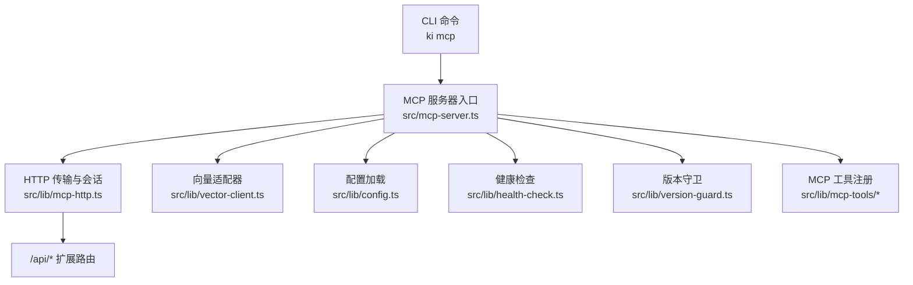
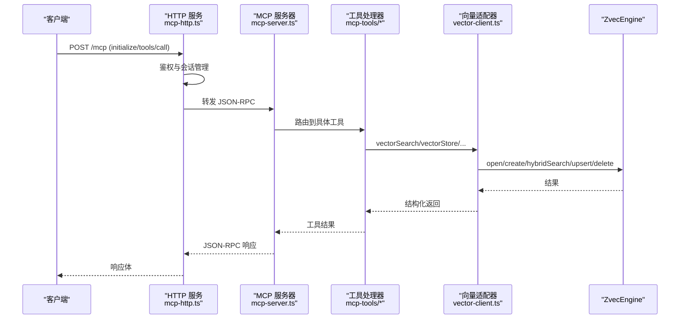
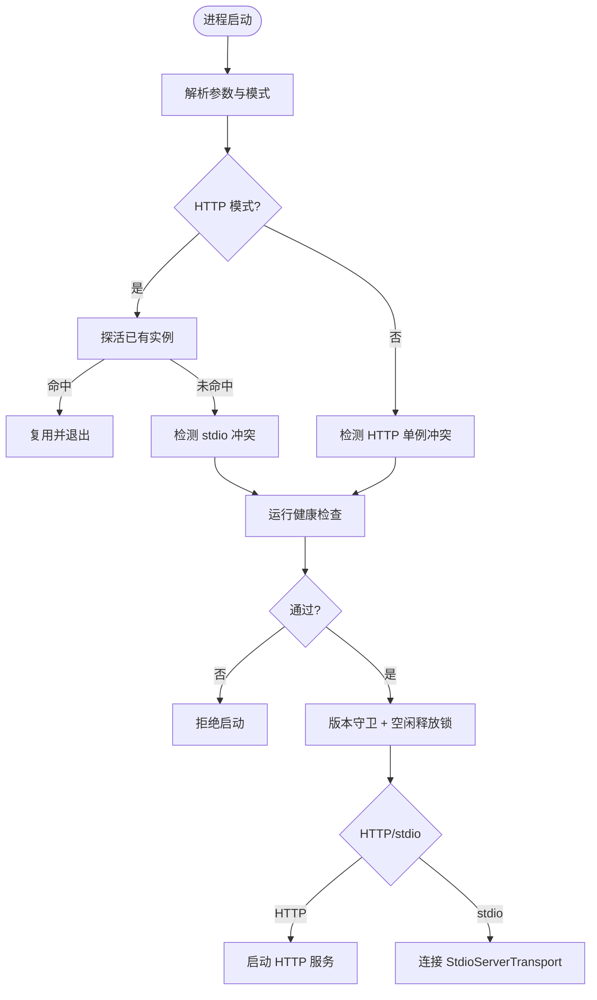
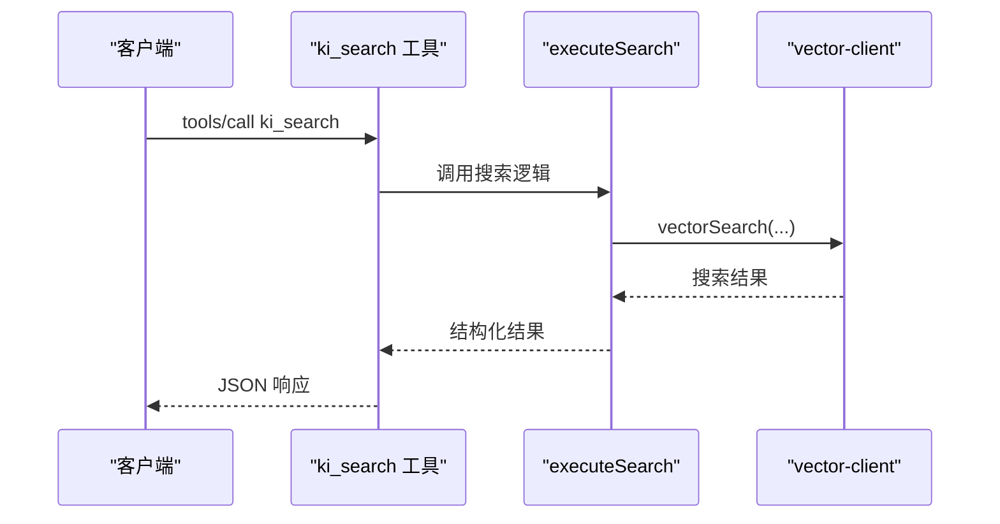
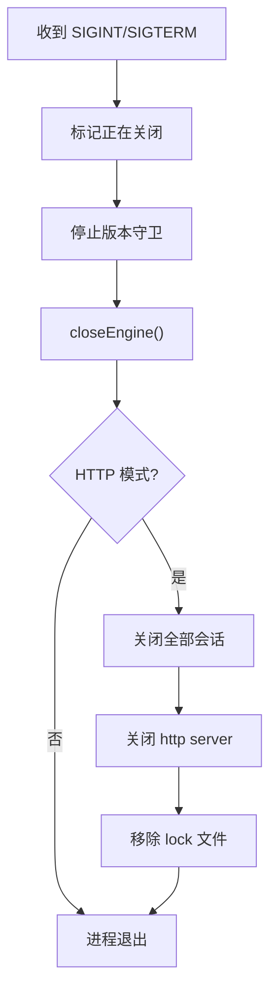
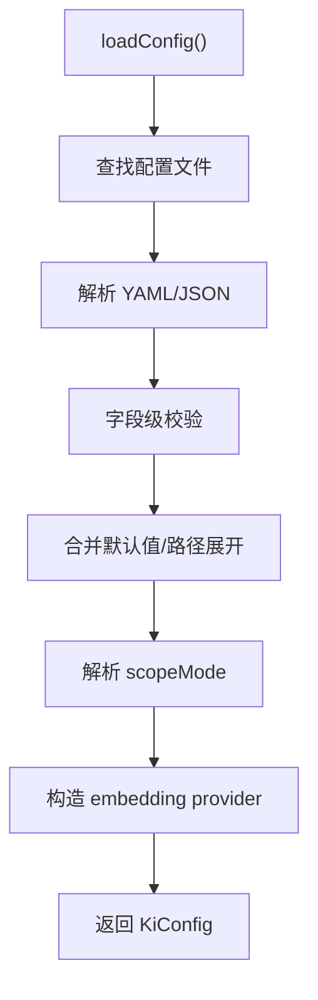
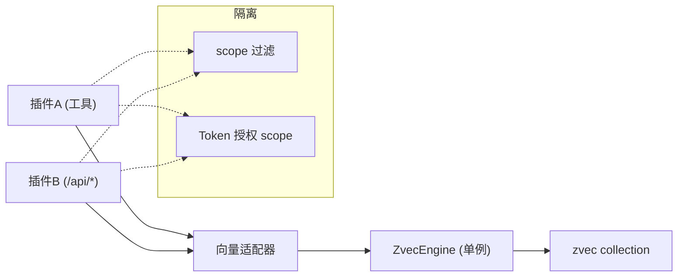
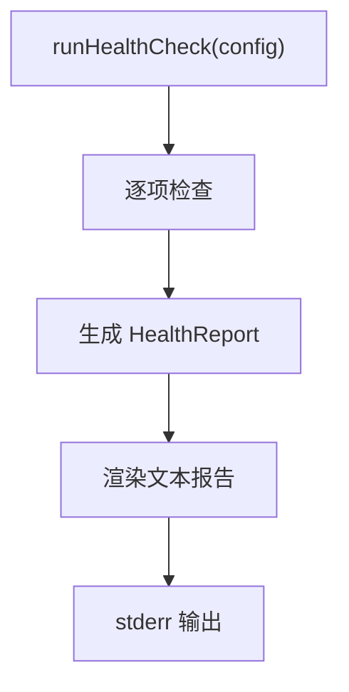
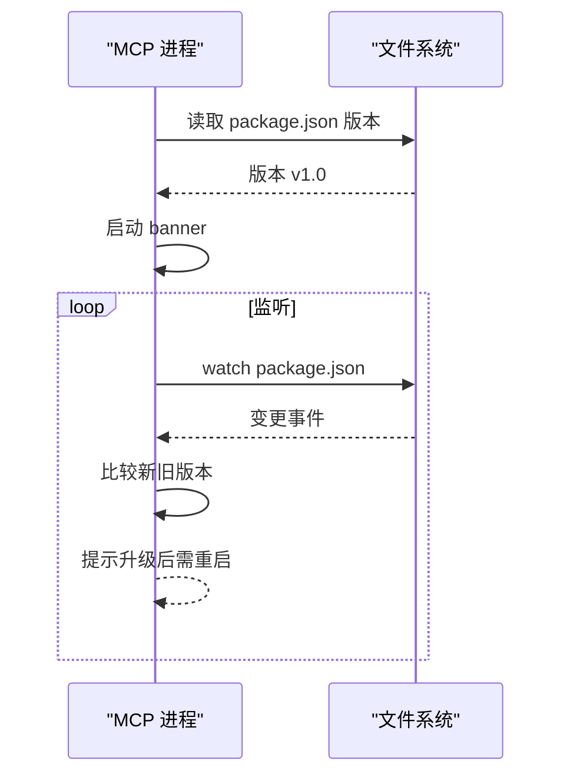
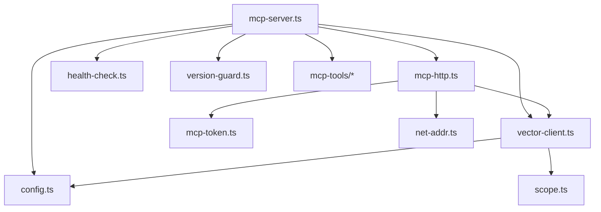

# 插件生命周期管理

<cite>
**本文引用的文件**
- [src/mcp-server.ts](file://src/mcp-server.ts)
- [src/lib/mcp-http.ts](file://src/lib/mcp-http.ts)
- [src/lib/vector-client.ts](file://src/lib/vector-client.ts)
- [src/lib/config.ts](file://src/lib/config.ts)
- [src/lib/health-check.ts](file://src/lib/health-check.ts)
- [src/lib/version-guard.ts](file://src/lib/version-guard.ts)
- [src/lib/mcp-tools/search.ts](file://src/lib/mcp-tools/search.ts)
- [src/lib/mcp-tools/store.ts](file://src/lib/mcp-tools/store.ts)
- [docs/mcp-http.md](file://docs/mcp-http.md)
</cite>

## 目录
1. [简介](#简介)
2. [项目结构](#项目结构)
3. [核心组件](#核心组件)
4. [架构总览](#架构总览)
5. [详细组件分析](#详细组件分析)
6. [依赖关系分析](#依赖关系分析)
7. [性能考量](#性能考量)
8. [故障排查指南](#故障排查指南)
9. [结论](#结论)
10. [附录](#附录)

## 简介
本文件围绕“插件”（在本仓库中体现为 MCP 工具与 HTTP 服务扩展）的生命周期管理，系统说明加载、初始化、运行、销毁各阶段机制；解释配置解析、依赖注入、事件监听器注册；阐述插件间通信、资源共享与隔离策略；给出状态监控、健康检查、优雅退出方案；并覆盖版本管理、热重载与动态更新支持。

## 项目结构
- 入口与生命周期编排：MCP Server 启动、参数解析、守护进程、HTTP 单例、预检与关闭钩子集中在 mcp-server.ts。
- HTTP 传输与会话管理：mcp-http.ts 提供 StreamableHTTPServerTransport、鉴权、会话回收、静态页面与 /api/* 扩展路由。
- 向量引擎适配：vector-client.ts 封装 ZvecEngine，提供 engine 单例、空闲释放锁、撞锁重试、检索/存储/删除等能力。
- 配置体系：config.ts 负责配置文件查找、解析、字段校验、默认值合并、scope 模式与路径展开。
- 健康检查：health-check.ts 提供统一只读诊断（配置、目录、embedding、collection）。
- 版本守卫：version-guard.ts 提供版本 banner 与升级监听提示。
- 工具层：mcp-tools/* 将 MCP 工具注册为 handler，调用上层 executeXxx 纯函数。

**图示来源**
- [src/mcp-server.ts:492-734](file://src/mcp-server.ts#L492-L734)
- [src/lib/mcp-http.ts:363-642](file://src/lib/mcp-http.ts#L363-L642)
- [src/lib/vector-client.ts:334-382](file://src/lib/vector-client.ts#L334-L382)
- [src/lib/config.ts:156-183](file://src/lib/config.ts#L156-L183)
- [src/lib/health-check.ts:150-240](file://src/lib/health-check.ts#L150-L240)
- [src/lib/version-guard.ts:31-65](file://src/lib/version-guard.ts#L31-L65)

**章节来源**
- [src/mcp-server.ts:492-734](file://src/mcp-server.ts#L492-L734)
- [src/lib/mcp-http.ts:363-642](file://src/lib/mcp-http.ts#L363-L642)

## 核心组件
- MCP 服务器与生命周期编排：负责参数解析、启动守卫、预检、HTTP/stdio 模式选择、版本守卫、空闲释放锁、优雅退出。
- HTTP 传输与会话：实现鉴权、会话创建/回收、静态页面与 /api/* 扩展路由、健康探针。
- 向量适配器：engine 单例、撞锁重试、空闲释放锁、检索/存储/删除、可用性检测。
- 配置系统：YAML/JSON 读取、字段校验、默认值合并、scope 模式、路径展开。
- 健康检查：统一诊断报告，供 doctor 与启动预检复用。
- 版本守卫：启动 banner + package.json 变更监听提示重启。
- 工具层：按工具名注册 handler，超时保护，调用业务逻辑。

**章节来源**
- [src/mcp-server.ts:492-734](file://src/mcp-server.ts#L492-L734)
- [src/lib/mcp-http.ts:363-642](file://src/lib/mcp-http.ts#L363-L642)
- [src/lib/vector-client.ts:111-124](file://src/lib/vector-client.ts#L111-L124)
- [src/lib/config.ts:252-385](file://src/lib/config.ts#L252-L385)
- [src/lib/health-check.ts:150-240](file://src/lib/health-check.ts#L150-L240)
- [src/lib/version-guard.ts:31-65](file://src/lib/version-guard.ts#L31-L65)

## 架构总览
下图展示插件（MCP 工具与 /api/* 扩展）从请求进入、鉴权、工具路由到向量引擎的完整生命周期。

**图示来源**
- [src/lib/mcp-http.ts:431-612](file://src/lib/mcp-http.ts#L431-L612)
- [src/mcp-server.ts:54-71](file://src/mcp-server.ts#L54-L71)
- [src/lib/mcp-tools/search.ts:6-49](file://src/lib/mcp-tools/search.ts#L6-L49)
- [src/lib/vector-client.ts:496-533](file://src/lib/vector-client.ts#L496-L533)

## 详细组件分析

### 插件加载与初始化
- 参数解析与模式选择：
  - stdio 模式：默认单客户端单进程，连接 StdioServerTransport。
  - HTTP 模式：构建 StreamableHTTPServerTransport，支持 --web 静态页面与 /api/* 扩展。
- 启动守卫：
  - HTTP 模式下先探活已有实例，命中则复用退出；检测 stdio 冲突并拒绝重复启动。
  - stdio 模式下若存在健康 HTTP 单例，引导迁移 URL 接入。
- 启动预检：
  - 执行 runHealthCheck(config)，输出诊断报告；存在失败项拒绝启动。
- 版本守卫：
  - 启动时打印版本/PID/时间，监听 package.json 变化提示升级后需重启。
- 空闲释放锁：
  - 常驻进程启用 enableIdleClose，空闲超时自动 closeEngine 释放 LOCK，多实例错开共享。

**图示来源**
- [src/mcp-server.ts:595-734](file://src/mcp-server.ts#L595-L734)
- [src/lib/health-check.ts:150-240](file://src/lib/health-check.ts#L150-L240)
- [src/lib/version-guard.ts:31-65](file://src/lib/version-guard.ts#L31-L65)
- [src/lib/vector-client.ts:184-201](file://src/lib/vector-client.ts#L184-L201)

**章节来源**
- [src/mcp-server.ts:595-734](file://src/mcp-server.ts#L595-L734)
- [src/lib/health-check.ts:150-240](file://src/lib/health-check.ts#L150-L240)
- [src/lib/version-guard.ts:31-65](file://src/lib/version-guard.ts#L31-L65)
- [src/lib/vector-client.ts:184-201](file://src/lib/vector-client.ts#L184-L201)

### 插件运行与事件监听
- 工具注册与调用：
  - 每个工具以 registerXxxTool(server) 形式注册，定义 schema、handler、超时保护。
  - 工具内部调用 executeXxx 纯函数，最终落到 vector-client 的 vectorSearch/vectorStore 等。
- 事件监听：
  - 当前代码库中插件（MCP 工具）不直接订阅宿主生命周期事件；生命周期由 mcp-server.ts 与 mcp-http.ts 统一管理。
  - 如需扩展事件，可在工具 handler 或 /api/* 处理器内触发自定义回调（例如在 withTimeout 前后插入日志/指标上报）。

**图示来源**
- [src/lib/mcp-tools/search.ts:6-49](file://src/lib/mcp-tools/search.ts#L6-L49)
- [src/lib/vector-client.ts:496-533](file://src/lib/vector-client.ts#L496-L533)

**章节来源**
- [src/lib/mcp-tools/search.ts:6-49](file://src/lib/mcp-tools/search.ts#L6-L49)
- [src/lib/mcp-tools/store.ts:6-44](file://src/lib/mcp-tools/store.ts#L6-L44)

### 插件销毁与优雅退出
- stdio 模式：
  - 监听 SIGINT/SIGTERM，设置 shuttingDown 标志，停止版本守卫，closeEngine，退出进程。
  - transport.onclose 触发关闭流程，避免 worker 线程悬挂。
- HTTP 模式：
  - 优雅退出：onShutdown 清理、关闭所有会话、强制断开长连接、closeEngine、关闭 http server、移除 lock 文件。
  - 兜底超时：超过固定时长强制 exit，防止残留进程持锁。

**图示来源**
- [src/mcp-server.ts:710-734](file://src/mcp-server.ts#L710-L734)
- [src/lib/mcp-http.ts:769-798](file://src/lib/mcp-http.ts#L769-L798)

**章节来源**
- [src/mcp-server.ts:710-734](file://src/mcp-server.ts#L710-L734)
- [src/lib/mcp-http.ts:769-798](file://src/lib/mcp-http.ts#L769-L798)

### 配置解析与依赖注入
- 配置加载：
  - 优先级：命令行 --config > $HOME/.ki/config.yaml/yml/json > 内置默认。
  - 字段级校验：语法正确后仍进行字段名/类型/取值校验，非法则 fail-loud。
  - 路径展开：$HOME/~/ 与相对路径基于配置文件目录解析。
- 依赖注入：
  - 向量适配器从 config.embedding 构造 provider，apiKey 仅支持明文或 ${ENV_VAR} 引用，不做隐式回退。
  - scope 模式：strict 模式下必须显式传入且在白名单内，否则抛错。

**图示来源**
- [src/lib/config.ts:156-183](file://src/lib/config.ts#L156-L183)
- [src/lib/config.ts:252-385](file://src/lib/config.ts#L252-L385)
- [src/lib/vector-client.ts:267-286](file://src/lib/vector-client.ts#L267-L286)

**章节来源**
- [src/lib/config.ts:156-183](file://src/lib/config.ts#L156-L183)
- [src/lib/config.ts:252-385](file://src/lib/config.ts#L252-L385)
- [src/lib/vector-client.ts:267-286](file://src/lib/vector-client.ts#L267-L286)

### 插件间通信、资源共享与隔离
- 通信机制：
  - 插件之间通过 MCP 工具与 /api/* 扩展进行交互；HTTP 模式下每个 initialize 新建一个 McpServer 实例，共享模块级 engine 单例。
- 资源共享：
  - 向量库（zvec collection）为单进程独占锁，通过空闲释放锁与撞锁重试实现多实例错开共享。
  - 配置与版本信息通过模块级缓存与文件监听共享。
- 隔离策略：
  - scope 隔离：查询/写入均按 scope 过滤；strict 模式强制白名单。
  - 鉴权隔离：非回环绑定强制 Bearer Token，按 Token 授权 scope 集合做越权拦截。

**图示来源**
- [src/lib/vector-client.ts:334-382](file://src/lib/vector-client.ts#L334-L382)
- [src/lib/mcp-http.ts:476-561](file://src/lib/mcp-http.ts#L476-L561)
- [src/lib/config.ts:470-485](file://src/lib/config.ts#L470-L485)

**章节来源**
- [src/lib/vector-client.ts:334-382](file://src/lib/vector-client.ts#L334-L382)
- [src/lib/mcp-http.ts:476-561](file://src/lib/mcp-http.ts#L476-L561)
- [src/lib/config.ts:470-485](file://src/lib/config.ts#L470-L485)

### 状态监控与健康检查
- 健康检查：
  - 统一 runHealthCheck 输出 pass/warn/fail 报告，包含配置文件、目录、apiKey、embedding 连通性/密钥/维度、collection 状态。
- 运行时监控：
  - /healthz 返回服务名、PID、版本、鉴权失败次数等；/api/health 暴露更细粒度健康报告。
- 状态可见性：
  - ki mcp --status 汇总 HTTP lock、stdio 实例、token 数量等信息。

**图示来源**
- [src/lib/health-check.ts:150-240](file://src/lib/health-check.ts#L150-L240)
- [docs/mcp-http.md:72-100](file://docs/mcp-http.md#L72-L100)

**章节来源**
- [src/lib/health-check.ts:150-240](file://src/lib/health-check.ts#L150-L240)
- [docs/mcp-http.md:72-100](file://docs/mcp-http.md#L72-L100)

### 版本管理、热重载与动态更新
- 版本管理：
  - readKiVersion 读取 package.json 版本；startVersionGuard 启动 banner 并监听 package.json 变化，检测到升级后提示重启。
- 热重载：
  - 长驻进程不会热加载新代码；升级后需重启 MCP 服务（ki mcp restart 或重新拉起）。
- 动态更新：
  - 工具与 /api/* 扩展通过 HTTP 会话按需加载；但底层代码变更仍需重启生效。

**图示来源**
- [src/lib/version-guard.ts:17-65](file://src/lib/version-guard.ts#L17-L65)

**章节来源**
- [src/lib/version-guard.ts:17-65](file://src/lib/version-guard.ts#L17-L65)

## 依赖关系分析
- mcp-server.ts 依赖：
  - mcp-http.ts（HTTP 传输与会话）、vector-client.ts（引擎适配）、config.ts（配置）、health-check.ts（预检）、version-guard.ts（版本守卫）、mcp-tools/*（工具注册）。
- mcp-http.ts 依赖：
  - version-guard.ts（版本）、mcp-token.ts（鉴权）、net-addr.ts（地址判定）、mcp-stdio-lock.ts（stdio 冲突检测）、vector-client.ts（撞锁来源标注）。
- vector-client.ts 依赖：
  - config.ts（embedding/vectorDir/scope）、scope.ts（scope 校验）、interrupt.ts（中断引导）。

**图示来源**
- [src/mcp-server.ts:1-38](file://src/mcp-server.ts#L1-L38)
- [src/lib/mcp-http.ts:17-35](file://src/lib/mcp-http.ts#L17-L35)
- [src/lib/vector-client.ts:16-34](file://src/lib/vector-client.ts#L16-L34)

**章节来源**
- [src/mcp-server.ts:1-38](file://src/mcp-server.ts#L1-L38)
- [src/lib/mcp-http.ts:17-35](file://src/lib/mcp-http.ts#L17-L35)
- [src/lib/vector-client.ts:16-34](file://src/lib/vector-client.ts#L16-L34)

## 性能考量
- 向量引擎空闲释放锁：常驻进程空闲超时自动 closeEngine，降低锁争用，提升多实例并发吞吐。
- 撞锁重试：probeWithRetry 在 locked 时等待并重试，避免瞬时拥塞导致失败。
- 会话回收：HTTP 模式定期回收空闲会话，限制最大会话数，防止内存泄漏。
- 超时保护：工具 handler 使用 withTimeout 限制执行时间，避免长尾阻塞。

[本节为通用指导，不直接分析具体文件]

## 故障排查指南
- 启动预检失败：
  - 查看 stderr 输出的健康报告，定位 ❌ 项（如 apiKey 缺失、embedding 不可达、dimension 不匹配）。
- 向量库被占用：
  - 出现 CollectionLockedException 时，参考 lockedHint 提示：停止其他 ki 实例、等待锁释放、必要时重建向量库。
- 鉴权失败：
  - 非回环绑定需 Bearer Token；/healthz 显示 authFailures；服务端 stderr 记录失败原因与来源。
- 端口占用：
  - describeListenError 提供 EADDRINUSE/EACCES 等错误翻译与修复建议。

**章节来源**
- [src/lib/health-check.ts:150-240](file://src/lib/health-check.ts#L150-L240)
- [src/lib/vector-client.ts:72-87](file://src/lib/vector-client.ts#L72-L87)
- [src/lib/mcp-http.ts:377-391](file://src/lib/mcp-http.ts#L377-L391)
- [src/lib/mcp-http.ts:644-665](file://src/lib/mcp-http.ts#L644-L665)

## 结论
本仓库通过 MCP Server 与 HTTP 传输实现了插件（工具与扩展）的完整生命周期管理：启动前预检、运行时鉴权与会话管理、向量引擎共享与隔离、优雅退出与资源释放；同时提供健康检查、版本守卫与可观测性接口。对于热重载，采用“升级后重启”的安全策略，确保长驻进程行为一致性与可维护性。

## 附录
- 快速开始与常用命令：
  - ki mcp --http --web：启动 HTTP 服务并附带前端页面。
  - ki mcp --status：查看实例状态与鉴权失败统计。
  - ki mcp stop/restart：一键关闭或后台重启 HTTP 单例。
- 扩展点建议：
  - 在工具 handler 或 /api/* 处理器中增加指标上报与审计日志。
  - 通过 vector-client.runWithVectorSource 标注操作来源，便于撞锁日志追踪。

[本节为补充说明，不直接分析具体文件]